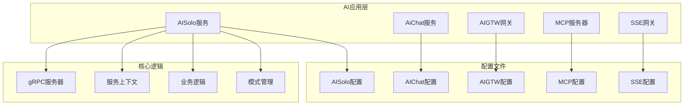
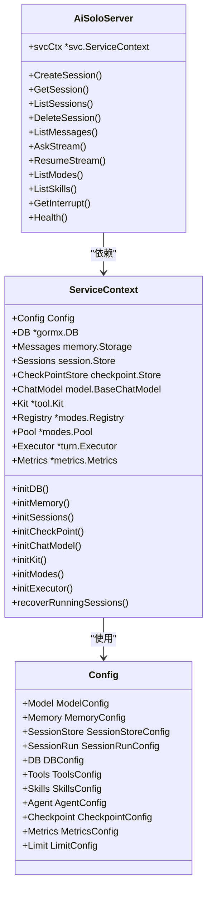
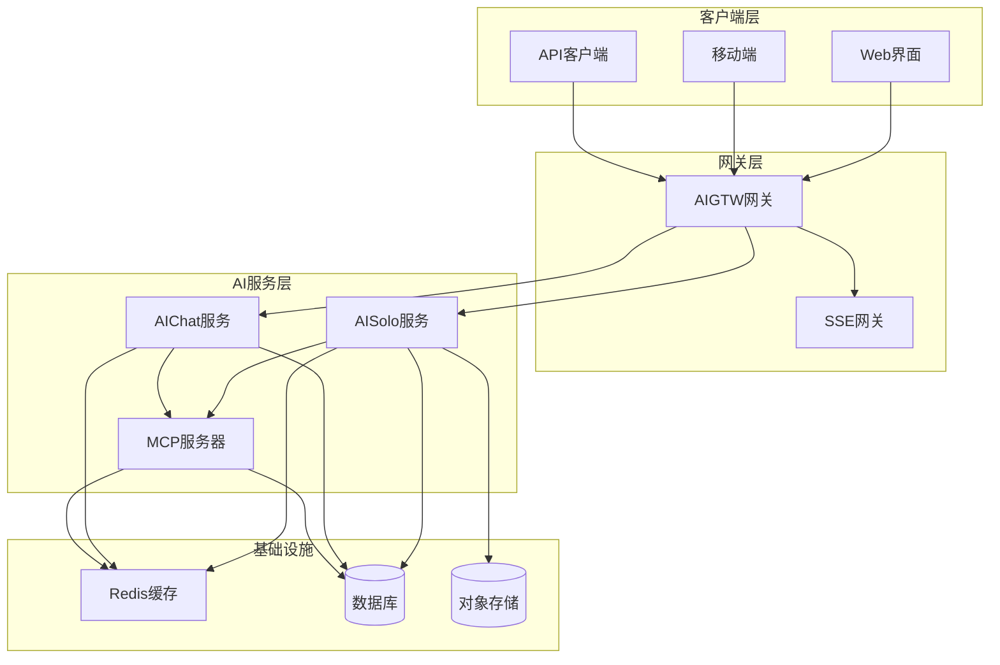
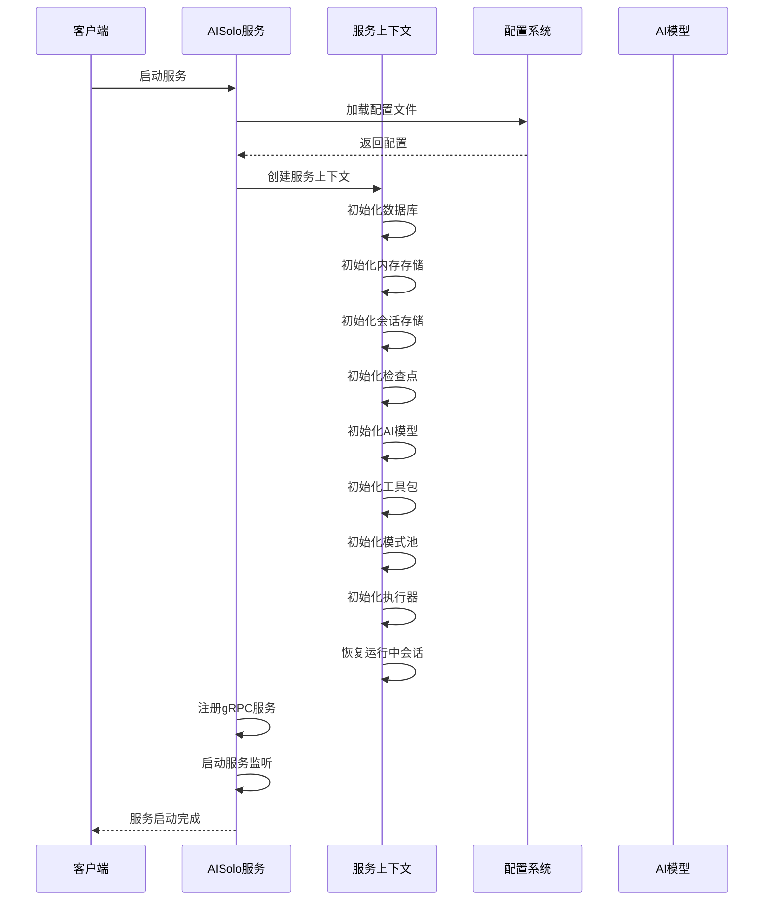
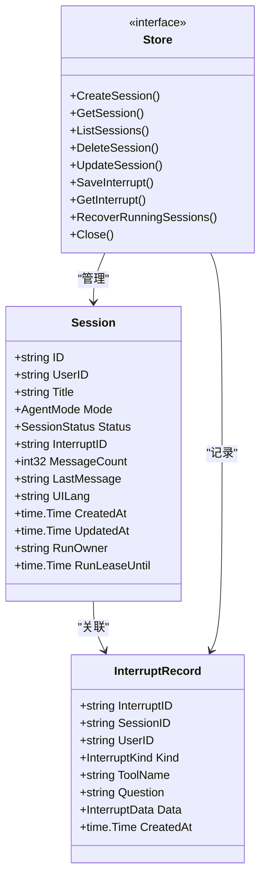
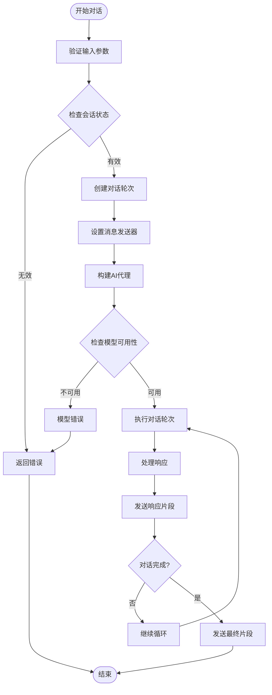
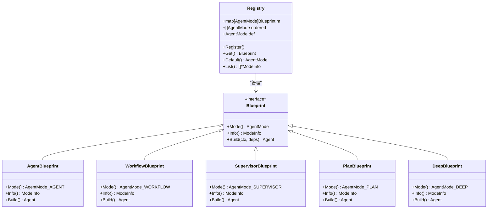
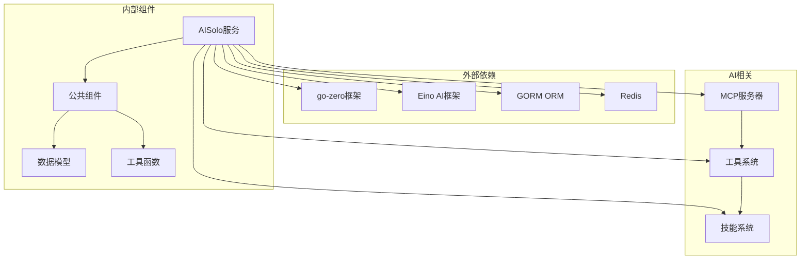
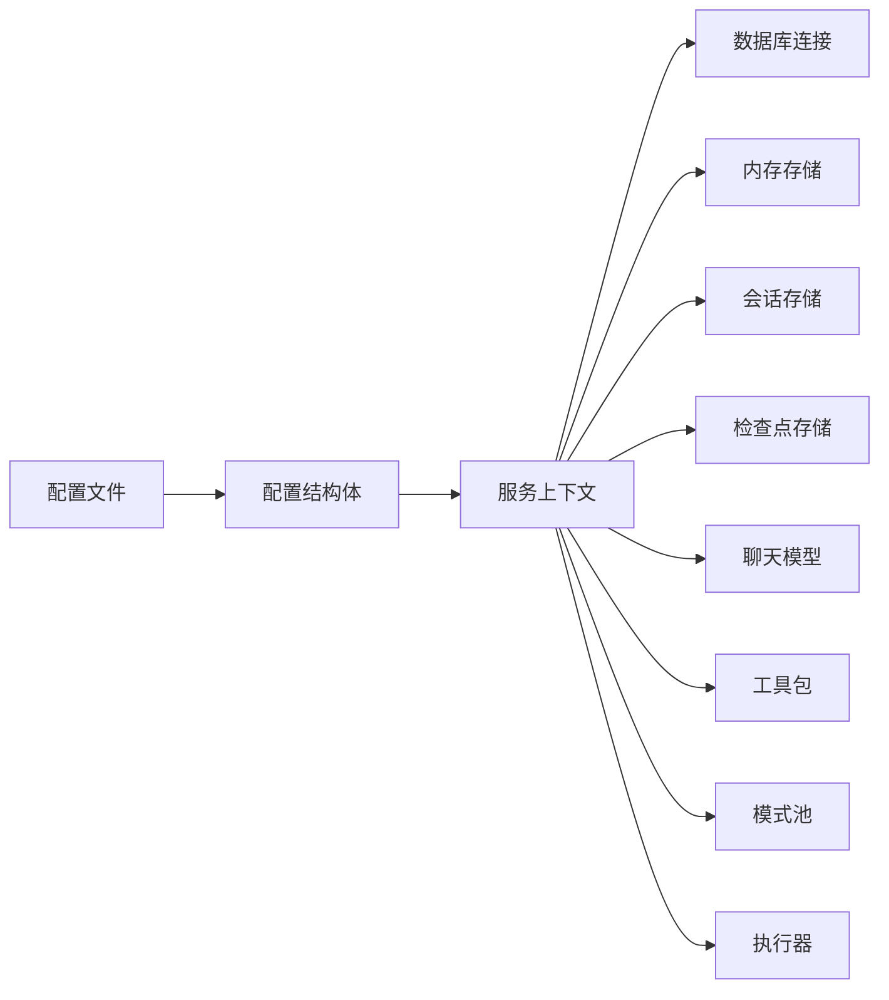

# AISolo AI服务

<cite>
**本文档引用的文件**
- [README.md](file://README.md)
- [aisolo.go](file://aiapp/aisolo/aisolo.go)
- [aichat.go](file://aiapp/aichat/aichat.go)
- [aigtw.go](file://aiapp/aigtw/aigtw.go)
- [mcpserver.go](file://aiapp/mcpserver/mcpserver.go)
- [ssegtw.go](file://aiapp/ssegtw/ssegtw.go)
- [aisolo.yaml](file://aiapp/aisolo/etc/aisolo.yaml)
- [aichat.yaml](file://aiapp/aichat/etc/aichat.yaml)
- [aigtw.yaml](file://aiapp/aigtw/etc/aigtw.yaml)
- [mcpserver.yaml](file://aiapp/mcpserver/etc/mcpserver.yaml)
- [ssegtw.yaml](file://aiapp/ssegtw/etc/ssegtw.yaml)
- [config.go](file://aiapp/aisolo/internal/config/config.go)
- [aisoloserver.go](file://aiapp/aisolo/internal/server/aisoloserver.go)
- [servicecontext.go](file://aiapp/aisolo/internal/svc/servicecontext.go)
- [createsessionlogic.go](file://aiapp/aisolo/internal/logic/createsessionlogic.go)
- [askstreamlogic.go](file://aiapp/aisolo/internal/logic/askstreamlogic.go)
- [modes.go](file://aiapp/aisolo/internal/modes/modes.go)
- [types.go](file://aiapp/aisolo/internal/session/types.go)
</cite>

## 目录
1. [简介](#简介)
2. [项目结构](#项目结构)
3. [核心组件](#核心组件)
4. [架构概览](#架构概览)
5. [详细组件分析](#详细组件分析)
6. [依赖关系分析](#依赖关系分析)
7. [性能考虑](#性能考虑)
8. [故障排除指南](#故障排除指南)
9. [结论](#结论)

## 简介

AISolo AI服务是基于go-zero微服务框架构建的智能对话服务，专注于提供高效的AI对话能力和会话管理功能。该服务采用模块化设计，支持多种AI模型提供商，具备强大的工具调用能力和会话持久化功能。

AISolo服务的核心特性包括：
- 多模态对话支持（Agent、Workflow、Supervisor、Plan、Deep模式）
- 流式对话响应
- 会话状态管理和中断恢复
- 工具调用和技能系统
- 多种存储后端支持（内存、JSONL、GORMX）
- 分布式部署支持

## 项目结构

AISolo AI服务位于`aiapp/`目录下，包含以下主要子模块：

**图表来源**
- [aisolo.go:1-58](file://aiapp/aisolo/aisolo.go#L1-L58)
- [aichat.go:1-50](file://aiapp/aichat/aichat.go#L1-L50)
- [aigtw.go:1-127](file://aiapp/aigtw/aigtw.go#L1-L127)

**章节来源**
- [README.md:110-189](file://README.md#L110-L189)
- [aisolo.go:1-58](file://aiapp/aisolo/aisolo.go#L1-L58)
- [aichat.go:1-50](file://aiapp/aichat/aichat.go#L1-L50)
- [aigtw.go:1-127](file://aiapp/aigtw/aigtw.go#L1-L127)

## 核心组件

### AISolo服务核心组件

AISolo服务采用分层架构设计，主要包括以下核心组件：

**图表来源**
- [servicecontext.go:23-50](file://aiapp/aisolo/internal/svc/servicecontext.go#L23-L50)
- [aisoloserver.go:15-24](file://aiapp/aisolo/internal/server/aisoloserver.go#L15-L24)
- [config.go:12-28](file://aiapp/aisolo/internal/config/config.go#L12-L28)

### 配置管理系统

AISolo服务采用灵活的配置管理机制，支持多种配置选项：

| 配置类别 | 关键参数 | 默认值 | 说明 |
|---------|---------|--------|------|
| 模型配置 | Provider, Model, APIKey | ark, deepseek-v3-2-251201 | AI模型提供商和参数 |
| 内存配置 | Type, BaseDir | memory, ./data/messages | 对话历史存储后端 |
| 会话配置 | Type, BaseDir, LeaseTTL | memory, ./data/sessions, 30m | 会话状态存储和租约管理 |
| 工具配置 | Enabled, Timeout, MaxRetries | true, 30s, 3 | 工具调用参数 |
| 技能配置 | Dir, Enabled | ./skills, true | 技能系统目录 |

**章节来源**
- [config.go:137-199](file://aiapp/aisolo/internal/config/config.go#L137-L199)
- [aisolo.yaml:9-79](file://aiapp/aisolo/etc/aisolo.yaml#L9-L79)

### 与向量知识库（RAG）的关系

向量集合的创建、入库与检索由 **AI 网关（aigtw）** 的 `common/einox/rag` 与 `/solo/v1/rag/*` 提供；aisolo 进程内不再初始化 Rag 服务，也不在 `Ask` 请求中通过已废弃的 `meta` 字段做隐式检索注入。若要让模型使用知识库，应在 Agent 侧挂载检索类工具（或由模型经 skill 中间件自行选择技能）。

## 架构概览

AISolo AI服务采用微服务架构，与其他AI相关服务协同工作：

**图表来源**
- [aigtw.go:34-126](file://aiapp/aigtw/aigtw.go#L34-L126)
- [aisolo.go:24-57](file://aiapp/aisolo/aisolo.go#L24-L57)
- [aichat.go:24-49](file://aiapp/aichat/aichat.go#L24-L49)

### 服务启动流程

**图表来源**
- [aisolo.go:24-57](file://aiapp/aisolo/aisolo.go#L24-L57)
- [servicecontext.go:52-70](file://aiapp/aisolo/internal/svc/servicecontext.go#L52-L70)

## 详细组件分析

### 会话管理系统

AISolo服务的会话管理系统是其核心功能之一，负责管理用户的对话会话状态：

**图表来源**
- [types.go:18-50](file://aiapp/aisolo/internal/session/types.go#L18-L50)
- [types.go:54-72](file://aiapp/aisolo/internal/session/types.go#L54-L72)

### 对话执行器

对话执行器是AISolo服务的核心处理组件，负责协调整个对话流程：

**图表来源**
- [askstreamlogic.go:30-59](file://aiapp/aisolo/internal/logic/askstreamlogic.go#L30-L59)

**章节来源**
- [createsessionlogic.go:29-45](file://aiapp/aisolo/internal/logic/createsessionlogic.go#L29-L45)
- [askstreamlogic.go:30-59](file://aiapp/aisolo/internal/logic/askstreamlogic.go#L30-L59)
- [types.go:18-95](file://aiapp/aisolo/internal/session/types.go#L18-L95)

### 模式管理系统

AISolo服务支持多种对话模式，每种模式都有其特定的处理逻辑：

**图表来源**
- [modes.go:41-46](file://aiapp/aisolo/internal/modes/modes.go#L41-L46)
- [modes.go:48-104](file://aiapp/aisolo/internal/modes/modes.go#L48-L104)

**章节来源**
- [modes.go:13-113](file://aiapp/aisolo/internal/modes/modes.go#L13-L113)

## 依赖关系分析

AISolo服务的依赖关系复杂而有序，主要依赖于以下核心组件：

**图表来源**
- [servicecontext.go:3-21](file://aiapp/aisolo/internal/svc/servicecontext.go#L3-L21)
- [aisolo.go:3-20](file://aiapp/aisolo/aisolo.go#L3-L20)

### 配置依赖关系

**图表来源**
- [config.go:12-28](file://aiapp/aisolo/internal/config/config.go#L12-L28)
- [servicecontext.go:52-70](file://aiapp/aisolo/internal/svc/servicecontext.go#L52-L70)

**章节来源**
- [servicecontext.go:23-103](file://aiapp/aisolo/internal/svc/servicecontext.go#L23-L103)
- [config.go:1-199](file://aiapp/aisolo/internal/config/config.go#L1-L199)

## 性能考虑

AISolo服务在设计时充分考虑了性能优化：

### 并发控制
- 最大并发数限制：100
- 请求速率限制：50每秒
- 请求超时时间：300秒

### 内存管理
- 支持三种存储后端：内存、JSONL、GORMX
- 智能内存回收机制
- 会话状态持久化

### 模型优化
- Agent池化管理
- 模型预加载
- 缓存策略

## 故障排除指南

### 常见问题诊断

1. **模型配置错误**
   - 检查API密钥是否正确设置
   - 验证模型提供商配置
   - 确认网络连接正常

2. **会话管理问题**
   - 检查会话存储后端可用性
   - 验证会话ID格式
   - 查看会话状态转换日志

3. **工具调用失败**
   - 检查工具配置参数
   - 验证工具执行权限
   - 查看工具执行超时设置

### 日志分析

服务提供了详细的日志记录机制：
- 全局日志字段包含应用名称
- gRPC拦截器记录请求响应
- 详细的错误堆栈信息

**章节来源**
- [aisolo.go:49-50](file://aiapp/aisolo/aisolo.go#L49-L50)
- [servicecontext.go:75-87](file://aiapp/aisolo/internal/svc/servicecontext.go#L75-L87)

## 结论

AISolo AI服务是一个功能完整、架构清晰的智能对话服务平台。其设计特点包括：

1. **模块化设计**：清晰的分层架构，易于维护和扩展
2. **多模式支持**：支持多种对话模式，适应不同应用场景
3. **灵活配置**：丰富的配置选项，满足不同部署需求
4. **高性能**：优化的并发控制和内存管理
5. **可扩展性**：良好的插件机制和工具系统

该服务为AI应用开发提供了坚实的基础，支持从简单的对话机器人到复杂的AI助手的各种需求。通过合理的配置和部署，可以轻松构建企业级的AI对话应用。