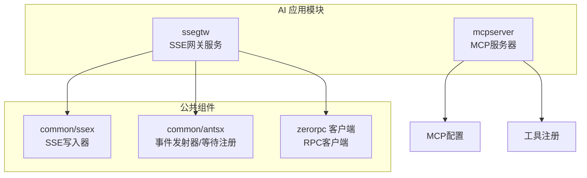
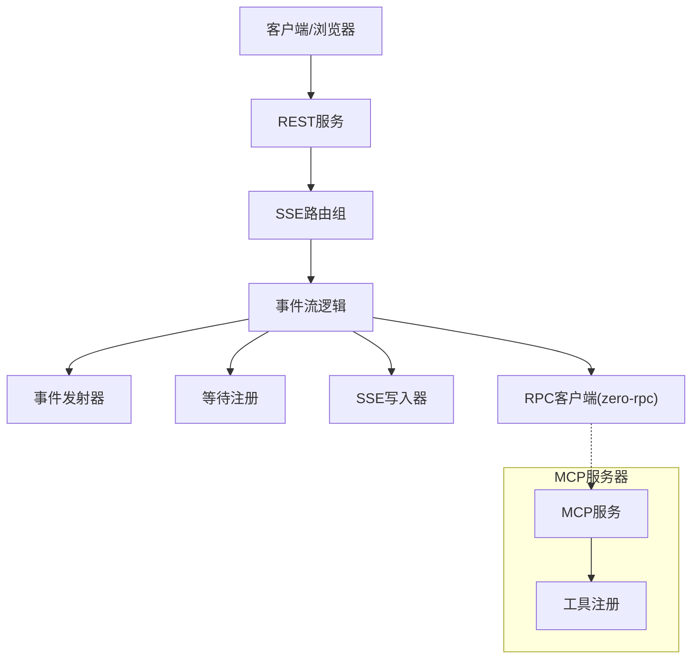
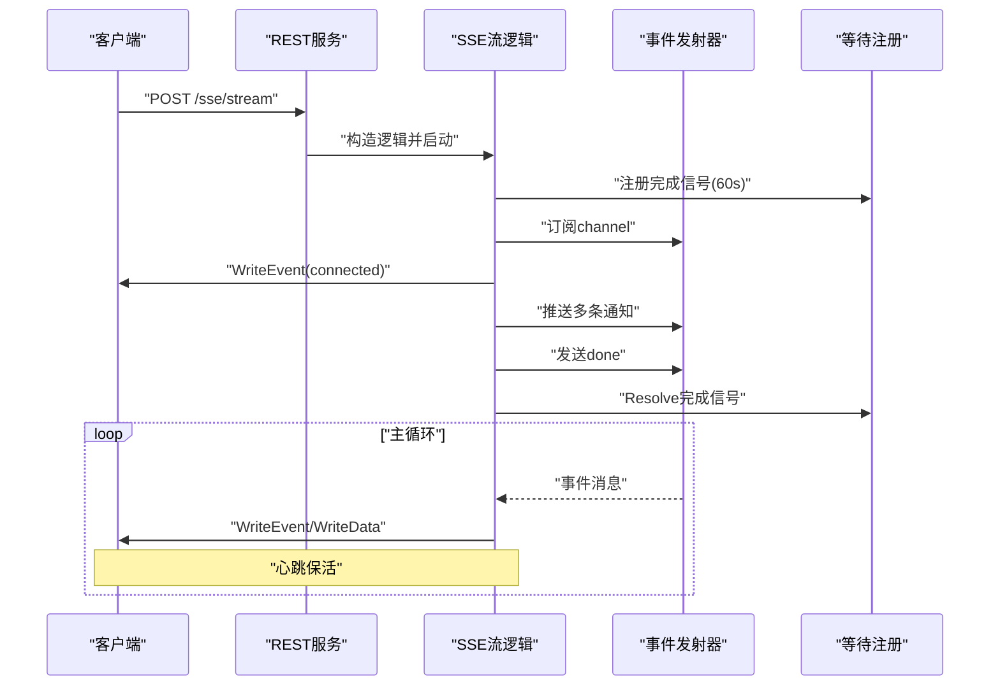
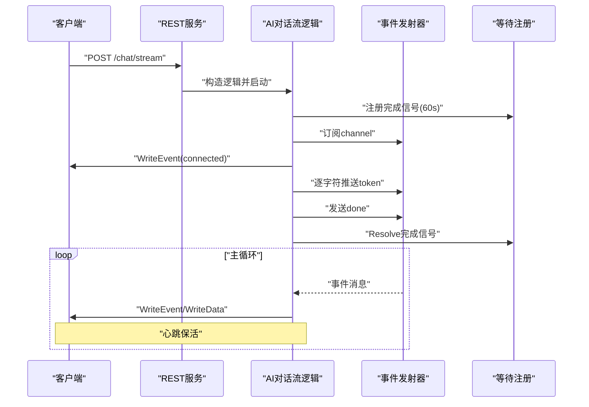
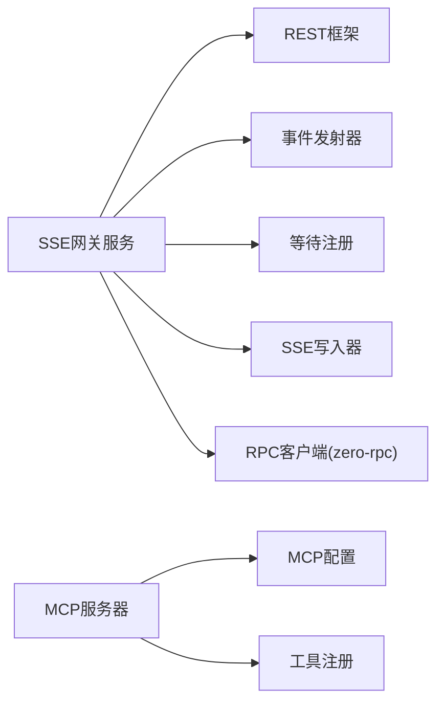

# AI应用模块

<cite>
**本文引用的文件**
- [aiapp/ssegtw/ssegtw.go](file://aiapp/ssegtw/ssegtw.go)
- [aiapp/ssegtw/etc/ssegtw.yaml](file://aiapp/ssegtw/etc/ssegtw.yaml)
- [aiapp/ssegtw/internal/config/config.go](file://aiapp/ssegtw/internal/config/config.go)
- [aiapp/ssegtw/internal/handler/routes.go](file://aiapp/ssegtw/internal/handler/routes.go)
- [aiapp/ssegtw/internal/logic/sse/chatstreamlogic.go](file://aiapp/ssegtw/internal/logic/sse/chatstreamlogic.go)
- [aiapp/ssegtw/internal/logic/sse/ssestreamlogic.go](file://aiapp/ssegtw/internal/logic/sse/ssestreamlogic.go)
- [aiapp/ssegtw/internal/svc/servicecontext.go](file://aiapp/ssegtw/internal/svc/servicecontext.go)
- [aiapp/ssegtw/internal/types/types.go](file://aiapp/ssegtw/internal/types/types.go)
- [common/ssex/writer.go](file://common/ssex/writer.go)
- [aiapp/ssegtw/sse_demo.html](file://aiapp/ssegtw/sse_demo.html)
- [aiapp/ssegtw/Dockerfile](file://aiapp/ssegtw/Dockerfile)
- [aiapp/ssegtw/deploy.sh](file://aiapp/ssegtw/deploy.sh)
- [aiapp/mcpserver/mcpserver.go](file://aiapp/mcpserver/mcpserver.go)
- [aiapp/mcpserver/etc/mcpserver.yaml](file://aiapp/mcpserver/etc/mcpserver.yaml)
- [aiapp/ssegtw/ssegtw.api](file://aiapp/ssegtw/ssegtw.api)
</cite>

## 目录
1. [简介](#简介)
2. [项目结构](#项目结构)
3. [核心组件](#核心组件)
4. [架构总览](#架构总览)
5. [详细组件分析](#详细组件分析)
6. [依赖分析](#依赖分析)
7. [性能考量](#性能考量)
8. [故障排查指南](#故障排查指南)
9. [结论](#结论)
10. [附录](#附录)

## 简介
本技术文档聚焦Zero-Service的AI应用模块，围绕两个核心子系统展开：
- SSE网关服务（ssegtw）：基于Server-Sent Events的事件流网关，支持AI对话流与通用事件流，具备心跳保活、通道隔离、完成信号注册等能力。
- MCP服务器（mcpserver）：提供标准化的AI工具调用接口，支持工具注册与跨域配置。

文档将从架构设计、数据流、处理逻辑、集成方式、部署运维、API接口、客户端示例、性能优化与最佳实践等方面进行系统性阐述，帮助开发者快速理解并稳定交付AI应用。

## 项目结构
AI应用模块位于aiapp目录下，包含两个主要子工程：
- ssegtw：SSE网关服务，提供REST接口与SSE事件流能力，内置前端测试页面。
- mcpserver：MCP协议服务器，提供工具注册与调用能力。

图表来源
- [aiapp/ssegtw/ssegtw.go:26-59](file://aiapp/ssegtw/ssegtw.go#L26-L59)
- [aiapp/mcpserver/mcpserver.go:19-75](file://aiapp/mcpserver/mcpserver.go#L19-L75)

章节来源
- [aiapp/ssegtw/ssegtw.go:1-60](file://aiapp/ssegtw/ssegtw.go#L1-L60)
- [aiapp/mcpserver/mcpserver.go:1-76](file://aiapp/mcpserver/mcpserver.go#L1-L76)

## 核心组件
- SSE网关服务（ssegtw）
  - REST服务入口与CORS配置
  - SSE路由注册（/ssegtw/v1/sse/stream、/ssegtw/v1/sse/chat/stream）
  - 事件流逻辑：通用SSE事件流与AI对话流
  - 事件写入器：封装SSE协议写入与Flush
  - 服务上下文：事件发射器、等待注册、RPC客户端
- MCP服务器（mcpserver）
  - MCP服务启动与配置
  - 工具注册（示例：echo工具）
  - 跨域配置与消息超时设置

章节来源
- [aiapp/ssegtw/internal/handler/routes.go:17-50](file://aiapp/ssegtw/internal/handler/routes.go#L17-L50)
- [aiapp/ssegtw/internal/logic/sse/ssestreamlogic.go:39-117](file://aiapp/ssegtw/internal/logic/sse/ssestreamlogic.go#L39-L117)
- [aiapp/ssegtw/internal/logic/sse/chatstreamlogic.go:39-120](file://aiapp/ssegtw/internal/logic/sse/chatstreamlogic.go#L39-L120)
- [common/ssex/writer.go:14-54](file://common/ssex/writer.go#L14-L54)
- [aiapp/ssegtw/internal/svc/servicecontext.go:23-38](file://aiapp/ssegtw/internal/svc/servicecontext.go#L23-L38)
- [aiapp/mcpserver/mcpserver.go:28-75](file://aiapp/mcpserver/mcpserver.go#L28-L75)

## 架构总览
SSE网关服务采用“REST + SSE”的组合模式：
- REST层负责健康检查与SSE路由注册
- SSE层通过事件发射器与等待注册实现“通道隔离 + 完成信号”机制
- 事件写入器统一处理SSE协议格式与Flush
- MCP服务器提供标准化工具调用接口，便于与AI模型或外部工具对接

图表来源
- [aiapp/ssegtw/ssegtw.go:35-49](file://aiapp/ssegtw/ssegtw.go#L35-L49)
- [aiapp/ssegtw/internal/handler/routes.go:17-36](file://aiapp/ssegtw/internal/handler/routes.go#L17-L36)
- [aiapp/ssegtw/internal/logic/sse/chatstreamlogic.go:39-120](file://aiapp/ssegtw/internal/logic/sse/chatstreamlogic.go#L39-L120)
- [aiapp/ssegtw/internal/logic/sse/ssestreamlogic.go:39-117](file://aiapp/ssegtw/internal/logic/sse/ssestreamlogic.go#L39-L117)
- [common/ssex/writer.go:14-54](file://common/ssex/writer.go#L14-L54)
- [aiapp/ssegtw/internal/svc/servicecontext.go:23-38](file://aiapp/ssegtw/internal/svc/servicecontext.go#L23-L38)
- [aiapp/mcpserver/mcpserver.go:28-75](file://aiapp/mcpserver/mcpserver.go#L28-L75)

## 详细组件分析

### SSE网关服务（ssegtw）

#### 服务入口与配置
- 解析配置文件，打印Go版本，启用CORS，创建REST服务，注册路由，加入服务组并启动
- 配置项包括服务名、监听地址、端口、日志路径、RPC端点、超时等

章节来源
- [aiapp/ssegtw/ssegtw.go:26-59](file://aiapp/ssegtw/ssegtw.go#L26-L59)
- [aiapp/ssegtw/etc/ssegtw.yaml:1-14](file://aiapp/ssegtw/etc/ssegtw.yaml#L1-L14)
- [aiapp/ssegtw/internal/config/config.go:11-14](file://aiapp/ssegtw/internal/config/config.go#L11-L14)

#### 路由与SSE注册
- SSE路由组：/ssegtw/v1/sse/stream（SSE事件流）、/ssegtw/v1/sse/chat/stream（AI对话流）
- 普通路由组：/ssegtw/v1/ping（健康检查）
- 使用rest.WithSSE()启用SSE支持

章节来源
- [aiapp/ssegtw/internal/handler/routes.go:17-50](file://aiapp/ssegtw/internal/handler/routes.go#L17-L50)
- [aiapp/ssegtw/ssegtw.api:24-38](file://aiapp/ssegtw/ssegtw.api#L24-L38)

#### 事件流逻辑（通用SSE）
- 生成或使用channel，注册完成信号，订阅事件流
- 发送connected事件，启动模拟worker推送多条通知，最后发送done并Resolve完成信号
- 主循环按事件或心跳写入客户端，收到取消信号或通道关闭时结束

图表来源
- [aiapp/ssegtw/internal/logic/sse/ssestreamlogic.go:39-117](file://aiapp/ssegtw/internal/logic/sse/ssestreamlogic.go#L39-L117)
- [common/ssex/writer.go:23-54](file://common/ssex/writer.go#L23-L54)

章节来源
- [aiapp/ssegtw/internal/logic/sse/ssestreamlogic.go:39-117](file://aiapp/ssegtw/internal/logic/sse/ssestreamlogic.go#L39-L117)

#### 事件流逻辑（AI对话流）
- 生成或使用channel，注册完成信号，订阅事件流
- 发送connected事件，启动模拟worker按字符粒度输出token，最后发送done并Resolve完成信号
- 主循环按事件或心跳写入客户端，支持心跳保活

图表来源
- [aiapp/ssegtw/internal/logic/sse/chatstreamlogic.go:39-120](file://aiapp/ssegtw/internal/logic/sse/chatstreamlogic.go#L39-L120)
- [common/ssex/writer.go:23-54](file://common/ssex/writer.go#L23-L54)

章节来源
- [aiapp/ssegtw/internal/logic/sse/chatstreamlogic.go:39-120](file://aiapp/ssegtw/internal/logic/sse/chatstreamlogic.go#L39-L120)

#### 事件写入器（SSEWriter）
- 封装SSE协议写入：WriteEvent、WriteData、WriteComment、WriteKeepAlive
- 强制Flush以保证客户端及时接收

章节来源
- [common/ssex/writer.go:14-54](file://common/ssex/writer.go#L14-L54)

#### 服务上下文（ServiceContext）
- SSEEvent结构体：事件名与数据
- ServiceContext聚合：RPC客户端、事件发射器、等待注册
- 初始化时创建RPC客户端、事件发射器、等待注册（默认TTL 60s）

章节来源
- [aiapp/ssegtw/internal/svc/servicecontext.go:17-38](file://aiapp/ssegtw/internal/svc/servicecontext.go#L17-L38)

#### 请求类型定义
- ChatStreamRequest：channel、prompt
- PingReply：msg
- SSEStreamRequest：channel

章节来源
- [aiapp/ssegtw/internal/types/types.go:6-17](file://aiapp/ssegtw/internal/types/types.go#L6-L17)

#### 健康检查与CORS
- 健康检查：/ssegtw/v1/ping
- CORS：动态Origin、允许方法与头部、凭证与暴露头

章节来源
- [aiapp/ssegtw/internal/handler/routes.go:38-49](file://aiapp/ssegtw/internal/handler/routes.go#L38-L49)
- [aiapp/ssegtw/ssegtw.go:35-46](file://aiapp/ssegtw/ssegtw.go#L35-L46)

#### 前端测试页面（SSE Demo）
- 提供服务地址、端点选择、Channel与Prompt输入
- 支持连接/断开、事件计数、心跳计数、耗时统计、清空消息
- 读取SSE响应并解析事件名与数据

章节来源
- [aiapp/ssegtw/sse_demo.html:482-661](file://aiapp/ssegtw/sse_demo.html#L482-L661)

### MCP服务器（mcpserver）

#### 服务启动与配置
- 加载MCP配置（主机、端口、消息超时、CORS）
- 创建MCP服务，可选禁用统计日志
- 注册工具（示例：echo工具），启动服务

章节来源
- [aiapp/mcpserver/mcpserver.go:19-75](file://aiapp/mcpserver/mcpserver.go#L19-L75)
- [aiapp/mcpserver/etc/mcpserver.yaml:1-9](file://aiapp/mcpserver/etc/mcpserver.yaml#L1-L9)

#### 工具注册流程
- 定义工具名称、描述、输入Schema（属性与必填字段）
- 实现工具处理器，解析参数，返回结果
- 注册工具到MCP服务

图表来源
- [aiapp/mcpserver/mcpserver.go:28-75](file://aiapp/mcpserver/mcpserver.go#L28-L75)

## 依赖分析
- SSE网关服务依赖
  - REST框架：路由注册、SSE支持、CORS
  - 事件发射器：事件发布/订阅
  - 等待注册：完成信号注册与等待
  - SSE写入器：SSE协议写入
  - RPC客户端：与核心业务系统交互
- MCP服务器依赖
  - MCP框架：服务创建与工具注册
  - 配置：主机、端口、消息超时、CORS

图表来源
- [aiapp/ssegtw/internal/svc/servicecontext.go:30-38](file://aiapp/ssegtw/internal/svc/servicecontext.go#L30-L38)
- [aiapp/mcpserver/mcpserver.go:28-75](file://aiapp/mcpserver/mcpserver.go#L28-L75)

章节来源
- [aiapp/ssegtw/internal/svc/servicecontext.go:30-38](file://aiapp/ssegtw/internal/svc/servicecontext.go#L30-L38)
- [aiapp/mcpserver/mcpserver.go:28-75](file://aiapp/mcpserver/mcpserver.go#L28-L75)

## 性能考量
- SSE写入器强制Flush，确保低延迟；在高并发场景下注意I/O压力
- 心跳保活（每30秒）用于维持长连接活跃，避免中间设备误判超时
- 完成信号注册（默认TTL 60秒）用于优雅结束事件流，防止资源泄漏
- 事件发射器与等待注册为内存级组件，适合短时事件流；若需持久化或跨实例共享，应引入外部存储或分布式事件总线
- RPC客户端超时与非阻塞配置需结合下游服务性能调整

[本节为通用性能指导，不直接分析具体文件]

## 故障排查指南
- SSE连接异常
  - 检查CORS配置是否允许前端Origin
  - 确认SSE端点路径与WithSSE()注册
  - 使用前端Demo观察事件计数与心跳计数
- 事件流中断
  - 关注完成信号是否被Resolve
  - 检查订阅取消逻辑与上下文取消
- MCP工具调用失败
  - 校验工具Schema与必填字段
  - 查看工具处理器参数解析与返回值
  - 检查消息超时与跨域配置

章节来源
- [aiapp/ssegtw/sse_demo.html:558-635](file://aiapp/ssegtw/sse_demo.html#L558-L635)
- [aiapp/ssegtw/internal/logic/sse/chatstreamlogic.go:59-93](file://aiapp/ssegtw/internal/logic/sse/chatstreamlogic.go#L59-L93)
- [aiapp/ssegtw/internal/logic/sse/ssestreamlogic.go:54-90](file://aiapp/ssegtw/internal/logic/sse/ssestreamlogic.go#L54-L90)
- [aiapp/mcpserver/mcpserver.go:52-69](file://aiapp/mcpserver/mcpserver.go#L52-L69)

## 结论
AI应用模块通过SSE网关服务与MCP服务器实现了“事件驱动 + 工具标准化”的双轨能力：
- SSE网关服务提供低延迟、可扩展的事件流能力，适用于AI对话流与系统通知等场景
- MCP服务器提供标准化工具调用接口，便于接入各类AI模型与外部工具
- 结合前端测试页面与完善的部署脚本，可快速验证与上线

[本节为总结性内容，不直接分析具体文件]

## 附录

### API接口文档

- 健康检查
  - 方法：GET
  - 路径：/ssegtw/v1/ping
  - 返回：PingReply

- SSE事件流
  - 方法：POST
  - 路径：/ssegtw/v1/sse/stream
  - 请求体：SSEStreamRequest
  - 返回：PingReply
  - 事件：connected、notification、done

- AI对话流
  - 方法：POST
  - 路径：/ssegtw/v1/sse/chat/stream
  - 请求体：ChatStreamRequest
  - 返回：PingReply
  - 事件：connected、token、done

章节来源
- [aiapp/ssegtw/ssegtw.api:13-38](file://aiapp/ssegtw/ssegtw.api#L13-L38)
- [aiapp/ssegtw/internal/types/types.go:6-17](file://aiapp/ssegtw/internal/types/types.go#L6-L17)

### 客户端集成示例
- 使用前端Demo页面连接SSE端点，选择端点与输入参数，实时查看事件流
- 使用fetch建立SSE连接，解析事件名与数据，实现自定义UI

章节来源
- [aiapp/ssegtw/sse_demo.html:558-635](file://aiapp/ssegtw/sse_demo.html#L558-L635)

### 部署与运维策略
- 容器化
  - 使用Dockerfile进行多阶段构建，最终镜像基于scratch
  - 配置时区与证书，复制配置与二进制
- 部署脚本
  - 支持环境变量注入、镜像打包与上传、远程部署、标签管理与备份清理
  - 通过docker-compose启动服务

章节来源
- [aiapp/ssegtw/Dockerfile:1-42](file://aiapp/ssegtw/Dockerfile#L1-L42)
- [aiapp/ssegtw/deploy.sh:1-170](file://aiapp/ssegtw/deploy.sh#L1-L170)

### 最佳实践与安全考虑
- SSE
  - 明确事件语义与数据格式，避免在data中传输敏感信息
  - 合理设置心跳间隔与完成信号TTL，防止资源泄漏
  - 在生产环境开启严格的CORS白名单
- MCP
  - 工具Schema严格校验输入，必要时增加参数校验与限流
  - 控制消息超时，避免长时间占用连接
  - 限制跨域来源，仅开放可信域名
- 集成
  - 通过RPC客户端与核心业务系统解耦
  - 在网关层统一鉴权与审计，避免将鉴权逻辑下沉至事件流

[本节为通用最佳实践与安全建议，不直接分析具体文件]