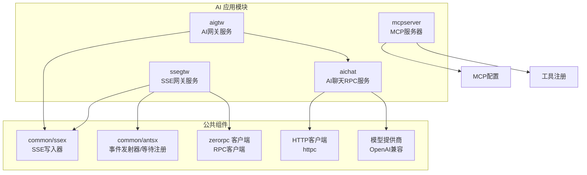
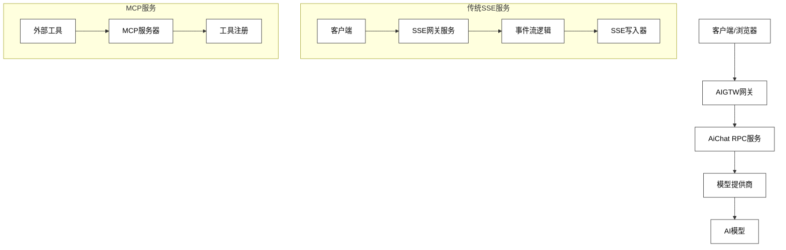
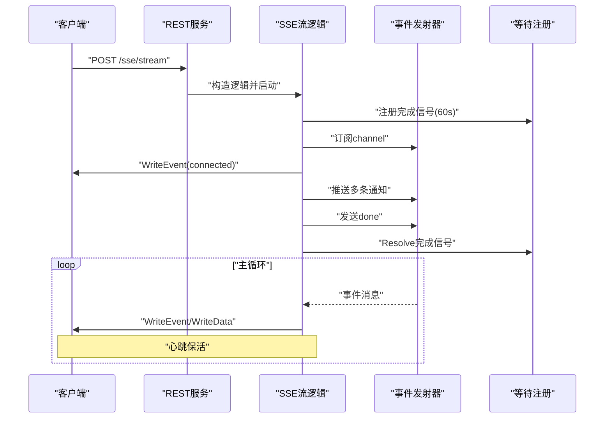
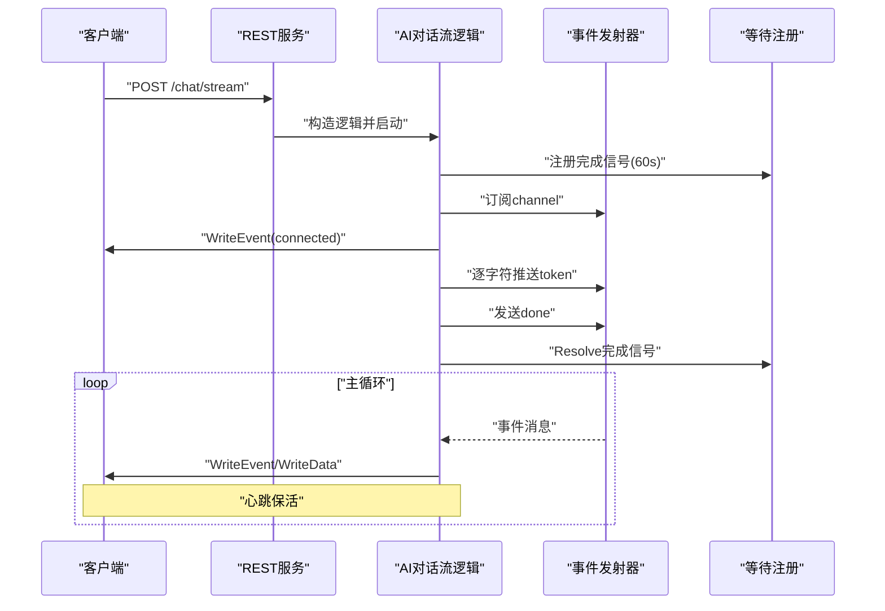
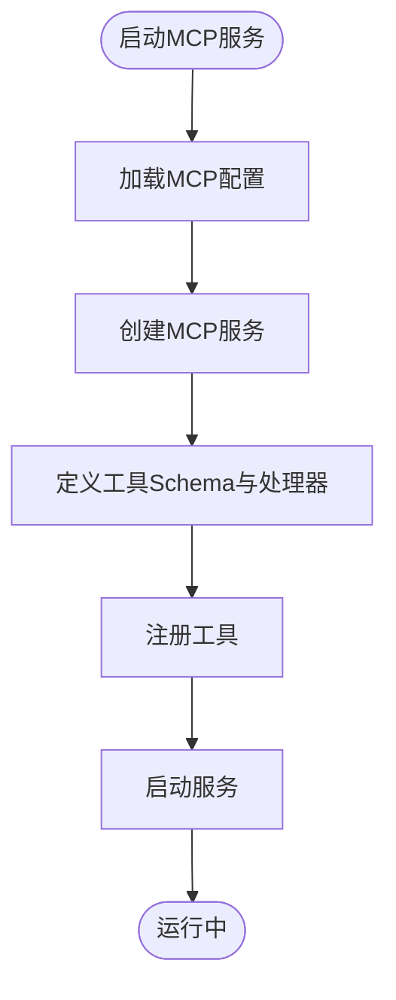
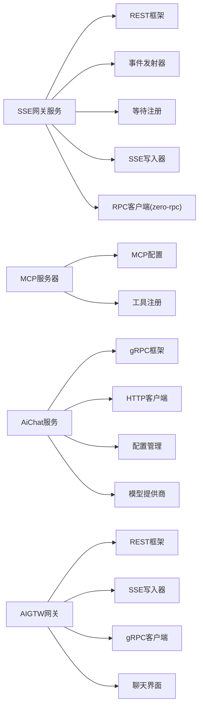

# AI应用模块

<cite>
**本文引用的文件**
- [aiapp/ssegtw/ssegtw.go](file://aiapp/ssegtw/ssegtw.go)
- [aiapp/ssegtw/etc/ssegtw.yaml](file://aiapp/ssegtw/etc/ssegtw.yaml)
- [aiapp/ssegtw/internal/config/config.go](file://aiapp/ssegtw/internal/config/config.go)
- [aiapp/ssegtw/internal/handler/routes.go](file://aiapp/ssegtw/internal/handler/routes.go)
- [aiapp/ssegtw/internal/logic/sse/chatstreamlogic.go](file://aiapp/ssegtw/internal/logic/sse/chatstreamlogic.go)
- [aiapp/ssegtw/internal/logic/sse/ssestreamlogic.go](file://aiapp/ssegtw/internal/logic/sse/ssestreamlogic.go)
- [aiapp/ssegtw/internal/svc/servicecontext.go](file://aiapp/ssegtw/internal/svc/servicecontext.go)
- [aiapp/ssegtw/internal/types/types.go](file://aiapp/ssegtw/internal/types/types.go)
- [common/ssex/writer.go](file://common/ssex/writer.go)
- [aiapp/ssegtw/sse_demo.html](file://aiapp/ssegtw/sse_demo.html)
- [aiapp/ssegtw/Dockerfile](file://aiapp/ssegtw/Dockerfile)
- [aiapp/ssegtw/deploy.sh](file://aiapp/ssegtw/deploy.sh)
- [aiapp/mcpserver/mcpserver.go](file://aiapp/mcpserver/mcpserver.go)
- [aiapp/mcpserver/etc/mcpserver.yaml](file://aiapp/mcpserver/etc/mcpserver.yaml)
- [aiapp/ssegtw/ssegtw.api](file://aiapp/ssegtw/ssegtw.api)
- [aiapp/aichat/aichat.go](file://aiapp/aichat/aichat.go)
- [aiapp/aichat/aichat.proto](file://aiapp/aichat/aichat.proto)
- [aiapp/aichat/etc/aichat.yaml](file://aiapp/aichat/etc/aichat.yaml)
- [aiapp/aichat/internal/config/config.go](file://aiapp/aichat/internal/config/config.go)
- [aiapp/aichat/internal/logic/chatcompletionlogic.go](file://aiapp/aichat/internal/logic/chatcompletionlogic.go)
- [aiapp/aichat/internal/logic/chatcompletionstreamlogic.go](file://aiapp/aichat/internal/logic/chatcompletionstreamlogic.go)
- [aiapp/aichat/internal/logic/listmodelslogic.go](file://aiapp/aichat/internal/logic/listmodelslogic.go)
- [aiapp/aichat/internal/provider/openai.go](file://aiapp/aichat/internal/provider/openai.go)
- [aiapp/aigtw/aigtw.go](file://aiapp/aigtw/aigtw.go)
- [aiapp/aigtw/aigtw.api](file://aiapp/aigtw/aigtw.api)
- [aiapp/aigtw/etc/aigtw.yaml](file://aiapp/aigtw/etc/aigtw.yaml)
- [aiapp/aigtw/chat.html](file://aiapp/aigtw/chat.html)
- [aiapp/aigtw/internal/handler/ai/chatCompletionsHandler.go](file://aiapp/aigtw/internal/handler/ai/chatCompletionsHandler.go)
- [aiapp/aigtw/internal/logic/ai/chatCompletionsLogic.go](file://aiapp/aigtw/internal/logic/ai/chatCompletionsLogic.go)
</cite>

## 更新摘要
**所做更改**
- 新增AiChat服务章节，详细介绍AI聊天RPC服务的实现
- 新增AIGTW网关章节，说明OpenAI兼容网关的设计架构
- 新增深度思考模式支持章节，阐述thinking模式的实现原理
- 新增新的聊天界面章节，介绍现代化的Web聊天界面
- 更新架构总览图，反映新增的服务组件
- 扩展API接口文档，包含新的RPC和HTTP接口
- 更新部署和运维策略，涵盖新增服务的配置

## 目录
1. [简介](#简介)
2. [项目结构](#项目结构)
3. [核心组件](#核心组件)
4. [架构总览](#架构总览)
5. [详细组件分析](#详细组件分析)
6. [依赖分析](#依赖分析)
7. [性能考量](#性能考量)
8. [故障排查指南](#故障排查指南)
9. [结论](#结论)
10. [附录](#附录)

## 简介
本技术文档聚焦Zero-Service的AI应用模块，围绕三个核心子系统展开：
- SSE网关服务（ssegtw）：基于Server-Sent Events的事件流网关，支持AI对话流与通用事件流，具备心跳保活、通道隔离、完成信号注册等能力。
- MCP服务器（mcpserver）：提供标准化的AI工具调用接口，支持工具注册与跨域配置。
- **新增** AiChat服务：基于gRPC的AI聊天RPC服务，支持深度思考模式和多厂商模型接入。
- **新增** AIGTW网关：OpenAI兼容的AI网关服务，提供REST接口与SSE流式响应能力。

文档将从架构设计、数据流、处理逻辑、集成方式、部署运维、API接口、客户端示例、性能优化与最佳实践等方面进行系统性阐述，帮助开发者快速理解并稳定交付AI应用。

## 项目结构
AI应用模块位于aiapp目录下，包含四个主要子工程：
- ssegtw：SSE网关服务，提供REST接口与SSE事件流能力，内置前端测试页面。
- mcpserver：MCP协议服务器，提供工具注册与调用能力。
- **新增** aichat：AI聊天RPC服务，基于gRPC提供聊天补全和模型列表功能。
- **新增** aigtw：AI网关服务，提供OpenAI兼容的REST接口和SSE流式响应。

**图表来源**
- [aiapp/ssegtw/ssegtw.go:26-59](file://aiapp/ssegtw/ssegtw.go#L26-L59)
- [aiapp/mcpserver/mcpserver.go:19-75](file://aiapp/mcpserver/mcpserver.go#L19-L75)
- [aiapp/aichat/aichat.go:23-46](file://aiapp/aichat/aichat.go#L23-L46)
- [aiapp/aigtw/aigtw.go:29-75](file://aiapp/aigtw/aigtw.go#L29-L75)

**章节来源**
- [aiapp/ssegtw/ssegtw.go:1-60](file://aiapp/ssegtw/ssegtw.go#L1-L60)
- [aiapp/mcpserver/mcpserver.go:1-76](file://aiapp/mcpserver/mcpserver.go#L1-L76)
- [aiapp/aichat/aichat.go:1-47](file://aiapp/aichat/aichat.go#L1-L47)
- [aiapp/aigtw/aigtw.go:1-76](file://aiapp/aigtw/aigtw.go#L1-L76)

## 核心组件
- SSE网关服务（ssegtw）
  - REST服务入口与CORS配置
  - SSE路由注册（/ssegtw/v1/sse/stream、/ssegtw/v1/sse/chat/stream）
  - 事件流逻辑：通用SSE事件流与AI对话流
  - 事件写入器：封装SSE协议写入与Flush
  - 服务上下文：事件发射器、等待注册、RPC客户端
- MCP服务器（mcpserver）
  - MCP服务启动与配置
  - 工具注册（示例：echo工具）
  - 跨域配置与消息超时设置
- **新增** AiChat服务（aichat）
  - gRPC服务入口与反射支持
  - 模型配置管理（多厂商支持）
  - 深度思考模式支持
  - OpenAI兼容的聊天补全和流式响应
- **新增** AIGTW网关（aigtw）
  - OpenAI兼容的REST接口
  - SSE流式响应桥接
  - 聊天界面静态文件服务
  - CORS配置与错误处理

**章节来源**
- [aiapp/ssegtw/internal/handler/routes.go:17-50](file://aiapp/ssegtw/internal/handler/routes.go#L17-L50)
- [aiapp/ssegtw/internal/logic/sse/ssestreamlogic.go:39-117](file://aiapp/ssegtw/internal/logic/sse/ssestreamlogic.go#L39-L117)
- [aiapp/ssegtw/internal/logic/sse/chatstreamlogic.go:39-120](file://aiapp/ssegtw/internal/logic/sse/chatstreamlogic.go#L39-L120)
- [common/ssex/writer.go:14-54](file://common/ssex/writer.go#L14-L54)
- [aiapp/ssegtw/internal/svc/servicecontext.go:23-38](file://aiapp/ssegtw/internal/svc/servicecontext.go#L23-L38)
- [aiapp/mcpserver/mcpserver.go:28-75](file://aiapp/mcpserver/mcpserver.go#L28-L75)
- [aiapp/aichat/aichat.go:23-46](file://aiapp/aichat/aichat.go#L23-L46)
- [aiapp/aichat/etc/aichat.yaml:8-34](file://aiapp/aichat/etc/aichat.yaml#L8-L34)
- [aiapp/aigtw/aigtw.go:29-75](file://aiapp/aigtw/aigtw.go#L29-L75)

## 架构总览
AI应用模块采用分层架构设计，包含网关层、服务层和模型层：

**图表来源**
- [aiapp/aigtw/aigtw.go:41-75](file://aiapp/aigtw/aigtw.go#L41-L75)
- [aiapp/aichat/aichat.go:33-39](file://aiapp/aichat/aichat.go#L33-L39)
- [aiapp/aichat/internal/provider/openai.go:16-28](file://aiapp/aichat/internal/provider/openai.go#L16-L28)

## 详细组件分析

### SSE网关服务（ssegtw）

#### 服务入口与配置
- 解析配置文件，打印Go版本，启用CORS，创建REST服务，注册路由，加入服务组并启动
- 配置项包括服务名、监听地址、端口、日志路径、RPC端点、超时等

**章节来源**
- [aiapp/ssegtw/ssegtw.go:26-59](file://aiapp/ssegtw/ssegtw.go#L26-L59)
- [aiapp/ssegtw/etc/ssegtw.yaml:1-14](file://aiapp/ssegtw/etc/ssegtw.yaml#L1-L14)
- [aiapp/ssegtw/internal/config/config.go:11-14](file://aiapp/ssegtw/internal/config/config.go#L11-L14)

#### 路由与SSE注册
- SSE路由组：/ssegtw/v1/sse/stream（SSE事件流）、/ssegtw/v1/sse/chat/stream（AI对话流）
- 普通路由组：/ssegtw/v1/ping（健康检查）
- 使用rest.WithSSE()启用SSE支持

**章节来源**
- [aiapp/ssegtw/internal/handler/routes.go:17-50](file://aiapp/ssegtw/internal/handler/routes.go#L17-L50)
- [aiapp/ssegtw/ssegtw.api:24-38](file://aiapp/ssegtw/ssegtw.api#L24-L38)

#### 事件流逻辑（通用SSE）
- 生成或使用channel，注册完成信号，订阅事件流
- 发送connected事件，启动模拟worker推送多条通知，最后发送done并Resolve完成信号
- 主循环按事件或心跳写入客户端，收到取消信号或通道关闭时结束

**图表来源**
- [aiapp/ssegtw/internal/logic/sse/ssestreamlogic.go:39-117](file://aiapp/ssegtw/internal/logic/sse/ssestreamlogic.go#L39-L117)
- [common/ssex/writer.go:23-54](file://common/ssex/writer.go#L23-L54)

**章节来源**
- [aiapp/ssegtw/internal/logic/sse/ssestreamlogic.go:39-117](file://aiapp/ssegtw/internal/logic/sse/ssestreamlogic.go#L39-L117)

#### 事件流逻辑（AI对话流）
- 生成或使用channel，注册完成信号，订阅事件流
- 发送connected事件，启动模拟worker按字符粒度输出token，最后发送done并Resolve完成信号
- 主循环按事件或心跳写入客户端，支持心跳保活

**图表来源**
- [aiapp/ssegtw/internal/logic/sse/chatstreamlogic.go:39-120](file://aiapp/ssegtw/internal/logic/sse/chatstreamlogic.go#L39-L120)
- [common/ssex/writer.go:23-54](file://common/ssex/writer.go#L23-L54)

**章节来源**
- [aiapp/ssegtw/internal/logic/sse/chatstreamlogic.go:39-120](file://aiapp/ssegtw/internal/logic/sse/chatstreamlogic.go#L39-L120)

#### 事件写入器（SSEWriter）
- 封装SSE协议写入：WriteEvent、WriteData、WriteComment、WriteKeepAlive
- 强制Flush以保证客户端及时接收

**章节来源**
- [common/ssex/writer.go:14-54](file://common/ssex/writer.go#L14-L54)

#### 服务上下文（ServiceContext）
- SSEEvent结构体：事件名与数据
- ServiceContext聚合：RPC客户端、事件发射器、等待注册
- 初始化时创建RPC客户端、事件发射器、等待注册（默认TTL 60s）

**章节来源**
- [aiapp/ssegtw/internal/svc/servicecontext.go:17-38](file://aiapp/ssegtw/internal/svc/servicecontext.go#L17-L38)

#### 请求类型定义
- ChatStreamRequest：channel、prompt
- PingReply：msg
- SSEStreamRequest：channel

**章节来源**
- [aiapp/ssegtw/internal/types/types.go:6-17](file://aiapp/ssegtw/internal/types/types.go#L6-L17)

#### 健康检查与CORS
- 健康检查：/ssegtw/v1/ping
- CORS：动态Origin、允许方法与头部、凭证与暴露头

**章节来源**
- [aiapp/ssegtw/internal/handler/routes.go:38-49](file://aiapp/ssegtw/internal/handler/routes.go#L38-L49)
- [aiapp/ssegtw/ssegtw.go:35-46](file://aiapp/ssegtw/ssegtw.go#L35-L46)

#### 前端测试页面（SSE Demo）
- 提供服务地址、端点选择、Channel与Prompt输入
- 支持连接/断开、事件计数、心跳计数、耗时统计、清空消息
- 读取SSE响应并解析事件名与数据

**章节来源**
- [aiapp/ssegtw/sse_demo.html:482-661](file://aiapp/ssegtw/sse_demo.html#L482-L661)

### MCP服务器（mcpserver）

#### 服务启动与配置
- 加载MCP配置（主机、端口、消息超时、CORS）
- 创建MCP服务，可选禁用统计日志
- 注册工具（示例：echo工具），启动服务

**章节来源**
- [aiapp/mcpserver/mcpserver.go:19-75](file://aiapp/mcpserver/mcpserver.go#L19-L75)
- [aiapp/mcpserver/etc/mcpserver.yaml:1-9](file://aiapp/mcpserver/etc/mcpserver.yaml#L1-L9)

#### 工具注册流程
- 定义工具名称、描述、输入Schema（属性与必填字段）
- 实现工具处理器，解析参数，返回结果
- 注册工具到MCP服务

**图表来源**
- [aiapp/mcpserver/mcpserver.go:28-75](file://aiapp/mcpserver/mcpserver.go#L28-L75)

### AiChat服务（aichat）

#### 服务入口与配置
- 解析配置文件，打印Go版本，创建服务上下文
- 注册AiChat服务到gRPC服务器，启用反射支持（开发模式）
- 添加全局日志字段，启动RPC服务

**章节来源**
- [aiapp/aichat/aichat.go:23-46](file://aiapp/aichat/aichat.go#L23-L46)
- [aiapp/aichat/etc/aichat.yaml:1-34](file://aiapp/aichat/etc/aichat.yaml#L1-L34)

#### gRPC接口定义
- Ping：健康检查接口
- ChatCompletion：非流式聊天补全
- ChatCompletionStream：流式聊天补全
- ListModels：列出可用模型

**章节来源**
- [aiapp/aichat/aichat.proto:105-114](file://aiapp/aichat/aichat.proto#L105-L114)

#### 深度思考模式支持
- EnableThinking：布尔值控制是否启用深度思考
- ReasoningContent：推理思考过程内容
- 不同厂商的thinking参数格式：
  - DashScope：enable_thinking: true
  - 其他厂商：thinking对象，包含type和clear_thinking

**章节来源**
- [aiapp/aichat/aichat.proto:16-37](file://aiapp/aichat/aichat.proto#L16-L37)
- [aiapp/aichat/internal/logic/chatcompletionlogic.go:89-125](file://aiapp/aichat/internal/logic/chatcompletionlogic.go#L89-L125)

#### 模型配置管理
- Providers：支持多个模型提供商（Zhipu、DashScope）
- Models：模型映射关系，支持不同后端模型
- 配置示例：GLM-4-Flash、GLM-5、Qwen3-Plus

**章节来源**
- [aiapp/aichat/etc/aichat.yaml:8-34](file://aiapp/aichat/etc/aichat.yaml#L8-L34)
- [aiapp/aichat/internal/config/config.go:9-30](file://aiapp/aichat/internal/config/config.go#L9-L30)

#### OpenAI兼容实现
- OpenAICompatible：兼容OpenAI协议的提供商实现
- 支持非流式和流式聊天补全
- SSE流式响应解析，支持[DONE]标记

**章节来源**
- [aiapp/aichat/internal/provider/openai.go:16-100](file://aiapp/aichat/internal/provider/openai.go#L16-L100)
- [aiapp/aichat/internal/provider/openai.go:149-197](file://aiapp/aichat/internal/provider/openai.go#L149-L197)

#### 逻辑处理流程
- ChatCompletion：获取提供商、构建请求、调用提供商、转换响应
- ChatCompletionStream：建立gRPC流、读取chunk、发送SSE响应
- ListModels：遍历配置返回模型列表

**章节来源**
- [aiapp/aichat/internal/logic/chatcompletionlogic.go:29-48](file://aiapp/aichat/internal/logic/chatcompletionlogic.go#L29-L48)
- [aiapp/aichat/internal/logic/chatcompletionstreamlogic.go:30-73](file://aiapp/aichat/internal/logic/chatcompletionstreamlogic.go#L30-L73)
- [aiapp/aichat/internal/logic/listmodelslogic.go:27-43](file://aiapp/aichat/internal/logic/listmodelslogic.go#L27-L43)

### AIGTW网关（aigtw）

#### 服务入口与配置
- 设置OpenAI风格错误处理器
- 加载配置，打印Go版本，创建REST服务
- 注册处理器，添加聊天页面静态路由
- 启动服务组

**章节来源**
- [aiapp/aigtw/aigtw.go:29-75](file://aiapp/aigtw/aigtw.go#L29-L75)
- [aiapp/aigtw/etc/aigtw.yaml:1-15](file://aiapp/aigtw/etc/aigtw.yaml#L1-L15)

#### OpenAI兼容接口
- Health Check：/aigtw/v1/ping
- List Models：/aigtw/v1/models
- Chat Completions：/aigtw/v1/chat/completions（支持流式）

**章节来源**
- [aiapp/aigtw/aigtw.api:14-49](file://aiapp/aigtw/aigtw.api#L14-L49)

#### 聊天界面集成
- 提供现代化的Web聊天界面
- 支持深色/浅色主题切换
- 实时显示推理思考过程（thinking模式）
- 流式响应光标动画

**章节来源**
- [aiapp/aigtw/chat.html:1-800](file://aiapp/aigtw/chat.html#L1-L800)

#### SSE流式响应桥接
- 将gRPC流式响应转换为SSE格式
- 支持客户端断开检测
- 实时转发推理内容和回答内容

**章节来源**
- [aiapp/aigtw/internal/logic/ai/chatCompletionsLogic.go:54-93](file://aiapp/aigtw/internal/logic/ai/chatCompletionsLogic.go#L54-L93)

#### 处理器实现
- ChatCompletionsHandler：解析HTTP请求，调用逻辑层
- ChatCompletionsLogic：统一处理流式/非流式请求
- 请求/响应转换：OpenAI标准格式 ↔ gRPC proto

**章节来源**
- [aiapp/aigtw/internal/handler/ai/chatCompletionsHandler.go:12-29](file://aiapp/aigtw/internal/handler/ai/chatCompletionsHandler.go#L12-L29)
- [aiapp/aigtw/internal/logic/ai/chatCompletionsLogic.go:34-40](file://aiapp/aigtw/internal/logic/ai/chatCompletionsLogic.go#L34-L40)

## 依赖分析
- SSE网关服务依赖
  - REST框架：路由注册、SSE支持、CORS
  - 事件发射器：事件发布/订阅
  - 等待注册：完成信号注册与等待
  - SSE写入器：SSE协议写入
  - RPC客户端：与核心业务系统交互
- MCP服务器依赖
  - MCP框架：服务创建与工具注册
  - 配置：主机、端口、消息超时、CORS
- **新增** AiChat服务依赖
  - gRPC框架：服务注册与反射
  - HTTP客户端：调用外部模型提供商
  - 配置管理：提供商和模型配置
- **新增** AIGTW网关依赖
  - REST框架：OpenAI兼容接口
  - SSE写入器：流式响应
  - gRPC客户端：调用AiChat服务

**图表来源**
- [aiapp/ssegtw/internal/svc/servicecontext.go:30-38](file://aiapp/ssegtw/internal/svc/servicecontext.go#L30-L38)
- [aiapp/mcpserver/mcpserver.go:28-75](file://aiapp/mcpserver/mcpserver.go#L28-L75)
- [aiapp/aichat/aichat.go:33-39](file://aiapp/aichat/aichat.go#L33-L39)
- [aiapp/aigtw/aigtw.go:41-44](file://aiapp/aigtw/aigtw.go#L41-L44)

**章节来源**
- [aiapp/ssegtw/internal/svc/servicecontext.go:30-38](file://aiapp/ssegtw/internal/svc/servicecontext.go#L30-L38)
- [aiapp/mcpserver/mcpserver.go:28-75](file://aiapp/mcpserver/mcpserver.go#L28-L75)
- [aiapp/aichat/aichat.go:33-39](file://aiapp/aichat/aichat.go#L33-L39)
- [aiapp/aigtw/aigtw.go:41-44](file://aiapp/aigtw/aigtw.go#L41-L44)

## 性能考量
- SSE写入器强制Flush，确保低延迟；在高并发场景下注意I/O压力
- 心跳保活（每30秒）用于维持长连接活跃，避免中间设备误判超时
- 完成信号注册（默认TTL 60秒）用于优雅结束事件流，防止资源泄漏
- 事件发射器与等待注册为内存级组件，适合短时事件流；若需持久化或跨实例共享，应引入外部存储或分布式事件总线
- RPC客户端超时与非阻塞配置需结合下游服务性能调整
- **新增** AiChat服务的流式响应需要高效的SSE写入和客户端断开检测
- **新增** 多厂商模型提供商的并发调用需要合理的超时和重试机制

## 故障排查指南
- SSE连接异常
  - 检查CORS配置是否允许前端Origin
  - 确认SSE端点路径与WithSSE()注册
  - 使用前端Demo观察事件计数与心跳计数
- 事件流中断
  - 关注完成信号是否被Resolve
  - 检查订阅取消逻辑与上下文取消
- MCP工具调用失败
  - 校验工具Schema与必填字段
  - 查看工具处理器参数解析与返回值
  - 检查消息超时与跨域配置
- **新增** AiChat服务问题
  - 检查模型配置是否正确
  - 验证提供商API密钥和端点
  - 查看gRPC错误码和上游错误信息
- **新增** AIGTW网关问题
  - 确认AiChat服务是否正常启动
  - 检查SSE写入器初始化是否成功
  - 验证聊天界面静态文件路径

**章节来源**
- [aiapp/ssegtw/sse_demo.html:558-635](file://aiapp/ssegtw/sse_demo.html#L558-L635)
- [aiapp/ssegtw/internal/logic/sse/chatstreamlogic.go:59-93](file://aiapp/ssegtw/internal/logic/sse/chatstreamlogic.go#L59-L93)
- [aiapp/ssegtw/internal/logic/sse/ssestreamlogic.go:54-90](file://aiapp/ssegtw/internal/logic/sse/ssestreamlogic.go#L54-L90)
- [aiapp/mcpserver/mcpserver.go:52-69](file://aiapp/mcpserver/mcpserver.go#L52-L69)

## 结论
AI应用模块通过四个核心子系统实现了完整的AI服务能力：
- SSE网关服务提供事件驱动的低延迟通信能力
- MCP服务器提供标准化的工具调用接口
- **新增** AiChat服务提供高性能的gRPC聊天服务，支持深度思考模式和多厂商模型
- **新增** AIGTW网关提供OpenAI兼容的REST接口，集成现代化的聊天界面

这些组件协同工作，形成了从网关到服务再到模型的完整AI应用架构，支持企业级的部署和运维需求。

## 附录

### API接口文档

#### SSE网关服务API
- 健康检查
  - 方法：GET
  - 路径：/ssegtw/v1/ping
  - 返回：PingReply

- SSE事件流
  - 方法：POST
  - 路径：/ssegtw/v1/sse/stream
  - 请求体：SSEStreamRequest
  - 返回：PingReply
  - 事件：connected、notification、done

- AI对话流
  - 方法：POST
  - 路径：/ssegtw/v1/sse/chat/stream
  - 请求体：ChatStreamRequest
  - 返回：PingReply
  - 事件：connected、token、done

#### **新增** AiChat服务API
- 健康检查
  - 方法：POST
  - 路径：/aichat.v1.AiChat/Ping
  - 请求体：PingReq
  - 返回：PingRes

- 聊天补全（非流式）
  - 方法：POST
  - 路径：/aichat.v1.AiChat/ChatCompletion
  - 请求体：ChatCompletionReq
  - 返回：ChatCompletionRes

- 聊天补全（流式）
  - 方法：POST
  - 路径：/aichat.v1.AiChat/ChatCompletionStream
  - 请求体：ChatCompletionReq
  - 返回：ChatCompletionStreamChunk（Server-Side Stream）

- 模型列表
  - 方法：POST
  - 路径：/aichat.v1.AiChat/ListModels
  - 请求体：ListModelsReq
  - 返回：ListModelsRes

#### **新增** AIGTW网关API
- 健康检查
  - 方法：GET
  - 路径：/aigtw/v1/ping
  - 返回：PingReply

- 模型列表
  - 方法：GET
  - 路径：/aigtw/v1/models
  - 返回：ListModelsResponse

- 聊天补全
  - 方法：POST
  - 路径：/aigtw/v1/chat/completions
  - 请求体：ChatCompletionRequest
  - 返回：ChatCompletionResponse（支持流式SSE）

**章节来源**
- [aiapp/ssegtw/ssegtw.api:13-38](file://aiapp/ssegtw/ssegtw.api#L13-L38)
- [aiapp/ssegtw/internal/types/types.go:6-17](file://aiapp/ssegtw/internal/types/types.go#L6-L17)
- [aiapp/aichat/aichat.proto:105-114](file://aiapp/aichat/aichat.proto#L105-L114)
- [aiapp/aigtw/aigtw.api:14-49](file://aiapp/aigtw/aigtw.api#L14-L49)

### 客户端集成示例
- 使用前端Demo页面连接SSE端点，选择端点与输入参数，实时查看事件流
- 使用fetch建立SSE连接，解析事件名与数据，实现自定义UI
- **新增** 使用gRPC客户端调用AiChat服务，支持深度思考模式
- **新增** 通过AIGTW网关的REST接口访问AI服务，兼容OpenAI SDK

**章节来源**
- [aiapp/ssegtw/sse_demo.html:558-635](file://aiapp/ssegtw/sse_demo.html#L558-L635)
- [aiapp/aichat/aichat.proto:16-37](file://aiapp/aichat/aichat.proto#L16-L37)
- [aiapp/aigtw/chat.html:1-800](file://aiapp/aigtw/chat.html#L1-L800)

### 部署与运维策略
- 容器化
  - 使用Dockerfile进行多阶段构建，最终镜像基于scratch
  - 配置时区与证书，复制配置与二进制
- 部署脚本
  - 支持环境变量注入、镜像打包与上传、远程部署、标签管理与备份清理
  - 通过docker-compose启动服务
- **新增** 多服务协调
  - AIGTW网关依赖AiChat服务的RPC端点
  - 配置正确的服务发现和负载均衡
  - 监控各服务的健康状态和性能指标

**章节来源**
- [aiapp/ssegtw/Dockerfile:1-42](file://aiapp/ssegtw/Dockerfile#L1-L42)
- [aiapp/ssegtw/deploy.sh:1-170](file://aiapp/ssegtw/deploy.sh#L1-L170)
- [aiapp/aichat/etc/aichat.yaml:18-34](file://aiapp/aichat/etc/aichat.yaml#L18-L34)
- [aiapp/aigtw/etc/aigtw.yaml:9-14](file://aiapp/aigtw/etc/aigtw.yaml#L9-L14)

### 最佳实践与安全考虑
- SSE
  - 明确事件语义与数据格式，避免在data中传输敏感信息
  - 合理设置心跳间隔与完成信号TTL，防止资源泄漏
  - 在生产环境开启严格的CORS白名单
- MCP
  - 工具Schema严格校验输入，必要时增加参数校验与限流
  - 控制消息超时，避免长时间占用连接
  - 限制跨域来源，仅开放可信域名
- **新增** AiChat服务
  - 严格验证模型配置和提供商密钥
  - 实现合理的超时和重试机制
  - 记录详细的日志和监控指标
- **新增** AIGTW网关
  - 配置适当的CORS策略
  - 实现错误处理和降级机制
  - 保护静态文件访问权限
- 集成
  - 通过RPC客户端与核心业务系统解耦
  - 在网关层统一鉴权与审计，避免将鉴权逻辑下沉至事件流
  - 实现服务间的依赖管理和故障隔离