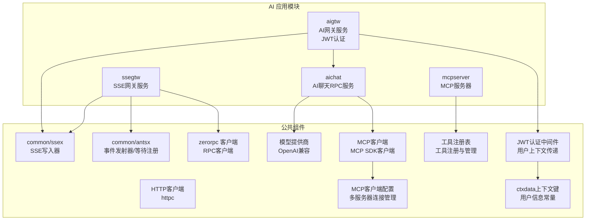
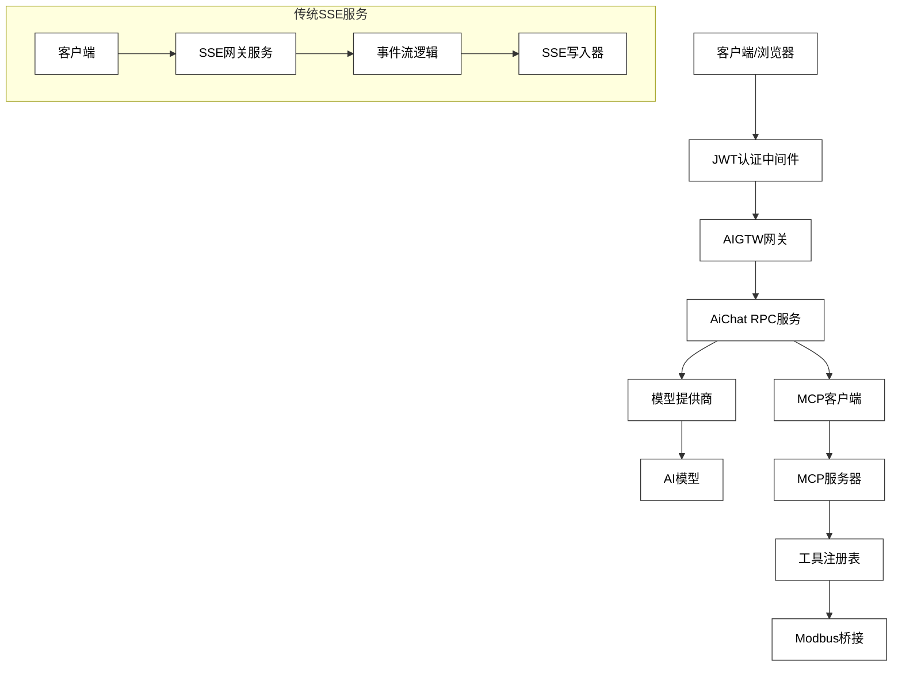
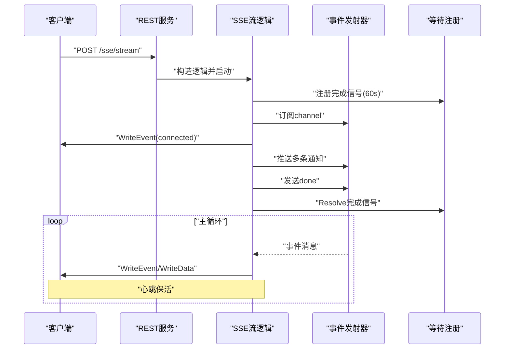
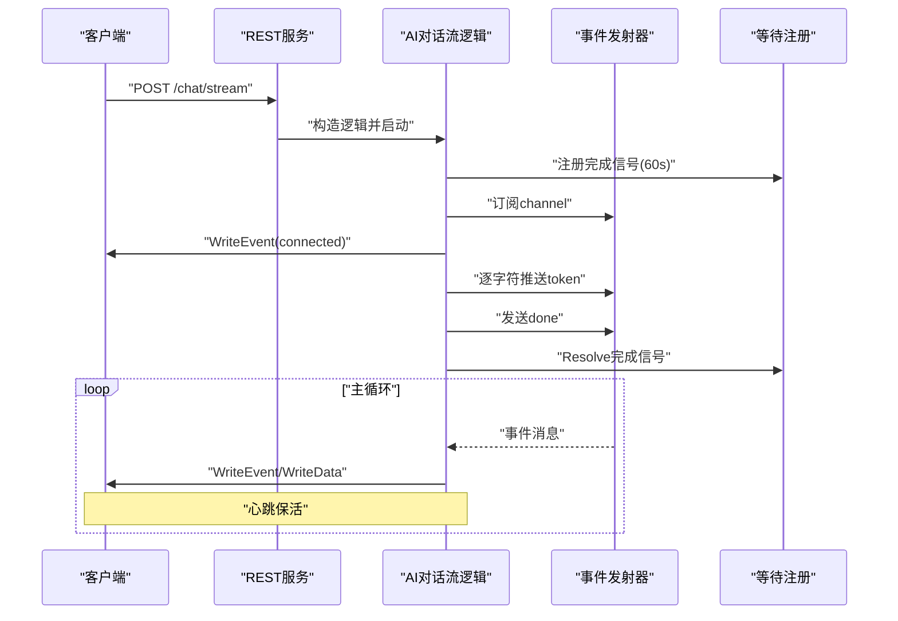
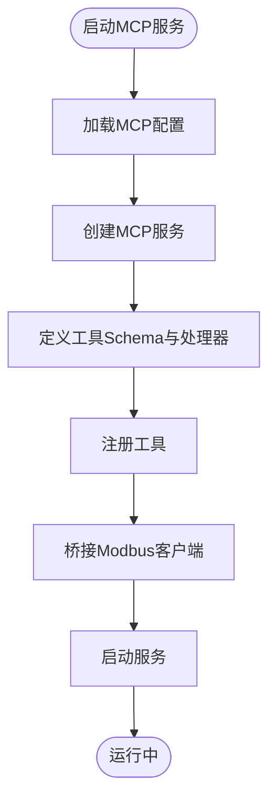
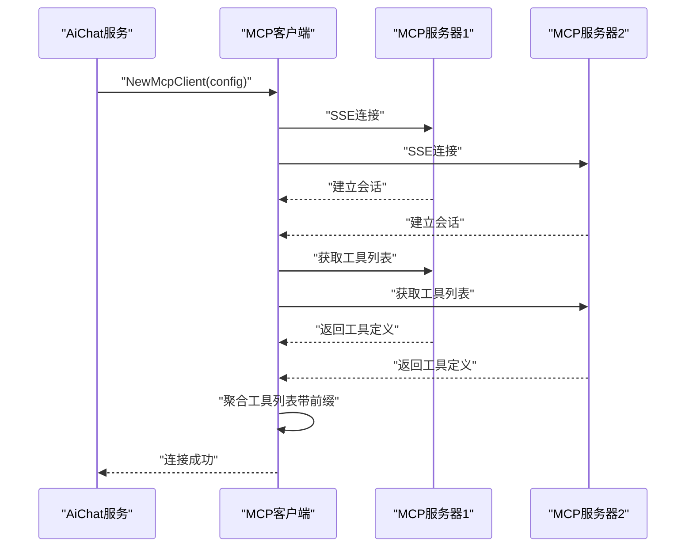
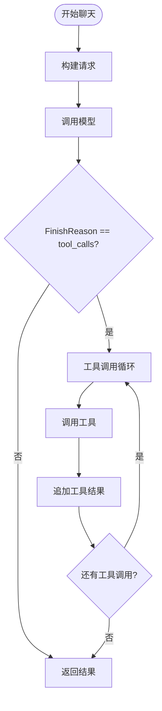
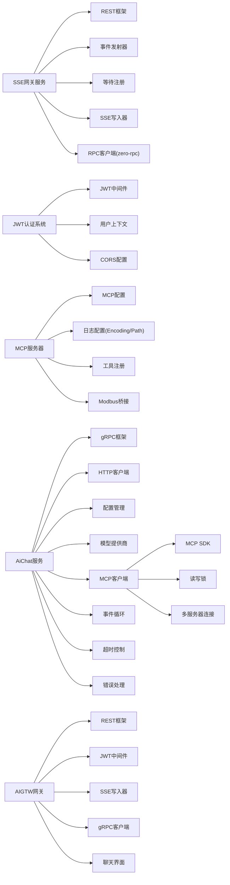

# AI应用模块

<cite>
**本文档引用的文件**
- [aiapp/ssegtw/ssegtw.go](file://aiapp/ssegtw/ssegtw.go)
- [aiapp/ssegtw/etc/ssegtw.yaml](file://aiapp/ssegtw/etc/ssegtw.yaml)
- [aiapp/ssegtw/internal/config/config.go](file://aiapp/ssegtw/internal/config/config.go)
- [aiapp/ssegtw/internal/handler/routes.go](file://aiapp/ssegtw/internal/handler/routes.go)
- [aiapp/ssegtw/internal/logic/sse/chatstreamlogic.go](file://aiapp/ssegtw/internal/logic/sse/chatstreamlogic.go)
- [aiapp/ssegtw/internal/logic/sse/ssestreamlogic.go](file://aiapp/ssegtw/internal/logic/sse/ssestreamlogic.go)
- [aiapp/ssegtw/internal/svc/servicecontext.go](file://aiapp/ssegtw/internal/svc/servicecontext.go)
- [aiapp/ssegtw/internal/types/types.go](file://aiapp/ssegtw/internal/types/types.go)
- [common/ssex/writer.go](file://common/ssex/writer.go)
- [aiapp/ssegtw/sse_demo.html](file://aiapp/ssegtw/sse_demo.html)
- [aiapp/ssegtw/Dockerfile](file://aiapp/ssegtw/Dockerfile)
- [aiapp/ssegtw/deploy.sh](file://aiapp/ssegtw/deploy.sh)
- [aiapp/mcpserver/mcpserver.go](file://aiapp/mcpserver/mcpserver.go)
- [aiapp/mcpserver/etc/mcpserver.yaml](file://aiapp/mcpserver/etc/mcpserver.yaml)
- [aiapp/mcpserver/internal/tools/echo.go](file://aiapp/mcpserver/internal/tools/echo.go)
- [aiapp/mcpserver/internal/tools/modbus.go](file://aiapp/mcpserver/internal/tools/modbus.go)
- [aiapp/mcpserver/internal/tools/registry.go](file://aiapp/mcpserver/internal/tools/registry.go)
- [aiapp/mcpserver/internal/svc/servicecontext.go](file://aiapp/mcpserver/internal/svc/servicecontext.go)
- [aiapp/ssegtw/ssegtw.api](file://aiapp/ssegtw/ssegtw.api)
- [aiapp/aichat/aichat.go](file://aiapp/aichat/aichat.go)
- [aiapp/aichat/aichat.proto](file://aiapp/aichat/aichat.proto)
- [aiapp/aichat/etc/aichat.yaml](file://aiapp/aichat/etc/aichat.yaml)
- [aiapp/aichat/internal/config/config.go](file://aiapp/aichat/internal/config/config.go)
- [aiapp/aichat/internal/logic/chatcompletionlogic.go](file://aiapp/aichat/internal/logic/chatcompletionlogic.go)
- [aiapp/aichat/internal/logic/chatcompletionstreamlogic.go](file://aiapp/aichat/internal/logic/chatcompletionstreamlogic.go)
- [aiapp/aichat/internal/logic/listmodelslogic.go](file://aiapp/aichat/internal/logic/listmodelslogic.go)
- [aiapp/aichat/internal/mcpclient/client.go](file://aiapp/aichat/internal/mcpclient/client.go)
- [aiapp/aichat/internal/provider/openai.go](file://aiapp/aichat/internal/provider/openai.go)
- [aiapp/aichat/internal/provider/registry.go](file://aiapp/aichat/internal/provider/registry.go)
- [aiapp/aichat/internal/provider/types.go](file://aiapp/aichat/internal/provider/types.go)
- [aiapp/aichat/internal/svc/servicecontext.go](file://aiapp/aichat/internal/svc/servicecontext.go)
- [aiapp/aigtw/aigtw.go](file://aiapp/aigtw/aigtw.go)
- [aiapp/aigtw/aigtw.api](file://aiapp/aigtw/aigtw.api)
- [aiapp/aigtw/etc/aigtw.yaml](file://aiapp/aigtw/etc/aigtw.yaml)
- [aiapp/aigtw/chat.html](file://aiapp/aigtw/chat.html)
- [aiapp/aigtw/internal/handler/pass/chatcompletionshandler.go](file://aiapp/aigtw/internal/handler/pass/chatcompletionshandler.go)
- [aiapp/aigtw/internal/logic/pass/chatcompletionslogic.go](file://aiapp/aigtw/internal/logic/pass/chatcompletionslogic.go)
- [aiapp/aigtw/internal/handler/routes.go](file://aiapp/aigtw/internal/handler/routes.go)
- [aiapp/aigtw/internal/svc/servicecontext.go](file://aiapp/aigtw/internal/svc/servicecontext.go)
- [common/mcpx/client.go](file://common/mcpx/client.go)
- [common/mcpx/config.go](file://common/mcpx/config.go)
- [common/ctxdata/ctxData.go](file://common/ctxdata/ctxData.go)
- [common/gtwx/cors.go](file://common/gtwx/cors.go)
</cite>

## 更新摘要
**所做更改**
- 新增JWT认证系统集成，包括AIGTW网关的JWT中间件配置和用户上下文传递
- 更新MCP客户端配置，支持多服务器连接管理和工具名前缀路由
- 增强配置标准化，统一日志编码格式和路径配置
- 优化AIGTW网关路由结构，使用/jwt中间件和/ai/v1前缀
- 新增ctxdata包中的用户上下文键常量定义

## 目录
1. [简介](#简介)
2. [项目结构](#项目结构)
3. [核心组件](#核心组件)
4. [架构总览](#架构总览)
5. [详细组件分析](#详细组件分析)
6. [依赖分析](#依赖分析)
7. [性能考量](#性能考量)
8. [故障排查指南](#故障排查指南)
9. [结论](#结论)
10. [附录](#附录)

## 简介
本技术文档聚焦Zero-Service的AI应用模块，围绕四个核心子系统展开：
- SSE网关服务（ssegtw）：基于Server-Sent Events的事件流网关，支持AI对话流与通用事件流，具备心跳保活、通道隔离、完成信号注册等能力。
- MCP服务器（mcpserver）：提供标准化的AI工具调用接口，支持工具注册与跨域配置。
- **新增** JWT认证系统：AIGTW网关集成JWT中间件，实现用户身份认证和授权管理。
- **新增** MCP客户端集成：AI聊天服务通过MCP客户端实现与MCP服务器的连接，支持工具列表缓存和动态刷新。
- **新增** 工具调用能力：AI聊天服务支持多轮工具调用循环，实现智能代理功能，提升AI应用的实用性。

文档将从架构设计、数据流、处理逻辑、集成方式、部署运维、API接口、客户端示例、性能优化与最佳实践等方面进行系统性阐述，帮助开发者快速理解并稳定交付AI应用。

## 项目结构
AI应用模块位于aiapp目录下，包含四个主要子工程：
- ssegtw：SSE网关服务，提供REST接口与SSE事件流能力，内置前端测试页面。
- mcpserver：MCP协议服务器，提供工具注册与调用能力。
- aichat：AI聊天RPC服务，基于gRPC提供聊天补全和模型列表功能，支持MCP工具集成。
- aigtw：AI网关服务，提供OpenAI兼容的REST接口和SSE流式响应，集成JWT认证。

**图表来源**
- [aiapp/ssegtw/ssegtw.go:26-59](file://aiapp/ssegtw/ssegtw.go#L26-L59)
- [aiapp/mcpserver/mcpserver.go:19-75](file://aiapp/mcpserver/mcpserver.go#L19-L75)
- [aiapp/aichat/aichat.go:23-46](file://aiapp/aichat/aichat.go#L23-L46)
- [aiapp/aichat/internal/mcpclient/client.go:24-54](file://aiapp/aichat/internal/mcpclient/client.go#L24-L54)
- [aiapp/aigtw/aigtw.go:29-75](file://aiapp/aigtw/aigtw.go#L29-L75)
- [common/mcpx/client.go:29-70](file://common/mcpx/client.go#L29-L70)
- [common/ctxdata/ctxData.go:9-24](file://common/ctxdata/ctxData.go#L9-L24)

**章节来源**
- [aiapp/ssegtw/ssegtw.go:1-60](file://aiapp/ssegtw/ssegtw.go#L1-L60)
- [aiapp/mcpserver/mcpserver.go:1-76](file://aiapp/mcpserver/mcpserver.go#L1-L76)
- [aiapp/aichat/aichat.go:1-47](file://aiapp/aichat/aichat.go#L1-L47)
- [aiapp/aichat/internal/mcpclient/client.go:1-136](file://aiapp/aichat/internal/mcpclient/client.go#L1-L136)
- [aiapp/aigtw/aigtw.go:1-76](file://aiapp/aigtw/aigtw.go#L1-L76)
- [common/mcpx/client.go:1-165](file://common/mcpx/client.go#L1-L165)
- [common/ctxdata/ctxData.go:1-76](file://common/ctxdata/ctxData.go#L1-L76)

## 核心组件
- SSE网关服务（ssegtw）
  - REST服务入口与CORS配置
  - SSE路由注册（/ssegtw/v1/sse/stream、/ssegtw/v1/sse/chat/stream）
  - 事件流逻辑：通用SSE事件流与AI对话流
  - 事件写入器：封装SSE协议写入与Flush
  - 服务上下文：事件发射器、等待注册、RPC客户端
- MCP服务器（mcpserver）
  - MCP服务启动与配置
  - 工具注册（示例：echo工具、Modbus工具）
  - 跨域配置与消息超时设置
  - Modbus设备桥接功能
  - **更新** 增强的日志配置：Encoding: plain和Path: /opt/logs/mcpserver
- **新增** JWT认证系统（aigtw）
  - JWT中间件集成：rest.WithJwt配置访问密钥
  - 用户上下文传递：Authorization、User-Id、User-Name等头信息
  - 路由前缀管理：/ai/v1统一前缀
  - 超时配置：支持0纳秒超时的SSE流
- **新增** MCP客户端集成（aichat）
  - SSE客户端传输层连接MCP服务器
  - 工具列表缓存与动态刷新
  - OpenAI工具格式转换
  - 工具调用执行与参数解析
  - **新增** 多服务器连接管理：支持多个MCP服务器配置
- **新增** 工具调用能力（aichat）
  - 多轮工具调用循环管理
  - 工具调用结果处理与消息追加
  - 最大工具轮次限制配置
  - 工具调用错误处理与降级

**章节来源**
- [aiapp/ssegtw/internal/handler/routes.go:17-50](file://aiapp/ssegtw/internal/handler/routes.go#L17-L50)
- [aiapp/ssegtw/internal/logic/sse/ssestreamlogic.go:39-117](file://aiapp/ssegtw/internal/logic/sse/ssestreamlogic.go#L39-L117)
- [aiapp/ssegtw/internal/logic/sse/chatstreamlogic.go:39-120](file://aiapp/ssegtw/internal/logic/sse/chatstreamlogic.go#L39-L120)
- [common/ssex/writer.go:14-54](file://common/ssex/writer.go#L14-L54)
- [aiapp/ssegtw/internal/svc/servicecontext.go:23-38](file://aiapp/ssegtw/internal/svc/servicecontext.go#L23-L38)
- [aiapp/mcpserver/mcpserver.go:28-75](file://aiapp/mcpserver/mcpserver.go#L28-L75)
- [aiapp/mcpserver/etc/mcpserver.yaml:4-7](file://aiapp/mcpserver/etc/mcpserver.yaml#L4-L7)
- [aiapp/mcpserver/internal/tools/echo.go:15-37](file://aiapp/mcpserver/internal/tools/echo.go#L15-L37)
- [aiapp/mcpserver/internal/tools/modbus.go:28-69](file://aiapp/mcpserver/internal/tools/modbus.go#L28-L69)
- [aiapp/aichat/internal/mcpclient/client.go:16-136](file://aiapp/aichat/internal/mcpclient/client.go#L16-L136)
- [aiapp/aichat/internal/logic/chatcompletionlogic.go:48-85](file://aiapp/aichat/internal/logic/chatcompletionlogic.go#L48-L85)
- [common/mcpx/client.go:16-70](file://common/mcpx/client.go#L16-L70)
- [aiapp/aigtw/internal/handler/routes.go:26-43](file://aiapp/aigtw/internal/handler/routes.go#L26-L43)
- [common/ctxdata/ctxData.go:9-24](file://common/ctxdata/ctxData.go#L9-L24)

## 架构总览
AI应用模块采用分层架构设计，包含网关层、服务层、模型层和工具层：

**图表来源**
- [aiapp/aigtw/aigtw.go:41-75](file://aiapp/aigtw/aigtw.go#L41-L75)
- [aiapp/aichat/aichat.go:33-39](file://aiapp/aichat/aichat.go#L33-L39)
- [aiapp/aichat/internal/mcpclient/client.go:24-54](file://aiapp/aichat/internal/mcpclient/client.go#L24-L54)
- [aiapp/aichat/internal/provider/openai.go:16-28](file://aiapp/aichat/internal/provider/openai.go#L16-L28)
- [common/mcpx/client.go:29-70](file://common/mcpx/client.go#L29-L70)

## 详细组件分析

### SSE网关服务（ssegtw）

#### 服务入口与配置
- 解析配置文件，打印Go版本，启用CORS，创建REST服务，注册路由，加入服务组并启动
- 配置项包括服务名、监听地址、端口、日志路径、RPC端点、超时等

**章节来源**
- [aiapp/ssegtw/ssegtw.go:26-59](file://aiapp/ssegtw/ssegtw.go#L26-L59)
- [aiapp/ssegtw/etc/ssegtw.yaml:1-14](file://aiapp/ssegtw/etc/ssegtw.yaml#L1-L14)
- [aiapp/ssegtw/internal/config/config.go:11-14](file://aiapp/ssegtw/internal/config/config.go#L11-L14)

#### 路由与SSE注册
- SSE路由组：/ssegtw/v1/sse/stream（SSE事件流）、/ssegtw/v1/sse/chat/stream（AI对话流）
- 普通路由组：/ssegtw/v1/ping（健康检查）
- 使用rest.WithSSE()启用SSE支持

**章节来源**
- [aiapp/ssegtw/internal/handler/routes.go:17-50](file://aiapp/ssegtw/internal/handler/routes.go#L17-L50)
- [aiapp/ssegtw/ssegtw.api:24-38](file://aiapp/ssegtw/ssegtw.api#L24-L38)

#### 事件流逻辑（通用SSE）
- 生成或使用channel，注册完成信号，订阅事件流
- 发送connected事件，启动模拟worker推送多条通知，最后发送done并Resolve完成信号
- 主循环按事件或心跳写入客户端，收到取消信号或通道关闭时结束

**图表来源**
- [aiapp/ssegtw/internal/logic/sse/ssestreamlogic.go:39-117](file://aiapp/ssegtw/internal/logic/sse/ssestreamlogic.go#L39-L117)
- [common/ssex/writer.go:23-54](file://common/ssex/writer.go#L23-L54)

**章节来源**
- [aiapp/ssegtw/internal/logic/sse/ssestreamlogic.go:39-117](file://aiapp/ssegtw/internal/logic/sse/ssestreamlogic.go#L39-L117)

#### 事件流逻辑（AI对话流）
- 生成或使用channel，注册完成信号，订阅事件流
- 发送connected事件，启动模拟worker按字符粒度输出token，最后发送done并Resolve完成信号
- 主循环按事件或心跳写入客户端，支持心跳保活

**图表来源**
- [aiapp/ssegtw/internal/logic/sse/chatstreamlogic.go:39-120](file://aiapp/ssegtw/internal/logic/sse/chatstreamlogic.go#L39-L120)
- [common/ssex/writer.go:23-54](file://common/ssex/writer.go#L23-L54)

**章节来源**
- [aiapp/ssegtw/internal/logic/sse/chatstreamlogic.go:39-120](file://aiapp/ssegtw/internal/logic/sse/chatstreamlogic.go#L39-L120)

#### 事件写入器（SSEWriter）
- 封装SSE协议写入：WriteEvent、WriteData、WriteComment、WriteKeepAlive
- 强制Flush以保证客户端及时接收

**章节来源**
- [common/ssex/writer.go:14-54](file://common/ssex/writer.go#L14-L54)

#### 服务上下文（ServiceContext）
- SSEEvent结构体：事件名与数据
- ServiceContext聚合：RPC客户端、事件发射器、等待注册
- 初始化时创建RPC客户端、事件发射器、等待注册（默认TTL 60s）

**章节来源**
- [aiapp/ssegtw/internal/svc/servicecontext.go:17-38](file://aiapp/ssegtw/internal/svc/servicecontext.go#L17-L38)

#### 请求类型定义
- ChatStreamRequest：channel、prompt
- PingReply：msg
- SSEStreamRequest：channel

**章节来源**
- [aiapp/ssegtw/internal/types/types.go:6-17](file://aiapp/ssegtw/internal/types/types.go#L6-L17)

#### 健康检查与CORS
- 健康检查：/ssegtw/v1/ping
- CORS：动态Origin、允许方法与头部、凭证与暴露头

**章节来源**
- [aiapp/ssegtw/internal/handler/routes.go:38-49](file://aiapp/ssegtw/internal/handler/routes.go#L38-L49)
- [aiapp/ssegtw/ssegtw.go:35-46](file://aiapp/ssegtw/ssegtw.go#L35-L46)

#### 前端测试页面（SSE Demo）
- 提供服务地址、端点选择、Channel与Prompt输入
- 支持连接/断开、事件计数、心跳计数、耗时统计、清空消息
- 读取SSE响应并解析事件名与数据

**章节来源**
- [aiapp/ssegtw/sse_demo.html:482-661](file://aiapp/ssegtw/sse_demo.html#L482-L661)

### MCP服务器（mcpserver）

#### 服务启动与配置
- 加载MCP配置（主机、端口、消息超时、CORS）
- 创建MCP服务，可选禁用统计日志
- 注册工具（示例：echo工具、Modbus工具），启动服务

**章节来源**
- [aiapp/mcpserver/mcpserver.go:19-75](file://aiapp/mcpserver/mcpserver.go#L19-L75)
- [aiapp/mcpserver/etc/mcpserver.yaml:1-19](file://aiapp/mcpserver/etc/mcpserver.yaml#L1-L19)

#### 增强的日志配置
- Mode: dev环境标识，用于开发调试模式
- Log配置段落：Encoding: plain（纯文本编码）、Path: /opt/logs/mcpserver（日志路径）
- 支持MCP服务器的开发和生产环境差异化配置

**章节来源**
- [aiapp/mcpserver/etc/mcpserver.yaml:4-7](file://aiapp/mcpserver/etc/mcpserver.yaml#L4-L7)

#### 工具注册流程
- 定义工具名称、描述、输入Schema（属性与必填字段）
- 实现工具处理器，解析参数，返回结果
- 注册工具到MCP服务

**图表来源**
- [aiapp/mcpserver/mcpserver.go:28-75](file://aiapp/mcpserver/mcpserver.go#L28-L75)
- [aiapp/mcpserver/internal/tools/registry.go:9-13](file://aiapp/mcpserver/internal/tools/registry.go#L9-L13)

**章节来源**
- [aiapp/mcpserver/mcpserver.go:28-75](file://aiapp/mcpserver/mcpserver.go#L28-L75)
- [aiapp/mcpserver/internal/tools/registry.go:9-13](file://aiapp/mcpserver/internal/tools/registry.go#L9-L13)

#### 工具注册表
- RegisterAll：统一注册所有工具（echo、Modbus）
- 支持工具扩展和插件化管理

**章节来源**
- [aiapp/mcpserver/internal/tools/registry.go:9-13](file://aiapp/mcpserver/internal/tools/registry.go#L9-L13)

#### Echo工具实现
- 参数：message（必填）、prefix（可选）
- 功能：回显用户提供的消息，支持自定义前缀

**章节来源**
- [aiapp/mcpserver/internal/tools/echo.go:9-37](file://aiapp/mcpserver/internal/tools/echo.go#L9-L37)

#### Modbus工具实现
- 读保持寄存器工具：支持多种数值格式输出
- 读线圈工具：返回线圈开关状态
- 参数校验：地址范围和数量限制
- 结果格式化：JSON结构化输出

**章节来源**
- [aiapp/mcpserver/internal/tools/modbus.go:14-128](file://aiapp/mcpserver/internal/tools/modbus.go#L14-L128)

### JWT认证系统（aigtw）

#### JWT中间件集成
- 配置JWT访问密钥：AccessSecret用于令牌验证
- 应用JWT中间件：rest.WithJwt(serverCtx.Config.JwtAuth.AccessSecret)
- 路由保护：所有/ai/v1路径下的接口都需要JWT认证

**章节来源**
- [aiapp/aigtw/internal/handler/routes.go:26-43](file://aiapp/aigtw/internal/handler/routes.go#L26-L43)
- [aiapp/aigtw/etc/aigtw.yaml:12-13](file://aiapp/aigtw/etc/aigtw.yaml#L12-L13)

#### 用户上下文传递
- 上下文键定义：CtxUserIdKey、CtxUserNameKey、CtxAuthorizationKey等
- HTTP头映射：Authorization、X-User-Id、X-User-Name等头信息
- 服务间传递：通过gRPC元数据在服务链路中传递用户信息

**章节来源**
- [common/ctxdata/ctxData.go:9-24](file://common/ctxdata/ctxData.go#L9-L24)
- [common/mcpx/client.go:323-347](file://common/mcpx/client.go#L323-L347)

#### 路由结构优化
- 统一前缀：/ai/v1作为所有AI相关接口的前缀
- 模型列表：/ai/v1/models
- 聊天接口：/ai/v1/chat/completions（支持SSE流式响应）
- 超时配置：支持0纳秒超时的SSE流式对话

**章节来源**
- [aiapp/aigtw/internal/handler/routes.go:16-44](file://aiapp/aigtw/internal/handler/routes.go#L16-L44)

#### CORS配置
- 动态Origin支持：根据请求Origin设置允许来源
- 凭证支持：允许携带Cookie和认证头
- 头部白名单：Content-Type、AccessToken、Authorization等

**章节来源**
- [common/gtwx/cors.go:9-24](file://common/gtwx/cors.go#L9-L24)

### MCP客户端集成（aichat）

#### 客户端连接与初始化
- SSE客户端传输层：通过SSE端点连接MCP服务器
- 工具列表缓存：初始化时获取并缓存工具列表
- 动态刷新机制：监听工具列表变化事件
- **更新** 多服务器连接管理：支持多个MCP服务器配置，自动生成工具名前缀

**图表来源**
- [aiapp/aichat/internal/mcpclient/client.go:24-54](file://aiapp/aichat/internal/mcpclient/client.go#L24-L54)
- [common/mcpx/client.go:29-70](file://common/mcpx/client.go#L29-L70)

**章节来源**
- [aiapp/aichat/internal/mcpclient/client.go:24-54](file://aiapp/aichat/internal/mcpclient/client.go#L24-L54)
- [common/mcpx/client.go:29-70](file://common/mcpx/client.go#L29-L70)

#### 工具列表管理
- refreshTools：刷新工具缓存，支持动态更新
- 并发安全：读写锁保护工具列表访问
- 日志记录：连接状态和工具数量统计
- **新增** 工具名前缀：为每个MCP服务器生成唯一前缀，避免工具名冲突

**章节来源**
- [aiapp/aichat/internal/mcpclient/client.go:56-72](file://aiapp/aichat/internal/mcpclient/client.go#L56-L72)
- [common/mcpx/client.go:125-155](file://common/mcpx/client.go#L125-L155)

#### OpenAI工具格式转换
- ToOpenAITools：将MCP工具转换为OpenAI function calling格式
- Schema映射：工具名称、描述、输入参数Schema
- 兼容性：支持标准OpenAI工具调用协议

**章节来源**
- [aiapp/aichat/internal/mcpclient/client.go:74-95](file://aiapp/aichat/internal/mcpclient/client.go#L74-L95)

#### 工具调用执行
- CallTool：执行MCP工具调用，返回文本结果
- 参数解析：ParseArgs将JSON字符串解析为map
- 结果处理：拼接多内容块为文本
- **新增** 工具路由：根据带前缀的工具名路由到对应MCP服务器

**章节来源**
- [aiapp/aichat/internal/mcpclient/client.go:97-118](file://aiapp/aichat/internal/mcpclient/client.go#L97-L118)
- [common/mcpx/client.go:86-114](file://common/mcpx/client.go#L86-L114)

#### 连接管理
- Close：关闭MCP会话连接
- 资源清理：确保连接正确释放

**章节来源**
- [aiapp/aichat/internal/mcpclient/client.go:120-126](file://aiapp/aichat/internal/mcpclient/client.go#L120-L126)

### 工具调用能力（aichat）

#### 多轮工具调用循环
- 循环控制：MaxToolRounds配置限制最大轮次
- 条件判断：检查FinishReason是否为tool_calls
- 消息管理：将工具调用结果追加到消息历史

**图表来源**
- [aiapp/aichat/internal/logic/chatcompletionlogic.go:48-85](file://aiapp/aichat/internal/logic/chatcompletionlogic.go#L48-L85)

**章节来源**
- [aiapp/aichat/internal/logic/chatcompletionlogic.go:48-85](file://aiapp/aichat/internal/logic/chatcompletionlogic.go#L48-L85)

#### 工具调用循环实现
- 非流式调用：先完成所有工具调用，再进行最终回答
- 流式调用：在流式响应中处理工具调用
- 错误处理：工具调用失败时返回错误信息

**章节来源**
- [aiapp/aichat/internal/logic/chatcompletionstreamlogic.go:53-90](file://aiapp/aichat/internal/logic/chatcompletionstreamlogic.go#L53-L90)

#### 最大工具轮次配置
- MaxToolRounds：默认10轮，防止无限循环
- 超时控制：总超时和空闲超时双重保障
- 资源保护：避免工具调用导致的资源耗尽

**章节来源**
- [aiapp/aichat/etc/aichat.yaml:7](file://aiapp/aichat/etc/aichat.yaml#L7)
- [aiapp/aichat/internal/config/config.go:26-34](file://aiapp/aichat/internal/config/config.go#L26-L34)

#### 工具调用参数解析
- ParseArgs：将JSON字符串参数解析为map
- 错误恢复：解析失败时返回空map
- 类型安全：支持任意类型的参数值

**章节来源**
- [aiapp/aichat/internal/mcpclient/client.go:128-136](file://aiapp/aichat/internal/mcpclient/client.go#L128-L136)

### AiChat服务（aichat）

#### 服务入口与配置
- 解析配置文件，打印Go版本，创建服务上下文
- 注册AiChat服务到gRPC服务器，启用反射支持（开发模式）
- 添加全局日志字段，启动RPC服务

**章节来源**
- [aiapp/aichat/aichat.go:23-46](file://aiapp/aichat/aichat.go#L23-L46)
- [aiapp/aichat/etc/aichat.yaml:1-49](file://aiapp/aichat/etc/aichat.yaml#L1-L49)

#### gRPC接口定义
- Ping：健康检查接口
- ChatCompletion：非流式聊天补全
- ChatCompletionStream：流式聊天补全
- ListModels：列出可用模型

**章节来源**
- [aiapp/aichat/aichat.proto:105-114](file://aiapp/aichat/aichat.proto#L105-L114)

#### 深度思考模式支持
- EnableThinking：布尔值控制是否启用深度思考
- ReasoningContent：推理思考过程内容
- 不同厂商的thinking参数格式：
  - DashScope：enable_thinking: true
  - 其他厂商：thinking对象，包含type和clear_thinking

**章节来源**
- [aiapp/aichat/aichat.proto:16-37](file://aiapp/aichat/aichat.proto#L16-L37)
- [aiapp/aichat/internal/logic/chatcompletionlogic.go:122-158](file://aiapp/aichat/internal/logic/chatcompletionlogic.go#L122-L158)

#### 模型配置管理
- Providers：支持多个模型提供商（Zhipu、DashScope）
- Models：模型映射关系，支持不同后端模型
- 配置示例：GLM-4-Flash、GLM-5、Qwen3-Plus

**章节来源**
- [aiapp/aichat/etc/aichat.yaml:23-49](file://aiapp/aichat/etc/aichat.yaml#L23-L49)
- [aiapp/aichat/internal/config/config.go:9-30](file://aiapp/aichat/internal/config/config.go#L9-L30)

#### OpenAI兼容实现
- OpenAICompatible：兼容OpenAI协议的提供商实现
- 支持非流式和流式聊天补全
- SSE流式响应解析，支持[DONE]标记

**章节来源**
- [aiapp/aichat/internal/provider/openai.go:16-100](file://aiapp/aichat/internal/provider/openai.go#L16-L100)
- [aiapp/aichat/internal/provider/openai.go:149-197](file://aiapp/aichat/internal/provider/openai.go#L149-L197)

#### 逻辑处理流程
- ChatCompletion：获取提供商、构建请求、调用提供商、转换响应
- ChatCompletionStream：建立gRPC流、读取chunk、发送SSE响应
- ListModels：遍历配置返回模型列表

**章节来源**
- [aiapp/aichat/internal/logic/chatcompletionlogic.go:29-48](file://aiapp/aichat/internal/logic/chatcompletionlogic.go#L29-L48)
- [aiapp/aichat/internal/logic/chatcompletionstreamlogic.go:30-73](file://aiapp/aichat/internal/logic/chatcompletionstreamlogic.go#L30-L73)
- [aiapp/aichat/internal/logic/listmodelslogic.go:27-43](file://aiapp/aichat/internal/logic/listmodelslogic.go#L27-L43)

#### 服务上下文集成
- ServiceContext：整合配置、注册表、MCP客户端
- 动态MCP连接：根据配置决定是否启用MCP客户端
- 错误降级：MCP连接失败时继续提供基础服务

**章节来源**
- [aiapp/aichat/internal/svc/servicecontext.go:13-39](file://aiapp/aichat/internal/svc/servicecontext.go#L13-L39)

### AIGTW网关（aigtw）

#### 服务入口与配置
- 设置OpenAI风格错误处理器
- 加载配置，打印Go版本，创建REST服务
- 注册处理器，添加聊天页面静态路由
- 启动服务组

**章节来源**
- [aiapp/aigtw/aigtw.go:29-75](file://aiapp/aigtw/aigtw.go#L29-L75)
- [aiapp/aigtw/etc/aigtw.yaml:1-20](file://aiapp/aigtw/etc/aigtw.yaml#L1-L20)

#### OpenAI兼容接口
- Health Check：/aigtw/v1/ping
- List Models：/aigtw/v1/models
- Chat Completions：/aigtw/v1/chat/completions（支持流式）

**更新** 端点路由配置已更新为/jwt中间件和/ai/v1前缀，符合新的路由规范

**章节来源**
- [aiapp/aigtw/aigtw.api:14-49](file://aiapp/aigtw/aigtw.api#L14-L49)
- [aiapp/aigtw/internal/handler/routes.go:16-44](file://aiapp/aigtw/internal/handler/routes.go#L16-L44)

#### 聊天界面集成
- 提供现代化的Web聊天界面
- 支持深色/浅色主题切换
- 实时显示推理思考过程（thinking模式）
- 流式响应光标动画

**章节来源**
- [aiapp/aigtw/chat.html:1-800](file://aiapp/aigtw/chat.html#L1-L800)

#### SSE流式响应桥接
- 将gRPC流式响应转换为SSE格式
- 支持客户端断开检测
- 实时转发推理内容和回答内容

**章节来源**
- [aiapp/aigtw/internal/logic/pass/chatcompletionslogic.go:55-100](file://aiapp/aigtw/internal/logic/pass/chatcompletionslogic.go#L55-L100)

#### 处理器实现
- ChatCompletionsHandler：解析HTTP请求，调用逻辑层
- ChatCompletionsLogic：统一处理流式/非流式请求
- 请求/响应转换：OpenAI标准格式 ↔ gRPC proto

**章节来源**
- [aiapp/aigtw/internal/handler/pass/chatcompletionshandler.go:13-30](file://aiapp/aigtw/internal/handler/pass/chatcompletionshandler.go#L13-L30)
- [aiapp/aigtw/internal/logic/pass/chatcompletionslogic.go:35-41](file://aiapp/aigtw/internal/logic/pass/chatcompletionslogic.go#L35-L41)

#### **新增** MCP客户端配置
- 多服务器连接：支持配置多个MCP服务器
- 自动工具名前缀：为每个服务器生成唯一前缀
- 动态工具路由：根据工具名前缀路由到对应服务器

**章节来源**
- [aiapp/aichat/etc/aichat.yaml:8-14](file://aiapp/aichat/etc/aichat.yaml#L8-L14)
- [common/mcpx/config.go:11-22](file://common/mcpx/config.go#L11-L22)

#### **新增** 用户上下文传递
- JWT令牌验证：使用AccessSecret验证请求头中的Authorization
- 用户信息提取：从JWT令牌中提取用户ID、用户名等信息
- 服务间传递：通过gRPC元数据在服务链路中传递用户上下文

**章节来源**
- [aiapp/aigtw/etc/aigtw.yaml:12-13](file://aiapp/aigtw/etc/aigtw.yaml#L12-L13)
- [common/ctxdata/ctxData.go:56-61](file://common/ctxdata/ctxData.go#L56-L61)

## 依赖分析
- SSE网关服务依赖
  - REST框架：路由注册、SSE支持、CORS
  - 事件发射器：事件发布/订阅
  - 等待注册：完成信号注册与等待
  - SSE写入器：SSE协议写入
  - RPC客户端：与核心业务系统交互
- MCP服务器依赖
  - MCP框架：服务创建与工具注册
  - 配置：主机、端口、消息超时、CORS
  - Modbus桥接：设备通信功能
  - **更新** 增强的日志配置：Encoding和Path设置
- **新增** JWT认证依赖
  - JWT中间件：rest.WithJwt配置访问密钥
  - 用户上下文：ctxdata包中的用户信息常量
  - CORS配置：动态Origin支持
- **新增** MCP客户端依赖
  - MCP SDK：SSE客户端传输层
  - 并发控制：读写锁保护工具列表
  - 日志系统：连接状态和错误记录
  - **新增** 多服务器连接管理：支持多个MCP服务器配置
- **新增** 工具调用依赖
  - 事件循环：多轮工具调用管理
  - 超时控制：总超时和空闲超时
  - 错误处理：工具调用失败降级

**图表来源**
- [aiapp/ssegtw/internal/svc/servicecontext.go:30-38](file://aiapp/ssegtw/internal/svc/servicecontext.go#L30-L38)
- [aiapp/mcpserver/mcpserver.go:28-75](file://aiapp/mcpserver/mcpserver.go#L28-L75)
- [aiapp/aichat/aichat.go:33-39](file://aiapp/aichat/aichat.go#L33-L39)
- [aiapp/aichat/internal/mcpclient/client.go:12-14](file://aiapp/aichat/internal/mcpclient/client.go#L12-L14)
- [aiapp/aigtw/aigtw.go:41-44](file://aiapp/aigtw/aigtw.go#L41-L44)
- [aiapp/mcpserver/etc/mcpserver.yaml:4-7](file://aiapp/mcpserver/etc/mcpserver.yaml#L4-L7)
- [common/mcpx/client.go:29-70](file://common/mcpx/client.go#L29-L70)
- [common/ctxdata/ctxData.go:9-24](file://common/ctxdata/ctxData.go#L9-L24)

**章节来源**
- [aiapp/ssegtw/internal/svc/servicecontext.go:30-38](file://aiapp/ssegtw/internal/svc/servicecontext.go#L30-L38)
- [aiapp/mcpserver/mcpserver.go:28-75](file://aiapp/mcpserver/mcpserver.go#L28-L75)
- [aiapp/aichat/aichat.go:33-39](file://aiapp/aichat/aichat.go#L33-L39)
- [aiapp/aichat/internal/mcpclient/client.go:12-14](file://aiapp/aichat/internal/mcpclient/client.go#L12-L14)
- [aiapp/aigtw/aigtw.go:41-44](file://aiapp/aigtw/aigtw.go#L41-L44)
- [aiapp/mcpserver/etc/mcpserver.yaml:4-7](file://aiapp/mcpserver/etc/mcpserver.yaml#L4-L7)
- [common/mcpx/client.go:29-70](file://common/mcpx/client.go#L29-L70)
- [common/ctxdata/ctxData.go:9-24](file://common/ctxdata/ctxData.go#L9-L24)

## 性能考量
- SSE写入器强制Flush，确保低延迟；在高并发场景下注意I/O压力
- 心跳保活（每30秒）用于维持长连接活跃，避免中间设备误判超时
- 完成信号注册（默认TTL 60秒）用于优雅结束事件流，防止资源泄漏
- 事件发射器与等待注册为内存级组件，适合短时事件流；若需持久化或跨实例共享，应引入外部存储或分布式事件总线
- RPC客户端超时与非阻塞配置需结合下游服务性能调整
- **新增** JWT认证性能：使用轻量级JWT中间件，避免额外的数据库查询
- **新增** MCP客户端连接池：支持多个MCP服务器配置
- **新增** 工具调用超时控制：总超时和空闲超时双重保障
- **新增** 工具列表缓存：减少频繁查询MCP服务器的开销
- **更新** MCP服务器日志配置：纯文本编码便于日志分析和收集

## 故障排查指南
- SSE连接异常
  - 检查CORS配置是否允许前端Origin
  - 确认SSE端点路径与WithSSE()注册
  - 使用前端Demo观察事件计数与心跳计数
- 事件流中断
  - 关注完成信号是否被Resolve
  - 检查订阅取消逻辑与上下文取消
- **新增** JWT认证问题
  - 验证AccessSecret配置是否正确
  - 检查Authorization头格式是否符合Bearer Token规范
  - 确认JWT令牌未过期且签名有效
- **新增** 用户上下文传递问题
  - 检查ctxdata包中的上下文键是否匹配
  - 验证HTTP头映射是否正确传递到MCP服务器
  - 确认gRPC元数据拦截器正常工作
- MCP工具调用失败
  - 校验工具Schema与必填字段
  - 查看工具处理器参数解析与返回值
  - 检查消息超时与跨域配置
- **新增** MCP客户端连接问题
  - 检查MCP服务器SSE端点可达性
  - 验证工具列表缓存是否正确初始化
  - 查看工具调用参数解析错误
  - **新增** 检查多服务器连接状态和工具名前缀
- **新增** 工具调用循环异常
  - 检查MaxToolRounds配置是否合理
  - 验证工具调用结果是否正确追加到消息历史
  - 查看工具调用超时和错误处理
- **新增** AiChat服务问题
  - 检查模型配置是否正确
  - 验证提供商API密钥和端点
  - 查看gRPC错误码和上游错误信息
- **新增** AIGTW网关问题
  - 确认AiChat服务是否正常启动
  - 检查SSE写入器初始化是否成功
  - 验证聊天界面静态文件路径
- **更新** MCP服务器配置问题
  - 检查Mode: dev环境标识是否正确
  - 验证Log配置中的Encoding和Path设置
  - 确认日志文件路径存在且有写权限

**章节来源**
- [aiapp/ssegtw/sse_demo.html:558-635](file://aiapp/ssegtw/sse_demo.html#L558-L635)
- [aiapp/ssegtw/internal/logic/sse/chatstreamlogic.go:59-93](file://aiapp/ssegtw/internal/logic/sse/chatstreamlogic.go#L59-L93)
- [aiapp/ssegtw/internal/logic/sse/ssestreamlogic.go:54-90](file://aiapp/ssegtw/internal/logic/sse/ssestreamlogic.go#L54-L90)
- [aiapp/mcpserver/mcpserver.go:52-69](file://aiapp/mcpserver/mcpserver.go#L52-L69)
- [aiapp/aichat/internal/mcpclient/client.go:46-53](file://aiapp/aichat/internal/mcpclient/client.go#L46-L53)
- [aiapp/aichat/internal/logic/chatcompletionlogic.go:61-84](file://aiapp/aichat/internal/logic/chatcompletionlogic.go#L61-L84)
- [aiapp/mcpserver/etc/mcpserver.yaml:4-7](file://aiapp/mcpserver/etc/mcpserver.yaml#L4-L7)
- [common/ctxdata/ctxData.go:323-347](file://common/ctxdata/ctxData.go#L323-L347)

## 结论
AI应用模块通过四个核心子系统实现了完整的AI服务能力：
- SSE网关服务提供事件驱动的低延迟通信能力
- MCP服务器提供标准化的工具调用接口
- **新增** JWT认证系统实现用户身份认证和授权管理
- **新增** MCP客户端集成实现AI聊天服务与MCP服务器的连接
- **新增** 工具调用能力支持多轮对话和智能代理功能

这些组件协同工作，形成了从网关到服务再到模型和工具的完整AI应用架构，支持企业级的部署和运维需求。

## 附录

### API接口文档

#### SSE网关服务API
- 健康检查
  - 方法：GET
  - 路径：/ssegtw/v1/ping
  - 返回：PingReply

- SSE事件流
  - 方法：POST
  - 路径：/ssegtw/v1/sse/stream
  - 请求体：SSEStreamRequest
  - 返回：PingReply
  - 事件：connected、notification、done

- AI对话流
  - 方法：POST
  - 路径：/ssegtw/v1/sse/chat/stream
  - 请求体：ChatStreamRequest
  - 返回：PingReply
  - 事件：connected、token、done

#### **新增** JWT认证API
- JWT令牌验证
  - 方法：所有受保护接口
  - 头部：Authorization: Bearer <JWT_TOKEN>
  - 验证：AccessSecret密钥验证

#### **新增** MCP客户端API
- 工具列表获取
  - 方法：GET
  - 路径：/mcp/v1/tools
  - 返回：工具定义数组

- 工具调用
  - 方法：POST
  - 路径：/mcp/v1/tools/{name}
  - 请求体：工具参数JSON
  - 返回：工具执行结果

#### **新增** AiChat服务API
- 健康检查
  - 方法：POST
  - 路径：/aichat.v1.AiChat/Ping
  - 请求体：PingReq
  - 返回：PingRes

- 聊天补全（非流式）
  - 方法：POST
  - 路径：/aichat.v1.AiChat/ChatCompletion
  - 请求体：ChatCompletionReq
  - 返回：ChatCompletionRes

- 聊天补全（流式）
  - 方法：POST
  - 路径：/aichat.v1.AiChat/ChatCompletionStream
  - 请求体：ChatCompletionReq
  - 返回：ChatCompletionStreamChunk（Server-Side Stream）

- 模型列表
  - 方法：POST
  - 路径：/aichat.v1.AiChat/ListModels
  - 请求体：ListModelsReq
  - 返回：ListModelsRes

#### **新增** AIGTW网关API
- 健康检查
  - 方法：GET
  - 路径：/aigtw/v1/ping
  - 返回：PingReply

- 模型列表
  - 方法：GET
  - 路径：/aigtw/v1/models
  - 返回：ListModelsResponse

- 聊天补全
  - 方法：POST
  - 路径：/aigtw/v1/chat/completions
  - 请求体：ChatCompletionRequest
  - 返回：ChatCompletionResponse（支持流式SSE）
  - 认证：需要JWT令牌

**章节来源**
- [aiapp/ssegtw/ssegtw.api:13-38](file://aiapp/ssegtw/ssegtw.api#L13-L38)
- [aiapp/ssegtw/internal/types/types.go:6-17](file://aiapp/ssegtw/internal/types/types.go#L6-L17)
- [aiapp/aichat/aichat.proto:105-114](file://aiapp/aichat/aichat.proto#L105-L114)
- [aiapp/aichat/internal/mcpclient/client.go:74-95](file://aiapp/aichat/internal/mcpclient/client.go#L74-L95)
- [aiapp/aigtw/aigtw.api:14-49](file://aiapp/aigtw/aigtw.api#L14-L49)
- [aiapp/aigtw/internal/handler/routes.go:26-43](file://aiapp/aigtw/internal/handler/routes.go#L26-L43)

### 客户端集成示例
- 使用前端Demo页面连接SSE端点，选择端点与输入参数，实时查看事件流
- 使用fetch建立SSE连接，解析事件名与数据，实现自定义UI
- **新增** 使用gRPC客户端调用AiChat服务，支持深度思考模式和工具调用
- **新增** 通过AIGTW网关的REST接口访问AI服务，兼容OpenAI SDK，需要JWT认证
- **新增** 配置JWT令牌，实现用户身份认证和授权
- **新增** 配置MCP服务器端点，实现智能工具调用功能
- **更新** 使用新的/ai/v1前缀进行聊天对话

**章节来源**
- [aiapp/ssegtw/sse_demo.html:558-635](file://aiapp/ssegtw/sse_demo.html#L558-L635)
- [aiapp/aichat/aichat.proto:16-37](file://aiapp/aichat/aichat.proto#L16-L37)
- [aiapp/aichat/etc/aichat.yaml:9-11](file://aiapp/aichat/etc/aichat.yaml#L9-L11)
- [aiapp/aigtw/chat.html:1-800](file://aiapp/aigtw/chat.html#L1-L800)
- [aiapp/aigtw/etc/aigtw.yaml:12-13](file://aiapp/aigtw/etc/aigtw.yaml#L12-L13)

### 部署与运维策略
- 容器化
  - 使用Dockerfile进行多阶段构建，最终镜像基于scratch
  - 配置时区与证书，复制配置与二进制
- 部署脚本
  - 支持环境变量注入、镜像打包与上传、远程部署、标签管理与备份清理
  - 通过docker-compose启动服务
- **新增** 多服务协调
  - AIGTW网关依赖AiChat服务的RPC端点
  - MCP客户端依赖MCP服务器的SSE端点
  - JWT认证需要AccessSecret配置
  - 配置正确的服务发现和负载均衡
  - 监控各服务的健康状态和性能指标
- **新增** MCP服务器部署
  - 支持Modbus设备桥接配置
  - CORS跨域配置管理
  - 工具注册与动态更新
  - **更新** 开发环境配置：Mode: dev和增强日志配置
- **新增** JWT认证部署
  - 配置AccessSecret密钥
  - 确保JWT令牌生成和验证的一致性
  - 监控认证失败率和令牌有效性

**章节来源**
- [aiapp/ssegtw/Dockerfile:1-42](file://aiapp/ssegtw/Dockerfile#L1-L42)
- [aiapp/ssegtw/deploy.sh:1-170](file://aiapp/ssegtw/deploy.sh#L1-L170)
- [aiapp/aichat/etc/aichat.yaml:18-34](file://aiapp/aichat/etc/aichat.yaml#L18-L34)
- [aiapp/aichat/internal/config/config.go:36-39](file://aiapp/aichat/internal/config/config.go#L36-L39)
- [aiapp/aigtw/etc/aigtw.yaml:9-19](file://aiapp/aigtw/etc/aigtw.yaml#L9-L19)
- [aiapp/mcpserver/etc/mcpserver.yaml:4-7](file://aiapp/mcpserver/etc/mcpserver.yaml#L4-L7)

### 最佳实践与安全考虑
- SSE
  - 明确事件语义与数据格式，避免在data中传输敏感信息
  - 合理设置心跳间隔与完成信号TTL，防止资源泄漏
  - 在生产环境开启严格的CORS白名单
- JWT认证
  - 使用强随机AccessSecret密钥
  - 实施令牌过期和刷新机制
  - 监控认证失败和可疑活动
  - 避免在JWT中存储敏感信息
- MCP
  - 工具Schema严格校验输入，必要时增加参数校验与限流
  - 控制消息超时，避免长时间占用连接
  - 限制跨域来源，仅开放可信域名
- **新增** 用户上下文传递
  - 确保ctxdata包中的上下文键与HTTP头映射一致
  - 验证gRPC元数据拦截器正确传递用户信息
  - 实施最小权限原则，只传递必要的用户信息
- **新增** MCP客户端
  - SSE端点配置验证，确保连接稳定性
  - 工具列表缓存失效策略，支持动态刷新
  - 并发访问控制，避免竞态条件
  - **新增** 多服务器连接管理，避免工具名冲突
- **新增** 工具调用
  - 最大工具轮次限制，防止无限循环
  - 超时控制与错误处理，提升系统稳定性
  - 工具调用结果验证，确保数据完整性
- **新增** AiChat服务
  - 严格验证模型配置和提供商密钥
  - 实现合理的超时和重试机制
  - 记录详细的日志和监控指标
- **新增** AIGTW网关
  - 配置适当的CORS策略
  - 实现错误处理和降级机制
  - 保护静态文件访问权限
  - 实施JWT中间件的性能优化
- **更新** MCP服务器
  - 开发环境使用Mode: dev标识
  - 配置纯文本日志编码和指定日志路径
  - 确保日志文件权限和磁盘空间充足
- 集成
  - 通过RPC客户端与核心业务系统解耦
  - 在网关层统一鉴权与审计，避免将鉴权逻辑下沉至事件流
  - 实现服务间的依赖管理和故障隔离
  - **新增** 确保JWT认证与MCP工具调用的安全一致性