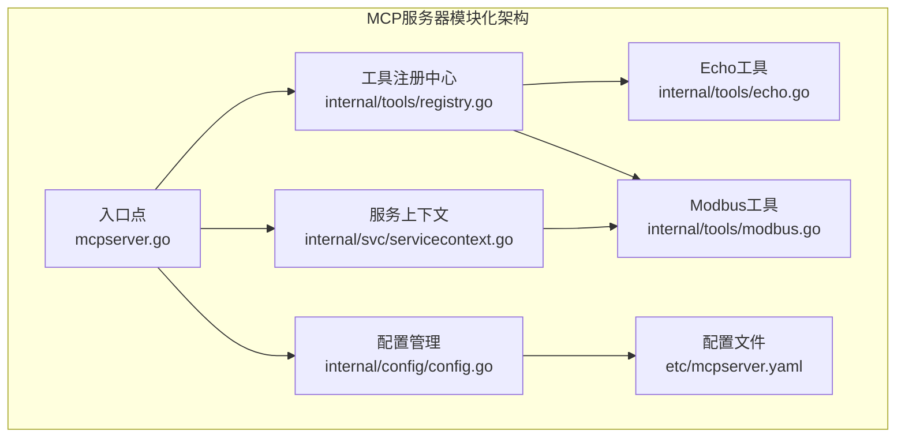
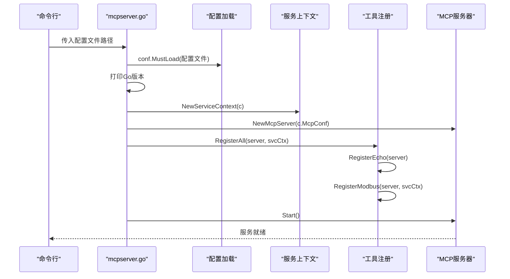
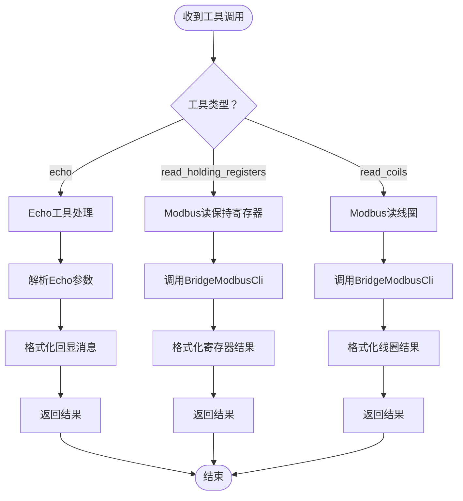
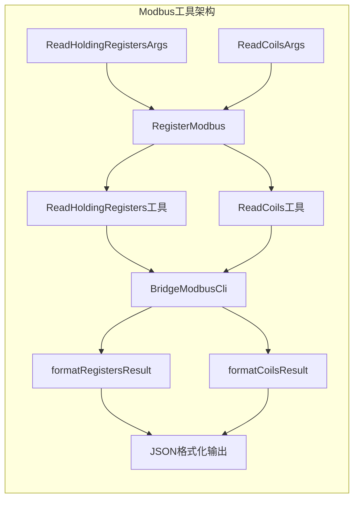
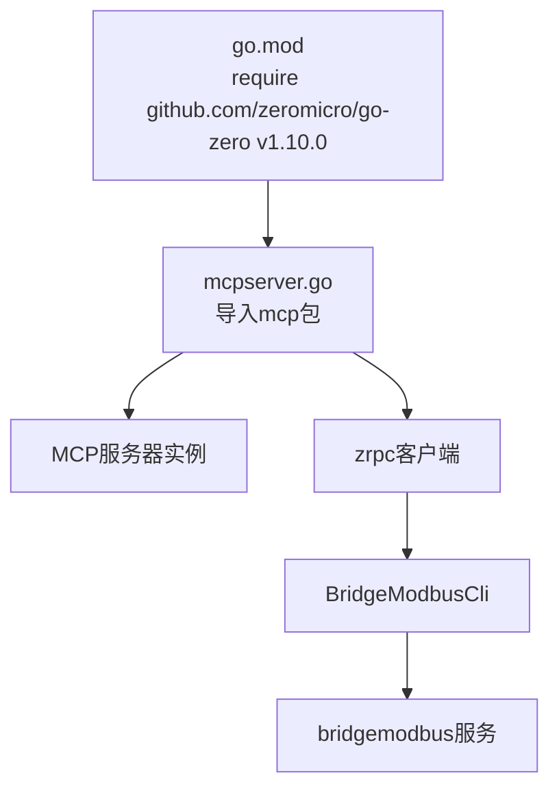

# MCP服务器

<cite>
**本文引用的文件**
- [mcpserver.go](file://aiapp/mcpserver/mcpserver.go)
- [mcpserver.yaml](file://aiapp/mcpserver/etc/mcpserver.yaml)
- [config.go](file://aiapp/mcpserver/internal/config/config.go)
- [servicecontext.go](file://aiapp/mcpserver/internal/svc/servicecontext.go)
- [registry.go](file://aiapp/mcpserver/internal/tools/registry.go)
- [echo.go](file://aiapp/mcpserver/internal/tools/echo.go)
- [modbus.go](file://aiapp/mcpserver/internal/tools/modbus.go)
- [go.mod](file://go.mod)
- [README.md](file://README.md)
</cite>

## 更新摘要
**所做更改**
- 更新了项目结构以反映模块化go-zero合规布局
- 新增了配置管理、服务上下文和工具注册的详细说明
- 扩展了工具实现部分，包含echo和Modbus工具
- 更新了架构图以展示新的模块化结构
- 增强了依赖分析和最佳实践指南

## 目录
1. [简介](#简介)
2. [项目结构](#项目结构)
3. [核心组件](#核心组件)
4. [架构总览](#架构总览)
5. [详细组件分析](#详细组件分析)
6. [工具实现详解](#工具实现详解)
7. [依赖分析](#依赖分析)
8. [性能考量](#性能考量)
9. [故障排查指南](#故障排查指南)
10. [结论](#结论)
11. [附录](#附录)

## 简介
本文件为MCP（Model Context Protocol）服务器的技术文档，围绕在本仓库中的MCP服务器实现进行系统化说明。该实现基于go-zero框架，提供模块化的MCP服务器示例，包含：
- **模块化架构**：采用go-zero合规的internal目录结构，包含config、svc、tools等子模块
- **配置管理**：独立的配置结构，支持MCP配置和RPC客户端配置
- **服务上下文**：集中管理服务依赖和服务生命周期
- **工具注册系统**：统一的工具注册机制，支持多个工具的动态注册
- **增强工具实现**：包含echo回显工具和Modbus协议工具
- **与AI生态的深度集成**：支持与Claude Code、Copilot等AI代理的技能集成

本仓库中MCP服务器属于aiapp子模块，当前实现展示了如何通过go-zero的mcp包快速搭建模块化的MCP服务，并注册多个工具供外部AI代理调用。

**章节来源**
- [mcpserver.go:19-38](file://aiapp/mcpserver/mcpserver.go#L19-L38)
- [mcpserver.yaml:1-15](file://aiapp/mcpserver/etc/mcpserver.yaml#L1-L15)

## 项目结构
MCP服务器位于aiapp/mcpserver目录，采用完全模块化的go-zero合规布局：

```
aiapp/mcpserver/
├── mcpserver.go              # 服务器入口点
├── etc/
│   └── mcpserver.yaml        # 服务器配置文件
└── internal/
    ├── config/
    │   └── config.go         # 配置结构定义
    ├── svc/
    │   └── servicecontext.go # 服务上下文管理
    └── tools/
        ├── echo.go           # echo工具实现
        ├── modbus.go         # Modbus工具实现
        └── registry.go       # 工具注册中心
```

**章节来源**
- [README.md:59-108](file://README.md#L59-L108)
- [mcpserver.go:1-38](file://aiapp/mcpserver/mcpserver.go#L1-L38)
- [mcpserver.yaml:1-15](file://aiapp/mcpserver/etc/mcpserver.yaml#L1-L15)

## 核心组件

### 配置管理模块
- **Config结构**：继承mcp.McpConf，扩展BridgeModbusRpcConf用于Modbus服务调用
- **配置加载**：通过conf.MustLoad加载YAML配置到Config结构
- **配置验证**：包含MCP基础配置和Modbus RPC客户端配置

### 服务上下文模块
- **ServiceContext结构**：包含Config和BridgeModbusCli客户端
- **依赖注入**：通过NewServiceContext集中管理服务依赖
- **客户端初始化**：基于BridgeModbusRpcConf创建gRPC客户端

### 工具注册中心
- **RegisterAll函数**：统一注册所有工具
- **工具注册机制**：支持动态工具注册和管理
- **工具隔离**：每个工具独立实现，便于维护和扩展

**章节来源**
- [config.go:8-11](file://aiapp/mcpserver/internal/config/config.go#L8-L11)
- [servicecontext.go:10-21](file://aiapp/mcpserver/internal/svc/servicecontext.go#L10-L21)
- [registry.go:9-13](file://aiapp/mcpserver/internal/tools/registry.go#L9-L13)

## 架构总览
MCP服务器在本仓库中的角色是作为AI代理的工具提供方，其模块化架构如下：



**图表来源**
- [mcpserver.go:28-33](file://aiapp/mcpserver/mcpserver.go#L28-L33)
- [config.go:8-11](file://aiapp/mcpserver/internal/config/config.go#L8-L11)
- [servicecontext.go:15-20](file://aiapp/mcpserver/internal/svc/servicecontext.go#L15-L20)
- [registry.go:10-12](file://aiapp/mcpserver/internal/tools/registry.go#L10-L12)

## 详细组件分析

### 配置与启动流程
- **配置项**
  - Name/Host/Port：服务基本监听信息
  - mcp.messageTimeout：工具调用消息超时
  - mcp.cors：允许的跨域来源列表
  - BridgeModbusRpcConf：Modbus服务RPC客户端配置
- **启动流程**
  - 解析配置文件路径
  - 加载配置并打印Go版本
  - 创建服务上下文
  - 创建MCP服务器实例
  - 统一注册所有工具
  - 启动服务



**图表来源**
- [mcpserver.go:19-36](file://aiapp/mcpserver/mcpserver.go#L19-L36)
- [config.go:8-11](file://aiapp/mcpserver/internal/config/config.go#L8-L11)
- [servicecontext.go:15-20](file://aiapp/mcpserver/internal/svc/servicecontext.go#L15-L20)
- [registry.go:10-12](file://aiapp/mcpserver/internal/tools/registry.go#L10-L12)

**章节来源**
- [mcpserver.go:19-36](file://aiapp/mcpserver/mcpserver.go#L19-L36)
- [mcpserver.yaml:1-15](file://aiapp/mcpserver/etc/mcpserver.yaml#L1-L15)

### 工具注册与调用流程
- **统一注册机制**：RegisterAll函数统一管理所有工具的注册
- **工具隔离设计**：每个工具独立实现，便于维护和扩展
- **参数验证**：每个工具都有明确的参数结构定义
- **错误处理**：工具调用包含完善的错误处理机制



**图表来源**
- [registry.go:10-12](file://aiapp/mcpserver/internal/tools/registry.go#L10-L12)
- [echo.go:22-33](file://aiapp/mcpserver/internal/tools/echo.go#L22-L33)
- [modbus.go:34-48](file://aiapp/mcpserver/internal/tools/modbus.go#L34-L48)
- [modbus.go:54-68](file://aiapp/mcpserver/internal/tools/modbus.go#L54-L68)

**章节来源**
- [registry.go:9-13](file://aiapp/mcpserver/internal/tools/registry.go#L9-L13)
- [echo.go:15-36](file://aiapp/mcpserver/internal/tools/echo.go#L15-L36)
- [modbus.go:28-69](file://aiapp/mcpserver/internal/tools/modbus.go#L28-L69)

## 工具实现详解

### Echo工具实现
- **参数结构**：包含message（必填）和prefix（可选）参数
- **功能特性**：支持自定义前缀的回显功能
- **响应格式**：返回TextContent格式的文本内容
- **使用场景**：测试工具调用链路和验证MCP协议实现

### Modbus工具实现
- **读保持寄存器工具**：支持Function Code 0x03，返回多种数值表示
- **读线圈工具**：支持Function Code 0x01，返回线圈开关状态
- **参数验证**：包含地址范围和数量限制验证
- **结果格式化**：提供JSON格式的结果输出
- **错误处理**：完善的RPC调用错误处理机制



**图表来源**
- [modbus.go:14-26](file://aiapp/mcpserver/internal/tools/modbus.go#L14-L26)
- [modbus.go:29-69](file://aiapp/mcpserver/internal/tools/modbus.go#L29-L69)
- [modbus.go:78-99](file://aiapp/mcpserver/internal/tools/modbus.go#L78-L99)
- [modbus.go:107-127](file://aiapp/mcpserver/internal/tools/modbus.go#L107-L127)

**章节来源**
- [echo.go:9-36](file://aiapp/mcpserver/internal/tools/echo.go#L9-L36)
- [modbus.go:14-128](file://aiapp/mcpserver/internal/tools/modbus.go#L14-L128)

## 依赖分析
- **go-zero mcp包**：核心MCP服务器功能
- **go-zero zrpc包**：RPC客户端通信支持
- **项目模块依赖**：go.mod中声明的github.com/zeromicro/go-zero v1.10.0
- **Modbus服务依赖**：app/bridgemodbus模块提供Modbus协议支持
- **第三方依赖**：grid-x/modbus用于Modbus协议实现



**图表来源**
- [go.mod:50](file://go.mod#L50)
- [mcpserver.go:12-14](file://aiapp/mcpserver/mcpserver.go#L12-L14)
- [servicecontext.go:18-19](file://aiapp/mcpserver/internal/svc/servicecontext.go#L18-L19)

**章节来源**
- [go.mod:50](file://go.mod#L50)
- [mcpserver.go:12-14](file://aiapp/mcpserver/mcpserver.go#L12-L14)
- [servicecontext.go:18-19](file://aiapp/mcpserver/internal/svc/servicecontext.go#L18-L19)

## 性能考量
- **模块化优势**：清晰的职责分离，便于性能优化和资源管理
- **服务上下文复用**：统一的服务上下文管理，避免重复初始化
- **工具注册优化**：统一注册机制，减少工具加载开销
- **RPC调用优化**：Modbus工具通过RPC调用，支持连接池和超时控制
- **日志管理**：启动前可选择关闭统计日志，降低启动阶段开销

**章节来源**
- [mcpserver.go:25-26](file://aiapp/mcpserver/mcpserver.go#L25-L26)
- [mcpserver.yaml:6](file://aiapp/mcpserver/etc/mcpserver.yaml#L6)
- [servicecontext.go:15-20](file://aiapp/mcpserver/internal/svc/servicecontext.go#L15-L20)

## 故障排查指南
- **配置加载失败**
  - 确认配置文件路径正确，且etc/mcpserver.yaml存在
  - 检查配置项格式是否符合YAML规范
  - 验证BridgeModbusRpcConf配置的RPC服务可达性
- **工具调用异常**
  - 检查工具schema定义与参数传递是否一致
  - 查看参数解析与处理逻辑，定位错误分支
  - 对于Modbus工具，检查Modbus设备连接状态
- **CORS问题**
  - 若出现跨域错误，确认mcp.cors配置中包含正确的来源地址
- **RPC调用失败**
  - 检查bridgemodbus服务是否正常运行
  - 验证Modbus设备地址和参数范围
  - 查看RPC超时和连接池配置

**章节来源**
- [mcpserver.go:22-23](file://aiapp/mcpserver/mcpserver.go#L22-L23)
- [mcpserver.yaml:7-8](file://aiapp/mcpserver/etc/mcpserver.yaml#L7-L8)
- [mcpserver.yaml:10-15](file://aiapp/mcpserver/etc/mcpserver.yaml#L10-L15)

## 结论
本MCP服务器在本仓库中提供了高度模块化的实现范例，展示了如何基于go-zero构建企业级的MCP服务。当前实现具有以下特点：
- **模块化架构**：完全符合go-zero合规布局，便于维护和扩展
- **工具丰富性**：包含基础的echo工具和实用的Modbus工具
- **服务集成**：与bridgemodbus服务深度集成，提供工业协议支持
- **配置灵活**：支持MCP配置和RPC客户端配置的统一管理
- **易于扩展**：模块化设计使得新增工具变得简单直观

后续演进方向：
- 增强工具安全策略（如鉴权、限流）
- 完善监控与可观测性指标
- 扩展更多工业协议工具
- 增加工具版本管理和热更新机制

## 附录

### 配置项说明
- **Name**：服务名称
- **Host**：监听主机
- **Port**：监听端口
- **mcp.messageTimeout**：消息超时时间
- **mcp.cors**：允许的跨域来源列表
- **BridgeModbusRpcConf.Endpoints**：Modbus服务RPC端点
- **BridgeModbusRpcConf.NonBlock**：非阻塞模式
- **BridgeModbusRpcConf.Timeout**：RPC调用超时时间

**章节来源**
- [mcpserver.yaml:1-15](file://aiapp/mcpserver/etc/mcpserver.yaml#L1-L15)

### 工具参数说明

#### Echo工具参数
- **message**：必填字符串，要回显的消息
- **prefix**：可选字符串，添加到回显消息前的前缀，默认"Echo: "

#### Modbus工具参数

##### 读保持寄存器参数
- **modbusCode**：可选字符串，Modbus配置编码，空则使用默认配置
- **address**：必填整数，起始寄存器地址
- **quantity**：必填整数，读取数量(1-125)

##### 读线圈参数
- **modbusCode**：可选字符串，Modbus配置编码，空则使用默认配置
- **address**：必填整数，起始线圈地址
- **quantity**：必填整数，读取数量(1-2000)

**章节来源**
- [echo.go:10-13](file://aiapp/mcpserver/internal/tools/echo.go#L10-L13)
- [modbus.go:14-26](file://aiapp/mcpserver/internal/tools/modbus.go#L14-L26)

### 最佳实践
- **使用模块化结构**：遵循go-zero合规布局，便于团队协作
- **配置分离**：将MCP配置和RPC配置分离管理
- **工具注册**：通过统一的RegisterAll函数管理工具注册
- **错误处理**：为每个工具实现完善的错误处理机制
- **日志管理**：合理配置日志级别，避免生产环境日志污染
- **性能优化**：利用服务上下文复用资源，减少初始化开销

**章节来源**
- [mcpserver.go:17](file://aiapp/mcpserver/mcpserver.go#L17)
- [mcpserver.go:25-26](file://aiapp/mcpserver/mcpserver.go#L25-L26)
- [registry.go:9-13](file://aiapp/mcpserver/internal/tools/registry.go#L9-L13)