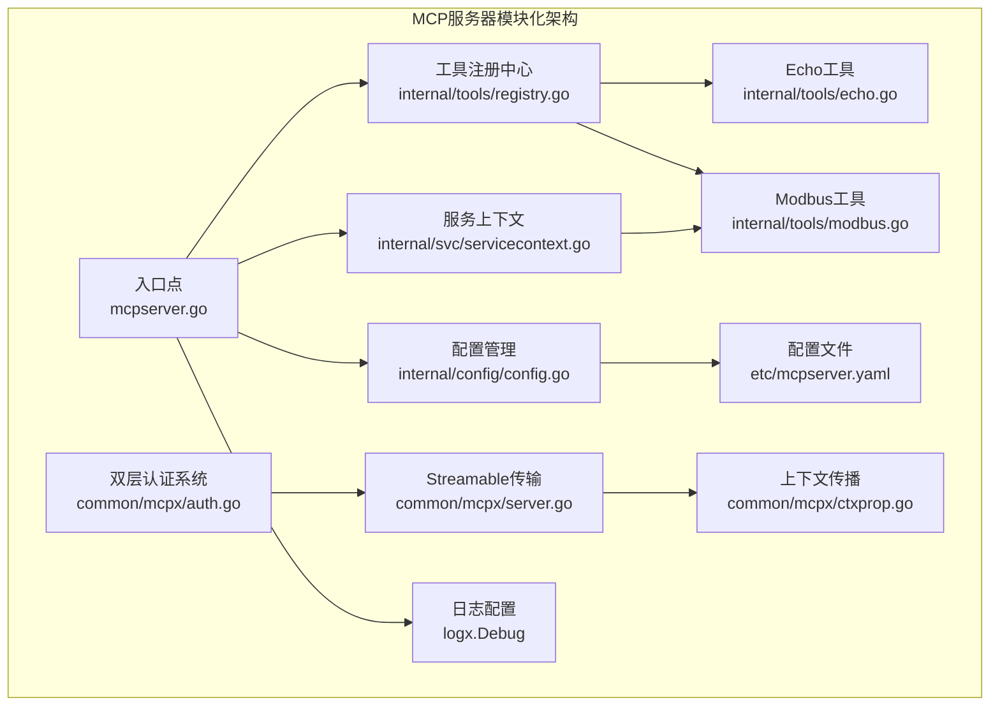
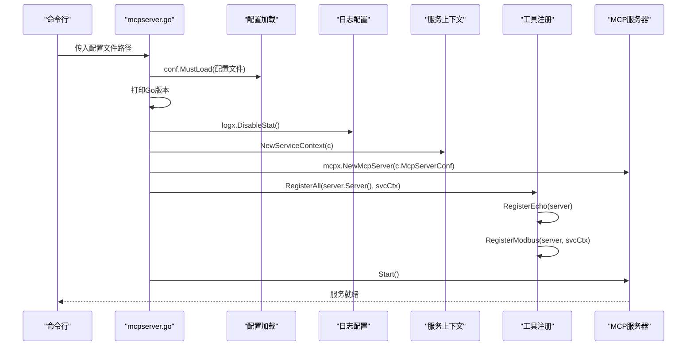
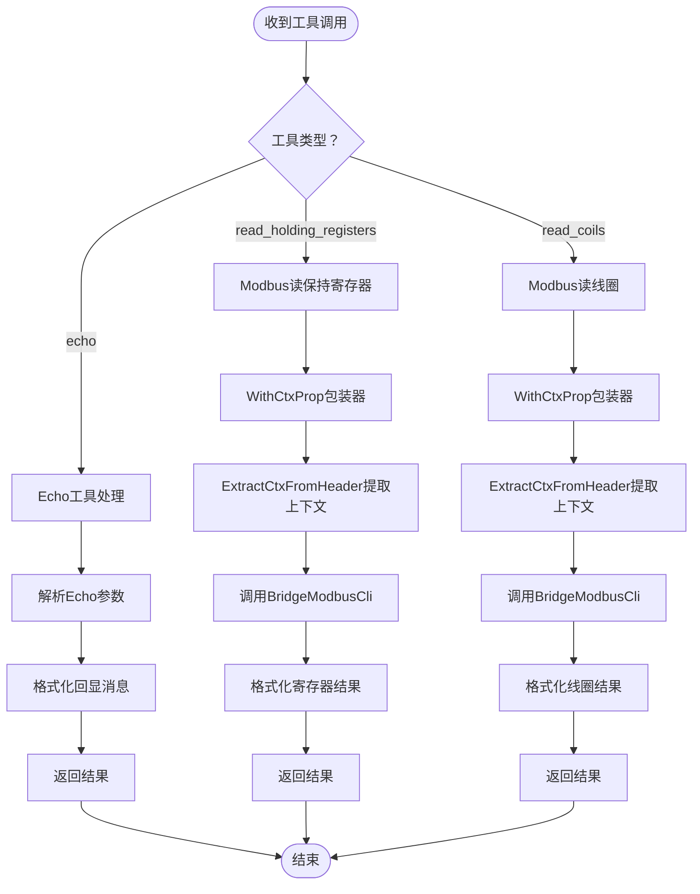
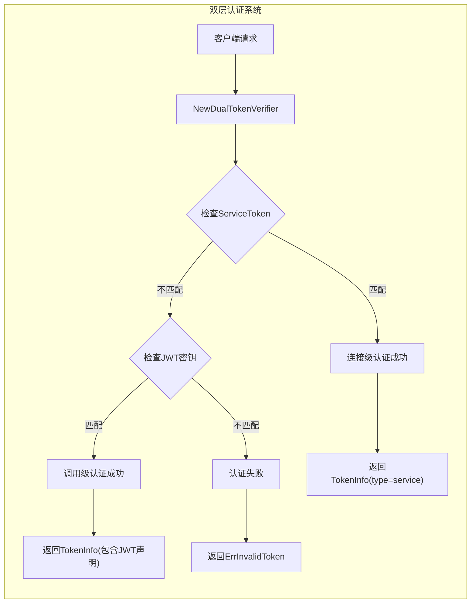
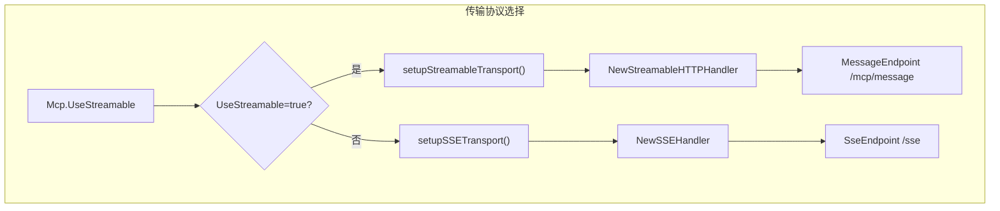
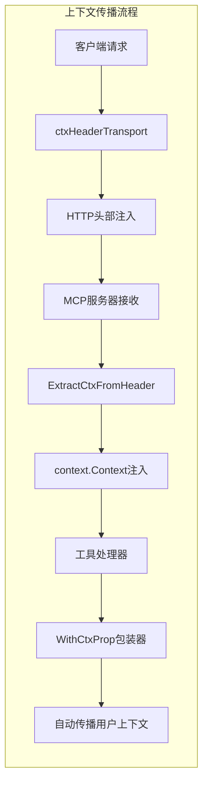
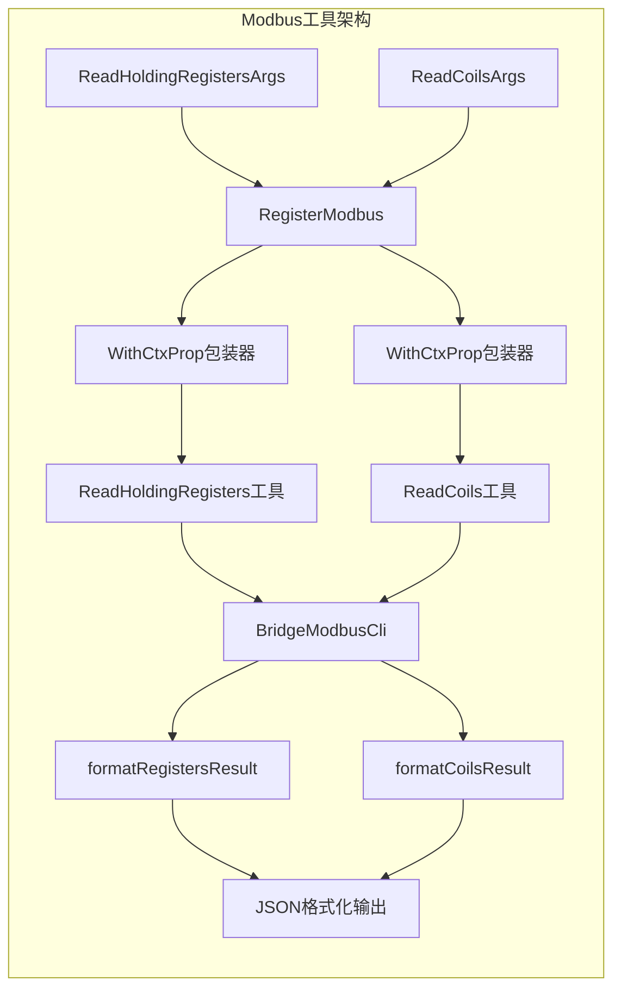
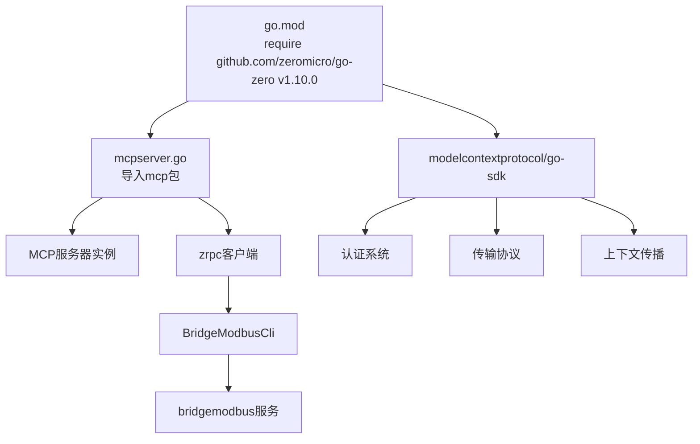

# MCP服务器

<cite>
**本文档引用的文件**
- [mcpserver.go](file://aiapp/mcpserver/mcpserver.go)
- [mcpserver.yaml](file://aiapp/mcpserver/etc/mcpserver.yaml)
- [config.go](file://aiapp/mcpserver/internal/config/config.go)
- [servicecontext.go](file://aiapp/mcpserver/internal/svc/servicecontext.go)
- [registry.go](file://aiapp/mcpserver/internal/tools/registry.go)
- [echo.go](file://aiapp/mcpserver/internal/tools/echo.go)
- [modbus.go](file://aiapp/mcpserver/internal/tools/modbus.go)
- [server.go](file://common/mcpx/server.go)
- [auth.go](file://common/mcpx/auth.go)
- [client.go](file://common/mcpx/client.go)
- [ctxprop.go](file://common/mcpx/ctxprop.go)
- [ctxData.go](file://common/ctxdata/ctxData.go)
- [config.go](file://aiapp/aichat/internal/config/config.go)
- [go.mod](file://go.mod)
- [README.md](file://README.md)
</cite>

## 更新摘要
**所做更改**
- **日志级别提升**：将MCP服务器日志级别从默认值提升到debug级别，提供更详细的调试信息
- **启动优化**：在服务启动时禁用统计日志，减少启动阶段的日志开销
- **配置结构现代化**：简化MCP配置结构，移除冗余的Mcp字段嵌套，采用更直观的配置层次
- **认证系统增强**：保持双层认证系统的完整性，支持JWT令牌和连接级服务令牌的双重验证
- **传输协议支持**：继续支持Streamable HTTP传输协议和SSE传输协议的选择
- **上下文传播机制**：维持完整的HTTP头部与上下文的双向映射和自动传播

## 目录
1. [简介](#简介)
2. [项目结构](#项目结构)
3. [核心组件](#核心组件)
4. [架构总览](#架构总览)
5. [详细组件分析](#详细组件分析)
6. [双层认证系统](#双层认证系统)
7. [Streamable HTTP传输协议](#streamable-http传输协议)
8. [上下文传播机制](#上下文传播机制)
9. [工具实现详解](#工具实现详解)
10. [配置管理增强](#配置管理增强)
11. [日志配置优化](#日志配置优化)
12. [依赖分析](#依赖分析)
13. [性能考量](#性能考量)
14. [故障排查指南](#故障排查指南)
15. [结论](#结论)
16. [附录](#附录)

## 简介
本文件为MCP（Model Context Protocol）服务器的技术文档，围绕在本仓库中的MCP服务器实现进行系统化说明。该实现基于go-zero框架和最新的MCP协议规范，提供模块化的MCP服务器示例，包含：

- **双层认证系统**：支持JWT令牌和连接级服务令牌的双重验证机制
- **Streamable HTTP传输协议**：实现2025年3月26日规范的流式HTTP传输
- **上下文传播机制**：实现HTTP头部与上下文的双向映射和自动传播
- **模块化架构**：采用go-zero合规的internal目录结构，包含config、svc、tools等子模块
- **增强配置管理**：支持Auth配置段落和useStreamable标志
- **服务上下文**：集中管理服务依赖和服务生命周期
- **工具注册系统**：统一的工具注册机制，支持多个工具的动态注册
- **增强工具实现**：包含echo回显工具和Modbus协议工具，支持上下文传播
- **与AI生态的深度集成**：支持与Claude Code、Copilot等AI代理的技能集成
- **现代化配置结构**：采用简化的配置层次，提供更好的可读性和维护性

本仓库中MCP服务器属于aiapp子模块，当前实现展示了如何通过go-zero的mcp包快速搭建模块化的MCP服务，并注册多个工具供外部AI代理调用。

**章节来源**
- [mcpserver.go:19-38](file://aiapp/mcpserver/mcpserver.go#L19-L38)
- [mcpserver.yaml:1-24](file://aiapp/mcpserver/etc/mcpserver.yaml#L1-L24)

## 项目结构
MCP服务器位于aiapp/mcpserver目录，采用完全模块化的go-zero合规布局：

```
aiapp/mcpserver/
├── mcpserver.go              # 服务器入口点
├── etc/
│   └── mcpserver.yaml        # 服务器配置文件（含Auth配置）
└── internal/
    ├── config/
    │   └── config.go         # 配置结构定义
    ├── svc/
    │   └── servicecontext.go # 服务上下文管理
    └── tools/
        ├── echo.go           # echo工具实现
        ├── modbus.go         # Modbus工具实现
        └── registry.go       # 工具注册中心
```

**章节来源**
- [README.md:59-108](file://README.md#L59-L108)
- [mcpserver.go:1-39](file://aiapp/mcpserver/mcpserver.go#L1-L39)
- [mcpserver.yaml:1-24](file://aiapp/mcpserver/etc/mcpserver.yaml#L1-L24)

## 核心组件

### 配置管理模块
- **Config结构**：继承mcpx.McpServerConf，扩展BridgeModbusRpcConf用于Modbus服务调用
- **配置加载**：通过conf.MustLoad加载YAML配置到Config结构
- **配置验证**：包含MCP基础配置、Auth配置和Modbus RPC客户端配置
- **环境标识**：支持Mode开发环境标识，便于环境特定配置管理

### 服务上下文模块
- **ServiceContext结构**：包含Config和BridgeModbusCli客户端
- **依赖注入**：通过NewServiceContext集中管理服务依赖
- **客户端初始化**：基于BridgeModbusRpcConf创建gRPC客户端

### 工具注册中心
- **RegisterAll函数**：统一注册所有工具
- **工具注册机制**：支持动态工具注册和管理
- **工具隔离**：每个工具独立实现，便于维护和扩展

**章节来源**
- [config.go:8-12](file://aiapp/mcpserver/internal/config/config.go#L8-L12)
- [servicecontext.go:10-24](file://aiapp/mcpserver/internal/svc/servicecontext.go#L10-L24)
- [registry.go:9-13](file://aiapp/mcpserver/internal/tools/registry.go#L9-L13)

## 架构总览
MCP服务器在本仓库中的角色是作为AI代理的工具提供方，其模块化架构如下：



**图表来源**
- [mcpserver.go:28-33](file://aiapp/mcpserver/mcpserver.go#L28-L33)
- [config.go:8-12](file://aiapp/mcpserver/internal/config/config.go#L8-L12)
- [servicecontext.go:15-24](file://aiapp/mcpserver/internal/svc/servicecontext.go#L15-L24)
- [registry.go:10-12](file://aiapp/mcpserver/internal/tools/registry.go#L10-L12)

## 详细组件分析

### 配置与启动流程
- **配置项**
  - Name/Host/Port：服务基本监听信息
  - Mode: dev：开发环境标识
  - Mcp.UseStreamable: false：启用Streamable HTTP传输协议
  - Log：日志配置，包含Encoding、Path、Level: debug、KeepDays
  - Auth：认证配置段落，包含JwtSecrets和ServiceToken
  - BridgeModbusRpcConf：Modbus服务RPC客户端配置
- **启动流程**
  - 解析配置文件路径
  - 加载配置并打印Go版本
  - 禁用统计日志以优化启动性能
  - 创建服务上下文
  - 创建MCP服务器实例（使用mcpx.NewMcpServer）
  - 统一注册所有工具
  - 启动服务



**图表来源**
- [mcpserver.go:19-38](file://aiapp/mcpserver/mcpserver.go#L19-L38)
- [config.go:8-12](file://aiapp/mcpserver/internal/config/config.go#L8-L12)
- [servicecontext.go:15-24](file://aiapp/mcpserver/internal/svc/servicecontext.go#L15-L24)
- [registry.go:10-12](file://aiapp/mcpserver/internal/tools/registry.go#L10-L12)

**章节来源**
- [mcpserver.go:19-38](file://aiapp/mcpserver/mcpserver.go#L19-L38)
- [mcpserver.yaml:1-24](file://aiapp/mcpserver/etc/mcpserver.yaml#L1-L24)

### 工具注册与调用流程
- **统一注册机制**：RegisterAll函数统一管理所有工具的注册
- **工具隔离设计**：每个工具独立实现，便于维护和扩展
- **参数验证**：每个工具都有明确的参数结构定义
- **错误处理**：工具调用包含完善的错误处理机制
- **上下文传播**：Modbus工具使用WithCtxProp包装器自动传播上下文



**图表来源**
- [registry.go:10-12](file://aiapp/mcpserver/internal/tools/registry.go#L10-L12)
- [echo.go:22-36](file://aiapp/mcpserver/internal/tools/echo.go#L22-L36)
- [modbus.go:34-69](file://aiapp/mcpserver/internal/tools/modbus.go#L34-L69)
- [ctxprop.go:48-58](file://common/mcpx/ctxprop.go#L48-L58)

**章节来源**
- [registry.go:9-13](file://aiapp/mcpserver/internal/tools/registry.go#L9-L13)
- [echo.go:15-37](file://aiapp/mcpserver/internal/tools/echo.go#L15-L37)
- [modbus.go:28-129](file://aiapp/mcpserver/internal/tools/modbus.go#L28-L129)

## 双层认证系统

### 认证架构
MCP服务器实现了双层认证系统，提供灵活的安全机制：



**图表来源**
- [auth.go:15-48](file://common/mcpx/auth.go#L15-L48)

### 认证流程
1. **ServiceToken验证**：使用常量时间比较算法验证连接级服务令牌
2. **JWT验证**：如果ServiceToken验证失败，尝试解析JWT令牌
3. **TokenInfo生成**：根据验证结果生成相应的TokenInfo
4. **过期时间处理**：JWT令牌设置合理的过期时间

### 配置要求
- **JwtSecrets**：支持多个JWT密钥，提高安全性
- **ServiceToken**：连接级服务令牌，用于内部服务间通信
- **常量时间比较**：防止时序攻击

**章节来源**
- [auth.go:15-48](file://common/mcpx/auth.go#L15-L48)
- [mcpserver.yaml:14-17](file://aiapp/mcpserver/etc/mcpserver.yaml#L14-L17)

## Streamable HTTP传输协议

### 协议支持
MCP服务器支持两种传输协议：



**图表来源**
- [server.go:64-110](file://common/mcpx/server.go#L64-L110)

### Streamable HTTP特性
- **2025-03-26规范**：支持最新的MCP协议规范
- **独立POST请求**：每次工具调用都是独立的HTTP POST请求
- **DELETE方法支持**：支持Streamable HTTP的DELETE方法
- **超时配置**：支持messageTimeout超时设置

### SSE传输对比
- **SSE协议**：基于Server-Sent Events的长连接
- **Streamable协议**：基于HTTP的流式传输
- **适用场景**：Streamable更适合工具调用场景，SSE适合持续连接场景

**章节来源**
- [server.go:64-140](file://common/mcpx/server.go#L64-L140)
- [mcpserver.yaml:6](file://aiapp/mcpserver/etc/mcpserver.yaml#L6)

## 上下文传播机制

### 上下文传播架构
MCP服务器实现了完整的上下文传播机制：



**图表来源**
- [client.go:313-347](file://common/mcpx/client.go#L313-L347)
- [ctxprop.go:25-58](file://common/mcpx/ctxprop.go#L25-L58)

### 头部映射关系
支持的上下文字段映射：

| HTTP头部 | 上下文键 | 描述 |
|---------|---------|------|
| Authorization | CtxAuthorizationKey | 用户认证令牌 |
| X-User-Id | CtxUserIdKey | 用户ID |
| X-User-Name | CtxUserNameKey | 用户名 |
| X-Dept-Code | CtxDeptCodeKey | 部门编码 |
| X-Trace-Id | CtxTraceIdKey | 跟踪ID |

### 传播机制
1. **客户端侧**：ctxHeaderTransport从context提取用户上下文，注入HTTP头部
2. **服务端侧**：ExtractCtxFromHeader从HTTP头部提取用户上下文，注入context
3. **工具侧**：WithCtxProp包装器自动传播上下文到工具处理器

### 降级机制
- **Authorization降级**：当context中没有用户JWT时，使用ServiceToken
- **空上下文处理**：当HTTP头部为空时，直接返回原context

**章节来源**
- [ctxprop.go:13-58](file://common/mcpx/ctxprop.go#L13-L58)
- [client.go:313-347](file://common/mcpx/client.go#L313-L347)
- [ctxData.go:9-24](file://common/ctxdata/ctxData.go#L9-L24)

## 工具实现详解

### Echo工具实现
- **参数结构**：包含message（必填）和prefix（可选）参数
- **功能特性**：支持自定义前缀的回显功能
- **响应格式**：返回TextContent格式的文本内容
- **使用场景**：测试工具调用链路和验证MCP协议实现

### Modbus工具实现
- **读保持寄存器工具**：支持Function Code 0x03，返回多种数值表示
- **读线圈工具**：支持Function Code 0x01，返回线圈开关状态
- **参数验证**：包含地址范围和数量限制验证
- **结果格式化**：提供JSON格式的结果输出
- **错误处理**：完善的RPC调用错误处理机制
- **上下文传播**：使用WithCtxProp包装器自动传播用户上下文



**图表来源**
- [modbus.go:14-27](file://aiapp/mcpserver/internal/tools/modbus.go#L14-L27)
- [modbus.go:29-69](file://aiapp/mcpserver/internal/tools/modbus.go#L29-L69)
- [ctxprop.go:48-58](file://common/mcpx/ctxprop.go#L48-L58)

**章节来源**
- [echo.go:9-37](file://aiapp/mcpserver/internal/tools/echo.go#L9-L37)
- [modbus.go:14-129](file://aiapp/mcpserver/internal/tools/modbus.go#L14-L129)

## 配置管理增强

### 认证配置
- **JwtSecrets**：支持多个JWT密钥，提高安全性
- **ServiceToken**：连接级服务令牌，用于内部服务间通信
- **配置验证**：支持空配置，无认证时跳过认证中间件

### 传输协议配置
- **UseStreamable**：启用Streamable HTTP传输协议
- **MessageTimeout**：工具调用消息超时时间
- **Cors**：允许的跨域来源列表

### 配置文件结构更新
- **YAML结构**：支持多层嵌套配置
- **配置层次**：Name、Host、Port、Mode、Mcp、Log、Auth、BridgeModbusRpcConf等配置项
- **配置验证**：确保配置项的完整性和正确性

**章节来源**
- [mcpserver.yaml:5-24](file://aiapp/mcpserver/etc/mcpserver.yaml#L5-L24)

## 日志配置优化

### 日志级别提升
MCP服务器采用了更详细的日志记录策略：

```mermaid
graph TB
subgraph "日志配置优化"
A["配置文件"] --> B["Log.Level: debug"]
A --> C["Log.Encoding: plain"]
A --> D["Log.Path: /opt/logs/mcpserver"]
A --> E["Log.KeepDays: 300"]
F["启动流程"] --> G["logx.DisableStat()"]
G --> H["禁用统计日志"]
B --> I["启用详细调试日志"]
C --> J["纯文本格式"]
D --> K["标准日志路径"]
E --> L["长期保留策略"]
```

**图表来源**
- [mcpserver.go:25-26](file://aiapp/mcpserver/mcpserver.go#L25-L26)
- [mcpserver.yaml:7-12](file://aiapp/mcpserver/etc/mcpserver.yaml#L7-L12)

### 日志配置特性
- **Debug级别**：提供详细的调试信息，便于问题诊断
- **纯文本格式**：使用plain编码，便于日志分析和处理
- **标准路径**：日志文件保存在/opt/logs/mcpserver目录
- **长期保留**：保留300天的日志，支持长期审计需求
- **启动优化**：禁用统计日志，减少启动阶段的性能开销

### 启动流程优化
- **统计日志禁用**：在服务启动时调用logx.DisableStat()，避免统计信息干扰
- **Go版本显示**：启动时显示Go运行时版本信息
- **资源清理**：服务停止时自动清理资源

**章节来源**
- [mcpserver.go:25-26](file://aiapp/mcpserver/mcpserver.go#L25-L26)
- [mcpserver.yaml:7-12](file://aiapp/mcpserver/etc/mcpserver.yaml#L7-L12)

## 依赖分析
- **go-zero mcp包**：核心MCP服务器功能
- **go-zero zrpc包**：RPC客户端通信支持
- **modelcontextprotocol/go-sdk**：MCP协议SDK
- **项目模块依赖**：go.mod中声明的github.com/zeromicro/go-zero v1.10.0
- **Modbus服务依赖**：app/bridgemodbus模块提供Modbus协议支持
- **第三方依赖**：grid-x/modbus用于Modbus协议实现



**图表来源**
- [go.mod:50](file://go.mod#L50)
- [mcpserver.go:12-14](file://aiapp/mcpserver/mcpserver.go#L12-L14)
- [servicecontext.go:18-23](file://aiapp/mcpserver/internal/svc/servicecontext.go#L18-L23)

**章节来源**
- [go.mod:50](file://go.mod#L50)
- [mcpserver.go:12-14](file://aiapp/mcpserver/mcpserver.go#L12-L14)
- [servicecontext.go:18-23](file://aiapp/mcpserver/internal/svc/servicecontext.go#L18-L23)

## 性能考量
- **模块化优势**：清晰的职责分离，便于性能优化和资源管理
- **服务上下文复用**：统一的服务上下文管理，避免重复初始化
- **工具注册优化**：统一注册机制，减少工具加载开销
- **RPC调用优化**：Modbus工具通过RPC调用，支持连接池和超时控制
- **认证优化**：双层认证系统支持常量时间比较，防止时序攻击
- **传输协议优化**：Streamable HTTP协议适合工具调用场景，减少连接开销
- **上下文传播优化**：高效的头部映射和上下文注入机制
- **日志管理优化**：启动前可选择关闭统计日志，降低启动阶段开销
- **环境配置优化**：开发环境标识便于调试和性能分析
- **日志级别优化**：debug级别提供详细信息，同时通过禁用统计日志优化性能

**章节来源**
- [mcpserver.go:25-26](file://aiapp/mcpserver/mcpserver.go#L25-L26)
- [mcpserver.yaml:4](file://aiapp/mcpserver/etc/mcpserver.yaml#L4)
- [servicecontext.go:15-24](file://aiapp/mcpserver/internal/svc/servicecontext.go#L15-L24)

## 故障排查指南
- **配置加载失败**
  - 确认配置文件路径正确，且etc/mcpserver.yaml存在
  - 检查配置项格式是否符合YAML规范
  - 验证BridgeModbusRpcConf配置的RPC服务可达性
  - 检查Auth配置的JwtSecrets和ServiceToken格式
- **认证失败**
  - 检查JWT令牌是否在JwtSecrets中配置
  - 验证ServiceToken是否正确配置
  - 确认客户端发送的Authorization头部格式
  - 查看认证日志中的具体错误信息
- **工具调用异常**
  - 检查工具schema定义与参数传递是否一致
  - 查看参数解析与处理逻辑，定位错误分支
  - 对于Modbus工具，检查Modbus设备连接状态
  - 验证上下文传播是否正常工作
- **传输协议问题**
  - 确认UseStreamable配置与客户端兼容
  - 检查MessageTimeout和Cors配置
  - 验证Streamable HTTP和SSE端点配置
- **RPC调用失败**
  - 检查bridgemodbus服务是否正常运行
  - 验证Modbus设备地址和参数范围
  - 查看RPC超时和连接池配置
- **上下文传播问题**
  - 检查HTTP头部是否正确注入
  - 验证context键值对的映射关系
  - 确认WithCtxProp包装器是否正确使用
- **日志问题**
  - 检查Log.Encoding配置的编码格式是否支持
  - 验证Log.Path目录的可写权限
  - 确认开发环境标识Mode: dev的正确性
  - 验证日志级别是否为debug以获取详细信息
- **启动性能问题**
  - 确认logx.DisableStat()调用是否正确执行
  - 检查日志文件权限和磁盘空间
  - 验证配置文件的语法正确性

**章节来源**
- [mcpserver.go:22-23](file://aiapp/mcpserver/mcpserver.go#L22-L23)
- [mcpserver.yaml:7-8](file://aiapp/mcpserver/etc/mcpserver.yaml#L7-L8)
- [mcpserver.yaml:10-18](file://aiapp/mcpserver/etc/mcpserver.yaml#L10-L18)

## 结论
本MCP服务器在本仓库中提供了高度模块化的实现范例，展示了如何基于go-zero构建企业级的MCP服务。当前实现具有以下特点：

- **双层认证系统**：支持JWT令牌和连接级服务令牌的双重验证机制
- **Streamable HTTP传输协议**：实现2025年3月26日规范的流式HTTP传输
- **上下文传播机制**：实现HTTP头部与上下文的双向映射和自动传播
- **模块化架构**：完全符合go-zero合规布局，便于维护和扩展
- **增强配置管理**：支持Auth配置段落和useStreamable标志
- **现代化配置结构**：采用简化的配置层次，提供更好的可读性和维护性
- **优化日志配置**：debug级别日志提供详细信息，同时通过禁用统计日志优化启动性能
- **工具丰富性**：包含基础的echo工具和实用的Modbus工具
- **服务集成**：与bridgemodbus服务深度集成，提供工业协议支持
- **配置灵活**：支持MCP配置和RPC配置的统一管理

后续演进方向：
- 增强工具安全策略（如鉴权、限流）
- 完善监控与可观测性指标
- 扩展更多工业协议工具
- 增加工具版本管理和热更新机制
- 优化日志配置和环境特定的配置管理
- 支持多服务器连接和负载均衡

## 附录

### 配置项说明
- **Name**：服务名称
- **Host**：监听主机
- **Port**：监听端口
- **Mode**：开发环境标识（dev）
- **Mcp.UseStreamable**：启用Streamable HTTP传输协议
- **Log.Encoding**：日志编码格式（plain）
- **Log.Path**：日志文件路径（/opt/logs/mcpserver）
- **Log.Level**：日志级别（debug）
- **Log.KeepDays**：日志保留天数（300）
- **Auth.JwtSecrets**：JWT密钥数组
- **Auth.ServiceToken**：服务令牌
- **BridgeModbusRpcConf.Endpoints**：Modbus服务RPC端点
- **BridgeModbusRpcConf.NonBlock**：非阻塞模式
- **BridgeModbusRpcConf.Timeout**：RPC调用超时时间

**章节来源**
- [mcpserver.yaml:1-24](file://aiapp/mcpserver/etc/mcpserver.yaml#L1-L24)

### 工具参数说明

#### Echo工具参数
- **message**：必填字符串，要回显的消息
- **prefix**：可选字符串，添加到回显消息前的前缀，默认"Echo: "

#### Modbus工具参数

##### 读保持寄存器参数
- **modbusCode**：可选字符串，Modbus配置编码，空则使用默认配置
- **address**：必填整数，起始寄存器地址
- **quantity**：必填整数，读取数量(1-125)

##### 读线圈参数
- **modbusCode**：可选字符串，Modbus配置编码，空则使用默认配置
- **address**：必填整数，起始线圈地址
- **quantity**：必填整数，读取数量(1-2000)

### 最佳实践
- **使用模块化结构**：遵循go-zero合规布局，便于团队协作
- **配置分离**：将MCP配置和RPC配置分离管理
- **环境配置**：合理使用Mode开发环境标识
- **认证配置**：正确配置JwtSecrets和ServiceToken
- **传输协议选择**：根据使用场景选择合适的传输协议
- **上下文传播**：确保上下文传播机制正常工作
- **工具注册**：通过统一的RegisterAll函数管理工具注册
- **错误处理**：为每个工具实现完善的错误处理机制
- **性能优化**：利用服务上下文复用资源，减少初始化开销
- **日志管理**：合理配置日志级别和保留策略，平衡调试需求和存储成本

**章节来源**
- [mcpserver.go:17](file://aiapp/mcpserver/mcpserver.go#L17)
- [mcpserver.go:25-26](file://aiapp/mcpserver/mcpserver.go#L25-L26)
- [registry.go:9-13](file://aiapp/mcpserver/internal/tools/registry.go#L9-L13)
- [mcpserver.yaml:4-7](file://aiapp/mcpserver/etc/mcpserver.yaml#L4-L7)