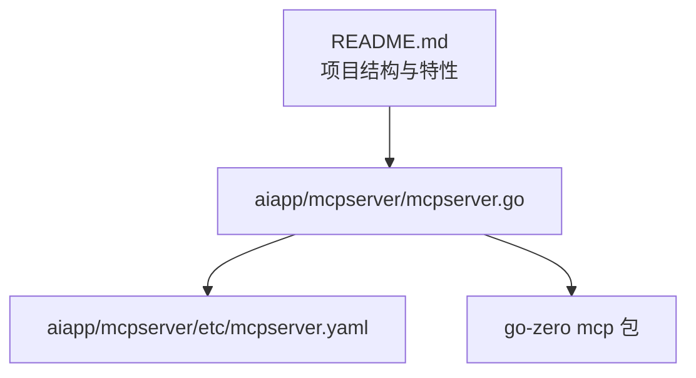
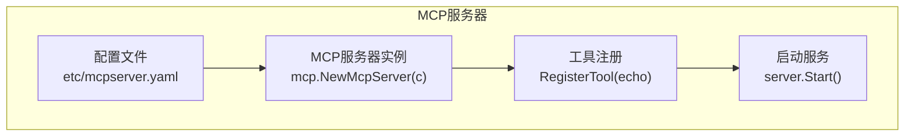
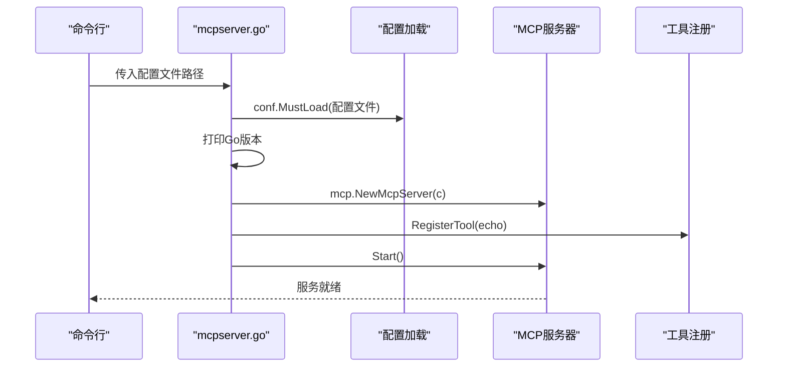
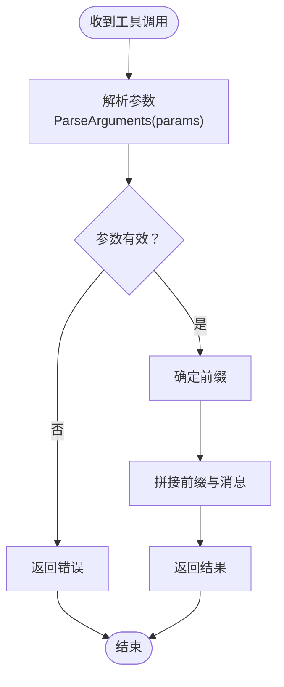
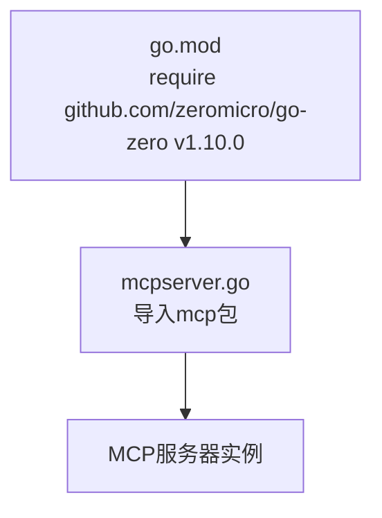

# MCP服务器

<cite>
**本文引用的文件**
- [mcpserver.go](file://aiapp/mcpserver/mcpserver.go)
- [mcpserver.yaml](file://aiapp/mcpserver/etc/mcpserver.yaml)
- [go.mod](file://go.mod)
- [README.md](file://README.md)
- [SKILL.md](file://.trae/skills/zero-skills/SKILL.md)
- [README_CN.md](file://.trae/skills/zero-skills/README.md)
</cite>

## 目录
1. [简介](#简介)
2. [项目结构](#项目结构)
3. [核心组件](#核心组件)
4. [架构总览](#架构总览)
5. [详细组件分析](#详细组件分析)
6. [依赖分析](#依赖分析)
7. [性能考量](#性能考量)
8. [故障排查指南](#故障排查指南)
9. [结论](#结论)
10. [附录](#附录)

## 简介
本文件为MCP（Model Context Protocol）服务器的技术文档，围绕在本仓库中的MCP服务器实现进行系统化说明。该实现基于go-zero框架，提供最小可用的MCP服务器示例，包含：
- 服务器启动与配置加载
- 工具注册与调用（示例：echo工具）
- 基础的CORS与消息超时配置
- 与AI生态（如Claude Code、Copilot等）的技能与集成说明

本仓库中MCP服务器属于aiapp子模块，当前实现以演示为主，展示了如何通过go-zero的mcp包快速搭建MCP服务，并注册一个简单的工具供外部AI代理调用。

章节来源
- [mcpserver.go:19-75](file://aiapp/mcpserver/mcpserver.go#L19-L75)
- [mcpserver.yaml:1-9](file://aiapp/mcpserver/etc/mcpserver.yaml#L1-L9)

## 项目结构
MCP服务器位于aiapp/mcpserver目录，包含以下关键文件：
- mcpserver.go：服务器入口，负责加载配置、创建MCP服务器实例、注册工具、启动服务
- etc/mcpserver.yaml：服务器配置文件，包含监听地址、端口、MCP相关参数（消息超时、CORS）

此外，仓库根README提供了整体项目结构概览，其中明确包含“mcpserver”作为核心微服务之一。

图表来源
- [mcpserver.go:19-75](file://aiapp/mcpserver/mcpserver.go#L19-L75)
- [mcpserver.yaml:1-9](file://aiapp/mcpserver/etc/mcpserver.yaml#L1-L9)
- [README.md:59-108](file://README.md#L59-L108)

章节来源
- [README.md:59-108](file://README.md#L59-L108)
- [mcpserver.go:19-75](file://aiapp/mcpserver/mcpserver.go#L19-L75)
- [mcpserver.yaml:1-9](file://aiapp/mcpserver/etc/mcpserver.yaml#L1-L9)

## 核心组件
- 配置加载与服务器初始化
  - 通过flag解析配置文件路径，默认etc/mcpserver.yaml
  - 使用conf.MustLoad加载配置到mcp.McpConf
  - 调用mcp.NewMcpServer创建服务器实例
- 工具注册与调用
  - 示例注册了一个名为“echo”的工具，具备输入参数schema与处理器
  - 处理器解析参数、拼接前缀与消息并返回
- 服务器生命周期
  - 启动前可选择关闭统计日志
  - 启动服务并在程序退出时停止

章节来源
- [mcpserver.go:17-32](file://aiapp/mcpserver/mcpserver.go#L17-L32)
- [mcpserver.go:34-71](file://aiapp/mcpserver/mcpserver.go#L34-L71)

## 架构总览
MCP服务器在本仓库中的角色是作为AI代理的工具提供方，其内部架构简洁明了：

图表来源
- [mcpserver.go:22-32](file://aiapp/mcpserver/mcpserver.go#L22-L32)
- [mcpserver.go:34-71](file://aiapp/mcpserver/mcpserver.go#L34-L71)
- [mcpserver.yaml:1-9](file://aiapp/mcpserver/etc/mcpserver.yaml#L1-L9)

## 详细组件分析

### 配置与启动流程
- 配置项
  - Name/Host/Port：服务基本监听信息
  - mcp.messageTimeout：工具调用消息超时
  - mcp.cors：允许的跨域来源列表
- 启动流程
  - 解析配置文件路径
  - 加载配置并打印Go版本
  - 创建MCP服务器实例
  - 注册工具
  - 启动服务

图表来源
- [mcpserver.go:17-32](file://aiapp/mcpserver/mcpserver.go#L17-L32)
- [mcpserver.go:34-71](file://aiapp/mcpserver/mcpserver.go#L34-L71)
- [mcpserver.yaml:1-9](file://aiapp/mcpserver/etc/mcpserver.yaml#L1-L9)

章节来源
- [mcpserver.go:17-32](file://aiapp/mcpserver/mcpserver.go#L17-L32)
- [mcpserver.go:34-71](file://aiapp/mcpserver/mcpserver.go#L34-L71)
- [mcpserver.yaml:1-9](file://aiapp/mcpserver/etc/mcpserver.yaml#L1-L9)

### 工具注册与调用流程（echo示例）
- 输入schema定义
  - message：必填字符串
  - prefix：可选字符串，默认“Echo: ”
- 参数解析与处理
  - 使用mcp.ParseArguments解析参数
  - 根据prefix决定前缀，拼接message后返回

图表来源
- [mcpserver.go:52-68](file://aiapp/mcpserver/mcpserver.go#L52-L68)

章节来源
- [mcpserver.go:34-71](file://aiapp/mcpserver/mcpserver.go#L34-L71)
- [mcpserver.go:52-68](file://aiapp/mcpserver/mcpserver.go#L52-L68)

### 与AI生态的集成
- 技能与知识库
  - 仓库提供zero-skills技能包，用于指导AI代理（如Claude Code、GitHub Copilot、Cursor、Windsurf）高效使用go-zero框架
  - 该技能包与MCP服务器形成“知识层-执行层”的互补关系
- 使用建议
  - 在Claude Code中安装并加载zero-skills，结合mcp-zero工具实现代码生成与执行
  - 通过MCP服务器暴露的工具能力，为AI代理提供实际的后端能力

章节来源
- [SKILL.md:148-177](file://.trae/skills/zero-skills/SKILL.md#L148-L177)
- [README_CN.md:104-116](file://.trae/skills/zero-skills/README.md#L104-L116)

## 依赖分析
- go-zero mcp包
  - 本MCP服务器直接依赖go-zero的mcp包，用于创建与管理MCP服务器
- 项目模块依赖
  - go.mod中声明了github.com/zeromicro/go-zero v1.10.0，确保MCP相关能力可用
- 间接依赖
  - 项目其他模块（如trigger、socketapp、gtw等）体现了go-zero在微服务领域的广泛使用，但与MCP服务器无直接耦合

图表来源
- [go.mod:50](file://go.mod#L50)
- [mcpserver.go:14](file://aiapp/mcpserver/mcpserver.go#L14)

章节来源
- [go.mod:50](file://go.mod#L50)
- [mcpserver.go:14](file://aiapp/mcpserver/mcpserver.go#L14)

## 性能考量
- 日志与统计
  - 启动前可选择关闭统计日志，降低启动阶段的日志输出开销
- 超时控制
  - 通过配置文件设置消息超时，避免长时间阻塞影响服务稳定性
- 并发与资源
  - 当前示例为最小实现，未展示并发与资源池配置；在生产环境中建议结合go-zero的并发模型与资源管理策略

章节来源
- [mcpserver.go:29-30](file://aiapp/mcpserver/mcpserver.go#L29-L30)
- [mcpserver.yaml:6](file://aiapp/mcpserver/etc/mcpserver.yaml#L6)

## 故障排查指南
- 配置加载失败
  - 确认配置文件路径正确，且etc/mcpserver.yaml存在
  - 检查配置项格式是否符合YAML规范
- 工具调用异常
  - 检查工具schema定义与参数传递是否一致
  - 查看参数解析与处理逻辑，定位错误分支
- CORS问题
  - 若出现跨域错误，确认mcp.cors配置中包含正确的来源地址

章节来源
- [mcpserver.go:22-23](file://aiapp/mcpserver/mcpserver.go#L22-L23)
- [mcpserver.go:58-60](file://aiapp/mcpserver/mcpserver.go#L58-L60)
- [mcpserver.yaml:7-8](file://aiapp/mcpserver/etc/mcpserver.yaml#L7-L8)

## 结论
本MCP服务器在本仓库中提供了简洁而清晰的实现范例，展示了如何基于go-zero快速搭建MCP服务并注册工具。当前实现聚焦于演示与集成，后续可在以下方面演进：
- 增强工具能力与安全策略（如鉴权、限流）
- 完善监控与可观测性指标
- 扩展更多实用工具与协议适配

## 附录

### 配置项说明
- Name：服务名称
- Host：监听主机
- Port：监听端口
- mcp.messageTimeout：消息超时时间
- mcp.cors：允许的跨域来源列表

章节来源
- [mcpserver.yaml:1-9](file://aiapp/mcpserver/etc/mcpserver.yaml#L1-L9)

### 最佳实践
- 使用flag指定配置文件路径，便于不同环境切换
- 在开发阶段关闭统计日志，减少干扰
- 工具schema尽量明确必填与可选字段，提升调用稳定性
- 为工具处理函数增加完善的错误处理与日志记录

章节来源
- [mcpserver.go:17](file://aiapp/mcpserver/mcpserver.go#L17)
- [mcpserver.go:29-30](file://aiapp/mcpserver/mcpserver.go#L29-L30)
- [mcpserver.go:58-60](file://aiapp/mcpserver/mcpserver.go#L58-L60)