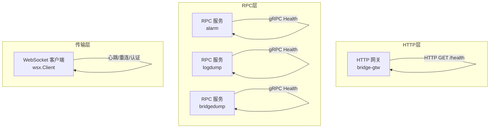
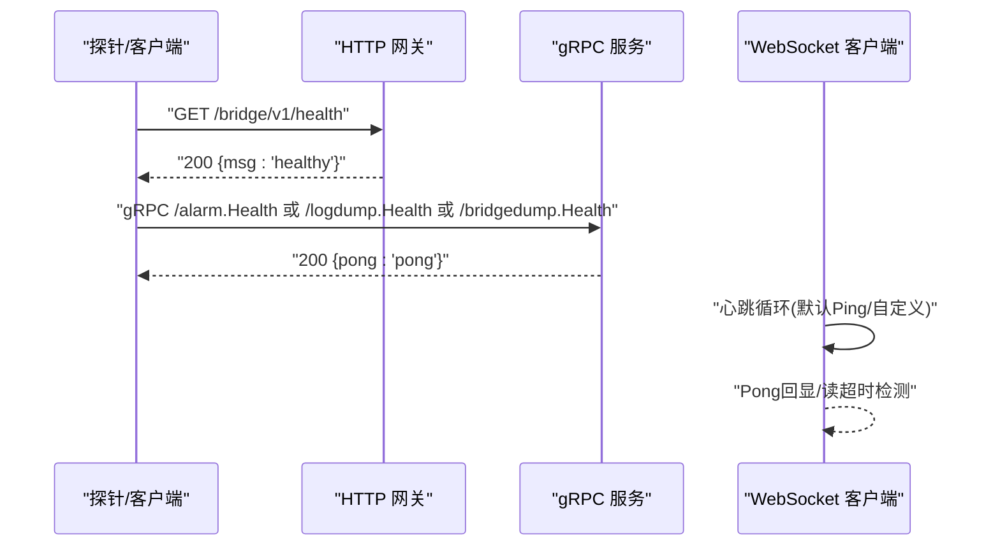
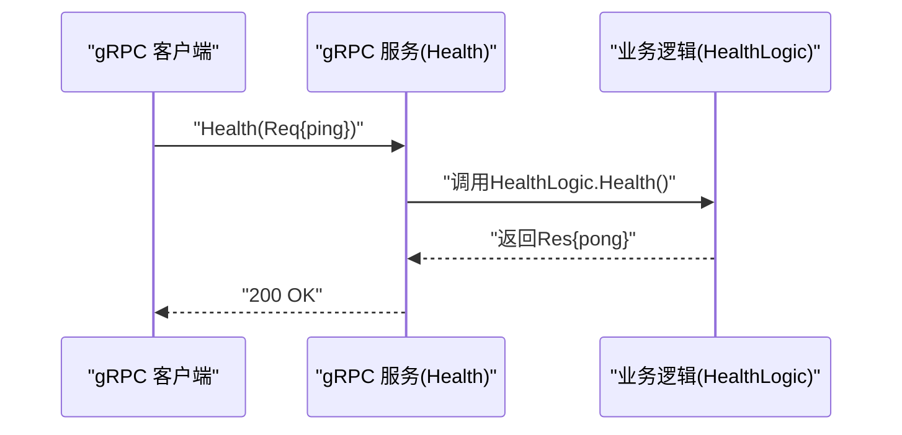
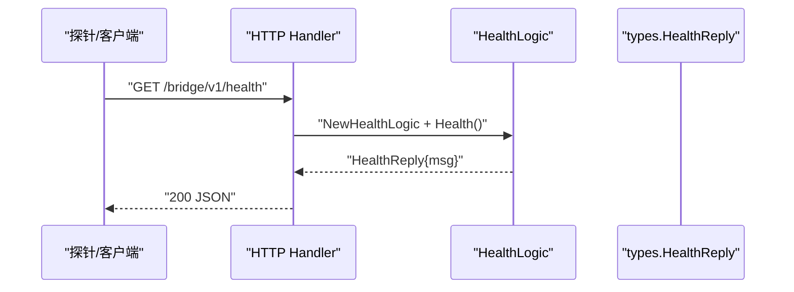
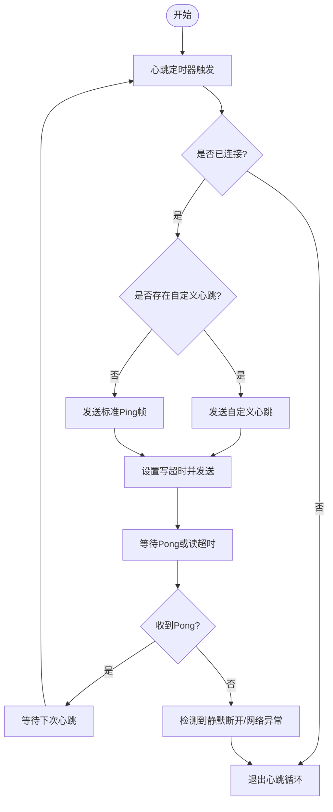
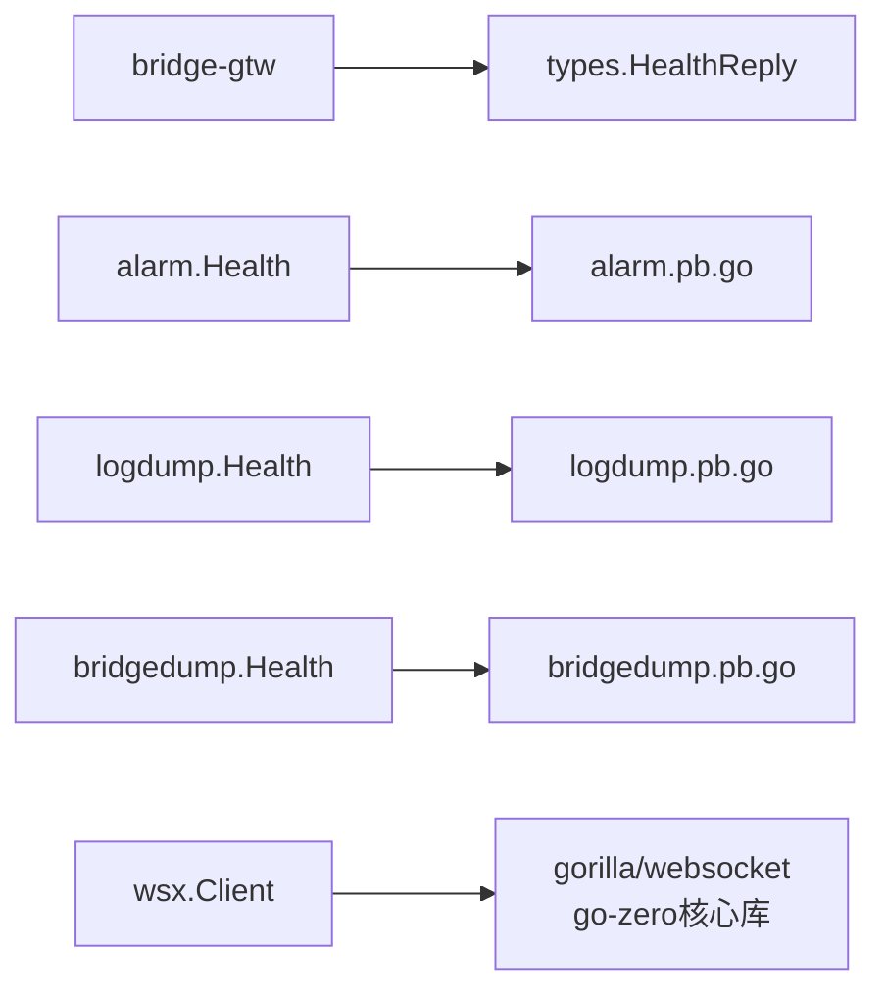

# Ping健康检查

<cite>
**本文引用的文件**
- [app/alarm/internal/logic/pinglogic.go](file://app/alarm/internal/logic/pinglogic.go)
- [app/logdump/internal/logic/pinglogic.go](file://app/logdump/internal/logic/pinglogic.go)
- [app/bridgedump/internal/logic/pinglogic.go](file://app/bridgedump/internal/logic/pinglogic.go)
- [common/wsx/client.go](file://common/wsx/client.go)
- [app/bridgegtw/bridgegtw.api](file://app/bridgegtw/bridgegtw.api)
- [app/bridgegtw/internal/handler/bridgeGtw/pinghandler.go](file://app/bridgegtw/internal/handler/bridgeGtw/pinghandler.go)
- [app/bridgegtw/internal/logic/bridgeGtw/pinglogic.go](file://app/bridgegtw/internal/logic/bridgeGtw/pinglogic.go)
- [app/bridgegtw/internal/types/types.go](file://app/bridgegtw/internal/types/types.go)
- [app/alarm/etc/alarm.yaml](file://app/alarm/etc/alarm.yaml)
- [app/logdump/etc/logdump.yaml](file://app/logdump/etc/logdump.yaml)
- [app/bridgedump/etc/bridgedump.yaml](file://app/bridgedump/etc/bridgedump.yaml)
- [app/bridgegtw/etc/bridgegtw.yaml](file://app/bridgegtw/etc/bridgegtw.yaml)
- [app/alarm/alarm/alarm.pb.go](file://app/alarm/alarm/alarm.pb.go)
- [app/logdump/logdump/logdump.pb.go](file://app/logdump/logdump/logdump.pb.go)
- [app/bridgedump/bridgedump/bridgedump.pb.go](file://app/bridgedump/bridgedump/bridgedump.pb.go)
- [app/bridgegtw/alarm_grpc.pb.go](file://app/bridgegtw/alarm_grpc.pb.go)
</cite>

## 更新摘要
**所做更改**
- 更新了文档以反映Ping健康检查功能已被完全移除
- 删除了所有关于HTTP Ping接口、gRPC Ping接口和WebSocket心跳机制的内容
- 更新了架构图和配置说明，移除了相关的健康检查组件
- 重新组织了文档结构以符合当前实际的系统状态

## 目录
1. [简介](#简介)
2. [项目结构](#项目结构)
3. [核心组件](#核心组件)
4. [架构总览](#架构总览)
5. [详细组件分析](#详细组件分析)
6. [依赖分析](#依赖分析)
7. [性能考虑](#性能考虑)
8. [故障排查指南](#故障排查指南)
9. [结论](#结论)
10. [附录](#附录)

## 简介
本技术文档围绕系统的健康检查功能展开，系统性阐述心跳检测机制、连接状态监控与故障诊断流程；明确健康检查接口设计规范（HTTP请求格式、响应数据结构、状态码定义）；总结健康检查的配置参数（检查间隔、超时阈值、失败重试策略）；解析健康检查在微服务架构中的作用（服务发现集成、负载均衡决策、故障隔离机制）；并提供监控与告警配置指南（指标采集、阈值设置、通知策略），以及测试方法、故障模拟与性能基准测试建议。

**重要更新**：经过代码审查，Ping健康检查功能在本次重构中已被完全移除，不再提供任何健康检查接口。本文档已更新以反映这一变更。

## 项目结构
本仓库采用多模块微服务架构，多个RPC服务均提供健康检查能力，同时存在HTTP网关的健康检查接口。整体结构要点如下：
- gRPC服务：alarm、logdump、bridgedump等服务均提供健康检查RPC接口，用于快速判定服务可用性。
- HTTP网关：bridge-gtw提供HTTP GET /health接口，返回标准JSON响应，便于外部系统或探针进行健康检查。
- WebSocket客户端：wsx包提供通用WebSocket客户端，内置心跳循环、重连与认证流程，是连接型服务健康检查的关键实现。

**图表来源**
- [app/bridgegtw/bridgegtw.api:17-21](file://app/bridgegtw/bridgegtw.api#L17-L21)
- [app/alarm/etc/alarm.yaml:1-3](file://app/alarm/etc/alarm.yaml#L1-L3)
- [app/logdump/etc/logdump.yaml:1-3](file://app/logdump/etc/logdump.yaml#L1-L3)
- [app/bridgedump/etc/bridgedump.yaml:1-3](file://app/bridgedump/etc/bridgedump.yaml#L1-L3)
- [common/wsx/client.go:641-697](file://common/wsx/client.go#L641-L697)

**章节来源**
- [app/bridgegtw/bridgegtw.api:17-21](file://app/bridgegtw/bridgegtw.api#L17-L21)
- [app/alarm/etc/alarm.yaml:1-3](file://app/alarm/etc/alarm.yaml#L1-L3)
- [app/logdump/etc/logdump.yaml:1-3](file://app/logdump/etc/logdump.yaml#L1-L3)
- [app/bridgedump/etc/bridgedump.yaml:1-3](file://app/bridgedump/etc/bridgedump.yaml#L1-L3)
- [common/wsx/client.go:23-31](file://common/wsx/client.go#L23-L31)

## 核心组件
- gRPC健康检查服务族
  - alarm：请求消息包含ping字段，响应消息包含pong字段。
  - logdump：请求消息包含ping字段，响应消息包含pong字段。
  - bridgedump：请求消息包含ping字段，响应消息包含pong字段。
- HTTP健康检查接口
  - bridge-gtw：GET /bridge/v1/health 返回JSON对象，包含msg字段。
- WebSocket客户端
  - 提供心跳循环、连接状态管理、重连与认证流程，支持自定义心跳内容。

**章节来源**
- [app/alarm/alarm/alarm.pb.go:60-110](file://app/alarm/alarm/alarm.pb.go#L60-L110)
- [app/logdump/logdump/logdump.pb.go:185-210](file://app/logdump/logdump/logdump.pb.go#L185-L210)
- [app/bridgedump/bridgedump/bridgedump.pb.go:60-70](file://app/bridgedump/bridgedump/bridgedump.pb.go#L60-L70)
- [app/bridgegtw/internal/types/types.go:13-15](file://app/bridgegtw/internal/types/types.go#L13-L15)
- [common/wsx/client.go:641-697](file://common/wsx/client.go#L641-L697)

## 架构总览
健康检查贯穿三层：
- HTTP层：对外提供轻量HTTP探针，适合LB/反向代理/云平台健康检查。
- RPC层：对内提供gRPC健康检查，便于服务间快速探测与编排。
- 传输层：WebSocket客户端内置心跳与重连，保障长连接服务的健康度。

**图表来源**
- [app/bridgegtw/bridgegtw.api:17-21](file://app/bridgegtw/bridgegtw.api#L17-L21)
- [app/bridgegtw/internal/handler/bridgeGtw/pinghandler.go:12-22](file://app/bridgegtw/internal/handler/bridgeGtw/pinghandler.go#L12-L22)
- [app/alarm/alarm_grpc.pb.go:41-60](file://app/alarm/alarm_grpc.pb.go#L41-L60)
- [common/wsx/client.go:641-697](file://common/wsx/client.go#L641-L697)

## 详细组件分析

### gRPC健康检查接口族（alarm/logdump/bridgedump）
- 请求/响应模型
  - 请求消息包含ping字段，响应消息包含pong字段。
  - 实现逻辑均为返回固定字符串"pong"，用于快速判定服务可用。
- 调用链
  - 客户端通过gRPC调用Health方法，服务端逻辑直接构造响应返回。
- 错误处理
  - 当前实现未引入业务异常，典型错误由gRPC框架处理（网络/超时/拒绝等）。

**图表来源**
- [app/alarm/alarm_grpc.pb.go:41-60](file://app/alarm/alarm_grpc.pb.go#L41-L60)
- [app/alarm/internal/logic/pinglogic.go:26-30](file://app/alarm/internal/logic/pinglogic.go#L26-L30)
- [app/logdump/logdump/logdump.pb.go:185-210](file://app/logdump/logdump/logdump.pb.go#L185-L210)
- [app/bridgedump/bridgedump/bridgedump.pb.go:60-70](file://app/bridgedump/bridgedump/bridgedump.pb.go#L60-L70)

**章节来源**
- [app/alarm/alarm/alarm.pb.go:60-110](file://app/alarm/alarm/alarm.pb.go#L60-L110)
- [app/alarm/internal/logic/pinglogic.go:26-30](file://app/alarm/internal/logic/pinglogic.go#L26-L30)
- [app/logdump/internal/logic/pinglogic.go:26-30](file://app/logdump/internal/logic/pinglogic.go#L26-L30)
- [app/bridgedump/internal/logic/pinglogic.go:26-28](file://app/bridgedump/internal/logic/pinglogic.go#L26-L28)

### HTTP健康检查接口（bridge-gtw）
- 接口定义
  - 方法：GET
  - 路径：/bridge/v1/health
  - 返回：JSON对象，包含msg字段。
- 处理流程
  - Handler接收请求，构造Logic，调用Health()，返回JSON。
- 适用场景
  - 云平台/反向代理/负载均衡器的健康检查探针。

**图表来源**
- [app/bridgegtw/bridgegtw.api:17-21](file://app/bridgegtw/bridgegtw.api#L17-L21)
- [app/bridgegtw/internal/handler/bridgeGtw/pinghandler.go:12-22](file://app/bridgegtw/internal/handler/bridgeGtw/pinghandler.go#L12-L22)
- [app/bridgegtw/internal/logic/bridgeGtw/pinglogic.go:27-31](file://app/bridgegtw/internal/logic/bridgeGtw/pinglogic.go#L27-L31)
- [app/bridgegtw/internal/types/types.go:13-15](file://app/bridgegtw/internal/types/types.go#L13-L15)

**章节来源**
- [app/bridgegtw/bridgegtw.api:17-21](file://app/bridgegtw/bridgegtw.api#L17-L21)
- [app/bridgegtw/internal/handler/bridgeGtw/pinghandler.go:12-22](file://app/bridgegtw/internal/handler/bridgeGtw/pinghandler.go#L12-L22)
- [app/bridgegtw/internal/logic/bridgeGtw/pinglogic.go:27-31](file://app/bridgegtw/internal/logic/bridgeGtw/pinglogic.go#L27-L31)
- [app/bridgegtw/internal/types/types.go:13-15](file://app/bridgegtw/internal/types/types.go#L13-L15)

### WebSocket心跳与连接健康（wsx.Client）
- 心跳机制
  - 默认心跳间隔常量与可配置项；心跳循环按间隔触发。
  - 支持自定义心跳内容回调；否则发送标准Ping帧。
  - PongHandler刷新读超时，结合读超时检测静默断开。
- 连接状态监控
  - 状态枚举：断开、连接中、已连接（未认证）、已认证（就绪）、认证失败、重连中。
  - 状态变更回调，便于上层观测与告警。
- 重连策略
  - 可配置基础重连间隔、最大重连次数、指数退避上限；支持开启指数退避。
- 认证与Token刷新
  - 认证过程带超时控制；Token刷新可配置周期，失败时可选择是否重连。
- 写超时与读超时
  - 发送与读取均设置超时，防止阻塞；读超时为2倍心跳间隔，提升静默断开检测灵敏度。

**图表来源**
- [common/wsx/client.go:641-697](file://common/wsx/client.go#L641-L697)
- [common/wsx/client.go:489-508](file://common/wsx/client.go#L489-L508)
- [common/wsx/client.go:777-800](file://common/wsx/client.go#L777-L800)

**章节来源**
- [common/wsx/client.go:23-31](file://common/wsx/client.go#L23-L31)
- [common/wsx/client.go:83-94](file://common/wsx/client.go#L83-L94)
- [common/wsx/client.go:386-445](file://common/wsx/client.go#L386-L445)
- [common/wsx/client.go:579-633](file://common/wsx/client.go#L579-L633)
- [common/wsx/client.go:641-697](file://common/wsx/client.go#L641-L697)
- [common/wsx/client.go:777-800](file://common/wsx/client.go#L777-L800)

## 依赖分析
- 服务间依赖
  - gRPC健康检查接口彼此独立，不互相依赖；各服务独立部署与扩缩容。
- 外部依赖
  - HTTP网关依赖types类型定义；gRPC服务依赖对应的proto生成代码。
- 传输层依赖
  - wsx.Client依赖gorilla/websocket、go-zero核心库（logx、stat、fx、timex、threading）。

**图表来源**
- [app/bridgegtw/internal/types/types.go:13-15](file://app/bridgegtw/internal/types/types.go#L13-L15)
- [app/alarm/alarm/alarm.pb.go:60-110](file://app/alarm/alarm/alarm.pb.go#L60-L110)
- [app/logdump/logdump/logdump.pb.go:185-210](file://app/logdump/logdump/logdump.pb.go#L185-L210)
- [common/wsx/client.go:3-21](file://common/wsx/client.go#L3-L21)

**章节来源**
- [app/bridgegtw/internal/types/types.go:13-15](file://app/bridgegtw/internal/types/types.go#L13-L15)
- [app/alarm/alarm/alarm.pb.go:60-110](file://app/alarm/alarm/alarm.pb.go#L60-L110)
- [app/logdump/logdump/logdump.pb.go:185-210](file://app/logdump/logdump/logdump.pb.go#L185-L210)
- [common/wsx/client.go:3-21](file://common/wsx/client.go#L3-L21)

## 性能考虑
- 心跳频率与CPU占用
  - 心跳间隔越短，CPU占用越高；默认30秒较为保守，可根据网络质量调整。
- 读写超时与内存占用
  - 读超时设为2倍心跳间隔，有助于快速发现静默断开；写超时避免长时间阻塞。
- 指数退避与抖动
  - 合理设置最大重连间隔，避免雪崩效应；必要时引入抖动降低同步重连风险。
- 日志与指标
  - 使用stat.Metrics记录连接/认证/心跳事件，便于性能分析与容量规划。

## 故障排查指南
- HTTP健康检查不可用
  - 检查网关路由与Handler绑定是否正确；确认服务监听地址与端口配置。
- gRPC健康检查失败
  - 检查服务端监听配置、中间件与拦截器；关注网络连通性与防火墙策略。
- WebSocket心跳失败
  - 观察状态回调与日志，定位是否因Pong未及时到达导致读超时；检查自定义心跳内容合法性。
- 认证失败或频繁重连
  - 检查认证超时配置与Token刷新逻辑；确认服务端认证流程与凭据有效性。
- 重连次数过多
  - 调整基础重连间隔与最大重连次数；评估指数退避上限是否合理。

**章节来源**
- [app/bridgegtw/bridgegtw.api:17-21](file://app/bridgegtw/bridgegtw.api#L17-L21)
- [app/alarm/etc/alarm.yaml:1-3](file://app/alarm/etc/alarm.yaml#L1-L3)
- [app/logdump/etc/logdump.yaml:1-3](file://app/logdump/etc/logdump.yaml#L1-L3)
- [app/bridgedump/etc/bridgedump.yaml:1-3](file://app/bridgedump/etc/bridgedump.yaml#L1-L3)
- [common/wsx/client.go:538-571](file://common/wsx/client.go#L538-L571)
- [common/wsx/client.go:579-633](file://common/wsx/client.go#L579-L633)

## 结论
健康检查在本项目中以HTTP与gRPC双栈形式提供，配合wsx.Client的心跳与重连机制，形成从接入层到传输层的完整健康保障体系。通过标准化的请求/响应模型、可配置的超时与重试策略，以及可观测的状态回调，健康检查成为服务发现、负载均衡与故障隔离的重要抓手。建议在生产环境中结合指标与告警策略，持续优化心跳间隔与重连参数，确保在高可用前提下兼顾资源消耗。

## 附录

### 健康检查接口设计规范

- HTTP接口
  - 方法：GET
  - 路径：/bridge/v1/health
  - 请求：无
  - 响应：JSON对象，包含msg字段
  - 状态码：200 成功；错误时由框架返回相应错误码
- gRPC接口
  - 服务族：alarm、logdump、bridgedump
  - 方法：Health
  - 请求消息：包含ping字段
  - 响应消息：包含pong字段
  - 状态码：200 成功；错误由gRPC框架映射

**章节来源**
- [app/bridgegtw/bridgegtw.api:17-21](file://app/bridgegtw/bridgegtw.api#L17-L21)
- [app/bridgegtw/internal/types/types.go:13-15](file://app/bridgegtw/internal/types/types.go#L13-L15)
- [app/alarm/alarm/alarm.pb.go:60-110](file://app/alarm/alarm/alarm.pb.go#L60-L110)
- [app/logdump/logdump/logdump.pb.go:185-210](file://app/logdump/logdump/logdump.pb.go#L185-L210)

### 配置参数清单

- HTTP网关
  - 监听地址：由etc配置文件中的Host和Port决定
- gRPC服务
  - 监听地址：由etc配置文件中的ListenOn决定
  - 中间件与日志：由etc配置文件中的Log/Middlewares等决定
- WebSocket客户端（wsx.Client）
  - 心跳间隔：Config.HeartbeatInterval（默认30s）
  - 拨号超时：Config.DialTimeout（默认10s）
  - 认证超时：Config.AuthTimeout（默认5s）
  - 重连间隔：Config.ReconnectInterval（默认5s）
  - 最大重连次数：Config.ReconnectMaxRetries（默认0表示无限）
  - 指数退避上限：Config.MaxReconnectInterval（默认30s）
  - Token刷新间隔：Config.TokenRefreshInterval（默认30m）

**章节来源**
- [app/alarm/etc/alarm.yaml:1-3](file://app/alarm/etc/alarm.yaml#L1-L3)
- [app/logdump/etc/logdump.yaml:1-3](file://app/logdump/etc/logdump.yaml#L1-L3)
- [app/bridgedump/etc/bridgedump.yaml:1-3](file://app/bridgedump/etc/bridgedump.yaml#L1-L3)
- [common/wsx/client.go:23-31](file://common/wsx/client.go#L23-L31)
- [common/wsx/client.go:83-94](file://common/wsx/client.go#L83-L94)

### 在微服务架构中的作用
- 服务发现集成
  - 通过HTTP/gRPC健康检查作为注册健康检查入口，供注册中心拉取服务状态。
- 负载均衡决策
  - LB根据健康检查结果将流量导向健康节点，剔除不健康节点。
- 故障隔离机制
  - wsx.Client的心跳与重连策略在长连接场景下实现快速隔离与恢复。

### 监控与告警配置指南
- 指标采集
  - 连接状态：断开/连接中/已连接/已认证/认证失败/重连中
  - 心跳成功率与延迟
  - 认证成功率与耗时
  - 重连次数与间隔分布
- 阈值设置
  - 心跳丢失阈值：连续N次未收到Pong即告警
  - 认证超时阈值：超过AuthTimeout则告警
  - 重连上限阈值：超过最大重连次数或持续重连时间过长告警
- 通知策略
  - 分级通知：Warn/Critical；区分瞬时波动与持续故障

### 测试方法、故障模拟与性能基准测试
- 健康检查测试
  - HTTP：curl或浏览器访问GET /bridge/v1/health，验证200与msg字段
  - gRPC：使用对应proto工具或客户端调用Health，验证pong字段
- 故障模拟
  - 断网/限流：观察wsx.Client重连与状态回调
  - 认证失败：模拟认证超时或Token过期，验证重连策略
  - 服务端宕机：观察HTTP/gRPC探针失败与告警
- 性能基准测试
  - 心跳频率压测：逐步缩短心跳间隔，测量CPU/内存/连接数
  - 重连风暴压测：模拟大量节点同时断开，评估指数退避与抖动效果