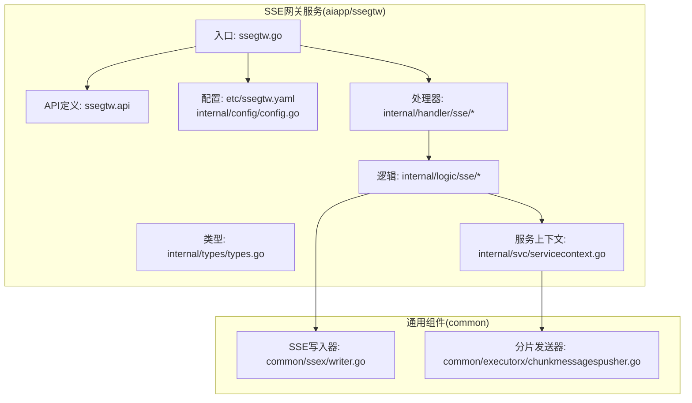
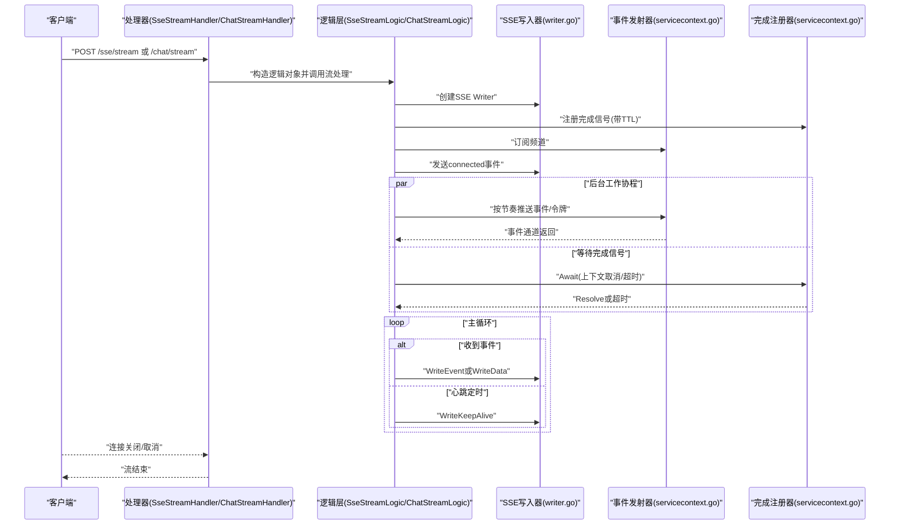
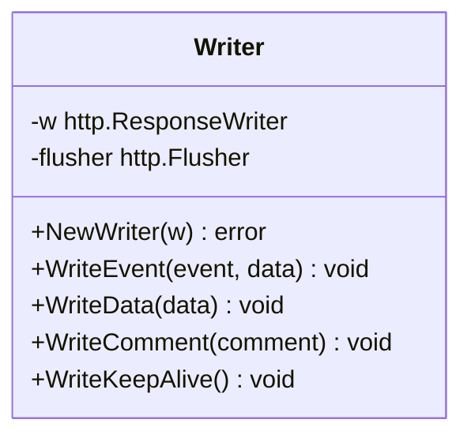
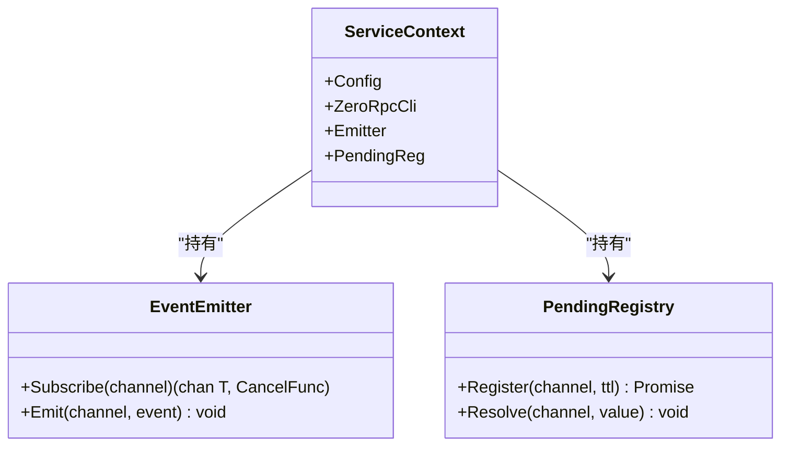
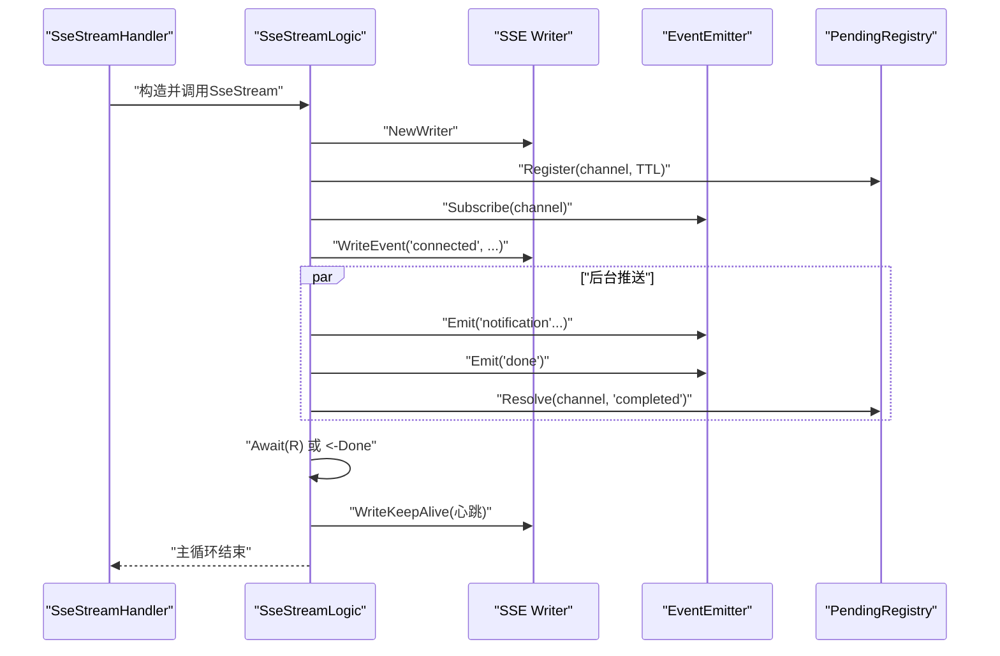
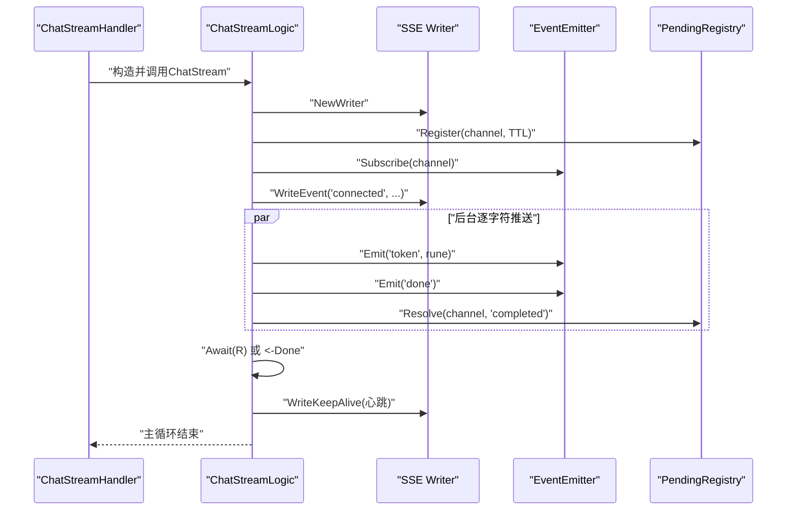
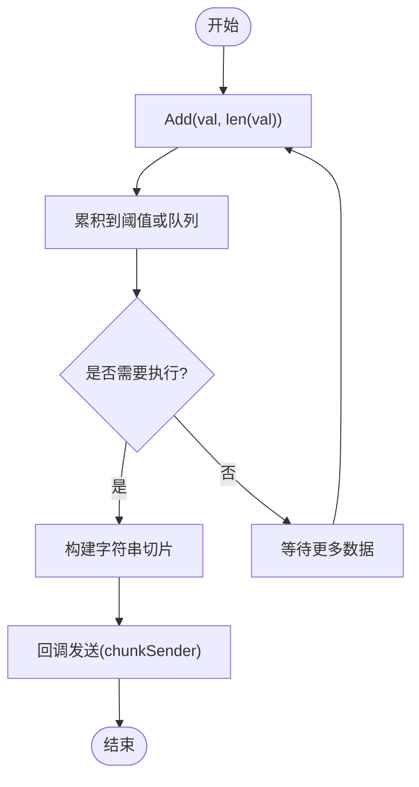
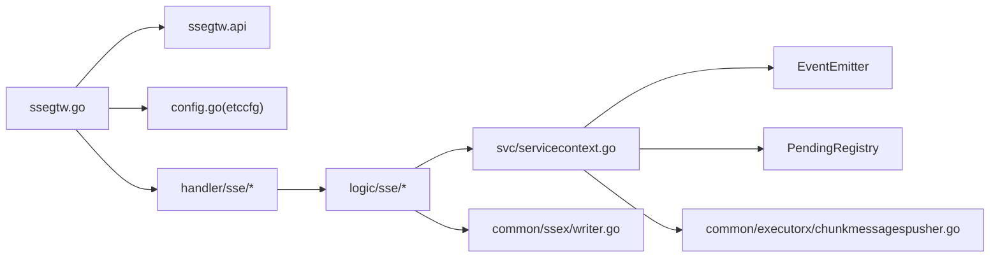

# SSE流式处理

<cite>
**本文档引用的文件**
- [ssegtw.go](file://aiapp/ssegtw/ssegtw.go)
- [ssegtw.api](file://aiapp/ssegtw/ssegtw.api)
- [config.go](file://aiapp/ssegtw/etc/ssegtw.yaml)
- [config.go](file://aiapp/ssegtw/internal/config/config.go)
- [types.go](file://aiapp/ssegtw/internal/types/types.go)
- [writer.go](file://common/ssex/writer.go)
- [servicecontext.go](file://aiapp/ssegtw/internal/svc/servicecontext.go)
- [ssestreamhandler.go](file://aiapp/ssegtw/internal/handler/sse/ssestreamhandler.go)
- [chatstreamhandler.go](file://aiapp/ssegtw/internal/handler/sse/chatstreamhandler.go)
- [ssestreamlogic.go](file://aiapp/ssegtw/internal/logic/sse/ssestreamlogic.go)
- [chatstreamlogic.go](file://aiapp/ssegtw/internal/logic/sse/chatstreamlogic.go)
- [chunkmessagespusher.go](file://common/executorx/chunkmessagespusher.go)
</cite>

## 目录
1. [简介](#简介)
2. [项目结构](#项目结构)
3. [核心组件](#核心组件)
4. [架构总览](#架构总览)
5. [详细组件分析](#详细组件分析)
6. [依赖分析](#依赖分析)
7. [性能考虑](#性能考虑)
8. [故障排查指南](#故障排查指南)
9. [结论](#结论)
10. [附录](#附录)

## 简介
本文件针对SSE（Server-Sent Events）流式处理功能进行系统化技术文档整理，覆盖从架构设计、数据流管道、处理器链与状态管理，到核心逻辑（分片、拼接与完整性校验）、性能优化（并发控制、资源池与GC优化）、错误恢复（断点续传、重试与一致性）、配置项说明以及监控与调试方法。文档以实际代码为依据，确保可追溯性与可操作性。

## 项目结构
SSE网关服务位于 aiapp/ssegtw，采用 go-zero REST 服务框架，结合自研事件发射器与完成信号注册器，提供两类流式能力：
- SSE事件流：用于推送系统通知、进度等事件
- AI对话流：用于模拟逐字符输出的对话流

关键目录与文件：
- 配置：aiapp/ssegtw/etc/ssegtw.yaml、internal/config/config.go
- 类型定义：internal/types/types.go
- 服务入口：aiapp/ssegtw/ssegtw.go
- SSE协议封装：common/ssex/writer.go
- 服务上下文：internal/svc/servicecontext.go
- 处理器与逻辑：internal/handler/sse/*、internal/logic/sse/*
- 分片发送器：common/executorx/chunkmessagespusher.go

**图表来源**
- [ssegtw.go:1-60](file://aiapp/ssegtw/ssegtw.go#L1-L60)
- [ssegtw.api:1-40](file://aiapp/ssegtw/ssegtw.api#L1-L40)
- [config.go:1-14](file://aiapp/ssegtw/etc/ssegtw.yaml#L1-L14)
- [config.go:1-15](file://aiapp/ssegtw/internal/config/config.go#L1-L15)
- [types.go:1-18](file://aiapp/ssegtw/internal/types/types.go#L1-L18)
- [servicecontext.go:1-39](file://aiapp/ssegtw/internal/svc/servicecontext.go#L1-L39)
- [writer.go:1-55](file://common/ssex/writer.go#L1-L55)
- [chunkmessagespusher.go:1-44](file://common/executorx/chunkmessagespusher.go#L1-L44)

**章节来源**
- [ssegtw.go:1-60](file://aiapp/ssegtw/ssegtw.go#L1-L60)
- [ssegtw.api:1-40](file://aiapp/ssegtw/ssegtw.api#L1-L40)
- [config.go:1-14](file://aiapp/ssegtw/etc/ssegtw.yaml#L1-L14)
- [config.go:1-15](file://aiapp/ssegtw/internal/config/config.go#L1-L15)
- [types.go:1-18](file://aiapp/ssegtw/internal/types/types.go#L1-L18)
- [servicecontext.go:1-39](file://aiapp/ssegtw/internal/svc/servicecontext.go#L1-L39)
- [writer.go:1-55](file://common/ssex/writer.go#L1-L55)
- [chunkmessagespusher.go:1-44](file://common/executorx/chunkmessagespusher.go#L1-L44)

## 核心组件
- SSE写入器（SSE Writer）：封装标准HTTP响应写入SSE协议帧，并自动Flush，支持事件名、纯数据与注释（心跳）三种消息类型。
- 事件发射器（EventEmitter）：基于通道的事件发布订阅，按频道分发事件。
- 完成信号注册器（PendingRegistry）：为每个频道建立“完成”承诺，支持超时与解析，用于优雅结束流。
- 服务上下文（ServiceContext）：聚合RPC客户端、事件发射器与完成注册器，统一注入到处理器与逻辑层。
- 分片发送器（ChunkMessagesPusher）：基于ChunkExecutor的批量发送器，按字节阈值聚合字符串消息，降低网络调用次数。

**章节来源**
- [writer.go:1-55](file://common/ssex/writer.go#L1-L55)
- [servicecontext.go:17-39](file://aiapp/ssegtw/internal/svc/servicecontext.go#L17-L39)
- [chunkmessagespusher.go:1-44](file://common/executorx/chunkmessagespusher.go#L1-L44)

## 架构总览
SSE网关通过REST服务暴露两条流式接口，分别对应“SSE事件流”和“AI对话流”。两条流共享相同的底层基础设施：SSE写入器负责协议帧写出，事件发射器负责按频道分发，完成注册器负责生命周期控制。AI对话流额外演示了逐字符令牌输出与完成信号解析。

**图表来源**
- [ssestreamhandler.go:17-32](file://aiapp/ssegtw/internal/handler/sse/ssestreamhandler.go#L17-L32)
- [chatstreamhandler.go:17-32](file://aiapp/ssegtw/internal/handler/sse/chatstreamhandler.go#L17-L32)
- [ssestreamlogic.go:39-116](file://aiapp/ssegtw/internal/logic/sse/ssestreamlogic.go#L39-L116)
- [chatstreamlogic.go:39-119](file://aiapp/ssegtw/internal/logic/sse/chatstreamlogic.go#L39-L119)
- [writer.go:23-54](file://common/ssex/writer.go#L23-L54)
- [servicecontext.go:23-38](file://aiapp/ssegtw/internal/svc/servicecontext.go#L23-L38)

## 详细组件分析

### SSE写入器（SSE Writer）
- 功能职责：封装SSE协议帧写出，自动Flush；支持事件名、纯数据与注释（心跳）三类消息。
- 设计要点：依赖http.Flusher，若不支持则直接报错，避免不兼容环境。
- 性能影响：每次写入后Flush，确保客户端及时接收；心跳注释用于维持长连接活跃。

**图表来源**
- [writer.go:8-54](file://common/ssex/writer.go#L8-L54)

**章节来源**
- [writer.go:1-55](file://common/ssex/writer.go#L1-L55)

### 事件发射器与完成注册器
- 事件发射器：按频道维护订阅者通道，支持多订阅者；事件结构包含事件名与数据。
- 完成注册器：为每个频道注册“完成”承诺，支持超时与解析；逻辑层通过Await等待完成或取消。

**图表来源**
- [servicecontext.go:17-38](file://aiapp/ssegtw/internal/svc/servicecontext.go#L17-L38)

**章节来源**
- [servicecontext.go:1-39](file://aiapp/ssegtw/internal/svc/servicecontext.go#L1-L39)

### SSE事件流处理器与逻辑
- 处理器：解析请求参数，构造逻辑对象，调用SseStream方法。
- 逻辑：创建SSE写入器；确定频道（缺省生成UUID）；注册完成信号；订阅事件；发送connected事件；启动后台工作协程推送通知事件；等待完成信号并优雅结束；主循环转发事件并定期发送心跳。

**图表来源**
- [ssestreamhandler.go:17-32](file://aiapp/ssegtw/internal/handler/sse/ssestreamhandler.go#L17-L32)
- [ssestreamlogic.go:39-116](file://aiapp/ssegtw/internal/logic/sse/ssestreamlogic.go#L39-L116)
- [writer.go:23-54](file://common/ssex/writer.go#L23-L54)
- [servicecontext.go:23-38](file://aiapp/ssegtw/internal/svc/servicecontext.go#L23-L38)

**章节来源**
- [ssestreamhandler.go:1-33](file://aiapp/ssegtw/internal/handler/sse/ssestreamhandler.go#L1-L33)
- [ssestreamlogic.go:1-117](file://aiapp/ssegtw/internal/logic/sse/ssestreamlogic.go#L1-L117)

### AI对话流处理器与逻辑
- 处理器：解析请求参数，构造逻辑对象，调用ChatStream方法。
- 逻辑：创建SSE写入器；确定频道（缺省生成UUID）；注册完成信号；订阅事件；发送connected事件；启动后台工作协程逐字符输出令牌；推送done事件并解析完成信号；主循环转发事件并定期发送心跳。

**图表来源**
- [chatstreamhandler.go:17-32](file://aiapp/ssegtw/internal/handler/sse/chatstreamhandler.go#L17-L32)
- [chatstreamlogic.go:39-119](file://aiapp/ssegtw/internal/logic/sse/chatstreamlogic.go#L39-L119)
- [writer.go:23-54](file://common/ssex/writer.go#L23-L54)
- [servicecontext.go:23-38](file://aiapp/ssegtw/internal/svc/servicecontext.go#L23-L38)

**章节来源**
- [chatstreamhandler.go:1-33](file://aiapp/ssegtw/internal/handler/sse/chatstreamhandler.go#L1-L33)
- [chatstreamlogic.go:1-120](file://aiapp/ssegtw/internal/logic/sse/chatstreamlogic.go#L1-L120)

### 分片发送器（ChunkMessagesPusher）
- 功能：将字符串消息按字节阈值聚合，批量回调发送，减少网络调用次数。
- 并发：内部使用互斥锁保护写入队列，避免竞态。
- 适用场景：高吞吐事件推送、批量上报ASDU等。

**图表来源**
- [chunkmessagespusher.go:17-44](file://common/executorx/chunkmessagespusher.go#L17-L44)

**章节来源**
- [chunkmessagespusher.go:1-44](file://common/executorx/chunkmessagespusher.go#L1-L44)

## 依赖分析
- 入口与路由：ssegtw.go 加载配置并创建REST服务，注册SSE路由组；ssegtw.api 定义了SSE事件流与AI对话流接口。
- 处理器与逻辑：处理器负责参数解析与错误处理，逻辑层负责业务流程与SSE写入。
- 事件系统：ServiceContext聚合EventEmitter与PendingRegistry，供逻辑层使用。
- 协议封装：writer.go提供SSE协议写入能力，确保Flush与心跳。
- 批量发送：chunkmessagespusher.go提供分片发送能力，适用于高吞吐场景。

**图表来源**
- [ssegtw.go:24-59](file://aiapp/ssegtw/ssegtw.go#L24-L59)
- [ssegtw.api:18-38](file://aiapp/ssegtw/ssegtw.api#L18-L38)
- [servicecontext.go:30-38](file://aiapp/ssegtw/internal/svc/servicecontext.go#L30-L38)
- [writer.go:14-21](file://common/ssex/writer.go#L14-L21)
- [chunkmessagespusher.go:17-24](file://common/executorx/chunkmessagespusher.go#L17-L24)

**章节来源**
- [ssegtw.go:1-60](file://aiapp/ssegtw/ssegtw.go#L1-L60)
- [ssegtw.api:1-40](file://aiapp/ssegtw/ssegtw.api#L1-L40)
- [servicecontext.go:1-39](file://aiapp/ssegtw/internal/svc/servicecontext.go#L1-L39)
- [writer.go:1-55](file://common/ssex/writer.go#L1-L55)
- [chunkmessagespusher.go:1-44](file://common/executorx/chunkmessagespusher.go#L1-L44)

## 性能考虑
- 并发控制
  - 事件分发：EventEmitter基于通道分发，天然并发安全；建议在上游生产者侧控制并发，避免过载。
  - 完成信号：PendingRegistry为每个频道维护独立承诺，避免全局阻塞。
- 资源池与连接复用
  - SSE写入器依赖http.Flusher，确保每帧立即下发；心跳注释维持连接活性。
  - RPC客户端通过zrpc复用连接，拦截器可附加元数据。
- 垃圾回收优化
  - 分片发送器按阈值聚合，减少频繁分配；逻辑层避免在热路径上进行大对象拷贝。
- 超时与背压
  - 完成注册器支持TTL，防止悬挂频道；主循环使用select监听上下文取消与心跳，避免阻塞。
- 批量发送
  - 使用ChunkMessagesPusher按字节阈值聚合，显著降低网络调用次数，提升吞吐。

**章节来源**
- [servicecontext.go:30-38](file://aiapp/ssegtw/internal/svc/servicecontext.go#L30-L38)
- [writer.go:14-21](file://common/ssex/writer.go#L14-L21)
- [chunkmessagespusher.go:17-24](file://common/executorx/chunkmessagespusher.go#L17-L24)
- [ssestreamlogic.go:54-57](file://aiapp/ssegtw/internal/logic/sse/ssestreamlogic.go#L54-L57)
- [chatstreamlogic.go:59-62](file://aiapp/ssegtw/internal/logic/sse/chatstreamlogic.go#L59-L62)

## 故障排查指南
- 连接不支持SSE
  - 现象：创建SSE Writer失败。
  - 排查：确认ResponseWriter实现http.Flusher；检查代理/网关是否正确透传。
  - 参考：writer.go对Flusher的检查。
- 流未结束或卡住
  - 现象：客户端长时间无响应或无法关闭。
  - 排查：确认后台工作协程已推送done事件并解析完成信号；检查PendingRegistry的TTL与Resolve调用。
  - 参考：SseStreamLogic/ChatStreamLogic中的注册、订阅、Await与心跳。
- 心跳失效
  - 现象：连接空闲后断开。
  - 排查：确认心跳定时器正常触发；检查客户端网络策略与代理超时设置。
  - 参考：逻辑层的心跳ticker与WriteKeepAlive。
- 日志定位
  - 入口处打印应用名与版本信息；逻辑层记录连接/断开/完成等关键事件。
  - 参考：ssegtw.go的日志字段设置与各逻辑层的Infof调用。

**章节来源**
- [writer.go:14-21](file://common/ssex/writer.go#L14-L21)
- [ssestreamlogic.go:54-57](file://aiapp/ssegtw/internal/logic/sse/ssestreamlogic.go#L54-L57)
- [chatstreamlogic.go:59-62](file://aiapp/ssegtw/internal/logic/sse/chatstreamlogic.go#L59-L62)
- [ssegtw.go:55-58](file://aiapp/ssegtw/ssegtw.go#L55-L58)

## 结论
该SSE流式处理方案以清晰的职责分离与事件驱动架构为核心：SSE写入器负责协议帧写出，事件发射器与完成注册器共同保障流生命周期管理，逻辑层聚焦业务流程与并发控制。通过心跳保活、TTL与优雅取消机制，系统在复杂网络环境下具备良好的稳定性与可观测性。对于高吞吐场景，可结合分片发送器进一步优化网络调用与内存分配。

## 附录

### 配置选项说明
- 应用基础
  - Name：应用名称（用于日志字段）
  - Host/Port：服务监听地址与端口
  - Timeout：全局超时（REST服务）
  - Mode：运行模式（开发/生产）
- 日志
  - Encoding：日志编码（plain/json）
  - Path：日志输出路径
- RPC客户端
  - Endpoints：RPC服务端点列表
  - NonBlock：非阻塞模式
  - Timeout：RPC调用超时

**章节来源**
- [config.go:1-14](file://aiapp/ssegtw/etc/ssegtw.yaml#L1-L14)
- [config.go:11-14](file://aiapp/ssegtw/internal/config/config.go#L11-L14)

### API定义概览
- SSE事件流
  - 路径：/ssegtw/v1/sse/stream
  - 方法：POST
  - 请求体：SSEStreamRequest（可选channel）
  - 返回：PingReply
- AI对话流
  - 路径：/ssegtw/v1/sse/chat/stream
  - 方法：POST
  - 请求体：ChatStreamRequest（可选channel、prompt）
  - 返回：PingReply
- 健康检查
  - 路径：/ssegtw/v1/ping
  - 方法：GET
  - 返回：PingReply

**章节来源**
- [ssegtw.api:18-38](file://aiapp/ssegtw/ssegtw.api#L18-L38)

### 数据模型与类型
- SSE事件结构
  - 字段：event（事件名）、data（JSON字符串）
- 请求类型
  - SSEStreamRequest：channel（可选）
  - ChatStreamRequest：channel（可选）、prompt（可选）
- 响应类型
  - PingReply：msg（字符串）

**章节来源**
- [servicecontext.go:17-21](file://aiapp/ssegtw/internal/svc/servicecontext.go#L17-L21)
- [types.go:6-17](file://aiapp/ssegtw/internal/types/types.go#L6-L17)

### 监控指标与日志
- 关键日志
  - 连接/断开/完成：记录channel与状态
  - 错误：捕获并记录SSE流错误
- 建议指标
  - 活跃频道数、事件推送速率、心跳间隔、RPC调用耗时与错误率
- 工具使用
  - 使用日志字段统一标识应用名
  - 在代理/网关层面配置超时与缓冲区参数

**章节来源**
- [ssestreamlogic.go:51-51](file://aiapp/ssegtw/internal/logic/sse/ssestreamlogic.go#L51-L51)
- [chatstreamlogic.go:56-56](file://aiapp/ssegtw/internal/logic/sse/chatstreamlogic.go#L56-L56)
- [ssegtw.go:55-58](file://aiapp/ssegtw/ssegtw.go#L55-L58)