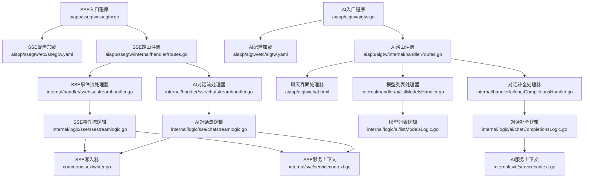
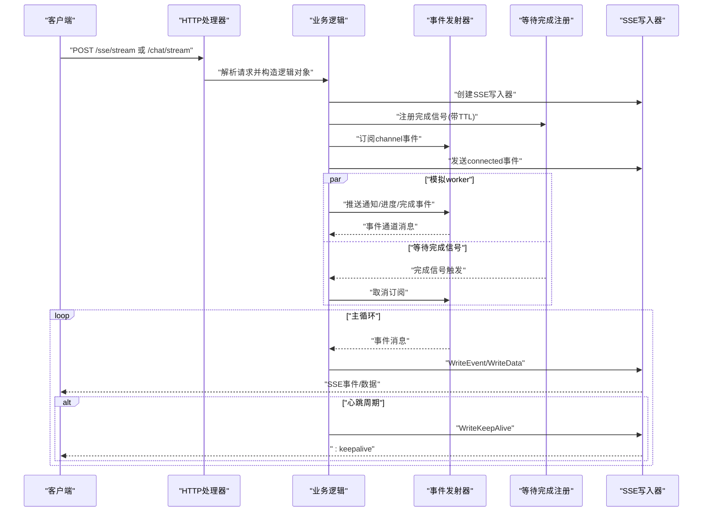
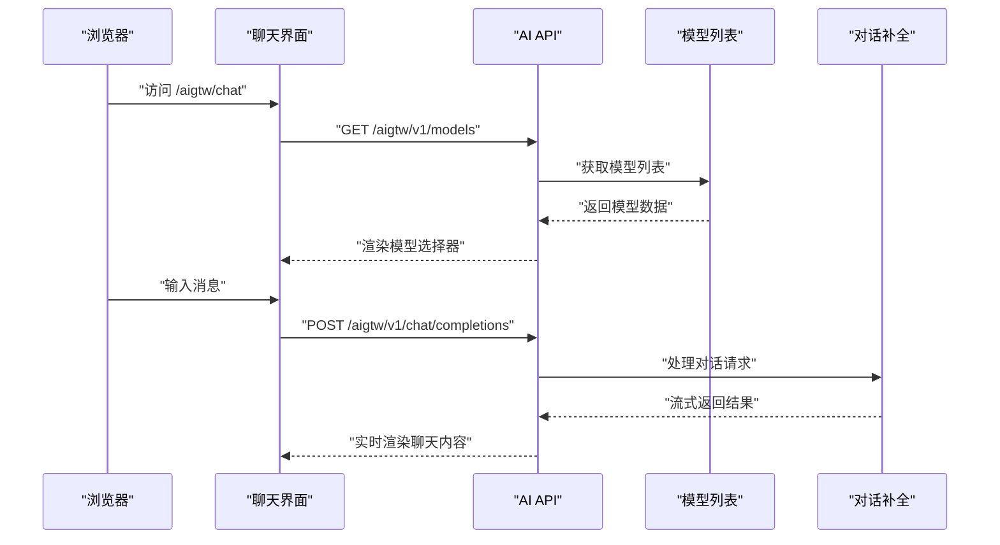
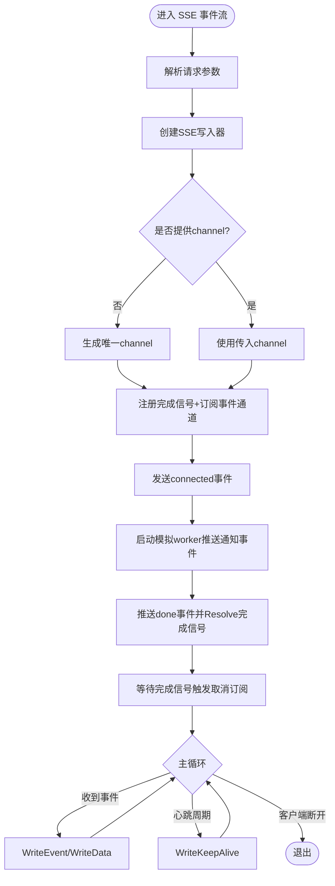
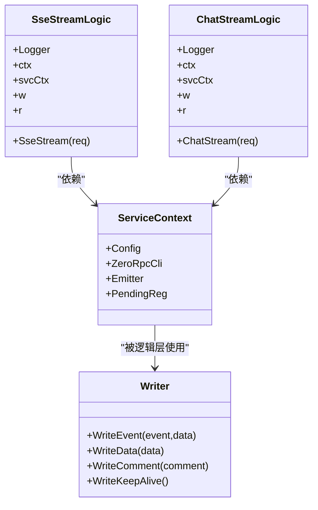

# SSE网关服务

<cite>
**本文引用的文件**
- [aiapp/ssegtw/ssegtw.go](file://aiapp/ssegtw/ssegtw.go)
- [aiapp/ssegtw/etc/ssegtw.yaml](file://aiapp/ssegtw/etc/ssegtw.yaml)
- [aiapp/ssegtw/internal/config/config.go](file://aiapp/ssegtw/internal/config/config.go)
- [aiapp/ssegtw/ssegtw.api](file://aiapp/ssegtw/ssegtw.api)
- [aiapp/ssegtw/internal/handler/routes.go](file://aiapp/ssegtw/internal/handler/routes.go)
- [aiapp/ssegtw/internal/handler/sse/ssestreamhandler.go](file://aiapp/ssegtw/internal/handler/sse/ssestreamhandler.go)
- [aiapp/ssegtw/internal/handler/sse/chatstreamhandler.go](file://aiapp/ssegtw/internal/handler/sse/chatstreamhandler.go)
- [aiapp/ssegtw/internal/logic/sse/ssestreamlogic.go](file://aiapp/ssegtw/internal/logic/sse/ssestreamlogic.go)
- [aiapp/ssegtw/internal/logic/sse/chatstreamlogic.go](file://aiapp/ssegtw/internal/logic/sse/chatstreamlogic.go)
- [aiapp/ssegtw/internal/types/types.go](file://aiapp/ssegtw/internal/types/types.go)
- [aiapp/ssegtw/internal/svc/servicecontext.go](file://aiapp/ssegtw/internal/svc/servicecontext.go)
- [common/ssex/writer.go](file://common/ssex/writer.go)
- [aiapp/aigtw/aigtw.go](file://aiapp/aigtw/aigtw.go)
- [aiapp/aigtw/internal/handler/routes.go](file://aiapp/aigtw/internal/handler/routes.go)
- [aiapp/aigtw/aigtw.api](file://aiapp/aigtw/aigtw.api)
- [aiapp/aigtw/chat.html](file://aiapp/aigtw/chat.html)
</cite>

## 更新摘要
**变更内容**
- 更新了路由配置，从 `/aigtw/demo` 改为 `/aigtw/chat`
- 新增了完整的聊天界面 `chat.html` 替代原有的简单演示页面
- 增强了 AI 网关服务的功能，提供更丰富的交互体验
- 更新了相关的 API 接口文档和客户端集成示例

## 目录
1. [简介](#简介)
2. [项目结构](#项目结构)
3. [核心组件](#核心组件)
4. [架构总览](#架构总览)
5. [详细组件分析](#详细组件分析)
6. [依赖分析](#依赖分析)
7. [性能考虑](#性能考虑)
8. [故障排查指南](#故障排查指南)
9. [结论](#结论)
10. [附录](#附录)

## 简介
本项目为一个基于 Go-Zero 的 Server-Sent Events（SSE）网关服务，提供两类实时流能力：
- SSE 事件流：用于推送系统通知与状态变更等事件。
- AI 对话流：以流式方式逐字返回生成的 token，模拟大模型推理过程。

系统采用事件驱动架构，通过内置的事件发射器与等待完成注册机制，实现"生产者-消费者"解耦的长连接流式传输，并内置心跳保活与优雅断开逻辑。同时提供跨域配置、健康检查接口与本地调试页面，便于开发与联调。

**更新** 项目现已扩展为两个主要服务：
- SSE 网关服务（aiapp/ssegtw）：提供基础的 SSE 事件流和 AI 对话流功能
- AI 网关服务（aiapp/aigtw）：提供完整的聊天界面和 RESTful API 接口

## 项目结构
SSE 网关服务位于 aiapp/ssegtw 目录，AI 网关服务位于 aiapp/aigtw 目录，主要由以下层次组成：
- 入口与配置：应用入口、配置加载、跨域与服务启动
- 路由与处理器：REST 路由注册、SSE 路由启用、HTTP 处理器
- 业务逻辑：SSE 事件流与 AI 对话流的具体实现
- 类型定义：请求与响应类型
- 服务上下文：RPC 客户端、事件发射器、等待完成注册
- SSE 写入器：封装 SSE 协议写入与自动刷新
- 静态文件服务：提供聊天界面 HTML 文件

**图表来源**
- [aiapp/ssegtw/ssegtw.go:26-59](file://aiapp/ssegtw/ssegtw.go#L26-L59)
- [aiapp/aigtw/aigtw.go:46-65](file://aiapp/aigtw/aigtw.go#L46-L65)
- [aiapp/ssegtw/internal/handler/routes.go:17-50](file://aiapp/ssegtw/internal/handler/routes.go#L17-L50)
- [aiapp/aigtw/internal/handler/routes.go:17-55](file://aiapp/aigtw/internal/handler/routes.go#L17-L55)

**章节来源**
- [aiapp/ssegtw/ssegtw.go:26-59](file://aiapp/ssegtw/ssegtw.go#L26-L59)
- [aiapp/aigtw/aigtw.go:29-75](file://aiapp/aigtw/aigtw.go#L29-L75)
- [aiapp/ssegtw/etc/ssegtw.yaml:1-14](file://aiapp/ssegtw/etc/ssegtw.yaml#L1-L14)
- [aiapp/aigtw/etc/aigtw.yaml:1-15](file://aiapp/aigtw/etc/aigtw.yaml#L1-L15)
- [aiapp/ssegtw/internal/config/config.go:11-14](file://aiapp/ssegtw/internal/config/config.go#L11-L14)
- [aiapp/aigtw/internal/config/config.go:20-25](file://aiapp/aigtw/internal/config/config.go#L20-L25)
- [aiapp/ssegtw/ssegtw.api:13-38](file://aiapp/ssegtw/ssegtw.api#L13-L38)
- [aiapp/aigtw/aigtw.api:14-47](file://aiapp/aigtw/aigtw.api#L14-L47)
- [aiapp/ssegtw/internal/handler/routes.go:17-50](file://aiapp/ssegtw/internal/handler/routes.go#L17-L50)
- [aiapp/aigtw/internal/handler/routes.go:17-55](file://aiapp/aigtw/internal/handler/routes.go#L17-L55)
- [aiapp/ssegtw/internal/types/types.go:6-17](file://aiapp/ssegtw/internal/types/types.go#L6-L17)
- [aiapp/aigtw/internal/types/types.go:14-91](file://aiapp/aigtw/internal/types/types.go#L14-L91)
- [aiapp/ssegtw/internal/svc/servicecontext.go:23-38](file://aiapp/ssegtw/internal/svc/servicecontext.go#L23-L38)
- [aiapp/aigtw/internal/svc/servicecontext.go](file://aiapp/aigtw/internal/svc/servicecontext.go)

## 核心组件
- 应用入口与服务启动
  - 解析配置文件，打印运行环境信息，创建 REST 服务器并启用自定义 CORS，注册路由，加入服务组并启动。
- 路由与 SSE 启用
  - 在 SSE 路由组中注册两条 POST 接口，分别对应 SSE 事件流与 AI 对话流，并通过 rest.WithSSE() 启用长连接模式。
- 处理器层
  - 从请求解析出结构化参数，构造逻辑对象并调用对应逻辑方法。
- 逻辑层
  - 初始化 SSE 写入器，确定 channel（可选），注册完成信号，订阅事件通道，发送连接成功事件，启动模拟 worker 推送事件或 token，主循环转发事件并周期性发送心跳。
- 服务上下文
  - 提供 RPC 客户端、事件发射器与等待完成注册，统一注入到各逻辑层。
- SSE 写入器
  - 封装 SSE 协议写入（事件名、数据、注释与心跳），并自动触发 flush。
- 静态文件服务
  - 提供聊天界面 HTML 文件的静态服务，支持多种路径查找策略。

**更新** AI 网关服务新增了完整的聊天界面功能：
- 提供美观的 Web 界面，支持深色/浅色主题切换
- 支持多语言（中英文）
- 实时流式聊天，支持深度思考过程展示
- 代码高亮和复制功能
- 响应式设计，支持移动端访问

**章节来源**
- [aiapp/ssegtw/ssegtw.go:26-59](file://aiapp/ssegtw/ssegtw.go#L26-L59)
- [aiapp/aigtw/aigtw.go:46-65](file://aiapp/aigtw/aigtw.go#L46-L65)
- [aiapp/ssegtw/internal/handler/routes.go:17-50](file://aiapp/ssegtw/internal/handler/routes.go#L17-L50)
- [aiapp/aigtw/internal/handler/routes.go:17-55](file://aiapp/aigtw/internal/handler/routes.go#L17-L55)
- [aiapp/ssegtw/internal/handler/sse/ssestreamhandler.go:18-32](file://aiapp/ssegtw/internal/handler/sse/ssestreamhandler.go#L18-L32)
- [aiapp/ssegtw/internal/handler/sse/chatstreamhandler.go:18-32](file://aiapp/ssegtw/internal/handler/sse/chatstreamhandler.go#L18-L32)
- [aiapp/ssegtw/internal/logic/sse/ssestreamlogic.go:39-116](file://aiapp/ssegtw/internal/logic/sse/ssestreamlogic.go#L39-L116)
- [aiapp/ssegtw/internal/logic/sse/chatstreamlogic.go:39-120](file://aiapp/ssegtw/internal/logic/sse/chatstreamlogic.go#L39-L120)
- [aiapp/ssegtw/internal/svc/servicecontext.go:23-38](file://aiapp/ssegtw/internal/svc/servicecontext.go#L23-L38)
- [common/ssex/writer.go:14-54](file://common/ssex/writer.go#L14-L54)

## 架构总览
SSE 网关采用"请求-处理-事件发射-客户端推送"的链路，结合"等待完成注册"实现流结束的优雅控制；心跳保活确保长连接稳定。

**更新** AI 网关服务的架构更加复杂，包含了完整的聊天界面：

**图表来源**
- [aiapp/ssegtw/internal/handler/routes.go:18-36](file://aiapp/ssegtw/internal/handler/routes.go#L18-L36)
- [aiapp/aigtw/internal/handler/routes.go:30-42](file://aiapp/aigtw/internal/handler/routes.go#L30-L42)
- [aiapp/ssegtw/internal/logic/sse/ssestreamlogic.go:53-116](file://aiapp/ssegtw/internal/logic/sse/ssestreamlogic.go#L53-L116)
- [aiapp/ssegtw/internal/logic/sse/chatstreamlogic.go:58-120](file://aiapp/ssegtw/internal/logic/sse/chatstreamlogic.go#L58-L120)
- [common/ssex/writer.go:23-54](file://common/ssex/writer.go#L23-L54)

## 详细组件分析

### 入口与配置
- 配置文件包含服务名称、监听地址、端口、日志路径以及 ZeroRPC 客户端配置（端点、非阻塞、超时）。
- 应用入口加载配置，打印 Go 版本，创建 REST 服务器并启用自定义 CORS（允许任意来源、凭证、常用方法与头部），注册路由并启动服务组。

**更新** AI 网关服务的入口程序还包含了静态文件服务：
- 添加了 `/aigtw/chat` 路由，用于提供聊天界面 HTML 文件
- 支持多种路径查找策略，优先查找可执行文件所在目录的 chat.html
- 如果找不到本地文件，会尝试在项目根目录和 aiapp/aigtw 目录下查找

**章节来源**
- [aiapp/ssegtw/etc/ssegtw.yaml:1-14](file://aiapp/ssegtw/etc/ssegtw.yaml#L1-L14)
- [aiapp/aigtw/etc/aigtw.yaml:1-15](file://aiapp/aigtw/etc/aigtw.yaml#L1-L15)
- [aiapp/ssegtw/ssegtw.go:26-59](file://aiapp/ssegtw/ssegtw.go#L26-L59)
- [aiapp/aigtw/aigtw.go:29-75](file://aiapp/aigtw/aigtw.go#L29-L75)
- [aiapp/ssegtw/internal/config/config.go:11-14](file://aiapp/ssegtw/internal/config/config.go#L11-L14)
- [aiapp/aigtw/internal/config/config.go:20-25](file://aiapp/aigtw/internal/config/config.go#L20-L25)

### 路由与跨域
- SSE 路由组前缀为 /ssegtw/v1/sse，启用 rest.WithSSE() 以支持长连接。
- 健康检查路由 /ssegtw/v1/ping 返回简单文本。
- 跨域头通过自定义函数动态设置，允许来源、凭证、常见方法与头部，并暴露长度与类型等响应头。

**更新** AI 网关服务的路由配置：
- 模型列表路由：GET /aigtw/v1/models
- 对话补全路由：POST /aigtw/v1/chat/completions（启用 SSE 和无限超时）
- 健康检查路由：GET /aigtw/v1/ping
- 聊天界面路由：GET /aigtw/chat（静态文件服务）

**章节来源**
- [aiapp/ssegtw/ssegtw.api:13-38](file://aiapp/ssegtw/ssegtw.api#L13-L38)
- [aiapp/aigtw/aigtw.api:14-47](file://aiapp/aigtw/aigtw.api#L14-L47)
- [aiapp/ssegtw/internal/handler/routes.go:17-50](file://aiapp/ssegtw/internal/handler/routes.go#L17-L50)
- [aiapp/aigtw/internal/handler/routes.go:17-55](file://aiapp/aigtw/internal/handler/routes.go#L17-L55)
- [aiapp/ssegtw/ssegtw.go:35-46](file://aiapp/ssegtw/ssegtw.go#L35-L46)

### SSE事件流处理逻辑
- 请求参数：SSEStreamRequest，包含可选 channel。
- 处理流程：
  - 创建 SSE 写入器，若不支持流式则直接报错。
  - 若未提供 channel，则生成唯一 ID。
  - 注册完成信号（带默认 TTL），订阅事件通道。
  - 发送 connected 事件，携带 channel。
  - 启动模拟 worker：按固定间隔推送多条通知事件，最后发送 done 事件并 Resolve 完成信号。
  - 使用独立 goroutine 等待完成信号，触发取消订阅。
  - 主循环：转发事件到客户端；若事件为空则写入纯数据；周期性发送心跳注释。

**图表来源**
- [aiapp/ssegtw/internal/logic/sse/ssestreamlogic.go:39-116](file://aiapp/ssegtw/internal/logic/sse/ssestreamlogic.go#L39-L116)
- [common/ssex/writer.go:23-54](file://common/ssex/writer.go#L23-L54)

**章节来源**
- [aiapp/ssegtw/internal/handler/sse/ssestreamhandler.go:18-32](file://aiapp/ssegtw/internal/handler/sse/ssestreamhandler.go#L18-L32)
- [aiapp/ssegtw/internal/logic/sse/ssestreamlogic.go:39-116](file://aiapp/ssegtw/internal/logic/sse/ssestreamlogic.go#L39-L116)
- [aiapp/ssegtw/internal/types/types.go:15-17](file://aiapp/ssegtw/internal/types/types.go#L15-L17)

### AI对话流处理逻辑
- 请求参数：ChatStreamRequest，包含可选 channel 与可选 prompt，默认值为"Hello World"。
- 处理流程：
  - 创建 SSE 写入器，确定 channel，解析 prompt。
  - 注册完成信号，订阅事件通道，发送 connected 事件。
  - 启动模拟 worker：按固定间隔逐字符推送 token，最后发送 done 并 Resolve 完成信号。
  - 等待完成信号触发取消订阅。
  - 主循环：转发事件到客户端；周期性发送心跳注释。

**图表来源**
- [aiapp/ssegtw/internal/logic/sse/chatstreamlogic.go:39-120](file://aiapp/ssegtw/internal/logic/sse/chatstreamlogic.go#L39-L120)
- [common/ssex/writer.go:23-54](file://common/ssex/writer.go#L23-L54)

**章节来源**
- [aiapp/ssegtw/internal/handler/sse/chatstreamhandler.go:18-32](file://aiapp/ssegtw/internal/handler/sse/chatstreamhandler.go#L18-L32)
- [aiapp/ssegtw/internal/logic/sse/chatstreamlogic.go:39-120](file://aiapp/ssegtw/internal/logic/sse/chatstreamlogic.go#L39-L120)
- [aiapp/ssegtw/internal/types/types.go:6-9](file://aiapp/ssegtw/internal/types/types.go#L6-L9)

### SSE写入器与传输协议
- 写入器封装：
  - WriteEvent：写入事件名与数据，随后 flush。
  - WriteData：写入纯数据，随后 flush。
  - WriteComment：写入注释行（客户端忽略），随后 flush。
  - WriteKeepAlive：写入心跳注释。
- 协议要点：
  - 事件名与数据均以换行分隔，事件块以空行结束。
  - 心跳通过注释行实现，客户端可忽略但保持连接活跃。

**章节来源**
- [common/ssex/writer.go:14-54](file://common/ssex/writer.go#L14-L54)

### 服务上下文与依赖
- 服务上下文包含：
  - 配置对象
  - ZeroRPC 客户端（带元数据拦截器）
  - 事件发射器（泛型事件模型）
  - 等待完成注册（泛型键，带默认 TTL）
- 依赖注入：
  - 处理器将上下文注入逻辑层，逻辑层通过事件发射器与等待完成注册协调流式推送与结束条件。

**章节来源**
- [aiapp/ssegtw/internal/svc/servicecontext.go:23-38](file://aiapp/ssegtw/internal/svc/servicecontext.go#L23-L38)

### 类型定义
- ChatStreamRequest：包含可选 channel 与可选 prompt。
- PingReply：健康检查返回结构。
- SSEStreamRequest：包含可选 channel。

**更新** AI 网关服务的类型定义更加丰富：
- ChatCompletionRequest：包含模型ID、消息列表、流式输出开关、采样参数等
- ChatCompletionResponse：包含补全ID、模型ID、选择结果、Token用量统计
- ChatDelta：包含角色、内容增量、推理内容增量
- ChatMessage：包含角色、内容、推理内容
- ListModelsResponse：包含模型列表
- ModelObject：包含模型ID、显示名称、支持流式等元数据

**章节来源**
- [aiapp/ssegtw/internal/types/types.go:6-17](file://aiapp/ssegtw/internal/types/types.go#L6-L17)
- [aiapp/aigtw/internal/types/types.go:14-91](file://aiapp/aigtw/internal/types/types.go#L14-L91)

### 聊天界面与客户端集成
**更新** 新增了完整的聊天界面功能：

- **聊天界面特性**：
  - 美观的深色/浅色主题切换
  - 多语言支持（中英文）
  - 实时流式聊天，支持深度思考过程展示
  - 代码高亮和复制功能
  - 响应式设计，支持移动端访问
  - 详细的统计信息（分块数量、耗时等）

- **客户端集成示例**：
  - 访问 `/aigtw/chat` 获取完整的聊天界面
  - 通过 `/aigtw/v1/models` 获取可用模型列表
  - 通过 `/aigtw/v1/chat/completions` 发送聊天请求
  - 支持流式和非流式两种模式

- **JavaScript 功能**：
  - 实时流式处理，支持深度思考标签解析
  - Markdown 渲染，支持代码块高亮
  - 键盘快捷键支持（Enter 发送）
  - 停止流式输出功能
  - 本地存储主题和语言偏好

**章节来源**
- [aiapp/aigtw/aigtw.go:46-65](file://aiapp/aigtw/aigtw.go#L46-L65)
- [aiapp/aigtw/internal/handler/routes.go:30-42](file://aiapp/aigtw/internal/handler/routes.go#L30-L42)
- [aiapp/aigtw/chat.html:1089-1836](file://aiapp/aigtw/chat.html#L1089-1836)

## 依赖分析
- 组件耦合
  - 处理器仅负责参数解析与逻辑委派，低耦合。
  - 逻辑层依赖服务上下文，通过事件发射器与等待完成注册解耦外部系统。
  - SSE 写入器对 http.ResponseWriter 强依赖（需要 Flusher），通过接口约束保证兼容性。
- 外部依赖
  - ZeroRPC 客户端用于后端服务通信（当前示例为本地演示，未实际调用）。
  - 事件发射器与等待完成注册来自通用库，提供线程安全与生命周期管理。

**图表来源**
- [aiapp/ssegtw/internal/svc/servicecontext.go:23-38](file://aiapp/ssegtw/internal/svc/servicecontext.go#L23-L38)
- [aiapp/ssegtw/internal/logic/sse/ssestreamlogic.go:20-37](file://aiapp/ssegtw/internal/logic/sse/ssestreamlogic.go#L20-L37)
- [aiapp/ssegtw/internal/logic/sse/chatstreamlogic.go:20-37](file://aiapp/ssegtw/internal/logic/sse/chatstreamlogic.go#L20-L37)
- [common/ssex/writer.go:14-54](file://common/ssex/writer.go#L14-L54)

## 性能考虑
- 心跳保活：每 30 秒发送一次心跳注释，避免代理或中间件误判连接空闲。
- 自动刷新：SSE 写入器每次写入后立即 flush，确保事件即时到达。
- 事件通道：事件发射器内部使用通道，避免阻塞写入；订阅取消后及时释放资源。
- 超时与完成信号：等待完成注册带有默认 TTL，防止长时间悬挂；完成后主动取消订阅，降低内存占用。
- 并发模型：主循环与模拟 worker 分离，避免阻塞事件转发。
- **更新** AI 网关服务的性能优化：
  - 流式渲染优化：使用 requestAnimationFrame 进行节流渲染
  - 深度思考过程：支持实时显示推理过程，提升用户体验
  - 代码块高亮：使用高效的 Markdown 渲染引擎
  - 本地存储：减少重复请求，提升响应速度

## 故障排查指南
- 连接无法建立
  - 检查 CORS 设置是否正确，确认浏览器来源、凭证与方法匹配。
  - 确认服务监听地址与端口配置正确。
- SSE 不显示事件
  - 确认路由已启用 rest.WithSSE()。
  - 检查 SSE 写入器是否成功创建（ResponseWriter 是否支持 Flusher）。
- 事件丢失或延迟
  - 检查事件通道订阅是否被提前取消（完成信号触发后会取消订阅）。
  - 确认主循环未被阻塞，心跳周期是否合理。
- **更新** 聊天界面问题排查：
  - 确认 `/aigtw/chat` 路由能够正确找到 chat.html 文件
  - 检查 `/aigtw/v1/models` 接口是否正常返回模型列表
  - 验证 `/aigtw/v1/chat/completions` 接口的流式输出是否正常
  - 查看浏览器开发者工具的网络面板和控制台错误

**章节来源**
- [aiapp/ssegtw/sse_demo.html:558-635](file://aiapp/ssegtw/sse_demo.html#L558-L635)
- [aiapp/aigtw/chat.html:1089-1836](file://aiapp/aigtw/chat.html#L1089-1836)
- [aiapp/ssegtw/internal/handler/routes.go:34-36](file://aiapp/ssegtw/internal/handler/routes.go#L34-L36)
- [common/ssex/writer.go:14-21](file://common/ssex/writer.go#L14-L21)

## 结论
SSE 网关服务通过清晰的分层设计与事件驱动机制，实现了稳定的长连接流式传输。其核心优势在于：
- 明确的 SSE 协议封装与心跳保活
- 事件发射器与等待完成注册的解耦设计
- 易于扩展的处理器与逻辑层分离
- 完备的跨域与健康检查支持
- 丰富的本地调试工具

**更新** AI 网关服务进一步增强了用户体验：
- 提供完整的聊天界面，支持多语言和主题切换
- 实现实时流式聊天，支持深度思考过程展示
- 包含代码高亮和复制功能
- 响应式设计，支持移动端访问

建议在生产环境中进一步完善：
- 增加连接数与内存限制配置
- 加强错误分类与重试策略
- 引入指标采集与告警
- 对外暴露更细粒度的健康检查与指标端点
- **更新** 优化聊天界面的性能和用户体验

## 附录

### API 接口文档
- **SSE 网关服务**
  - 健康检查
    - 方法：GET
    - 路径：/ssegtw/v1/ping
    - 返回：PingReply
  - SSE 事件流
    - 方法：POST
    - 路径：/ssegtw/v1/sse/stream
    - 请求体：SSEStreamRequest
    - 返回：PingReply
  - AI 对话流
    - 方法：POST
    - 路径：/ssegtw/v1/sse/chat/stream
    - 请求体：ChatStreamRequest
    - 返回：PingReply

- **AI 网关服务**
  - 健康检查
    - 方法：GET
    - 路径：/aigtw/v1/ping
    - 返回：PingReply
  - 模型列表
    - 方法：GET
    - 路径：/aigtw/v1/models
    - 返回：ListModelsResponse
  - 对话补全
    - 方法：POST
    - 路径：/aigtw/v1/chat/completions
    - 请求体：ChatCompletionRequest
    - 返回：ChatCompletionResponse（流式输出）

**更新** 新增了聊天界面的静态文件服务：
- 聊天界面
  - 方法：GET
  - 路径：/aigtw/chat
  - 返回：chat.html

**章节来源**
- [aiapp/ssegtw/ssegtw.api:18-38](file://aiapp/ssegtw/ssegtw.api#L18-L38)
- [aiapp/aigtw/aigtw.api:19-47](file://aiapp/aigtw/aigtw.api#L19-L47)
- [aiapp/ssegtw/internal/types/types.go:6-17](file://aiapp/ssegtw/internal/types/types.go#L6-L17)
- [aiapp/aigtw/internal/types/types.go:14-91](file://aiapp/aigtw/internal/types/types.go#L14-L91)

### 客户端集成示例
- **SSE 网关服务**
  - 使用标准 Fetch API 与 ReadableStream 读取 SSE：
    - 选择端点：/sse/stream 或 /chat/stream
    - 可选参数：channel、prompt（对话流）
    - 读取响应体的流，按行解析 event/data/注释行，渲染事件与心跳

- **AI 网关服务**
  - 访问聊天界面：`/aigtw/chat`
  - 获取模型列表：`/aigtw/v1/models`
  - 发送聊天请求：`/aigtw/v1/chat/completions`
  - 支持流式和非流式两种模式
  - 参数包括：model、messages、stream、temperature、top_p、max_tokens 等

**更新** 聊天界面的客户端集成：
- 直接访问 `/aigtw/chat` 获取完整的聊天界面
- 支持深色/浅色主题切换
- 多语言支持（中英文）
- 实时流式聊天，支持深度思考过程展示

**章节来源**
- [aiapp/ssegtw/sse_demo.html:558-635](file://aiapp/ssegtw/sse_demo.html#L558-L635)
- [aiapp/aigtw/chat.html:1089-1836](file://aiapp/aigtw/chat.html#L1089-1836)

### 部署与监控
- **SSE 网关服务**
  - 监听地址与端口：在配置文件中设置 Host 与 Port
  - 日志路径：在配置文件中设置 Log.Path
  - ZeroRPC 客户端：配置 Endpoints、NonBlock、Timeout

- **AI 网关服务**
  - 监听地址与端口：在配置文件中设置 Host 与 Port
  - 日志路径：在配置文件中设置 Log.Path
  - AI Chat RPC 客户端：配置 Endpoints、NonBlock、Timeout
  - 静态文件：确保 chat.html 文件可被正确访问

**更新** 部署注意事项：
- 确保 chat.html 文件位于正确的路径
- 配置静态文件服务以提供聊天界面
- 监控两个服务的运行状态和性能指标

**章节来源**
- [aiapp/ssegtw/etc/ssegtw.yaml:1-14](file://aiapp/ssegtw/etc/ssegtw.yaml#L1-L14)
- [aiapp/aigtw/etc/aigtw.yaml:1-15](file://aiapp/aigtw/etc/aigtw.yaml#L1-L15)