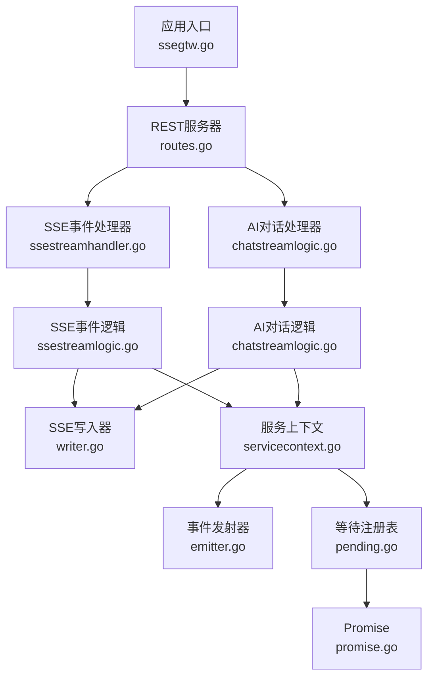
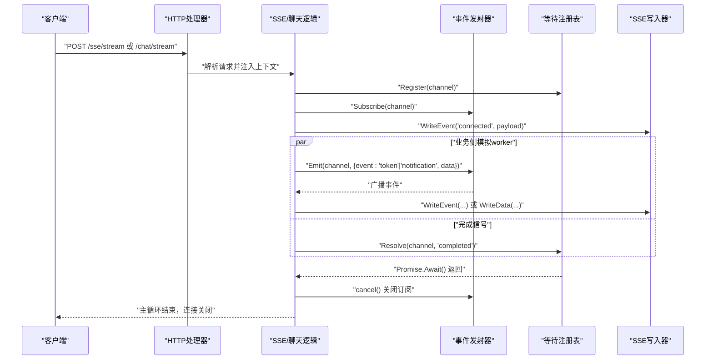
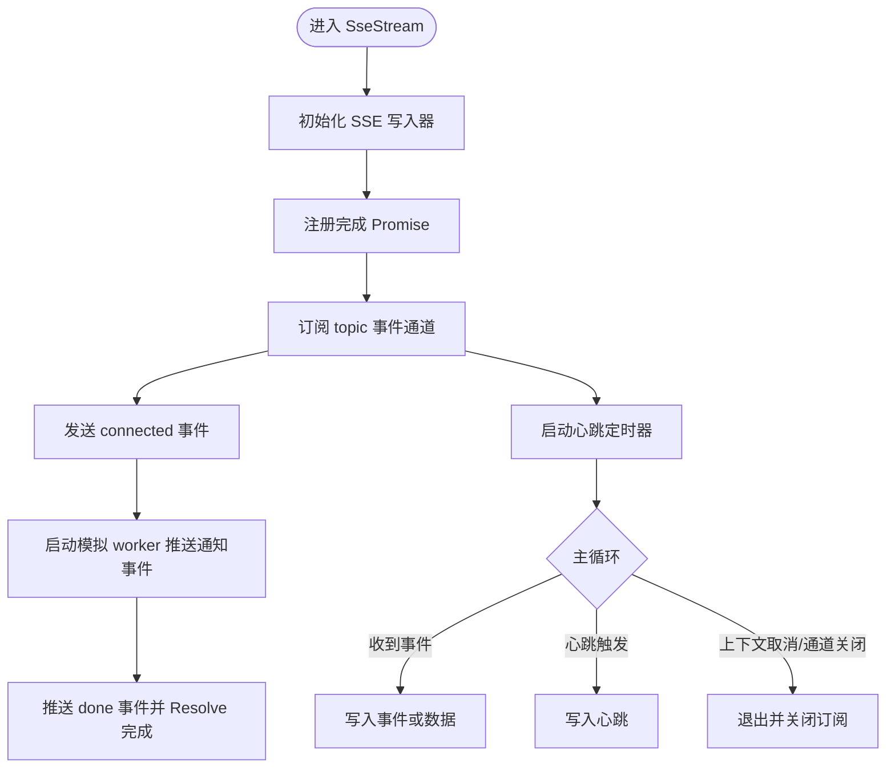
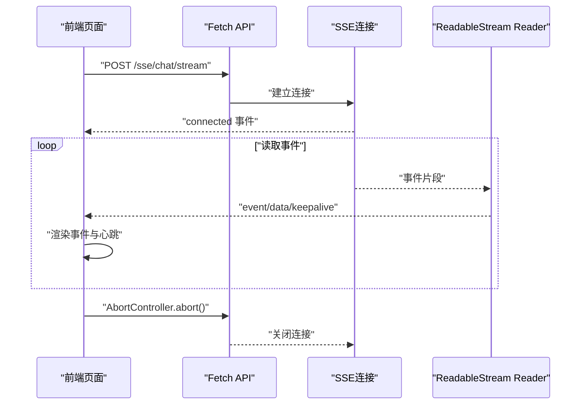
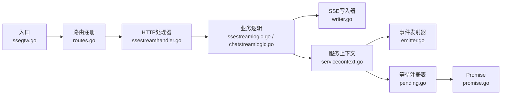

# SSE聊天流处理

<cite>
**本文引用的文件**
- [ssegtw.go](file://aiapp/ssegtw/ssegtw.go)
- [routes.go](file://aiapp/ssegtw/internal/handler/routes.go)
- [ssestreamhandler.go](file://aiapp/ssegtw/internal/handler/sse/ssestreamhandler.go)
- [chatstreamlogic.go](file://aiapp/ssegtw/internal/logic/sse/chatstreamlogic.go)
- [ssestreamlogic.go](file://aiapp/ssegtw/internal/logic/sse/ssestreamlogic.go)
- [types.go](file://aiapp/ssegtw/internal/types/types.go)
- [servicecontext.go](file://aiapp/ssegtw/internal/svc/servicecontext.go)
- [writer.go](file://common/ssex/writer.go)
- [emitter.go](file://common/antsx/emitter.go)
- [pending.go](file://common/antsx/pending.go)
- [promise.go](file://common/antsx/promise.go)
- [sse_demo.html](file://aiapp/ssegtw/sse_demo.html)
- [ssegtw.api](file://aiapp/ssegtw/ssegtw.api)
- [ssegtw.yaml](file://aiapp/ssegtw/etc/ssegtw.yaml)
</cite>

## 目录
1. [简介](#简介)
2. [项目结构](#项目结构)
3. [核心组件](#核心组件)
4. [架构总览](#架构总览)
5. [详细组件分析](#详细组件分析)
6. [依赖分析](#依赖分析)
7. [性能考虑](#性能考虑)
8. [故障排查指南](#故障排查指南)
9. [结论](#结论)
10. [附录](#附录)

## 简介
本文件围绕SSE聊天流处理功能进行系统化技术文档编写，覆盖Server-Sent Events的建立与维护、连接状态管理、数据流控制、事件格式规范、性能优化策略、客户端集成示例以及调试与排错方法。该能力基于Go-zero REST框架与自研通用组件（EventEmitter、PendingRegistry、SSE Writer）实现，提供两条主要流：
- SSE事件流：用于推送系统状态与进度事件，适合通用实时通知场景。
- AI对话流：模拟流式生成，按字符粒度推送token事件，并在完成后发出完成事件。

## 项目结构
SSE聊天流位于aiapp/ssegtw模块，采用典型的分层结构：
- 配置与入口：配置文件、服务启动入口、路由注册
- 处理层：HTTP处理器负责参数解析与上下文注入
- 业务逻辑层：SSE事件流与AI对话流的具体实现
- 类型定义：请求体结构
- 服务上下文：事件发射器与等待注册表实例化
- 通用组件：SSE协议写入器、事件发射器、等待注册表、Promise

图表来源
- [ssegtw.go:26-58](file://aiapp/ssegtw/ssegtw.go#L26-L58)
- [routes.go:17-36](file://aiapp/ssegtw/internal/handler/routes.go#L17-L36)
- [ssestreamhandler.go:18-32](file://aiapp/ssegtw/internal/handler/sse/ssestreamhandler.go#L18-L32)
- [chatstreamlogic.go:39-119](file://aiapp/ssegtw/internal/logic/sse/chatstreamlogic.go#L39-L119)
- [ssestreamlogic.go:39-116](file://aiapp/ssegtw/internal/logic/sse/ssestreamlogic.go#L39-L116)
- [servicecontext.go:30-38](file://aiapp/ssegtw/internal/svc/servicecontext.go#L30-L38)
- [writer.go:14-54](file://common/ssex/writer.go#L14-L54)
- [emitter.go:20-83](file://common/antsx/emitter.go#L20-L83)
- [pending.go:38-107](file://common/antsx/pending.go#L38-L107)
- [promise.go:31-139](file://common/antsx/promise.go#L31-L139)

章节来源
- [ssegtw.go:24-58](file://aiapp/ssegtw/ssegtw.go#L24-L58)
- [routes.go:17-36](file://aiapp/ssegtw/internal/handler/routes.go#L17-L36)
- [ssestreamhandler.go:18-32](file://aiapp/ssegtw/internal/handler/sse/ssestreamhandler.go#L18-L32)
- [chatstreamlogic.go:39-119](file://aiapp/ssegtw/internal/logic/sse/chatstreamlogic.go#L39-L119)
- [ssestreamlogic.go:39-116](file://aiapp/ssegtw/internal/logic/sse/ssestreamlogic.go#L39-L116)
- [servicecontext.go:30-38](file://aiapp/ssegtw/internal/svc/servicecontext.go#L30-L38)
- [writer.go:14-54](file://common/ssex/writer.go#L14-L54)
- [emitter.go:20-83](file://common/antsx/emitter.go#L20-L83)
- [pending.go:38-107](file://common/antsx/pending.go#L38-L107)
- [promise.go:31-139](file://common/antsx/promise.go#L31-L139)

## 核心组件
- SSE写入器（SSE Writer）
  - 封装SSE协议写入，自动Flush，支持事件名、纯数据与心跳注释写入
  - 依赖http.ResponseWriter具备Flush能力
- 事件发射器（EventEmitter）
  - 支持topic级发布/订阅，非阻塞广播，可配置缓冲大小
  - 提供订阅取消、活跃topic统计等能力
- 等待注册表（PendingRegistry）
  - 为每个会话注册Promise，超时自动拒绝，Resolve/Reject用于结束流
- Promise
  - 泛型异步结果载体，Await支持上下文取消，Then/Catch链式处理
- 服务上下文（ServiceContext）
  - 汇聚配置、RPC客户端、EventEmitter、PendingRegistry实例

章节来源
- [writer.go:14-54](file://common/ssex/writer.go#L14-L54)
- [emitter.go:20-83](file://common/antsx/emitter.go#L20-L83)
- [pending.go:38-107](file://common/antsx/pending.go#L38-L107)
- [promise.go:31-139](file://common/antsx/promise.go#L31-L139)
- [servicecontext.go:30-38](file://aiapp/ssegtw/internal/svc/servicecontext.go#L30-L38)

## 架构总览
SSE聊天流采用“请求-订阅-事件驱动”的模式：
- 客户端通过REST POST建立SSE连接
- 服务端为本次会话注册完成Promise，生成或复用channel
- 服务端订阅对应topic的事件通道，向客户端写入SSE事件
- 业务侧（模拟worker）向同一topic持续推送事件，直至完成
- 完成信号触发Promise解决，取消订阅，主循环退出

图表来源
- [ssestreamhandler.go:18-32](file://aiapp/ssegtw/internal/handler/sse/ssestreamhandler.go#L18-L32)
- [chatstreamlogic.go:39-119](file://aiapp/ssegtw/internal/logic/sse/chatstreamlogic.go#L39-L119)
- [ssestreamlogic.go:39-116](file://aiapp/ssegtw/internal/logic/sse/ssestreamlogic.go#L39-L116)
- [emitter.go:28-67](file://common/antsx/emitter.go#L28-L67)
- [pending.go:52-90](file://common/antsx/pending.go#L52-L90)
- [writer.go:23-54](file://common/ssex/writer.go#L23-L54)

## 详细组件分析

### SSE事件流（SseStream）
- 请求体
  - channel：可选，未提供时自动生成
- 处理流程
  - 初始化SSE写入器
  - 注册完成Promise（默认TTL 60秒）
  - 订阅topic事件通道
  - 发送connected事件
  - 启动模拟worker：按固定间隔推送多条通知事件，最后推送done事件并Resolve完成
  - 启动心跳定时器（每30秒）
  - 主循环：接收事件并写入SSE，或写入心跳；监听上下文取消与通道关闭
- 数据格式
  - connected：包含channel字段
  - notification：包含type与text
  - done：字符串描述

图表来源
- [ssestreamlogic.go:39-116](file://aiapp/ssegtw/internal/logic/sse/ssestreamlogic.go#L39-L116)
- [writer.go:23-54](file://common/ssex/writer.go#L23-L54)
- [emitter.go:69-83](file://common/antsx/emitter.go#L69-L83)
- [pending.go:92-107](file://common/antsx/pending.go#L92-L107)

章节来源
- [ssestreamlogic.go:39-116](file://aiapp/ssegtw/internal/logic/sse/ssestreamlogic.go#L39-L116)
- [types.go:15-17](file://aiapp/ssegtw/internal/types/types.go#L15-L17)

### AI对话流（ChatStream）
- 请求体
  - channel：可选
  - prompt：可选，未提供时使用默认值
- 处理流程
  - 初始化SSE写入器
  - 注册完成Promise（默认TTL 60秒）
  - 订阅topic事件通道
  - 发送connected事件
  - 启动模拟worker：逐字符输出prompt中的字符，作为token事件，最后推送done事件并Resolve完成
  - 启动心跳定时器（每30秒）
  - 主循环：接收事件并写入SSE，或写入心跳；监听上下文取消与通道关闭
- 数据格式
  - connected：包含channel字段
  - token：单字符数据
  - done：字符串描述

图表来源
- [chatstreamlogic.go:39-119](file://aiapp/ssegtw/internal/logic/sse/chatstreamlogic.go#L39-L119)
- [writer.go:23-54](file://common/ssex/writer.go#L23-L54)
- [emitter.go:69-83](file://common/antsx/emitter.go#L69-L83)
- [pending.go:92-107](file://common/antsx/pending.go#L92-L107)

章节来源
- [chatstreamlogic.go:39-119](file://aiapp/ssegtw/internal/logic/sse/chatstreamlogic.go#L39-L119)
- [types.go:6-9](file://aiapp/ssegtw/internal/types/types.go#L6-L9)

### SSE写入器（SSE Writer）
- 功能
  - WriteEvent：写入event与data段，自动Flush
  - WriteData：写入data段，自动Flush
  - WriteComment：写入注释行（客户端忽略），用于心跳
  - WriteKeepAlive：写入心跳注释
- 错误处理
  - 若ResponseWriter不支持Flusher，则创建失败

章节来源
- [writer.go:14-54](file://common/ssex/writer.go#L14-L54)

### 事件发射器（EventEmitter）
- 订阅
  - Subscribe(topic, bufSize...)：返回只读通道与取消函数
  - 默认缓冲大小16，可配置
- 发布
  - Emit(topic, value)：非阻塞广播至所有订阅者
- 生命周期
  - 取消函数移除订阅并关闭通道
  - Close：关闭所有订阅通道

章节来源
- [emitter.go:27-67](file://common/antsx/emitter.go#L27-L67)
- [emitter.go:69-83](file://common/antsx/emitter.go#L69-L83)
- [emitter.go:99-118](file://common/antsx/emitter.go#L99-L118)

### 等待注册表（PendingRegistry）
- Register(id, ttl)：注册Promise，超时自动拒绝
- Resolve(id, val)：解决等待，返回是否成功
- Reject(id, err)：拒绝等待，返回是否成功
- Has/Len/Close：查询、统计与关闭

章节来源
- [pending.go:52-90](file://common/antsx/pending.go#L52-L90)
- [pending.go:92-124](file://common/antsx/pending.go#L92-L124)
- [pending.go:126-140](file://common/antsx/pending.go#L126-L140)
- [pending.go:142-164](file://common/antsx/pending.go#L142-L164)

### Promise
- Await(ctx)：等待结果或上下文取消
- Resolve/Reject：触发结果，保证幂等
- Then/Catch：链式处理与错误回调

章节来源
- [promise.go:39-63](file://common/antsx/promise.go#L39-L63)
- [promise.go:109-139](file://common/antsx/promise.go#L109-L139)
- [promise.go:65-92](file://common/antsx/promise.go#L65-L92)

### 客户端集成示例（JavaScript）
- 连接建立
  - 选择端点：/sse/stream 或 /sse/chat/stream
  - 可选设置channel与prompt
  - 使用fetch发起POST请求，获取ReadableStream
- 事件监听
  - 使用TextDecoder增量解码
  - 解析event:、data:、注释行（心跳）
  - 渲染事件与心跳计数
- 断开连接
  - 使用AbortController中断请求
  - 清理状态与计时器

图表来源
- [sse_demo.html:558-635](file://aiapp/ssegtw/sse_demo.html#L558-L635)
- [sse_demo.html:600-665](file://aiapp/ssegtw/sse_demo.html#L600-L665)

章节来源
- [sse_demo.html:400-599](file://aiapp/ssegtw/sse_demo.html#L400-L599)
- [sse_demo.html:600-665](file://aiapp/ssegtw/sse_demo.html#L600-L665)

## 依赖分析
- 入口与路由
  - 应用入口加载配置，创建REST服务器并注册SSE路由
  - SSE路由组启用rest.WithSSE()，确保长连接支持
- 处理器与逻辑
  - HTTP处理器负责参数解析与上下文注入
  - 业务逻辑封装SSE写入、订阅、心跳与完成信号处理
- 通用组件
  - 事件发射器与等待注册表构成事件驱动与完成同步的核心
  - Promise提供异步结果承载与链式处理

图表来源
- [ssegtw.go:26-58](file://aiapp/ssegtw/ssegtw.go#L26-L58)
- [routes.go:17-36](file://aiapp/ssegtw/internal/handler/routes.go#L17-L36)
- [ssestreamhandler.go:18-32](file://aiapp/ssegtw/internal/handler/sse/ssestreamhandler.go#L18-L32)
- [chatstreamlogic.go:39-119](file://aiapp/ssegtw/internal/logic/sse/chatstreamlogic.go#L39-L119)
- [ssestreamlogic.go:39-116](file://aiapp/ssegtw/internal/logic/sse/ssestreamlogic.go#L39-L116)
- [servicecontext.go:30-38](file://aiapp/ssegtw/internal/svc/servicecontext.go#L30-L38)
- [writer.go:14-54](file://common/ssex/writer.go#L14-L54)
- [emitter.go:20-83](file://common/antsx/emitter.go#L20-L83)
- [pending.go:38-107](file://common/antsx/pending.go#L38-L107)
- [promise.go:31-139](file://common/antsx/promise.go#L31-L139)

章节来源
- [ssegtw.go:26-58](file://aiapp/ssegtw/ssegtw.go#L26-L58)
- [routes.go:17-36](file://aiapp/ssegtw/internal/handler/routes.go#L17-L36)
- [ssestreamhandler.go:18-32](file://aiapp/ssegtw/internal/handler/sse/ssestreamhandler.go#L18-L32)
- [chatstreamlogic.go:39-119](file://aiapp/ssegtw/internal/logic/sse/chatstreamlogic.go#L39-L119)
- [ssestreamlogic.go:39-116](file://aiapp/ssegtw/internal/logic/sse/ssestreamlogic.go#L39-L116)
- [servicecontext.go:30-38](file://aiapp/ssegtw/internal/svc/servicecontext.go#L30-L38)
- [writer.go:14-54](file://common/ssex/writer.go#L14-L54)
- [emitter.go:20-83](file://common/antsx/emitter.go#L20-L83)
- [pending.go:38-107](file://common/antsx/pending.go#L38-L107)
- [promise.go:31-139](file://common/antsx/promise.go#L31-L139)

## 性能考虑
- 缓冲区管理
  - 订阅缓冲大小默认16，可通过Subscribe(bufSize...)调整，平衡延迟与内存占用
- 背压控制
  - Emit采用非阻塞广播，慢消费者可能丢失消息；适用于事件驱动且可容忍丢包的场景
- 心跳保活
  - 每30秒发送注释行心跳，维持连接活性，避免代理/防火墙误判超时
- 内存优化
  - 使用短生命周期的channel与一次性cancel，避免悬挂订阅
  - 完成后及时关闭订阅与释放资源
- 并发模型
  - 业务worker与主循环分离，避免阻塞事件写入
  - Promise/Await支持优雅取消，避免goroutine泄漏

章节来源
- [emitter.go:28-37](file://common/antsx/emitter.go#L28-L37)
- [emitter.go:69-83](file://common/antsx/emitter.go#L69-L83)
- [chatstreamlogic.go:95-118](file://aiapp/ssegtw/internal/logic/sse/chatstreamlogic.go#L95-L118)
- [ssestreamlogic.go:92-115](file://aiapp/ssegtw/internal/logic/sse/ssestreamlogic.go#L92-L115)

## 故障排查指南
- 连接无法建立
  - 检查SSE路由是否启用WithSSE()与正确的路径前缀
  - 确认CORS配置允许跨域访问
- 事件未到达客户端
  - 确认channel一致且未被提前关闭
  - 检查业务worker是否正常推送事件
  - 观察心跳是否持续，若中断可能是网络或代理问题
- 完成信号未生效
  - 确认Resolve调用与Promise注册的id一致
  - 检查TTL是否过短导致提前超时
- 资源泄漏
  - 确保上下文取消时触发cancel关闭订阅
  - 检查是否有未关闭的定时器或未释放的Promise

章节来源
- [routes.go:17-36](file://aiapp/ssegtw/internal/handler/routes.go#L17-L36)
- [ssegtw.go:35-46](file://aiapp/ssegtw/ssegtw.go#L35-L46)
- [chatstreamlogic.go:89-93](file://aiapp/ssegtw/internal/logic/sse/chatstreamlogic.go#L89-L93)
- [ssestreamlogic.go:86-90](file://aiapp/ssegtw/internal/logic/sse/ssestreamlogic.go#L86-L90)
- [pending.go:52-90](file://common/antsx/pending.go#L52-L90)

## 结论
SSE聊天流通过事件驱动与Promise机制实现了可靠的长连接实时通信，结合心跳保活与缓冲区配置，满足低延迟与高吞吐的场景需求。建议在生产环境中根据业务特性调整缓冲大小与心跳周期，并完善错误监控与告警策略。

## 附录
- 配置文件
  - 端口、日志路径、RPC端点等
- API定义
  - SSE事件流与AI对话流的端点与请求体

章节来源
- [ssegtw.yaml:1-13](file://aiapp/ssegtw/etc/ssegtw.yaml#L1-L13)
- [ssegtw.api:18-38](file://aiapp/ssegtw/ssegtw.api#L18-L38)