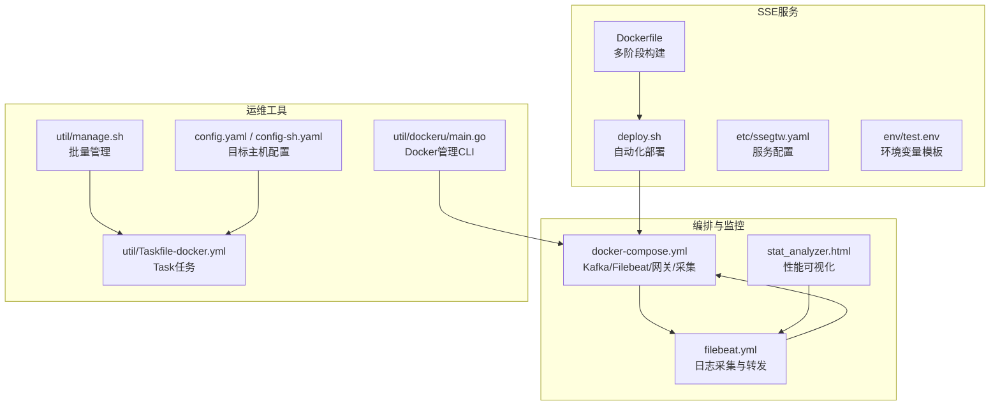
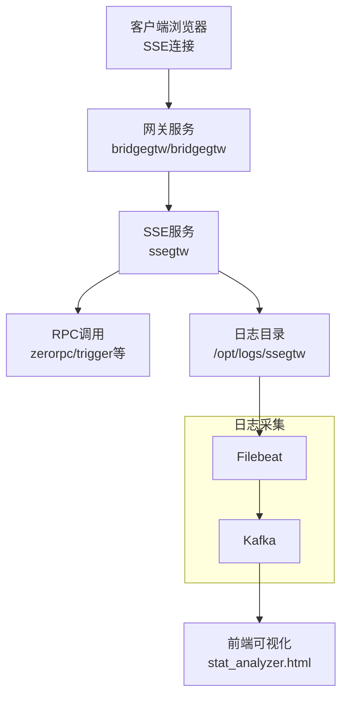
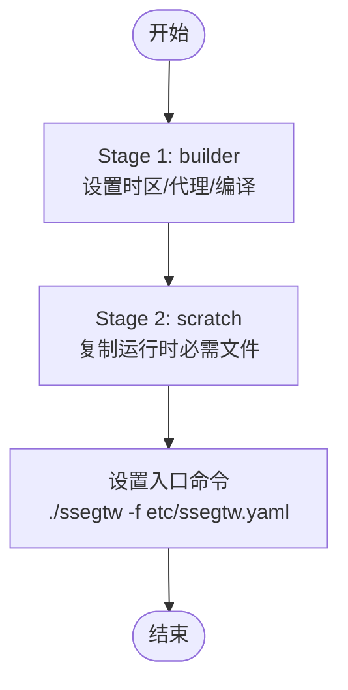
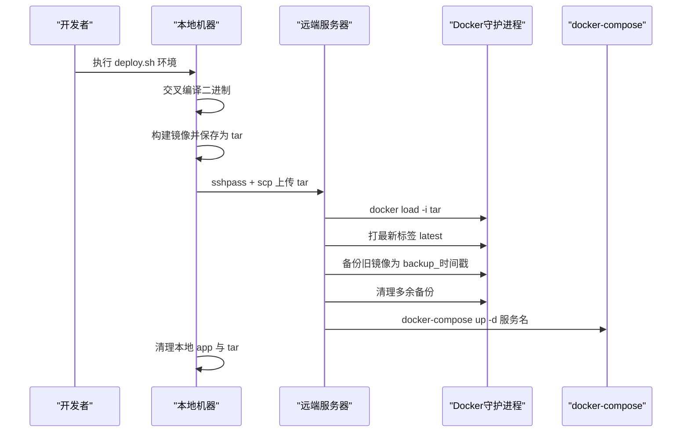
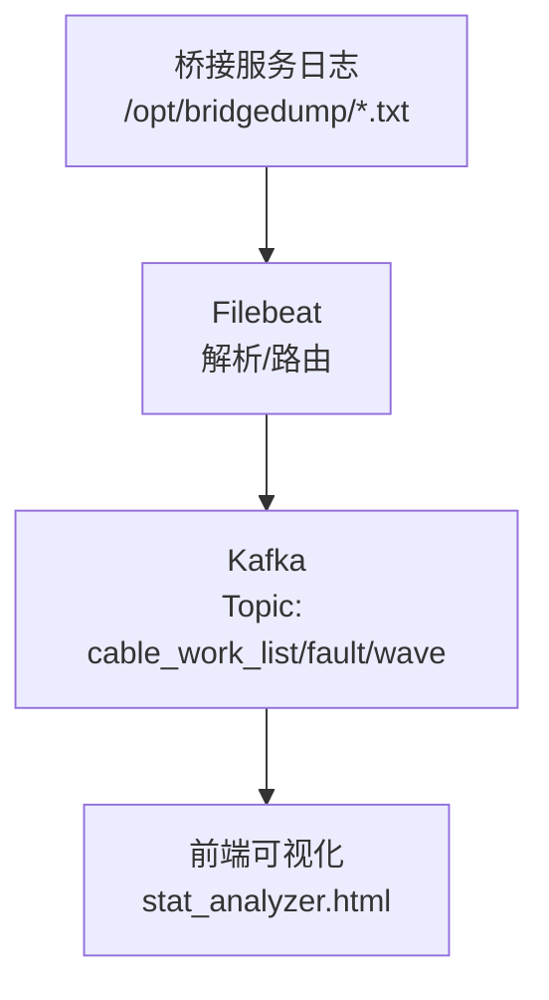
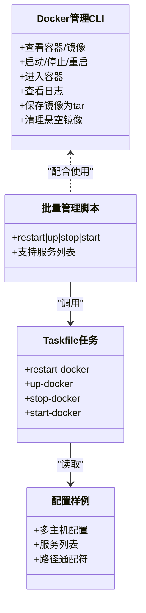
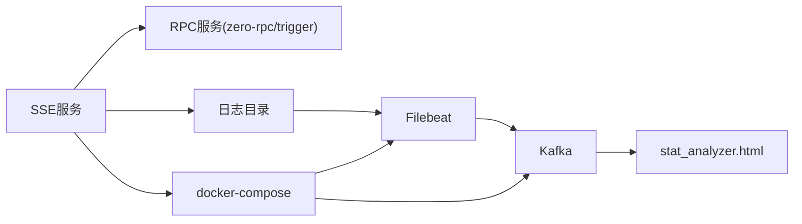

# SSE部署运维

<cite>
**本文引用的文件**   
- [Dockerfile](file://aiapp/ssegtw/Dockerfile)
- [部署脚本](file://aiapp/ssegtw/deploy.sh)
- [配置文件](file://aiapp/ssegtw/etc/ssegtw.yaml)
- [环境变量示例](file://aiapp/ssegtw/env/test.env)
- [Docker Compose编排](file://deploy/docker-compose.yml)
- [Filebeat配置](file://deploy/filebeat/conf/filebeat.yml)
- [Docker管理工具](file://util/dockeru/main.go)
- [批量管理脚本](file://util/manage.sh)
- [Taskfile通用任务](file://util/Taskfile-docker.yml)
- [Taskfile-135任务](file://util/Taskfile-135.yml)
- [配置样例](file://util/config.yaml)
- [配置样例-简版](file://util/config-sh.yaml)
- [统计分析页面](file://deploy/stat_analyzer.html)
- [技能文档-部署流程](file://.trae/skills/dev-environment/SKILL.md)
</cite>

## 目录
1. [简介](#简介)
2. [项目结构](#项目结构)
3. [核心组件](#核心组件)
4. [架构总览](#架构总览)
5. [详细组件分析](#详细组件分析)
6. [依赖关系分析](#依赖关系分析)
7. [性能考虑](#性能考虑)
8. [故障排查指南](#故障排查指南)
9. [结论](#结论)
10. [附录](#附录)

## 简介
本技术文档面向SSE（Server-Sent Events）服务的部署与运维，围绕容器化部署、服务编排、镜像构建、自动化部署脚本、监控与日志、CI/CD集成、版本管理与灰度发布等主题展开。文档基于仓库中的实际文件进行分析，提供从架构到落地操作的完整指南。

## 项目结构
SSE服务位于 aiapp/ssegtw 目录，包含：
- Dockerfile：多阶段构建与精简镜像策略
- deploy.sh：自动化部署脚本（本地构建、远程上传、镜像打标、回滚与清理）
- etc/ssegtw.yaml：服务配置（监听地址、端口、日志路径、RPC连接等）
- env/test.env：部署所需环境变量模板
- Docker Compose：跨服务编排（Kafka、Filebeat、网关与采集服务等）

**图表来源**
- [Dockerfile:1-42](file://aiapp/ssegtw/Dockerfile#L1-L42)
- [部署脚本:1-170](file://aiapp/ssegtw/deploy.sh#L1-L170)
- [配置文件:1-14](file://aiapp/ssegtw/etc/ssegtw.yaml#L1-L14)
- [环境变量示例:1-16](file://aiapp/ssegtw/env/test.env#L1-L16)
- [Docker Compose编排:1-110](file://deploy/docker-compose.yml#L1-L110)
- [Filebeat配置:1-122](file://deploy/filebeat/conf/filebeat.yml#L1-L122)
- [Docker管理工具:1-448](file://util/dockeru/main.go#L1-L448)
- [批量管理脚本:1-35](file://util/manage.sh#L1-L35)
- [Taskfile通用任务:1-37](file://util/Taskfile-docker.yml#L1-L37)
- [配置样例:1-26](file://util/config.yaml#L1-L26)
- [配置样例-简版:1-20](file://util/config-sh.yaml#L1-L20)
- [统计分析页面:297-1372](file://deploy/stat_analyzer.html#L297-L1372)

**章节来源**
- [Dockerfile:1-42](file://aiapp/ssegtw/Dockerfile#L1-L42)
- [部署脚本:1-170](file://aiapp/ssegtw/deploy.sh#L1-L170)
- [配置文件:1-14](file://aiapp/ssegtw/etc/ssegtw.yaml#L1-L14)
- [环境变量示例:1-16](file://aiapp/ssegtw/env/test.env#L1-L16)
- [Docker Compose编排:1-110](file://deploy/docker-compose.yml#L1-L110)
- [Filebeat配置:1-122](file://deploy/filebeat/conf/filebeat.yml#L1-L122)
- [Docker管理工具:1-448](file://util/dockeru/main.go#L1-L448)
- [批量管理脚本:1-35](file://util/manage.sh#L1-L35)
- [Taskfile通用任务:1-37](file://util/Taskfile-docker.yml#L1-L37)
- [配置样例:1-26](file://util/config.yaml#L1-L26)
- [配置样例-简版:1-20](file://util/config-sh.yaml#L1-L20)
- [统计分析页面:297-1372](file://deploy/stat_analyzer.html#L297-L1372)

## 核心组件
- SSE服务镜像构建：采用多阶段构建，先在builder阶段完成编译与依赖准备，再复制到精简的基础镜像中，减少体积并提升安全性。
- 自动化部署流水线：本地编译 → 本地镜像构建 → 保存为tar → 远程上传 → 远程加载镜像 → 打标签与备份 → docker-compose启动 → 清理临时文件。
- 编排与监控：通过docker-compose统一管理Kafka、Filebeat、网关与采集服务；Filebeat负责采集桥接服务产生的JSON日志并投递至Kafka；统计分析页面对系统指标进行可视化。
- 运维工具链：提供Docker管理CLI、批量管理脚本与Taskfile任务，支持远程SSH执行docker-compose命令，便于集中运维。

**章节来源**
- [Dockerfile:1-42](file://aiapp/ssegtw/Dockerfile#L1-L42)
- [部署脚本:44-169](file://aiapp/ssegtw/deploy.sh#L44-L169)
- [Docker Compose编排:1-110](file://deploy/docker-compose.yml#L1-L110)
- [Filebeat配置:1-122](file://deploy/filebeat/conf/filebeat.yml#L1-L122)
- [Docker管理工具:1-448](file://util/dockeru/main.go#L1-L448)
- [批量管理脚本:1-35](file://util/manage.sh#L1-L35)
- [Taskfile通用任务:1-37](file://util/Taskfile-docker.yml#L1-L37)

## 架构总览
下图展示SSE服务在容器化环境中的部署与数据流：

**图表来源**
- [配置文件:1-14](file://aiapp/ssegtw/etc/ssegtw.yaml#L1-L14)
- [Docker Compose编排:54-109](file://deploy/docker-compose.yml#L54-L109)
- [Filebeat配置:1-122](file://deploy/filebeat/conf/filebeat.yml#L1-L122)
- [统计分析页面:297-1372](file://deploy/stat_analyzer.html#L297-L1372)

## 详细组件分析

### Docker镜像构建
- 多阶段构建：builder阶段设置时区、代理、Go构建参数，最终将二进制复制到scratch基础镜像，仅包含必要的证书与时区文件。
- 精简策略：使用scratch基础镜像，仅复制运行所需的二进制与配置，显著降低镜像体积与攻击面。
- 可移植性：通过ARG接收代理参数，便于在受限网络环境下构建。

**图表来源**
- [Dockerfile:1-42](file://aiapp/ssegtw/Dockerfile#L1-L42)

**章节来源**
- [Dockerfile:1-42](file://aiapp/ssegtw/Dockerfile#L1-L42)

### 自动化部署脚本
- 参数与环境变量：支持通过第一个参数选择环境（默认dev），加载对应.env文件，校验必要变量。
- 本地构建：交叉编译Linux二进制，构建本地镜像并保存为tar。
- 远程部署：通过sshpass+ssh在远端创建目录、scp上传tar、docker load、打标签、备份旧镜像、清理多余备份、启动服务。
- 回滚机制：若存在旧镜像且与新镜像不同，则打上backup_时间戳标签；清理时跳过与当前latest相同的备份，确保可回滚。

**图表来源**
- [部署脚本:1-170](file://aiapp/ssegtw/deploy.sh#L1-L170)

**章节来源**
- [部署脚本:1-170](file://aiapp/ssegtw/deploy.sh#L1-L170)

### 配置与环境变量
- 服务配置：监听地址、端口、日志路径、RPC连接等均在yaml中集中管理。
- 环境变量：包含远端主机、路径、镜像名、服务名、远程标签与备份保留数等，支持按环境区分。

**章节来源**
- [配置文件:1-14](file://aiapp/ssegtw/etc/ssegtw.yaml#L1-L14)
- [环境变量示例:1-16](file://aiapp/ssegtw/env/test.env#L1-L16)

### 编排与监控
- 编排：docker-compose统一管理Kafka、Filebeat、网关与采集服务，设置内存限制、时区、host网络模式等。
- 日志采集：Filebeat监听桥接服务输出的JSON文件，解析后投递到Kafka；topic由输入字段动态决定。
- 可视化：stat_analyzer.html对系统指标（CPU、内存、GC次数、QPS、丢弃数等）进行分钟级聚合与图表渲染。

**图表来源**
- [Docker Compose编排:32-52](file://deploy/docker-compose.yml#L32-L52)
- [Filebeat配置:1-122](file://deploy/filebeat/conf/filebeat.yml#L1-L122)
- [统计分析页面:297-1372](file://deploy/stat_analyzer.html#L297-L1372)

**章节来源**
- [Docker Compose编排:1-110](file://deploy/docker-compose.yml#L1-L110)
- [Filebeat配置:1-122](file://deploy/filebeat/conf/filebeat.yml#L1-L122)
- [统计分析页面:297-1372](file://deploy/stat_analyzer.html#L297-L1372)

### 运维工具链
- Docker管理CLI：提供容器与镜像的查看、启动/停止/重启、进入容器、日志查看、镜像保存与清理等功能。
- 批量管理脚本：封装Taskfile任务，支持远程SSH执行docker-compose命令，便于集中管理多个服务。
- 配置样例：提供多主机配置样例，支持通配符路径与服务列表。

**图表来源**
- [Docker管理工具:1-448](file://util/dockeru/main.go#L1-L448)
- [批量管理脚本:1-35](file://util/manage.sh#L1-L35)
- [Taskfile通用任务:1-37](file://util/Taskfile-docker.yml#L1-L37)
- [配置样例:1-26](file://util/config.yaml#L1-L26)
- [配置样例-简版:1-20](file://util/config-sh.yaml#L1-L20)

**章节来源**
- [Docker管理工具:1-448](file://util/dockeru/main.go#L1-L448)
- [批量管理脚本:1-35](file://util/manage.sh#L1-L35)
- [Taskfile通用任务:1-37](file://util/Taskfile-docker.yml#L1-L37)
- [配置样例:1-26](file://util/config.yaml#L1-L26)
- [配置样例-简版:1-20](file://util/config-sh.yaml#L1-L20)

## 依赖关系分析
- 组件耦合：SSE服务依赖zerorpc/trigger等RPC服务；日志通过Filebeat采集并投递到Kafka；前端通过stat_analyzer.html消费Kafka数据进行可视化。
- 外部依赖：Kafka、Filebeat、Prometheus相关库（仓库中包含client_golang等）为监控与指标采集提供基础。
- 部署依赖：部署脚本依赖sshpass、docker、docker-compose；运维工具依赖docker CLI。

**图表来源**
- [配置文件:1-14](file://aiapp/ssegtw/etc/ssegtw.yaml#L1-L14)
- [Docker Compose编排:1-110](file://deploy/docker-compose.yml#L1-L110)
- [Filebeat配置:1-122](file://deploy/filebeat/conf/filebeat.yml#L1-L122)
- [统计分析页面:297-1372](file://deploy/stat_analyzer.html#L297-L1372)

**章节来源**
- [go.mod:161-185](file://go.mod#L161-L185)
- [go.sum:427-440](file://go.sum#L427-L440)

## 性能考虑
- 容器资源限制：编排文件中为网关与采集服务设置了内存上限，避免资源争抢。
- 日志处理：Filebeat启用压缩与合理的分区策略，减少网络与存储压力。
- 可视化聚合：前端按分钟聚合指标，降低实时渲染压力，同时保留高分辨率数据以便回溯分析。

**章节来源**
- [Docker Compose编排:54-109](file://deploy/docker-compose.yml#L54-L109)
- [Filebeat配置:110-122](file://deploy/filebeat/conf/filebeat.yml#L110-L122)
- [统计分析页面:1316-1326](file://deploy/stat_analyzer.html#L1316-L1326)

## 故障排查指南
- 部署失败排查
  - 环境变量缺失：检查.env文件是否正确加载，必要变量是否齐全。
  - 上传失败：关注SCP重试逻辑与最大重试次数，确认远端目录权限与磁盘空间。
  - 标签与备份：确认新旧镜像ID差异，备份标签命名规则与清理策略。
- 容器与镜像管理
  - 使用Docker管理CLI查看容器状态、日志与镜像列表，定位异常。
  - 通过批量管理脚本与Taskfile任务远程执行docker-compose命令，快速恢复服务。
- 日志与监控
  - Filebeat解析失败：检查dissect与JSON解析配置，必要时调整忽略策略。
  - 可视化异常：确认Kafka连接与topic路由，检查前端聚合逻辑。

**章节来源**
- [部署脚本:14-31](file://aiapp/ssegtw/deploy.sh#L14-L31)
- [部署脚本:64-83](file://aiapp/ssegtw/deploy.sh#L64-L83)
- [部署脚本:108-153](file://aiapp/ssegtw/deploy.sh#L108-L153)
- [Docker管理工具:342-421](file://util/dockeru/main.go#L342-L421)
- [批量管理脚本:1-35](file://util/manage.sh#L1-L35)
- [Taskfile通用任务:10-37](file://util/Taskfile-docker.yml#L10-L37)
- [Filebeat配置:84-106](file://deploy/filebeat/conf/filebeat.yml#L84-L106)

## 结论
本仓库提供了完整的SSE服务容器化部署与运维方案：从多阶段镜像构建、自动化部署脚本、编排与监控配置，到运维工具链与可视化分析，形成了一套可复用、可扩展的工程实践。建议在生产环境中结合CI/CD流水线实现版本管理与灰度发布，并持续完善监控与告警体系。

## 附录

### CI/CD集成与版本管理
- 版本标签：部署脚本默认使用时间戳作为本地镜像标签，远端默认latest，支持通过环境变量覆盖。
- 回滚策略：通过backup_时间戳标签实现回滚，清理时跳过与当前latest相同的备份。
- 灰度发布建议：结合镜像标签与docker-compose服务名，逐步切换流量至新版本镜像，观察指标后再全量发布。

**章节来源**
- [部署脚本:36-42](file://aiapp/ssegtw/deploy.sh#L36-L42)
- [部署脚本:108-153](file://aiapp/ssegtw/deploy.sh#L108-L153)
- [环境变量示例:11-15](file://aiapp/ssegtw/env/test.env#L11-L15)

### 最佳实践清单
- 镜像优化：保持多阶段构建与最小化基础镜像；合理设置时区与代理参数。
- 部署流程：本地构建与tar导出，远程加载与标签管理，严格备份与清理策略。
- 监控与日志：统一Kafka采集，Filebeat解析与路由，前端可视化聚合。
- 运维效率：使用Docker管理CLI与Taskfile任务，集中管理多主机与多服务。

**章节来源**
- [Dockerfile:1-42](file://aiapp/ssegtw/Dockerfile#L1-L42)
- [部署脚本:44-169](file://aiapp/ssegtw/deploy.sh#L44-L169)
- [Docker管理工具:1-448](file://util/dockeru/main.go#L1-L448)
- [Taskfile通用任务:1-37](file://util/Taskfile-docker.yml#L1-L37)
- [Filebeat配置:1-122](file://deploy/filebeat/conf/filebeat.yml#L1-L122)
- [统计分析页面:1316-1326](file://deploy/stat_analyzer.html#L1316-L1326)