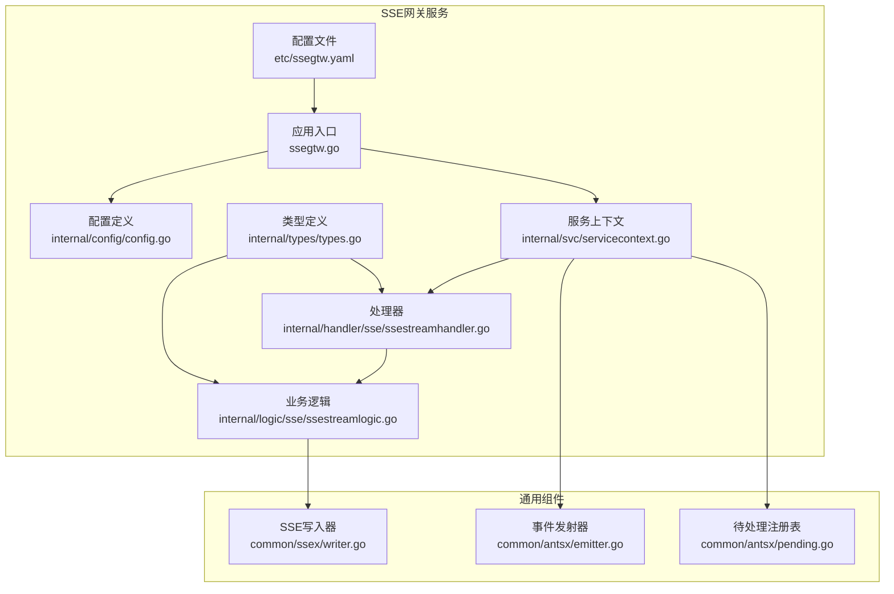
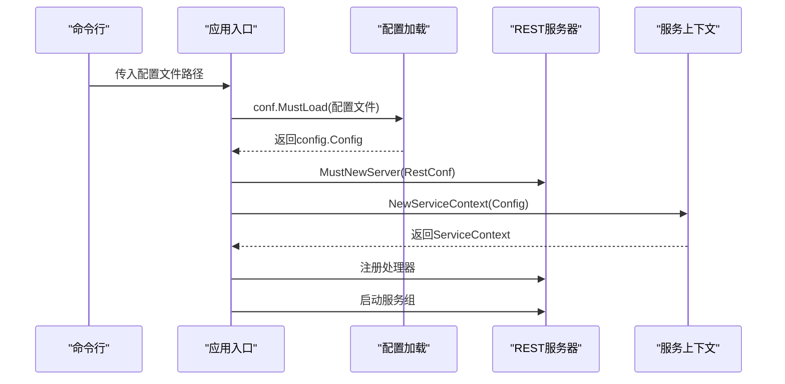
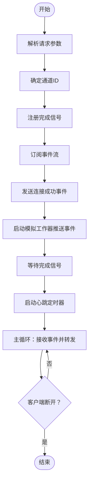
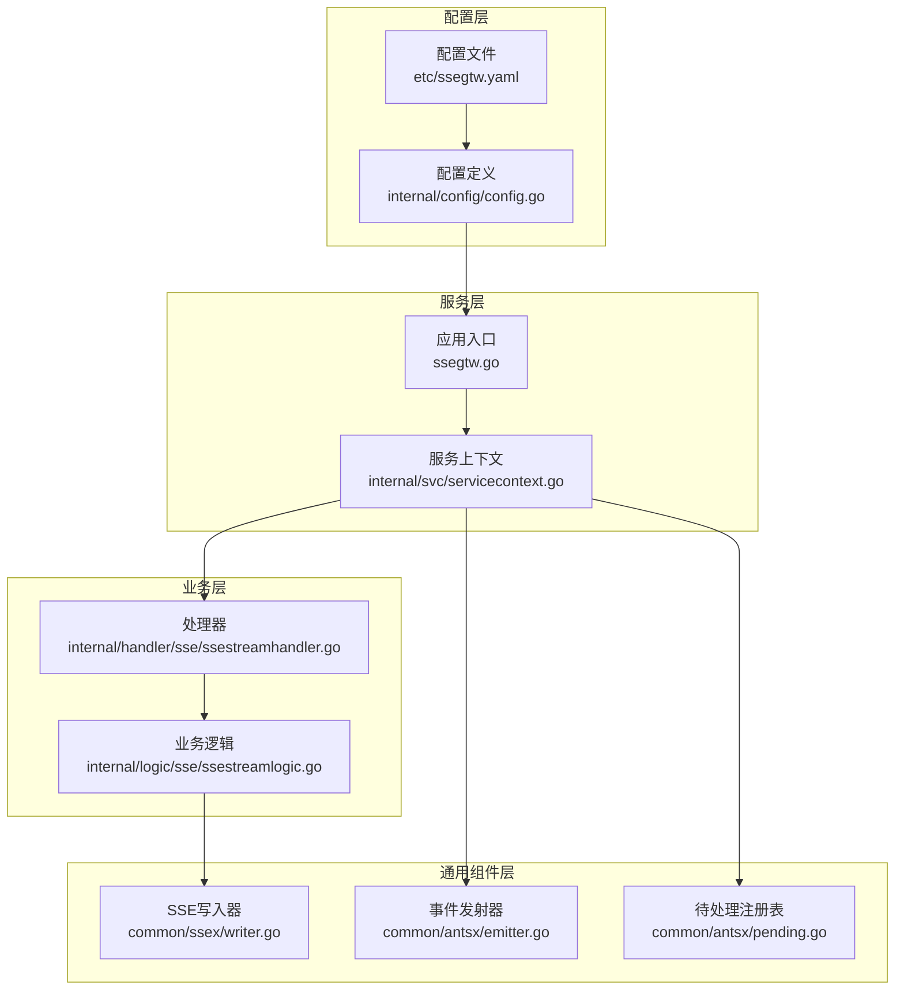
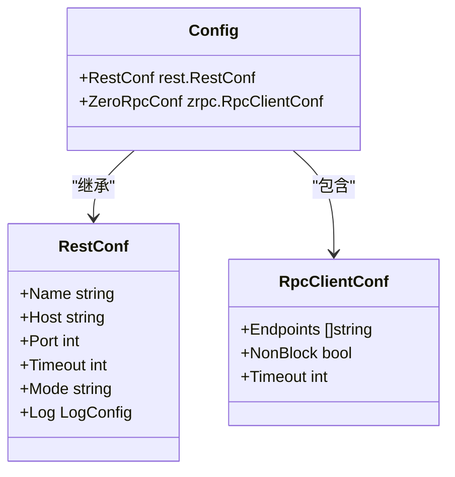
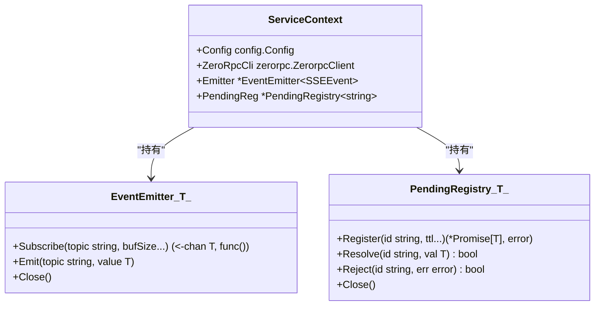
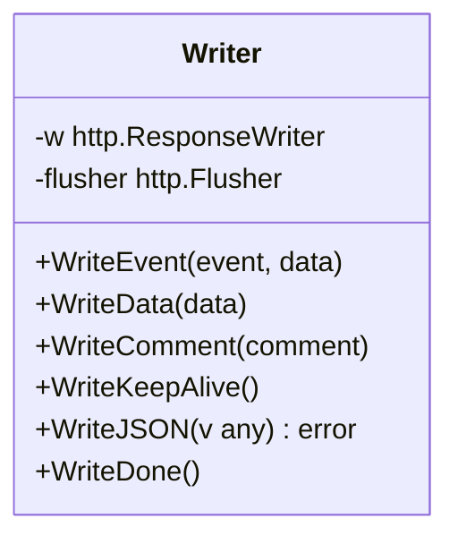
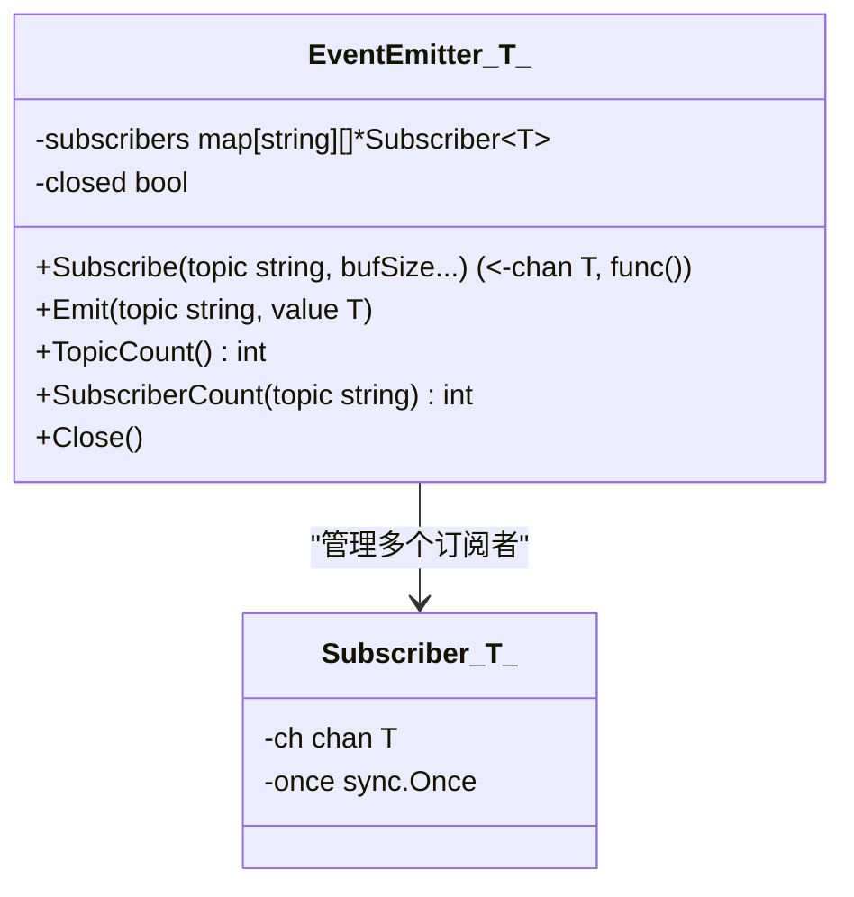
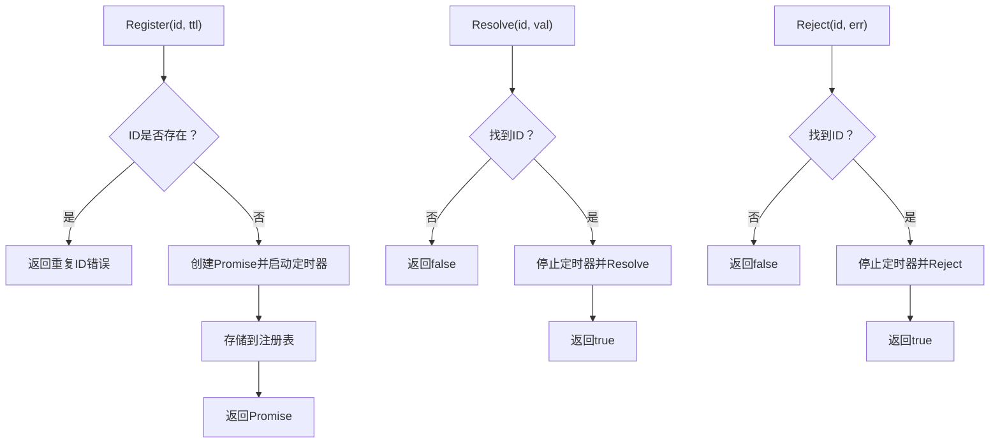
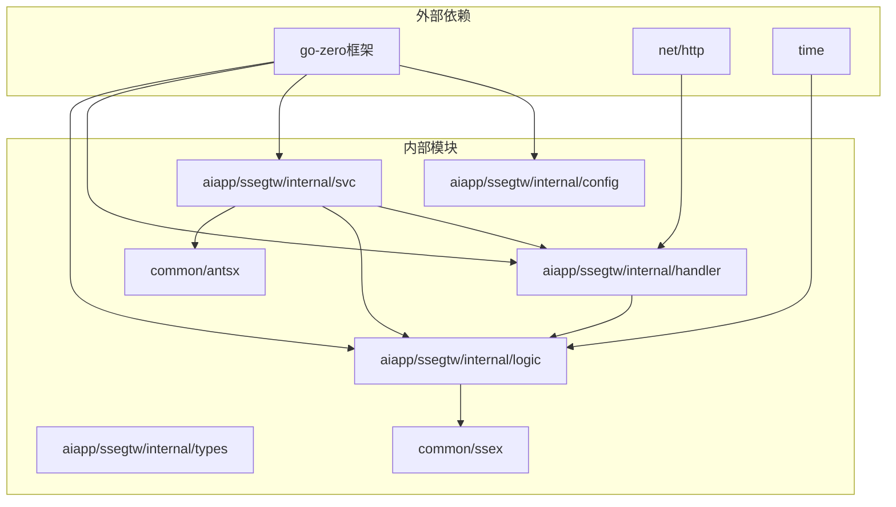

# SSE配置管理

<cite>
**本文档引用的文件**
- [ssegtw.yaml](file://aiapp/ssegtw/etc/ssegtw.yaml)
- [config.go](file://aiapp/ssegtw/internal/config/config.go)
- [ssegtw.go](file://aiapp/ssegtw/ssegtw.go)
- [servicecontext.go](file://aiapp/ssegtw/internal/svc/servicecontext.go)
- [ssestreamhandler.go](file://aiapp/ssegtw/internal/handler/sse/ssestreamhandler.go)
- [ssestreamlogic.go](file://aiapp/ssegtw/internal/logic/sse/ssestreamlogic.go)
- [writer.go](file://common/ssex/writer.go)
- [emitter.go](file://common/antsx/emitter.go)
- [pending.go](file://common/antsx/pending.go)
- [types.go](file://aiapp/ssegtw/internal/types/types.go)
- [resilience-patterns.md](file://.trae/skills/zero-skills/references/resilience-patterns.md)
- [rest-api-patterns.md](file://.trae/skills/zero-skills/references/rest-api-patterns.md)
</cite>

## 目录
1. [简介](#简介)
2. [项目结构](#项目结构)
3. [核心组件](#核心组件)
4. [架构概览](#架构概览)
5. [详细组件分析](#详细组件分析)
6. [依赖关系分析](#依赖关系分析)
7. [性能考量](#性能考量)
8. [故障排查指南](#故障排查指南)
9. [结论](#结论)
10. [附录](#附录)

## 简介
本文件为SSE（Server-Sent Events）配置管理的详细技术文档，聚焦于SSE网关服务的配置结构与实现细节。内容涵盖基础配置项、网络设置、安全参数、配置加载机制、默认值处理、运行时更新策略、安全考虑、最佳实践以及验证与故障排查方法。通过对代码库中的SSE网关服务进行深入分析，帮助读者全面理解SSE配置的全生命周期管理。

## 项目结构
SSE网关服务位于aiapp/ssegtw目录下，采用标准的go-zero微服务分层结构：
- 配置文件：etc/ssegtw.yaml
- 应用入口：ssegtw.go
- 配置定义：internal/config/config.go
- 服务上下文：internal/svc/servicecontext.go
- 处理器：internal/handler/sse/ssestreamhandler.go
- 业务逻辑：internal/logic/sse/ssestreamlogic.go
- 类型定义：internal/types/types.go
- SSE写入器：common/ssex/writer.go
- 事件发射器：common/antsx/emitter.go
- 待处理注册表：common/antsx/pending.go

**图表来源**
- [ssegtw.yaml:1-14](file://aiapp/ssegtw/etc/ssegtw.yaml#L1-L14)
- [ssegtw.go:24-59](file://aiapp/ssegtw/ssegtw.go#L24-L59)
- [config.go:11-14](file://aiapp/ssegtw/internal/config/config.go#L11-L14)
- [servicecontext.go:23-38](file://aiapp/ssegtw/internal/svc/servicecontext.go#L23-L38)
- [ssestreamhandler.go:18-32](file://aiapp/ssegtw/internal/handler/sse/ssestreamhandler.go#L18-L32)
- [ssestreamlogic.go:39-116](file://aiapp/ssegtw/internal/logic/sse/ssestreamlogic.go#L39-L116)
- [writer.go:15-22](file://common/ssex/writer.go#L15-L22)
- [emitter.go:20-25](file://common/antsx/emitter.go#L20-L25)
- [pending.go:38-50](file://common/antsx/pending.go#L38-L50)

**章节来源**
- [ssegtw.yaml:1-14](file://aiapp/ssegtw/etc/ssegtw.yaml#L1-L14)
- [ssegtw.go:24-59](file://aiapp/ssegtw/ssegtw.go#L24-L59)

## 核心组件
本节对SSE配置管理的核心组件进行深入分析，包括配置结构、加载机制、运行时行为以及与通用组件的交互。

### 配置结构与字段说明
SSE网关服务的配置由两部分组成：
- 基础REST配置：继承自go-zero的rest.RestConf，包含服务名称、监听地址、端口、超时等基础网络参数。
- RPC客户端配置：ZeroRpcConf，用于连接下游RPC服务，包含端点列表、非阻塞模式、超时等。

配置文件字段详解：
- Name：服务名称，用于日志全局字段标识。
- Host：监听地址，0.0.0.0表示监听所有网络接口。
- Port：监听端口，11004为SSE网关服务端口。
- Timeout：服务超时时间，0表示无限制。
- Mode：运行模式，dev用于开发环境。
- Log.Encoding：日志编码格式，plain为纯文本格式。
- Log.Path：日志输出路径。
- ZeroRpcConf.Endpoints：RPC服务端点列表。
- ZeroRpcConf.NonBlock：RPC调用是否非阻塞。
- ZeroRpcConf.Timeout：RPC调用超时时间。

**章节来源**
- [ssegtw.yaml:1-14](file://aiapp/ssegtw/etc/ssegtw.yaml#L1-L14)
- [config.go:11-14](file://aiapp/ssegtw/internal/config/config.go#L11-L14)

### 配置加载机制
应用启动时通过命令行参数指定配置文件路径，默认为etc/ssegtw.yaml。加载过程如下：
1. 解析命令行参数，获取配置文件路径。
2. 使用conf.MustLoad加载配置文件到config.Config结构体。
3. 初始化REST服务器，配置CORS策略。
4. 构建服务上下文，初始化RPC客户端、事件发射器和待处理注册表。
5. 注册处理器并启动服务组。

**图表来源**
- [ssegtw.go:24-59](file://aiapp/ssegtw/ssegtw.go#L24-L59)
- [servicecontext.go:30-38](file://aiapp/ssegtw/internal/svc/servicecontext.go#L30-L38)

**章节来源**
- [ssegtw.go:24-59](file://aiapp/ssegtw/ssegtw.go#L24-L59)
- [servicecontext.go:30-38](file://aiapp/ssegtw/internal/svc/servicecontext.go#L30-L38)

### 默认值处理与运行时更新
- 默认值处理：配置文件中未显式设置的字段将采用go-zero框架的默认值。例如，日志级别、编码格式等均遵循框架默认行为。
- 运行时更新：当前实现未提供配置热更新功能。若需更新配置，需重启服务以重新加载配置文件。

**章节来源**
- [ssegtw.yaml:1-14](file://aiapp/ssegtw/etc/ssegtw.yaml#L1-L14)
- [config.go:11-14](file://aiapp/ssegtw/internal/config/config.go#L11-L14)

### SSE事件流处理流程
SSE事件流的处理流程包括：请求解析、通道确定、事件注册、订阅事件、发送连接成功事件、启动模拟工作器、等待完成信号、心跳保活以及主循环转发事件。

**图表来源**
- [ssestreamlogic.go:39-116](file://aiapp/ssegtw/internal/logic/sse/ssestreamlogic.go#L39-L116)
- [writer.go:24-55](file://common/ssex/writer.go#L24-L55)

**章节来源**
- [ssestreamhandler.go:18-32](file://aiapp/ssegtw/internal/handler/sse/ssestreamhandler.go#L18-L32)
- [ssestreamlogic.go:39-116](file://aiapp/ssegtw/internal/logic/sse/ssestreamlogic.go#L39-L116)

## 架构概览
SSE网关服务的整体架构围绕配置驱动的设计理念构建，通过配置文件统一管理服务的网络、日志、RPC等关键参数。服务启动后，基于配置初始化REST服务器和相关组件，并提供SSE事件流能力。

**图表来源**
- [ssegtw.yaml:1-14](file://aiapp/ssegtw/etc/ssegtw.yaml#L1-L14)
- [config.go:11-14](file://aiapp/ssegtw/internal/config/config.go#L11-L14)
- [ssegtw.go:24-59](file://aiapp/ssegtw/ssegtw.go#L24-L59)
- [servicecontext.go:23-38](file://aiapp/ssegtw/internal/svc/servicecontext.go#L23-L38)
- [ssestreamhandler.go:18-32](file://aiapp/ssegtw/internal/handler/sse/ssestreamhandler.go#L18-L32)
- [ssestreamlogic.go:39-116](file://aiapp/ssegtw/internal/logic/sse/ssestreamlogic.go#L39-L116)
- [writer.go:15-22](file://common/ssex/writer.go#L15-L22)
- [emitter.go:20-25](file://common/antsx/emitter.go#L20-L25)
- [pending.go:38-50](file://common/antsx/pending.go#L38-L50)

## 详细组件分析

### 配置定义与继承关系
配置结构通过嵌入rest.RestConf和zrpc.RpcClientConf实现，确保SSE网关具备完整的REST服务能力和RPC客户端能力。

**图表来源**
- [config.go:11-14](file://aiapp/ssegtw/internal/config/config.go#L11-L14)

**章节来源**
- [config.go:11-14](file://aiapp/ssegtw/internal/config/config.go#L11-L14)

### 服务上下文与组件初始化
服务上下文负责聚合配置、RPC客户端、事件发射器和待处理注册表，并提供给处理器和业务逻辑使用。

**图表来源**
- [servicecontext.go:23-38](file://aiapp/ssegtw/internal/svc/servicecontext.go#L23-L38)
- [emitter.go:13-25](file://common/antsx/emitter.go#L13-L25)
- [pending.go:29-50](file://common/antsx/pending.go#L29-L50)

**章节来源**
- [servicecontext.go:23-38](file://aiapp/ssegtw/internal/svc/servicecontext.go#L23-L38)
- [emitter.go:13-25](file://common/antsx/emitter.go#L13-L25)
- [pending.go:29-50](file://common/antsx/pending.go#L29-L50)

### SSE写入器与事件流协议
SSE写入器封装了SSE协议的写入操作，包括事件消息、纯数据消息、注释行、心跳保活以及JSON数据写出等。

**图表来源**
- [writer.go:9-22](file://common/ssex/writer.go#L9-L22)
- [writer.go:24-79](file://common/ssex/writer.go#L24-L79)

**章节来源**
- [writer.go:9-22](file://common/ssex/writer.go#L9-L22)
- [writer.go:24-79](file://common/ssex/writer.go#L24-L79)

### 事件发射器与订阅机制
事件发射器支持按主题（topic）级别的发布/订阅，提供非阻塞广播、订阅者管理以及关闭操作。

**图表来源**
- [emitter.go:13-25](file://common/antsx/emitter.go#L13-L25)
- [emitter.go:27-67](file://common/antsx/emitter.go#L27-L67)

**章节来源**
- [emitter.go:13-25](file://common/antsx/emitter.go#L13-L25)
- [emitter.go:27-67](file://common/antsx/emitter.go#L27-L67)

### 待处理注册表与异步匹配
待处理注册表用于异步请求-响应匹配，支持超时自动清理、重复ID检测以及关闭时的批量拒绝。

**图表来源**
- [pending.go:52-90](file://common/antsx/pending.go#L52-L90)
- [pending.go:92-124](file://common/antsx/pending.go#L92-L124)

**章节来源**
- [pending.go:52-90](file://common/antsx/pending.go#L52-L90)
- [pending.go:92-124](file://common/antsx/pending.go#L92-L124)

## 依赖关系分析
SSE网关服务的依赖关系清晰，主要依赖于go-zero框架提供的REST服务能力和RPC客户端能力，同时利用通用组件实现事件驱动的SSE功能。

**图表来源**
- [config.go:6-9](file://aiapp/ssegtw/internal/config/config.go#L6-L9)
- [servicecontext.go:6-15](file://aiapp/ssegtw/internal/svc/servicecontext.go#L6-L15)
- [ssestreamhandler.go:6-15](file://aiapp/ssegtw/internal/handler/sse/ssestreamhandler.go#L6-L15)
- [ssestreamlogic.go:6-18](file://aiapp/ssegtw/internal/logic/sse/ssestreamlogic.go#L6-L18)
- [writer.go:3-7](file://common/ssex/writer.go#L3-L7)
- [emitter.go:3-6](file://common/antsx/emitter.go#L3-L6)
- [pending.go:3-8](file://common/antsx/pending.go#L3-L8)

**章节来源**
- [config.go:6-9](file://aiapp/ssegtw/internal/config/config.go#L6-L9)
- [servicecontext.go:6-15](file://aiapp/ssegtw/internal/svc/servicecontext.go#L6-L15)
- [ssestreamhandler.go:6-15](file://aiapp/ssegtw/internal/handler/sse/ssestreamhandler.go#L6-L15)
- [ssestreamlogic.go:6-18](file://aiapp/ssegtw/internal/logic/sse/ssestreamlogic.go#L6-L18)
- [writer.go:3-7](file://common/ssex/writer.go#L3-L7)
- [emitter.go:3-6](file://common/antsx/emitter.go#L3-L6)
- [pending.go:3-8](file://common/antsx/pending.go#L3-L8)

## 性能考量
- 心跳保活：服务端每30秒发送一次心跳保活注释，防止中间设备断开连接。
- 缓冲区大小：事件发射器订阅时支持可选的缓冲区大小，默认为16，可根据负载调整。
- 超时设置：服务超时时间为0表示无限制，建议在生产环境中设置合理的超时值。
- 非阻塞RPC：RPC调用支持非阻塞模式，提高并发性能。
- 日志级别：开发环境使用plain编码，生产环境建议使用更高效的编码格式并设置合适的日志级别。

**章节来源**
- [ssestreamlogic.go:92-115](file://aiapp/ssegtw/internal/logic/sse/ssestreamlogic.go#L92-L115)
- [emitter.go:28-33](file://common/antsx/emitter.go#L28-L33)
- [pending.go:17-22](file://common/antsx/pending.go#L17-L22)
- [ssegtw.yaml:4-13](file://aiapp/ssegtw/etc/ssegtw.yaml#L4-L13)

## 故障排查指南
- CORS配置：确保Access-Control-Allow-Origin动态设置为请求来源，避免跨域问题。
- 心跳保活：检查客户端是否正确处理心跳注释，防止连接被中间设备断开。
- 事件丢失：事件发射器采用非阻塞广播，慢消费者可能导致消息丢失，可通过增大缓冲区或优化消费者处理逻辑解决。
- 超时问题：检查服务超时设置和RPC超时设置，确保在合理范围内。
- 日志定位：通过日志中的全局字段app标识服务实例，结合具体错误信息进行定位。

**章节来源**
- [ssegtw.go:35-46](file://aiapp/ssegtw/ssegtw.go#L35-L46)
- [ssestreamlogic.go:102-115](file://aiapp/ssegtw/internal/logic/sse/ssestreamlogic.go#L102-L115)
- [emitter.go:76-82](file://common/antsx/emitter.go#L76-L82)

## 结论
SSE配置管理通过明确的配置结构、清晰的加载机制和完善的组件设计，实现了高性能、可维护的SSE事件流服务。建议在生产环境中合理设置超时、缓冲区大小和日志级别，并关注跨域和心跳保活等关键配置，以确保服务的稳定性和可靠性。

## 附录
- 最佳实践参考：可参考零技能库中的弹性模式和REST API模式文档，了解生产环境配置建议和性能调优参数。
- 配置验证：通过启动服务并观察日志输出，确认配置加载成功且服务正常运行。
- 动态配置更新：当前实现未提供配置热更新功能，如需更新配置请重启服务。

**章节来源**
- [resilience-patterns.md:591-619](file://.trae/skills/zero-skills/references/resilience-patterns.md#L591-L619)
- [rest-api-patterns.md:146-195](file://.trae/skills/zero-skills/references/rest-api-patterns.md#L146-L195)