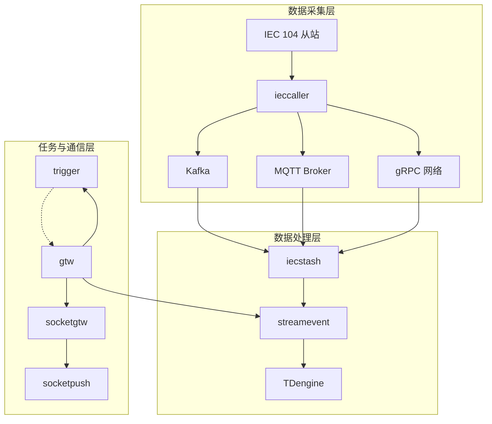
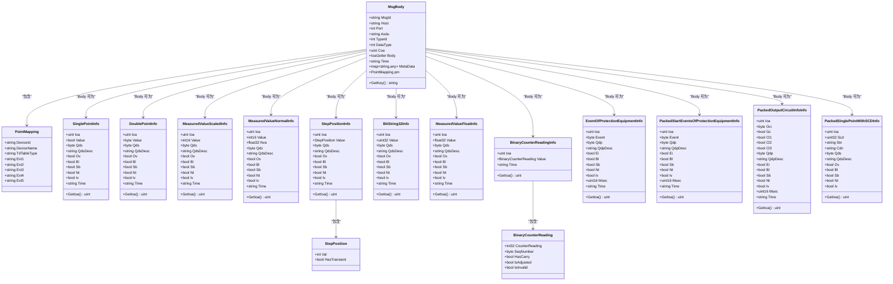
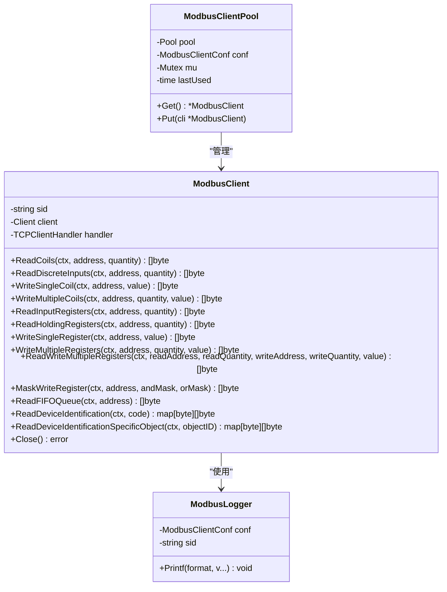
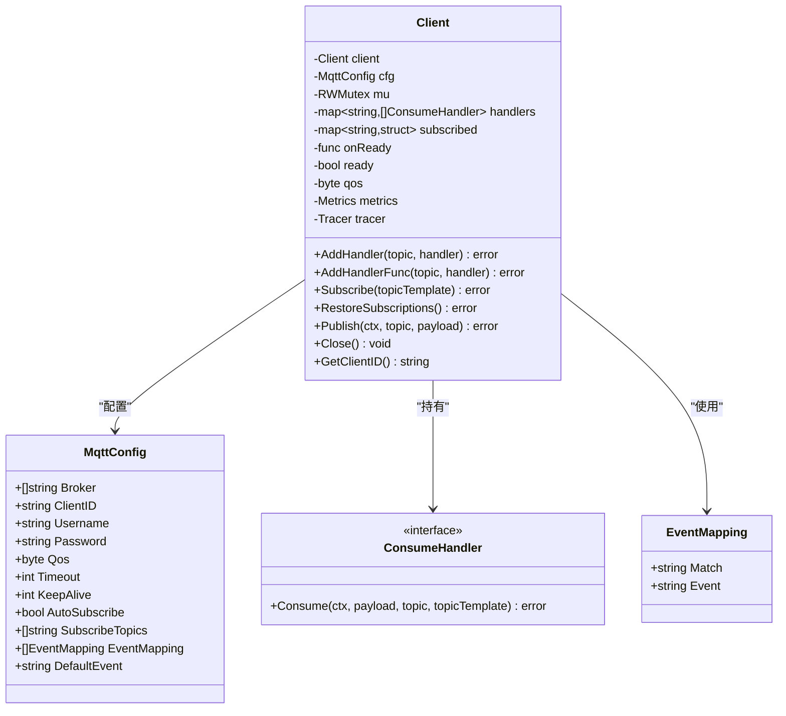
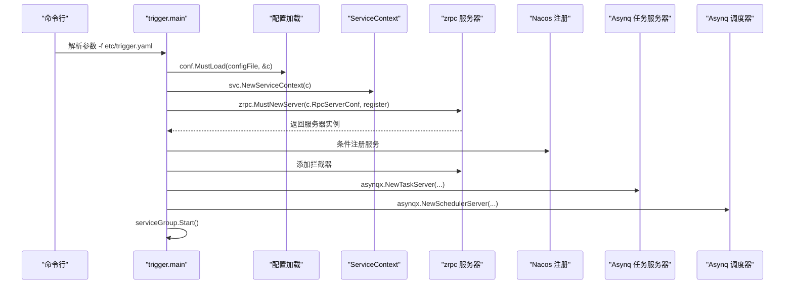
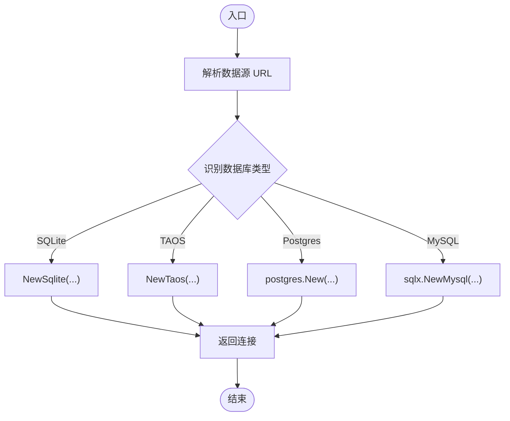
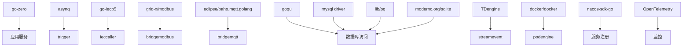

# 深度思考模式

<cite>
**本文档引用的文件**
- [README.md](file://README.md)
- [go.mod](file://go.mod)
- [aiapp/aichat/aichat.go](file://aiapp/aichat/aichat.go)
- [zerorpc/zerorpc.go](file://zerorpc/zerorpc.go)
- [app/trigger/trigger.go](file://app/trigger/trigger.go)
- [socketapp/socketgtw/socketgtw.go](file://socketapp/socketgtw/socketgtw.go)
- [common/iec104/types/types.go](file://common/iec104/types/types.go)
- [common/modbusx/client.go](file://common/modbusx/client.go)
- [common/mqttx/mqttx.go](file://common/mqttx/mqttx.go)
- [app/trigger/etc/trigger.yaml](file://app/trigger/etc/trigger.yaml)
- [socketapp/socketgtw/etc/socketgtw.yaml](file://socketapp/socketgtw/etc/socketgtw.yaml)
- [model/usermodel.go](file://model/usermodel.go)
- [common/dbx/dbx.go](file://common/dbx/dbx.go)
- [deploy/docker-compose.yml](file://deploy/docker-compose.yml)
- [common/type.go](file://common/type.go)
</cite>

## 目录
1. [简介](#简介)
2. [项目结构](#项目结构)
3. [核心组件](#核心组件)
4. [架构总览](#架构总览)
5. [详细组件分析](#详细组件分析)
6. [依赖分析](#依赖分析)
7. [性能考虑](#性能考虑)
8. [故障排除指南](#故障排除指南)
9. [结论](#结论)
10. [附录](#附录)

## 简介
本项目是一个基于 go-zero 的工业级微服务脚手架，专注于物联网数据采集、异步任务调度与实时通信。系统提供多协议接入（IEC 60870-5-104、Modbus TCP/RTU、MQTT、gRPC、HTTP），内置 IEC 104 数采平台、基于 asynq 的分布式任务队列、SocketIO 实时通信网关、容器管理、地理信息系统（H3/GeoHash/电子围栏）、BFF 网关以及统一的跨语言流数据事件协议。

## 项目结构
项目采用按功能域划分的服务化架构，主要模块包括：
- 应用服务层（app/）：包含 IEC 104 数采平台、文件服务、地理信息、告警、容器管理、协议桥接、流媒体、日志导出、计划任务等
- 实时通信层（socketapp/）：SocketIO 网关与推送服务
- 网关层（gtw/）：统一 API 入口，聚合 gRPC 与 HTTP 访问
- 外部接口层（facade/）：跨语言流数据事件协议
- 公共组件库（common/）：协议实现、工具库、拦截器、数据库扩展、MQTT/Modbus 扩展、容器操作、地理信息处理等
- 模型与脚本（model/）：数据库模型与 SQL 脚本
- 部署（deploy/）：Docker Compose 编排
- 文档与 Swagger（docs/swagger/）

```mermaid
graph TB
subgraph "应用服务层"
IECCALLER["ieccaller<br/>IEC 104 主站"]
IECSTASH["iecstash<br/>数据合并"]
TRIGGER["trigger<br/>异步任务调度"]
FILE["file<br/>文件服务"]
GIS["gis<br/>地理信息"]
ALARM["alarm<br/>告警"]
POD["podengine<br/>容器管理"]
BRIDGEMODBUS["bridgemodbus<br/>Modbus 桥接"]
BRIDGEMQTT["bridgemqtt<br/>MQTT 桥接"]
BRIDGEGTW["bridgegtw<br/>HTTP 代理"]
BRIDGEDUMP["bridgedump<br/>文件生成"]
LALHOOK["lalhook<br/>流媒体回调"]
LALPROXY["lalproxy<br/>流媒体代理"]
LOGDUMP["logdump<br/>日志导出"]
XFM["xfusionmock<br/>融合模拟"]
MCP["mcpserver<br/>MCP 服务器"]
end
subgraph "实时通信层"
SOCKETGTW["socketgtw<br/>SocketIO 网关"]
SOCKETPUSH["socketpush<br/>SocketIO 推送"]
end
subgraph "网关层"
GTW["gtw<br/>BFF 网关"]
end
subgraph "公共组件库"
COMMON["common/<br/>协议/工具/拦截器"]
end
subgraph "部署与模型"
DEPLOY["deploy/<br/>Docker Compose"]
MODEL["model/<br/>数据库模型"]
end
IECCALLER --> IECSTASH --> TRIGGER
BRIDGEMODBUS --> TRIGGER
BRIDGEMQTT --> TRIGGER
BRIDGEGTW --> TRIGGER
BRIDGEDUMP --> TRIGGER
LALHOOK --> TRIGGER
LALPROXY --> TRIGGER
LOGDUMP --> TRIGGER
XFM --> TRIGGER
MCP --> TRIGGER
SOCKETGTW --> SOCKETPUSH
GTW --> TRIGGER
GTW --> SOCKETGTW
GTW --> FILE
GTW --> GIS
GTW --> ALARM
GTW --> POD
GTW --> BRIDGEMODBUS
GTW --> BRIDGEMQTT
GTW --> BRIDGEGTW
GTW --> BRIDGEDUMP
GTW --> LALHOOK
GTW --> LALPROXY
GTW --> LOGDUMP
GTW --> XFM
GTW --> MCP
COMMON --> TRIGGER
COMMON --> SOCKETGTW
COMMON --> FILE
COMMON --> GIS
COMMON --> ALARM
COMMON --> POD
COMMON --> BRIDGEMODBUS
COMMON --> BRIDGEMQTT
COMMON --> BRIDGEGTW
COMMON --> BRIDGEDUMP
COMMON --> LALHOOK
COMMON --> LALPROXY
COMMON --> LOGDUMP
COMMON --> XFM
COMMON --> MCP
DEPLOY --> TRIGGER
DEPLOY --> SOCKETGTW
DEPLOY --> FILE
DEPLOY --> GIS
DEPLOY --> ALARM
DEPLOY --> POD
DEPLOY --> BRIDGEMODBUS
DEPLOY --> BRIDGEMQTT
DEPLOY --> BRIDGEGTW
DEPLOY --> BRIDGEDUMP
DEPLOY --> LALHOOK
DEPLOY --> LALPROXY
DEPLOY --> LOGDUMP
DEPLOY --> XFM
DEPLOY --> MCP
MODEL --> TRIGGER
MODEL --> SOCKETGTW
MODEL --> FILE
MODEL --> GIS
MODEL --> ALARM
MODEL --> POD
MODEL --> BRIDGEMODBUS
MODEL --> BRIDGEMQTT
MODEL --> BRIDGEGTW
MODEL --> BRIDGEDUMP
MODEL --> LALHOOK
MODEL --> LALPROXY
MODEL --> LOGDUMP
MODEL --> XFM
MODEL --> MCP
```

**图表来源**
- [README.md:59-108](file://README.md#L59-L108)

**章节来源**
- [README.md:59-108](file://README.md#L59-L108)

## 核心组件
- IEC 104 数采平台：由 ieccaller（主站）、iecstash（数据合并）、streamevent（数据落库）协同完成从站数据采集、Kafka/MQTT/gRPC 三协议推送与 TDengine 存储
- 异步任务调度：基于 asynq 的分布式任务队列，支持定时/延时任务、HTTP/gRPC 回调、自动重试与生命周期管理
- SocketIO 实时通信：socketgtw（连接/房间/路由）+ socketpush（Token 生成/gRPC 推送）
- 协议桥接：Modbus TCP/RTU、MQTT、HTTP 代理、流媒体回调与代理
- 地理信息：H3/GeoHash 编解码、电子围栏、坐标转换
- 容器管理：Docker 容器生命周期管理与资源统计
- BFF 网关：统一 API 入口，聚合 gRPC 与 grpc-gateway HTTP 访问
- 对外接口层：跨语言流数据事件协议（streamevent.proto）

**章节来源**
- [README.md:110-206](file://README.md#L110-L206)

## 架构总览
系统采用“服务网格 + 网关 + 实时通信 + 外部接口”的分层架构。IEC 104 从站数据经 ieccaller 推送到 Kafka/MQTT/gRPC，iecstash 负责消费与压缩合并，streamevent 将数据落库至 TDengine；Trigger 提供异步任务与计划任务管理；SocketIO 实现实时通信；BFF 网关统一对外提供 HTTP/gRPC 接口。

**图表来源**
- [README.md:15-51](file://README.md#L15-L51)

**章节来源**
- [README.md:15-51](file://README.md#L15-L51)

## 详细组件分析

### IEC 104 类型与数据结构
IEC 104 类型模块定义了 ASDU 信息体类型与消息体结构，支持单点/双点遥信、标度化/短浮点遥测、累计量、步位置信息、位串、继电保护事件等，并提供点位映射与键生成方法，便于唯一标识与落库。

**图表来源**
- [common/iec104/types/types.go:11-323](file://common/iec104/types/types.go#L11-L323)

**章节来源**
- [common/iec104/types/types.go:11-323](file://common/iec104/types/types.go#L11-L323)

### Modbus 客户端与连接池
Modbus 扩展提供了对 Modbus TCP/RTU 的读写操作封装，并支持 TLS、超时、空闲超时、协议恢复、连接延迟等配置；通过连接池实现客户端复用与自动回收，降低连接开销。

**图表来源**
- [common/modbusx/client.go:20-218](file://common/modbusx/client.go#L20-L218)

**章节来源**
- [common/modbusx/client.go:20-218](file://common/modbusx/client.go#L20-L218)

### MQTT 客户端与事件映射
MQTT 扩展提供客户端生命周期管理、自动重连、订阅恢复、消息处理包装器与 OpenTelemetry 追踪，支持主题到事件的映射配置，便于统一事件处理。

**图表来源**
- [common/mqttx/mqttx.go:76-389](file://common/mqttx/mqttx.go#L76-L389)

**章节来源**
- [common/mqttx/mqttx.go:76-389](file://common/mqttx/mqttx.go#L76-L389)

### 服务启动流程（以 trigger 为例）
服务启动流程展示了如何加载配置、初始化上下文、注册 gRPC 服务、注册拦截器、注册任务与调度器、以及服务注册到 Nacos 的过程。

**图表来源**
- [app/trigger/trigger.go:34-89](file://app/trigger/trigger.go#L34-L89)

**章节来源**
- [app/trigger/trigger.go:34-89](file://app/trigger/trigger.go#L34-L89)

### 配置文件示例
- trigger.yaml：定义服务名称、监听地址、日志、Nacos 注册、Redis、数据库连接、流事件目标等
- socketgtw.yaml：定义 HTTP 监听、Socket 元数据、Nacos 注册、流事件目标等

**章节来源**
- [app/trigger/etc/trigger.yaml:1-37](file://app/trigger/etc/trigger.yaml#L1-L37)
- [socketapp/socketgtw/etc/socketgtw.yaml:1-37](file://socketapp/socketgtw/etc/socketgtw.yaml#L1-L37)

### 数据库连接与方言选择
dbx 模块根据数据源 URL 自动识别数据库类型（MySQL/PostgreSQL/SQLite/TAOS），并提供统一的连接与查询接口，支持 goqu 查询构造器与日志记录。

**图表来源**
- [common/dbx/dbx.go:46-64](file://common/dbx/dbx.go#L46-L64)

**章节来源**
- [common/dbx/dbx.go:46-64](file://common/dbx/dbx.go#L46-L64)

### AI Chat 服务入口
AI Chat 服务通过 zrpc 启动 gRPC 服务器，注册 AiChat 服务，并在开发/测试模式下启用反射。

**章节来源**
- [aiapp/aichat/aichat.go:23-46](file://aiapp/aichat/aichat.go#L23-L46)

### Zerorpc 服务入口
Zerorpc 服务启动流程与 trigger 类似，但额外注册了任务与调度器，并添加了服务端拦截器。

**章节来源**
- [zerorpc/zerorpc.go:26-58](file://zerorpc/zerorpc.go#L26-L58)

### SocketGtw 服务入口
SocketGtw 同时启动 gRPC 服务器与 HTTP 服务器，注册 SocketGtw 服务，支持 SocketIO 升级头处理与 Nacos 注册。

**章节来源**
- [socketapp/socketgtw/socketgtw.go:30-90](file://socketapp/socketgtw/socketgtw.go#L30-L90)

## 依赖分析
项目使用 go.mod 管理依赖，核心依赖包括：
- go-zero 微服务框架与 gRPC 生态
- asynq 分布式任务队列
- go-iecp5 IEC 104 协议实现
- grid-x/modbus Modbus 协议库
- eclipse/paho.mqtt.golang MQTT 客户端
- go-qu/goqu 查询构造器
- TDengine、MySQL、PostgreSQL、SQLite 驱动
- Docker SDK、Nacos、OpenTelemetry、Prometheus、Grafana 等

**图表来源**
- [go.mod:5-62](file://go.mod#L5-L62)

**章节来源**
- [go.mod:5-62](file://go.mod#L5-L62)

## 性能考虑
- 连接池与复用：Modbus 客户端池与 asynq 任务队列减少连接与任务创建开销
- 超时与恢复：Modbus/TLS/连接超时、MQTT 自动重连与订阅恢复提升稳定性
- 数据库方言选择：根据数据源自动选择最优驱动，避免不必要的转换
- 日志与追踪：统一日志与 OpenTelemetry 追踪，便于性能分析与问题定位
- 并发与资源限制：Docker Compose 中设置内存限制，避免资源争用

## 故障排除指南
- IEC 104 通信异常：检查 ieccaller 配置、Kafka/MQTT/gRPC 目标可达性、iecstash 消费状态
- Modbus 读写失败：确认地址/数量范围、TLS 证书、超时设置、连接池状态
- MQTT 订阅丢失：关注自动重连与订阅恢复逻辑，检查 broker 可达性
- 任务堆积：查看 asynq 任务队列状态、重试策略与回调接口
- SocketIO 推送失败：检查 socketgtw 与 socketpush 的连接状态、Token 有效性、MQTT 桥接配置
- 数据库连接问题：核对数据源 URL、驱动版本、方言匹配与连接参数

**章节来源**
- [common/modbusx/client.go:106-143](file://common/modbusx/client.go#L106-L143)
- [common/mqttx/mqttx.go:148-178](file://common/mqttx/mqttx.go#L148-L178)
- [app/trigger/etc/trigger.yaml:19-37](file://app/trigger/etc/trigger.yaml#L19-L37)
- [socketapp/socketgtw/etc/socketgtw.yaml:13-37](file://socketapp/socketgtw/etc/socketgtw.yaml#L13-L37)

## 结论
本项目通过 go-zero 提供的微服务框架，结合多种工业协议与现代中间件，构建了高可用、高性能的工业物联网平台。其清晰的模块划分、完善的公共组件库与标准化的配置管理，使得系统具备良好的可扩展性与可维护性。建议在生产环境中进一步完善监控告警、安全认证与灰度发布机制。

## 附录
- 快速启动：进入服务目录执行 gen.sh 生成代码框架，使用 go run 启动或 docker-compose 编排
- 部署：参考 deploy/docker-compose.yml，按需修改环境变量与挂载路径
- 文档：详见 docs/ 与 swagger/ 目录下的架构与 API 文档

**章节来源**
- [README.md:226-350](file://README.md#L226-L350)
- [deploy/docker-compose.yml:1-110](file://deploy/docker-compose.yml#L1-L110)