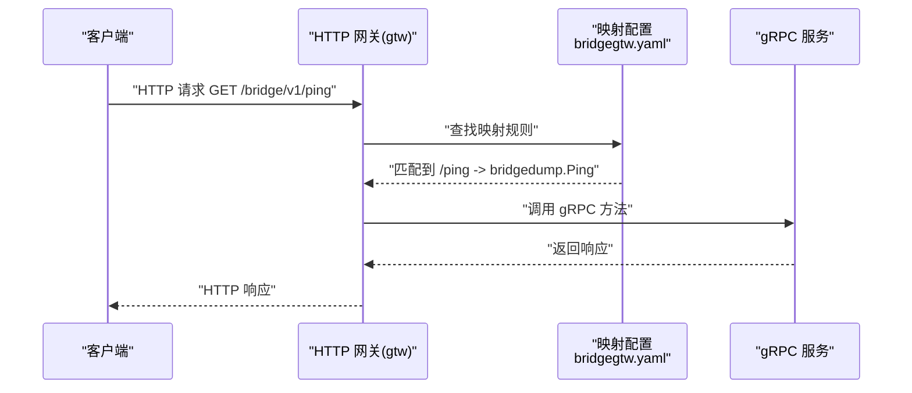
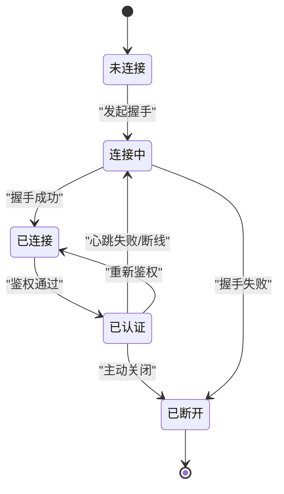
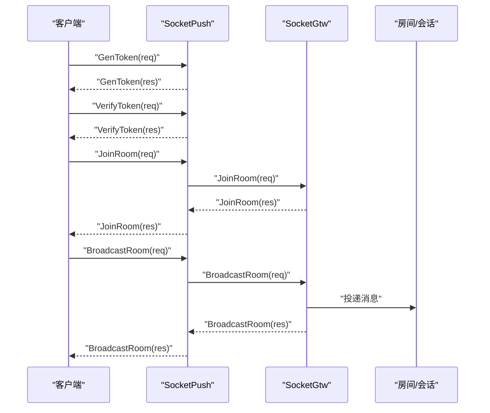
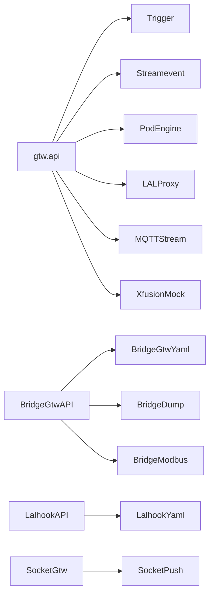

# API 参考

<cite>
**本文引用的文件**
- [app/bridgegtw/bridgegtw.api](file://app/bridgegtw/bridgegtw.api)
- [app/bridgegtw/etc/bridgegtw.yaml](file://app/bridgegtw/etc/bridgegtw.yaml)
- [app/bridgegtw/bridgegtw.go](file://app/bridgegtw/bridgegtw.go)
- [app/bridgedump/bridgedump.proto](file://app/bridgedump/bridgedump.proto)
- [app/bridgemodbus/bridgemodbus.proto](file://app/bridgemodbus/bridgemodbus.proto)
- [socketapp/socketgtw/socketgtw.proto](file://socketapp/socketgtw/socketgtw.proto)
- [socketapp/socketpush/socketpush.proto](file://socketapp/socketpush/socketpush.proto)
- [socketapp/socketpush/socketpush/socketpush_grpc.pb.go](file://socketapp/socketpush/socketpush/socketpush_grpc.pb.go)
- [common/wsx/client.go](file://common/wsx/client.go)
- [docs/socketiox-documentation.md](file://docs/socketiox-documentation.md)
- [gtw/gtw.api](file://gtw/gtw.api)
- [gtw/doc/base.api](file://gtw/doc/base.api)
- [app/lalhook/lalhook.api](file://app/lalhook/lalhook.api)
- [app/lalhook/etc/lalhook.yaml](file://app/lalhook/etc/lalhook.yaml)
- [.trae/skills/zero-skills/references/rest-api-patterns.md](file://.trae/skills/zero-skills/references/rest-api-patterns.md)
- [.trae/skills/zero-skills/troubleshooting/common-issues.md](file://.trae/skills/zero-skills/troubleshooting/common-issues.md)
- [swagger/trigger.swagger.json](file://swagger/trigger.swagger.json)
- [swagger/streamevent.swagger.json](file://swagger/streamevent.swagger.json)
- [swagger/podengine.swagger.json](file://swagger/podengine.swagger.json)
- [swagger/lalproxy.swagger.json](file://swagger/lalproxy.swagger.json)
- [swagger/mqttstream.swagger.json](file://swagger/mqttstream.swagger.json)
- [swagger/xfusionmock.swagger.json](file://swagger/xfusionmock.swagger.json)
- [swagger/iecstring.swagger.json](file://swagger/iecstring.swagger.json)
</cite>

## 目录
1. [简介](#简介)
2. [项目结构](#项目结构)
3. [核心组件](#核心组件)
4. [架构总览](#架构总览)
5. [详细组件分析](#详细组件分析)
6. [依赖关系分析](#依赖关系分析)
7. [性能考量](#性能考量)
8. [故障排查指南](#故障排查指南)
9. [结论](#结论)
10. [附录](#附录)

## 简介
本文件为 zero-service 的完整 API 参考，覆盖以下协议与能力：
- gRPC API：列举各服务的 RPC 方法、请求/响应消息体字段与典型用途
- HTTP API（RESTful）：基于 go-zero 的 api 定义，说明 URL 模式、HTTP 方法、请求体与返回体
- WebSocket API：连接流程、消息格式、事件模型与状态管理
- Socket API：Socket 网关与推送服务的协议、消息格式与状态统计
- 其他回调/网关：如 lalhook 的 HTTP 回调接口
- 版本管理与迁移：基于 API 定义与 Swagger 文档的演进建议
- 客户端实现与调试：最佳实践、性能优化与常见问题

## 项目结构
- gRPC 服务集中于 app/* 与 socketapp/* 下，以 .proto 定义服务与消息
- HTTP 网关通过 go-zero 的 api 定义与 YAML 上游映射，统一对外暴露 RESTful 接口
- WebSocket 客户端与服务端组件位于 common/wsx 与 socketapp/socketpush、socketapp/socketgtw
- Swagger 文档用于 RESTful API 的可视化与契约校验

```mermaid
graph TB
subgraph "HTTP 网关层"
GtwAPI["HTTP API 定义<br/>gtw/gtw.api"]
BridgeGtwAPI["桥接 HTTP 网关<br/>app/bridgegtw/bridgegtw.api"]
LalhookAPI["直播回调 HTTP API<br/>app/lalhook/lalhook.api"]
end
subgraph "gRPC 服务层"
Trigger["触发器服务<br/>trigger.proto"]
Streamevent["流事件服务<br/>streamevent.proto"]
PodEngine["容器引擎服务<br/>podengine.proto"]
LALProxy["直播代理服务<br/>lalproxy.proto"]
MQTTStream["MQTT 流服务<br/>mqttstream.proto"]
XfusionMock["模拟服务<br/>xfusionmock.proto"]
BridgeDump["桥接采集服务<br/>bridgedump.proto"]
BridgeModbus["桥接 Modbus 服务<br/>bridgemodbus.proto"]
SocketGtw["Socket 网关服务<br/>socketgtw.proto"]
SocketPush["Socket 推送服务<br/>socketpush.proto"]
end
subgraph "外部集成"
BridgeGtwYaml["桥接网关配置<br/>app/bridgegtw/etc/bridgegtw.yaml"]
LalhookYaml["直播回调配置<br/>app/lalhook/etc/lalhook.yaml"]
end
GtwAPI --> Trigger
GtwAPI --> Streamevent
GtwAPI --> PodEngine
GtwAPI --> LALProxy
GtwAPI --> MQTTStream
GtwAPI --> XfusionMock
BridgeGtwAPI --> BridgeGtwYaml
BridgeGtwAPI --> BridgeDump
BridgeGtwAPI --> BridgeModbus
LalhookAPI --> LalhookYaml
SocketGtw --> SocketPush
```

图表来源
- [gtw/gtw.api:1-123](file://gtw/gtw.api#L1-L123)
- [app/bridgegtw/bridgegtw.api:1-23](file://app/bridgegtw/bridgegtw.api#L1-L23)
- [app/lalhook/lalhook.api:1-280](file://app/lalhook/lalhook.api#L1-L280)
- [app/bridgegtw/etc/bridgegtw.yaml:1-40](file://app/bridgegtw/etc/bridgegtw.yaml#L1-L40)
- [app/lalhook/etc/lalhook.yaml:1-10](file://app/lalhook/etc/lalhook.yaml#L1-L10)

章节来源
- [gtw/gtw.api:1-123](file://gtw/gtw.api#L1-L123)
- [app/bridgegtw/bridgegtw.api:1-23](file://app/bridgegtw/bridgegtw.api#L1-L23)
- [app/lalhook/lalhook.api:1-280](file://app/lalhook/lalhook.api#L1-L280)
- [app/bridgegtw/etc/bridgegtw.yaml:1-40](file://app/bridgegtw/etc/bridgegtw.yaml#L1-L40)
- [app/lalhook/etc/lalhook.yaml:1-10](file://app/lalhook/etc/lalhook.yaml#L1-L10)

## 核心组件
- gRPC 服务
  - 触发器服务：计划任务、执行项、日志等管理
  - 流事件服务：事件推送、Kafka/MQTT/WebSocket 消息处理
  - 容器引擎服务：Pod 生命周期管理
  - 直播代理服务：拉流/推流、群组管理、状态查询
  - MQTT 流服务：MQTT 消息转发与追踪
  - 模拟服务：测试与演示场景
  - 桥接采集服务：电缆运行/故障/波形数据接入
  - 桥接 Modbus 服务：配置管理与寄存器/线圈读写
  - Socket 网关/推送服务：房间管理、广播、踢人、会话消息、统计
- HTTP 网关
  - go-zero API 定义 + YAML 映射，将 HTTP 请求路由到 gRPC 服务
- WebSocket
  - 客户端状态机、心跳、鉴权、断线重连与消息编解码
- 回调网关
  - lalhook 提供直播服务的 HTTP 回调接口，用于 onPub/onSub/onUpdate 等事件

章节来源
- [gtw/gtw.api:1-123](file://gtw/gtw.api#L1-L123)
- [app/bridgedump/bridgedump.proto:1-124](file://app/bridgedump/bridgedump.proto#L1-L124)
- [app/bridgemodbus/bridgemodbus.proto:1-355](file://app/bridgemodbus/bridgemodbus.proto#L1-L355)
- [socketapp/socketgtw/socketgtw.proto:1-149](file://socketapp/socketgtw/socketgtw.proto#L1-L149)
- [socketapp/socketpush/socketpush.proto:1-177](file://socketapp/socketpush/socketpush.proto#L1-L177)
- [common/wsx/client.go:834-894](file://common/wsx/client.go#L834-L894)

## 架构总览
下图展示 HTTP 网关如何将 RESTful 请求映射到 gRPC 服务，并结合 Socket 与 WebSocket 的交互。

图表来源
- [app/bridgegtw/bridgegtw.api:13-21](file://app/bridgegtw/bridgegtw.api#L13-L21)
- [app/bridgegtw/etc/bridgegtw.yaml:25-40](file://app/bridgegtw/etc/bridgegtw.yaml#L25-L40)
- [app/bridgegtw/bridgegtw.go:28-42](file://app/bridgegtw/bridgegtw.go#L28-L42)

章节来源
- [app/bridgegtw/bridgegtw.api:1-23](file://app/bridgegtw/bridgegtw.api#L1-L23)
- [app/bridgegtw/etc/bridgegtw.yaml:1-40](file://app/bridgegtw/etc/bridgegtw.yaml#L1-L40)
- [app/bridgegtw/bridgegtw.go:1-42](file://app/bridgegtw/bridgegtw.go#L1-L42)

## 详细组件分析

### gRPC API 参考

#### 触发器服务（trigger）
- 服务：Trigger
- 方法
  - 创建计划任务
  - 查询计划任务
  - 列表查询（活动/已完成/归档/待执行/调度中）
  - 执行项管理（查询、日志、仪表盘）
  - 计划批次管理（暂停/恢复/终止）
  - 任务执行（立即执行、回调）
  - 统计与历史
  - 清理与队列管理
- 请求/响应
  - 使用标准请求/响应消息体，字段涵盖任务 ID、计划时间、执行状态、日志等
- 典型用途
  - 定时任务编排、批量执行、可观测性与审计

章节来源
- [swagger/trigger.swagger.json](file://swagger/trigger.swagger.json)

#### 流事件服务（streamevent）
- 服务：StreamEvent
- 方法
  - Kafka 消息接收
  - MQTT 消息接收
  - WebSocket 消息接收
  - Socket 消息上送
  - 计划任务事件处理
- 请求/响应
  - 包含事件类型、主题、负载、时间戳等字段
- 典型用途
  - 实时事件汇聚与分发

章节来源
- [swagger/streamevent.swagger.json](file://swagger/streamevent.swagger.json)

#### 容器引擎服务（podengine）
- 服务：PodEngine
- 方法
  - 创建/删除/启动/停止/重启 Pod
  - 查询 Pod 详情与统计
  - 列出镜像与 Pods
- 请求/响应
  - 包含镜像名、标签、资源限制、状态等
- 典型用途
  - 边缘/本地容器化任务编排

章节来源
- [swagger/podengine.swagger.json](file://swagger/podengine.swagger.json)

#### 直播代理服务（lalproxy）
- 服务：LALProxy
- 方法
  - 添加/移除 IP 黑名单
  - 获取所有群组与群组信息
  - 启停 RTMP 推流与拉流
  - 启停 Relay 拉流
  - 获取 LAL 信息
- 请求/响应
  - 包含群组名、会话 ID、协议、码率、字节统计等
- 典型用途
  - 直播推拉流与转推

章节来源
- [swagger/lalproxy.swagger.json](file://swagger/lalproxy.swagger.json)

#### MQTT 流服务（mqttstream）
- 服务：MqttStream
- 方法
  - 发布消息（带追踪）
- 请求/响应
  - 包含主题、消息体、追踪 ID 等
- 典型用途
  - 设备消息上报与追踪

章节来源
- [swagger/mqttstream.swagger.json](file://swagger/mqttstream.swagger.json)

#### 模拟服务（xfusionmock）
- 服务：XFusionMock
- 方法
  - 用于测试与演示的模拟接口
- 请求/响应
  - 简化消息体，便于联调
- 典型用途
  - 服务对接与压测

章节来源
- [swagger/xfusionmock.swagger.json](file://swagger/xfusionmock.swagger.json)

#### 桥接采集服务（bridgedump）
- 服务：BridgeDumpRpc
- 方法
  - Ping
  - 电缆运行数据接入：CableWorkList
  - 电缆故障结果数据接入：CableFault
  - 电缆故障波形数据接入：CableFaultWave
- 请求/响应
  - 包含设备 ID、电流/电压、时间戳、波形数据等
- 典型用途
  - 电力巡检与故障分析

章节来源
- [app/bridgedump/bridgedump.proto:1-124](file://app/bridgedump/bridgedump.proto#L1-L124)

#### 桥接 Modbus 服务（bridgemodbus）
- 服务：BridgeModbus
- 方法
  - 配置管理：保存、删除、分页查询、按编码查询
  - Bit 访问：读取线圈/离散输入、写单/多线圈
  - 16 位寄存器访问：读取输入/保持寄存器、写单/多寄存器、读写多寄存器、屏蔽写寄存器、读 FIFO 队列
  - 设备标识：读取设备标识与特定对象
  - 批量十进制转寄存器
- 请求/响应
  - 包含地址、数量、值列表、寄存器格式、对象 ID 等
- 典型用途
  - 工业设备协议桥接与控制

章节来源
- [app/bridgemodbus/bridgemodbus.proto:1-355](file://app/bridgemodbus/bridgemodbus.proto#L1-L355)

#### Socket 网关服务（socketgtw）
- 服务：SocketGtw
- 方法
  - JoinRoom / LeaveRoom
  - BroadcastRoom / BroadcastGlobal
  - KickSession / KickMetaSession
  - SendToSession / SendToSessions
  - SendToMetaSession / SendToMetaSessions
  - SocketGtwStat
- 请求/响应
  - 包含 reqId、sId、room、event、payload、元数据键值等
- 典型用途
  - 实时消息网关与房间管理

章节来源
- [socketapp/socketgtw/socketgtw.proto:1-149](file://socketapp/socketgtw/socketgtw.proto#L1-L149)

#### Socket 推送服务（socketpush）
- 服务：SocketPush
- 方法
  - GenToken / VerifyToken
  - JoinRoom / LeaveRoom
  - BroadcastRoom / BroadcastGlobal
  - KickSession / KickMetaSession
  - SendToSession / SendToSessions
  - SendToMetaSession / SendToMetaSessions
  - SocketGtwStat
- 请求/响应
  - 包含 token、过期时间、会话统计等
- 典型用途
  - 客户端鉴权与消息推送

章节来源
- [socketapp/socketpush/socketpush.proto:1-177](file://socketapp/socketpush/socketpush.proto#L1-L177)
- [socketapp/socketpush/socketpush/socketpush_grpc.pb.go:240-267](file://socketapp/socketpush/socketpush/socketpush_grpc.pb.go#L240-L267)

### HTTP API（RESTful）参考

#### go-zero 网关服务（gtw）
- 服务组：gtw、pay、user、common、file
- 常用接口
  - GET /ping
  - POST /forward
  - GET /mfs/downloadFile
  - POST /wechat/paidNotify
  - POST /wechat/refundedNotify
  - POST /login
  - POST /miniProgramLogin
  - POST /sendSMSVerifyCode
  - GET /getCurrentUser
  - POST /editCurrentUser
  - POST /getRegionList
  - POST /mfs/uploadFile
  - POST /oss/endpoint/putFile
  - POST /oss/endpoint/putChunkFile
  - POST /oss/endpoint/putStreamFile
  - POST /oss/endpoint/signUrl
  - POST /oss/endpoint/statFile
- 请求头与内容类型
  - JSON 请求需设置 Content-Type: application/json
  - 表单上传需设置 Content-Type: multipart/form-data 或 application/x-www-form-urlencoded
- 典型用途
  - 用户认证、文件存储、微信支付回调、通用公共接口

章节来源
- [gtw/gtw.api:1-123](file://gtw/gtw.api#L1-L123)
- [gtw/doc/base.api:1-51](file://gtw/doc/base.api#L1-L51)
- [.trae/skills/zero-skills/references/rest-api-patterns.md:197-262](file://.trae/skills/zero-skills/references/rest-api-patterns.md#L197-L262)

#### 桥接 HTTP 网关（bridgegtw）
- 服务组：bridgeGtw
- 接口
  - GET /bridge/v1/ping
- 映射规则
  - 将 HTTP 请求映射到 gRPC 服务方法（如 bridgedump.Ping）

章节来源
- [app/bridgegtw/bridgegtw.api:1-23](file://app/bridgegtw/bridgegtw.api#L1-L23)
- [app/bridgegtw/etc/bridgegtw.yaml:25-40](file://app/bridgegtw/etc/bridgegtw.yaml#L25-L40)

#### 直播回调 HTTP API（lalhook）
- 服务组：webhook、api
- 回调事件
  - onUpdate / onPubStart / onPubStop / onSubStart / onSubStop / onRelayPullStart / onRelayPullStop / onRtmpConnect / onServerStart / onHlsMakeTs
- 查询接口
  - POST /v1/api/ts/list
- 典型用途
  - 直播事件订阅与 TS 文件查询

章节来源
- [app/lalhook/lalhook.api:1-280](file://app/lalhook/lalhook.api#L1-L280)
- [app/lalhook/etc/lalhook.yaml:1-10](file://app/lalhook/etc/lalhook.yaml#L1-L10)

### WebSocket API 参考

#### 连接与状态管理
- 连接建立
  - 客户端发起 WebSocket 连接，携带鉴权信息（如 token）
- 状态机
  - 运行中/已认证/断开等状态，支持原子状态检查
- 断线重连
  - 自动重连、令牌刷新、优雅关闭
- 关闭流程
  - 发送 CloseMessage，清理定时器与 goroutine，最终状态通知

图表来源
- [common/wsx/client.go:834-894](file://common/wsx/client.go#L834-L894)

章节来源
- [common/wsx/client.go:834-894](file://common/wsx/client.go#L834-L894)

#### 消息格式与事件模型
- 请求消息
  - 包含事件名、载荷、reqId 等
- 响应消息
  - 包含状态码、描述、业务数据、reqId
- 房间操作
  - 加入/离开房间，支持按元数据筛选

章节来源
- [docs/socketiox-documentation.md:99-192](file://docs/socketiox-documentation.md#L99-L192)

### Socket API 参考

#### Socket 网关与推送服务
- SocketGtw 与 SocketPush 提供一致的消息 API，包括：
  - 房间管理：JoinRoom、LeaveRoom
  - 广播：BroadcastRoom、BroadcastGlobal
  - 会话管理：KickSession、KickMetaSession
  - 单发/批量：SendToSession、SendToSessions、SendToMetaSession、SendToMetaSessions
  - 统计：SocketGtwStat（单节点/全局）
- Token 管理
  - GenToken、VerifyToken 支持鉴权与过期策略

图表来源
- [socketapp/socketpush/socketpush.proto:9-36](file://socketapp/socketpush/socketpush.proto#L9-L36)
- [socketapp/socketgtw/socketgtw.proto:9-32](file://socketapp/socketgtw/socketgtw.proto#L9-L32)

章节来源
- [socketapp/socketpush/socketpush.proto:1-177](file://socketapp/socketpush/socketpush.proto#L1-L177)
- [socketapp/socketgtw/socketgtw.proto:1-149](file://socketapp/socketgtw/socketgtw.proto#L1-L149)

## 依赖关系分析

图表来源
- [gtw/gtw.api:1-123](file://gtw/gtw.api#L1-L123)
- [app/bridgegtw/bridgegtw.api:1-23](file://app/bridgegtw/bridgegtw.api#L1-L23)
- [app/lalhook/lalhook.api:1-280](file://app/lalhook/lalhook.api#L1-L280)
- [app/bridgegtw/etc/bridgegtw.yaml:1-40](file://app/bridgegtw/etc/bridgegtw.yaml#L1-L40)
- [app/lalhook/etc/lalhook.yaml:1-10](file://app/lalhook/etc/lalhook.yaml#L1-L10)

章节来源
- [gtw/gtw.api:1-123](file://gtw/gtw.api#L1-L123)
- [app/bridgegtw/bridgegtw.api:1-23](file://app/bridgegtw/bridgegtw.api#L1-L23)
- [app/lalhook/lalhook.api:1-280](file://app/lalhook/lalhook.api#L1-L280)
- [app/bridgegtw/etc/bridgegtw.yaml:1-40](file://app/bridgegtw/etc/bridgegtw.yaml#L1-L40)
- [app/lalhook/etc/lalhook.yaml:1-10](file://app/lalhook/etc/lalhook.yaml#L1-L10)

## 性能考量
- HTTP 网关
  - 合理设置超时与并发，避免阻塞下游 gRPC 服务
  - 使用中间件进行限流、CORS、鉴权
- gRPC 服务
  - 控制消息体大小，避免大对象频繁传输
  - 使用流式 RPC 处理大数据（如文件分片）
- WebSocket
  - 合理的心跳间隔与重连退避策略
  - 采用批量消息与压缩减少带宽占用
- Socket API
  - 广播前进行房间/会话过滤，避免无效投递
  - 统计接口用于容量评估与告警

## 故障排查指南
- 常见 HTTP 问题
  - 404：检查 API 前缀与路由注册
  - 请求体未解析：确保 Content-Type 正确
- gRPC 未实现方法
  - 若出现“方法未实现”，检查服务端是否正确实现对应 RPC
- WebSocket
  - 连接失败：确认握手参数、鉴权与网络连通性
  - 断线：检查心跳与重连逻辑
- Socket API
  - 房间/会话异常：核对 reqId 与 sId，确认鉴权与权限

章节来源
- [.trae/skills/zero-skills/troubleshooting/common-issues.md:212-274](file://.trae/skills/zero-skills/troubleshooting/common-issues.md#L212-L274)
- [socketapp/socketpush/socketpush/socketpush_grpc.pb.go:240-267](file://socketapp/socketpush/socketpush/socketpush_grpc.pb.go#L240-L267)
- [common/wsx/client.go:834-894](file://common/wsx/client.go#L834-L894)

## 结论
本参考文档系统梳理了 zero-service 的 gRPC、HTTP、WebSocket 与 Socket API，提供了接口定义、消息格式、典型用法与故障排查建议。建议在生产环境中结合 Swagger 文档进行契约校验，并遵循中间件与安全最佳实践。

## 附录

### API 版本管理与迁移
- 建议
  - 以目录/版本号区分 API，如 gtw/v1、bridge/v1
  - 保持向后兼容，新增字段使用可选语义
  - 通过 Swagger 文档记录变更与废弃策略
- 参考
  - Swagger 文档可用于契约验证与自动化测试

章节来源
- [gtw/gtw.api:1-123](file://gtw/gtw.api#L1-L123)
- [app/bridgegtw/bridgegtw.api:1-23](file://app/bridgegtw/bridgegtw.api#L1-L23)
- [swagger/trigger.swagger.json](file://swagger/trigger.swagger.json)
- [swagger/streamevent.swagger.json](file://swagger/streamevent.swagger.json)
- [swagger/podengine.swagger.json](file://swagger/podengine.swagger.json)
- [swagger/lalproxy.swagger.json](file://swagger/lalproxy.swagger.json)
- [swagger/mqttstream.swagger.json](file://swagger/mqttstream.swagger.json)
- [swagger/xfusionmock.swagger.json](file://swagger/xfusionmock.swagger.json)

### 客户端实现与调试
- 客户端实现
  - HTTP：使用 Content-Type 与鉴权头，遵循 API 定义
  - gRPC：使用生成的 pb.go 客户端，注意超时与重试
  - WebSocket：遵循状态机与消息格式，实现心跳与重连
  - Socket：先 GenToken/VerifyToken，再 JoinRoom/Broadcast
- 性能优化
  - 合理批量化与压缩
  - 降低不必要的广播与查询
- 调试工具
  - Swagger 在线文档
  - 日志与链路追踪
  - 中间件与限流策略

章节来源
- [.trae/skills/zero-skills/references/rest-api-patterns.md:197-262](file://.trae/skills/zero-skills/references/rest-api-patterns.md#L197-L262)
- [common/wsx/client.go:834-894](file://common/wsx/client.go#L834-L894)