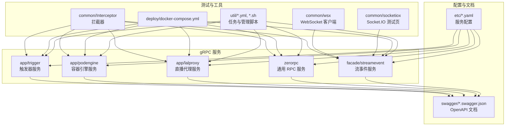
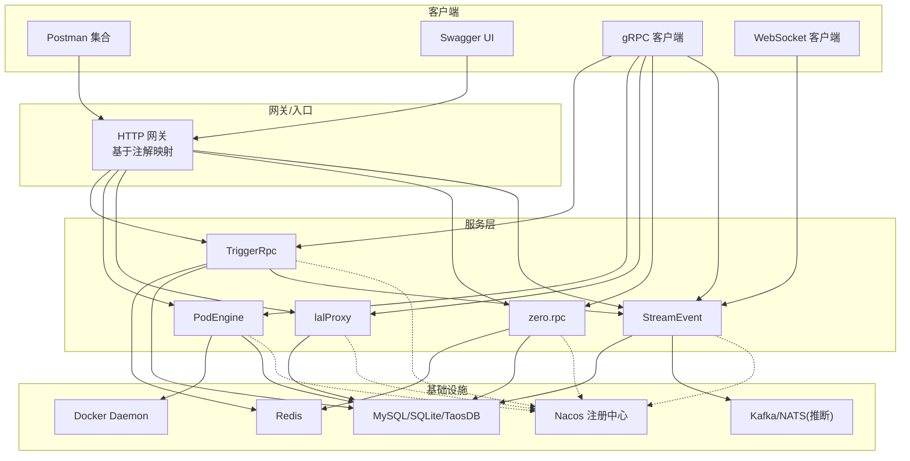
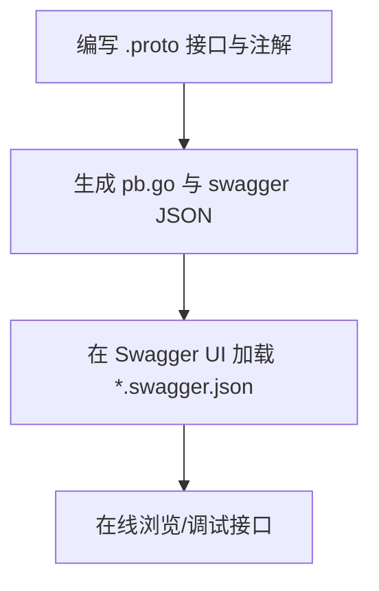
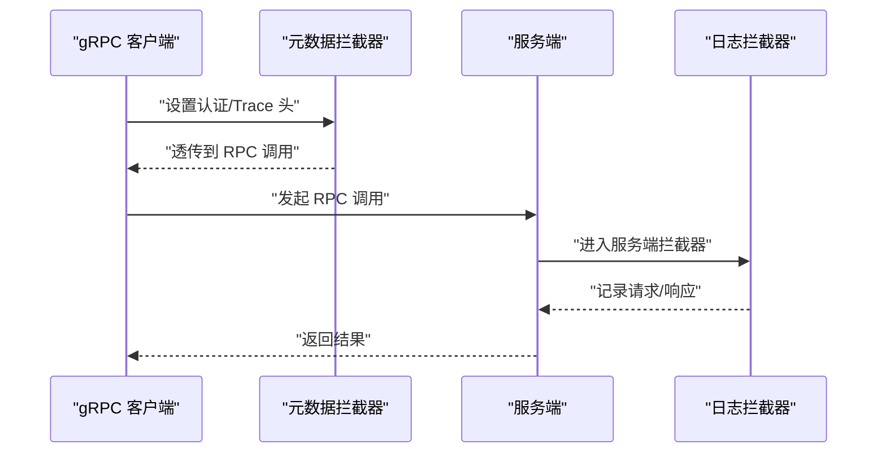
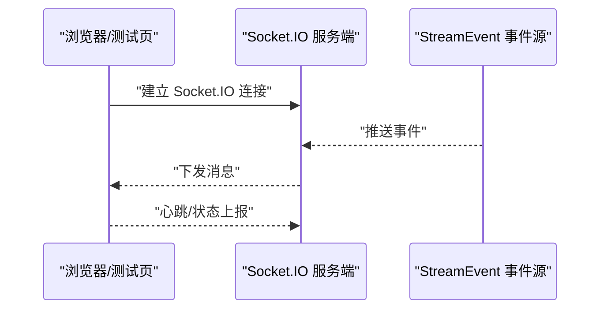
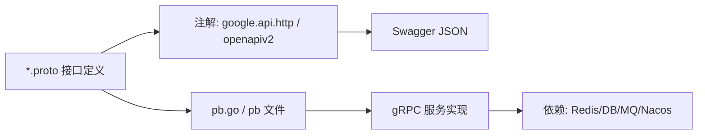

# API 测试与调试

<cite>
**本文引用的文件**
- [trigger.yaml](file://app/trigger/etc/trigger.yaml)
- [podengine.yaml](file://app/podengine/etc/podengine.yaml)
- [lalproxy.yaml](file://app/lalproxy/etc/lalproxy.yaml)
- [zerorpc.yaml](file://zerorpc/etc/zerorpc.yaml)
- [streamevent.yaml](file://facade/streamevent/etc/streamevent.yaml)
- [trigger.swagger.json](file://swagger/trigger.swagger.json)
- [podengine.swagger.json](file://swagger/podengine.swagger.json)
- [lalproxy.swagger.json](file://swagger/lalproxy.swagger.json)
- [streamevent.swagger.json](file://swagger/streamevent.swagger.json)
- [trigger.proto](file://app/trigger/trigger.proto)
- [podengine.proto](file://app/podengine/podengine.proto)
- [lalproxy.proto](file://app/lalproxy/lalproxy.proto)
- [zerorpc.proto](file://zerorpc/zerorpc.proto)
- [streamevent.proto](file://facade/streamevent/streamevent.proto)
- [openapiv2.proto](file://third_party/protoc-gen-openapiv2/options/openapiv2.proto)
- [http.proto](file://third_party/google/api/http.proto)
- [metadataInterceptor.go](file://common/Interceptor/rpcclient/metadataInterceptor.go)
- [loggerInterceptor.go](file://common/Interceptor/rpcserver/loggerInterceptor.go)
- [client.go](file://common/wsx/client.go)
- [test-socketio.html](file://common/socketiox/test-socketio.html)
- [docker-compose.yml](file://deploy/docker-compose.yml)
- [Taskfile.yml](file://util/Taskfile.yml)
- [Taskfile-docker.yml](file://util/Taskfile-docker.yml)
- [Taskfile-135.yml](file://util/Taskfile-135.yml)
- [manage.sh](file://util/manage.sh)
- [config-sh.yaml](file://util/config-sh.yaml)
- [config.yaml](file://util/config.yaml)
- [main.go](file://util/main.go)
- [overview.md](file://.trae/skills/zero-skills/references/overview.md)
- [rest-api-patterns.md](file://.trae/skills/zero-skills/references/rest-api-patterns.md)
- [rpc-patterns.md](file://.trae/skills/zero-skills/references/rpc-patterns.md)
- [common-issues.md](file://.trae/skills/zero-skills/troubleshooting/common-issues.md)
</cite>

## 目录
1. [简介](#简介)
2. [项目结构](#项目结构)
3. [核心组件](#核心组件)
4. [架构总览](#架构总览)
5. [详细组件分析](#详细组件分析)
6. [依赖关系分析](#依赖关系分析)
7. [性能考虑](#性能考虑)
8. [故障排查指南](#故障排查指南)
9. [结论](#结论)
10. [附录](#附录)

## 简介
本指南面向 zero-service 的 API 测试与调试场景，覆盖 gRPC 服务、HTTP 映射（通过注解生成）、Swagger 文档浏览、Postman 集成、WebSocket 连接测试、日志与性能分析、以及自动化与持续集成实践。文档以仓库中实际存在的配置、协议与工具为依据，提供可操作的步骤与图示。

## 项目结构
- 各子服务均采用统一的配置风格，集中在 etc 目录下，便于本地与容器化部署。
- Swagger 文档由 proto 注解与 OpenAPI 生成器产出，位于 swagger 目录。
- gRPC 服务通过 .proto 文件定义接口，配合生成的 pb.go 与 pb 文件在各应用中使用。
- 常用测试与调试工具分布在 common 工具包与 util 脚本中。

图表来源
- [trigger.yaml:1-37](file://app/trigger/etc/trigger.yaml#L1-L37)
- [podengine.yaml:1-20](file://app/podengine/etc/podengine.yaml#L1-L20)
- [lalproxy.yaml:1-19](file://app/lalproxy/etc/lalproxy.yaml#L1-L19)
- [zerorpc.yaml:1-39](file://zerorpc/etc/zerorpc.yaml#L1-L39)
- [streamevent.yaml:1-28](file://facade/streamevent/etc/streamevent.yaml#L1-L28)
- [trigger.swagger.json:1-50](file://swagger/trigger.swagger.json#L1-L50)
- [podengine.swagger.json:1-50](file://swagger/podengine.swagger.json#L1-L50)
- [lalproxy.swagger.json:1-50](file://swagger/lalproxy.swagger.json#L1-L50)
- [streamevent.swagger.json:1-50](file://swagger/streamevent.swagger.json#L1-L50)

章节来源
- [trigger.yaml:1-37](file://app/trigger/etc/trigger.yaml#L1-L37)
- [podengine.yaml:1-20](file://app/podengine/etc/podengine.yaml#L1-L20)
- [lalproxy.yaml:1-19](file://app/lalproxy/etc/lalproxy.yaml#L1-L19)
- [zerorpc.yaml:1-39](file://zerorpc/etc/zerorpc.yaml#L1-L39)
- [streamevent.yaml:1-28](file://facade/streamevent/etc/streamevent.yaml#L1-L28)

## 核心组件
- 触发器服务（TriggerRpc）：监听端口并配置 Redis、数据库与 StreamEvent 通道。
- 容器引擎服务（PodEngine）：提供容器生命周期管理能力，连接 Docker。
- 直播代理服务（lalProxy）：媒体流代理，连接数据库。
- 通用 RPC 服务（zero.rpc）：用户、鉴权、短信等通用能力。
- 流事件服务（StreamEvent）：事件推送与存储，含中间件统计配置。

章节来源
- [trigger.yaml:1-37](file://app/trigger/etc/trigger.yaml#L1-L37)
- [podengine.yaml:1-20](file://app/podengine/etc/podengine.yaml#L1-L20)
- [lalproxy.yaml:1-19](file://app/lalproxy/etc/lalproxy.yaml#L1-L19)
- [zerorpc.yaml:1-39](file://zerorpc/etc/zerorpc.yaml#L1-L39)
- [streamevent.yaml:1-28](file://facade/streamevent/etc/streamevent.yaml#L1-L28)

## 架构总览
下图展示服务间通信与外部依赖关系，包括 gRPC、HTTP 映射、消息队列与数据库。

图表来源
- [trigger.yaml:1-37](file://app/trigger/etc/trigger.yaml#L1-L37)
- [podengine.yaml:1-20](file://app/podengine/etc/podengine.yaml#L1-L20)
- [lalproxy.yaml:1-19](file://app/lalproxy/etc/lalproxy.yaml#L1-L19)
- [zerorpc.yaml:1-39](file://zerorpc/etc/zerorpc.yaml#L1-L39)
- [streamevent.yaml:1-28](file://facade/streamevent/etc/streamevent.yaml#L1-L28)

## 详细组件分析

### Swagger UI 使用与 API 文档浏览
- 生成机制：通过 proto 注解与 OpenAPI 生成器，将 .proto 中的 google.api.http 与 openapiv2 选项转换为 Swagger JSON。
- 文档位置：swagger 目录下的 *.swagger.json 文件。
- 访问方式：在支持 OpenAPI 的环境中加载对应 JSON 文件即可查看接口定义与参数说明。

图表来源
- [openapiv2.proto:1-143](file://third_party/protoc-gen-openapiv2/options/openapiv2.proto#L1-L143)
- [http.proto:42-265](file://third_party/google/api/http.proto#L42-L265)
- [trigger.swagger.json:1-50](file://swagger/trigger.swagger.json#L1-L50)
- [podengine.swagger.json:1-50](file://swagger/podengine.swagger.json#L1-L50)
- [lalproxy.swagger.json:1-50](file://swagger/lalproxy.swagger.json#L1-L50)
- [streamevent.swagger.json:1-50](file://swagger/streamevent.swagger.json#L1-L50)

章节来源
- [openapiv2.proto:1-143](file://third_party/protoc-gen-openapiv2/options/openapiv2.proto#L1-L143)
- [http.proto:42-265](file://third_party/google/api/http.proto#L42-L265)
- [trigger.swagger.json:1-50](file://swagger/trigger.swagger.json#L1-L50)
- [podengine.swagger.json:1-50](file://swagger/podengine.swagger.json#L1-L50)
- [lalproxy.swagger.json:1-50](file://swagger/lalproxy.swagger.json#L1-L50)
- [streamevent.swagger.json:1-50](file://swagger/streamevent.swagger.json#L1-L50)

### Postman 集成与批量测试
- 导入步骤：在 Postman 中选择“Import”，导入 swagger 目录中的 *.swagger.json 文件，系统会解析并生成集合。
- 环境配置：根据各服务的 etc/*.yaml 设置对应的环境变量（如服务地址、鉴权头、超时等）。
- 批量执行：利用 Postman Collection Runner 或 Newman（命令行）进行批量测试。

章节来源
- [trigger.yaml:1-37](file://app/trigger/etc/trigger.yaml#L1-L37)
- [podengine.yaml:1-20](file://app/podengine/etc/podengine.yaml#L1-L20)
- [lalproxy.yaml:1-19](file://app/lalproxy/etc/lalproxy.yaml#L1-L19)
- [zerorpc.yaml:1-39](file://zerorpc/etc/zerorpc.yaml#L1-L39)
- [streamevent.yaml:1-28](file://facade/streamevent/etc/streamevent.yaml#L1-L28)

### gRPC 客户端测试
- 客户端工具：可使用官方 grpcurl 或自研 gRPC 客户端进行调用。
- 元数据与拦截器：在客户端侧可通过元数据拦截器注入认证信息；在服务端通过日志拦截器输出请求上下文，便于调试。
- 示例流程：先查询服务可用性（Ping），再执行具体业务逻辑。

图表来源
- [metadataInterceptor.go](file://common/Interceptor/rpcclient/metadataInterceptor.go)
- [loggerInterceptor.go](file://common/Interceptor/rpcserver/loggerInterceptor.go)

章节来源
- [metadataInterceptor.go](file://common/Interceptor/rpcclient/metadataInterceptor.go)
- [loggerInterceptor.go](file://common/Interceptor/rpcserver/loggerInterceptor.go)

### HTTP 请求模拟（基于 gRPC-Web/网关）
- 映射规则：通过 google.api.http 注解将 gRPC 方法映射为 REST 风格的 HTTP 接口。
- 使用建议：优先使用 Swagger UI 在线调试；若需批量或自动化，结合 Postman 或 curl。

章节来源
- [http.proto:42-265](file://third_party/google/api/http.proto#L42-L265)

### WebSocket 连接测试
- 测试页面：common/socketiox/test-socketio.html 提供 Socket.IO 连接测试页面。
- 流事件服务：facade/streamevent 提供事件推送能力，适合验证实时消息链路。

图表来源
- [test-socketio.html](file://common/socketiox/test-socketio.html)
- [streamevent.yaml:1-28](file://facade/streamevent/etc/streamevent.yaml#L1-L28)

章节来源
- [test-socketio.html](file://common/socketiox/test-socketio.html)
- [streamevent.yaml:1-28](file://facade/streamevent/etc/streamevent.yaml#L1-L28)

### 日志分析与性能监控
- 日志级别与路径：各服务在 etc/*.yaml 中配置日志编码、路径与级别，便于定位问题。
- 中间件统计：StreamEvent 配置了忽略特定方法的统计，有助于降低噪声。
- 性能建议：结合服务端日志拦截器输出的请求上下文，定位慢调用与异常路径。

章节来源
- [trigger.yaml:5-11](file://app/trigger/etc/trigger.yaml#L5-L11)
- [podengine.yaml:5-10](file://app/podengine/etc/podengine.yaml#L5-L10)
- [lalproxy.yaml:4-9](file://app/lalproxy/etc/lalproxy.yaml#L4-L9)
- [zerorpc.yaml:9-12](file://zerorpc/etc/zerorpc.yaml#L9-L12)
- [streamevent.yaml:11-13](file://facade/streamevent/etc/streamevent.yaml#L11-L13)

### 自动化测试与持续集成
- 任务编排：util/Taskfile*.yml 提供构建、测试、部署等任务模板。
- 管理脚本：util/manage.sh 提供一键式服务启停与状态检查。
- 编排：deploy/docker-compose.yml 支持多服务编排，便于本地联调。
- 建议：在 CI 中复用 Taskfile 任务，结合 Postman/Newman 执行 API 测试套件。

章节来源
- [Taskfile.yml](file://util/Taskfile.yml)
- [Taskfile-docker.yml](file://util/Taskfile-docker.yml)
- [Taskfile-135.yml](file://util/Taskfile-135.yml)
- [manage.sh](file://util/manage.sh)
- [docker-compose.yml](file://deploy/docker-compose.yml)

## 依赖关系分析
- 协议与注解：gRPC 接口定义与 HTTP 映射由 .proto 文件与 google.api.http/openapiv2 注解共同决定。
- 服务发现与注册：部分服务配置了 Nacos 注册中心参数，用于服务治理。
- 数据存储：不同服务连接不同的数据库（MySQL、SQLite、TaosDB），注意迁移与兼容性。
- 消息通道：触发器服务与流事件服务之间存在事件通道配置，确保异步解耦。

图表来源
- [trigger.proto](file://app/trigger/trigger.proto)
- [podengine.proto](file://app/podengine/podengine.proto)
- [lalproxy.proto](file://app/lalproxy/lalproxy.proto)
- [zerorpc.proto](file://zerorpc/zerorpc.proto)
- [streamevent.proto](file://facade/streamevent/streamevent.proto)
- [openapiv2.proto:1-143](file://third_party/protoc-gen-openapiv2/options/openapiv2.proto#L1-L143)
- [http.proto:42-265](file://third_party/google/api/http.proto#L42-L265)

章节来源
- [trigger.proto](file://app/trigger/trigger.proto)
- [podengine.proto](file://app/podengine/podengine.proto)
- [lalproxy.proto](file://app/lalproxy/lalproxy.proto)
- [zerorpc.proto](file://zerorpc/zerorpc.proto)
- [streamevent.proto](file://facade/streamevent/streamevent.proto)

## 性能考虑
- 超时与并发：各服务在配置中设置了超时时间，建议在压测时逐步调整并观察失败率与延迟分布。
- 中间件统计：对高频接口启用忽略统计，减少开销。
- 缓存与数据库：合理使用 Redis 缓存热点数据，避免数据库抖动。
- 网络与序列化：gRPC 通常优于 HTTP/JSON，在高吞吐场景优先使用原生 gRPC 客户端。

## 故障排查指南
- 常见问题：参考技能库中的常见问题文档，涵盖启动失败、连接异常、鉴权失败等场景。
- 配置核对：确认各服务 ListenOn、Redis、DB、Nacos 参数是否正确。
- 日志定位：结合服务端日志拦截器输出，快速定位请求路径与异常堆栈。
- 端到端验证：先用 Ping 接口验证连通性，再逐步深入业务接口。

章节来源
- [common-issues.md](file://.trae/skills/zero-skills/troubleshooting/common-issues.md)

## 结论
本指南基于仓库内现有配置与工具，提供了从 Swagger 文档浏览、Postman 集成、gRPC/HTTP/WebSocket 测试，到日志与性能分析、自动化与 CI 的完整实践路径。建议在本地使用 docker-compose 快速拉起全链路环境，再结合 Postman 与 Swagger UI 进行接口验证，并通过 Taskfile 与 manage.sh 实现一键化运维与回归测试。

## 附录

### API 参考与规范
- REST 接口风格与最佳实践可参考技能库中的 REST 与 RPC 模式文档。
- 项目概览与技能说明可参阅 overview 与技能文档。

章节来源
- [rest-api-patterns.md](file://.trae/skills/zero-skills/references/rest-api-patterns.md)
- [rpc-patterns.md](file://.trae/skills/zero-skills/references/rpc-patterns.md)
- [overview.md](file://.trae/skills/zero-skills/references/overview.md)