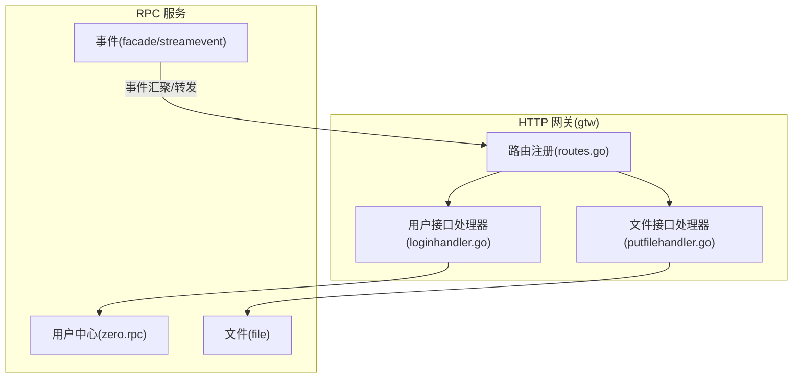
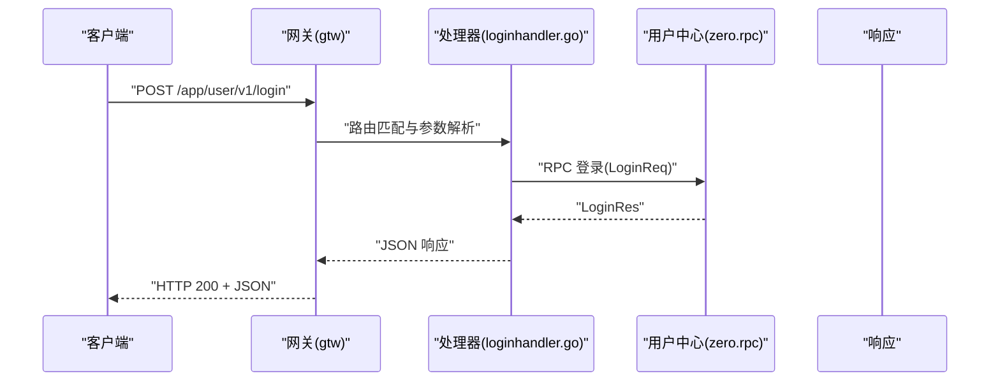
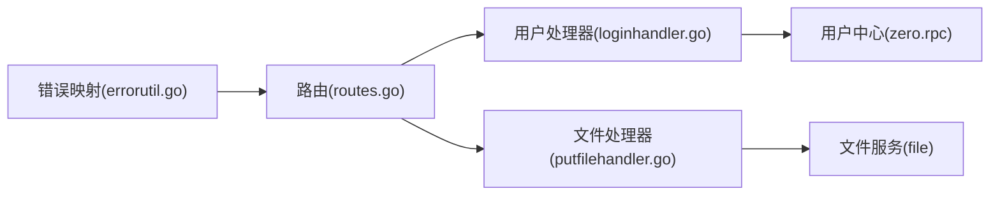
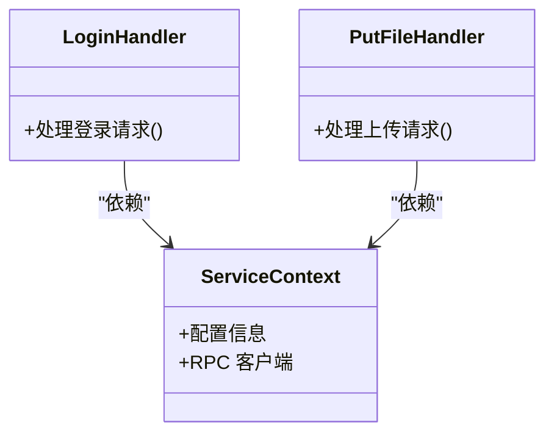

# HTTP RESTful API

<cite>
**本文引用的文件**
- [gtw.api](file://gtw/gtw.api)
- [routes.go](file://gtw/internal/handler/routes.go)
- [gtw.yaml](file://gtw/etc/gtw.yaml)
- [zerorpc.proto](file://zerorpc/zerorpc.proto)
- [loginhandler.go](file://gtw/internal/handler/user/loginhandler.go)
- [putfilehandler.go](file://gtw/internal/handler/file/putfilehandler.go)
- [errorutil.go](file://common/tool/errorutil.go)
- [ctxData.go](file://common/ctxdata/ctxData.go)
- [streameventserver.go](file://facade/streamevent/internal/server/streameventserver.go)
- [routes.go](file://zerorpc/internal/task/routes.go)
</cite>

## 目录
1. [简介](#简介)
2. [项目结构](#项目结构)
3. [核心组件](#核心组件)
4. [架构总览](#架构总览)
5. [详细组件分析](#详细组件分析)
6. [依赖分析](#依赖分析)
7. [性能考虑](#性能考虑)
8. [故障排查指南](#故障排查指南)
9. [结论](#结论)
10. [附录](#附录)

## 简介
本文件为 zero-service 的 HTTP RESTful API 完整文档，覆盖以下内容：
- 所有 HTTP 接口的 URL 模式、HTTP 方法、请求头与响应格式
- 路由配置、中间件处理与请求验证规则
- 文件上传、下载与管理接口规范
- 用户认证、权限控制与会话管理
- 错误响应格式、状态码含义与异常处理策略
- CORS、缓存策略与安全头设置建议
- 提供 curl 命令示例与 Postman 集合导入方法

## 项目结构
本项目采用多模块微服务架构，HTTP RESTful API 主要由网关服务 gtw 提供，内部通过路由注册统一暴露接口，并在需要时转发到其他 RPC 服务（如用户中心 zerorpc、文件服务 file 等）。关键目录与职责如下：
- gtw：HTTP 网关，负责路由注册、鉴权、请求解析与响应封装
- zerorpc：用户中心 RPC 服务，提供登录、用户信息、短信验证码等能力
- file：文件服务 RPC 服务，提供 OSS 上传、签名、统计等能力
- common：通用工具库，包括错误码映射、上下文数据传递等

图表来源
- [routes.go:20-160](file://gtw/internal/handler/routes.go#L20-L160)
- [loginhandler.go:14-30](file://gtw/internal/handler/user/loginhandler.go#L14-L30)
- [putfilehandler.go:13-29](file://gtw/internal/handler/file/putfilehandler.go#L13-L29)

章节来源
- [routes.go:20-160](file://gtw/internal/handler/routes.go#L20-L160)
- [gtw.api:16-123](file://gtw/gtw.api#L16-L123)
- [gtw.yaml:1-61](file://gtw/etc/gtw.yaml#L1-L61)

## 核心组件
- 网关路由注册：集中注册各模块接口，支持前缀分组与超时配置
- 用户接口：登录、小程序登录、发送短信验证码、获取/编辑用户信息
- 文件接口：上传文件、块文件上传、流式上传、签名 URL、统计文件信息
- 支付通知：微信支付/退款回调
- RPC 转发：将用户与文件相关请求转发至对应 RPC 服务
- 中间件：JWT 鉴权、日志、超时控制
- 错误处理：基于扩展错误码映射 HTTP 状态码

章节来源
- [routes.go:20-160](file://gtw/internal/handler/routes.go#L20-L160)
- [gtw.api:16-123](file://gtw/gtw.api#L16-L123)
- [zerorpc.proto:74-122](file://zerorpc/zerorpc.proto#L74-L122)

## 架构总览
HTTP 请求从客户端进入 gtw 网关，根据路由前缀匹配到对应处理器；处理器解析请求、进行鉴权与参数校验，必要时调用 RPC 服务，最后返回统一 JSON 响应。

图表来源
- [routes.go:118-140](file://gtw/internal/handler/routes.go#L118-L140)
- [loginhandler.go:14-30](file://gtw/internal/handler/user/loginhandler.go#L14-L30)
- [zerorpc.proto:74-84](file://zerorpc/zerorpc.proto#L74-L84)

## 详细组件分析

### 路由与接口清单
- 基础健康检查
  - GET /gtw/v1/ping
  - 功能：心跳检测
  - 鉴权：无需
- 网关转发
  - POST /gtw/v1/forward
  - 功能：请求转发
  - 鉴权：无需
- 用户登录
  - POST /app/user/v1/login
  - 功能：账号密码/验证码登录
  - 鉴权：无需
- 小程序登录
  - POST /app/user/v1/miniProgramLogin
  - 功能：小程序一键登录
  - 鉴权：无需
- 发送短信验证码
  - POST /app/user/v1/sendSMSVerifyCode
  - 功能：发送手机验证码
  - 鉴权：无需
- 获取用户信息
  - GET /app/user/v1/getCurrentUser
  - 功能：获取当前用户信息
  - 鉴权：JWT
- 编辑当前用户信息
  - POST /app/user/v1/editCurrentUser
  - 功能：修改当前用户资料
  - 鉴权：JWT
- 获取区域列表
  - POST /app/common/v1/getRegionList
  - 功能：获取行政区划列表
  - 鉴权：无需
- 上传文件
  - POST /app/common/v1/mfs/uploadFile
  - 功能：上传文件（MFS）
  - 鉴权：无需
- 下载文件
  - GET /gtw/v1/mfs/downloadFile
  - 功能：下载文件（MFS）
  - 鉴权：无需
- OSS 上传/管理
  - POST /file/v1/oss/endpoint/putFile
  - POST /file/v1/oss/endpoint/putChunkFile
  - POST /file/v1/oss/endpoint/putStreamFile
  - POST /file/v1/oss/endpoint/signUrl
  - POST /file/v1/oss/endpoint/statFile
  - 功能：OSS 文件上传、签名、统计
  - 鉴权：无需（签名 URL 由服务端生成）
- 支付通知
  - POST /gtw/v1/wechat/paidNotify
  - POST /gtw/v1/wechat/refundedNotify
  - 功能：微信支付/退款回调
  - 鉴权：无需

章节来源
- [gtw.api:16-123](file://gtw/gtw.api#L16-L123)
- [routes.go:20-160](file://gtw/internal/handler/routes.go#L20-L160)
- [gtw.yaml:47-61](file://gtw/etc/gtw.yaml#L47-L61)

### 请求与响应规范

- 通用请求头
  - Content-Type：application/json
  - Authorization：JWT Bearer Token（适用于需要鉴权的接口）
  - Trace-ID：可选，用于链路追踪
- 通用响应头
  - Content-Type：application/json
  - X-Trace-Id：可选，链路追踪 ID
- 成功响应
  - 字段：code、message、data、requestId
  - 示例字段路径：[loginhandler.go:22-28](file://gtw/internal/handler/user/loginhandler.go#L22-L28)
- 失败响应
  - 字段：code、message、requestId、details（可选）
  - 状态码映射参考“错误处理与状态码”

章节来源
- [loginhandler.go:14-30](file://gtw/internal/handler/user/loginhandler.go#L14-L30)
- [putfilehandler.go:13-29](file://gtw/internal/handler/file/putfilehandler.go#L13-L29)

### 用户认证与权限控制
- JWT 鉴权
  - 配置密钥：AccessSecret
  - 生效路由组：/app/user/v1（获取用户信息、编辑用户信息）
  - 鉴权方式：请求头携带 Authorization: Bearer <token>
- 会话管理
  - 登录成功返回访问令牌与过期时间
  - 建议前端存储令牌并自动续期
- 权限控制
  - 仅对受保护路由启用 JWT 中间件
  - 未携带或无效令牌将返回 401

章节来源
- [routes.go:157-159](file://gtw/internal/handler/routes.go#L157-L159)
- [gtw.yaml:57-59](file://gtw/etc/gtw.yaml#L57-L59)
- [zerorpc.proto:74-84](file://zerorpc/zerorpc.proto#L74-L84)

### 请求验证规则
- 参数解析
  - 使用 go-zero httpx 解析请求体
  - 解析失败返回 400
- 字段校验
  - 必填字段缺失或格式不正确返回 400
  - 示例：签名 URL 请求需包含目标文件路径
- 超时控制
  - 文件接口组设置较长超时（约 2 小时），避免大文件传输中断

章节来源
- [routes.go:73-74](file://gtw/internal/handler/routes.go#L73-L74)
- [loginhandler.go:16-20](file://gtw/internal/handler/user/loginhandler.go#L16-L20)
- [putfilehandler.go:15-19](file://gtw/internal/handler/file/putfilehandler.go#L15-L19)

### 文件上传、下载与管理

- 上传文件（MFS）
  - URL：POST /app/common/v1/mfs/uploadFile
  - 请求体：包含文件二进制与元数据（如文件名、业务标识）
  - 响应：返回文件标识与访问路径
- 下载文件（MFS）
  - URL：GET /gtw/v1/mfs/downloadFile?path=...
  - 响应：返回文件二进制流
  - 下载地址前缀：配置项 DownloadUrl
- OSS 上传与管理
  - 上传文件：POST /file/v1/oss/endpoint/putFile
  - 块文件上传（双向流）：POST /file/v1/oss/endpoint/putChunkFile
  - 流式上传（单向流）：POST /file/v1/oss/endpoint/putStreamFile
  - 生成签名 URL：POST /file/v1/oss/endpoint/signUrl
  - 统计文件信息：POST /file/v1/oss/endpoint/statFile
  - 响应：统一 JSON 结构，包含文件标识、URL、大小、时间戳等

章节来源
- [gtw.api:91-121](file://gtw/gtw.api#L91-L121)
- [routes.go:39-74](file://gtw/internal/handler/routes.go#L39-L74)
- [gtw.yaml](file://gtw/etc/gtw.yaml#L60)

### 支付通知接口
- 微信支付成功通知
  - POST /gtw/v1/wechat/paidNotify
- 微信退款通知
  - POST /gtw/v1/wechat/refundedNotify
- 建议：对接收的回调进行签名校验与幂等处理

章节来源
- [gtw.api:38-46](file://gtw/gtw.api#L38-L46)
- [routes.go:100-116](file://gtw/internal/handler/routes.go#L100-L116)

### 错误响应格式与状态码

- 错误响应字段
  - code：错误码（字符串或数字）
  - message：错误描述
  - requestId：请求 ID
  - details：可选，具体错误细节
- 状态码映射
  - 400：参数错误、请求体解析失败
  - 401：未授权、JWT 无效
  - 403：禁止访问
  - 404：资源不存在
  - 409：资源冲突
  - 499：客户端关闭连接
  - 500：服务器内部错误
  - 503：服务不可用
  - 504：网关超时
- 错误码来源
  - 基于扩展错误码映射 HTTP 状态码

章节来源
- [errorutil.go:12-59](file://common/tool/errorutil.go#L12-L59)

### CORS、缓存与安全头
- CORS
  - 建议在网关层统一配置跨域头（Origin、Access-Control-Allow-Methods、Headers、Credentials）
- 缓存策略
  - 对静态资源与只读接口可设置合理缓存头（Cache-Control）
- 安全头
  - 建议设置安全响应头（X-Content-Type-Options、X-Frame-Options、Strict-Transport-Security 等）

[本节为通用实践建议，不直接分析具体文件]

### curl 命令示例
- 登录
  - curl -X POST http://127.0.0.1:11001/app/user/v1/login -H "Content-Type: application/json" -d '{}'
- 获取用户信息（需 JWT）
  - curl -X GET http://127.0.0.1:11001/app/user/v1/getCurrentUser -H "Authorization: Bearer <token>"
- 上传文件（MFS）
  - curl -X POST http://127.0.0.1:11001/app/common/v1/mfs/uploadFile -H "Content-Type: application/octet-stream" --data-binary @<本地文件>
- 下载文件（MFS）
  - curl "http://127.0.0.1:11001/gtw/v1/mfs/downloadFile?path=<文件标识>" -OJ
- OSS 上传
  - curl -X POST http://127.0.0.1:11001/file/v1/oss/endpoint/putFile -H "Content-Type: application/json" -d '{}'

[本节提供示例命令，不直接分析具体文件]

### Postman 集成
- 导入 Swagger/OpenAPI
  - 在 Postman 中选择“Import”，导入 gtw 服务的 Swagger 文档路径
  - Swagger 路径配置项：SwaggerPath
- 环境变量
  - baseUrl：http://127.0.0.1:11001
  - jwtToken：登录后获取的 Bearer Token
- 鉴权
  - 为需要 JWT 的集合设置 Bearer Token

章节来源
- [gtw.yaml](file://gtw/etc/gtw.yaml#L61)

## 依赖分析
- 路由注册依赖
  - routes.go 将不同前缀的接口注册到 rest.Server，并设置 JWT 与超时
- 处理器依赖
  - 各处理器依赖 service context，调用逻辑层完成业务处理
- RPC 依赖
  - 用户与文件接口通过配置的 RPC 地址进行转发
- 错误处理依赖
  - 基于扩展错误码映射 HTTP 状态码

图表来源
- [routes.go:20-160](file://gtw/internal/handler/routes.go#L20-L160)
- [loginhandler.go:14-30](file://gtw/internal/handler/user/loginhandler.go#L14-L30)
- [putfilehandler.go:13-29](file://gtw/internal/handler/file/putfilehandler.go#L13-L29)
- [errorutil.go:12-59](file://common/tool/errorutil.go#L12-L59)

章节来源
- [routes.go:20-160](file://gtw/internal/handler/routes.go#L20-L160)
- [loginhandler.go:14-30](file://gtw/internal/handler/user/loginhandler.go#L14-L30)
- [putfilehandler.go:13-29](file://gtw/internal/handler/file/putfilehandler.go#L13-L29)
- [errorutil.go:12-59](file://common/tool/errorutil.go#L12-L59)

## 性能考虑
- 超时设置
  - 文件接口组设置较长超时，适合大文件传输
- 并发与限流
  - 建议在网关层配置并发限制与 QPS 限制
- 缓存
  - 对只读接口与静态资源使用缓存，降低后端压力
- 日志与追踪
  - 开启链路追踪与结构化日志，便于定位性能瓶颈

[本节提供通用建议，不直接分析具体文件]

## 故障排查指南
- 常见问题
  - 401 未授权：检查 Authorization 头是否正确，JWT 是否过期
  - 400 参数错误：检查请求体格式与必填字段
  - 500 服务器错误：查看服务日志与链路追踪
- 错误码定位
  - 使用错误码映射工具快速定位 HTTP 状态码
- 日志与追踪
  - 通过 Trace-ID 在日志系统中检索完整调用链

章节来源
- [errorutil.go:12-59](file://common/tool/errorutil.go#L12-L59)
- [ctxData.go:9-24](file://common/ctxdata/ctxData.go#L9-L24)

## 结论
本文件梳理了 zero-service 的 HTTP RESTful API 接口、路由与中间件、认证与权限、文件管理、错误处理与集成建议。建议在生产环境中完善 CORS、缓存与安全头配置，并结合 Postman 与 Swagger 进行接口测试与联调。

[本节为总结性内容，不直接分析具体文件]

## 附录

### 类图：处理器与服务关系

图表来源
- [loginhandler.go:14-30](file://gtw/internal/handler/user/loginhandler.go#L14-L30)
- [putfilehandler.go:13-29](file://gtw/internal/handler/file/putfilehandler.go#L13-L29)