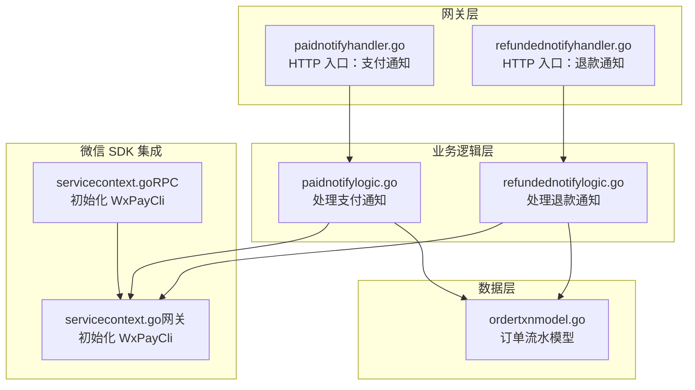
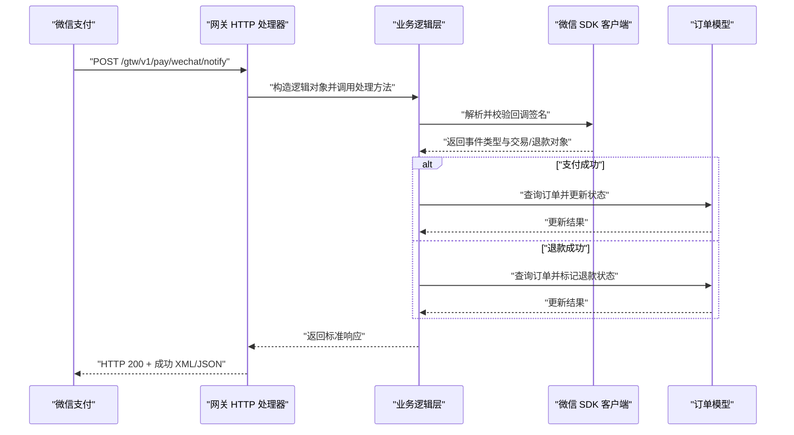
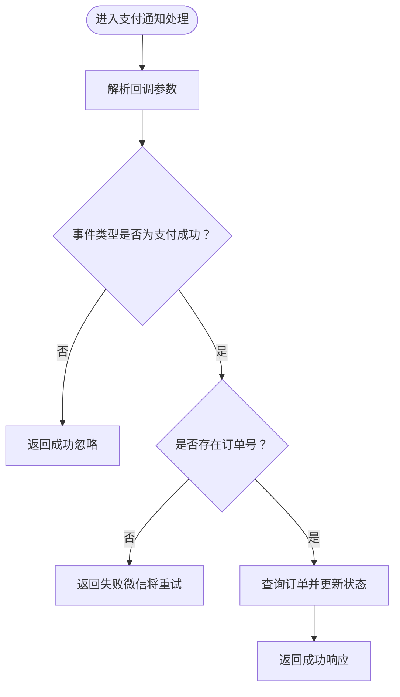
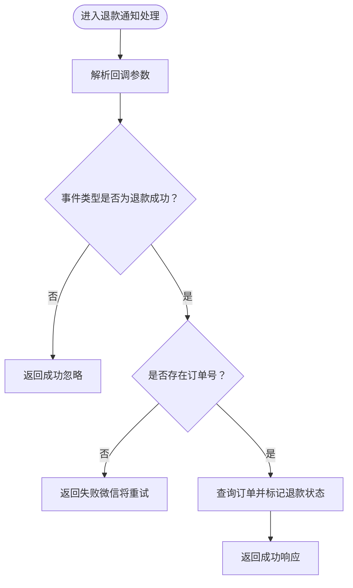
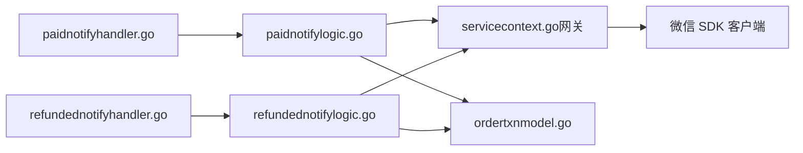

# 支付服务 API

<cite>
**本文引用的文件**
- [paidnotifylogic.go](file://gtw/internal/logic/pay/paidnotifylogic.go)
- [refundednotifylogic.go](file://gtw/internal/logic/pay/refundednotifylogic.go)
- [paidnotifyhandler.go](file://gtw/internal/handler/pay/paidnotifyhandler.go)
- [refundednotifyhandler.go](file://gtw/internal/handler/pay/refundednotifyhandler.go)
- [servicecontext.go（网关服务上下文）](file://gtw/internal/svc/servicecontext.go)
- [servicecontext.go（RPC 服务上下文）](file://zerorpc/internal/svc/servicecontext.go)
- [wxpayjsapilogic.go](file://zerorpc/internal/logic/wxpayjsapilogic.go)
- [types.go（PowerWechat 日志驱动）](file://common/powerwechatx/types.go)
- [ordertxnmodel.go](file://model/ordertxnmodel.go)
- [gtw.yaml](file://gtw/etc/gtw.yaml)
- [zerorpc.yaml](file://zerorpc/etc/zerorpc.yaml)
</cite>

## 目录
1. [简介](#简介)
2. [项目结构](#项目结构)
3. [核心组件](#核心组件)
4. [架构总览](#架构总览)
5. [详细组件分析](#详细组件分析)
6. [依赖分析](#依赖分析)
7. [性能与并发特性](#性能与并发特性)
8. [安全与合规](#安全与合规)
9. [故障排查指南](#故障排查指南)
10. [结论](#结论)
11. [附录：接口与调用示例](#附录接口与调用示例)

## 简介
本文件面向支付服务的 HTTP API，重点覆盖微信支付通知与退款通知接口的规范、安全验证机制、数据处理流程、支付状态更新与订单处理策略，以及异常场景的处理方法。同时提供支付集成的完整流程与调试指南，帮助开发者快速、安全地接入微信支付回调。

## 项目结构
支付能力由“网关层 HTTP 处理器 + 业务逻辑 + 微信 SDK + 数据模型”构成，核心位置如下：
- 网关层 HTTP 处理器：负责接收微信回调请求，交由逻辑层处理，并统一响应。
- 业务逻辑层：封装微信支付/退款通知的解析、校验与落库/状态更新。
- 微信 SDK 集成：通过 PowerWeChat 初始化微信支付客户端，配置证书、密钥、通知地址等。
- 数据模型：订单流水表用于记录支付单据、金额、渠道、状态等。

图表来源
- [paidnotifyhandler.go:1-23](file://gtw/internal/handler/pay/paidnotifyhandler.go#L1-L23)
- [refundednotifyhandler.go:1-23](file://gtw/internal/handler/pay/refundednotifyhandler.go#L1-L23)
- [paidnotifylogic.go:1-62](file://gtw/internal/logic/pay/paidnotifylogic.go#L1-L62)
- [refundednotifylogic.go:1-54](file://gtw/internal/logic/pay/refundednotifylogic.go#L1-L54)
- [servicecontext.go（网关服务上下文）:23-65](file://gtw/internal/svc/servicecontext.go#L23-L65)
- [servicecontext.go（RPC 服务上下文）:35-101](file://zerorpc/internal/svc/servicecontext.go#L35-L101)
- [ordertxnmodel.go:1-32](file://model/ordertxnmodel.go#L1-L32)

章节来源
- [paidnotifyhandler.go:1-23](file://gtw/internal/handler/pay/paidnotifyhandler.go#L1-L23)
- [refundednotifyhandler.go:1-23](file://gtw/internal/handler/pay/refundednotifyhandler.go#L1-L23)
- [paidnotifylogic.go:1-62](file://gtw/internal/logic/pay/paidnotifylogic.go#L1-L62)
- [refundednotifylogic.go:1-54](file://gtw/internal/logic/pay/refundednotifylogic.go#L1-L54)
- [servicecontext.go（网关服务上下文）:23-65](file://gtw/internal/svc/servicecontext.go#L23-L65)
- [servicecontext.go（RPC 服务上下文）:35-101](file://zerorpc/internal/svc/servicecontext.go#L35-L101)
- [ordertxnmodel.go:1-32](file://model/ordertxnmodel.go#L1-L32)

## 核心组件
- 支付通知处理器：接收微信支付成功回调，解析事件类型与订单号，执行业务处理并返回微信期望的响应。
- 退款通知处理器：接收微信退款回调，解析事件类型与订单号，执行退款状态处理并返回响应。
- 微信支付客户端：通过配置 AppID、商户号、APIv3 密钥、证书与通知地址，完成回调解析与签名校验。
- 订单模型：持久化订单流水，记录交易金额、渠道、状态、过期时间等字段，支撑支付状态更新与幂等处理。

章节来源
- [paidnotifylogic.go:1-62](file://gtw/internal/logic/pay/paidnotifylogic.go#L1-L62)
- [refundednotifylogic.go:1-54](file://gtw/internal/logic/pay/refundednotifylogic.go#L1-L54)
- [servicecontext.go（网关服务上下文）:23-65](file://gtw/internal/svc/servicecontext.go#L23-L65)
- [servicecontext.go（RPC 服务上下文）:35-101](file://zerorpc/internal/svc/servicecontext.go#L35-L101)
- [ordertxnmodel.go:1-32](file://model/ordertxnmodel.go#L1-L32)

## 架构总览
支付回调的整体交互流程如下：

图表来源
- [paidnotifyhandler.go:1-23](file://gtw/internal/handler/pay/paidnotifyhandler.go#L1-L23)
- [refundednotifyhandler.go:1-23](file://gtw/internal/handler/pay/refundednotifyhandler.go#L1-L23)
- [paidnotifylogic.go:32-61](file://gtw/internal/logic/pay/paidnotifylogic.go#L32-L61)
- [refundednotifylogic.go:32-53](file://gtw/internal/logic/pay/refundednotifylogic.go#L32-L53)
- [servicecontext.go（网关服务上下文）:23-65](file://gtw/internal/svc/servicecontext.go#L23-L65)
- [ordertxnmodel.go:1-32](file://model/ordertxnmodel.go#L1-L32)

## 详细组件分析

### 支付通知接口（HTTP）
- 接口路径：/gtw/v1/pay/wechat/notify
- 方法：POST
- 请求体：微信回调的原始 XML/JSON（由微信 SDK 解析）
- 响应：遵循微信回调响应格式（通常为成功 XML/JSON）

处理流程要点：
- 事件类型校验：仅处理“支付成功”事件；其他事件可直接返回成功以避免重复通知。
- 订单号校验：若回调未携带订单号，需拒绝处理并返回失败，等待微信重试。
- 幂等性：根据订单号进行幂等判断，避免重复更新状态。
- 异常处理：捕获内部错误并记录日志，确保返回微信期望的成功响应以避免重复推送。

图表来源
- [paidnotifylogic.go:32-61](file://gtw/internal/logic/pay/paidnotifylogic.go#L32-L61)

章节来源
- [paidnotifyhandler.go:1-23](file://gtw/internal/handler/pay/paidnotifyhandler.go#L1-L23)
- [paidnotifylogic.go:1-62](file://gtw/internal/logic/pay/paidnotifylogic.go#L1-L62)

### 退款通知接口（HTTP）
- 接口路径：/gtw/v1/pay/wechat/notify
- 方法：POST
- 请求体：微信回调的原始 XML/JSON（由微信 SDK 解析）
- 响应：遵循微信回调响应格式

处理流程要点：
- 事件类型校验：仅处理“退款成功”事件；其他事件可直接返回成功。
- 订单号校验：若回调未携带订单号，需拒绝处理并返回失败，等待微信重试。
- 幂等性：根据订单号进行幂等判断，避免重复更新退款状态。
- 异常处理：捕获内部错误并记录日志，确保返回微信期望的成功响应。

图表来源
- [refundednotifylogic.go:32-53](file://gtw/internal/logic/pay/refundednotifylogic.go#L32-L53)

章节来源
- [refundednotifyhandler.go:1-23](file://gtw/internal/handler/pay/refundednotifyhandler.go#L1-L23)
- [refundednotifylogic.go:1-54](file://gtw/internal/logic/pay/refundednotifylogic.go#L1-L54)

### 微信支付客户端初始化与配置
- AppID/MchID/MchApiV3Key/Cert/Key/SerailNo：用于微信 SDK 的初始化与签名验证。
- NotifyURL：微信回调通知的目标地址，需与网关路由一致。
- 日志驱动：使用统一的日志适配器，便于集中观测。

章节来源
- [servicecontext.go（网关服务上下文）:23-65](file://gtw/internal/svc/servicecontext.go#L23-L65)
- [servicecontext.go（RPC 服务上下文）:35-101](file://zerorpc/internal/svc/servicecontext.go#L35-L101)
- [types.go（PowerWechat 日志驱动）:1-66](file://common/powerwechatx/types.go#L1-L66)

### 订单模型与状态更新
- 模型：订单流水表，包含交易号、商户订单号、金额、渠道、用户标识、过期时间、结果状态等。
- 更新策略：支付成功后更新订单状态为已支付；退款成功后更新为已退款；对重复回调进行幂等处理。

章节来源
- [ordertxnmodel.go:1-32](file://model/ordertxnmodel.go#L1-L32)

### JSAPI 支付下单（前置流程）
- 生成商户订单号（不可重复），组装金额、描述、用户 OpenID 等参数。
- 调用微信预下单接口获取 PrepayID。
- 使用 JSSDK BridgeConfig 生成前端支付参数。
- 写入订单流水，状态为“处理中”。

章节来源
- [wxpayjsapilogic.go:36-99](file://zerorpc/internal/logic/wxpayjsapilogic.go#L36-L99)

## 依赖分析
- 网关 HTTP 处理器依赖业务逻辑层，业务逻辑层依赖微信 SDK 客户端。
- 业务逻辑层依赖订单模型进行状态更新与幂等控制。
- 微信 SDK 客户端依赖配置文件中的证书、密钥与通知地址。

图表来源
- [paidnotifyhandler.go:1-23](file://gtw/internal/handler/pay/paidnotifyhandler.go#L1-L23)
- [refundednotifyhandler.go:1-23](file://gtw/internal/handler/pay/refundednotifyhandler.go#L1-L23)
- [paidnotifylogic.go:1-62](file://gtw/internal/logic/pay/paidnotifylogic.go#L1-L62)
- [refundednotifylogic.go:1-54](file://gtw/internal/logic/pay/refundednotifylogic.go#L1-L54)
- [servicecontext.go（网关服务上下文）:23-65](file://gtw/internal/svc/servicecontext.go#L23-L65)
- [ordertxnmodel.go:1-32](file://model/ordertxnmodel.go#L1-L32)

章节来源
- [paidnotifyhandler.go:1-23](file://gtw/internal/handler/pay/paidnotifyhandler.go#L1-L23)
- [refundednotifyhandler.go:1-23](file://gtw/internal/handler/pay/refundednotifyhandler.go#L1-L23)
- [paidnotifylogic.go:1-62](file://gtw/internal/logic/pay/paidnotifylogic.go#L1-L62)
- [refundednotifylogic.go:1-54](file://gtw/internal/logic/pay/refundednotifylogic.go#L1-L54)
- [servicecontext.go（网关服务上下文）:23-65](file://gtw/internal/svc/servicecontext.go#L23-L65)
- [ordertxnmodel.go:1-32](file://model/ordertxnmodel.go#L1-L32)

## 性能与并发特性
- 回调处理为短时同步请求，建议保持轻量处理与快速响应，避免阻塞。
- 对数据库写入采用幂等策略，减少重复写入带来的压力。
- 建议结合异步任务队列对复杂业务（如发送通知、更新库存）进行解耦，保证回调接口的低延迟与高可用。

## 安全与合规
- 回调签名验证：微信 SDK 已内置签名验证，业务侧仅需按事件类型与订单号进行二次校验。
- 证书与密钥管理：确保证书、密钥与序列号正确配置，定期轮换并妥善存储。
- 通知地址一致性：确保微信后台配置的通知地址与网关路由一致，避免回调失败。
- 日志与审计：统一使用日志驱动输出，保留关键事件与错误日志，便于审计与排障。
- 幂等性：基于订单号实现幂等，防止重复处理导致的状态不一致。

章节来源
- [servicecontext.go（网关服务上下文）:23-65](file://gtw/internal/svc/servicecontext.go#L23-L65)
- [types.go（PowerWechat 日志驱动）:1-66](file://common/powerwechatx/types.go#L1-L66)

## 故障排查指南
- 回调未到达：检查微信后台通知地址与网关路由是否一致；确认网关服务运行正常。
- 返回失败被重试：若订单号缺失或业务处理异常，微信会重试；请确保幂等与错误日志完善。
- 签名验证失败：核对证书、密钥与序列号配置；确认回调签名流程正确。
- 数据库写入异常：检查订单模型插入逻辑与数据库连接；关注重复订单号导致的冲突。
- 日志定位：通过统一日志驱动查看微信 SDK 输出与业务日志，定位问题根因。

章节来源
- [paidnotifylogic.go:53-61](file://gtw/internal/logic/pay/paidnotifylogic.go#L53-L61)
- [refundednotifylogic.go:48-53](file://gtw/internal/logic/pay/refundednotifylogic.go#L48-L53)
- [types.go（PowerWechat 日志驱动）:1-66](file://common/powerwechatx/types.go#L1-L66)

## 结论
该支付服务通过清晰的分层设计与微信 SDK 的深度集成，提供了稳定可靠的支付与退款回调处理能力。遵循本文档的安全与流程规范，可有效降低接入成本并提升系统稳定性。

## 附录：接口与调用示例

- 支付通知接口
  - 方法：POST
  - 路径：/gtw/v1/pay/wechat/notify
  - 请求体：微信回调的原始 XML/JSON
  - 响应：遵循微信回调响应格式（成功/失败）

- 退款通知接口
  - 方法：POST
  - 路径：/gtw/v1/pay/wechat/notify
  - 请求体：微信回调的原始 XML/JSON
  - 响应：遵循微信回调响应格式（成功/失败）

- JSAPI 支付下单（前置流程）
  - 方法：RPC（由前端调用 RPC 服务下单）
  - 路径：由 RPC 服务内部调用微信下单接口
  - 关键参数：金额、描述、用户 OpenID、商户订单号
  - 返回：PrepayID 与前端支付参数

章节来源
- [paidnotifyhandler.go:1-23](file://gtw/internal/handler/pay/paidnotifyhandler.go#L1-L23)
- [refundednotifyhandler.go:1-23](file://gtw/internal/handler/pay/refundednotifyhandler.go#L1-L23)
- [wxpayjsapilogic.go:36-99](file://zerorpc/internal/logic/wxpayjsapilogic.go#L36-L99)
- [gtw.yaml:1-61](file://gtw/etc/gtw.yaml#L1-L61)
- [zerorpc.yaml:1-39](file://zerorpc/etc/zerorpc.yaml#L1-L39)