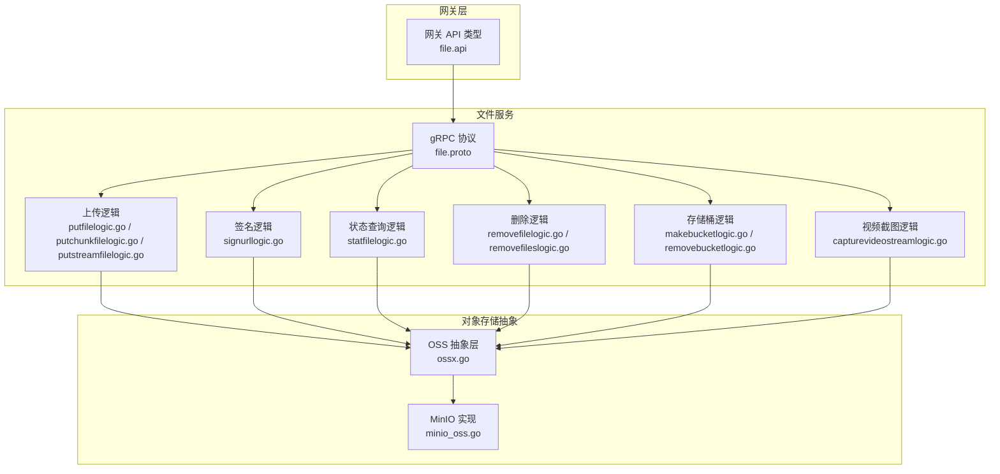
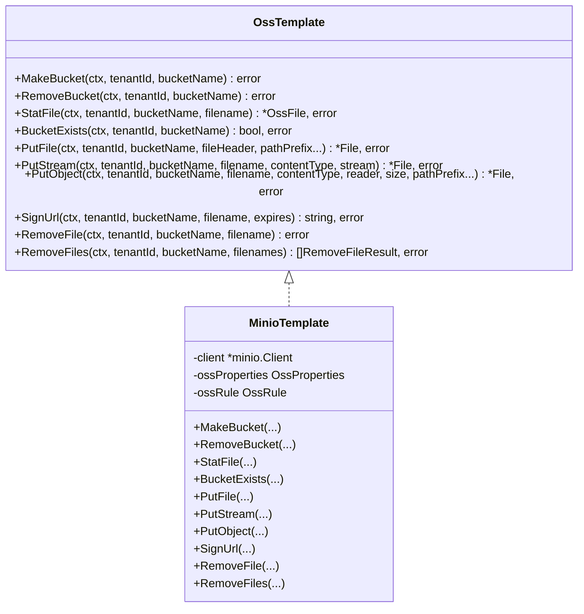
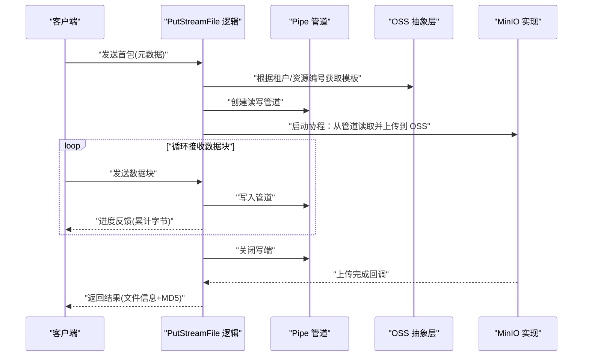
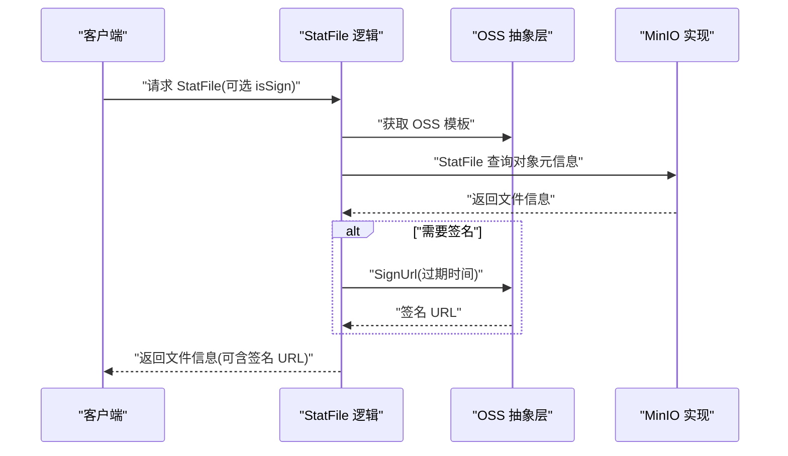
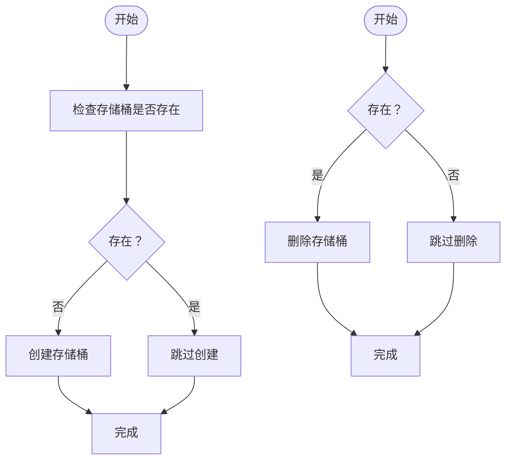
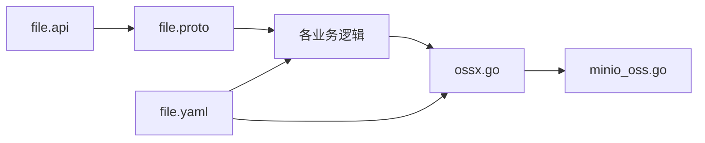

# 文件服务 API

<cite>
**本文引用的文件**
- [file.proto](file://app/file/file.proto)
- [file.api](file://gtw/doc/file.api)
- [file.yaml](file://app/file/etc/file.yaml)
- [ossx.go](file://common/ossx/ossx.go)
- [minio_oss.go](file://common/ossx/minio_oss.go)
- [putfilelogic.go](file://app/file/internal/logic/putfilelogic.go)
- [putchunkfilelogic.go](file://app/file/internal/logic/putchunkfilelogic.go)
- [putstreamfilelogic.go](file://app/file/internal/logic/putstreamfilelogic.go)
- [signurllogic.go](file://app/file/internal/logic/signurllogic.go)
- [statfilelogic.go](file://app/file/internal/logic/statfilelogic.go)
- [removefilelogic.go](file://app/file/internal/logic/removefilelogic.go)
- [removefileslogic.go](file://app/file/internal/logic/removefileslogic.go)
- [capturevideostreamlogic.go](file://app/file/internal/logic/capturevideostreamlogic.go)
- [makebucketlogic.go](file://app/file/internal/logic/makebucketlogic.go)
- [removebucketlogic.go](file://app/file/internal/logic/removebucketlogic.go)
</cite>

## 目录
1. [简介](#简介)
2. [项目结构](#项目结构)
3. [核心组件](#核心组件)
4. [架构总览](#架构总览)
5. [详细组件分析](#详细组件分析)
6. [依赖关系分析](#依赖关系分析)
7. [性能与最佳实践](#性能与最佳实践)
8. [故障排查指南](#故障排查指南)
9. [结论](#结论)
10. [附录：接口清单与示例](#附录接口清单与示例)

## 简介
本文件服务 API 提供对象存储相关的完整能力，覆盖文件上传（普通上传、分片上传、流式上传）、URL 签名、文件状态查询、存储桶管理以及视频流截图等能力。系统通过统一的 OSS 抽象层对接多种对象存储后端，并以 gRPC 服务暴露能力；同时提供网关层的 API 类型定义，便于前端或外部系统集成。

## 项目结构
- 服务定义与协议
  - gRPC 服务定义位于 app/file/file.proto，涵盖上传、下载、删除、签名、统计、存储桶管理等接口。
  - 网关层 API 类型定义位于 gtw/doc/file.api，用于对外展示请求/响应字段。
- 业务逻辑
  - app/file/internal/logic 下实现各 RPC 方法的具体处理逻辑。
- 对象存储抽象
  - common/ossx 提供 OSS 抽象接口与 MinIO 实现，支持创建/删除存储桶、上传、签名、删除、批量删除、统计等。
- 配置
  - app/file/etc/file.yaml 定义服务监听、日志、注册中心、租户模式开关、并发配置及数据库连接等。

图表来源
- [file.proto:270-287](file://app/file/file.proto#L270-L287)
- [file.api:1-60](file://gtw/doc/file.api#L1-L60)
- [ossx.go:28-39](file://common/ossx/ossx.go#L28-L39)
- [minio_oss.go:20-243](file://common/ossx/minio_oss.go#L20-L243)

章节来源
- [file.proto:1-287](file://app/file/file.proto#L1-L287)
- [file.api:1-60](file://gtw/doc/file.api#L1-L60)
- [file.yaml:1-23](file://app/file/etc/file.yaml#L1-L23)

## 核心组件
- gRPC 服务接口
  - 上传类：PutFile、PutChunkFile（双向流）、PutStreamFile（单向流）
  - 签名类：SignUrl
  - 查询类：StatFile
  - 删除类：RemoveFile、RemoveFiles
  - 存储桶类：MakeBucket、RemoveBucket
  - 其他：Ping、OssDetail、OssList、CreateOss、UpdateOss、DeleteOss、CaptureVideoStream
- OSS 抽象层
  - OssTemplate 接口定义了创建/删除存储桶、统计、上传、签名、删除、批量删除等方法。
  - MinioTemplate 实现具体逻辑，封装 MinIO SDK。
- 业务逻辑层
  - 各逻辑类负责参数校验、租户与资源编号解析、OSS 模板选择、调用抽象层、返回结果转换等。

章节来源
- [file.proto:176-287](file://app/file/file.proto#L176-L287)
- [ossx.go:28-39](file://common/ossx/ossx.go#L28-L39)
- [minio_oss.go:20-243](file://common/ossx/minio_oss.go#L20-L243)

## 架构总览
文件服务采用“协议 + 抽象 + 实现”的分层设计：
- 协议层：定义清晰的请求/响应模型与服务方法。
- 抽象层：OSS 抽象接口屏蔽底层差异，支持多厂商扩展。
- 实现层：当前仅实现 MinIO，后续可按需扩展其他厂商。
- 业务层：围绕协议实现具体逻辑，处理租户、路径前缀、缩略图、EXIF 等细节。

图表来源
- [ossx.go:28-39](file://common/ossx/ossx.go#L28-L39)
- [minio_oss.go:20-243](file://common/ossx/minio_oss.go#L20-L243)

## 详细组件分析

### 上传接口对比与适用场景
- 普通文件上传（PutFile）
  - 适用：小文件或内存充足的场景；直接读取本地文件路径上传。
  - 特点：非流式，由服务端直接读取磁盘文件；自动探测内容类型；可选生成缩略图与 EXIF 元信息。
- 分片上传（PutChunkFile，双向流）
  - 适用：大文件断点续传、网络不稳定、需要实时进度反馈。
  - 特点：客户端分块发送，服务端维护临时文件与 MD5；支持边收边传；可生成缩略图与 EXIF。
- 流式上传（PutStreamFile，单向流）
  - 适用：大文件、网络直传、客户端直接推送数据流。
  - 特点：客户端持续推送，服务端边接收边上传；带进度日志阈值控制；支持缩略图与 EXIF。

图表来源
- [putstreamfilelogic.go:43-287](file://app/file/internal/logic/putstreamfilelogic.go#L43-L287)
- [ossx.go:28-39](file://common/ossx/ossx.go#L28-L39)
- [minio_oss.go:124-148](file://common/ossx/minio_oss.go#L124-L148)

章节来源
- [file.proto:176-225](file://app/file/file.proto#L176-L225)
- [putfilelogic.go:33-78](file://app/file/internal/logic/putfilelogic.go#L33-L78)
- [putchunkfilelogic.go:38-270](file://app/file/internal/logic/putchunkfilelogic.go#L38-L270)
- [putstreamfilelogic.go:43-287](file://app/file/internal/logic/putstreamfilelogic.go#L43-L287)

### URL 签名与文件状态查询
- URL 签名（SignUrl）
  - 输入：租户ID、资源编号、存储桶、文件名、过期时间（分钟）。
  - 输出：带签名的访问链接。
  - 行为：根据租户与资源编号动态选择 OSS 模板，调用签名接口生成预签名 URL。
- 文件状态查询（StatFile）
  - 输入：租户ID、资源编号、存储桶、文件名、是否生成签名、过期时间。
  - 输出：文件基础信息（含上传时间格式化），可选返回签名 URL。

图表来源
- [statfilelogic.go:29-58](file://app/file/internal/logic/statfilelogic.go#L29-L58)
- [signurllogic.go:29-60](file://app/file/internal/logic/signurllogic.go#L29-L60)
- [ossx.go:28-39](file://common/ossx/ossx.go#L28-L39)
- [minio_oss.go:40-56](file://common/ossx/minio_oss.go#L40-L56)
- [minio_oss.go:150-162](file://common/ossx/minio_oss.go#L150-L162)

章节来源
- [file.proto:151-174](file://app/file/file.proto#L151-L174)
- [statfilelogic.go:29-58](file://app/file/internal/logic/statfilelogic.go#L29-L58)
- [signurllogic.go:29-60](file://app/file/internal/logic/signurllogic.go#L29-L60)

### 存储桶管理与文件删除
- 存储桶管理
  - MakeBucket：若存储桶不存在则创建。
  - RemoveBucket：若存在则删除。
- 文件删除
  - RemoveFile：删除单个文件。
  - RemoveFiles：批量删除，聚合错误并返回。

图表来源
- [makebucketlogic.go:26-44](file://app/file/internal/logic/makebucketlogic.go#L26-L44)
- [removebucketlogic.go:26-44](file://app/file/internal/logic/removebucketlogic.go#L26-L44)

章节来源
- [file.proto:133-149](file://app/file/file.proto#L133-L149)
- [removefilelogic.go:26-38](file://app/file/internal/logic/removefilelogic.go#L26-L38)
- [removefileslogic.go:28-45](file://app/file/internal/logic/removefileslogic.go#L28-L45)

### 视频流截图与上传
- CaptureVideoStream
  - 输入：租户ID、资源编号、存储桶、视频流地址、路径前缀。
  - 行为：使用媒体工具截取帧到临时文件，计算 MD5，上传至 OSS，返回文件信息。

章节来源
- [file.proto:257-268](file://app/file/file.proto#L257-L268)
- [capturevideostreamlogic.go:35-93](file://app/file/internal/logic/capturevideostreamlogic.go#L35-L93)

## 依赖关系分析
- 服务依赖
  - file.proto 定义服务与消息体，被 gRPC 服务器实现使用。
  - file.api 作为网关层类型定义，映射到内部消息体。
- 抽象与实现
  - ossx.go 定义 OssTemplate 接口与模板缓存策略；minio_oss.go 实现具体方法。
- 业务逻辑
  - 各 logic 文件依赖 ossx.Template 获取模板，再调用抽象层执行操作。
- 配置
  - file.yaml 控制租户模式、日志、注册中心、并发与数据库连接。

图表来源
- [file.proto:270-287](file://app/file/file.proto#L270-L287)
- [file.api:1-60](file://gtw/doc/file.api#L1-L60)
- [ossx.go:109-151](file://common/ossx/ossx.go#L109-L151)
- [minio_oss.go:214-235](file://common/ossx/minio_oss.go#L214-L235)
- [file.yaml:1-23](file://app/file/etc/file.yaml#L1-L23)

章节来源
- [file.proto:1-287](file://app/file/file.proto#L1-L287)
- [ossx.go:109-151](file://common/ossx/ossx.go#L109-L151)
- [minio_oss.go:214-235](file://common/ossx/minio_oss.go#L214-L235)
- [file.yaml:1-23](file://app/file/etc/file.yaml#L1-L23)

## 性能与最佳实践
- 上传方式选择
  - 小文件：优先使用 PutFile，减少流式开销。
  - 大文件/弱网：优先使用 PutStreamFile 或 PutChunkFile，支持断点续传与进度反馈。
- 断点续传机制
  - PutChunkFile/PutStreamFile 在服务端维护临时文件与 MD5，客户端可基于已上传字节继续传输。
  - 建议客户端记录已上传偏移，服务端按 size 校验完成条件。
- 路径与命名
  - 通过 pathPrefix 控制文件路径前缀，默认规则见 ossx 的 filename 生成策略。
- 缩略图与 EXIF
  - 当内容类型为 image/* 时，自动提取 EXIF 并可生成缩略图；缩略图异步生成，避免阻塞主流程。
- 并发与日志
  - 服务配置包含 ThumbTaskConcurrency，用于控制缩略图并发数。
  - 流式上传具备进度日志阈值，避免频繁日志输出影响性能。
- 安全与鉴权
  - 通过 SignUrl 生成带过期时间的预签名链接，降低密钥泄露风险。
  - 建议对敏感操作增加鉴权与速率限制。

章节来源
- [ossx.go:55-68](file://common/ossx/ossx.go#L55-L68)
- [putstreamfilelogic.go:28-92](file://app/file/internal/logic/putstreamfilelogic.go#L28-L92)
- [putchunkfilelogic.go:72-82](file://app/file/internal/logic/putchunkfilelogic.go#L72-L82)
- [file.yaml:20-20](file://app/file/etc/file.yaml#L20-L20)

## 故障排查指南
- 上传失败
  - 检查 OSS 模板初始化是否成功（租户ID、资源编号、端点、密钥）。
  - 确认存储桶存在且有写权限；必要时先调用 MakeBucket。
  - 对于流式上传，关注管道写入与关闭时机，确保 EOF 正确传递。
- 签名失败
  - 确认文件名与存储桶正确；检查过期时间设置。
- 删除失败
  - 单文件删除：确认文件存在；批量删除：查看返回的失败项明细。
- 缩略图未生成
  - 确认 isThumb 开启且内容类型为图片；检查缩略图异步任务调度器运行状态。
- 性能问题
  - 大文件上传时观察进度日志与并发设置；适当调整 ThumbTaskConcurrency。

章节来源
- [makebucketlogic.go:33-38](file://app/file/internal/logic/makebucketlogic.go#L33-L38)
- [removefileslogic.go:35-45](file://app/file/internal/logic/removefileslogic.go#L35-L45)
- [signurllogic.go:49-53](file://app/file/internal/logic/signurllogic.go#L49-L53)
- [putstreamfilelogic.go:139-155](file://app/file/internal/logic/putstreamfilelogic.go#L139-L155)

## 结论
该文件服务 API 通过清晰的协议定义、可扩展的 OSS 抽象层与完善的业务逻辑，提供了从上传、签名、查询到存储桶管理的全链路能力。结合流式与分片上传，满足大文件与弱网场景需求；配合缩略图与 EXIF 能力，提升多媒体处理效率。建议在生产环境中强化鉴权、监控与限流，并根据业务规模调整并发与日志策略。

## 附录：接口清单与示例

- 上传接口
  - 普通上传（PutFile）
    - 请求字段：tenantId、code、bucketName、filename、contentType、path、isThumb、pathPrefix
    - 返回字段：file（包含 link、domain、name、size、formatSize、originalName、meta、thumbLink、thumbName）
    - 适用场景：小文件或服务端可直接读取本地文件
  - 分片上传（PutChunkFile，双向流）
    - 请求字段：tenantId、code、bucketName、filename、contentType、content、size、isThumb、pathPrefix
    - 返回字段：file、isEnd、size
    - 适用场景：大文件断点续传、网络不稳定、需要进度反馈
  - 流式上传（PutStreamFile，单向流）
    - 请求字段：tenantId、code、bucketName、filename、contentType、content、size、isThumb、pathPrefix
    - 返回字段：file、isEnd、size
    - 适用场景：大文件直传、客户端持续推送

- 查询与签名
  - 文件状态（StatFile）
    - 请求字段：tenantId、code、bucketName、filename、isSign、expires
    - 返回字段：ossFile（包含 link、name、size、formatSize、putTime、contentType、signUrl）
  - URL 签名（SignUrl）
    - 请求字段：tenantId、code、bucketName、filename、expires
    - 返回字段：url

- 存储桶与文件管理
  - 创建存储桶（MakeBucket）
    - 请求字段：tenantId、code、bucketName
  - 删除存储桶（RemoveBucket）
    - 请求字段：tenantId、code、bucketName
  - 删除文件（RemoveFile）
    - 请求字段：tenantId、code、bucketName、filename
  - 批量删除文件（RemoveFiles）
    - 请求字段：tenantId、code、bucketName、filename[]
  - 视频流截图（CaptureVideoStream）
    - 请求字段：tenantId、code、bucketName、streamUrl、pathPrefix
    - 返回字段：file（包含 md5）

章节来源
- [file.proto:151-287](file://app/file/file.proto#L151-L287)
- [file.api:28-57](file://gtw/doc/file.api#L28-L57)