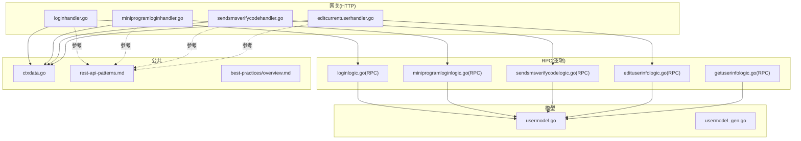
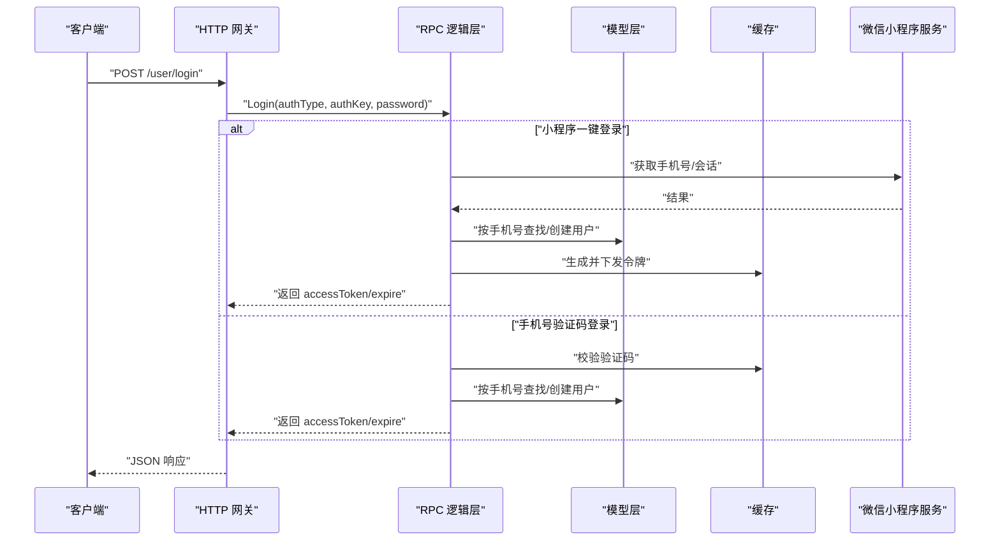
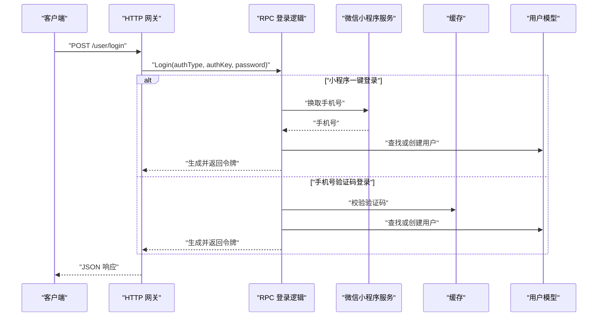
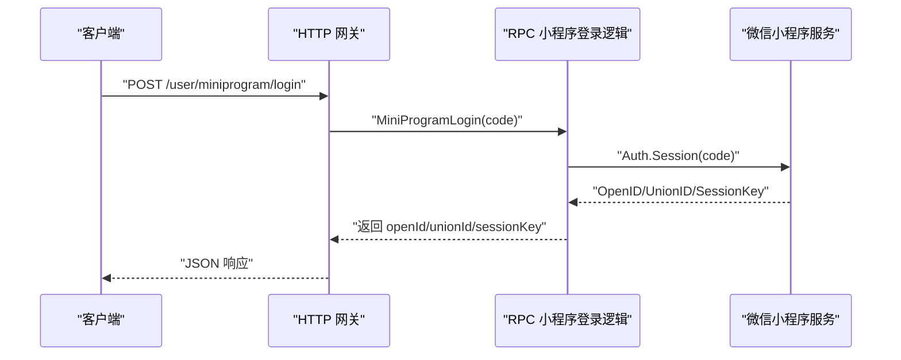
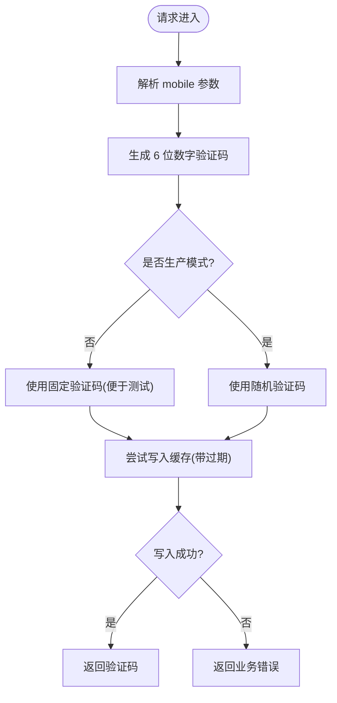
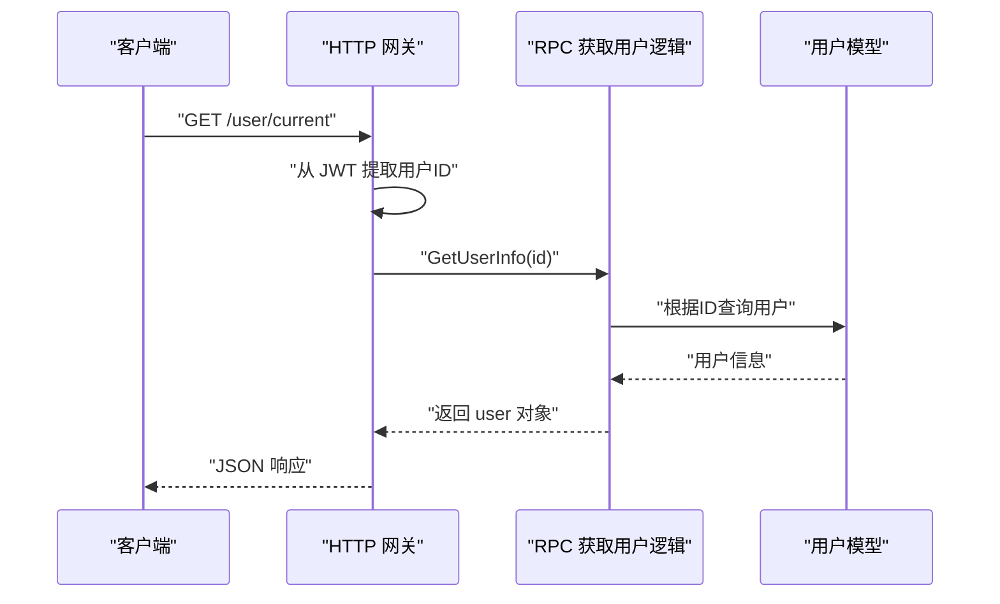
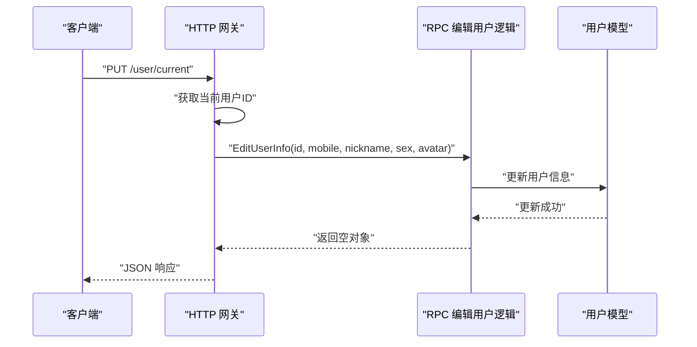
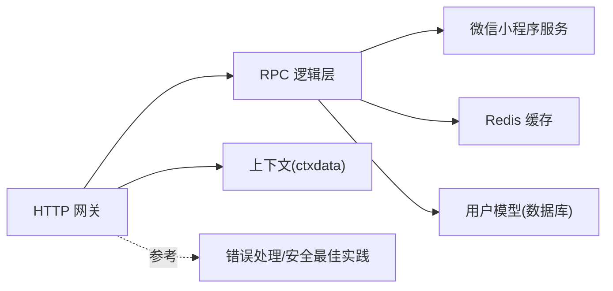

# 用户服务 API

<cite>
**本文引用的文件**
- [user.api](file://gtw/doc/user.api)
- [loginhandler.go](file://gtw/internal/handler/user/loginhandler.go)
- [miniprogramloginhandler.go](file://gtw/internal/handler/user/miniprogramloginhandler.go)
- [sendsmsverifycodehandler.go](file://gtw/internal/handler/user/sendsmsverifycodehandler.go)
- [editcurrentuserhandler.go](file://gtw/internal/handler/user/editcurrentuserhandler.go)
- [loginlogic.go（网关）](file://gtw/internal/logic/user/loginlogic.go)
- [miniprogramloginlogic.go（网关）](file://gtw/internal/logic/user/miniprogramloginlogic.go)
- [sendsmsverifycodelogic.go（网关）](file://gtw/internal/logic/user/sendsmsverifycodelogic.go)
- [editcurrentuserlogic.go（网关）](file://gtw/internal/logic/user/editcurrentuserlogic.go)
- [getcurrentuserlogic.go（网关）](file://gtw/internal/logic/user/getcurrentuserlogic.go)
- [loginlogic.go（RPC）](file://zerorpc/internal/logic/loginlogic.go)
- [miniprogramloginlogic.go（RPC）](file://zerorpc/internal/logic/miniprogramloginlogic.go)
- [sendsmsverifycodelogic.go（RPC）](file://zerorpc/internal/logic/sendsmsverifycodelogic.go)
- [edituserinfologic.go（RPC）](file://zerorpc/internal/logic/edituserinfologic.go)
- [getuserinfologic.go（RPC）](file://zerorpc/internal/logic/getuserinfologic.go)
- [usermodel.go](file://model/usermodel.go)
- [usermodel_gen.go](file://model/usermodel_gen.go)
- [ctxdata.go](file://common/ctxdata/ctxData.go)
- [rest-api-patterns.md](file://.trae/skills/zero-skills/references/rest-api-patterns.md)
- [best-practices/overview.md](file://.trae/skills/zero-skills/best-practices/overview.md)
</cite>

## 目录
1. [简介](#简介)
2. [项目结构](#项目结构)
3. [核心组件](#核心组件)
4. [架构总览](#架构总览)
5. [详细组件分析](#详细组件分析)
6. [依赖关系分析](#依赖关系分析)
7. [性能考量](#性能考量)
8. [故障排查指南](#故障排查指南)
9. [结论](#结论)
10. [附录](#附录)

## 简介
本文件为“用户服务”的 HTTP API 完整文档，覆盖以下能力：
- 用户认证：登录、小程序登录、短信验证码发送
- JWT 认证下的用户信息查询与编辑接口
- 请求参数、响应格式与错误处理规范
- 注册、登录流程与会话管理实现细节
- 接口调用示例与集成指南

该服务采用“网关层（HTTP）+ RPC 层（业务逻辑）+ 模型层（数据访问）”分层设计，遵循统一的错误处理与安全最佳实践。

## 项目结构
用户服务相关模块分布如下：
- 网关层（HTTP）：负责接收 HTTP 请求、参数解析、调用 RPC 逻辑层，并返回统一 JSON 响应
- RPC 层（逻辑）：实现具体业务逻辑，如登录、小程序登录、短信验证码、用户信息编辑等
- 模型层：封装数据库访问与实体映射
- 公共工具：上下文数据提取（如用户 ID）、REST 最佳实践与安全建议

图表来源
- [loginhandler.go:1-31](file://gtw/internal/handler/user/loginhandler.go#L1-L31)
- [miniprogramloginhandler.go:1-31](file://gtw/internal/handler/user/miniprogramloginhandler.go#L1-L31)
- [sendsmsverifycodehandler.go:1-31](file://gtw/internal/handler/user/sendsmsverifycodehandler.go#L1-L31)
- [editcurrentuserhandler.go:1-31](file://gtw/internal/handler/user/editcurrentuserhandler.go#L1-L31)
- [loginlogic.go（RPC）:1-110](file://zerorpc/internal/logic/loginlogic.go#L1-L110)
- [miniprogramloginlogic.go（RPC）:1-43](file://zerorpc/internal/logic/miniprogramloginlogic.go#L1-L43)
- [sendsmsverifycodelogic.go（RPC）:1-43](file://zerorpc/internal/logic/sendsmsverifycodelogic.go#L1-L43)
- [edituserinfologic.go（RPC）:1-49](file://zerorpc/internal/logic/edituserinfologic.go#L1-L49)
- [getuserinfologic.go（RPC）:1-42](file://zerorpc/internal/logic/getuserinfologic.go#L1-L42)
- [usermodel.go](file://model/usermodel.go)
- [usermodel_gen.go](file://model/usermodel_gen.go)
- [ctxdata.go](file://common/ctxdata/ctxData.go)
- [rest-api-patterns.md:80-137](file://.trae/skills/zero-skills/references/rest-api-patterns.md#L80-L137)
- [best-practices/overview.md:140-212](file://.trae/skills/zero-skills/best-practices/overview.md#L140-L212)

章节来源
- [user.api:1-47](file://gtw/doc/user.api#L1-L47)
- [loginhandler.go:1-31](file://gtw/internal/handler/user/loginhandler.go#L1-L31)
- [miniprogramloginhandler.go:1-31](file://gtw/internal/handler/user/miniprogramloginhandler.go#L1-L31)
- [sendsmsverifycodehandler.go:1-31](file://gtw/internal/handler/user/sendsmsverifycodehandler.go#L1-L31)
- [editcurrentuserhandler.go:1-31](file://gtw/internal/handler/user/editcurrentuserhandler.go#L1-L31)
- [loginlogic.go（网关）:1-43](file://gtw/internal/logic/user/loginlogic.go#L1-L43)
- [miniprogramloginlogic.go（网关）:1-41](file://gtw/internal/logic/user/miniprogramloginlogic.go#L1-L41)
- [sendsmsverifycodelogic.go（网关）:1-39](file://gtw/internal/logic/user/sendsmsverifycodelogic.go#L1-L39)
- [editcurrentuserlogic.go（网关）:1-42](file://gtw/internal/logic/user/editcurrentuserlogic.go#L1-L42)
- [getcurrentuserlogic.go（网关）:1-51](file://gtw/internal/logic/user/getcurrentuserlogic.go#L1-L51)
- [loginlogic.go（RPC）:1-110](file://zerorpc/internal/logic/loginlogic.go#L1-L110)
- [miniprogramloginlogic.go（RPC）:1-43](file://zerorpc/internal/logic/miniprogramloginlogic.go#L1-L43)
- [sendsmsverifycodelogic.go（RPC）:1-43](file://zerorpc/internal/logic/sendsmsverifycodelogic.go#L1-L43)
- [edituserinfologic.go（RPC）:1-49](file://zerorpc/internal/logic/edituserinfologic.go#L1-L49)
- [getuserinfologic.go（RPC）:1-42](file://zerorpc/internal/logic/getuserinfologic.go#L1-L42)
- [usermodel.go](file://model/usermodel.go)
- [usermodel_gen.go](file://model/usermodel_gen.go)
- [ctxdata.go](file://common/ctxdata/ctxData.go)
- [rest-api-patterns.md:80-137](file://.trae/skills/zero-skills/references/rest-api-patterns.md#L80-L137)
- [best-practices/overview.md:140-212](file://.trae/skills/zero-skills/best-practices/overview.md#L140-L212)

## 核心组件
- 用户认证接口
  - 登录：支持“小程序一键登录”“手机号验证码登录”等模式
  - 小程序登录：换取 openid/unionid/session_key
  - 短信验证码发送：生成并缓存验证码
- JWT 认证下的用户信息管理
  - 获取当前用户信息
  - 编辑当前用户信息（昵称、性别、头像等）

章节来源
- [user.api:3-45](file://gtw/doc/user.api#L3-L45)
- [loginhandler.go:13-30](file://gtw/internal/handler/user/loginhandler.go#L13-L30)
- [miniprogramloginhandler.go:13-30](file://gtw/internal/handler/user/miniprogramloginhandler.go#L13-L30)
- [sendsmsverifycodehandler.go:13-30](file://gtw/internal/handler/user/sendsmsverifycodehandler.go#L13-L30)
- [editcurrentuserhandler.go:13-30](file://gtw/internal/handler/user/editcurrentuserhandler.go#L13-L30)

## 架构总览
用户服务采用“HTTP 网关 + RPC 逻辑 + 数据模型”的分层架构。HTTP 层仅负责协议转换与参数解析；RPC 层完成业务规则与外部依赖交互；模型层负责数据持久化。

图表来源
- [loginhandler.go（网关）:14-30](file://gtw/internal/handler/user/loginhandler.go#L14-L30)
- [loginlogic.go（RPC）:30-109](file://zerorpc/internal/logic/loginlogic.go#L30-L109)
- [usermodel.go](file://model/usermodel.go)
- [usermodel_gen.go](file://model/usermodel_gen.go)

## 详细组件分析

### 登录接口
- 功能概述
  - 支持多种登录方式：小程序一键登录、手机号验证码登录等
  - 成功后返回 JWT 令牌及有效期信息
- 请求参数
  - authType：登录类型（如 miniProgram、mobile）
  - authKey：登录凭据（如小程序 code 或手机号）
  - password：可选，用于手机号验证码登录时的验证码
- 响应字段
  - accessToken：JWT 令牌
  - accessExpire：令牌过期时间戳
  - refreshAfter：建议刷新时间点
- 错误处理
  - 参数解析失败、业务校验失败、外部服务异常均通过统一错误响应返回

图表来源
- [loginhandler.go（网关）:14-30](file://gtw/internal/handler/user/loginhandler.go#L14-L30)
- [loginlogic.go（网关）:28-42](file://gtw/internal/logic/user/loginlogic.go#L28-L42)
- [loginlogic.go（RPC）:30-109](file://zerorpc/internal/logic/loginlogic.go#L30-L109)

章节来源
- [user.api:3-13](file://gtw/doc/user.api#L3-L13)
- [loginhandler.go（网关）:13-30](file://gtw/internal/handler/user/loginhandler.go#L13-L30)
- [loginlogic.go（网关）:19-42](file://gtw/internal/logic/user/loginlogic.go#L19-L42)
- [loginlogic.go（RPC）:30-109](file://zerorpc/internal/logic/loginlogic.go#L30-L109)

### 小程序登录接口
- 功能概述
  - 通过小程序 code 换取 openid/unionid/session_key
- 请求参数
  - code：小程序前端传来的临时登录凭证
- 响应字段
  - openId：小程序用户标识
  - unionId：多个应用下的同一用户标识
  - sessionKey：会话密钥
- 错误处理
  - 小程序服务返回错误码时，统一返回业务错误

图表来源
- [miniprogramloginhandler.go（网关）:14-30](file://gtw/internal/handler/user/miniprogramloginhandler.go#L14-L30)
- [miniprogramloginlogic.go（网关）:28-40](file://gtw/internal/logic/user/miniprogramloginlogic.go#L28-L40)
- [miniprogramloginlogic.go（RPC）:27-42](file://zerorpc/internal/logic/miniprogramloginlogic.go#L27-L42)

章节来源
- [user.api:14-21](file://gtw/doc/user.api#L14-L21)
- [miniprogramloginhandler.go（网关）:13-30](file://gtw/internal/handler/user/miniprogramloginhandler.go#L13-L30)
- [miniprogramloginlogic.go（网关）:19-40](file://gtw/internal/logic/user/miniprogramloginlogic.go#L19-L40)
- [miniprogramloginlogic.go（RPC）:27-42](file://zerorpc/internal/logic/miniprogramloginlogic.go#L27-L42)

### 短信验证码发送接口
- 功能概述
  - 为指定手机号发送验证码，并在缓存中保存
- 请求参数
  - mobile：目标手机号
- 响应字段
  - code：实际发送的验证码（非生产环境固定值便于测试）
- 错误处理
  - 缓存写入失败或重复发送限制时返回业务错误

图表来源
- [sendsmsverifycodehandler.go（网关）:14-30](file://gtw/internal/handler/user/sendsmsverifycodehandler.go#L14-L30)
- [sendsmsverifycodelogic.go（网关）:28-38](file://gtw/internal/logic/user/sendsmsverifycodelogic.go#L28-L38)
- [sendsmsverifycodelogic.go（RPC）:28-42](file://zerorpc/internal/logic/sendsmsverifycodelogic.go#L28-L42)

章节来源
- [user.api:22-27](file://gtw/doc/user.api#L22-L27)
- [sendsmsverifycodehandler.go（网关）:13-30](file://gtw/internal/handler/user/sendsmsverifycodehandler.go#L13-L30)
- [sendsmsverifycodelogic.go（网关）:19-38](file://gtw/internal/logic/user/sendsmsverifycodelogic.go#L19-L38)
- [sendsmsverifycodelogic.go（RPC）:28-42](file://zerorpc/internal/logic/sendsmsverifycodelogic.go#L28-L42)

### JWT 认证下的用户信息管理

#### 获取当前用户信息
- 能力概述
  - 基于 JWT 中的用户标识，查询当前用户信息
- 请求参数
  - 无
- 响应字段
  - user：用户对象（含 id、mobile、nickname、sex、avatar 等）
- 实现要点
  - 从上下文提取用户 ID，再调用 RPC 查询用户详情

图表来源
- [getcurrentuserlogic.go（网关）:32-49](file://gtw/internal/logic/user/getcurrentuserlogic.go#L32-L49)
- [getuserinfologic.go（RPC）:26-41](file://zerorpc/internal/logic/getuserinfologic.go#L26-L41)
- [ctxdata.go](file://common/ctxdata/ctxData.go)

章节来源
- [user.api:28-31](file://gtw/doc/user.api#L28-L31)
- [getcurrentuserlogic.go（网关）:17-50](file://gtw/internal/logic/user/getcurrentuserlogic.go#L17-L50)
- [getuserinfologic.go（RPC）:12-41](file://zerorpc/internal/logic/getuserinfologic.go#L12-L41)
- [ctxdata.go](file://common/ctxdata/ctxData.go)

#### 编辑当前用户信息
- 能力概述
  - 在已登录状态下修改当前用户的昵称、性别、头像等
- 请求参数
  - nickname：昵称
  - sex：性别
  - avatar：头像地址
- 响应
  - 成功返回空对象
- 实现要点
  - 先获取当前用户 ID，再调用 RPC 更新用户信息

图表来源
- [editcurrentuserhandler.go（网关）:14-30](file://gtw/internal/handler/user/editcurrentuserhandler.go#L14-L30)
- [editcurrentuserlogic.go（网关）:27-41](file://gtw/internal/logic/user/editcurrentuserlogic.go#L27-L41)
- [edituserinfologic.go（RPC）:27-48](file://zerorpc/internal/logic/edituserinfologic.go#L27-L48)

章节来源
- [user.api:39-44](file://gtw/doc/user.api#L39-L44)
- [editcurrentuserhandler.go（网关）:13-30](file://gtw/internal/handler/user/editcurrentuserhandler.go#L13-L30)
- [editcurrentuserlogic.go（网关）:18-41](file://gtw/internal/logic/user/editcurrentuserlogic.go#L18-L41)
- [edituserinfologic.go（RPC）:19-48](file://zerorpc/internal/logic/edituserinfologic.go#L19-L48)

## 依赖关系分析
- 网关层依赖
  - HTTP 解析与响应封装
  - 上下文数据提取（用户 ID）
  - RPC 客户端调用
- RPC 层依赖
  - 微信小程序服务（换取手机号/会话）
  - Redis 缓存（验证码存储）
  - 用户模型（数据库访问）
- 错误处理与安全
  - 统一错误处理器
  - 输入验证与密码处理最佳实践

图表来源
- [loginlogic.go（RPC）:30-109](file://zerorpc/internal/logic/loginlogic.go#L30-L109)
- [sendsmsverifycodelogic.go（RPC）:28-42](file://zerorpc/internal/logic/sendsmsverifycodelogic.go#L28-L42)
- [getuserinfologic.go（RPC）:26-41](file://zerorpc/internal/logic/getuserinfologic.go#L26-L41)
- [ctxdata.go](file://common/ctxdata/ctxData.go)
- [rest-api-patterns.md:324-380](file://.trae/skills/zero-skills/references/rest-api-patterns.md#L324-L380)
- [best-practices/overview.md:546-669](file://.trae/skills/zero-skills/best-practices/overview.md#L546-L669)

章节来源
- [rest-api-patterns.md:324-380](file://.trae/skills/zero-skills/references/rest-api-patterns.md#L324-L380)
- [best-practices/overview.md:546-669](file://.trae/skills/zero-skills/best-practices/overview.md#L546-L669)

## 性能考量
- 缓存策略
  - 验证码使用 Redis 存储，设置合理过期时间，避免频繁写入
- 并发控制
  - 验证码键使用原子操作写入，防止重复发送
- 数据库访问
  - 按手机号快速路径查询用户，减少不必要的字段扫描
- 日志与监控
  - 使用结构化日志记录关键链路，便于定位性能瓶颈

## 故障排查指南
- 常见错误与定位
  - 参数解析失败：检查请求体格式与必填字段
  - 小程序服务异常：关注返回的错误码与消息
  - 验证码校验失败：确认缓存键是否存在且未过期
  - JWT 提取用户 ID 失败：确认请求头携带的令牌有效
- 统一错误处理
  - 参考统一错误处理器，确保错误码与消息一致
- 安全建议
  - 密码处理与输入验证遵循最佳实践，避免明文存储与越权访问

章节来源
- [rest-api-patterns.md:324-380](file://.trae/skills/zero-skills/references/rest-api-patterns.md#L324-L380)
- [best-practices/overview.md:546-669](file://.trae/skills/zero-skills/best-practices/overview.md#L546-L669)

## 结论
本用户服务 API 以清晰的分层设计实现了认证与用户信息管理的核心能力，结合 JWT 会话与缓存机制，满足多场景登录与用户编辑需求。通过统一的错误处理与安全最佳实践，保障了系统的稳定性与安全性。

## 附录

### 接口定义与调用示例

- 登录
  - 方法与路径：POST /user/login
  - 请求体字段
    - authType：登录类型（miniProgram、mobile 等）
    - authKey：登录凭据（小程序 code 或手机号）
    - password：验证码（当 authType 为 mobile 时）
  - 响应体字段
    - accessToken：JWT 令牌
    - accessExpire：过期时间戳
    - refreshAfter：建议刷新时间点
  - 示例调用
    - 小程序一键登录：携带 authType=miniProgram、authKey=小程序 code
    - 手机号验证码登录：携带 authType=mobile、authKey=手机号、password=验证码

- 小程序登录
  - 方法与路径：POST /user/miniprogram/login
  - 请求体字段
    - code：小程序前端传来的临时登录凭证
  - 响应体字段
    - openId：小程序用户标识
    - unionId：多个应用下的同一用户标识
    - sessionKey：会话密钥

- 发送短信验证码
  - 方法与路径：POST /user/sms/send
  - 请求体字段
    - mobile：目标手机号
  - 响应体字段
    - code：实际发送的验证码（非生产环境固定值）

- 获取当前用户信息
  - 方法与路径：GET /user/current
  - 请求头
    - Authorization：Bearer <accessToken>
  - 响应体字段
    - user：用户对象（id、mobile、nickname、sex、avatar 等）

- 编辑当前用户信息
  - 方法与路径：PUT /user/current
  - 请求头
    - Authorization：Bearer <accessToken>
  - 请求体字段
    - nickname：昵称
    - sex：性别
    - avatar：头像地址
  - 响应体
    - 空对象表示成功

章节来源
- [user.api:3-45](file://gtw/doc/user.api#L3-L45)
- [loginhandler.go（网关）:13-30](file://gtw/internal/handler/user/loginhandler.go#L13-L30)
- [miniprogramloginhandler.go（网关）:13-30](file://gtw/internal/handler/user/miniprogramloginhandler.go#L13-L30)
- [sendsmsverifycodehandler.go（网关）:13-30](file://gtw/internal/handler/user/sendsmsverifycodehandler.go#L13-L30)
- [editcurrentuserhandler.go（网关）:13-30](file://gtw/internal/handler/user/editcurrentuserhandler.go#L13-L30)
- [getcurrentuserlogic.go（网关）:32-49](file://gtw/internal/logic/user/getcurrentuserlogic.go#L32-L49)
- [editcurrentuserlogic.go（网关）:27-41](file://gtw/internal/logic/user/editcurrentuserlogic.go#L27-L41)

### 集成指南
- 前端接入
  - 登录：根据 authType 选择对应流程，拿到 accessToken 后保存到本地
  - 用户信息：在需要展示或编辑用户资料时调用 GET/PUT 接口
- 后端接入
  - 网关层：直接复用现有 handler 与 logic，无需额外改造
  - RPC 层：如需扩展登录方式或用户字段，可在对应 logic 中扩展
- 安全与合规
  - 严格遵循输入验证与密码处理最佳实践
  - 使用统一错误处理器，避免泄露内部错误细节

章节来源
- [rest-api-patterns.md:80-137](file://.trae/skills/zero-skills/references/rest-api-patterns.md#L80-L137)
- [best-practices/overview.md:140-212](file://.trae/skills/zero-skills/best-practices/overview.md#L140-L212)