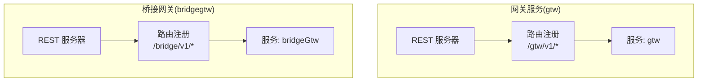
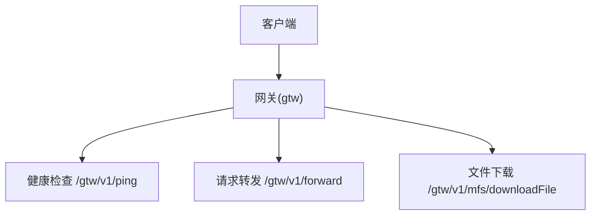
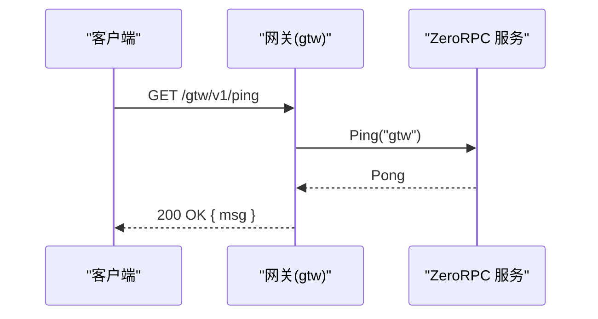
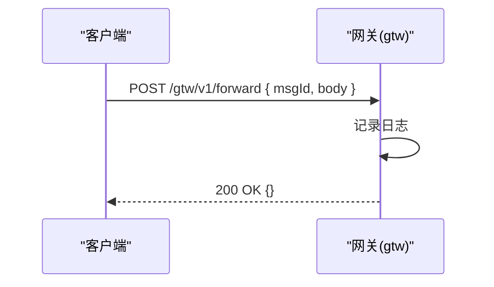
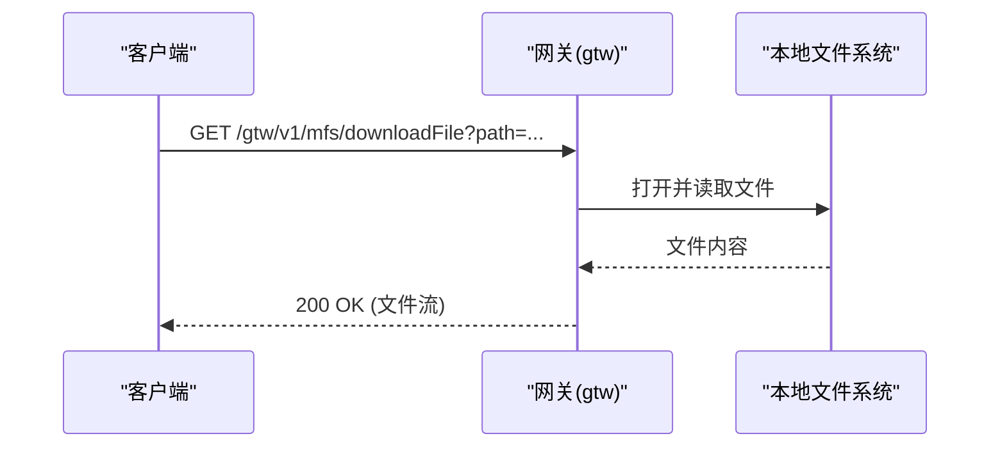
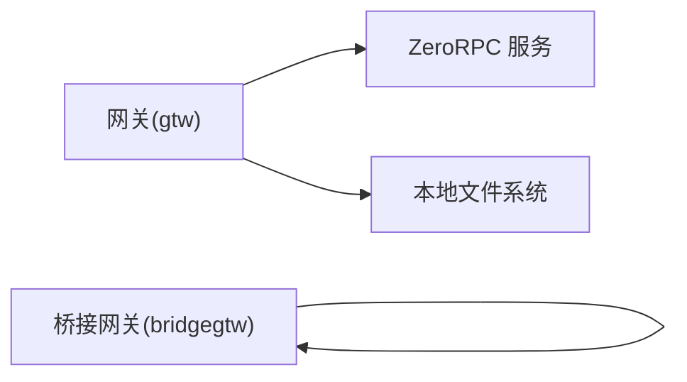

# 网关服务 API

<cite>
**本文引用的文件**
- [gtw.api](file://gtw/gtw.api)
- [routes.go](file://gtw/internal/handler/routes.go)
- [base.api](file://gtw/doc/base.api)
- [common.api](file://gtw/doc/common.api)
- [file.api](file://gtw/doc/file.api)
- [user.api](file://gtw/doc/user.api)
- [gtw.yaml](file://gtw/etc/gtw.yaml)
- [pinglogic.go](file://gtw/internal/logic/gtw/pinglogic.go)
- [forwardlogic.go](file://gtw/internal/logic/gtw/forwardlogic.go)
- [mfsdownloadfilelogic.go](file://gtw/internal/logic/gtw/mfsdownloadfilelogic.go)
- [bridgegtw.api](file://app/bridgegtw/bridgegtw.api)
- [bridgegtw.routes.go](file://app/bridgegtw/internal/handler/routes.go)
- [bridgegtw.yaml](file://app/bridgegtw/etc/bridgegtw.yaml)
- [bridgegtw.pinglogic.go](file://app/bridgegtw/internal/logic/bridgeGtw/pinglogic.go)
</cite>

## 目录
1. [简介](#简介)
2. [项目结构](#项目结构)
3. [核心组件](#核心组件)
4. [架构总览](#架构总览)
5. [详细组件分析](#详细组件分析)
6. [依赖分析](#依赖分析)
7. [性能考虑](#性能考虑)
8. [故障排查指南](#故障排查指南)
9. [结论](#结论)
10. [附录](#附录)

## 简介
本文件面向“网关服务”的基础 API，聚焦以下三个核心接口：
- 健康检查：GET /gtw/v1/ping
- 请求转发：POST /gtw/v1/forward
- 文件下载：GET /gtw/v1/mfs/downloadFile

文档将说明每个接口的 URL 路径、HTTP 方法、请求参数与响应格式；解释网关的路由前缀与分组机制；并提供接口调用示例、错误处理与状态码说明，以及客户端集成建议。

## 项目结构
网关服务由两部分组成：
- gtw（统一网关）：提供健康检查、请求转发、文件上传/下载等通用能力
- bridgegtw（桥接网关）：提供独立的健康检查接口，便于外部系统快速探测

二者均基于 go-zero 的 REST 路由注册机制，通过 API 描述文件与自动生成的路由注册代码进行绑定。

图表来源
- [routes.go:20-161](file://gtw/internal/handler/routes.go#L20-L161)
- [bridgegtw.routes.go:15-27](file://app/bridgegtw/internal/handler/routes.go#L15-L27)

章节来源
- [gtw.api:16-32](file://gtw/gtw.api#L16-L32)
- [bridgegtw.api:13-21](file://app/bridgegtw/bridgegtw.api#L13-L21)
- [routes.go:20-161](file://gtw/internal/handler/routes.go#L20-L161)
- [bridgegtw.routes.go:15-27](file://app/bridgegtw/internal/handler/routes.go#L15-L27)

## 核心组件
- 健康检查接口
  - 方法：GET
  - 路径：/gtw/v1/ping
  - 作用：校验网关服务可用性
- 请求转发接口
  - 方法：POST
  - 路径：/gtw/v1/forward
  - 作用：接收请求体并返回确认响应（日志记录）
- 文件下载接口
  - 方法：GET
  - 路径：/gtw/v1/mfs/downloadFile
  - 作用：根据文件路径从本地磁盘下载文件

章节来源
- [gtw.api:21-32](file://gtw/gtw.api#L21-L32)
- [routes.go:76-98](file://gtw/internal/handler/routes.go#L76-L98)

## 架构总览
下图展示了网关服务的路由前缀、服务分组与关键接口的调用关系：

图表来源
- [routes.go:76-98](file://gtw/internal/handler/routes.go#L76-L98)
- [gtw.api:21-32](file://gtw/gtw.api#L21-L32)

## 详细组件分析

### 健康检查接口（/gtw/v1/ping）
- 接口定义
  - 方法：GET
  - 路径：/gtw/v1/ping
  - 服务：gtw
- 请求参数
  - 无
- 响应数据
  - 字段：msg（字符串）
- 实现要点
  - gtw 侧通过 ZeroRPC 调用“ping”以验证下游服务连通性，并将结果映射到 PingReply.msg 返回
- 错误处理
  - ZeroRPC 调用失败时直接透传错误
- 状态码
  - 成功：200
  - 失败：500（ZeroRPC 调用异常）

图表来源
- [pinglogic.go:27-33](file://gtw/internal/logic/gtw/pinglogic.go#L27-L33)
- [routes.go:91-95](file://gtw/internal/handler/routes.go#L91-L95)

章节来源
- [gtw.api:21-23](file://gtw/gtw.api#L21-L23)
- [routes.go:91-95](file://gtw/internal/handler/routes.go#L91-L95)
- [pinglogic.go:27-33](file://gtw/internal/logic/gtw/pinglogic.go#L27-L33)

### 请求转发接口（/gtw/v1/forward）
- 接口定义
  - 方法：POST
  - 路径：/gtw/v1/forward
  - 服务：gtw
- 请求参数（JSON）
  - msgId（字符串）
  - body（字符串）
- 响应数据
  - 空对象
- 实现要点
  - 记录请求日志后返回空响应
- 错误处理
  - 当前实现不抛出错误，仅记录日志
- 状态码
  - 成功：200
  - 失败：500（如内部异常）

图表来源
- [forwardlogic.go:27-31](file://gtw/internal/logic/gtw/forwardlogic.go#L27-L31)
- [routes.go:79-83](file://gtw/internal/handler/routes.go#L79-L83)

章节来源
- [gtw.api:25-27](file://gtw/gtw.api#L25-L27)
- [routes.go:79-83](file://gtw/internal/handler/routes.go#L79-L83)
- [forwardlogic.go:27-31](file://gtw/internal/logic/gtw/forwardlogic.go#L27-L31)

### 文件下载接口（/gtw/v1/mfs/downloadFile）
- 接口定义
  - 方法：GET
  - 路径：/gtw/v1/mfs/downloadFile
  - 服务：gtw
- 请求参数（查询参数）
  - path（字符串，必填）
- 响应数据
  - 文件内容（二进制流）
- 实现要点
  - 通过本地文件系统读取目标路径并以 HTTP 流形式返回
- 错误处理
  - 文件不存在或读取失败时返回相应错误
- 状态码
  - 成功：200
  - 失败：404（文件不存在）、500（其他错误）

图表来源
- [mfsdownloadfilelogic.go:33-54](file://gtw/internal/logic/gtw/mfsdownloadfilelogic.go#L33-L54)
- [routes.go:85-89](file://gtw/internal/handler/routes.go#L85-L89)

章节来源
- [gtw.api:29-31](file://gtw/gtw.api#L29-L31)
- [routes.go:85-89](file://gtw/internal/handler/routes.go#L85-L89)
- [mfsdownloadfilelogic.go:33-54](file://gtw/internal/logic/gtw/mfsdownloadfilelogic.go#L33-L54)

### 路由配置与分组机制
- 网关（gtw）路由前缀与分组
  - /gtw/v1：服务组 gtw
  - /gtw/v1/pay：服务组 pay
  - /app/user/v1：服务组 user
  - /app/common/v1：服务组 common
  - /file/v1：服务组 file
- 桥接网关（bridgegtw）路由前缀与分组
  - /bridge/v1：服务组 bridgeGtw
- 路由注册
  - 通过自动生成的 routes.go 将 API 描述中的路径与处理器绑定，并应用前缀与可选超时、JWT 等中间件

章节来源
- [gtw.api:16-19](file://gtw/gtw.api#L16-L19)
- [gtw.api:34-46](file://gtw/gtw.api#L34-L46)
- [gtw.api:48-79](file://gtw/gtw.api#L48-L79)
- [gtw.api:81-94](file://gtw/gtw.api#L81-L94)
- [gtw.api:96-123](file://gtw/gtw.api#L96-L123)
- [bridgegtw.api:13-16](file://app/bridgegtw/bridgegtw.api#L13-L16)
- [routes.go:20-161](file://gtw/internal/handler/routes.go#L20-L161)
- [bridgegtw.routes.go:15-27](file://app/bridgegtw/internal/handler/routes.go#L15-L27)

### 数据模型与请求/响应字段
- 健康检查
  - 响应：msg（字符串）
- 请求转发
  - 请求：msgId（字符串）、body（字符串）
  - 响应：空对象
- 文件下载
  - 请求：path（字符串，查询参数）
  - 响应：文件二进制流
- 其他通用模型（来自 doc/base.api）
  - UploadFileRequest：包含文件类型、是否缩略图等表单字段
  - UploadFileReply：包含文件名、路径、大小、类型、URL、缩略图路径与 URL 等
  - DownloadFileRequest：包含文件路径
  - ImageMeta：图片元数据（经纬度、拍摄时间、尺寸、海拔、相机型号等）

章节来源
- [base.api:4-38](file://gtw/doc/base.api#L4-L38)

## 依赖分析
- 网关（gtw）
  - 依赖 ZeroRPC 用于健康检查
  - 依赖本地文件系统用于文件下载
- 桥接网关（bridgegtw）
  - 提供独立的健康检查，不依赖 ZeroRPC

图表来源
- [pinglogic.go:28-32](file://gtw/internal/logic/gtw/pinglogic.go#L28-L32)
- [mfsdownloadfilelogic.go:34-52](file://gtw/internal/logic/gtw/mfsdownloadfilelogic.go#L34-L52)
- [bridgegtw.pinglogic.go:27-30](file://app/bridgegtw/internal/logic/bridgeGtw/pinglogic.go#L27-L30)

章节来源
- [pinglogic.go:27-33](file://gtw/internal/logic/gtw/pinglogic.go#L27-L33)
- [mfsdownloadfilelogic.go:33-54](file://gtw/internal/logic/gtw/mfsdownloadfilelogic.go#L33-L54)
- [bridgegtw.pinglogic.go:27-30](file://app/bridgegtw/internal/logic/bridgeGtw/pinglogic.go#L27-L30)

## 性能考虑
- 超时设置
  - gtw.yaml 中定义了默认超时与最大字节数限制，可根据业务调整
- 文件下载
  - 使用 http.ServeFile 直接传输文件，避免一次性加载至内存，适合大文件场景
- 路由前缀与分组
  - 合理划分前缀与分组有助于负载均衡与可观测性

章节来源
- [gtw.yaml:4-6](file://gtw/etc/gtw.yaml#L4-L6)
- [routes.go:72-74](file://gtw/internal/handler/routes.go#L72-L74)

## 故障排查指南
- 健康检查失败
  - 检查 ZeroRPC 服务端点可达性与鉴权配置
  - 查看网关日志中对 ZeroRPC 的调用结果
- 请求转发无响应
  - 确认请求体 JSON 结构正确（msgId、body）
  - 查看网关日志中是否记录到请求
- 文件下载 404
  - 确认 path 参数指向的文件存在且可读
  - 检查 NFS 根目录与下载 URL 前缀配置
- 跨域问题
  - 如前端跨域访问，请在网关层添加 CORS 中间件（如需）

章节来源
- [pinglogic.go:28-32](file://gtw/internal/logic/gtw/pinglogic.go#L28-L32)
- [forwardlogic.go:27-31](file://gtw/internal/logic/gtw/forwardlogic.go#L27-L31)
- [mfsdownloadfilelogic.go:33-54](file://gtw/internal/logic/gtw/mfsdownloadfilelogic.go#L33-L54)
- [gtw.yaml:57-60](file://gtw/etc/gtw.yaml#L57-L60)

## 结论
本文档梳理了网关服务的基础 API：健康检查、请求转发与文件下载，并明确了路由前缀与分组机制、数据模型、错误处理与状态码。结合配置文件与实现代码，可快速完成接口调用与客户端集成。

## 附录

### 接口调用示例（curl）
- 健康检查
  - curl -i http://127.0.0.1:11001/gtw/v1/ping
- 请求转发
  - curl -i -X POST http://127.0.0.1:11001/gtw/v1/forward -H "Content-Type: application/json" -d '{"msgId":"1","body":"hello"}'
- 文件下载
  - curl -O -J "http://127.0.0.1:11001/gtw/v1/mfs/downloadFile?path=/opt/nfs/example.jpg"

章节来源
- [routes.go:91-95](file://gtw/internal/handler/routes.go#L91-L95)
- [routes.go:79-83](file://gtw/internal/handler/routes.go#L79-L83)
- [routes.go:85-89](file://gtw/internal/handler/routes.go#L85-L89)
- [gtw.yaml:60-60](file://gtw/etc/gtw.yaml#L60-L60)

### 客户端集成指南
- 健康检查
  - 建议定时轮询 /gtw/v1/ping，作为探活指标
- 请求转发
  - 前端或上游服务可将任意 JSON 体通过 POST /gtw/v1/forward 上送，网关记录日志并返回确认
- 文件下载
  - 使用 /gtw/v1/mfs/downloadFile?path=... 获取文件，注意 path 必须指向网关所在机器上的真实文件路径
- 路由前缀
  - 所有接口均以 /gtw/v1 前缀访问；如需对接桥接网关，使用 /bridge/v1 前缀

章节来源
- [routes.go:76-98](file://gtw/internal/handler/routes.go#L76-L98)
- [bridgegtw.routes.go:15-27](file://app/bridgegtw/internal/handler/routes.go#L15-L27)