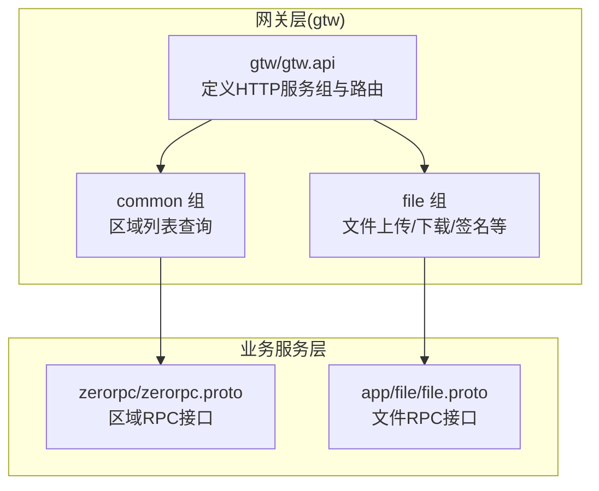
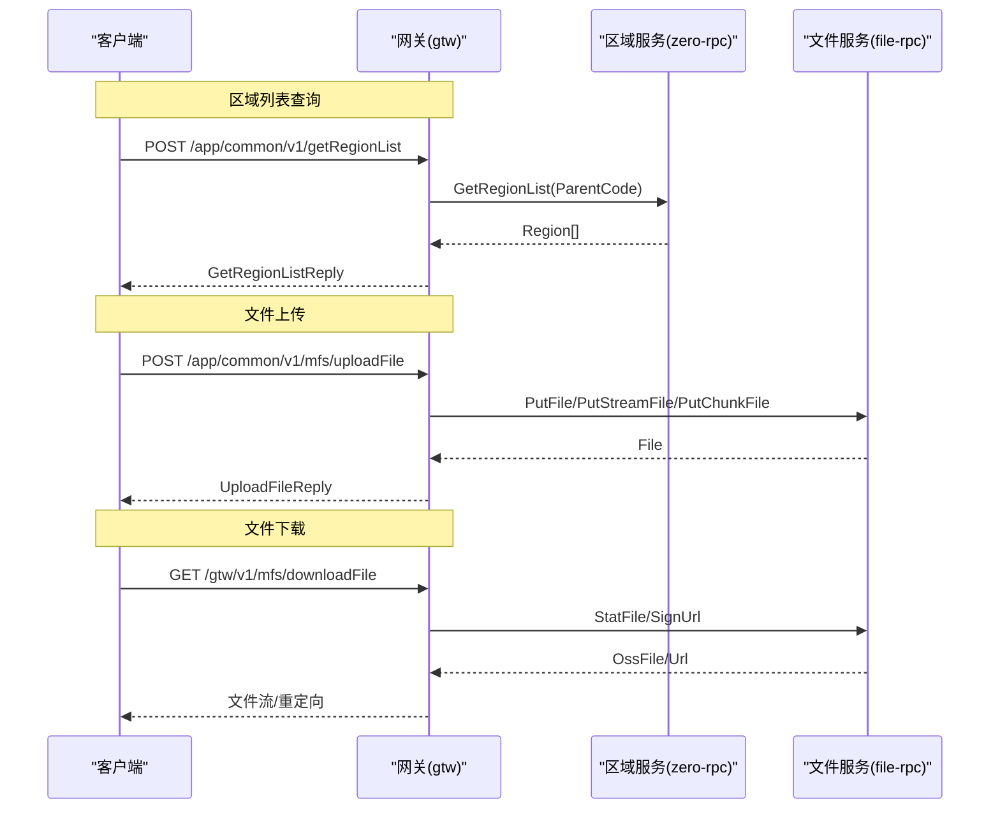
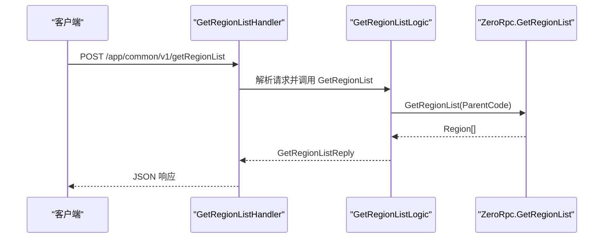
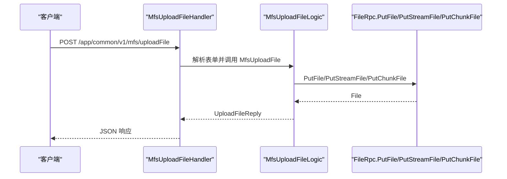
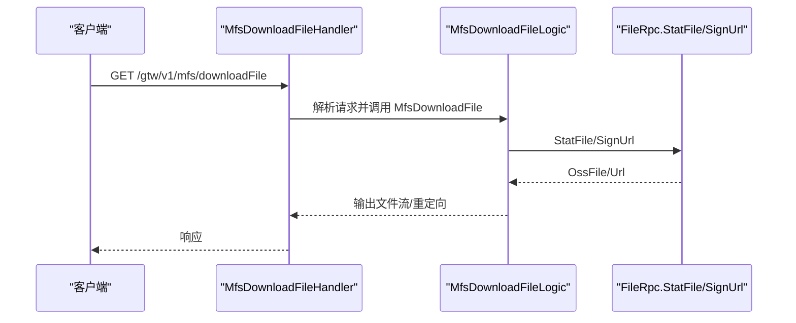
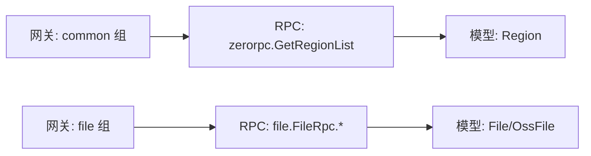

# 通用服务 API

<cite>
**本文引用的文件**
- [gtw.api](file://gtw/gtw.api)
- [common.api](file://gtw/doc/common.api)
- [file.api](file://gtw/doc/file.api)
- [zerorpc.proto](file://zerorpc/zerorpc.proto)
- [file.proto](file://app/file/file.proto)
- [getRegionListHandler.go](file://gtw/internal/handler/common/getRegionListHandler.go)
- [getRegionListLogic.go](file://gtw/internal/logic/common/getRegionListLogic.go)
- [mfsuploadfilehandler.go](file://gtw/internal/handler/common/mfsuploadfilehandler.go)
- [mfsdownloadfilehandler.go](file://gtw/internal/handler/gtw/mfsdownloadfilehandler.go)
</cite>

## 目录
1. [简介](#简介)
2. [项目结构](#项目结构)
3. [核心组件](#核心组件)
4. [架构总览](#架构总览)
5. [详细组件分析](#详细组件分析)
6. [依赖关系分析](#依赖关系分析)
7. [性能考虑](#性能考虑)
8. [故障排查指南](#故障排查指南)
9. [结论](#结论)
10. [附录](#附录)

## 简介
本文件面向通用服务的 HTTP API，聚焦两类能力：
- 区域列表查询：基于网关层对零代码 RPC 服务的封装，提供标准 HTTP 接口。
- 文件上传与下载：提供通用文件上传入口与下载入口，结合后端对象存储能力完成全链路文件处理。

文档将系统性说明接口设计原则、复用机制、请求参数、响应格式与业务逻辑，并给出从上传到下载的完整流程图与调用示例、常见问题与排障建议。

## 项目结构
通用服务 API 的组织方式采用“网关层 + 业务服务层”的分层设计：
- 网关层（gtw）：通过 API 描述文件定义 HTTP 接口，绑定处理器与逻辑层。
- 业务服务层：
  - 区域服务：通过 zerorpc.proto 定义 RPC 接口，网关层在 common 组下暴露 HTTP 入口。
  - 文件服务：通过 file.proto 定义对象存储相关 RPC 接口，网关层在 file 组下暴露 HTTP 入口。

图表来源
- [gtw.api:81-94](file://gtw/gtw.api#L81-L94)
- [zerorpc.proto:43-62](file://zerorpc/zerorpc.proto#L43-L62)
- [file.proto:176-225](file://app/file/file.proto#L176-L225)

章节来源
- [gtw.api:1-123](file://gtw/gtw.api#L1-L123)

## 核心组件
- 区域列表查询接口
  - HTTP 方法与路径：POST /app/common/v1/getRegionList
  - 请求体：GetRegionListRequest（包含父区划编号）
  - 响应体：GetRegionListReply（包含区域数组）
  - 业务逻辑：调用 zerorpc.GetRegionList，返回标准化区域数据
- 文件上传接口
  - HTTP 方法与路径：POST /app/common/v1/mfs/uploadFile
  - 请求体：UploadFileRequest（包含租户ID、资源编号、存储桶名称、是否缩略图等）
  - 响应体：UploadFileReply（包含文件信息）
  - 业务逻辑：网关层解析表单并转发至文件服务 RPC，最终落盘并返回文件元数据
- 文件下载接口
  - HTTP 方法与路径：GET /gtw/v1/mfs/downloadFile
  - 请求体：DownloadFileRequest（包含租户ID、资源编号、存储桶名称、文件名等）
  - 响应：直接输出文件流或重定向到签名 URL
  - 业务逻辑：根据请求参数生成签名 URL 或直接读取对象存储文件流

章节来源
- [gtw.api:81-94](file://gtw/gtw.api#L81-L94)
- [gtw.api:29-32](file://gtw/gtw.api#L29-L32)
- [common.api:4-22](file://gtw/doc/common.api#L4-L22)
- [file.api:28-57](file://gtw/doc/file.api#L28-L57)

## 架构总览
通用服务 API 的整体交互链路如下：

图表来源
- [gtw.api:81-94](file://gtw/gtw.api#L81-L94)
- [gtw.api:29-32](file://gtw/gtw.api#L29-L32)
- [zerorpc.proto:43-62](file://zerorpc/zerorpc.proto#L43-L62)
- [file.proto:176-225](file://app/file/file.proto#L176-L225)

## 详细组件分析

### 区域列表查询接口
- 设计原则
  - 网关层统一收敛 RPC 接口，对外暴露标准 HTTP 接口，便于前端与多端调用。
  - 参数最小化：仅需父区划编号即可递归查询子区域。
- 请求参数
  - GetRegionListRequest
    - parentCode：父区划编号（字符串）
- 响应格式
  - GetRegionListReply
    - region：Region 数组
      - code：区划编号
      - parentCode：父区划编号
      - name：区划名称
      - provinceCode/cityCode/districtCode：省/市/区编号
      - provinceName/cityName/districtName：省/市/区名称
      - regionLevel：层级
- 业务逻辑
  - 网关处理器解析请求 -> 调用 ZeroRpcCli.GetRegionList -> 使用结构体拷贝将 RPC 结果映射为 HTTP 响应 -> 返回 JSON

图表来源
- [getRegionListHandler.go:14-30](file://gtw/internal/handler/common/getRegionListHandler.go#L14-L30)
- [getRegionListLogic.go:29-37](file://gtw/internal/logic/common/getRegionListLogic.go#L29-L37)
- [zerorpc.proto:43-62](file://zerorpc/zerorpc.proto#L43-L62)

章节来源
- [gtw.api:86-90](file://gtw/gtw.api#L86-L90)
- [common.api:4-22](file://gtw/doc/common.api#L4-L22)
- [getRegionListHandler.go:14-30](file://gtw/internal/handler/common/getRegionListHandler.go#L14-L30)
- [getRegionListLogic.go:29-37](file://gtw/internal/logic/common/getRegionListLogic.go#L29-L37)

### 文件上传接口
- 设计原则
  - 通过网关层统一封装上传入口，隐藏底层对象存储细节。
  - 支持多种上传模式（普通、流式、分片），由后端 RPC 选择合适策略。
- 请求参数
  - UploadFileRequest（来自 file.api）
    - tenantId：租户ID（字符串）
    - code：资源编号（字符串）
    - bucketName：存储桶名称（字符串）
    - isThumb：是否缩略图（布尔，可选）
- 响应格式
  - UploadFileReply（来自 file.api）
    - file：File 对象
      - link/domain/name/size/formatSize/originalName/attachId/md5/meta/thumbLink/thumbName
- 业务逻辑
  - 网关处理器解析表单 -> 调用文件服务 RPC PutFile/PutStreamFile/PutChunkFile -> 返回文件元数据

图表来源
- [mfsuploadfilehandler.go:14-30](file://gtw/internal/handler/common/mfsuploadfilehandler.go#L14-L30)
- [file.api:28-36](file://gtw/doc/file.api#L28-L36)
- [file.proto:176-225](file://app/file/file.proto#L176-L225)

章节来源
- [gtw.api:91-94](file://gtw/gtw.api#L91-L94)
- [file.api:28-36](file://gtw/doc/file.api#L28-L36)
- [mfsuploadfilehandler.go:14-30](file://gtw/internal/handler/common/mfsuploadfilehandler.go#L14-L30)

### 文件下载接口
- 设计原则
  - 提供统一下载入口，支持签名 URL 与直链两种模式，兼顾安全与性能。
- 请求参数
  - DownloadFileRequest（来自 gtw.api）
    - tenantId/code/bucketName/filename/expires 等（具体字段以实际类型为准）
- 响应行为
  - 可能返回 JSON（含签名 URL）或直接输出文件流（根据实现）

图表来源
- [mfsdownloadfilehandler.go:14-30](file://gtw/internal/handler/gtw/mfsdownloadfilehandler.go#L14-L30)
- [gtw.api:29-32](file://gtw/gtw.api#L29-L32)
- [file.proto:151-174](file://app/file/file.proto#L151-L174)

章节来源
- [gtw.api:29-32](file://gtw/gtw.api#L29-L32)
- [mfsdownloadfilehandler.go:14-30](file://gtw/internal/handler/gtw/mfsdownloadfilehandler.go#L14-L30)

## 依赖关系分析
- 网关层依赖
  - common 组依赖 zerorpc.GetRegionList
  - file 组依赖 file.FileRpc.PutFile/PutStreamFile/PutChunkFile/StatFile/SignUrl
- 数据模型依赖
  - 区域列表使用 zerorpc.Region
  - 文件上传/下载使用 file.File/file.OssFile

图表来源
- [gtw.api:81-94](file://gtw/gtw.api#L81-L94)
- [zerorpc.proto:43-62](file://zerorpc/zerorpc.proto#L43-L62)
- [file.proto:34-67](file://app/file/file.proto#L34-L67)

章节来源
- [gtw.api:81-94](file://gtw/gtw.api#L81-L94)
- [zerorpc.proto:43-62](file://zerorpc/zerorpc.proto#L43-L62)
- [file.proto:34-67](file://app/file/file.proto#L34-L67)

## 性能考虑
- 上传性能
  - 优先使用流式上传（PutStreamFile）以降低内存占用，适合大文件。
  - 分片上传（PutChunkFile）适用于网络不稳定场景，具备断点续传能力。
- 下载性能
  - 对于公开文件，可直接返回文件流；对于私有文件，优先生成带过期时间的签名 URL，减少鉴权开销。
- 缓存与压缩
  - 对于频繁访问的静态资源，建议在 CDN 层做缓存与压缩，缩短首包时延。
- 错峰与削峰
  - 上传高峰可通过队列异步处理，避免瞬时压力导致的失败。

## 故障排查指南
- 区域列表查询
  - 症状：返回空列表或报错
  - 排查要点：
    - 确认 parentCode 是否正确
    - 检查 ZeroRpc 服务可用性与网络连通
    - 查看网关日志与 RPC 调用耗时
- 文件上传
  - 症状：上传失败、超时、文件大小异常
  - 排查要点：
    - 确认 tenantId/code/bucketName 是否存在且有效
    - 检查对象存储服务状态与配额
    - 对于流式/分片上传，确认客户端是否按协议发送数据
- 文件下载
  - 症状：签名 URL 无法访问、下载速度慢
  - 排查要点：
    - 检查 expires 设置是否合理
    - 确认签名算法与密钥配置
    - 核对 CDN/反向代理配置

## 结论
通用服务 API 通过网关层对 RPC 服务进行统一封装，实现了区域列表查询与文件上传/下载的标准化接入。其设计遵循“接口稳定、内部灵活”的原则，既保证了对外的一致性，又为后续扩展与优化提供了空间。建议在生产环境中结合业务特性选择合适的上传模式，并配合 CDN 与签名 URL 提升性能与安全性。

## 附录

### 接口调用示例（路径参考）
- 区域列表查询
  - 方法：POST
  - 路径：/app/common/v1/getRegionList
  - 请求体字段：parentCode（字符串）
  - 响应体字段：region[]（包含 code、parentCode、name、province*、city*、district*、regionLevel）
  - 参考实现位置：
    - [gtw.api:86-90](file://gtw/gtw.api#L86-L90)
    - [getRegionListHandler.go:14-30](file://gtw/internal/handler/common/getRegionListHandler.go#L14-L30)
    - [getRegionListLogic.go:29-37](file://gtw/internal/logic/common/getRegionListLogic.go#L29-L37)
- 文件上传
  - 方法：POST
  - 路径：/app/common/v1/mfs/uploadFile
  - 表单字段：tenantId、code、bucketName、isThumb
  - 响应体字段：file（包含 link、domain、name、size、formatSize、originalName、attachId、md5、meta、thumbLink、thumbName）
  - 参考实现位置：
    - [gtw.api:91-94](file://gtw/gtw.api#L91-L94)
    - [file.api:28-36](file://gtw/doc/file.api#L28-L36)
    - [mfsuploadfilehandler.go:14-30](file://gtw/internal/handler/common/mfsuploadfilehandler.go#L14-L30)
- 文件下载
  - 方法：GET
  - 路径：/gtw/v1/mfs/downloadFile
  - 请求参数：tenantId、code、bucketName、filename、expires 等
  - 响应：JSON（含签名 URL）或文件流
  - 参考实现位置：
    - [gtw.api:29-32](file://gtw/gtw.api#L29-L32)
    - [mfsdownloadfilehandler.go:14-30](file://gtw/internal/handler/gtw/mfsdownloadfilehandler.go#L14-L30)