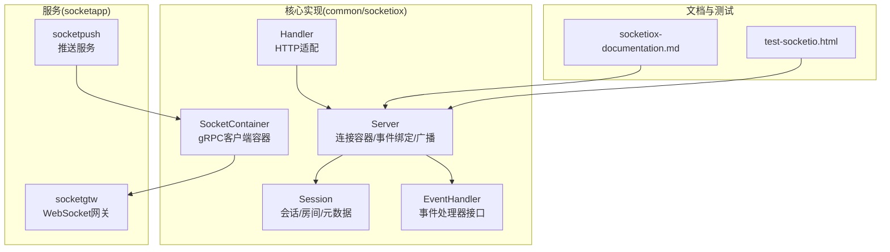
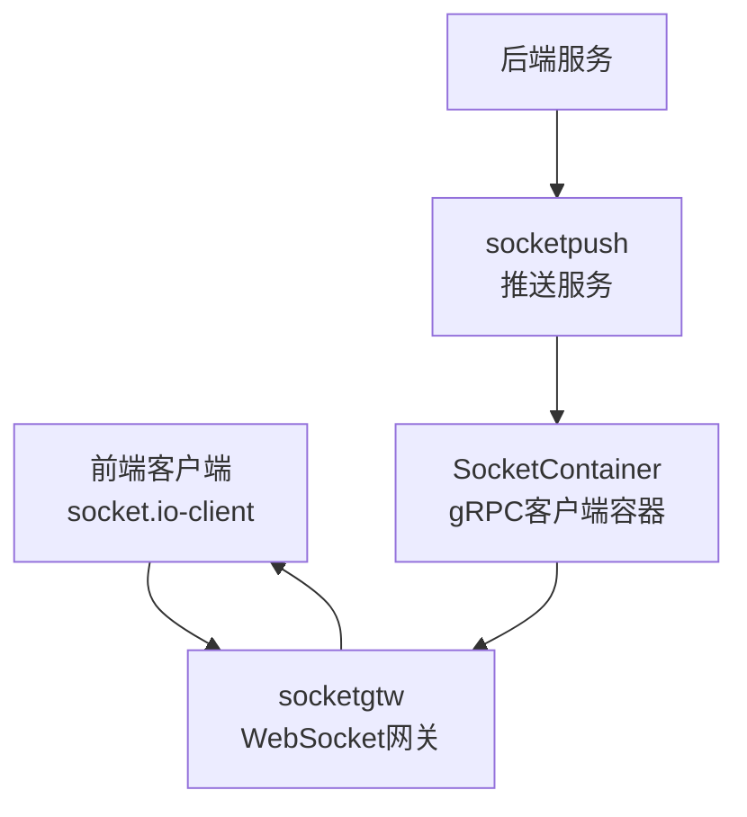
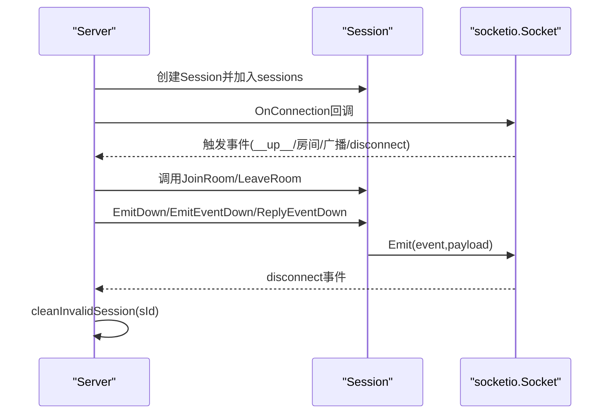
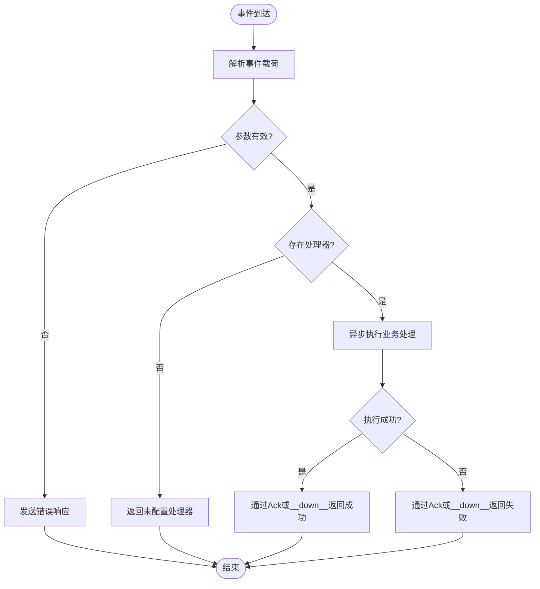
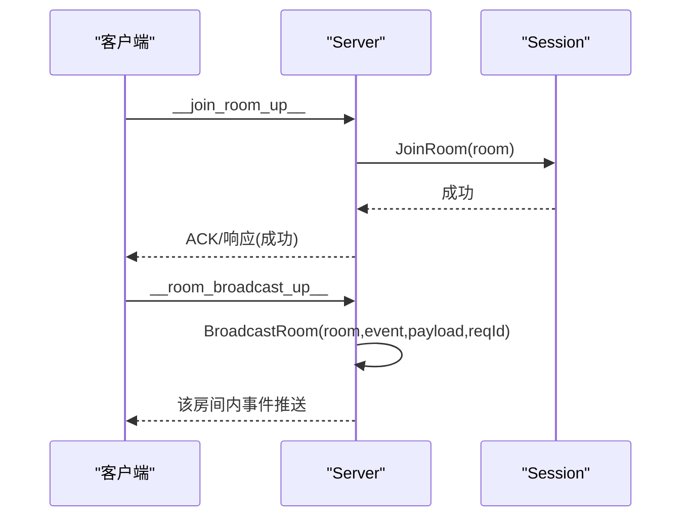
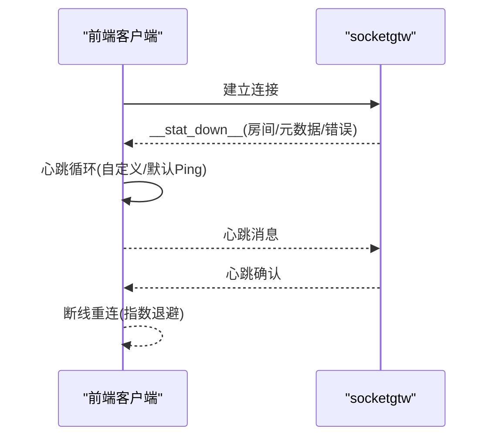
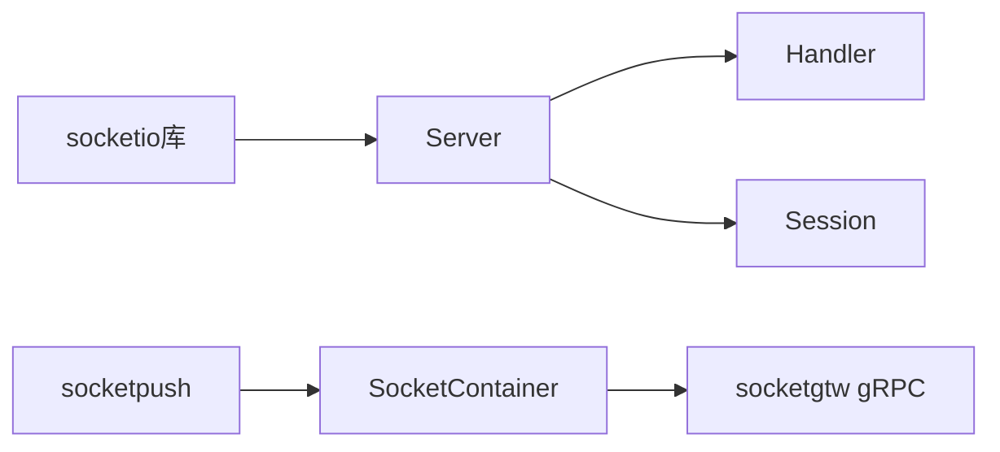

# Socket.IO 核心实现

<cite>
**本文档引用的文件**
- [server.go](file://common/socketiox/server.go)
- [container.go](file://common/socketiox/container.go)
- [handler.go](file://common/socketiox/handler.go)
- [socketiox-documentation.md](file://docs/socketiox-documentation.md)
- [config.go](file://socketapp/socketgtw/internal/config/config.go)
- [socketgtw.yaml](file://socketapp/socketgtw/etc/socketgtw.yaml)
- [socketpush.yaml](file://socketapp/socketpush/etc/socketpush.yaml)
- [test-socketio.html](file://common/socketiox/test-socketio.html)
- [client.go](file://common/wsx/client.go)
</cite>

## 目录
1. [引言](#引言)
2. [项目结构](#项目结构)
3. [核心组件](#核心组件)
4. [架构总览](#架构总览)
5. [详细组件分析](#详细组件分析)
6. [依赖关系分析](#依赖关系分析)
7. [性能考虑](#性能考虑)
8. [故障排查指南](#故障排查指南)
9. [结论](#结论)
10. [附录](#附录)

## 引言
本文件面向 Socket.IO 核心实现，系统性阐述服务器端架构、连接容器管理、处理器机制、连接生命周期、房间容器设计、消息路由算法、并发处理与内存优化、服务器启动配置、网络参数调优、连接状态监控、心跳检测与断线重连、消息序列化与传输优化，并提供性能基准与容量规划建议。目标是帮助开发者快速理解并高效运维该 Socket.IO 实现。

## 项目结构
Socket.IO 核心实现位于 common/socketiox 包，配套有 socketapp/socketgtw 与 socketapp/socketpush 两个服务，以及文档与测试工具：
- common/socketiox：核心服务端实现（Server、Session、事件处理、HTTP适配）
- socketapp/socketgtw：WebSocket 网关服务（连接管理、房间管理、消息路由、鉴权）
- socketapp/socketpush：推送服务（令牌生成/校验、gRPC 推送入口）
- docs/socketiox-documentation.md：客户端对接与事件规范文档
- socketapp/*/etc/*.yaml：服务配置样例
- common/socketiox/test-socketio.html：前端测试工具



**图表来源**
- [server.go:299-312](file://common/socketiox/server.go#L299-L312)
- [container.go:30-33](file://common/socketiox/container.go#L30-L33)
- [handler.go:19-40](file://common/socketiox/handler.go#L19-L40)
- [socketiox-documentation.md:1-656](file://docs/socketiox-documentation.md#L1-L656)

**章节来源**
- [server.go:1-814](file://common/socketiox/server.go#L1-L814)
- [container.go:1-426](file://common/socketiox/container.go#L1-L426)
- [handler.go:1-41](file://common/socketiox/handler.go#L1-L41)
- [socketiox-documentation.md:1-656](file://docs/socketiox-documentation.md#L1-L656)

## 核心组件
- Server：Socket.IO 服务器核心，负责连接接入、鉴权、事件绑定、房间广播、全局广播、会话统计推送、会话清理与查询。
- Session：单个连接的抽象，封装 socket、元数据、房间集合、加锁保护与房间加入/离开。
- EventHandler/EventHandlers：事件处理器接口与注册表，支持自定义业务事件。
- Handler：将 Server 适配为 HTTP 处理器，供 go-zero Web 服务使用。
- SocketContainer：gRPC 客户端容器，支持直连、Etcd、Nacos 三种发现方式，动态维护客户端集合。

**章节来源**
- [server.go:119-312](file://common/socketiox/server.go#L119-L312)
- [handler.go:9-40](file://common/socketiox/handler.go#L9-L40)
- [container.go:30-61](file://common/socketiox/container.go#L30-L61)

## 架构总览
Socket.IO 核心实现采用“网关 + 推送”的双服务架构：
- socketgtw：WebSocket 网关，承载客户端连接、房间管理、消息路由、鉴权与统计推送。
- socketpush：推送服务，提供令牌生成/校验与 gRPC 推送入口，后端服务通过 socketpush 将消息推送到 socketgtw，再由 socketgtw 推送给前端。
- SocketContainer：socketpush 侧维护 socketgtw 的 gRPC 客户端集合，支持多实例动态发现与负载。



**图表来源**
- [socketiox-documentation.md:16-22](file://docs/socketiox-documentation.md#L16-L22)
- [container.go:30-61](file://common/socketiox/container.go#L30-L61)

**章节来源**
- [socketiox-documentation.md:1-656](file://docs/socketiox-documentation.md#L1-L656)
- [container.go:1-426](file://common/socketiox/container.go#L1-L426)

## 详细组件分析

### Server 组件分析
Server 是核心控制中心，负责：
- 连接接入与鉴权：OnAuthentication、OnConnection
- 事件绑定：__up__、__join_room_up__、__leave_room_up__、__room_broadcast_up__、__global_broadcast_up__、disconnect
- 广播能力：BroadcastRoom、BroadcastGlobal
- 会话管理：sessions 映射、SessionCount、GetSession、按元数据查找
- 统计推送：statLoop 定时推送 __stat_down__
- 生命周期钩子：ConnectHook、DisconnectHook、PreJoinRoomHook
- 上下文提取：ContextKeys 提取 Token 声明为 Session 元数据

```mermaid
classDiagram
class Server {
-Io : socketio.Io
-eventHandlers : EventHandlers
-sessions : map[string]*Session
-lock : RWMutex
-statInterval : duration
-stopChan : chan
-contextKeys : []string
-tokenValidator : TokenValidator
-tokenValidatorWithClaims : TokenValidatorWithClaims
-connectHook : ConnectHook
-disconnectHook : DisconnectHook
-preJoinRoomHook : PreJoinRoomHook
+NewServer(opts) *Server
+HttpHandler() http.Handler
+BroadcastRoom(room,event,payload,reqId) error
+BroadcastGlobal(event,payload,reqId) error
+statLoop() void
+SessionCount() int
+GetSession(id) *Session
+GetSessionByKey(key,value) ([]*Session,bool)
+JoinRoom(sId,room) void
+LeaveRoom(sId,room) void
}
class Session {
-id : string
-socket : socketio.Socket
-lock : Mutex
-metadata : map[string]string
-roomLoadError : string
+Close() error
+ID() string
+GetMetadata(key) interface{}
+AllMetadata() map[string]string
+SetMetadata(key,val) void
+EmitAny(event,payload) error
+EmitString(event,msg) error
+EmitDown(event,payload,reqId) error
+EmitEventDown(data) error
+ReplyEventDown(code,msg,payload,reqId) error
+JoinRoom(room) error
+LeaveRoom(room) error
}
class EventHandler {
<<interface>>
+Handle(ctx,event,payload) (string,error)
}
Server --> Session : "管理"
Server --> EventHandler : "注册/调用"
```

**图表来源**
- [server.go:119-312](file://common/socketiox/server.go#L119-L312)
- [server.go:399-675](file://common/socketiox/server.go#L399-L675)

**章节来源**
- [server.go:299-760](file://common/socketiox/server.go#L299-L760)

### Session 组件分析
Session 封装单个连接的生命周期与能力：
- 元数据管理：SetMetadata/GetMetadata/AllMetadata，仅接受非空字符串值
- 房间管理：JoinRoom/LeaveRoom，幂等加入、线程安全
- 消息发送：EmitAny/EmitString/EmitDown/EmitEventDown/ReplyEventDown
- 关闭连接：Close



**图表来源**
- [server.go:350-641](file://common/socketiox/server.go#L350-L641)

**章节来源**
- [server.go:119-232](file://common/socketiox/server.go#L119-L232)

### 事件处理与消息路由
- 默认事件：
  - __up__：客户端上行消息，Server 解析 SocketUpReq，异步调用 EventHandlers[EventUp]，返回 __down__ 或通过 Ack
  - __join_room_up__/__leave_room_up__：房间加入/离开，支持 PreJoinRoomHook
  - __room_broadcast_up__/__global_broadcast_up__：房间/全局广播，Server 调用 BroadcastRoom/BroadcastGlobal
- 自定义事件：除 __down__ 与 __up__ 外的事件，Server 为每个注册事件创建 socket.On 回调
- 返回机制：ack 优先；若无 ack，则通过 __down__ 事件推送 SocketResp



**图表来源**
- [server.go:469-531](file://common/socketiox/server.go#L469-L531)
- [server.go:532-619](file://common/socketiox/server.go#L532-L619)

**章节来源**
- [server.go:399-675](file://common/socketiox/server.go#L399-L675)

### 房间容器设计
- Server 维护 sessions 映射与房间集合
- Session.JoinRoom/LeaveRoom 支持幂等与线程安全
- BroadcastRoom/BroadcastGlobal 基于 socketio.Io.To/全局 Emit 实现
- 统计推送 __stat_down__ 包含房间列表与元数据



**图表来源**
- [server.go:392-468](file://common/socketiox/server.go#L392-L468)
- [server.go:678-700](file://common/socketiox/server.go#L678-L700)

**章节来源**
- [server.go:204-232](file://common/socketiox/server.go#L204-L232)
- [server.go:678-700](file://common/socketiox/server.go#L678-L700)

### 并发连接处理与内存管理
- 并发模型：事件回调内部使用 threading.GoSafe 包裹，避免阻塞主事件循环
- 会话统计：statLoop 按配置周期推送 __stat_down__，内部使用 GoSafe 异步推送
- 内存优化：Session 元数据仅保存字符串值；SessionCount/GetSessionByKey 提供按元数据寻址能力，减少遍历成本
- 会话清理：disconnect 钩子触发后清理 sessions 映射，防止内存泄漏

**章节来源**
- [server.go:494-531](file://common/socketiox/server.go#L494-L531)
- [server.go:702-740](file://common/socketiox/server.go#L702-L740)
- [server.go:742-760](file://common/socketiox/server.go#L742-L760)

### 服务器启动配置与网络参数
- socketgtw.yaml：监听端口、HTTP 配置、JWT 密钥、SocketMetaData、StreamEventConf 等
- socketpush.yaml：监听端口、JWT 配置、SocketGtwConf 等
- Handler：NewSocketioHandler 将 Server 适配为 HTTP 处理器，供 go-zero Web 服务使用

**章节来源**
- [socketgtw.yaml:1-37](file://socketapp/socketgtw/etc/socketgtw.yaml#L1-L37)
- [socketpush.yaml:1-28](file://socketapp/socketpush/etc/socketpush.yaml#L1-L28)
- [handler.go:19-40](file://common/socketiox/handler.go#L19-L40)

### 连接状态监控、心跳检测与断线重连
- 连接状态监控：Server.statLoop 周期推送 __stat_down__，包含房间列表、命名空间、元数据与房间加载错误
- 心跳检测：前端 WebSocket 客户端具备心跳循环与指数退避重连机制
- 断线重连：客户端监听 disconnect 事件，可选择断联后重连或提示错误



**图表来源**
- [server.go:702-740](file://common/socketiox/server.go#L702-L740)
- [client.go:641-697](file://common/wsx/client.go#L641-L697)

**章节来源**
- [server.go:702-740](file://common/socketiox/server.go#L702-L740)
- [client.go:435-697](file://common/wsx/client.go#L435-L697)

### 消息序列化、压缩与传输优化
- 消息序列化：统一使用 JSON 编解码，SocketResp、SocketDown、StatDown 等结构体序列化
- 传输优化：gRPC 客户端默认设置 MaxCallSendMsgSize 为 50MB，避免大消息传输限制
- 事件命名约束：禁止使用 __down__ 作为自定义事件名，避免与响应事件冲突

**章节来源**
- [server.go:74-93](file://common/socketiox/server.go#L74-L93)
- [container.go:113-117](file://common/socketiox/container.go#L113-L117)
- [server.go:683-696](file://common/socketiox/server.go#L683-L696)

## 依赖关系分析
- Server 依赖 socketio 库进行连接与事件处理
- Handler 依赖 Server 的 HttpHandler 输出 HTTP 适配
- SocketContainer 依赖 go-zero discov/nacos 与 grpc 客户端，支持多种服务发现
- socketpush 通过 SocketContainer 调用 socketgtw 的 gRPC 接口



**图表来源**
- [server.go:3-18](file://common/socketiox/server.go#L3-L18)
- [handler.go:19-35](file://common/socketiox/handler.go#L19-L35)
- [container.go:1-28](file://common/socketiox/container.go#L1-L28)

**章节来源**
- [server.go:1-18](file://common/socketiox/server.go#L1-L18)
- [container.go:1-28](file://common/socketiox/container.go#L1-L28)

## 性能考虑
- 并发模型：事件回调均通过 GoSafe 异步执行，避免阻塞主循环，提升吞吐
- 统计推送：statLoop 采用周期性推送，避免每事件都同步推送，降低开销
- gRPC 传输：设置合理的 MaxCallSendMsgSize，满足大消息场景
- 会话管理：按元数据查找使用 O(n) 遍历，建议结合业务场景控制元数据数量与查询频率
- 房间广播：基于 socketio 内部广播，避免应用层重复派发

[本节为通用性能建议，无需特定文件引用]

## 故障排查指南
- 房间加载错误：客户端监听 __stat_down__，若 roomLoadError 非空，可选择断联重连或提示错误
- 参数错误：__up__/房间/广播事件需满足必填字段，否则返回 400
- 未配置处理器：EventHandlers[EventUp] 未注册时返回 500
- 连接断开：监听 disconnect 事件，结合日志定位原因
- gRPC 客户端异常：检查 SocketContainer 的服务发现与实例健康状态

**章节来源**
- [socketiox-documentation.md:411-446](file://docs/socketiox-documentation.md#L411-L446)
- [server.go:111-117](file://common/socketiox/server.go#L111-L117)
- [server.go:496-529](file://common/socketiox/server.go#L496-L529)

## 结论
该 Socket.IO 核心实现以清晰的 Server/Session 分层、灵活的事件处理器机制、完善的房间与广播能力为基础，结合统计推送、鉴权与钩子扩展点，形成可运维、可扩展的实时通信基础设施。配合 socketpush 的 gRPC 推送与 SocketContainer 的多发现方式，能够支撑高并发与多实例部署场景。

## 附录
- 客户端对接：参考文档中的事件体系、数据结构与最佳实践
- 测试工具：使用 test-socketio.html 快速验证连接、房间与广播功能
- 配置参考：socketgtw.yaml 与 socketpush.yaml 提供关键参数说明

**章节来源**
- [socketiox-documentation.md:66-656](file://docs/socketiox-documentation.md#L66-L656)
- [test-socketio.html:1-1430](file://common/socketiox/test-socketio.html#L1-L1430)