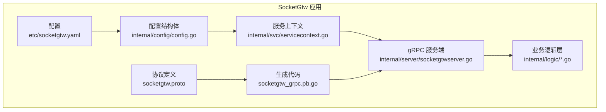
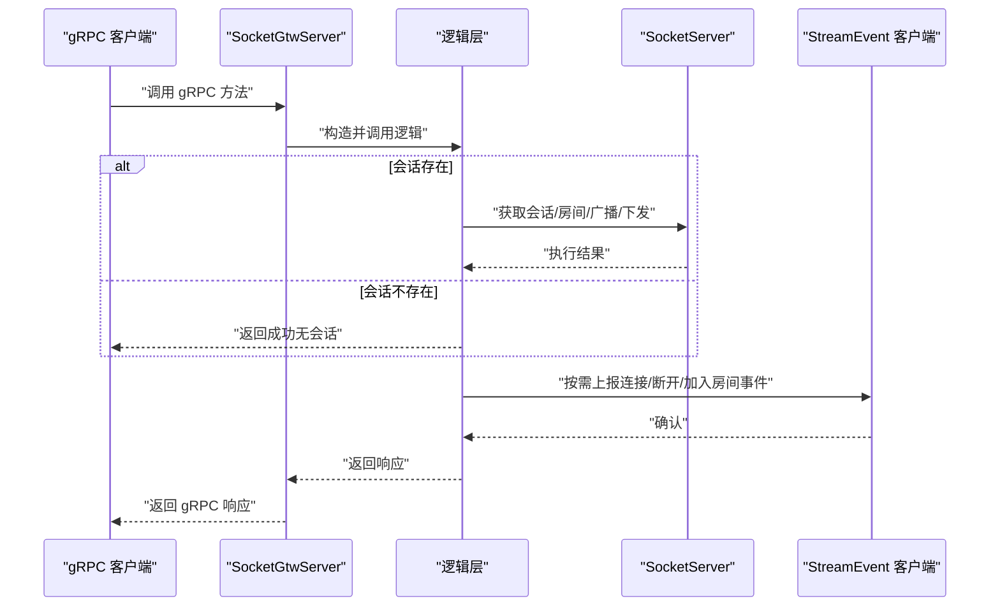
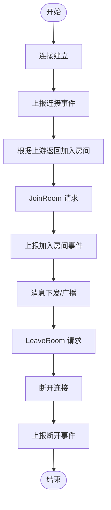
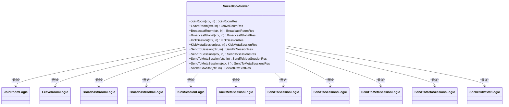
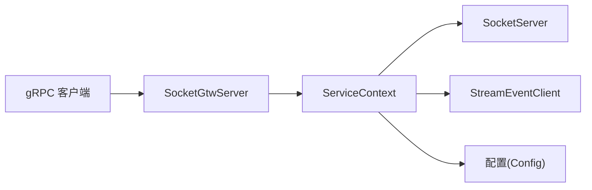
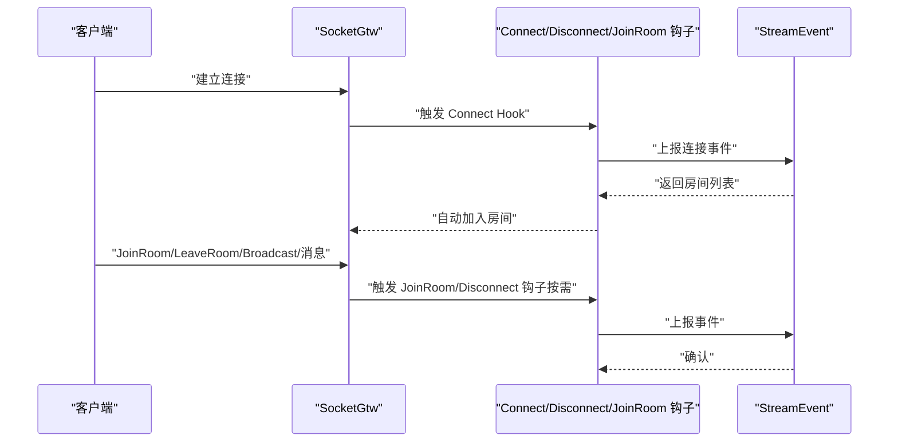

# SocketGtw 连接网关

<cite>
**本文引用的文件**
- [socketgtw.proto](file://socketapp/socketgtw/socketgtw/socketgtw.proto)
- [socketgtw_grpc.pb.go](file://socketapp/socketgtw/socketgtw/socketgtw_grpc.pb.go)
- [socketgtw.yaml](file://socketapp/socketgtw/etc/socketgtw.yaml)
- [config.go](file://socketapp/socketgtw/internal/config/config.go)
- [servicecontext.go](file://socketapp/socketgtw/internal/svc/servicecontext.go)
- [socketgtwserver.go](file://socketapp/socketgtw/internal/server/socketgtwserver.go)
- [joinroomlogic.go](file://socketapp/socketgtw/internal/logic/joinroomlogic.go)
- [leaveroomlogic.go](file://socketapp/socketgtw/internal/logic/leaveroomlogic.go)
- [broadcastroomlogic.go](file://socketapp/socketgtw/internal/logic/broadcastroomlogic.go)
- [broadcastgloballogic.go](file://socketapp/socketgtw/internal/logic/broadcastgloballogic.go)
- [kicksessionlogic.go](file://socketapp/socketgtw/internal/logic/kicksessionlogic.go)
- [kickmetasessionlogic.go](file://socketapp/socketgtw/internal/logic/kickmetasessionlogic.go)
- [sendtosessionlogic.go](file://socketapp/socketgtw/internal/logic/sendtosessionlogic.go)
- [sendtometasessionlogic.go](file://socketapp/socketgtw/internal/logic/sendtometasessionlogic.go)
- [socketgtwstatlogic.go](file://socketapp/socketgtw/internal/logic/socketgtwstatlogic.go)
</cite>

## 目录
1. [简介](#简介)
2. [项目结构](#项目结构)
3. [核心组件](#核心组件)
4. [架构总览](#架构总览)
5. [详细组件分析](#详细组件分析)
6. [依赖关系分析](#依赖关系分析)
7. [性能与监控](#性能与监控)
8. [故障排查指南](#故障排查指南)
9. [结论](#结论)
10. [附录：接口定义与示例](#附录接口定义与示例)

## 简介
SocketGtw 是一个基于 gRPC 的连接网关，负责管理 WebSocket 会话、房间（频道）分发、全局广播、会话踢出以及统计查询等能力。它通过统一的 gRPC 接口对外提供服务，并在内部集成 Socket 服务器与事件上报通道，实现连接生命周期管理、房间加入/离开、消息下发与统计查询。

## 项目结构
SocketGtw 位于 socketapp/socketgtw 目录下，主要由以下部分组成：
- 协议定义：socketgtw.proto
- 生成代码：socketgtw_grpc.pb.go
- 配置：etc/socketgtw.yaml
- 内部实现：
  - config：应用配置结构体
  - svc：服务上下文，包含 Socket 服务器与事件客户端
  - server：gRPC 服务端实现
  - logic：各接口的业务逻辑
  - sockethandler：Socket 上行事件处理器（与 StreamEvent 交互）

图表来源
- [socketgtw.yaml:1-37](file://socketapp/socketgtw/etc/socketgtw.yaml#L1-L37)
- [config.go:1-28](file://socketapp/socketgtw/internal/config/config.go#L1-L28)
- [servicecontext.go:1-134](file://socketapp/socketgtw/internal/svc/servicecontext.go#L1-L134)
- [socketgtwserver.go:1-91](file://socketapp/socketgtw/internal/server/socketgtwserver.go#L1-L91)
- [socketgtw.proto:1-149](file://socketapp/socketgtw/socketgtw/socketgtw.proto#L1-L149)
- [socketgtw_grpc.pb.go:1-524](file://socketapp/socketgtw/socketgtw/socketgtw_grpc.pb.go#L1-L524)

章节来源
- [socketgtw.yaml:1-37](file://socketapp/socketgtw/etc/socketgtw.yaml#L1-L37)
- [config.go:1-28](file://socketapp/socketgtw/internal/config/config.go#L1-L28)
- [servicecontext.go:1-134](file://socketapp/socketgtw/internal/svc/servicecontext.go#L1-L134)
- [socketgtwserver.go:1-91](file://socketapp/socketgtw/internal/server/socketgtwserver.go#L1-L91)
- [socketgtw.proto:1-149](file://socketapp/socketgtw/socketgtw/socketgtw.proto#L1-L149)
- [socketgtw_grpc.pb.go:1-524](file://socketapp/socketgtw/socketgtw/socketgtw_grpc.pb.go#L1-L524)

## 核心组件
- gRPC 服务：SocketGtw，提供 JoinRoom、LeaveRoom、BroadcastRoom、BroadcastGlobal、KickSession、KickMetaSession、SendToSession、SendToSessions、SendToMetaSession、SendToMetaSessions、SocketGtwStat 等方法。
- Socket 服务器：封装会话、房间、消息下发与生命周期钩子。
- 事件上报：通过 StreamEvent 客户端将连接、断开、加入房间等事件上报到上游服务。
- 配置中心：支持 Nacos 注册、JWT 认证、Socket 元数据键白名单、HTTP 端口等。

章节来源
- [socketgtw.proto:9-32](file://socketapp/socketgtw/socketgtw/socketgtw.proto#L9-L32)
- [socketgtw_grpc.pb.go:35-61](file://socketapp/socketgtw/socketgtw/socketgtw_grpc.pb.go#L35-L61)
- [servicecontext.go:18-134](file://socketapp/socketgtw/internal/svc/servicecontext.go#L18-L134)
- [socketgtw.yaml:1-37](file://socketapp/socketgtw/etc/socketgtw.yaml#L1-L37)

## 架构总览
SocketGtw 的运行时架构如下：
- gRPC 客户端调用 SocketGtw 服务端方法
- 服务端将请求委派给对应逻辑层
- 逻辑层通过 ServiceContext 获取 SocketServer 并执行具体操作
- SocketServer 负责会话管理、房间分发、消息下发
- 连接建立/断开/加入房间等事件通过 StreamEvent 客户端上报

图表来源
- [socketgtwserver.go:26-90](file://socketapp/socketgtw/internal/server/socketgtwserver.go#L26-L90)
- [joinroomlogic.go:25-37](file://socketapp/socketgtw/internal/logic/joinroomlogic.go#L25-L37)
- [broadcastroomlogic.go:28-46](file://socketapp/socketgtw/internal/logic/broadcastroomlogic.go#L28-L46)
- [sendtosessionlogic.go:28-48](file://socketapp/socketgtw/internal/logic/sendtosessionlogic.go#L28-L48)
- [servicecontext.go:75-131](file://socketapp/socketgtw/internal/svc/servicecontext.go#L75-L131)

## 详细组件分析

### gRPC 服务与接口定义
- 服务名：socketgtw.SocketGtw
- 方法清单与用途：
  - JoinRoom：加入房间
  - LeaveRoom：离开房间
  - BroadcastRoom：向指定房间广播
  - BroadcastGlobal：向所有在线会话广播
  - KickSession：按会话 ID 踢出会话
  - KickMetaSession：按元数据键值踢出会话
  - SendToSession：向单个会话发送消息
  - SendToSessions：向多个会话批量发送消息
  - SendToMetaSession：按元数据键值向匹配会话发送消息
  - SendToMetaSessions：按元数据键值集合批量发送消息
  - SocketGtwStat：查询网关会话统计

章节来源
- [socketgtw.proto:9-32](file://socketapp/socketgtw/socketgtw/socketgtw.proto#L9-L32)
- [socketgtw_grpc.pb.go:21-33](file://socketapp/socketgtw/socketgtw/socketgtw_grpc.pb.go#L21-L33)

### 请求与响应模型
- 通用字段：reqId（请求标识），用于跟踪请求与响应
- 会话标识：sId（会话 ID）
- 房间标识：room（房间名）
- 元数据：PbMetaSession（key/value）
- 事件与载荷：event（事件名）、payload（JSON 或字符串）
- 统计：sessions（整型，当前在线会话数）

章节来源
- [socketgtw.proto:34-149](file://socketapp/socketgtw/socketgtw/socketgtw.proto#L34-L149)

### 会话与房间管理
- 会话生命周期：
  - 建立连接：触发 Connect Hook，上报连接事件，根据上游返回自动加入房间
  - 断开连接：触发 Disconnect Hook，上报断开事件
  - 加入/离开房间：触发 PreJoinRoom Hook，上报加入房间事件
- 房间广播：按房间名进行消息分发
- 全局广播：对所有在线会话广播
- 会话踢出：支持按会话 ID 或按元数据键值踢出

图表来源
- [servicecontext.go:75-131](file://socketapp/socketgtw/internal/svc/servicecontext.go#L75-L131)
- [broadcastroomlogic.go:28-46](file://socketapp/socketgtw/internal/logic/broadcastroomlogic.go#L28-L46)
- [broadcastgloballogic.go:28-46](file://socketapp/socketgtw/internal/logic/broadcastgloballogic.go#L28-L46)

章节来源
- [servicecontext.go:75-131](file://socketapp/socketgtw/internal/svc/servicecontext.go#L75-L131)
- [joinroomlogic.go:25-37](file://socketapp/socketgtw/internal/logic/joinroomlogic.go#L25-L37)
- [leaveroomlogic.go:25-37](file://socketapp/socketgtw/internal/logic/leaveroomlogic.go#L25-L37)

### 认证与会话元数据
- JWT 认证：可配置 AccessSecret 与 PrevAccessSecret；若未配置则默认放行
- 元数据键白名单：SocketMetaData 指定允许透传的元数据键列表
- Token 校验器：支持校验与提取 Claims

章节来源
- [socketgtw.yaml:18-29](file://socketapp/socketgtw/etc/socketgtw.yaml#L18-L29)
- [config.go:11-26](file://socketapp/socketgtw/internal/config/config.go#L11-L26)
- [servicecontext.go:38-74](file://socketapp/socketgtw/internal/svc/servicecontext.go#L38-L74)

### 关键接口实现要点

#### JoinRoom
- 输入：reqId、sId、room
- 处理：根据 sId 获取会话并加入房间；若会话不存在则忽略
- 输出：reqId

章节来源
- [socketgtw.proto:39-47](file://socketapp/socketgtw/socketgtw/socketgtw.proto#L39-L47)
- [joinroomlogic.go:25-37](file://socketapp/socketgtw/internal/logic/joinroomlogic.go#L25-L37)

#### LeaveRoom
- 输入：reqId、sId、room
- 处理：根据 sId 获取会话并离开房间；若会话不存在则忽略
- 输出：reqId

章节来源
- [socketgtw.proto:49-57](file://socketapp/socketgtw/socketgtw/socketgtw.proto#L49-L57)
- [leaveroomlogic.go:25-37](file://socketapp/socketgtw/internal/logic/leaveroomlogic.go#L25-L37)

#### BroadcastRoom
- 输入：reqId、room、event、payload
- 处理：尝试解析 payload 为 JSON；若失败则作为字符串处理；调用 SocketServer 广播
- 输出：reqId

章节来源
- [socketgtw.proto:59-68](file://socketapp/socketgtw/socketgtw/socketgtw.proto#L59-L68)
- [broadcastroomlogic.go:28-46](file://socketapp/socketgtw/internal/logic/broadcastroomlogic.go#L28-L46)

#### BroadcastGlobal
- 输入：reqId、event、payload
- 处理：尝试解析 payload 为 JSON；若失败则作为字符串处理；调用 SocketServer 全局广播
- 输出：reqId

章节来源
- [socketgtw.proto:70-78](file://socketapp/socketgtw/socketgtw/socketgtw.proto#L70-L78)
- [broadcastgloballogic.go:28-46](file://socketapp/socketgtw/internal/logic/broadcastgloballogic.go#L28-L46)

#### KickSession
- 输入：reqId、sId
- 处理：根据 sId 获取会话并关闭；若会话不存在则返回成功
- 输出：reqId

章节来源
- [socketgtw.proto:80-87](file://socketapp/socketgtw/socketgtw/socketgtw.proto#L80-L87)
- [kicksessionlogic.go:26-36](file://socketapp/socketgtw/internal/logic/kicksessionlogic.go#L26-L36)

#### KickMetaSession
- 输入：reqId、key、value
- 处理：按元数据键值查找会话并逐个关闭
- 输出：reqId

章节来源
- [socketgtw.proto:89-97](file://socketapp/socketgtw/socketgtw/socketgtw.proto#L89-L97)
- [kickmetasessionlogic.go:26-37](file://socketapp/socketgtw/internal/logic/kickmetasessionlogic.go#L26-L37)

#### SendToSession
- 输入：reqId、sId、event、payload
- 处理：按 sId 获取会话并下发消息；payload 自动识别 JSON/字符串
- 输出：reqId

章节来源
- [socketgtw.proto:99-108](file://socketapp/socketgtw/socketgtw/socketgtw.proto#L99-L108)
- [sendtosessionlogic.go:28-48](file://socketapp/socketgtw/internal/logic/sendtosessionlogic.go#L28-L48)

#### SendToSessions
- 输入：reqId、sIds（列表）、event、payload
- 处理：遍历 sIds 下发消息
- 输出：reqId

章节来源
- [socketgtw.proto:110-119](file://socketapp/socketgtw/socketgtw/socketgtw.proto#L110-L119)

#### SendToMetaSession
- 输入：reqId、key、value、event、payload
- 处理：按元数据键值匹配会话并下发消息
- 输出：reqId

章节来源
- [socketgtw.proto:121-131](file://socketapp/socketgtw/socketgtw/socketgtw.proto#L121-L131)
- [sendtometasessionlogic.go:28-51](file://socketapp/socketgtw/internal/logic/sendtometasessionlogic.go#L28-L51)

#### SendToMetaSessions
- 输入：reqId、metaSessions（键值对列表）、event、payload
- 处理：按元数据键值集合批量匹配并下发消息
- 输出：reqId

章节来源
- [socketgtw.proto:133-142](file://socketapp/socketgtw/socketgtw/socketgtw.proto#L133-L142)

#### SocketGtwStat
- 输入：无
- 处理：查询 SocketServer 在线会话总数
- 输出：sessions（整型）

章节来源
- [socketgtw.proto:144-149](file://socketapp/socketgtw/socketgtw/socketgtw.proto#L144-L149)
- [socketgtwstatlogic.go:26-32](file://socketapp/socketgtw/internal/logic/socketgtwstatlogic.go#L26-L32)

### 类图：服务端与逻辑层关系

图表来源
- [socketgtwserver.go:15-91](file://socketapp/socketgtw/internal/server/socketgtwserver.go#L15-L91)
- [joinroomlogic.go:11-23](file://socketapp/socketgtw/internal/logic/joinroomlogic.go#L11-L23)
- [leaveroomlogic.go:11-23](file://socketapp/socketgtw/internal/logic/leaveroomlogic.go#L11-L23)
- [broadcastroomlogic.go:14-26](file://socketapp/socketgtw/internal/logic/broadcastroomlogic.go#L14-L26)
- [broadcastgloballogic.go:14-26](file://socketapp/socketgtw/internal/logic/broadcastgloballogic.go#L14-L26)
- [kicksessionlogic.go:12-24](file://socketapp/socketgtw/internal/logic/kicksessionlogic.go#L12-L24)
- [kickmetasessionlogic.go:12-24](file://socketapp/socketgtw/internal/logic/kickmetasessionlogic.go#L12-L24)
- [sendtosessionlogic.go:14-26](file://socketapp/socketgtw/internal/logic/sendtosessionlogic.go#L14-L26)
- [socketgtwstatlogic.go:12-24](file://socketapp/socketgtw/internal/logic/socketgtwstatlogic.go#L12-L24)

## 依赖关系分析
- SocketGtwServer 依赖 ServiceContext 提供的 SocketServer 与 StreamEvent 客户端
- 逻辑层仅依赖 ServiceContext，不直接依赖外部网络
- 配置通过 yaml 与 config.Config 结构体注入，支持 JWT 与 Nacos 等扩展

图表来源
- [socketgtwserver.go:15-24](file://socketapp/socketgtw/internal/server/socketgtwserver.go#L15-L24)
- [servicecontext.go:18-37](file://socketapp/socketgtw/internal/svc/servicecontext.go#L18-L37)
- [config.go:8-27](file://socketapp/socketgtw/internal/config/config.go#L8-L27)

章节来源
- [socketgtwserver.go:15-24](file://socketapp/socketgtw/internal/server/socketgtwserver.go#L15-L24)
- [servicecontext.go:18-37](file://socketapp/socketgtw/internal/svc/servicecontext.go#L18-L37)
- [config.go:8-27](file://socketapp/socketgtw/internal/config/config.go#L8-L27)

## 性能与监控
- 最大消息大小：客户端默认启用最大发送消息大小（约 2GB），以支持大包传输
- 统计接口：SocketGtwStat 返回当前在线会话数，便于横向扩容与容量规划
- 日志：配置中包含日志编码、路径、级别与保留天数，便于问题定位
- HTTP 端口：可选 HTTP 端口用于健康检查或辅助服务

章节来源
- [servicecontext.go:25-33](file://socketapp/socketgtw/internal/svc/servicecontext.go#L25-L33)
- [socketgtw.yaml:4-17](file://socketapp/socketgtw/etc/socketgtw.yaml#L4-L17)
- [socketgtwstatlogic.go:26-32](file://socketapp/socketgtw/internal/logic/socketgtwstatlogic.go#L26-L32)

## 故障排查指南
- 会话不存在：如 KickSession、SendToSession 等接口在会话不存在时返回成功，避免因并发清理导致的误报
- JWT 校验失败：若配置了 AccessSecret/PrevAccessSecret，未携带有效 Token 将被拒绝
- 元数据匹配：KickMetaSession 与 SendToMetaSession 依赖 SocketMetaData 白名单键，确保键名一致
- 广播负载：BroadcastRoom/BroadcastGlobal 对所有在线会话广播，建议控制 payload 规模与频率
- 事件上报：Connect/Disconnect/JoinRoom 钩子异常不会阻断主流程，但会影响上游统计

章节来源
- [kicksessionlogic.go:26-36](file://socketapp/socketgtw/internal/logic/kicksessionlogic.go#L26-L36)
- [sendtosessionlogic.go:28-48](file://socketapp/socketgtw/internal/logic/sendtosessionlogic.go#L28-L48)
- [servicecontext.go:41-74](file://socketapp/socketgtw/internal/svc/servicecontext.go#L41-L74)
- [socketgtw.yaml:29-36](file://socketapp/socketgtw/etc/socketgtw.yaml#L29-L36)

## 结论
SocketGtw 提供了稳定、可扩展的连接网关能力，覆盖会话管理、房间分发、消息下发与统计查询等核心场景。通过清晰的 gRPC 接口、可配置的认证与元数据策略，以及与事件系统的解耦设计，能够满足高并发与多租户的实时通信需求。

## 附录：接口定义与示例

### 接口一览与使用场景
- JoinRoom：用户进入房间时调用，支持幂等
- LeaveRoom：用户离开房间时调用
- BroadcastRoom：房间内定向广播
- BroadcastGlobal：全站广播
- KickSession：按会话 ID 强制断开
- KickMetaSession：按元数据键值批量断开
- SendToSession：单点消息下发
- SendToSessions：批量下发
- SendToMetaSession：按元数据键值单点下发
- SendToMetaSessions：按元数据键值集合批量下发
- SocketGtwStat：查询在线会话数

章节来源
- [socketgtw.proto:9-32](file://socketapp/socketgtw/socketgtw/socketgtw.proto#L9-L32)

### 请求参数与响应格式
- 通用字段：reqId（字符串）
- 会话相关：sId（字符串）、sIds（字符串数组）
- 房间相关：room（字符串）
- 元数据相关：PbMetaSession（key、value 字段）
- 事件与载荷：event（字符串）、payload（字符串或 JSON）
- 统计：sessions（整型）

章节来源
- [socketgtw.proto:34-149](file://socketapp/socketgtw/socketgtw/socketgtw.proto#L34-L149)

### 错误处理与状态码
- gRPC 状态码：未实现的方法将返回 Unimplemented；其他错误由底层抛出
- 会话不存在：KickSession、SendToSession 等在会话不存在时返回成功
- 认证失败：未配置或无效 Token 将被拒绝

章节来源
- [socketgtw_grpc.pb.go:217-249](file://socketapp/socketgtw/socketgtw/socketgtw_grpc.pb.go#L217-L249)
- [kicksessionlogic.go:26-36](file://socketapp/socketgtw/internal/logic/kicksessionlogic.go#L26-L36)
- [servicecontext.go:41-74](file://socketapp/socketgtw/internal/svc/servicecontext.go#L41-L74)

### 连接建立流程与会话生命周期

图表来源
- [servicecontext.go:75-131](file://socketapp/socketgtw/internal/svc/servicecontext.go#L75-L131)