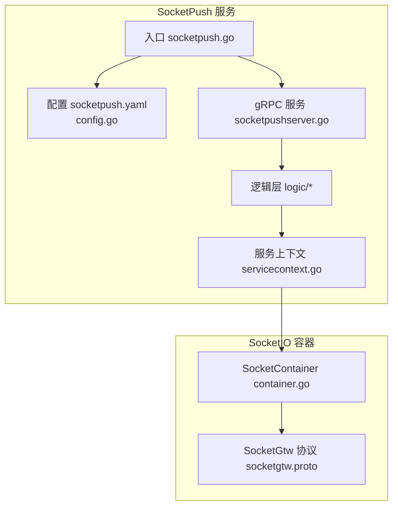
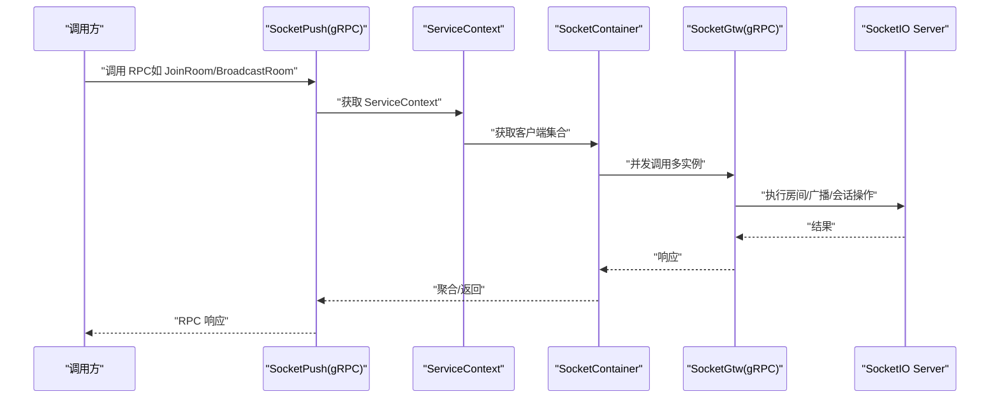
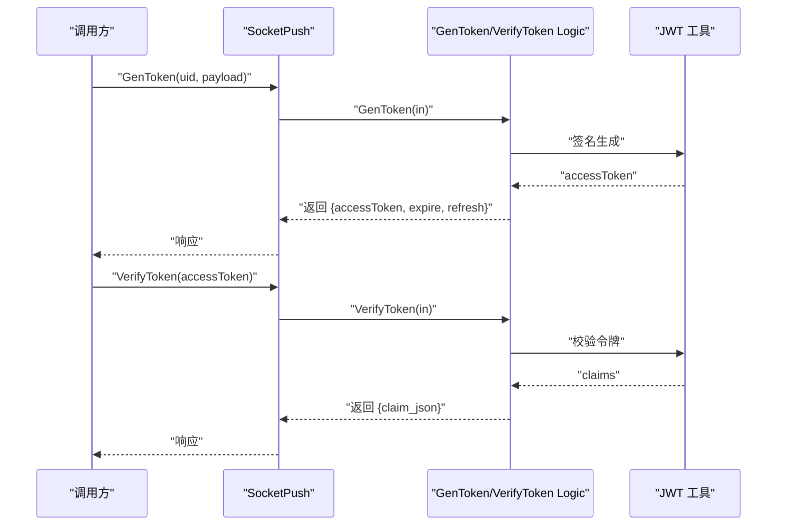
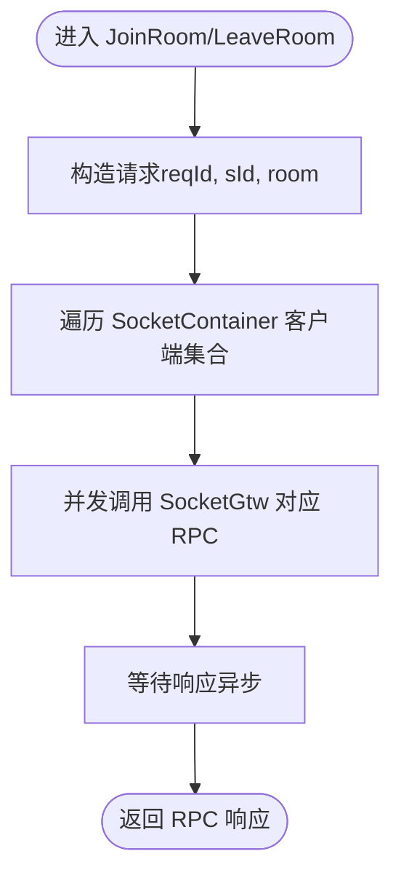
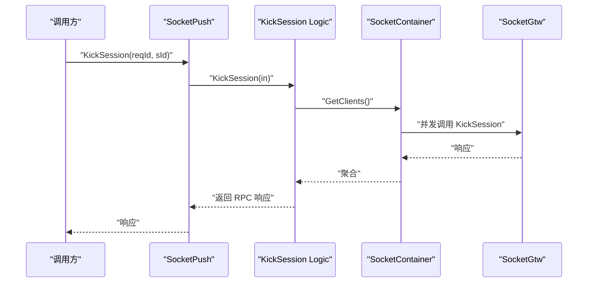
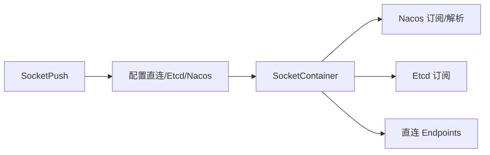

# SocketPush 推送服务

<cite>
**本文引用的文件**
- [socketpush.proto](file://socketapp/socketpush/socketpush.proto)
- [socketpush.go](file://socketapp/socketpush/socketpush.go)
- [socketpush.yaml](file://socketapp/socketpush/etc/socketpush.yaml)
- [config.go](file://socketapp/socketpush/internal/config/config.go)
- [socketpushserver.go](file://socketapp/socketpush/internal/server/socketpushserver.go)
- [servicecontext.go](file://socketapp/socketpush/internal/svc/servicecontext.go)
- [gentokenlogic.go](file://socketapp/socketpush/internal/logic/gentokenlogic.go)
- [verifytokenlogic.go](file://socketapp/socketpush/internal/logic/verifytokenlogic.go)
- [joinroomlogic.go](file://socketapp/socketpush/internal/logic/joinroomlogic.go)
- [leaveroomlogic.go](file://socketapp/socketpush/internal/logic/leaveroomlogic.go)
- [broadcastroomlogic.go](file://socketapp/socketpush/internal/logic/broadcastroomlogic.go)
- [broadcastgloballogic.go](file://socketapp/socketpush/internal/logic/broadcastgloballogic.go)
- [kicksessionlogic.go](file://socketapp/socketpush/internal/logic/kicksessionlogic.go)
- [container.go](file://common/socketiox/container.go)
- [server.go](file://common/socketiox/server.go)
- [socketgtw.proto](file://socketapp/socketgtw/socketgtw.proto)
</cite>

## 目录
1. [简介](#简介)
2. [项目结构](#项目结构)
3. [核心组件](#核心组件)
4. [架构总览](#架构总览)
5. [详细组件分析](#详细组件分析)
6. [依赖关系分析](#依赖关系分析)
7. [性能与可扩展性](#性能与可扩展性)
8. [故障排查指南](#故障排查指南)
9. [结论](#结论)
10. [附录：接口与数据模型](#附录接口与数据模型)

## 简介
SocketPush 是基于 gRPC 的推送服务，负责为前端 Socket.IO 会话提供统一的房间管理、消息广播、会话管理与统计能力。它通过内部的 SocketGtw 客户端集合，将请求分发到多个 SocketGtw 实例，实现跨节点的消息路由与高可用。

## 项目结构
- 服务入口与配置
  - 二进制入口：socketpush.go
  - 配置文件：socketpush.yaml
  - 内部配置结构体：config.go
- gRPC 服务与分发
  - 接口定义：socketpush.proto
  - 服务实现：socketpushserver.go
  - 服务上下文：servicecontext.go（持有 SocketContainer）
- 逻辑层
  - 令牌生成/校验：gentokenlogic.go、verifytokenlogic.go
  - 房间与广播：joinroomlogic.go、leaveroomlogic.go、broadcastroomlogic.go、broadcastgloballogic.go
  - 会话管理：kicksessionlogic.go 及其余相关逻辑
- 底层 SocketIO 能力
  - SocketContainer：动态发现与连接 SocketGtw 客户端
  - SocketIO Server：事件绑定、房间广播、全局广播、统计上报

图表来源
- [socketpush.go:27-69](file://socketapp/socketpush/socketpush.go#L27-L69)
- [socketpushserver.go:15-103](file://socketapp/socketpush/internal/server/socketpushserver.go#L15-L103)
- [servicecontext.go:8-18](file://socketapp/socketpush/internal/svc/servicecontext.go#L8-L18)
- [container.go:35-61](file://common/socketiox/container.go#L35-L61)
- [socketgtw.proto:9-32](file://socketapp/socketgtw/socketgtw.proto#L9-L32)

章节来源
- [socketpush.go:27-69](file://socketapp/socketpush/socketpush.go#L27-L69)
- [socketpush.yaml:1-28](file://socketapp/socketpush/etc/socketpush.yaml#L1-L28)
- [config.go:5-22](file://socketapp/socketpush/internal/config/config.go#L5-L22)

## 核心组件
- gRPC 接口定义：在 socketpush.proto 中定义了令牌生成/校验、房间加入/离开、房间/全局广播、会话踢出、按元数据会话操作、统计查询等接口。
- 服务实现：socketpushserver.go 将每个 RPC 映射到对应 logic 层。
- 服务上下文：servicecontext.go 创建并注入 SocketContainer，用于与 SocketGtw 通信。
- SocketContainer：根据配置选择直连、Etcd 或 Nacos 动态发现方式，维护 gRPC 客户端集合，并限制并发更新规模。
- SocketIO Server：在 common/socketiox/server.go 中实现事件绑定、房间/全局广播、统计上报等。

章节来源
- [socketpush.proto:9-36](file://socketapp/socketpush/socketpush/proto#L9-L36)
- [socketpushserver.go:26-102](file://socketapp/socketpush/internal/server/socketpushserver.go#L26-L102)
- [servicecontext.go:8-18](file://socketapp/socketpush/internal/svc/servicecontext.go#L8-L18)
- [container.go:35-61](file://common/socketiox/container.go#L35-L61)
- [server.go:337-676](file://common/socketiox/server.go#L337-L676)

## 架构总览
SocketPush 作为上游服务，接收来自业务系统的 gRPC 请求；内部通过 SocketContainer 连接多个 SocketGtw 实例，将房间/广播/会话管理等请求转发给 SocketGtw，最终由 SocketGtw 通过 SocketIO Server 将消息推送到前端。

图表来源
- [socketpushserver.go:26-102](file://socketapp/socketpush/internal/server/socketpushserver.go#L26-L102)
- [joinroomlogic.go:28-43](file://socketapp/socketpush/internal/logic/joinroomlogic.go#L28-L43)
- [broadcastroomlogic.go:28-44](file://socketapp/socketpush/internal/logic/broadcastroomlogic.go#L28-L44)
- [container.go:63-77](file://common/socketiox/container.go#L63-L77)
- [socketgtw.proto:9-32](file://socketapp/socketgtw/socketgtw.proto#L9-L32)
- [server.go:678-700](file://common/socketiox/server.go#L678-L700)

## 详细组件分析

### 令牌生成与验证（VerifyToken）
- 生成令牌（GenToken）
  - 输入：uid、payload（字符串键值对）
  - 输出：accessToken、accessExpire、refreshAfter
  - 行为：使用配置中的密钥生成 JWT，支持自定义载荷（忽略标准 JWT 字段），设置过期时间与刷新时间
- 校验令牌（VerifyToken）
  - 输入：accessToken
  - 输出：claim_json（校验通过后的声明 JSON）
  - 行为：支持当前与历史密钥，解析并返回声明

图表来源
- [gentokenlogic.go:29-45](file://socketapp/socketpush/internal/logic/gentokenlogic.go#L29-L45)
- [gentokenlogic.go:57-78](file://socketapp/socketpush/internal/logic/gentokenlogic.go#L57-L78)
- [verifytokenlogic.go:28-49](file://socketapp/socketpush/internal/logic/verifytokenlogic.go#L28-L49)

章节来源
- [socketpush.proto:48-65](file://socketapp/socketpush/socketpush.proto#L48-L65)
- [gentokenlogic.go:29-78](file://socketapp/socketpush/internal/logic/gentokenlogic.go#L29-L78)
- [verifytokenlogic.go:28-49](file://socketapp/socketpush/internal/logic/verifytokenlogic.go#L28-L49)
- [socketpush.yaml:10-13](file://socketapp/socketpush/etc/socketpush.yaml#L10-L13)

### 房间管理与消息广播
- 加入房间（JoinRoom）
  - 并发向所有已发现的 SocketGtw 实例发送 JoinRoom 请求
- 离开房间（LeaveRoom）
  - 并发向所有已发现的 SocketGtw 实例发送 LeaveRoom 请求
- 房间广播（BroadcastRoom）
  - 并发向所有已发现的 SocketGtw 实例发送 BroadcastRoom 请求
- 全局广播（BroadcastGlobal）
  - 并发向所有已发现的 SocketGtw 实例发送 BroadcastGlobal 请求

图表来源
- [joinroomlogic.go:28-43](file://socketapp/socketpush/internal/logic/joinroomlogic.go#L28-L43)
- [leaveroomlogic.go:28-43](file://socketapp/socketpush/internal/logic/leaveroomlogic.go#L28-L43)
- [broadcastroomlogic.go:28-44](file://socketapp/socketpush/internal/logic/broadcastroomlogic.go#L28-L44)
- [broadcastgloballogic.go:28-64](file://socketapp/socketpush/internal/logic/broadcastgloballogic.go#L28-L64)
- [socketpushserver.go:38-60](file://socketapp/socketpush/internal/server/socketpushserver.go#L38-L60)

章节来源
- [socketpush.proto:67-106](file://socketapp/socketpush/socketpush.proto#L67-L106)
- [joinroomlogic.go:28-43](file://socketapp/socketpush/internal/logic/joinroomlogic.go#L28-L43)
- [leaveroomlogic.go:28-43](file://socketapp/socketpush/internal/logic/leaveroomlogic.go#L28-L43)
- [broadcastroomlogic.go:28-44](file://socketapp/socketpush/internal/logic/broadcastroomlogic.go#L28-L44)
- [broadcastgloballogic.go:28-64](file://socketapp/socketpush/internal/logic/broadcastgloballogic.go#L28-L64)

### 会话管理与踢人
- 踢出会话（KickSession）
  - 并发向所有已发现的 SocketGtw 实例发送 KickSession 请求
- 按元数据踢人（KickMetaSession）
  - 支持按 key/value 元数据匹配并踢出
- 发送消息到指定会话（SendToSession/SendToSessions）
- 发送消息到元数据会话（SendToMetaSession/SendToMetaSessions）

图表来源
- [kicksessionlogic.go:28-42](file://socketapp/socketpush/internal/logic/kicksessionlogic.go#L28-L42)
- [socketpushserver.go:62-72](file://socketapp/socketpush/internal/server/socketpushserver.go#L62-L72)
- [container.go:63-77](file://common/socketiox/container.go#L63-L77)

章节来源
- [socketpush.proto:108-170](file://socketapp/socketpush/socketpush.proto#L108-L170)
- [kicksessionlogic.go:28-42](file://socketapp/socketpush/internal/logic/kicksessionlogic.go#L28-L42)

### 统计与状态
- SocketGtwStat
  - 返回各节点的会话数量统计（PbSocketGtwStat 列表）

章节来源
- [socketpush.proto:172-177](file://socketapp/socketpush/socketpush.proto#L172-L177)

## 依赖关系分析
- 服务注册与发现
  - SocketPush 通过配置选择直连、Etcd 或 Nacos 方式连接 SocketGtw
  - Nacos 解析 URL 参数，订阅服务实例变化，定期拉取健康实例列表
  - 客户端集合采用子集抽样，避免过大规模更新
- 服务间通信
  - SocketPush -> SocketGtw：gRPC
  - SocketGtw -> SocketIO Server：SocketIO 事件（在 SocketGtw 侧实现）

图表来源
- [socketpush.yaml:22-27](file://socketapp/socketpush/etc/socketpush.yaml#L22-L27)
- [container.go:35-61](file://common/socketiox/container.go#L35-L61)
- [container.go:156-242](file://common/socketiox/container.go#L156-L242)
- [container.go:267-316](file://common/socketiox/container.go#L267-L316)
- [container.go:348-356](file://common/socketiox/container.go#L348-L356)

章节来源
- [socketpush.yaml:22-27](file://socketapp/socketpush/etc/socketpush.yaml#L22-L27)
- [container.go:35-61](file://common/socketiox/container.go#L35-L61)
- [container.go:156-242](file://common/socketiox/container.go#L156-L242)
- [container.go:267-316](file://common/socketiox/container.go#L267-L316)
- [container.go:348-356](file://common/socketiox/container.go#L348-L356)

## 性能与可扩展性
- 并发与负载均衡
  - 逻辑层对所有 SocketGtw 客户端进行并发调用，提升吞吐
  - SocketContainer 使用子集抽样（subsetSize=32）减少大规模更新带来的抖动
- 连接与发现
  - 支持直连、Etcd 与 Nacos 多种模式，便于在不同环境灵活部署
  - Nacos 模式下定期轮询健康实例，保证可用性
- 消息大小限制
  - gRPC 默认调用选项中设置了最大发送消息大小（约 50MB），避免超大消息导致内存压力

章节来源
- [broadcastroomlogic.go:28-44](file://socketapp/socketpush/internal/logic/broadcastroomlogic.go#L28-L44)
- [broadcastgloballogic.go:28-64](file://socketapp/socketpush/internal/logic/broadcastgloballogic.go#L28-L64)
- [container.go:83-130](file://common/socketiox/container.go#L83-L130)
- [container.go:156-242](file://common/socketiox/container.go#L156-L242)
- [container.go:300-308](file://common/socketiox/container.go#L300-L308)

## 故障排查指南
- 令牌相关
  - VerifyToken 返回“无效令牌”或“空令牌”：检查 accessToken 是否为空、密钥是否正确、是否使用了 PrevAccessSecret
- 房间与广播
  - 广播无响应：确认 SocketGtw 实例健康且 gRPC 端口配置正确；检查 SocketContainer 是否正确订阅/连接
- 会话管理
  - 踢人无效：确认 sId 正确、SocketGtw 实例可达；检查并发调用是否全部成功
- 日志与统计
  - 查看服务日志中的统计事件（StatDown）以定位会话与房间状态异常

章节来源
- [verifytokenlogic.go:28-49](file://socketapp/socketpush/internal/logic/verifytokenlogic.go#L28-L49)
- [container.go:318-346](file://common/socketiox/container.go#L318-L346)
- [server.go:702-740](file://common/socketiox/server.go#L702-L740)

## 结论
SocketPush 提供了完善的推送能力，通过 gRPC 将房间管理、消息广播与会话管理抽象为统一接口，并借助 SocketContainer 实现多实例的动态发现与负载均衡。结合 JWT 令牌机制与 SocketIO Server 的事件处理，满足高并发、可扩展的实时推送场景。

## 附录：接口与数据模型

### gRPC 接口一览
- 令牌
  - GenToken：生成访问令牌
  - VerifyToken：校验访问令牌
- 房间
  - JoinRoom：加入房间
  - LeaveRoom：离开房间
- 广播
  - BroadcastRoom：房间广播
  - BroadcastGlobal：全局广播
- 会话
  - KickSession：踢出会话
  - KickMetaSession：按元数据踢出会话
  - SendToSession / SendToSessions：单/批量发送到会话
  - SendToMetaSession / SendToMetaSessions：按元数据单/批量发送
- 统计
  - SocketGtwStat：获取网关统计

章节来源
- [socketpush.proto:9-36](file://socketapp/socketpush/socketpush.proto#L9-L36)

### 数据模型
- GenTokenReq/GenTokenRes
  - 输入：uid、payload（map<string,string>）
  - 输出：accessToken、accessExpire、refreshAfter
- VerifyTokenReq/VerifyTokenRes
  - 输入：accessToken
  - 输出：claim_json（字符串化的声明）
- 房间与广播请求/响应
  - JoinRoomReq/Res、LeaveRoomReq/Res、BroadcastRoomReq/Res、BroadcastGlobalReq/Res
- 会话与元数据
  - KickSessionReq/KickSessionRes、KickMetaSessionReq/KickMetaSessionRes
  - SendToSessionReq/SendToSessionRes、SendToSessionsReq/SendToSessionsRes
  - SendToMetaSessionReq/SendToMetaSessionRes、SendToMetaSessionsReq/SendToMetaSessionsRes
- 统计
  - PbSocketGtwStat：node、sessions
  - SocketGtwStatReq/Res：返回统计列表

章节来源
- [socketpush.proto:48-177](file://socketapp/socketpush/socketpush.proto#L48-L177)