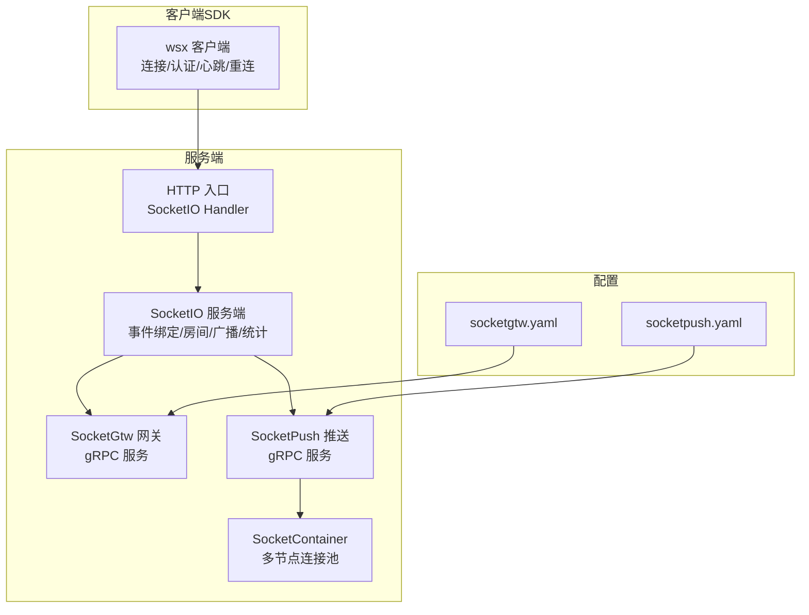
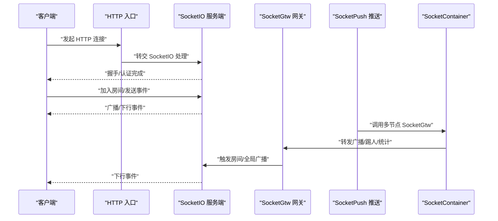
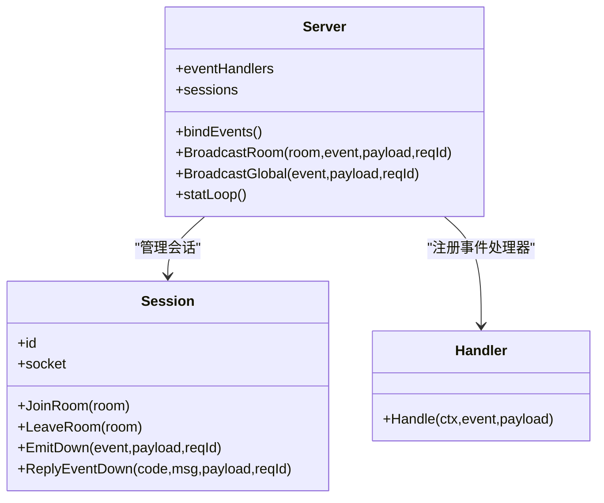
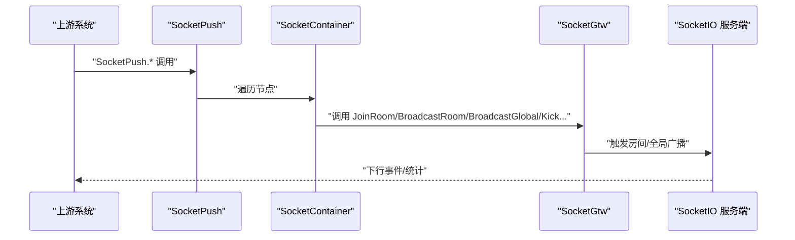
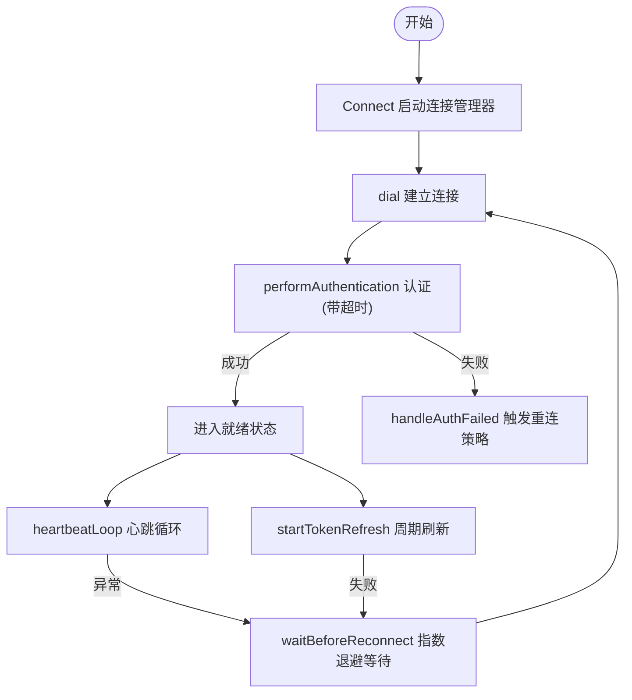
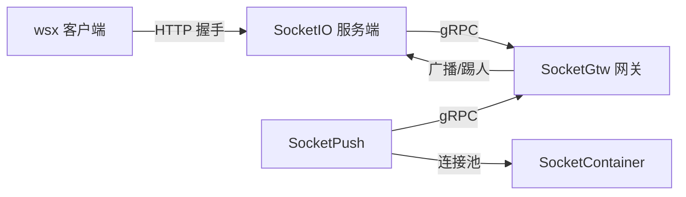

# WebSocket API 接口

<cite>
**本文引用的文件**
- [common/socketiox/server.go](file://common/socketiox/server.go)
- [common/socketiox/handler.go](file://common/socketiox/handler.go)
- [common/socketiox/container.go](file://common/socketiox/container.go)
- [common/wsx/client.go](file://common/wsx/client.go)
- [socketapp/socketgtw/socketgtw.proto](file://socketapp/socketgtw/socketgtw.proto)
- [socketapp/socketpush/socketpush.proto](file://socketapp/socketpush/socketpush.proto)
- [socketapp/socketgtw/etc/socketgtw.yaml](file://socketapp/socketgtw/etc/socketgtw.yaml)
- [socketapp/socketpush/etc/socketpush.yaml](file://socketapp/socketpush/etc/socketpush.yaml)
- [socketapp/socketgtw/internal/server/socketgtwserver.go](file://socketapp/socketgtw/internal/server/socketgtwserver.go)
- [socketapp/socketgtw/internal/logic/joinroomlogic.go](file://socketapp/socketgtw/internal/logic/joinroomlogic.go)
- [socketapp/socketgtw/internal/logic/broadcastroomlogic.go](file://socketapp/socketgtw/internal/logic/broadcastroomlogic.go)
- [socketapp/socketgtw/internal/logic/broadcastgloballogic.go](file://socketapp/socketgtw/internal/logic/broadcastgloballogic.go)
- [socketapp/socketgtw/internal/logic/socketgtwstatlogic.go](file://socketapp/socketgtw/internal/logic/socketgtwstatlogic.go)
- [socketapp/socketpush/internal/logic/socketgtwstatlogic.go](file://socketapp/socketpush/internal/logic/socketgtwstatlogic.go)
- [facade/streamevent/internal/logic/receivewsmessagelogic.go](file://facade/streamevent/internal/logic/receivewsmessagelogic.go)
</cite>

## 目录
1. [简介](#简介)
2. [项目结构](#项目结构)
3. [核心组件](#核心组件)
4. [架构总览](#架构总览)
5. [详细组件分析](#详细组件分析)
6. [依赖关系分析](#依赖关系分析)
7. [性能考虑](#性能考虑)
8. [故障排查指南](#故障排查指南)
9. [结论](#结论)
10. [附录](#附录)

## 简介
本文件系统性梳理 zero-service 中的 WebSocket API 接口能力，涵盖连接建立、握手与认证、会话与房间管理、消息广播与点对点通信、消息协议与事件模型、心跳与断线重连策略、客户端 SDK 使用示例与最佳实践，以及性能优化与并发连接处理方案。目标是帮助开发者快速理解并正确使用 WebSocket 能力。

## 项目结构
围绕 WebSocket 的核心由以下模块构成：
- 服务端框架与协议
  - SocketIO 服务端封装与事件绑定：common/socketiox/server.go
  - HTTP 入口适配：common/socketiox/handler.go
  - gRPC 网关与推送服务：socketapp/socketgtw/* 与 socketapp/socketpush/*
- 客户端 SDK
  - WebSocket 客户端库：common/wsx/client.go
- 配置与部署
  - socketgtw 与 socketpush 的配置文件：socketapp/socketgtw/etc/socketgtw.yaml、socketapp/socketpush/etc/socketpush.yaml
- 逻辑实现
  - 房间管理、广播、统计等逻辑：socketapp/socketgtw/internal/logic/*
  - 统计聚合逻辑：socketapp/socketpush/internal/logic/socketgtwstatlogic.go

**图表来源**
- [common/socketiox/handler.go:33-40](file://common/socketiox/handler.go#L33-L40)
- [common/socketiox/server.go:314-335](file://common/socketiox/server.go#L314-L335)
- [socketapp/socketgtw/internal/server/socketgtwserver.go:15-91](file://socketapp/socketgtw/internal/server/socketgtwserver.go#L15-L91)
- [socketapp/socketpush/internal/logic/socketgtwstatlogic.go:34-67](file://socketapp/socketpush/internal/logic/socketgtwstatlogic.go#L34-L67)
- [common/socketiox/container.go:35-61](file://common/socketiox/container.go#L35-L61)
- [socketapp/socketgtw/etc/socketgtw.yaml:1-37](file://socketapp/socketgtw/etc/socketgtw.yaml#L1-L37)
- [socketapp/socketpush/etc/socketpush.yaml:1-28](file://socketapp/socketpush/etc/socketpush.yaml#L1-L28)

**章节来源**
- [common/socketiox/server.go:314-335](file://common/socketiox/server.go#L314-L335)
- [common/socketiox/handler.go:33-40](file://common/socketiox/handler.go#L33-L40)
- [socketapp/socketgtw/etc/socketgtw.yaml:1-37](file://socketapp/socketgtw/etc/socketgtw.yaml#L1-L37)
- [socketapp/socketpush/etc/socketpush.yaml:1-28](file://socketapp/socketpush/etc/socketpush.yaml#L1-L28)

## 核心组件
- SocketIO 服务端
  - 提供连接、认证、房间管理、全局/房间广播、统计上报等能力
  - 支持通过钩子扩展连接、断开、加入房间前校验等流程
- HTTP 入口适配
  - 将 HTTP 请求转交给 SocketIO 处理器
- gRPC 网关与推送
  - SocketGtw：面向业务侧的房间/广播/踢人/查询统计等 RPC
  - SocketPush：面向上游系统的推送入口，可聚合多节点统计
- SocketContainer
  - 基于 etcd/nacos/direct 的动态连接池，支持订阅与负载
- wsx 客户端
  - 提供连接、认证、心跳、断线重连、Token 刷新、回调等完整能力

**章节来源**
- [common/socketiox/server.go:299-312](file://common/socketiox/server.go#L299-L312)
- [common/socketiox/handler.go:19-40](file://common/socketiox/handler.go#L19-L40)
- [socketapp/socketgtw/socketgtw.proto:9-32](file://socketapp/socketgtw/socketgtw.proto#L9-L32)
- [socketapp/socketpush/socketpush.proto:9-36](file://socketapp/socketpush/socketpush.proto#L9-L36)
- [common/socketiox/container.go:30-33](file://common/socketiox/container.go#L30-L33)
- [common/wsx/client.go:65-81](file://common/wsx/client.go#L65-L81)

## 架构总览
WebSocket 交互路径分为两条主线：
- 客户端直连 SocketIO：通过 HTTP 入口接入，完成握手、认证、事件处理与房间广播
- 上游系统通过 gRPC 推送：SocketPush/SocketGtw 将消息广播至 SocketIO，再由 SocketIO 下发到客户端

**图表来源**
- [common/socketiox/handler.go:33-40](file://common/socketiox/handler.go#L33-L40)
- [common/socketiox/server.go:337-676](file://common/socketiox/server.go#L337-L676)
- [socketapp/socketgtw/internal/server/socketgtwserver.go:26-90](file://socketapp/socketgtw/internal/server/socketgtwserver.go#L26-L90)
- [socketapp/socketpush/internal/logic/socketgtwstatlogic.go:34-67](file://socketapp/socketpush/internal/logic/socketgtwstatlogic.go#L34-L67)
- [common/socketiox/container.go:267-316](file://common/socketiox/container.go#L267-L316)

## 详细组件分析

### SocketIO 服务端与事件模型
- 事件常量
  - 连接/断开、上行/下行、房间/全局广播、统计下行等事件名
- 数据模型
  - 上行请求：包含 reqId、event、room、payload
  - 下行响应：包含 code、msg、payload、reqId
  - 统计下行：包含 sid、rooms、nps、metadata、roomLoadError
- 事件绑定
  - 认证钩子：支持基于 token 的验证
  - 连接钩子：连接建立后加载房间
  - 加入房间前钩子：可进行权限/业务校验
  - 断开钩子：清理会话
  - 通用事件处理：注册自定义事件处理器
- 广播与房间
  - 房间广播：向指定房间内所有成员发送事件
  - 全局广播：向所有在线成员发送事件
  - 统计下行：周期性向每个会话下发统计信息

**图表来源**
- [common/socketiox/server.go:299-312](file://common/socketiox/server.go#L299-L312)
- [common/socketiox/server.go:119-232](file://common/socketiox/server.go#L119-L232)
- [common/socketiox/server.go:234-244](file://common/socketiox/server.go#L234-L244)

**章节来源**
- [common/socketiox/server.go:20-64](file://common/socketiox/server.go#L20-L64)
- [common/socketiox/server.go:337-676](file://common/socketiox/server.go#L337-L676)
- [common/socketiox/server.go:678-740](file://common/socketiox/server.go#L678-L740)

### HTTP 入口与 SocketIO 适配
- 将 HTTP 请求转交给 SocketIO 处理器，实现标准的 WebSocket 握手与事件流转
- 通过选项注入 Server 实例，保证复用与一致性

**章节来源**
- [common/socketiox/handler.go:19-40](file://common/socketiox/handler.go#L19-L40)

### gRPC 网关与推送
- SocketGtw
  - 提供加入房间、离开房间、房间广播、全局广播、踢人、按元数据踢人、按会话/元数据批量发送、统计查询等 RPC
- SocketPush
  - 在 SocketGtw 基础上，提供聚合统计能力，遍历多节点 SocketGtw 并汇总 sessions 数
- 配置
  - socketgtw.yaml：监听端口、HTTP 入口、日志、SocketMetaData、StreamEventConf
  - socketpush.yaml：JWT 配置、SocketGtwConf、日志等

**图表来源**
- [socketapp/socketgtw/socketgtw.proto:9-32](file://socketapp/socketgtw/socketgtw.proto#L9-L32)
- [socketapp/socketpush/socketpush.proto:9-36](file://socketapp/socketpush/socketpush.proto#L9-L36)
- [socketapp/socketpush/internal/logic/socketgtwstatlogic.go:34-67](file://socketapp/socketpush/internal/logic/socketgtwstatlogic.go#L34-L67)
- [common/socketiox/container.go:267-316](file://common/socketiox/container.go#L267-L316)

**章节来源**
- [socketapp/socketgtw/internal/server/socketgtwserver.go:26-90](file://socketapp/socketgtw/internal/server/socketgtwserver.go#L26-L90)
- [socketapp/socketgtw/internal/logic/joinroomlogic.go:25-37](file://socketapp/socketgtw/internal/logic/joinroomlogic.go#L25-L37)
- [socketapp/socketgtw/internal/logic/broadcastroomlogic.go:28-46](file://socketapp/socketgtw/internal/logic/broadcastroomlogic.go#L28-L46)
- [socketapp/socketgtw/internal/logic/broadcastgloballogic.go:28-46](file://socketapp/socketgtw/internal/logic/broadcastgloballogic.go#L28-L46)
- [socketapp/socketgtw/etc/socketgtw.yaml:13-37](file://socketapp/socketgtw/etc/socketgtw.yaml#L13-L37)
- [socketapp/socketpush/etc/socketpush.yaml:10-27](file://socketapp/socketpush/etc/socketpush.yaml#L10-L27)

### wsx 客户端 SDK
- 连接生命周期
  - Connect：启动连接管理器，进入连接/认证/心跳循环
  - Close：发送标准关闭帧并清理
- 认证与会话
  - performAuthentication：带超时的认证流程，支持 OnRefreshToken 回调
  - IsAuthenticated：判断是否已认证
- 心跳与断线重连
  - heartbeatLoop：周期发送心跳（默认 Ping 或自定义）
  - reconnect：指数退避，支持最大重连次数与最大间隔
- Token 刷新
  - startTokenRefresh：周期刷新，失败可选择关闭连接触发重连
- 回调与扩展
  - OnMessage、OnStatusChange、OnRefreshToken、OnHeartbeat、ReconnectOnAuthFailed、ReconnectOnTokenExpire

**图表来源**
- [common/wsx/client.go:302-445](file://common/wsx/client.go#L302-L445)
- [common/wsx/client.go:538-577](file://common/wsx/client.go#L538-L577)
- [common/wsx/client.go:640-697](file://common/wsx/client.go#L640-L697)
- [common/wsx/client.go:699-774](file://common/wsx/client.go#L699-L774)

**章节来源**
- [common/wsx/client.go:65-81](file://common/wsx/client.go#L65-L81)
- [common/wsx/client.go:83-94](file://common/wsx/client.go#L83-L94)
- [common/wsx/client.go:96-107](file://common/wsx/client.go#L96-L107)
- [common/wsx/client.go:208-275](file://common/wsx/client.go#L208-L275)
- [common/wsx/client.go:302-445](file://common/wsx/client.go#L302-L445)
- [common/wsx/client.go:538-577](file://common/wsx/client.go#L538-L577)
- [common/wsx/client.go:640-697](file://common/wsx/client.go#L640-L697)
- [common/wsx/client.go:699-774](file://common/wsx/client.go#L699-L774)

### SocketContainer 动态连接池
- 支持三种发现方式：direct、etcd、nacos
- 订阅服务实例变更，动态增删连接
- 限制并发连接数量，避免资源爆炸

**章节来源**
- [common/socketiox/container.go:35-61](file://common/socketiox/container.go#L35-L61)
- [common/socketiox/container.go:83-130](file://common/socketiox/container.go#L83-L130)
- [common/socketiox/container.go:156-242](file://common/socketiox/container.go#L156-L242)
- [common/socketiox/container.go:267-316](file://common/socketiox/container.go#L267-L316)

## 依赖关系分析
- 服务端依赖
  - SocketIO 服务端依赖 go-zero 日志与协程工具
  - HTTP 入口依赖 SocketIO Io 实例
- 客户端依赖
  - gorilla/websocket、go-zero 核心库、统计与线程工具
- 网关与推送
  - SocketGtw 依赖 SocketServer 的会话与广播能力
  - SocketPush 依赖 SocketContainer 的多节点连接池

**图表来源**
- [common/wsx/client.go:14-21](file://common/wsx/client.go#L14-L21)
- [common/socketiox/server.go:314-335](file://common/socketiox/server.go#L314-L335)
- [socketapp/socketgtw/internal/server/socketgtwserver.go:15-91](file://socketapp/socketgtw/internal/server/socketgtwserver.go#L15-L91)
- [socketapp/socketpush/internal/logic/socketgtwstatlogic.go:34-67](file://socketapp/socketpush/internal/logic/socketgtwstatlogic.go#L34-L67)
- [common/socketiox/container.go:30-33](file://common/socketiox/container.go#L30-L33)

**章节来源**
- [common/wsx/client.go:14-21](file://common/wsx/client.go#L14-L21)
- [common/socketiox/server.go:314-335](file://common/socketiox/server.go#L314-L335)
- [socketapp/socketgtw/internal/server/socketgtwserver.go:15-91](file://socketapp/socketgtw/internal/server/socketgtwserver.go#L15-L91)
- [socketapp/socketpush/internal/logic/socketgtwstatlogic.go:34-67](file://socketapp/socketpush/internal/logic/socketgtwstatlogic.go#L34-L67)
- [common/socketiox/container.go:30-33](file://common/socketiox/container.go#L30-L33)

## 性能考虑
- 连接与广播
  - 使用房间广播减少全局广播压力；合理划分房间粒度
  - 控制 payload 体积，避免超大消息导致延迟与内存占用
- 心跳与超时
  - 心跳间隔与读写超时应匹配网络质量；避免过短造成 CPU 开销过大
- 并发与资源
  - SocketContainer 限制并发连接子集，防止抖动
  - gRPC 调用设置合理超时与最大消息大小
- 统计与可观测性
  - 启用统计下行，定期观察每会话房间数、NPS、元数据一致性

[本节为通用指导，无需特定文件引用]

## 故障排查指南
- 连接失败
  - 检查 HTTP 入口与 SocketIO 服务端是否正常
  - 查看认证回调返回值与日志
- 认证失败
  - 确认 token 校验逻辑与超时设置
  - 若开启重连策略，确认 OnRefreshToken 返回值
- 广播无效
  - 确认房间名与事件名不为空且未被禁止
  - 检查 SocketGtw 广播 RPC 参数与 SocketPush 聚合逻辑
- 会话统计异常
  - 对比 sessions 数与 SocketIO 会话数，排查清理逻辑
- 客户端断线重连
  - 检查指数退避参数与最大重连次数
  - 确认 OnStatusChange 回调是否正确感知状态

**章节来源**
- [common/socketiox/server.go:337-349](file://common/socketiox/server.go#L337-L349)
- [common/socketiox/server.go:410-420](file://common/socketiox/server.go#L410-L420)
- [common/socketiox/server.go:678-740](file://common/socketiox/server.go#L678-L740)
- [socketapp/socketgtw/internal/logic/socketgtwstatlogic.go:27-32](file://socketapp/socketgtw/internal/logic/socketgtwstatlogic.go#L27-L32)
- [socketapp/socketpush/internal/logic/socketgtwstatlogic.go:34-67](file://socketapp/socketpush/internal/logic/socketgtwstatlogic.go#L34-L67)
- [common/wsx/client.go:579-633](file://common/wsx/client.go#L579-L633)

## 结论
本 WebSocket 能力以 SocketIO 为核心，结合 gRPC 网关与推送，形成“客户端直连 + 上游系统推送”的双通路架构。wsx 客户端提供完善的连接、认证、心跳与重连能力；服务端提供房间管理、广播与统计；SocketContainer 支持多节点动态连接池。通过合理的事件模型与配置，可在高并发场景下稳定支撑实时交互需求。

[本节为总结，无需特定文件引用]

## 附录

### 消息协议与事件类型
- 事件常量
  - 连接/断开：__connection__、__disconnect__
  - 上行/下行：__up__、__down__
  - 房间/全局广播：__join_room_up__、__leave_room_up__、__room_broadcast_up__、__global_broadcast_up__
  - 统计下行：__stat_down__
- 上行请求结构
  - 字段：payload、reqId、room、event
- 下行响应结构
  - 字段：code、msg、payload、reqId
- 统计下行结构
  - 字段：sId、rooms、nps、metadata、roomLoadError

**章节来源**
- [common/socketiox/server.go:20-64](file://common/socketiox/server.go#L20-L64)
- [common/socketiox/server.go:41-72](file://common/socketiox/server.go#L41-L72)

### 连接握手与认证机制
- 握手
  - 通过 HTTP 入口接入 SocketIO，完成标准 WebSocket 握手
- 认证
  - OnAuthentication 钩子中校验 token
  - performAuthentication 带超时，支持 OnRefreshToken 回调
- 会话管理
  - 建立连接后创建 Session，支持元数据存储与房间加入

**章节来源**
- [common/socketiox/handler.go:33-40](file://common/socketiox/handler.go#L33-L40)
- [common/socketiox/server.go:337-391](file://common/socketiox/server.go#L337-L391)
- [common/socketiox/server.go:410-420](file://common/socketiox/server.go#L410-L420)

### 房间管理与消息广播
- 房间管理
  - 加入/离开房间：通过 __join_room_up__ 与 __leave_room_up__ 事件
  - 服务端提供 JoinRoom/LeaveRoom RPC
- 广播
  - 房间广播：__room_broadcast_up__ 事件或 BroadcastRoom RPC
  - 全局广播：__global_broadcast_up__ 事件或 BroadcastGlobal RPC

**章节来源**
- [common/socketiox/server.go:392-468](file://common/socketiox/server.go#L392-L468)
- [common/socketiox/server.go:532-619](file://common/socketiox/server.go#L532-L619)
- [socketapp/socketgtw/socketgtw.proto:39-87](file://socketapp/socketgtw/socketgtw.proto#L39-L87)

### 点对点通信
- 通过 SocketGtw 的 SendToSession/SendToSessions/SendToMetaSession/SendToMetaSessions RPC 实现
- SocketPush 提供聚合调用能力，遍历多节点 SocketGtw

**章节来源**
- [socketapp/socketgtw/socketgtw.proto:99-142](file://socketapp/socketgtw/socketgtw.proto#L99-L142)
- [socketapp/socketpush/socketpush.proto:127-170](file://socketapp/socketpush/socketpush.proto#L127-L170)
- [socketapp/socketpush/internal/logic/socketgtwstatlogic.go:34-67](file://socketapp/socketpush/internal/logic/socketgtwstatlogic.go#L34-L67)

### 心跳检测与断线重连策略
- 心跳
  - 默认 Ping 心跳，可自定义 OnHeartbeat
- 重连
  - 指数退避，支持最大重连次数与最大间隔
  - 认证失败与 Token 过期可配置是否重连

**章节来源**
- [common/wsx/client.go:640-697](file://common/wsx/client.go#L640-L697)
- [common/wsx/client.go:579-633](file://common/wsx/client.go#L579-L633)
- [common/wsx/client.go:96-107](file://common/wsx/client.go#L96-L107)

### 客户端 SDK 使用示例与最佳实践
- 基本使用
  - 创建 Config 与 ClientOptions，设置 Headers、OnMessage、OnStatusChange、OnRefreshToken、OnHeartbeat 等
  - 调用 Connect 发起连接，Send/SendJSON 发送消息
- 最佳实践
  - 合理设置心跳与超时，避免频繁误判断线
  - 使用自定义心跳内容，便于服务端识别客户端类型
  - 在 OnRefreshToken 中实现 Token 刷新与错误处理
  - 对大消息进行压缩或分片，降低 RTT 与内存峰值

**章节来源**
- [common/wsx/client.go:208-275](file://common/wsx/client.go#L208-L275)
- [common/wsx/client.go:144-207](file://common/wsx/client.go#L144-L207)

### 配置参考
- socketgtw.yaml
  - 监听端口、HTTP 入口、日志、SocketMetaData、StreamEventConf
- socketpush.yaml
  - JWT 配置、SocketGtwConf、日志

**章节来源**
- [socketapp/socketgtw/etc/socketgtw.yaml:1-37](file://socketapp/socketgtw/etc/socketgtw.yaml#L1-L37)
- [socketapp/socketpush/etc/socketpush.yaml:1-28](file://socketapp/socketpush/etc/socketpush.yaml#L1-L28)

### 与流事件集成
- streamevent 模块预留了接收 WebSocket 消息的逻辑入口，可用于对接流式事件与 WebSocket 的联动

**章节来源**
- [facade/streamevent/internal/logic/receivewsmessagelogic.go:26-31](file://facade/streamevent/internal/logic/receivewsmessagelogic.go#L26-L31)