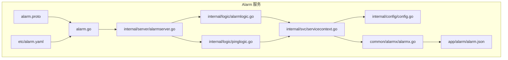
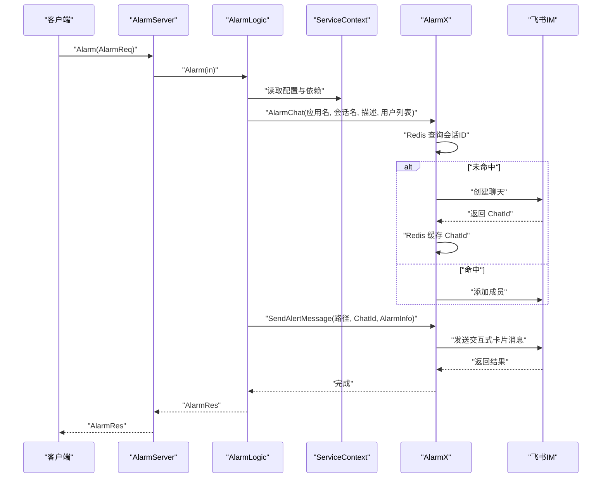
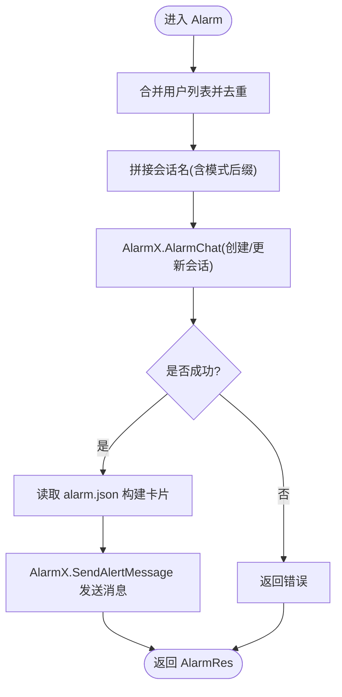
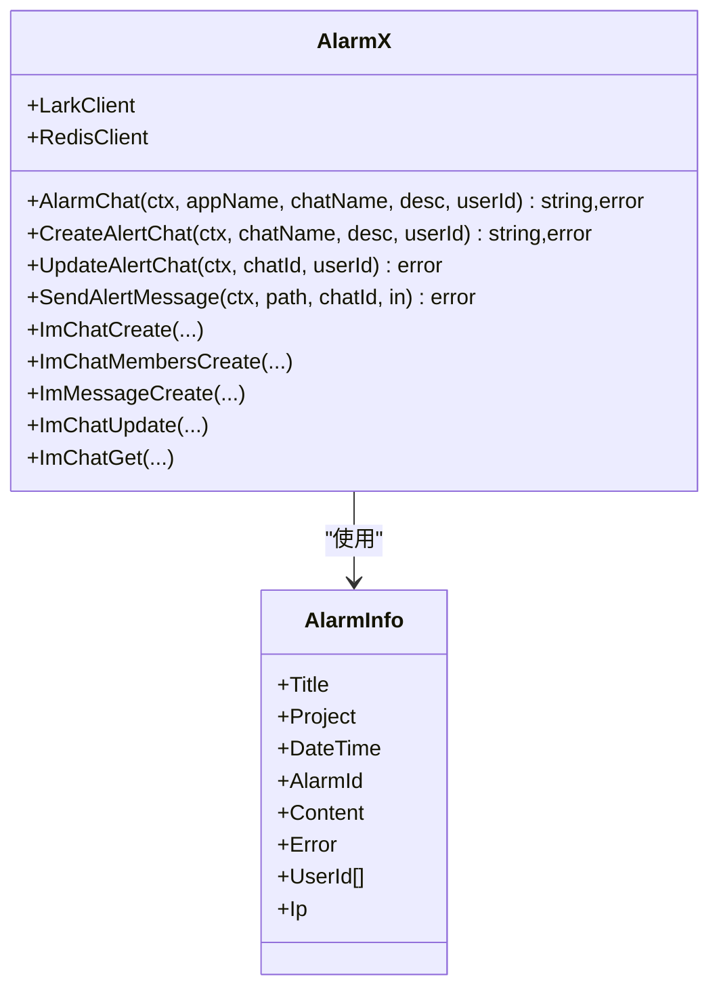
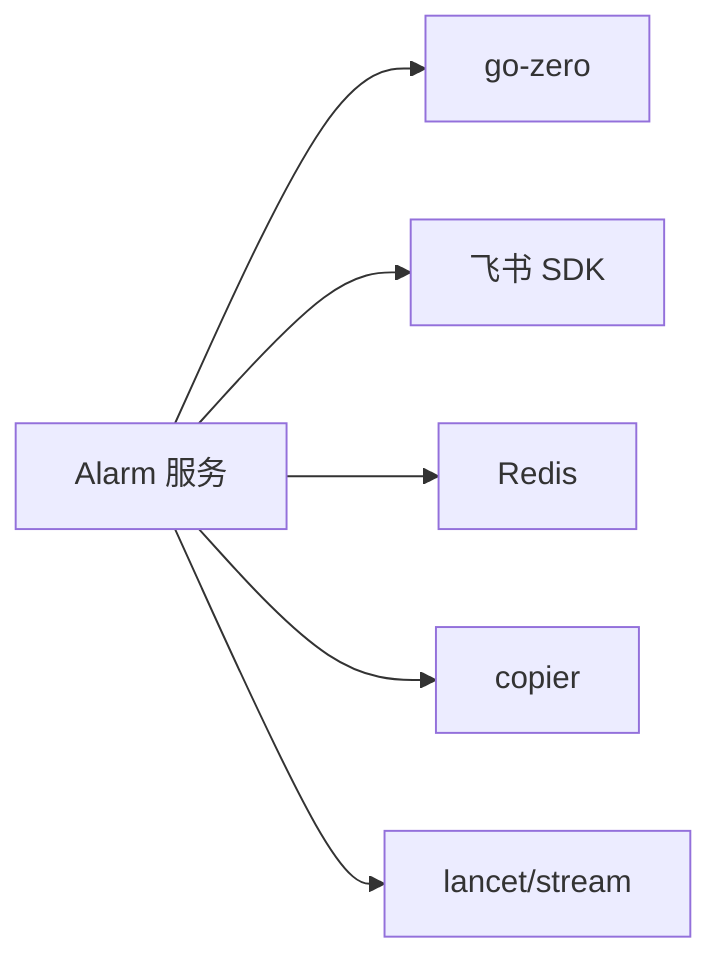

# Alarm 服务

<cite>
**本文引用的文件列表**
- [alarm.proto](file://app/alarm/alarm.proto)
- [alarm.go](file://app/alarm/alarm.go)
- [alarmserver.go](file://app/alarm/internal/server/alarmserver.go)
- [alarmlogic.go](file://app/alarm/internal/logic/alarmlogic.go)
- [pinglogic.go](file://app/alarm/internal/logic/pinglogic.go)
- [config.go](file://app/alarm/internal/config/config.go)
- [alarm.yaml](file://app/alarm/etc/alarm.yaml)
- [servicecontext.go](file://app/alarm/internal/svc/servicecontext.go)
- [alarmx.go](file://common/alarmx/alarmx.go)
- [alarm.json](file://app/alarm/alarm.json)
</cite>

## 目录
1. [简介](#简介)
2. [项目结构](#项目结构)
3. [核心组件](#核心组件)
4. [架构总览](#架构总览)
5. [详细组件分析](#详细组件分析)
6. [依赖关系分析](#依赖关系分析)
7. [性能与可用性考虑](#性能与可用性考虑)
8. [故障排查指南](#故障排查指南)
9. [结论](#结论)
10. [附录](#附录)

## 简介
本文件为 Alarm 服务的 gRPC API 文档，聚焦于报警处理与通知能力。当前服务通过 gRPC 提供两类 RPC：
- Ping：健康检查/心跳接口
- Alarm：报警推送接口，支持按用户群组创建或复用聊天会话，并向会话发送交互式卡片消息

服务基于 go-zero 框架构建，使用 Redis 缓存会话标识，对接飞书 IM 能力进行消息分发；同时内置交互式卡片模板，便于后续扩展“处理”“跟进”等交互按钮。

## 项目结构
Alarm 服务采用标准 go-zero 微服务目录组织方式：
- proto 定义位于 app/alarm/alarm.proto
- 服务入口位于 app/alarm/alarm.go
- gRPC 服务器实现位于 internal/server
- 业务逻辑位于 internal/logic
- 配置位于 etc/alarm.yaml
- 服务上下文位于 internal/svc
- 飞书报警封装位于 common/alarmx

图表来源
- [alarm.proto](file://app/alarm/alarm.proto)
- [alarm.go](file://app/alarm/alarm.go)
- [alarmserver.go](file://app/alarm/internal/server/alarmserver.go)
- [alarmlogic.go](file://app/alarm/internal/logic/alarmlogic.go)
- [pinglogic.go](file://app/alarm/internal/logic/pinglogic.go)
- [config.go](file://app/alarm/internal/config/config.go)
- [alarm.yaml](file://app/alarm/etc/alarm.yaml)
- [servicecontext.go](file://app/alarm/internal/svc/servicecontext.go)
- [alarmx.go](file://common/alarmx/alarmx.go)
- [alarm.json](file://app/alarm/alarm.json)

章节来源
- [alarm.proto](file://app/alarm/alarm.proto)
- [alarm.go](file://app/alarm/alarm.go)
- [alarmserver.go](file://app/alarm/internal/server/alarmserver.go)
- [alarmlogic.go](file://app/alarm/internal/logic/alarmlogic.go)
- [pinglogic.go](file://app/alarm/internal/logic/pinglogic.go)
- [config.go](file://app/alarm/internal/config/config.go)
- [alarm.yaml](file://app/alarm/etc/alarm.yaml)
- [servicecontext.go](file://app/alarm/internal/svc/servicecontext.go)
- [alarmx.go](file://common/alarmx/alarmx.go)
- [alarm.json](file://app/alarm/alarm.json)

## 核心组件
- gRPC 服务定义：在 alarm.proto 中声明服务与消息类型
- 服务入口：alarm.go 加载配置并启动 gRPC 服务器
- 服务器实现：AlarmServer 将 RPC 映射到对应 Logic
- 业务逻辑：
  - PingLogic：返回固定响应，用于健康检查
  - AlarmLogic：合并配置中的默认用户，创建/更新飞书会话，发送交互式卡片消息
- 服务上下文：ServiceContext 负责初始化 Redis、HTTP 客户端与 AlarmX 实例
- 飞书报警封装：AlarmX 封装飞书 IM 的聊天创建、成员管理、消息发送等操作，并使用 Redis 缓存会话 ID
- 交互式卡片模板：alarm.json 作为消息模板，支持占位符替换

章节来源
- [alarm.proto](file://app/alarm/alarm.proto)
- [alarm.go](file://app/alarm/alarm.go)
- [alarmserver.go](file://app/alarm/internal/server/alarmserver.go)
- [alarmlogic.go](file://app/alarm/internal/logic/alarmlogic.go)
- [pinglogic.go](file://app/alarm/internal/logic/pinglogic.go)
- [servicecontext.go](file://app/alarm/internal/svc/servicecontext.go)
- [alarmx.go](file://common/alarmx/alarmx.go)
- [alarm.json](file://app/alarm/alarm.json)

## 架构总览
Alarm 服务的调用链路如下：
- 客户端调用 Alarm RPC
- AlarmServer 接收请求并委派给 AlarmLogic
- AlarmLogic 合并用户列表，调用 AlarmX 创建/更新会话并发送交互式卡片消息
- AlarmX 使用 Redis 缓存会话 ID，避免重复创建
- 飞书 IM 返回成功/失败状态

图表来源
- [alarmserver.go](file://app/alarm/internal/server/alarmserver.go)
- [alarmlogic.go](file://app/alarm/internal/logic/alarmlogic.go)
- [servicecontext.go](file://app/alarm/internal/svc/servicecontext.go)
- [alarmx.go](file://common/alarmx/alarmx.go)

## 详细组件分析

### gRPC 服务与消息模型
- 服务名称：Alarm
- 方法：
  - Ping(Req) -> Res：健康检查
  - Alarm(AlarmReq) -> AlarmRes：报警推送
- 请求/响应消息：
  - Req/Res：通用心跳消息
  - AlarmReq：包含会话名、描述、标题、项目、时间、报警ID、内容、错误、用户ID列表、IP等字段
  - AlarmRes：空响应体

章节来源
- [alarm.proto](file://app/alarm/alarm.proto)

### 服务入口与配置加载
- alarm.go 负责：
  - 解析命令行参数加载 etc/alarm.yaml
  - 初始化 ServiceContext
  - 注册 AlarmServer 到 gRPC 服务器
  - 在开发/测试模式下启用反射
- alarm.yaml 关键项：
  - Name、ListenOn：服务名与监听地址
  - Mode：运行模式（影响反射）
  - Log：日志编码
  - Redis：连接配置与键前缀
  - Alarmx：飞书 AppId/AppSecret/EncryptKey/VerificationToken、默认用户列表、卡片模板路径

章节来源
- [alarm.go](file://app/alarm/alarm.go)
- [alarm.yaml](file://app/alarm/etc/alarm.yaml)

### 服务上下文与依赖注入
- ServiceContext 组合：
  - Config：来自 alarm.yaml 的配置
  - Httpc：HTTP 客户端服务
  - RedisClient：Redis 客户端
  - AlarmX：飞书报警封装实例，内部持有飞书 Client 与 Redis 客户端
- AlarmX 初始化时设置请求超时与自定义 HTTP 客户端适配器

章节来源
- [servicecontext.go](file://app/alarm/internal/svc/servicecontext.go)
- [alarmx.go](file://common/alarmx/alarmx.go)

### 业务逻辑：Ping
- PingLogic.Ping 返回固定字符串，用于服务健康探测
- 该方法映射到 gRPC 的 Ping

章节来源
- [pinglogic.go](file://app/alarm/internal/logic/pinglogic.go)
- [alarmserver.go](file://app/alarm/internal/server/alarmserver.go)

### 业务逻辑：Alarm
- AlarmLogic.Alarm 的关键步骤：
  - 合并请求中的用户列表与配置中的默认用户，去重
  - 生成带模式后缀的会话名
  - 调用 AlarmX.AlarmChat 创建或更新会话，返回 ChatId
  - 使用 alarm.json 构建交互式卡片内容，调用 AlarmX.SendAlertMessage 发送消息
  - 可选：注册事件/卡片回调（当前代码为注释态）

图表来源
- [alarmlogic.go](file://app/alarm/internal/logic/alarmlogic.go)
- [alarmx.go](file://common/alarmx/alarmx.go)
- [alarm.json](file://app/alarm/alarm.json)

章节来源
- [alarmlogic.go](file://app/alarm/internal/logic/alarmlogic.go)
- [alarmx.go](file://common/alarmx/alarmx.go)
- [alarm.json](file://app/alarm/alarm.json)

### 飞书报警封装（AlarmX）
- 核心能力：
  - AlarmChat：根据应用名+会话名查询 Redis；未命中则创建聊天并缓存 ChatId；命中则追加成员
  - CreateAlertChat：创建聊天并返回 ChatId
  - UpdateAlertChat：向现有聊天追加成员
  - SendAlertMessage：读取模板 alarm.json，替换占位符，发送交互式卡片消息
  - IM API 适配：ImChatCreate/ImChatMembersCreate/ImMessageCreate/ImChatUpdate/ImChatGet
- 模板替换：支持标题、项目、时间、事件ID、内容、错误、IP、按钮文案等占位符
- 安全转义：EscapeString 对日志输出进行安全转义

图表来源
- [alarmx.go](file://common/alarmx/alarmx.go)

章节来源
- [alarmx.go](file://common/alarmx/alarmx.go)

### 交互式卡片模板
- alarm.json 定义了卡片头部、元素区域与字段布局
- 支持的占位符：${title}/${project}/${dateTime}/${alarmId}/${content}/${error}/${ip}/${button_name}
- 按需可扩展按钮行为（当前代码为注释态）

章节来源
- [alarm.json](file://app/alarm/alarm.json)

## 依赖关系分析
- Alarm 服务依赖：
  - go-zero：RPC 服务器、配置加载、日志
  - larksuite/oapi-sdk-go/v3：飞书 IM SDK
  - redis：会话 ID 缓存
  - copier：结构体复制
  - lancet/stream：集合去重
- 外部集成点：
  - 飞书 IM：聊天创建、成员管理、消息发送
  - Redis：键空间 app:alarm:<chatName> 存储 ChatId

图表来源
- [alarm.go](file://app/alarm/alarm.go)
- [servicecontext.go](file://app/alarm/internal/svc/servicecontext.go)
- [alarmx.go](file://common/alarmx/alarmx.go)

章节来源
- [alarm.go](file://app/alarm/alarm.go)
- [servicecontext.go](file://app/alarm/internal/svc/servicecontext.go)
- [alarmx.go](file://common/alarmx/alarmx.go)

## 性能与可用性考虑
- 会话缓存：AlarmChat 通过 Redis 缓存 ChatId，减少重复创建与成员追加调用，降低飞书 API 调用频率
- 去重优化：用户列表合并时去重，避免重复成员导致的无效调用
- 超时控制：AlarmX 初始化时设置请求超时，避免阻塞
- 并发建议：当前逻辑串行执行，若需要高吞吐，可在业务层引入队列或异步化消息发送
- 日志与监控：建议开启链路追踪与指标采集（配置中预留 Telemetry 字段）

[本节为通用建议，不直接分析具体文件]

## 故障排查指南
- 健康检查
  - 使用 Ping RPC 验证服务可用性
- 飞书集成问题
  - 检查 Alarmx 配置项（AppId/AppSecret/EncryptKey/VerificationToken）是否正确
  - 确认 Redis 连接正常且键空间可用
- 会话创建失败
  - 查看 AlarmX.CreateAlertChat 返回的错误码与日志
  - 确认用户 ID 列表有效且具备相应权限
- 消息发送失败
  - 检查 alarm.json 模板是否存在且可读
  - 核对 ChatId 是否存在且有效
- 交互按钮不可用
  - 当前代码中事件/卡片回调为注释态，如需启用请参考注释部分并补充回调处理器

章节来源
- [pinglogic.go](file://app/alarm/internal/logic/pinglogic.go)
- [alarmx.go](file://common/alarmx/alarmx.go)
- [alarmlogic.go](file://app/alarm/internal/logic/alarmlogic.go)

## 结论
Alarm 服务提供了简洁而实用的报警推送能力：通过 gRPC 暴露 Ping 与 Alarm 两个接口，结合 Redis 与飞书 IM，实现了会话生命周期管理与交互式卡片消息分发。当前版本聚焦于“发送报警”，后续可在此基础上扩展报警规则配置、阈值检测、多渠道通知、历史记录与统计分析等功能。

[本节为总结性内容，不直接分析具体文件]

## 附录

### API 规范

- 服务名称：Alarm
- 方法列表
  - Ping(Req) -> Res
    - 请求：Req.ping（字符串）
    - 响应：Res.pong（字符串）
  - Alarm(AlarmReq) -> AlarmRes
    - 请求：AlarmReq 字段
      - chatName：会话名（字符串）
      - description：会话描述（字符串）
      - title：报警标题（字符串）
      - project：项目名称（字符串）
      - dateTime：时间（字符串）
      - alarmId：报警唯一ID（字符串）
      - content：报警内容（字符串）
      - error：错误信息（字符串）
      - userId：报警人用户ID列表（字符串数组）
      - ip：报警来源IP（字符串）
    - 响应：AlarmRes（空）

- 配置项（alarm.yaml）
  - Name：服务名
  - ListenOn：监听地址
  - Mode：运行模式
  - Log.Encoding：日志编码
  - Redis.Host/Type/Key：Redis 连接与键前缀
  - Alarmx.AppId/AppSecret/EncryptKey/VerificationToken：飞书应用凭据
  - Alarmx.UserId：默认报警用户列表
  - Alarmx.Path：交互式卡片模板路径

- 交互式卡片模板占位符（alarm.json）
  - ${title}/${project}/${dateTime}/${alarmId}/${content}/${error}/${ip}/${button_name}

章节来源
- [alarm.proto](file://app/alarm/alarm.proto)
- [alarm.yaml](file://app/alarm/etc/alarm.yaml)
- [alarm.json](file://app/alarm/alarm.json)

### 最佳实践
- 报警规则与阈值检测
  - 建议在上游系统（如监控/触发器）完成规则判定后再调用 Alarm RPC，避免重复计算
  - 对高频报警场景，建议在上游做去抖/合并，降低 RPC 调用量
- 会话管理
  - 会话名建议包含环境/集群等维度，避免跨环境冲突
  - 默认用户列表仅作为兜底，实际报警应尽量传入精确用户列表
- 多渠道通知
  - 当前仅支持飞书 IM；如需扩展，可在 AlarmX 中增加其他通道的发送函数，并在 AlarmLogic 中按策略选择
- 交互式卡片
  - 按需扩展按钮动作（例如“处理”“跟进”），并在 AlarmX 中完善回调处理
- 历史记录与统计
  - 建议在 AlarmLogic 中增加写入审计/统计的逻辑（例如写入数据库或指标系统），当前代码未包含此能力
- 集成建议
  - 在网关或统一入口处校验请求参数与鉴权
  - 开启链路追踪与指标采集，便于定位问题与容量规划

[本节为通用建议，不直接分析具体文件]