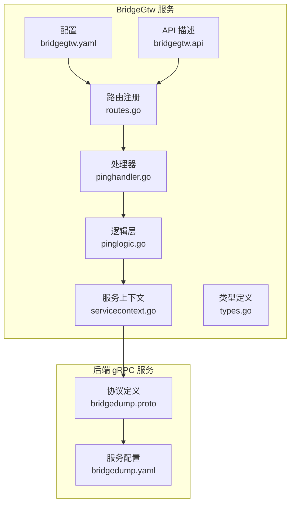
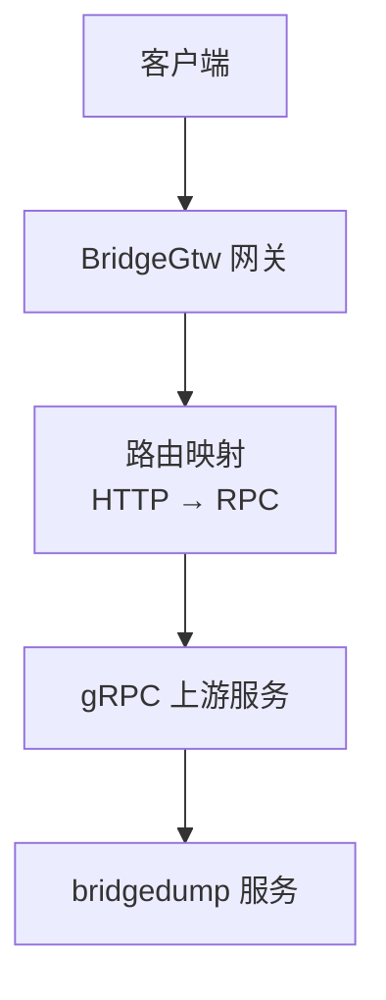
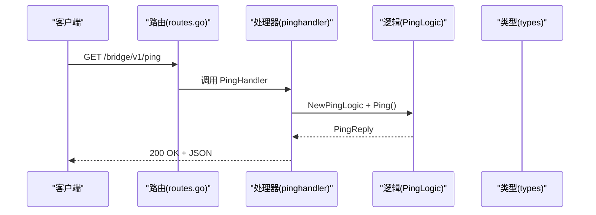
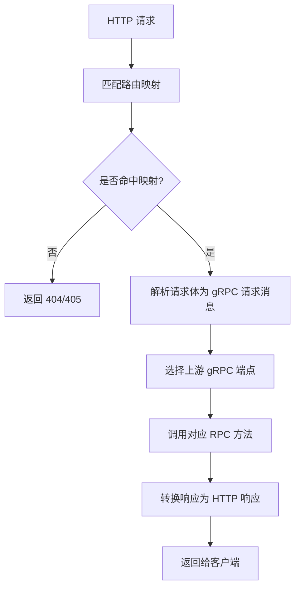
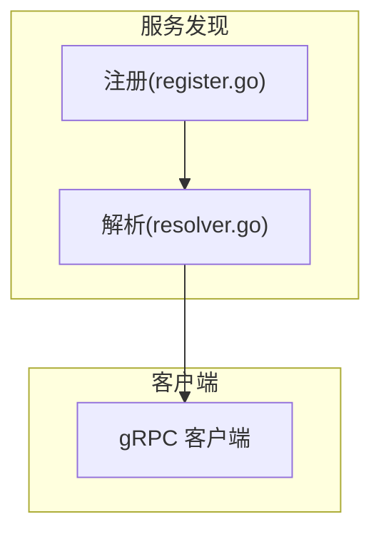

# BridgeGtw 服务

<cite>
**本文引用的文件**
- [app/bridgegtw/etc/bridgegtw.yaml](file://app/bridgegtw/etc/bridgegtw.yaml)
- [app/bridgegtw/internal/config/config.go](file://app/bridgegtw/internal/config/config.go)
- [app/bridgegtw/bridgegtw.api](file://app/bridgegtw/bridgegtw.api)
- [app/bridgegtw/internal/handler/routes.go](file://app/bridgegtw/internal/handler/routes.go)
- [app/bridgegtw/internal/handler/bridgeGtw/pinghandler.go](file://app/bridgegtw/internal/handler/bridgeGtw/pinghandler.go)
- [app/bridgegtw/internal/logic/bridgeGtw/pinglogic.go](file://app/bridgegtw/internal/logic/bridgeGtw/pinglogic.go)
- [app/bridgegtw/internal/svc/servicecontext.go](file://app/bridgegtw/internal/svc/servicecontext.go)
- [app/bridgegtw/internal/types/types.go](file://app/bridgegtw/internal/types/types.go)
- [app/bridgedump/bridgedump.proto](file://app/bridgedump/bridgedump.proto)
- [app/bridgedump/etc/bridgedump.yaml](file://app/bridgedump/etc/bridgedump.yaml)
- [common/nacosx/register.go](file://common/nacosx/register.go)
- [common/nacosx/resolver.go](file://common/nacosx/resolver.go)
- [.trae/skills/zero-skills/references/resilience-patterns.md](file://.trae/skills/zero-skills/references/resilience-patterns.md)
</cite>

## 目录
1. [简介](#简介)
2. [项目结构](#项目结构)
3. [核心组件](#核心组件)
4. [架构总览](#架构总览)
5. [详细组件分析](#详细组件分析)
6. [依赖分析](#依赖分析)
7. [性能考虑](#性能考虑)
8. [故障排查指南](#故障排查指南)
9. [结论](#结论)
10. [附录](#附录)

## 简介
BridgeGtw 是一个基于 go-zero gateway 的 HTTP 网关服务，负责将 HTTP 请求转发至 gRPC 后端服务，并提供统一的路由与协议转换能力。在本仓库中，BridgeGtw 通过配置文件映射 HTTP 到 gRPC 的 RPC 方法，支持多上游 gRPC 服务端点、超时控制、以及可扩展的服务发现与负载均衡。

当前仓库中还包含一个示例 gRPC 服务 bridgedump，用于演示 HTTP 到 gRPC 的转发流程。该服务暴露多个 RPC 方法，如 CableWorkList、CableFault、CableFaultWave 等，BridgeGtw 可将特定 HTTP 路由映射到这些 RPC。

## 项目结构
BridgeGtw 服务位于 app/bridgegtw 目录下，采用 goctl 生成的标准目录结构：
- etc 配置目录：包含服务启动配置 bridgegtw.yaml
- internal：内部实现
  - config：配置结构体封装 gateway.GatewayConf
  - handler：HTTP 路由注册与处理器
  - logic：业务逻辑层
  - svc：服务上下文
  - types：通用类型定义
- bridgegtw.api：REST API 描述文件（当前仅包含 ping）

**图表来源**
- [app/bridgegtw/etc/bridgegtw.yaml:12-40](file://app/bridgegtw/etc/bridgegtw.yaml#L12-L40)
- [app/bridgegtw/bridgegtw.api:13-21](file://app/bridgegtw/bridgegtw.api#L13-L21)
- [app/bridgegtw/internal/handler/routes.go:15-27](file://app/bridgegtw/internal/handler/routes.go#L15-L27)
- [app/bridgegtw/internal/handler/bridgeGtw/pinghandler.go:12-22](file://app/bridgegtw/internal/handler/bridgeGtw/pinghandler.go#L12-L22)
- [app/bridgegtw/internal/logic/bridgeGtw/pinglogic.go:27-31](file://app/bridgegtw/internal/logic/bridgeGtw/pinglogic.go#L27-L31)
- [app/bridgegtw/internal/svc/servicecontext.go:7-15](file://app/bridgegtw/internal/svc/servicecontext.go#L7-L15)
- [app/bridgegtw/internal/types/types.go:6-21](file://app/bridgegtw/internal/types/types.go#L6-L21)
- [app/bridgedump/bridgedump.proto:115-124](file://app/bridgedump/bridgedump.proto#L115-L124)
- [app/bridgedump/etc/bridgedump.yaml:1-10](file://app/bridgedump/etc/bridgedump.yaml#L1-L10)

**章节来源**
- [app/bridgegtw/etc/bridgegtw.yaml:12-40](file://app/bridgegtw/etc/bridgegtw.yaml#L12-L40)
- [app/bridgegtw/internal/config/config.go:5-7](file://app/bridgegtw/internal/config/config.go#L5-L7)
- [app/bridgegtw/bridgegtw.api:13-21](file://app/bridgegtw/bridgegtw.api#L13-L21)
- [app/bridgegtw/internal/handler/routes.go:15-27](file://app/bridgegtw/internal/handler/routes.go#L15-L27)
- [app/bridgegtw/internal/handler/bridgeGtw/pinghandler.go:12-22](file://app/bridgegtw/internal/handler/bridgeGtw/pinghandler.go#L12-L22)
- [app/bridgegtw/internal/logic/bridgeGtw/pinglogic.go:27-31](file://app/bridgegtw/internal/logic/bridgeGtw/pinglogic.go#L27-L31)
- [app/bridgegtw/internal/svc/servicecontext.go:7-15](file://app/bridgegtw/internal/svc/servicecontext.go#L7-L15)
- [app/bridgegtw/internal/types/types.go:6-21](file://app/bridgegtw/internal/types/types.go#L6-L21)
- [app/bridgedump/bridgedump.proto:115-124](file://app/bridgedump/bridgedump.proto#L115-L124)
- [app/bridgedump/etc/bridgedump.yaml:1-10](file://app/bridgedump/etc/bridgedump.yaml#L1-L10)

## 核心组件
- 配置与启动
  - BridgeGtw 使用 gateway.GatewayConf 作为基础配置，支持监听地址、端口、日志、超时等参数。
  - Upstreams 配置中可定义 gRPC 上游服务端点、非阻塞模式、ProtoSets 以及 HTTP 到 RPC 的映射规则。
- HTTP 网关
  - 通过 bridgegtw.api 定义 REST 接口前缀与分组；当前包含 /ping 路由。
  - routes.go 注册具体路由，绑定到对应的处理器。
- 处理器与逻辑
  - pinghandler 将 HTTP 请求交由 PingLogic 处理，返回 JSON 响应。
  - PingLogic 返回 PingReply 类型，包含简单的健康检查消息。
- 类型与上下文
  - types.go 提供通用类型定义；servicecontext 持有配置对象。

**章节来源**
- [app/bridgegtw/internal/config/config.go:5-7](file://app/bridgegtw/internal/config/config.go#L5-L7)
- [app/bridgegtw/etc/bridgegtw.yaml:12-40](file://app/bridgegtw/etc/bridgegtw.yaml#L12-L40)
- [app/bridgegtw/bridgegtw.api:13-21](file://app/bridgegtw/bridgegtw.api#L13-L21)
- [app/bridgegtw/internal/handler/routes.go:15-27](file://app/bridgegtw/internal/handler/routes.go#L15-L27)
- [app/bridgegtw/internal/handler/bridgeGtw/pinghandler.go:12-22](file://app/bridgegtw/internal/handler/bridgeGtw/pinghandler.go#L12-L22)
- [app/bridgegtw/internal/logic/bridgeGtw/pinglogic.go:27-31](file://app/bridgegtw/internal/logic/bridgeGtw/pinglogic.go#L27-L31)
- [app/bridgegtw/internal/types/types.go:13-15](file://app/bridgegtw/internal/types/types.go#L13-L15)
- [app/bridgegtw/internal/svc/servicecontext.go:7-15](file://app/bridgegtw/internal/svc/servicecontext.go#L7-L15)

## 架构总览
BridgeGtw 作为 HTTP 网关，接收来自客户端的 HTTP 请求，根据配置将请求转发到 gRPC 上游服务。配置文件中定义了 Upstreams、ProtoSets 与映射规则，从而实现 HTTP 到 gRPC 的自动转换。

**图表来源**
- [app/bridgegtw/etc/bridgegtw.yaml:25-40](file://app/bridgegtw/etc/bridgegtw.yaml#L25-L40)
- [app/bridgedump/bridgedump.proto:115-124](file://app/bridgedump/bridgedump.proto#L115-L124)

## 详细组件分析

### HTTP 请求处理与路由转发
- 路由注册
  - routes.go 中注册 GET /ping，绑定到 bridgeGtw.PingHandler。
- 处理器
  - pinghandler 创建 PingLogic 并调用 Ping()，将错误通过 httpx.ErrorCtx 返回，成功通过 httpx.OkJsonCtx 返回。
- 逻辑层
  - PingLogic 返回 PingReply，包含字符串消息字段，用于健康检查或简单测试。

**图表来源**
- [app/bridgegtw/internal/handler/routes.go:15-27](file://app/bridgegtw/internal/handler/routes.go#L15-L27)
- [app/bridgegtw/internal/handler/bridgeGtw/pinghandler.go:12-22](file://app/bridgegtw/internal/handler/bridgeGtw/pinghandler.go#L12-L22)
- [app/bridgegtw/internal/logic/bridgeGtw/pinglogic.go:27-31](file://app/bridgegtw/internal/logic/bridgeGtw/pinglogic.go#L27-L31)
- [app/bridgegtw/internal/types/types.go:13-15](file://app/bridgegtw/internal/types/types.go#L13-L15)

**章节来源**
- [app/bridgegtw/internal/handler/routes.go:15-27](file://app/bridgegtw/internal/handler/routes.go#L15-L27)
- [app/bridgegtw/internal/handler/bridgeGtw/pinghandler.go:12-22](file://app/bridgegtw/internal/handler/bridgeGtw/pinghandler.go#L12-L22)
- [app/bridgegtw/internal/logic/bridgeGtw/pinglogic.go:27-31](file://app/bridgegtw/internal/logic/bridgeGtw/pinglogic.go#L27-L31)
- [app/bridgegtw/internal/types/types.go:13-15](file://app/bridgegtw/internal/types/types.go#L13-L15)

### gRPC 转发与映射
- 映射配置
  - Upstreams.grpc.Endpoints 指定 gRPC 服务端点列表。
  - ProtoSets 指向 bridgedump.pb 文件，用于加载 bridgedump 服务的 RPC 定义。
  - Mappings 将 HTTP POST 路由映射到具体的 gRPC RPC 方法，例如：
    - /api/external/cable/workList → bridgedump.BridgeDumpRpc/CableWorkList
    - /api/external/cable/fault → bridgedump.BridgeDumpRpc/CableFault
    - /api/external/cable/faultWave → bridgedump.BridgeDumpRpc/CableFaultWave
- 协议与类型
  - bridgedump.proto 定义了 BridgeDumpRpc 服务及多个请求/响应消息类型，如 CableWorkListReq/CableWorkListRes、CableFaultReq/CableFaultRes、CableFaultWaveReq/CableFaultWaveRes。

**图表来源**
- [app/bridgegtw/etc/bridgegtw.yaml:25-40](file://app/bridgegtw/etc/bridgegtw.yaml#L25-L40)
- [app/bridgedump/bridgedump.proto:115-124](file://app/bridgedump/bridgedump.proto#L115-L124)

**章节来源**
- [app/bridgegtw/etc/bridgegtw.yaml:25-40](file://app/bridgegtw/etc/bridgegtw.yaml#L25-L40)
- [app/bridgedump/bridgedump.proto:115-124](file://app/bridgedump/bridgedump.proto#L115-L124)

### 负载均衡与服务发现
- 负载均衡
  - Upstreams.grpc.Endpoints 支持多端点，Gateway 会基于内置策略进行负载均衡。
- 服务发现
  - 仓库中提供了基于 Nacos 的服务发现与解析工具，可用于在客户端侧进行服务发现与连接管理。
  - register.go 与 resolver.go 展示了如何注册与解析服务目标，便于在 gRPC 客户端侧集成服务发现。

**图表来源**
- [common/nacosx/register.go](file://common/nacosx/register.go)
- [common/nacosx/resolver.go](file://common/nacosx/resolver.go)

**章节来源**
- [common/nacosx/register.go](file://common/nacosx/register.go)
- [common/nacosx/resolver.go](file://common/nacosx/resolver.go)

### 错误处理与重试策略
- 错误处理
  - HTTP 层通过 httpx.ErrorCtx 将错误返回给客户端。
  - 网关层对 gRPC 调用失败时，应返回相应的 HTTP 错误码与错误信息。
- 重试策略
  - 可参考仓库中的弹性模式文档，提供简单重试与指数退避的实现思路，适用于客户端侧的 gRPC 调用增强。

**章节来源**
- [app/bridgegtw/internal/handler/bridgeGtw/pinghandler.go:16-18](file://app/bridgegtw/internal/handler/bridgeGtw/pinghandler.go#L16-L18)
- [.trae/skills/zero-skills/references/resilience-patterns.md:423-488](file://.trae/skills/zero-skills/references/resilience-patterns.md#L423-L488)

### 健康检查与熔断保护
- 健康检查
  - 当前 /ping 返回固定消息，可作为基础健康检查接口。
- 熔断保护
  - 弹性模式文档提供了熔断器、限流、超时等保护机制的指标与日志建议，可在客户端侧结合服务发现与重试策略实现。

**章节来源**
- [app/bridgegtw/internal/logic/bridgeGtw/pinglogic.go:27-31](file://app/bridgegtw/internal/logic/bridgeGtw/pinglogic.go#L27-L31)
- [.trae/skills/zero-skills/references/resilience-patterns.md:621-659](file://.trae/skills/zero-skills/references/resilience-patterns.md#L621-L659)

## 依赖分析
BridgeGtw 与 bridgedump 服务之间的依赖关系如下：

**图表来源**
- [app/bridgegtw/etc/bridgegtw.yaml:29-30](file://app/bridgegtw/etc/bridgegtw.yaml#L29-L30)
- [app/bridgedump/bridgedump.proto:1-124](file://app/bridgedump/bridgedump.proto#L1-L124)
- [app/bridgedump/etc/bridgedump.yaml:1-10](file://app/bridgedump/etc/bridgedump.yaml#L1-L10)

**章节来源**
- [app/bridgegtw/etc/bridgegtw.yaml:29-30](file://app/bridgegtw/etc/bridgegtw.yaml#L29-L30)
- [app/bridgedump/bridgedump.proto:1-124](file://app/bridgedump/bridgedump.proto#L1-L124)
- [app/bridgedump/etc/bridgedump.yaml:1-10](file://app/bridgedump/etc/bridgedump.yaml#L1-L10)

## 性能考虑
- 超时控制
  - 网关与上游服务均应设置合理的超时时间，避免请求堆积导致资源耗尽。
- 负载均衡
  - 多端点配置可提升吞吐与可用性，需结合后端服务能力合理分配流量。
- 日志与监控
  - 建议开启网关访问日志与关键指标埋点，配合弹性模式文档中的指标体系进行观测。

## 故障排查指南
- 常见问题
  - 路由不匹配：确认 HTTP 方法与路径是否与映射一致。
  - gRPC 连接失败：检查 Upstreams.grpc.Endpoints 是否可达，ProtoSets 路径是否正确。
  - 健康检查异常：确认 /ping 是否正常返回。
- 排查步骤
  - 查看网关日志级别与输出路径，定位错误堆栈。
  - 使用 curl 或 Postman 对 /ping 与映射的 HTTP 路由进行验证。
  - 在客户端侧启用重试与退避策略，观察网络抖动下的稳定性。

**章节来源**
- [app/bridgegtw/etc/bridgegtw.yaml:5-11](file://app/bridgegtw/etc/bridgegtw.yaml#L5-L11)
- [app/bridgegtw/internal/handler/bridgeGtw/pinghandler.go:16-20](file://app/bridgegtw/internal/handler/bridgeGtw/pinghandler.go#L16-L20)

## 结论
BridgeGtw 通过配置驱动的方式实现了 HTTP 到 gRPC 的高效转发，具备清晰的路由映射、可扩展的服务发现与弹性策略支持。结合当前仓库中的示例 gRPC 服务，可以快速构建稳定可靠的网关层，满足多业务场景下的 API 转换与治理需求。

## 附录
- 接口清单（基于当前配置）
  - GET /bridge/v1/ping → 返回 PingReply
  - POST /api/external/cable/workList → 转发至 bridgedump.BridgeDumpRpc/CableWorkList
  - POST /api/external/cable/fault → 转发至 bridgedump.BridgeDumpRpc/CableFault
  - POST /api/external/cable/faultWave → 转发至 bridgedump.BridgeDumpRpc/CableFaultWave

**章节来源**
- [app/bridgegtw/bridgegtw.api:17-21](file://app/bridgegtw/bridgegtw.api#L17-L21)
- [app/bridgegtw/etc/bridgegtw.yaml:32-40](file://app/bridgegtw/etc/bridgegtw.yaml#L32-L40)
- [app/bridgedump/bridgedump.proto:115-124](file://app/bridgedump/bridgedump.proto#L115-L124)