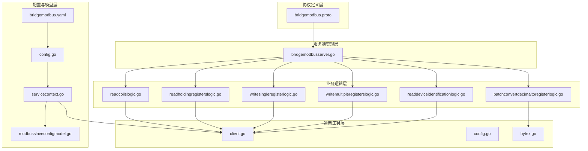
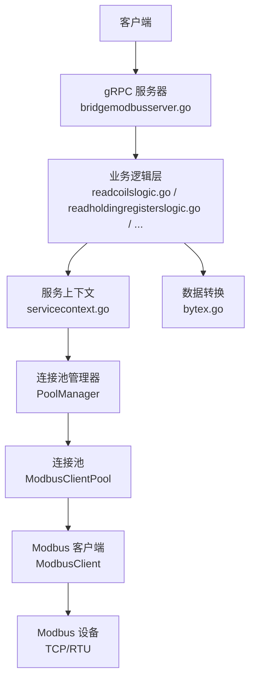
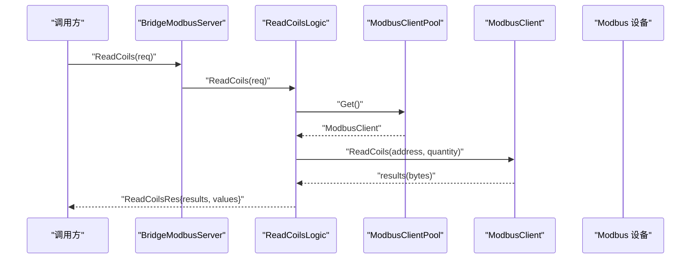
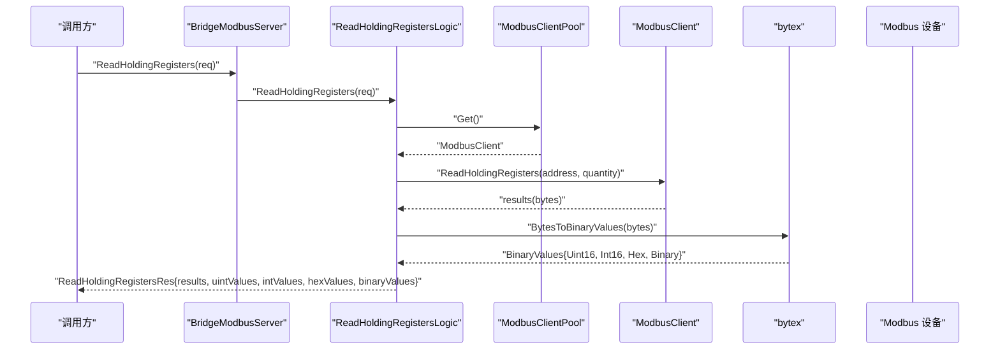
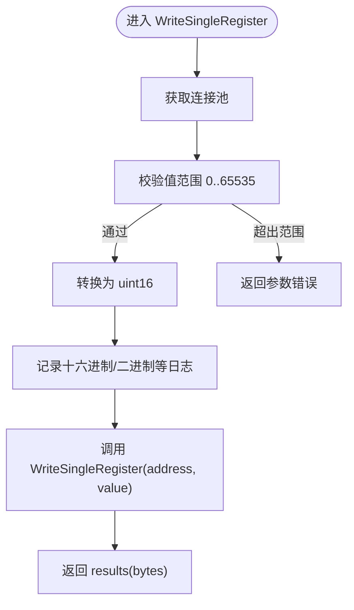
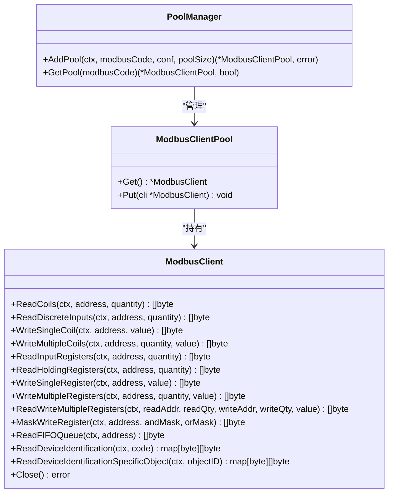
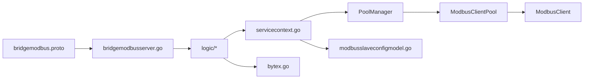

# BridgeModbus 服务

<cite>
**本文引用的文件**
- [bridgemodbus.proto](file://app/bridgemodbus/bridgemodbus.proto)
- [config.go](file://app/bridgemodbus/internal/config/config.go)
- [servicecontext.go](file://app/bridgemodbus/internal/svc/servicecontext.go)
- [bridgemodbus.yaml](file://app/bridgemodbus/etc/bridgemodbus.yaml)
- [client.go](file://common/modbusx/client.go)
- [config.go](file://common/modbusx/config.go)
- [bytex.go](file://common/bytex/bytex.go)
- [bridgemodbusserver.go](file://app/bridgemodbus/internal/server/bridgemodbusserver.go)
- [readcoilslogic.go](file://app/bridgemodbus/internal/logic/readcoilslogic.go)
- [readholdingregisterslogic.go](file://app/bridgemodbus/internal/logic/readholdingregisterslogic.go)
- [writesingleregisterlogic.go](file://app/bridgemodbus/internal/logic/writesingleregisterlogic.go)
- [writemultipleregisterslogic.go](file://app/bridgemodbus/internal/logic/writemultipleregisterslogic.go)
- [readdeviceidentificationlogic.go](file://app/bridgemodbus/internal/logic/readdeviceidentificationlogic.go)
- [batchconvertdecimaltoregisterlogic.go](file://app/bridgemodbus/internal/logic/batchconvertdecimaltoregisterlogic.go)
- [modbusslaveconfigmodel.go](file://model/modbusslaveconfigmodel.go)
</cite>

## 目录
1. [简介](#简介)
2. [项目结构](#项目结构)
3. [核心组件](#核心组件)
4. [架构总览](#架构总览)
5. [详细组件分析](#详细组件分析)
6. [依赖关系分析](#依赖关系分析)
7. [性能考虑](#性能考虑)
8. [故障排查指南](#故障排查指南)
9. [结论](#结论)
10. [附录](#附录)

## 简介
BridgeModbus 服务是一个基于 gRPC 的 Modbus 协议桥接服务，提供对 Modbus RTU/TCP 设备的统一访问能力。该服务支持配置管理、连接池、设备识别、寄存器读写与批量操作，并提供十进制数值与 Modbus 寄存器格式之间的双向转换工具。通过统一的 RPC 接口，用户可以以一致的方式访问不同类型的 Modbus 设备，同时具备完善的错误处理与日志记录能力。

## 项目结构
BridgeModbus 服务采用典型的 Go-Zero 微服务结构，主要模块包括：
- 协议定义层：通过 .proto 文件定义 gRPC 接口与消息结构
- 服务端实现层：生成的 gRPC 服务器与各 RPC 方法的逻辑实现
- 业务逻辑层：针对每个 RPC 方法的具体业务逻辑封装
- 通用工具层：Modbus 客户端封装、连接池、字节与数值转换工具
- 配置与模型层：服务配置、数据库模型与配置转换

**图表来源**
- [bridgemodbus.proto:1-83](file://app/bridgemodbus/bridgemodbus.proto#L1-L83)
- [bridgemodbusserver.go:1-151](file://app/bridgemodbus/internal/server/bridgemodbusserver.go#L1-L151)
- [client.go:1-218](file://common/modbusx/client.go#L1-L218)
- [config.go:1-125](file://common/modbusx/config.go#L1-L125)
- [bytex.go:1-239](file://common/bytex/bytex.go#L1-L239)
- [config.go:1-26](file://app/bridgemodbus/internal/config/config.go#L1-L26)
- [servicecontext.go:1-81](file://app/bridgemodbus/internal/svc/servicecontext.go#L1-L81)
- [bridgemodbus.yaml:1-26](file://app/bridgemodbus/etc/bridgemodbus.yaml#L1-L26)
- [modbusslaveconfigmodel.go:1-32](file://model/modbusslaveconfigmodel.go#L1-L32)

**章节来源**
- [bridgemodbus.proto:1-83](file://app/bridgemodbus/bridgemodbus.proto#L1-L83)
- [bridgemodbusserver.go:1-151](file://app/bridgemodbus/internal/server/bridgemodbusserver.go#L1-L151)
- [client.go:1-218](file://common/modbusx/client.go#L1-L218)
- [config.go:1-125](file://common/modbusx/config.go#L1-L125)
- [bytex.go:1-239](file://common/bytex/bytex.go#L1-L239)
- [config.go:1-26](file://app/bridgemodbus/internal/config/config.go#L1-L26)
- [servicecontext.go:1-81](file://app/bridgemodbus/internal/svc/servicecontext.go#L1-L81)
- [bridgemodbus.yaml:1-26](file://app/bridgemodbus/etc/bridgemodbus.yaml#L1-L26)
- [modbusslaveconfigmodel.go:1-32](file://model/modbusslaveconfigmodel.go#L1-L32)

## 核心组件
- gRPC 服务定义：在 bridgemodbus.proto 中定义了完整的 RPC 接口集合，覆盖配置管理、位访问、16 位寄存器访问、读写多寄存器、屏蔽写寄存器、FIFO 队列读取以及设备识别等。
- Modbus 客户端与连接池：在 common/modbusx 中封装了 Modbus 客户端与连接池，支持 TCP、可选 TLS、超时控制与空闲回收。
- 数据类型转换：bytex 工具提供字节与数值之间的双向转换，确保 gRPC 响应中包含多种表达形式（十六进制、二进制、有符号/无符号整数）。
- 服务上下文与连接池管理：ServiceContext 负责初始化默认连接池与按 modbusCode 的动态连接池管理，支持并发安全与资源生命周期管理。
- 配置模型与转换：ModbusSlaveConfigModel 提供数据库访问接口，ServiceContext 将数据库配置转换为 Modbus 客户端配置。

**章节来源**
- [bridgemodbus.proto:10-83](file://app/bridgemodbus/bridgemodbus.proto#L10-L83)
- [client.go:146-191](file://common/modbusx/client.go#L146-L191)
- [bytex.go:7-239](file://common/bytex/bytex.go#L7-L239)
- [servicecontext.go:14-81](file://app/bridgemodbus/internal/svc/servicecontext.go#L14-L81)
- [modbusslaveconfigmodel.go:1-32](file://model/modbusslaveconfigmodel.go#L1-L32)

## 架构总览
BridgeModbus 服务的整体架构围绕“协议定义—服务实现—业务逻辑—通用工具—配置与模型”展开，形成清晰的分层与职责分离。gRPC 服务器负责路由请求到对应的逻辑层，逻辑层通过 ServiceContext 获取连接池并调用 Modbus 客户端执行具体操作，最终将结果以多种数据格式返回给调用方。

**图表来源**
- [bridgemodbusserver.go:15-151](file://app/bridgemodbus/internal/server/bridgemodbusserver.go#L15-L151)
- [readcoilslogic.go:26-43](file://app/bridgemodbus/internal/logic/readcoilslogic.go#L26-L43)
- [readholdingregisterslogic.go:27-57](file://app/bridgemodbus/internal/logic/readholdingregisterslogic.go#L27-L57)
- [servicecontext.go:34-80](file://app/bridgemodbus/internal/svc/servicecontext.go#L34-L80)
- [client.go:146-191](file://common/modbusx/client.go#L146-L191)
- [bytex.go:136-189](file://common/bytex/bytex.go#L136-L189)

## 详细组件分析

### gRPC 服务与接口规范
BridgeModbus 服务通过单一服务 BridgeModbus 暴露所有 Modbus 操作接口，分为以下几类：
- 配置管理：保存、删除、分页查询、按编码查询、批量按编码查询
- 位访问：读取线圈、读取离散输入、写单个线圈、写多个线圈
- 16 位寄存器访问：读取输入寄存器、读取保持寄存器、写单个寄存器、写多个寄存器、读写多寄存器、屏蔽写寄存器
- FIFO 队列与设备识别：读取 FIFO 队列、读取设备标识、读取特定对象 ID 的设备标识
- 数据转换：批量十进制数值转寄存器格式

每类接口均包含请求与响应消息，响应中通常包含原始字节数据与多种派生格式（十六进制、二进制、有符号/无符号整数），便于上层业务快速处理。

**章节来源**
- [bridgemodbus.proto:10-83](file://app/bridgemodbus/bridgemodbus.proto#L10-L83)

### 读取线圈（ReadCoils）
- 请求参数：modbusCode、起始地址、数量（1–2000）
- 响应字段：原始字节与布尔数组
- 实现流程：通过 ServiceContext 获取连接池，获取客户端执行读取，将字节转换为布尔数组返回

**图表来源**
- [bridgemodbusserver.go:56-60](file://app/bridgemodbus/internal/server/bridgemodbusserver.go#L56-L60)
- [readcoilslogic.go:26-43](file://app/bridgemodbus/internal/logic/readcoilslogic.go#L26-L43)
- [client.go:29-32](file://common/modbusx/client.go#L29-L32)

**章节来源**
- [readcoilslogic.go:1-44](file://app/bridgemodbus/internal/logic/readcoilslogic.go#L1-L44)

### 读取保持寄存器（ReadHoldingRegisters）
- 请求参数：modbusCode、起始地址、数量（1–125）
- 响应字段：原始字节、无符号/有符号整数、十六进制、二进制
- 实现流程：通过 ServiceContext 获取连接池，获取客户端执行读取，使用 bytex 将字节转换为多种格式返回

**图表来源**
- [bridgemodbusserver.go:86-90](file://app/bridgemodbus/internal/server/bridgemodbusserver.go#L86-L90)
- [readholdingregisterslogic.go:27-57](file://app/bridgemodbus/internal/logic/readholdingregisterslogic.go#L27-L57)
- [client.go:54-57](file://common/modbusx/client.go#L54-L57)
- [bytex.go:136-161](file://common/bytex/bytex.go#L136-L161)

**章节来源**
- [readholdingregisterslogic.go:1-58](file://app/bridgemodbus/internal/logic/readholdingregisterslogic.go#L1-L58)

### 写单个保持寄存器（WriteSingleRegister）
- 请求参数：modbusCode、寄存器地址、值（0–65535）
- 响应字段：回显字节
- 实现流程：参数校验、转换为 uint16、记录日志、调用客户端写入、返回回显

**图表来源**
- [writesingleregisterlogic.go:29-54](file://app/bridgemodbus/internal/logic/writesingleregisterlogic.go#L29-L54)
- [client.go:59-62](file://common/modbusx/client.go#L59-L62)

**章节来源**
- [writesingleregisterlogic.go:1-55](file://app/bridgemodbus/internal/logic/writesingleregisterlogic.go#L1-L55)

### 写多个保持寄存器（WriteMultipleRegisters）
- 请求参数：modbusCode、起始地址、数量、值列表（每个值 0–65535）
- 响应字段：回显数量
- 实现流程：校验数量一致性与值范围、转换为 uint16 列表、转换为字节、调用客户端写入、返回回显

**章节来源**
- [writemultipleregisterslogic.go:1-62](file://app/bridgemodbus/internal/logic/writemultipleregisterslogic.go#L1-L62)

### 读取设备标识（ReadDeviceIdentification）
- 请求参数：modbusCode、读取类型（基本/常规/扩展）
- 响应字段：原始对象 ID 映射、十六进制对象 ID 映射、语义化映射
- 实现流程：调用客户端读取设备标识，将结果映射为三种格式返回

**章节来源**
- [readdeviceidentificationlogic.go:1-70](file://app/bridgemodbus/internal/logic/readdeviceidentificationlogic.go#L1-L70)

### 批量十进制数值转寄存器（BatchConvertDecimalToRegister）
- 请求参数：整数列表、是否无符号
- 响应字段：无符号两字节数值、有符号数值、十六进制、二进制、字节数组
- 实现流程：校验范围（无符号 0–65535，有符号 -32768–32767）、转换为 uint16、使用 bytex 生成多种格式

**章节来源**
- [batchconvertdecimaltoregisterlogic.go:1-68](file://app/bridgemodbus/internal/logic/batchconvertdecimaltoregisterlogic.go#L1-L68)

### Modbus 客户端与连接池
- ModbusClient：封装底层 modbus.Client，提供所有功能码的调用方法，支持 TLS、超时与日志。
- ModbusClientPool：连接池，支持并发获取与归还、最大空闲时间回收。
- PoolManager：按 modbusCode 管理多个连接池，支持并发安全与重复添加时的处理。

**图表来源**
- [client.go:20-97](file://common/modbusx/client.go#L20-L97)
- [client.go:146-191](file://common/modbusx/client.go#L146-L191)
- [config.go:63-124](file://common/modbusx/config.go#L63-L124)

**章节来源**
- [client.go:1-218](file://common/modbusx/client.go#L1-L218)
- [config.go:1-125](file://common/modbusx/config.go#L1-L125)

### 数据类型转换与点位映射
- bytex 提供字节与数值之间的双向转换，支持：
  - 字节 → uint16 → int16
  - uint16/uint32/int16/int32 之间的转换
  - 十六进制与二进制字符串格式
  - 布尔位与字节互转（用于线圈/离散输入）
- 在读取寄存器与写入寄存器的响应中，服务会同时返回多种格式，便于上层业务直接使用。

**章节来源**
- [bytex.go:1-239](file://common/bytex/bytex.go#L1-L239)

### 设备配置管理与连接池管理
- ServiceContext 负责：
  - 初始化默认连接池与 PoolManager
  - 通过 ModbusSlaveConfigModel 查询配置并转换为客户端配置
  - 按 modbusCode 动态创建或获取连接池
- 支持并发安全与错误包装，便于统一错误处理。

**章节来源**
- [servicecontext.go:1-81](file://app/bridgemodbus/internal/svc/servicecontext.go#L1-L81)
- [modbusslaveconfigmodel.go:1-32](file://model/modbusslaveconfigmodel.go#L1-L32)

## 依赖关系分析
BridgeModbus 服务的依赖关系清晰，遵循“上层调用下层”的原则：
- gRPC 服务器依赖业务逻辑层
- 业务逻辑层依赖 ServiceContext
- ServiceContext 依赖连接池与配置模型
- 连接池依赖 Modbus 客户端
- 数据转换依赖 bytex 工具

**图表来源**
- [bridgemodbus.proto:1-83](file://app/bridgemodbus/bridgemodbus.proto#L1-L83)
- [bridgemodbusserver.go:1-151](file://app/bridgemodbus/internal/server/bridgemodbusserver.go#L1-L151)
- [servicecontext.go:1-81](file://app/bridgemodbus/internal/svc/servicecontext.go#L1-L81)
- [client.go:146-191](file://common/modbusx/client.go#L146-L191)
- [bytex.go:1-239](file://common/bytex/bytex.go#L1-L239)
- [modbusslaveconfigmodel.go:1-32](file://model/modbusslaveconfigmodel.go#L1-L32)

**章节来源**
- [bridgemodbusserver.go:1-151](file://app/bridgemodbus/internal/server/bridgemodbusserver.go#L1-L151)
- [servicecontext.go:1-81](file://app/bridgemodbus/internal/svc/servicecontext.go#L1-L81)

## 性能考虑
- 连接池复用：通过 ModbusClientPool 与 PoolManager 实现连接复用，减少频繁建链开销。
- 超时与空闲回收：客户端配置支持超时、空闲超时与最大空闲时间回收，避免资源泄露。
- 并发安全：PoolManager 使用读写锁保证并发安全，适合高并发场景。
- 数据转换优化：bytex 提供高效的字节与数值转换，避免重复计算与内存分配。

[本节为通用性能建议，无需列出具体文件来源]

## 故障排查指南
- 参数校验错误：写寄存器接口会对值范围进行严格校验，超出范围将返回参数错误。
- 连接池获取失败：当 modbusCode 为空或配置不存在/未启用时，会返回相应错误。
- 设备通信异常：ModbusClient 封装了底层客户端，错误会在调用链中透传，可通过日志定位问题。
- TLS 配置问题：若启用 TLS，需确保证书与 CA 文件路径正确且可读。

**章节来源**
- [writesingleregisterlogic.go:38-40](file://app/bridgemodbus/internal/logic/writesingleregisterlogic.go#L38-L40)
- [servicecontext.go:34-54](file://app/bridgemodbus/internal/svc/servicecontext.go#L34-L54)
- [client.go:107-143](file://common/modbusx/client.go#L107-L143)

## 结论
BridgeModbus 服务通过清晰的分层设计与完善的工具链，提供了稳定、易用的 Modbus 设备访问能力。其 gRPC 接口覆盖了常见的 Modbus 功能码，并在响应中提供多种数据格式，便于上层业务快速集成。配合连接池与 TLS 支持，服务能够在生产环境中高效、安全地运行。

[本节为总结性内容，无需列出具体文件来源]

## 附录

### 配置项说明
- 服务监听与日志：ListenOn、Timeout、Log.Path、Log.Level
- 连接池大小：ModbusPool
- Nacos 注册：IsRegister、Host、Port、Username、PassWord、NamespaceId、ServiceName
- 数据库连接：DB.DataSource
- Modbus 客户端默认配置：Address、Slave

**章节来源**
- [bridgemodbus.yaml:1-26](file://app/bridgemodbus/etc/bridgemodbus.yaml#L1-L26)
- [config.go:9-25](file://app/bridgemodbus/internal/config/config.go#L9-L25)