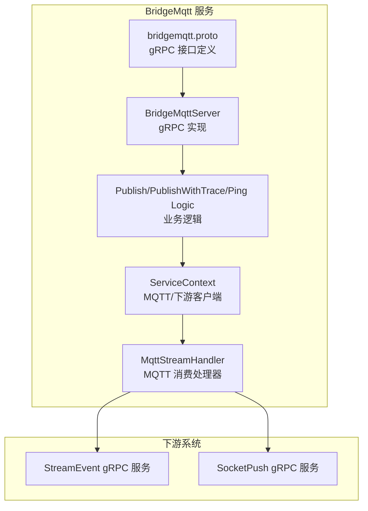
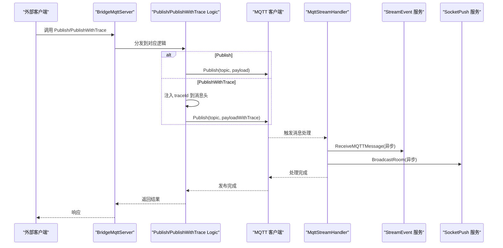
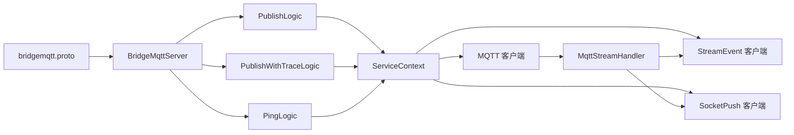

# BridgeMqtt 服务

<cite>
**本文引用的文件**
- [bridgemqtt.proto](file://app/bridgemqtt/bridgemqtt.proto)
- [bridgemqttserver.go](file://app/bridgemqtt/internal/server/bridgemqttserver.go)
- [publishlogic.go](file://app/bridgemqtt/internal/logic/publishlogic.go)
- [publishwithtracelogic.go](file://app/bridgemqtt/internal/logic/publishwithtracelogic.go)
- [pinglogic.go](file://app/bridgemqtt/internal/logic/pinglogic.go)
- [servicecontext.go](file://app/bridgemqtt/internal/svc/servicecontext.go)
- [config.go](file://app/bridgemqtt/internal/config/config.go)
- [bridgemqtt.yaml](file://app/bridgemqtt/etc/bridgemqtt.yaml)
- [mqttx.go](file://common/mqttx/mqttx.go)
- [message.go](file://common/mqttx/message.go)
- [trace.go](file://common/mqttx/trace.go)
- [mqttstreamhandler.go](file://app/bridgemqtt/internal/handler/mqttstreamhandler.go)
- [streamevent.proto](file://facade/streamevent/streamevent.proto)
- [socketpush.proto](file://socketapp/socketpush/socketpush.proto)
</cite>

## 目录
1. [简介](#简介)
2. [项目结构](#项目结构)
3. [核心组件](#核心组件)
4. [架构总览](#架构总览)
5. [详细组件分析](#详细组件分析)
6. [依赖分析](#依赖分析)
7. [性能考量](#性能考量)
8. [故障排查指南](#故障排查指南)
9. [结论](#结论)
10. [附录](#附录)

## 简介
BridgeMqtt 服务是一个基于 gRPC 的 MQTT 桥接与消息处理服务，提供以下能力：
- 对外暴露 gRPC 接口：Ping、Publish、PublishWithTrace
- 内部订阅指定 MQTT 主题，接收消息并进行桥接转发
- 将 MQTT 消息桥接到 StreamEvent 与 SocketPush 两个下游系统，实现消息路由与广播
- 支持 OpenTelemetry 链路追踪，通过消息头注入/提取 traceId
- 提供主题级别的日志控制与去抖策略，兼顾可观测性与性能

该服务既可作为上游应用向 MQTT 发布消息的入口，也可作为 MQTT 消息的汇聚与转发枢纽。

## 项目结构
BridgeMqtt 服务位于 app/bridgemqtt 目录，采用典型的 go-zero 分层结构：
- proto 定义：对外 gRPC 接口与消息模型
- server 层：gRPC 服务实现，负责方法分发
- logic 层：业务逻辑封装，调用 ServiceContext 中的客户端
- svc 层：服务上下文，负责构建 MQTT 客户端、下游 gRPC 客户端以及订阅处理器
- handler 层：MQTT 消费处理器，负责将消息桥接到下游
- etc 配置：运行参数、MQTT 连接信息、下游服务地址等

图表来源
- [bridgemqtt.proto:10-16](file://app/bridgemqtt/bridgemqtt.proto#L10-L16)
- [bridgemqttserver.go:15-42](file://app/bridgemqtt/internal/server/bridgemqttserver.go#L15-L42)
- [servicecontext.go:16-60](file://app/bridgemqtt/internal/svc/servicecontext.go#L16-L60)
- [mqttstreamhandler.go:99-119](file://app/bridgemqtt/internal/handler/mqttstreamhandler.go#L99-L119)

章节来源
- [bridgemqtt.proto:1-49](file://app/bridgemqtt/bridgemqtt.proto#L1-L49)
- [bridgemqttserver.go:1-42](file://app/bridgemqtt/internal/server/bridgemqttserver.go#L1-L42)
- [servicecontext.go:1-61](file://app/bridgemqtt/internal/svc/servicecontext.go#L1-L61)
- [bridgemqtt.yaml:1-48](file://app/bridgemqtt/etc/bridgemqtt.yaml#L1-L48)

## 核心组件
- gRPC 接口
  - Ping：健康检查
  - Publish：发布 MQTT 消息
  - PublishWithTrace：发布带链路追踪的消息
- MQTT 客户端
  - 支持连接、订阅、发布、自动重连、QoS 控制
  - 支持在消息中注入/提取 traceId，实现跨服务链路追踪
- 消息桥接处理器
  - 将 MQTT 消息转发至 StreamEvent 与 SocketPush
  - 支持主题到事件名映射与默认事件回退
  - 支持主题级别日志开关与最小日志间隔控制
- 服务上下文
  - 统一初始化 MQTT 客户端与下游 gRPC 客户端
  - 在 MQTT OnReady 时注册订阅处理器

章节来源
- [bridgemqtt.proto:10-16](file://app/bridgemqtt/bridgemqtt.proto#L10-L16)
- [mqttx.go:51-64](file://common/mqttx/mqttx.go#L51-L64)
- [mqttx.go:309-333](file://common/mqttx/mqttx.go#L309-L333)
- [mqttstreamhandler.go:99-119](file://app/bridgemqtt/internal/handler/mqttstreamhandler.go#L99-L119)
- [servicecontext.go:16-60](file://app/bridgemqtt/internal/svc/servicecontext.go#L16-L60)

## 架构总览
BridgeMqtt 的整体交互流程如下：
- 外部客户端通过 gRPC 调用 Publish 或 PublishWithTrace
- 服务内部使用 MQTT 客户端将消息发布到指定主题
- MQTT 客户端收到消息后，根据主题匹配对应的处理器
- 处理器将消息桥接到 StreamEvent 与 SocketPush，并记录日志与耗时
- PublishWithTrace 会在消息载荷中嵌入 traceId，便于链路追踪

图表来源
- [bridgemqttserver.go:26-41](file://app/bridgemqtt/internal/server/bridgemqttserver.go#L26-L41)
- [publishlogic.go:27-33](file://app/bridgemqtt/internal/logic/publishlogic.go#L27-L33)
- [publishwithtracelogic.go:31-47](file://app/bridgemqtt/internal/logic/publishwithtracelogic.go#L31-L47)
- [mqttx.go:258-307](file://common/mqttx/mqttx.go#L258-L307)
- [mqttstreamhandler.go:130-188](file://app/bridgemqtt/internal/handler/mqttstreamhandler.go#L130-L188)
- [streamevent.proto:10-25](file://facade/streamevent/streamevent.proto#L10-L25)
- [socketpush.proto:9-36](file://socketapp/socketpush/socketpush.proto#L9-L36)

## 详细组件分析

### gRPC 接口与消息模型
- 服务定义
  - Ping：用于健康检查
  - Publish：发布消息到指定主题
  - PublishWithTrace：发布带 traceId 的消息，便于链路追踪
- 请求/响应模型
  - Ping：Req/Res
  - Publish：PublishReq/PublishRes
  - PublishWithTrace：PublishWithTraceReq/PublishWithTraceRes（包含 traceId）

章节来源
- [bridgemqtt.proto:10-16](file://app/bridgemqtt/bridgemqtt.proto#L10-L16)
- [bridgemqtt.proto:20-26](file://app/bridgemqtt/bridgemqtt.proto#L20-L26)
- [bridgemqtt.proto:28-34](file://app/bridgemqtt/bridgemqtt.proto#L28-L34)
- [bridgemqtt.proto:39-49](file://app/bridgemqtt/bridgemqtt.proto#L39-L49)

### 服务端实现与方法分发
- BridgeMqttServer
  - 将 gRPC 方法映射到对应 Logic
  - Ping -> PingLogic.Ping
  - Publish -> PublishLogic.Publish
  - PublishWithTrace -> PublishWithTraceLogic.PublishWithTrace

章节来源
- [bridgemqttserver.go:15-42](file://app/bridgemqtt/internal/server/bridgemqttserver.go#L15-L42)

### 业务逻辑层
- PublishLogic
  - 直接调用 MQTT 客户端发布消息
- PublishWithTraceLogic
  - 从上下文提取 traceId
  - 将消息封装为包含 headers 的结构
  - 使用 TextMapPropagator 注入 trace 上下文到 headers
  - 发布到指定主题
- PingLogic
  - 返回固定字符串，用于健康检查

章节来源
- [publishlogic.go:26-33](file://app/bridgemqtt/internal/logic/publishlogic.go#L26-L33)
- [publishwithtracelogic.go:30-47](file://app/bridgemqtt/internal/logic/publishwithtracelogic.go#L30-L47)
- [pinglogic.go:26-30](file://app/bridgemqtt/internal/logic/pinglogic.go#L26-L30)

### MQTT 客户端与消息处理
- 客户端能力
  - 连接、自动重连、心跳、超时控制
  - 订阅、发布、QoS 控制（0/1/2）
  - 主题处理器注册与恢复订阅
  - OpenTelemetry 链路追踪埋点
- 消息处理流程
  - 解析消息载荷，若为嵌套消息则提取真实 payload
  - 从 headers 中提取 trace 上下文
  - 启动消费 Span 并记录指标
  - 调用注册的处理器列表
  - 若无处理器，默认记录错误并回退

章节来源
- [mqttx.go:98-178](file://common/mqttx/mqttx.go#L98-L178)
- [mqttx.go:180-255](file://common/mqttx/mqttx.go#L180-L255)
- [mqttx.go:258-307](file://common/mqttx/mqttx.go#L258-L307)
- [mqttx.go:309-333](file://common/mqttx/mqttx.go#L309-L333)
- [mqttx.go:361-388](file://common/mqttx/mqttx.go#L361-L388)

### 消息桥接与路由
- MqttStreamHandler
  - 主题到事件名映射：支持精确匹配与默认事件
  - 异步桥接：使用 TaskRunner 并发调度到下游
  - StreamEvent：发送 MQTT 消息到流式事件服务
  - SocketPush：按主题模板广播到房间事件
  - 日志控制：支持按主题开启/关闭 payload 日志，最小日志间隔去抖
- 配置项
  - SubscribeTopics：初始订阅主题列表
  - EventMapping：主题到事件映射
  - DefaultEvent：默认事件名
  - SocketPushConf：SocketPush gRPC 客户端配置

章节来源
- [mqttstreamhandler.go:99-119](file://app/bridgemqtt/internal/handler/mqttstreamhandler.go#L99-L119)
- [mqttstreamhandler.go:121-128](file://app/bridgemqtt/internal/handler/mqttstreamhandler.go#L121-L128)
- [mqttstreamhandler.go:130-188](file://app/bridgemqtt/internal/handler/mqttstreamhandler.go#L130-L188)
- [bridgemqtt.yaml:26-34](file://app/bridgemqtt/etc/bridgemqtt.yaml#L26-L34)
- [bridgemqtt.yaml:42-48](file://app/bridgemqtt/etc/bridgemqtt.yaml#L42-L48)

### 链路追踪与消息头
- Trace 注入
  - PublishWithTrace 将 traceId 注入消息 headers
  - 使用 TextMapCarrier 将 OTel 上下文写入消息
- Trace 提取
  - MQTT 消费时从 headers 提取上下文，确保链路延续
- 消息结构
  - Message 结构包含 topic、payload、headers 字段

章节来源
- [publishwithtracelogic.go:31-47](file://app/bridgemqtt/internal/logic/publishwithtracelogic.go#L31-L47)
- [trace.go:8-30](file://common/mqttx/trace.go#L8-L30)
- [message.go:3-29](file://common/mqttx/message.go#L3-L29)
- [mqttx.go:263-268](file://common/mqttx/mqttx.go#L263-L268)

### 服务上下文与配置
- ServiceContext
  - 初始化日志
  - 构建 StreamEvent 与 SocketPush gRPC 客户端（可选）
  - 构建 MQTT 客户端并在 OnReady 时注册订阅处理器
- 配置项
  - NacosConfig：服务注册配置（可选）
  - MqttConfig：Broker 地址、用户名密码、QoS、订阅主题、事件映射、默认事件
  - StreamEventConf/SockerPushConf：下游 gRPC 客户端配置

章节来源
- [servicecontext.go:16-60](file://app/bridgemqtt/internal/svc/servicecontext.go#L16-L60)
- [config.go:9-23](file://app/bridgemqtt/internal/config/config.go#L9-L23)
- [bridgemqtt.yaml:11-18](file://app/bridgemqtt/etc/bridgemqtt.yaml#L11-L18)
- [bridgemqtt.yaml:19-34](file://app/bridgemqtt/etc/bridgemqtt.yaml#L19-L34)
- [bridgemqtt.yaml:35-48](file://app/bridgemqtt/etc/bridgemqtt.yaml#L35-L48)

## 依赖分析
BridgeMqtt 服务的关键依赖关系如下：
- gRPC 接口依赖 protobuf 定义
- 服务端实现依赖 logic 层
- logic 层依赖 ServiceContext
- ServiceContext 依赖 MQTT 客户端与下游 gRPC 客户端
- MQTT 客户端依赖 OpenTelemetry 与 go-zero 统计模块

图表来源
- [bridgemqtt.proto:10-16](file://app/bridgemqtt/bridgemqtt.proto#L10-L16)
- [bridgemqttserver.go:15-42](file://app/bridgemqtt/internal/server/bridgemqttserver.go#L15-L42)
- [servicecontext.go:16-60](file://app/bridgemqtt/internal/svc/servicecontext.go#L16-L60)
- [mqttstreamhandler.go:99-119](file://app/bridgemqtt/internal/handler/mqttstreamhandler.go#L99-L119)

章节来源
- [bridgemqttserver.go:1-42](file://app/bridgemqtt/internal/server/bridgemqttserver.go#L1-L42)
- [servicecontext.go:1-61](file://app/bridgemqtt/internal/svc/servicecontext.go#L1-L61)

## 性能考量
- 并发与异步
  - 使用 TaskRunner 并发调度到下游，避免阻塞 MQTT 消息处理
- 日志去抖
  - TopicLogManager 支持按主题设置最小日志间隔，降低高频日志开销
- gRPC 消息大小限制
  - StreamEvent 与 SocketPush 客户端设置了最大发送消息大小（50MB），适用于大体量消息场景
- MQTT QoS 与重连
  - 默认 QoS 为 1，支持自动重连与心跳，保证消息可靠传输
- 指标与追踪
  - 内置统计与 OpenTelemetry Span，便于性能监控与问题定位

章节来源
- [mqttstreamhandler.go:114-118](file://app/bridgemqtt/internal/handler/mqttstreamhandler.go#L114-L118)
- [servicecontext.go:26-45](file://app/bridgemqtt/internal/svc/servicecontext.go#L26-L45)
- [mqttx.go:132-135](file://common/mqttx/mqttx.go#L132-L135)
- [mqttx.go:361-388](file://common/mqttx/mqttx.go#L361-L388)

## 故障排查指南
- 连接失败
  - 检查 Broker 地址、用户名密码是否正确
  - 查看连接超时与自动重连日志
- 订阅失败
  - 确认订阅主题是否在配置中声明
  - 检查 OnConnect 后的订阅恢复逻辑
- 发布失败
  - 检查 QoS 与超时设置
  - 查看发布 Span 的错误记录
- 无处理器
  - 当消息主题没有注册处理器时，会记录错误并回退
- 下游调用失败
  - 检查 StreamEvent 与 SocketPush 的 gRPC 客户端配置与网络连通性
- 链路追踪异常
  - 确认消息 headers 中 traceId 注入与提取逻辑正常

章节来源
- [mqttx.go:100-108](file://common/mqttx/mqttx.go#L100-L108)
- [mqttx.go:148-166](file://common/mqttx/mqttx.go#L148-L166)
- [mqttx.go:235-255](file://common/mqttx/mqttx.go#L235-L255)
- [mqttx.go:309-333](file://common/mqttx/mqttx.go#L309-L333)
- [mqttx.go:293-299](file://common/mqttx/mqttx.go#L293-L299)
- [servicecontext.go:23-46](file://app/bridgemqtt/internal/svc/servicecontext.go#L23-L46)

## 结论
BridgeMqtt 服务提供了简洁而强大的 MQTT 桥接能力，既能作为上游消息发布的统一入口，也能作为 MQTT 消息的汇聚与转发枢纽。其设计重点在于：
- 明确的 gRPC 接口与清晰的分层结构
- 健壮的 MQTT 客户端与自动重连机制
- 可扩展的消息桥接与日志控制
- OpenTelemetry 集成，便于全链路追踪
- 面向生产的并发与性能优化

## 附录

### gRPC 接口规范

- 服务名称
  - BridgeMqtt
- 方法列表
  - Ping(Req) -> Res
  - Publish(PublishReq) -> PublishRes
  - PublishWithTrace(PublishWithTraceReq) -> PublishWithTraceRes

章节来源
- [bridgemqtt.proto:10-16](file://app/bridgemqtt/bridgemqtt.proto#L10-L16)

### 请求/响应模型

- Ping
  - Req.ping: string
  - Res.pong: string
- Publish
  - PublishReq.topic: string
  - PublishReq.payload: bytes
  - PublishRes: 空
- PublishWithTrace
  - PublishWithTraceReq.topic: string
  - PublishWithTraceReq.payload: bytes
  - PublishWithTraceRes.traceId: string

章节来源
- [bridgemqtt.proto:20-26](file://app/bridgemqtt/bridgemqtt.proto#L20-L26)
- [bridgemqtt.proto:28-34](file://app/bridgemqtt/bridgemqtt.proto#L28-L34)
- [bridgemqtt.proto:39-49](file://app/bridgemqtt/bridgemqtt.proto#L39-L49)

### MQTT 协议支持与 QoS
- 支持 MQTT 3.1.1 与 5.0（由底层 paho 客户端支持）
- QoS 级别：0/1/2（默认 1；非法值会被修正为 1）
- 自动重连与心跳：可配置 KeepAlive 与连接超时

章节来源
- [mqttx.go:57-63](file://common/mqttx/mqttx.go#L57-L63)
- [mqttx.go:132-135](file://common/mqttx/mqttx.go#L132-L135)
- [bridgemqtt.yaml:25-25](file://app/bridgemqtt/etc/bridgemqtt.yaml#L25-L25)

### 主题管理与订阅
- 初始订阅：SubscribeTopics
- 动态订阅：AddHandler 时可自动订阅
- 订阅恢复：OnConnect 后恢复订阅
- 主题到事件映射：EventMapping + DefaultEvent

章节来源
- [bridgemqtt.yaml:26-34](file://app/bridgemqtt/etc/bridgemqtt.yaml#L26-L34)
- [mqttx.go:180-255](file://common/mqttx/mqttx.go#L180-L255)
- [mqttstreamhandler.go:121-128](file://app/bridgemqtt/internal/handler/mqttstreamhandler.go#L121-L128)

### 消息路由与过滤
- StreamEvent：ReceiveMQTTMessage，按主题模板与原始主题传递
- SocketPush：BroadcastRoom，按主题模板作为房间名广播
- 过滤规则：通过 EventMapping 将主题映射到不同事件名

章节来源
- [mqttstreamhandler.go:140-186](file://app/bridgemqtt/internal/handler/mqttstreamhandler.go#L140-L186)
- [streamevent.proto:10-25](file://facade/streamevent/streamevent.proto#L10-L25)
- [socketpush.proto:9-36](file://socketapp/socketpush/socketpush.proto#L9-L36)

### 链路追踪与性能优化
- 链路追踪：PublishWithTrace 注入 traceId；MQTT 消费时提取上下文
- 性能优化：异步桥接、日志去抖、最大消息大小限制、QoS 与超时配置

章节来源
- [publishwithtracelogic.go:31-47](file://app/bridgemqtt/internal/logic/publishwithtracelogic.go#L31-L47)
- [trace.go:8-30](file://common/mqttx/trace.go#L8-L30)
- [mqttstreamhandler.go:114-118](file://app/bridgemqtt/internal/handler/mqttstreamhandler.go#L114-L118)
- [servicecontext.go:26-45](file://app/bridgemqtt/internal/svc/servicecontext.go#L26-L45)