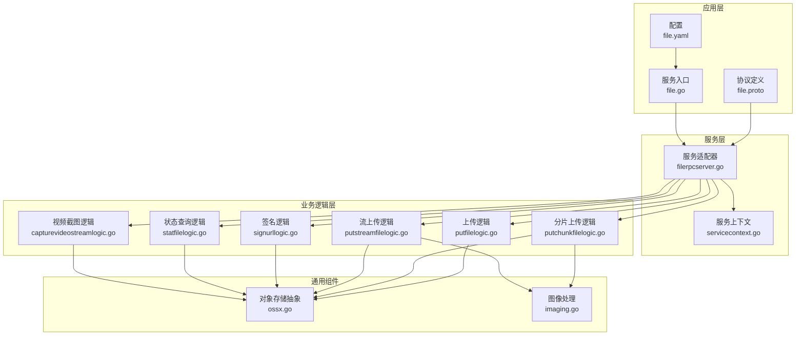
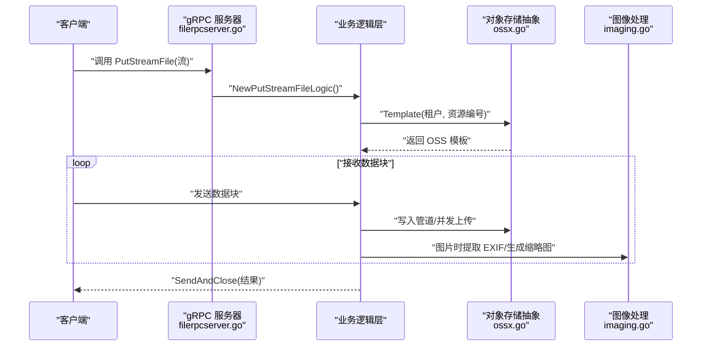
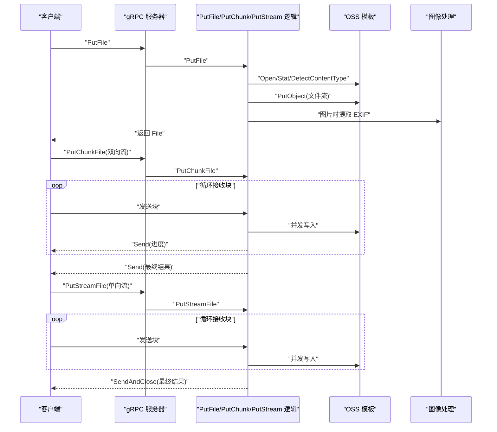
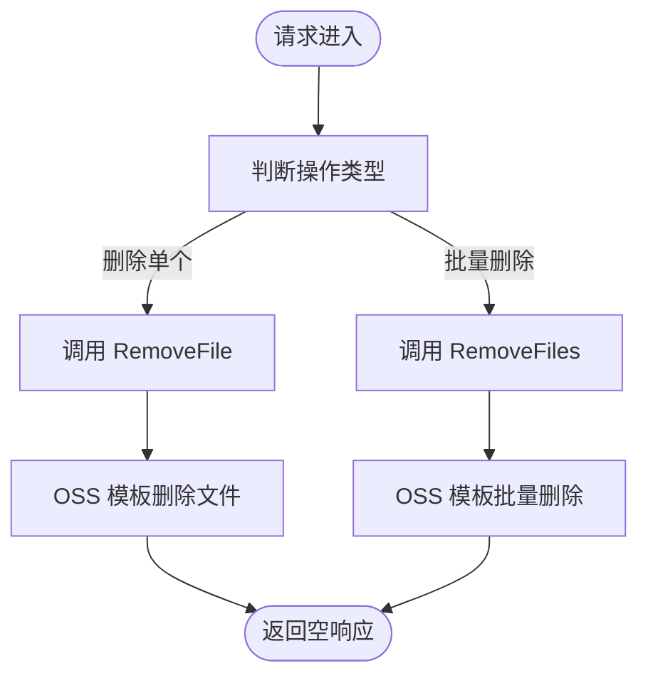
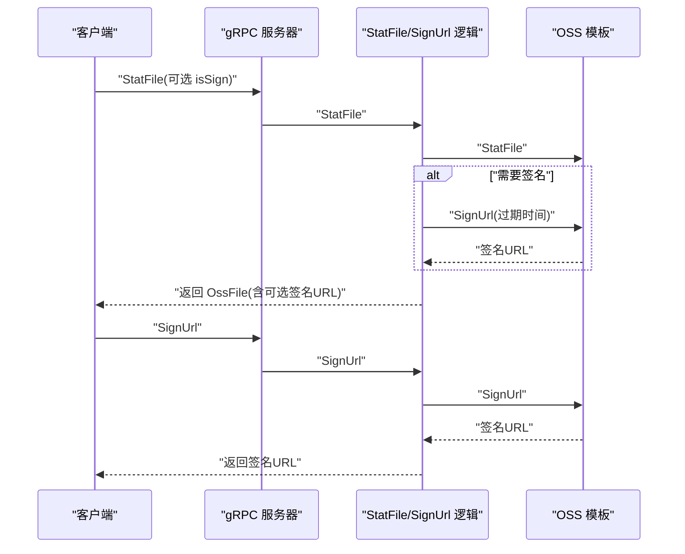
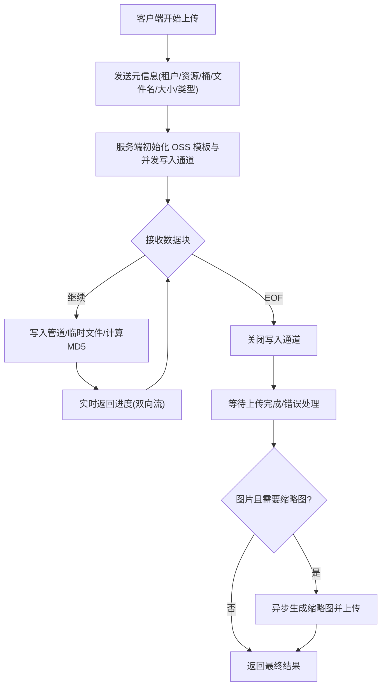
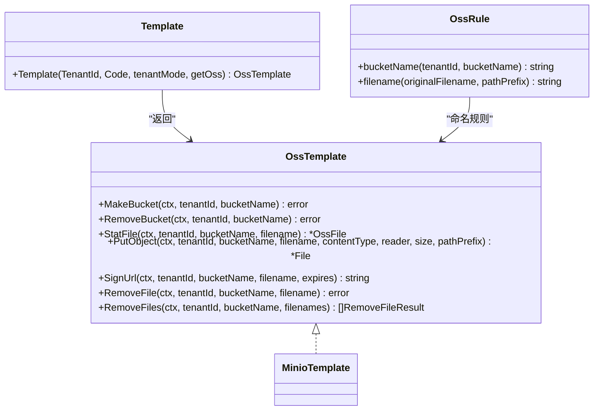
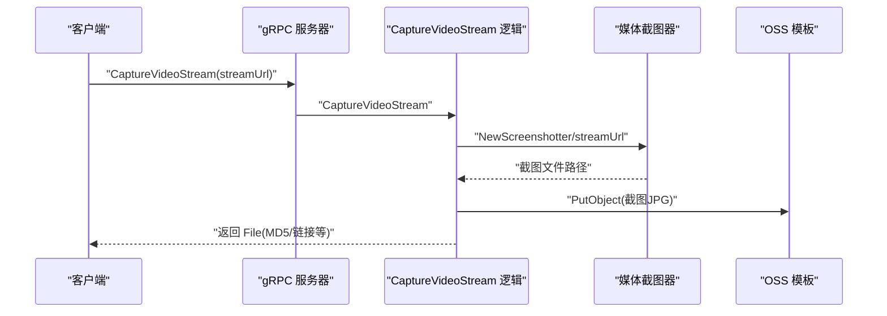
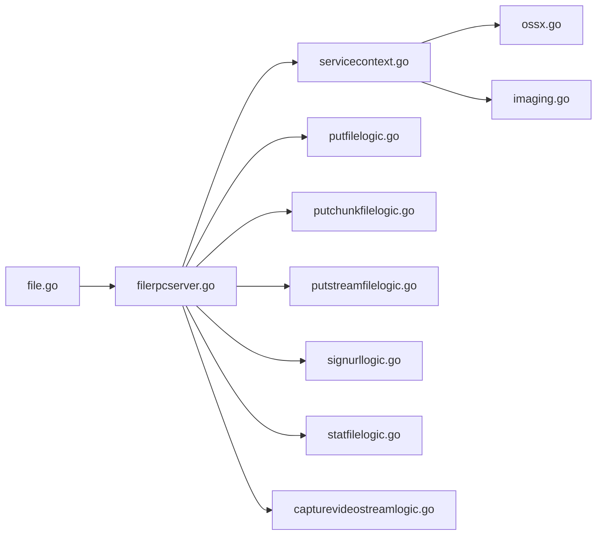

# File 服务

<cite>
**本文引用的文件**
- [file.proto](file://app/file/file.proto)
- [file.go](file://app/file/file.go)
- [file.yaml](file://app/file/etc/file.yaml)
- [filerpcserver.go](file://app/file/internal/server/filerpcserver.go)
- [putfilelogic.go](file://app/file/internal/logic/putfilelogic.go)
- [putchunkfilelogic.go](file://app/file/internal/logic/putchunkfilelogic.go)
- [putstreamfilelogic.go](file://app/file/internal/logic/putstreamfilelogic.go)
- [signurllogic.go](file://app/file/internal/logic/signurllogic.go)
- [statfilelogic.go](file://app/file/internal/logic/statfilelogic.go)
- [capturevideostreamlogic.go](file://app/file/internal/logic/capturevideostreamlogic.go)
- [servicecontext.go](file://app/file/internal/svc/servicecontext.go)
- [ossx.go](file://common/ossx/ossx.go)
- [imaging.go](file://common/imagex/imaging.go)
</cite>

## 目录
1. [简介](#简介)
2. [项目结构](#项目结构)
3. [核心组件](#核心组件)
4. [架构总览](#架构总览)
5. [详细组件分析](#详细组件分析)
6. [依赖关系分析](#依赖关系分析)
7. [性能与优化](#性能与优化)
8. [故障排查指南](#故障排查指南)
9. [结论](#结论)
10. [附录](#附录)

## 简介
本文件为 File 服务的 gRPC API 文档，覆盖文件上传、下载、删除、管理、签名与预览等能力，并重点说明分片上传、断点续传、文件签名与预览、对象存储集成、文件元数据管理与权限控制、视频流处理与截图生成等接口规范。文档同时提供客户端实现要点与性能优化建议，帮助开发者快速接入与稳定运行。

## 项目结构
File 服务采用 go-zero 的标准目录结构，核心由 proto 定义、服务端入口、服务上下文、逻辑层与通用组件组成。关键模块如下：
- 协议与模型：app/file/file.proto
- 服务入口：app/file/file.go
- 服务上下文：app/file/internal/svc/servicecontext.go
- 服务端适配器：app/file/internal/server/filerpcserver.go
- 业务逻辑：app/file/internal/logic/*.go
- 对象存储抽象：common/ossx/ossx.go
- 图像处理：common/imagex/imaging.go
- 配置：app/file/etc/file.yaml

**图表来源**
- [file.proto:1-287](file://app/file/file.proto#L1-L287)
- [file.go:1-72](file://app/file/file.go#L1-L72)
- [file.yaml:1-23](file://app/file/etc/file.yaml#L1-L23)
- [filerpcserver.go:1-105](file://app/file/internal/server/filerpcserver.go#L1-L105)
- [servicecontext.go:1-27](file://app/file/internal/svc/servicecontext.go#L1-L27)
- [putfilelogic.go:1-78](file://app/file/internal/logic/putfilelogic.go#L1-L78)
- [putchunkfilelogic.go:1-270](file://app/file/internal/logic/putchunkfilelogic.go#L1-L270)
- [putstreamfilelogic.go:1-287](file://app/file/internal/logic/putstreamfilelogic.go#L1-L287)
- [signurllogic.go:1-61](file://app/file/internal/logic/signurllogic.go#L1-L61)
- [statfilelogic.go:1-59](file://app/file/internal/logic/statfilelogic.go#L1-L59)
- [capturevideostreamlogic.go:1-93](file://app/file/internal/logic/capturevideostreamlogic.go#L1-L93)
- [ossx.go:1-152](file://common/ossx/ossx.go#L1-L152)
- [imaging.go:1-69](file://common/imagex/imaging.go#L1-L69)

**章节来源**
- [file.proto:1-287](file://app/file/file.proto#L1-L287)
- [file.go:1-72](file://app/file/file.go#L1-L72)
- [file.yaml:1-23](file://app/file/etc/file.yaml#L1-L23)

## 核心组件
- gRPC 服务：FileRpc，包含 Ping、OssDetail/OssList/CreateOss/UpdateOss/DeleteOss、MakeBucket/RemoveBucket、StatFile、SignUrl、PutFile、PutChunkFile（双向流）、PutStreamFile（单向流）、RemoveFile/RemoveFiles、CaptureVideoStream 等方法。
- 服务上下文：封装配置、校验器、OSS 模型与缩略图任务执行器。
- 对象存储抽象：统一模板接口，支持 MinIO 等后端，按租户隔离桶命名。
- 图像处理：提供缩略图生成与 EXIF 元数据提取能力。

**章节来源**
- [file.proto:270-287](file://app/file/file.proto#L270-L287)
- [servicecontext.go:12-26](file://app/file/internal/svc/servicecontext.go#L12-L26)
- [ossx.go:28-39](file://common/ossx/ossx.go#L28-L39)

## 架构总览
File 服务通过 go-zero 提供 gRPC 服务，服务端适配器将 RPC 请求转发至对应逻辑层；逻辑层根据租户与资源编号动态选择 OSS 模板，调用通用对象存储接口完成上传、签名、状态查询与删除；对图片类文件可提取 EXIF 并异步生成缩略图；对视频流支持截图生成并上传。

**图表来源**
- [filerpcserver.go:86-89](file://app/file/internal/server/filerpcserver.go#L86-L89)
- [putstreamfilelogic.go:43-287](file://app/file/internal/logic/putstreamfilelogic.go#L43-L287)
- [ossx.go:109-151](file://common/ossx/ossx.go#L109-L151)
- [imaging.go:18-32](file://common/imagex/imaging.go#L18-L32)

## 详细组件分析

### 1) 上传接口
- PutFile：本地文件上传，自动探测内容类型，支持图片 EXIF 元数据提取。
- PutChunkFile：双向流分片上传，实时返回进度与当前已上传大小，支持缩略图异步生成。
- PutStreamFile：单向流分片上传，支持进度日志与 MD5 校验，完成后一次性返回结果。

**图表来源**
- [file.proto:176-225](file://app/file/file.proto#L176-L225)
- [putfilelogic.go:33-77](file://app/file/internal/logic/putfilelogic.go#L33-L77)
- [putchunkfilelogic.go:38-269](file://app/file/internal/logic/putchunkfilelogic.go#L38-L269)
- [putstreamfilelogic.go:43-287](file://app/file/internal/logic/putstreamfilelogic.go#L43-L287)

**章节来源**
- [file.proto:176-225](file://app/file/file.proto#L176-L225)
- [putfilelogic.go:33-77](file://app/file/internal/logic/putfilelogic.go#L33-L77)
- [putchunkfilelogic.go:38-269](file://app/file/internal/logic/putchunkfilelogic.go#L38-L269)
- [putstreamfilelogic.go:43-287](file://app/file/internal/logic/putstreamfilelogic.go#L43-L287)

### 2) 下载与删除
- GetFile：返回文件名、内容类型与路径（通常用于内部定位）。
- RemoveFile/RemoveFiles：删除单个或批量文件，底层委托 OSS 模板执行。

**图表来源**
- [file.proto:227-248](file://app/file/file.proto#L227-L248)
- [ossx.go:32-39](file://common/ossx/ossx.go#L32-L39)

**章节来源**
- [file.proto:227-248](file://app/file/file.proto#L227-L248)
- [ossx.go:32-39](file://common/ossx/ossx.go#L32-L39)

### 3) 文件状态与签名
- StatFile：查询文件信息，可选生成签名 URL 与过期时间。
- SignUrl：直接生成带过期时间的签名 URL。

**图表来源**
- [file.proto:151-174](file://app/file/file.proto#L151-L174)
- [statfilelogic.go:29-57](file://app/file/internal/logic/statfilelogic.go#L29-L57)
- [signurllogic.go:29-59](file://app/file/internal/logic/signurllogic.go#L29-L59)
- [ossx.go:36-36](file://common/ossx/ossx.go#L36-L36)

**章节来源**
- [file.proto:151-174](file://app/file/file.proto#L151-L174)
- [statfilelogic.go:29-57](file://app/file/internal/logic/statfilelogic.go#L29-L57)
- [signurllogic.go:29-59](file://app/file/internal/logic/signurllogic.go#L29-L59)

### 4) 分片上传机制与断点续传
- PutChunkFile（双向流）：客户端以流式块传输，服务端维护临时文件与 MD5，实时返回进度；适合大文件与弱网环境。
- PutStreamFile（单向流）：客户端以流式块传输，服务端并发写入 OSS，完成后一次性返回结果；适合高吞吐场景。
- 断点续传：当前实现未显式保存“已上传块索引”，如需实现可在客户端侧记录已成功块并在重启时从断点继续发送；服务端可基于 OSS 服务端多段上传能力扩展。

**图表来源**
- [file.proto:191-225](file://app/file/file.proto#L191-L225)
- [putchunkfilelogic.go:38-269](file://app/file/internal/logic/putchunkfilelogic.go#L38-L269)
- [putstreamfilelogic.go:43-287](file://app/file/internal/logic/putstreamfilelogic.go#L43-L287)

**章节来源**
- [file.proto:191-225](file://app/file/file.proto#L191-L225)
- [putchunkfilelogic.go:38-269](file://app/file/internal/logic/putchunkfilelogic.go#L38-L269)
- [putstreamfilelogic.go:43-287](file://app/file/internal/logic/putstreamfilelogic.go#L43-L287)

### 5) 对象存储集成与租户隔离
- OSS 模板：统一接口封装创建/删除桶、文件状态、上传/下载/删除、批量删除与签名 URL。
- 租户模式：桶名前缀可按租户 ID 动态拼接，避免跨租户冲突。
- 当前支持：MinIO（Category_Minio），其他类型可扩展。

**图表来源**
- [ossx.go:28-92](file://common/ossx/ossx.go#L28-L92)
- [ossx.go:109-151](file://common/ossx/ossx.go#L109-L151)

**章节来源**
- [ossx.go:28-92](file://common/ossx/ossx.go#L28-L92)
- [ossx.go:109-151](file://common/ossx/ossx.go#L109-L151)

### 6) 文件元数据管理与权限控制
- 元数据：图片类文件提取 EXIF（经纬度、拍摄时间、尺寸、海拔、相机型号等），并生成缩略图链接与名称。
- 权限控制：通过租户 ID 与资源编号选择 OSS 配置，结合签名 URL 控制访问有效期；删除/批量删除等操作由调用方自行鉴权。

**章节来源**
- [putfilelogic.go:66-73](file://app/file/internal/logic/putfilelogic.go#L66-L73)
- [putchunkfilelogic.go:212-256](file://app/file/internal/logic/putchunkfilelogic.go#L212-L256)
- [putstreamfilelogic.go:222-266](file://app/file/internal/logic/putstreamfilelogic.go#L222-L266)
- [signurllogic.go:49-56](file://app/file/internal/logic/signurllogic.go#L49-L56)

### 7) 视频流处理与截图生成
- CaptureVideoStream：从 RTMP/HLS/HTTP-FLV 等视频流抓取一张静态帧，生成 JPG 并上传至 OSS，返回文件信息与 MD5。

**图表来源**
- [file.proto:257-268](file://app/file/file.proto#L257-L268)
- [capturevideostreamlogic.go:35-92](file://app/file/internal/logic/capturevideostreamlogic.go#L35-L92)
- [ossx.go:35-35](file://common/ossx/ossx.go#L35-L35)

**章节来源**
- [file.proto:257-268](file://app/file/file.proto#L257-L268)
- [capturevideostreamlogic.go:35-92](file://app/file/internal/logic/capturevideostreamlogic.go#L35-L92)

### 8) API 规范总览
- 服务：FileRpc
- 方法清单与用途
  - Ping：健康检查
  - OssDetail/OssList/CreateOss/UpdateOss/DeleteOss：对象存储配置管理
  - MakeBucket/RemoveBucket：桶生命周期管理
  - StatFile：查询文件信息，可选生成签名 URL
  - SignUrl：生成签名 URL
  - PutFile：本地文件上传
  - PutChunkFile：双向流分片上传（gtw 特供）
  - PutStreamFile：单向流分片上传
  - RemoveFile/RemoveFiles：删除单个/批量文件
  - CaptureVideoStream：从视频流截取静态帧并上传

**章节来源**
- [file.proto:270-287](file://app/file/file.proto#L270-L287)

## 依赖关系分析
- 服务入口依赖 go-zero 与反射注册，按配置注册服务并注入拦截器。
- 服务适配器将 RPC 映射到具体逻辑层。
- 逻辑层依赖 OSS 抽象与图像处理工具，按租户与资源编号动态选择模板。
- 服务上下文提供数据库连接、校验器与缩略图任务执行器。

**图表来源**
- [file.go:39-66](file://app/file/file.go#L39-L66)
- [filerpcserver.go:1-105](file://app/file/internal/server/filerpcserver.go#L1-L105)
- [servicecontext.go:12-26](file://app/file/internal/svc/servicecontext.go#L12-L26)
- [ossx.go:1-152](file://common/ossx/ossx.go#L1-L152)
- [imaging.go:1-69](file://common/imagex/imaging.go#L1-L69)

**章节来源**
- [file.go:39-66](file://app/file/file.go#L39-L66)
- [filerpcserver.go:1-105](file://app/file/internal/server/filerpcserver.go#L1-L105)
- [servicecontext.go:12-26](file://app/file/internal/svc/servicecontext.go#L12-L26)

## 性能与优化
- 并发上传：PutChunkFile/PutStreamFile 通过 goroutine 并发写入，提升吞吐。
- 进度日志：大文件上传设置阈值日志，便于监控与问题定位。
- 缩略图异步：图片上传完成后异步生成并上传，避免阻塞主流程。
- 临时文件：使用内存管道与临时文件缓存，减少磁盘抖动。
- MD5 校验：对上传内容计算 MD5，便于一致性校验。
- 客户端建议
  - 分片大小：建议 1–8MB，兼顾并发与稳定性。
  - 重试策略：指数退避，避免雪崩。
  - 超时与背压：合理设置 gRPC 超时与流控。
  - 断点续传：客户端记录已成功块索引，重启后从断点继续。
  - 并发度：根据网络与 CPU 调整并发数，避免过度竞争。

[本节为通用性能建议，不直接分析具体文件]

## 故障排查指南
- 上传失败
  - 检查 OSS 配置与桶存在性；确认租户 ID 与资源编号正确。
  - 查看服务端日志中的“Failed to write to OSS”或“Failed to read from stream”。
  - 对图片类文件，确认 EXIF 提取与缩略图生成过程是否报错。
- 签名失败
  - 确认签名过期时间与目标文件存在。
- 视频截图失败
  - 检查视频流地址可用性与截图器初始化。
- 性能问题
  - 关注进度日志与并发度设置，适当调整分片大小与并发数。

**章节来源**
- [putchunkfilelogic.go:136-144](file://app/file/internal/logic/putchunkfilelogic.go#L136-L144)
- [putstreamfilelogic.go:144-153](file://app/file/internal/logic/putstreamfilelogic.go#L144-L153)
- [capturevideostreamlogic.go:46-53](file://app/file/internal/logic/capturevideostreamlogic.go#L46-L53)

## 结论
File 服务提供了完善的对象存储上传、签名与管理能力，支持分片与流式上传、图片元数据与缩略图、视频流截图等特性。通过租户隔离与签名 URL 实现灵活的权限控制。建议在生产环境中结合客户端断点续传、合理的并发与超时策略，确保稳定与高性能。

[本节为总结性内容，不直接分析具体文件]

## 附录

### A. 配置项说明
- 名称与监听：Name、ListenOn
- 日志：Encoding、Path
- 注册中心：NacosConfig（Host、Port、Username、PassWord、NamespaceId、ServiceName）
- 租户模式：Oss.TenantMode
- 缩略图并发：ThumbTaskConcurrency
- 数据库：DB.DataSource

**章节来源**
- [file.yaml:1-23](file://app/file/etc/file.yaml#L1-L23)

### B. 客户端实现要点
- 上传
  - PutFile：本地文件路径 + 内容类型 + 可选缩略图开关。
  - PutChunkFile：双向流，先发元信息，再循环发送数据块，实时处理进度。
  - PutStreamFile：单向流，发送数据块，完成后一次性接收结果。
- 下载与删除
  - GetFile：获取文件名、类型与路径。
  - RemoveFile/RemoveFiles：按需调用。
- 签名
  - StatFile/SignUrl：生成带过期时间的签名 URL。
- 视频截图
  - CaptureVideoStream：传入视频流地址，返回截图文件信息。

**章节来源**
- [file.proto:176-268](file://app/file/file.proto#L176-L268)
- [statfilelogic.go:44-54](file://app/file/internal/logic/statfilelogic.go#L44-L54)
- [signurllogic.go:49-56](file://app/file/internal/logic/signurllogic.go#L49-L56)
- [capturevideostreamlogic.go:35-92](file://app/file/internal/logic/capturevideostreamlogic.go#L35-L92)