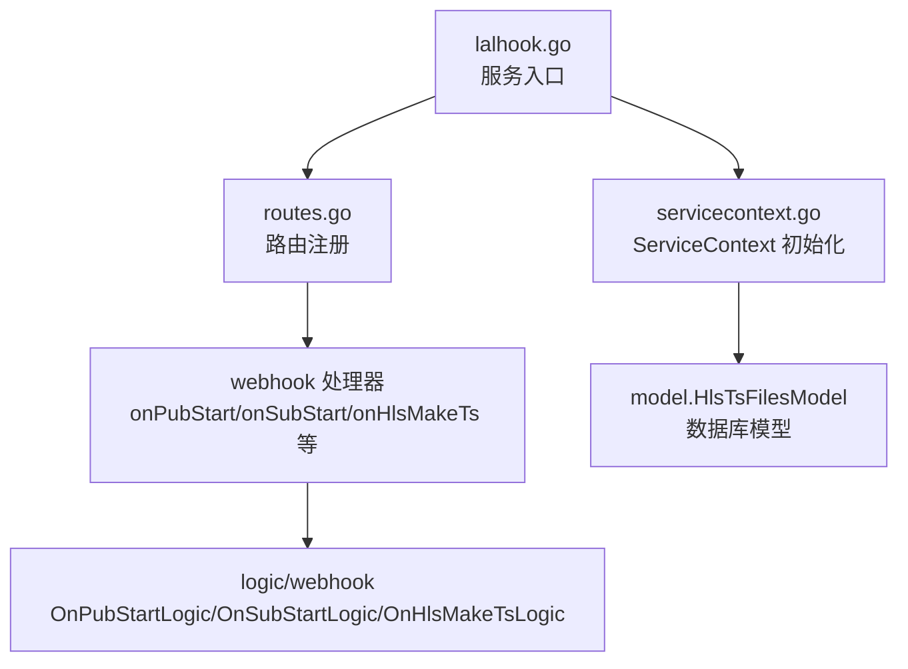
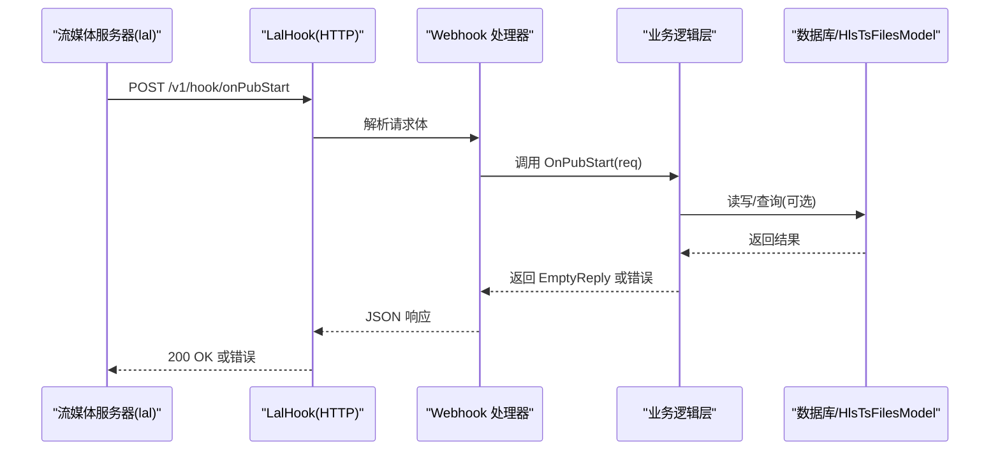
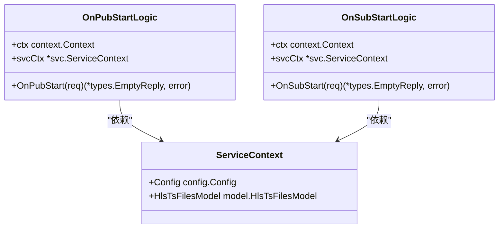
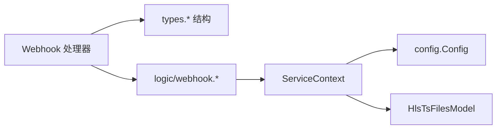
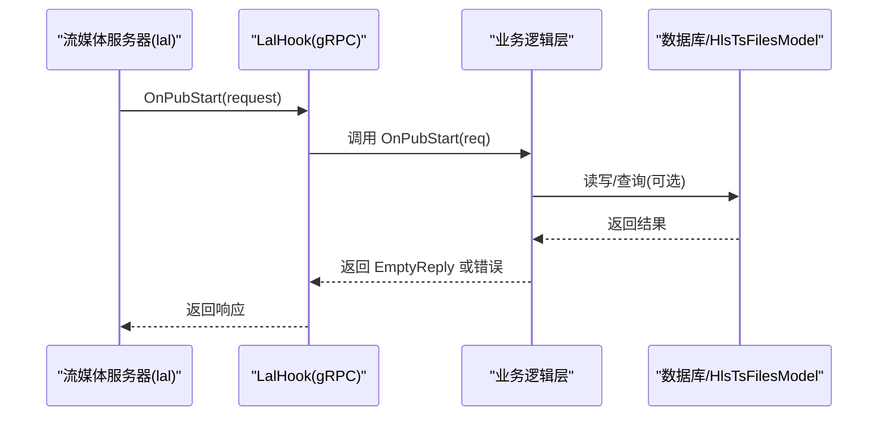

# LalHook 服务

<cite>
**本文引用的文件**
- [app/lalhook/lalhook.go](file://app/lalhook/lalhook.go)
- [app/lalhook/etc/lalhook.yaml](file://app/lalhook/etc/lalhook.yaml)
- [app/lalhook/internal/types/types.go](file://app/lalhook/internal/types/types.go)
- [app/lalhook/internal/handler/routes.go](file://app/lalhook/internal/handler/routes.go)
- [app/lalhook/internal/handler/webhook/onpubstarthandler.go](file://app/lalhook/internal/handler/webhook/onpubstarthandler.go)
- [app/lalhook/internal/handler/webhook/onsubstarthandler.go](file://app/lalhook/internal/handler/webhook/onsubstarthandler.go)
- [app/lalhook/internal/handler/webhook/onhlsmaketshandler.go](file://app/lalhook/internal/handler/webhook/onhlsmaketshandler.go)
- [app/lalhook/internal/logic/webhook/onpubstartlogic.go](file://app/lalhook/internal/logic/webhook/onpubstartlogic.go)
- [app/lalhook/internal/logic/webhook/onsubstartlogic.go](file://app/lalhook/internal/logic/webhook/onsubstartlogic.go)
- [app/lalhook/internal/svc/servicecontext.go](file://app/lalhook/internal/svc/servicecontext.go)
</cite>

## 目录
1. [简介](#简介)
2. [项目结构](#项目结构)
3. [核心组件](#核心组件)
4. [架构总览](#架构总览)
5. [详细组件分析](#详细组件分析)
6. [依赖分析](#依赖分析)
7. [性能考虑](#性能考虑)
8. [故障排查指南](#故障排查指南)
9. [结论](#结论)
10. [附录](#附录)

## 简介
本文件为 LalHook 服务的 gRPC API 文档补充说明。根据仓库现有实现，LalHook 并非基于 gRPC，而是基于 HTTP 的 Webhook 服务，用于接收来自流媒体服务器（如 lal）的各类事件通知，例如推流开始、拉流开始、HLS 分片生成等。本文将系统梳理 LalHook 的 HTTP 接口定义、事件模型、数据结构、路由注册、业务逻辑入口以及最佳实践，并给出与 gRPC 对应的参考说明，帮助读者在需要时进行迁移或扩展。

## 项目结构
LalHook 服务位于 app/lalhook 目录下，采用 go-zero 框架组织结构，主要由以下模块组成：
- 配置加载与服务启动：负责解析配置、初始化 CORS、注册路由并启动 HTTP 服务
- 路由注册：统一注册 API 与 Webhook 两类接口
- 类型定义：定义所有事件请求体的数据结构
- 处理器（Handler）：每个事件对应一个 HTTP 处理函数，负责参数解析与响应
- 逻辑层（Logic）：每个事件对应一个逻辑对象，承载业务处理
- 服务上下文（ServiceContext）：注入数据库连接与模型实例

图表来源
- [app/lalhook/lalhook.go:19-48](file://app/lalhook/lalhook.go#L19-L48)
- [app/lalhook/internal/handler/routes.go:17-97](file://app/lalhook/internal/handler/routes.go#L17-L97)
- [app/lalhook/internal/svc/servicecontext.go:10-20](file://app/lalhook/internal/svc/servicecontext.go#L10-L20)

章节来源
- [app/lalhook/lalhook.go:19-48](file://app/lalhook/lalhook.go#L19-L48)
- [app/lalhook/etc/lalhook.yaml:1-10](file://app/lalhook/etc/lalhook.yaml#L1-L10)
- [app/lalhook/internal/handler/routes.go:17-97](file://app/lalhook/internal/handler/routes.go#L17-L97)

## 核心组件
- 配置结构：继承自 go-zero 的 RestConf，并增加数据库连接配置
- 服务上下文：注入数据库连接与 HLS TS 文件模型
- 数据类型：定义所有事件请求体的结构，涵盖推流、拉流、回源、HLS 分片、服务器启动、定时更新等
- 路由注册：将 API 与 Webhook 两类接口分别挂载到不同前缀下，并设置超时

章节来源
- [app/lalhook/internal/config/config.go:5-10](file://app/lalhook/internal/config/config.go#L5-L10)
- [app/lalhook/internal/svc/servicecontext.go:10-20](file://app/lalhook/internal/svc/servicecontext.go#L10-L20)
- [app/lalhook/internal/types/types.go:62-179](file://app/lalhook/internal/types/types.go#L62-L179)
- [app/lalhook/internal/handler/routes.go:17-97](file://app/lalhook/internal/handler/routes.go#L17-L97)

## 架构总览
LalHook 以 HTTP Webhook 形式接收流媒体事件，处理器负责参数解析与响应返回；逻辑层承载业务处理（当前模板为空，待填充）。服务启动时打印 Go 版本，启用动态 CORS，并通过统一前缀区分 API 与 Webhook。

图表来源
- [app/lalhook/internal/handler/webhook/onpubstarthandler.go:13-29](file://app/lalhook/internal/handler/webhook/onpubstarthandler.go#L13-L29)
- [app/lalhook/internal/logic/webhook/onpubstartlogic.go:27-31](file://app/lalhook/internal/logic/webhook/onpubstartlogic.go#L27-L31)
- [app/lalhook/internal/svc/servicecontext.go:15-20](file://app/lalhook/internal/svc/servicecontext.go#L15-L20)

## 详细组件分析

### 1) HTTP 接口与路由
- Webhook 接口（/v1/hook/*）：接收来自流媒体服务器的事件通知
  - /onPubStart：他人向当前节点推流开始
  - /onPubStop：推流结束
  - /onSubStart：他人从当前节点拉流开始
  - /onSubStop：拉流结束
  - /onHlsMakeTs：HLS 生成每个 TS 分片时
  - /onRelayPullStart：回源拉流成功
  - /onRelayPullStop：回源拉流停止
  - /onRtmpConnect：收到 RTMP Connect 信令
  - /onServerStart：服务启动
  - /onUpdate：定时汇报所有 group/session 信息
- API 接口（/v1/api/*）：当前包含 TS 文件列表查询
  - /ts/list：按时间区间查询 TS 文件

章节来源
- [app/lalhook/internal/handler/routes.go:17-97](file://app/lalhook/internal/handler/routes.go#L17-L97)

### 2) 请求数据模型（事件结构）
以下为关键事件的请求体结构（字段说明见注释）：
- OnPubStartRequest：推流开始事件
  - 字段：server_id、session_id、protocol、base_type、remote_addr、url、app_name、stream_name、url_param、has_in_session、has_out_session、read_bytes_sum、wrote_bytes_sum
- OnPubStopRequest：推流结束事件
  - 字段：同上，但 base_type 固定为 PUB
- OnSubStartRequest：拉流开始事件
  - 字段：protocol 包含 RTMP/FLV/TS 等
- OnSubStopRequest：拉流结束事件
- OnHlsMakeTsRequest：HLS 分片生成事件
  - 字段：event、stream_name、cwd、ts_file、live_m3u8_file、record_m3u8_file、id、duration、server_id
- OnRelayPullStartRequest/OnRelayPullStopRequest：回源拉流事件
- OnRtmpConnectRequest：RTMP Connect 事件
- OnServerStartRequest：服务启动事件
- OnUpdateRequest：定时更新事件，包含 groups 列表

章节来源
- [app/lalhook/internal/types/types.go:62-179](file://app/lalhook/internal/types/types.go#L62-L179)

### 3) 处理器与逻辑层
- 处理器：每个事件对应一个 http.HandlerFunc，负责：
  - 解析请求体到对应 Request 结构
  - 创建对应 Logic 实例并调用业务方法
  - 统一返回 JSON 响应或错误
- 逻辑层：每个事件对应一个 Logic 对象，当前模板中仅声明结构与方法签名，具体业务逻辑需在内部实现

图表来源
- [app/lalhook/internal/logic/webhook/onpubstartlogic.go:12-31](file://app/lalhook/internal/logic/webhook/onpubstartlogic.go#L12-L31)
- [app/lalhook/internal/logic/webhook/onsubstartlogic.go:12-31](file://app/lalhook/internal/logic/webhook/onsubstartlogic.go#L12-L31)
- [app/lalhook/internal/svc/servicecontext.go:10-20](file://app/lalhook/internal/svc/servicecontext.go#L10-L20)

章节来源
- [app/lalhook/internal/handler/webhook/onpubstarthandler.go:13-29](file://app/lalhook/internal/handler/webhook/onpubstarthandler.go#L13-L29)
- [app/lalhook/internal/handler/webhook/onsubstarthandler.go:13-29](file://app/lalhook/internal/handler/webhook/onsubstarthandler.go#L13-L29)
- [app/lalhook/internal/logic/webhook/onpubstartlogic.go:12-31](file://app/lalhook/internal/logic/webhook/onpubstartlogic.go#L12-L31)
- [app/lalhook/internal/logic/webhook/onsubstartlogic.go:12-31](file://app/lalhook/internal/logic/webhook/onsubstartlogic.go#L12-L31)

### 4) 服务启动与配置
- 启动流程：解析配置文件、打印 Go 版本、初始化 REST 服务器并启用动态 CORS、注册路由、启动服务
- 配置项：名称、主机、端口、模式、日志编码、超时、数据库数据源

章节来源
- [app/lalhook/lalhook.go:19-48](file://app/lalhook/lalhook.go#L19-L48)
- [app/lalhook/etc/lalhook.yaml:1-10](file://app/lalhook/etc/lalhook.yaml#L1-L10)

### 5) 数据持久化与模型
- ServiceContext 注入 HlsTsFilesModel，可用于 HLS TS 文件相关的数据读写
- 数据库连接从配置的 DataSource 加载

章节来源
- [app/lalhook/internal/svc/servicecontext.go:10-20](file://app/lalhook/internal/svc/servicecontext.go#L10-L20)

## 依赖分析
- 组件耦合
  - Handler 依赖 ServiceContext 与 types
  - Logic 依赖 ServiceContext 与 types
  - ServiceContext 依赖配置与数据库模型
- 外部依赖
  - go-zero REST 框架
  - MySQL 数据库（通过 sqlx）

图表来源
- [app/lalhook/internal/handler/webhook/onpubstarthandler.go:13-29](file://app/lalhook/internal/handler/webhook/onpubstarthandler.go#L13-L29)
- [app/lalhook/internal/logic/webhook/onpubstartlogic.go:12-31](file://app/lalhook/internal/logic/webhook/onpubstartlogic.go#L12-L31)
- [app/lalhook/internal/svc/servicecontext.go:10-20](file://app/lalhook/internal/svc/servicecontext.go#L10-L20)

## 性能考虑
- 超时设置：路由统一设置了较长的超时时间，适合处理可能耗时的业务逻辑
- CORS 动态配置：按请求 Origin 设置允许跨域，避免缓存污染
- 日志与版本：启动时打印 Go 版本，便于问题定位

章节来源
- [app/lalhook/internal/handler/routes.go:28](file://app/lalhook/internal/handler/routes.go#L28)
- [app/lalhook/lalhook.go:28-40](file://app/lalhook/lalhook.go#L28-L40)

## 故障排查指南
- 常见问题
  - CORS 错误：确认客户端 Origin 已正确传递，服务端已按动态 Origin 设置允许跨域
  - 路由未找到：检查请求路径是否使用 /v1/hook 或 /v1/api 前缀
  - 参数解析失败：确认请求体符合对应事件的 Request 结构
  - 数据库连接失败：检查配置文件中的 DataSource 是否正确
- 建议
  - 在 Logic 层添加日志记录关键事件与参数
  - 对外部回调接口进行幂等设计，避免重复处理
  - 对长时间任务使用异步处理或队列解耦

章节来源
- [app/lalhook/internal/handler/routes.go:17-97](file://app/lalhook/internal/handler/routes.go#L17-L97)
- [app/lalhook/etc/lalhook.yaml:8-9](file://app/lalhook/etc/lalhook.yaml#L8-L9)

## 结论
LalHook 当前以 HTTP Webhook 形式提供流媒体事件接收能力，覆盖推流、拉流、HLS 分片、回源、RTMP 连接、服务启动与定时更新等场景。其结构清晰、扩展性强，可在 Logic 层按需实现业务逻辑，并通过 ServiceContext 访问数据库与配置。若未来需要迁移到 gRPC，可参考本文的事件模型与数据结构，映射为对应的 RPC 方法与消息类型。

## 附录

### A. HTTP 接口一览（/v1/hook）
- POST /onPubStart：推流开始
- POST /onPubStop：推流结束
- POST /onSubStart：拉流开始
- POST /onSubStop：拉流结束
- POST /onHlsMakeTs：HLS 分片生成
- POST /onRelayPullStart：回源拉流开始
- POST /onRelayPullStop：回源拉流结束
- POST /onRtmpConnect：RTMP Connect
- POST /onServerStart：服务启动
- POST /onUpdate：定时更新

章节来源
- [app/lalhook/internal/handler/routes.go:34-92](file://app/lalhook/internal/handler/routes.go#L34-L92)

### B. API 接口一览（/v1/api）
- POST /ts/list：查询 TS 文件列表（按时间区间）

章节来源
- [app/lalhook/internal/handler/routes.go:21-29](file://app/lalhook/internal/handler/routes.go#L21-L29)

### C. gRPC 对应建议（概念性说明）
若需将 LalHook 迁移为 gRPC 服务，可参考以下映射思路：
- 事件接口映射为 RPC 方法：OnPubStart、OnSubStart、OnHlsMakeTs 等对应各事件的 RPC 方法
- 请求/响应消息：将 types 中的 Request 结构映射为对应的 RPC 请求/响应消息
- 服务定义：定义一个 HookService，包含上述 RPC 方法
- 流程图（概念示意）

[此图为概念示意，不直接映射到具体源码文件]