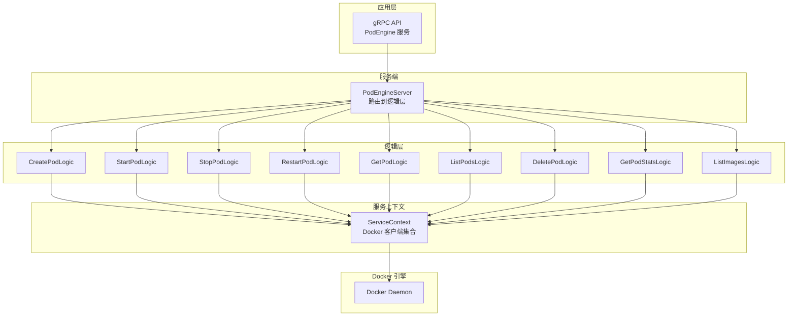
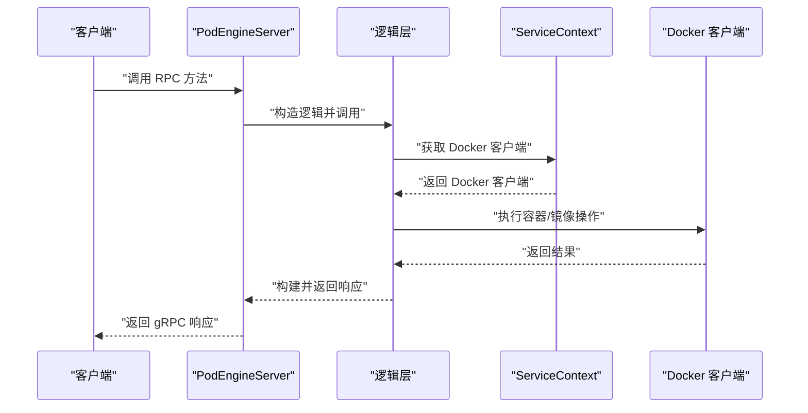
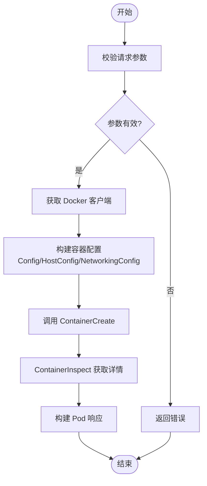
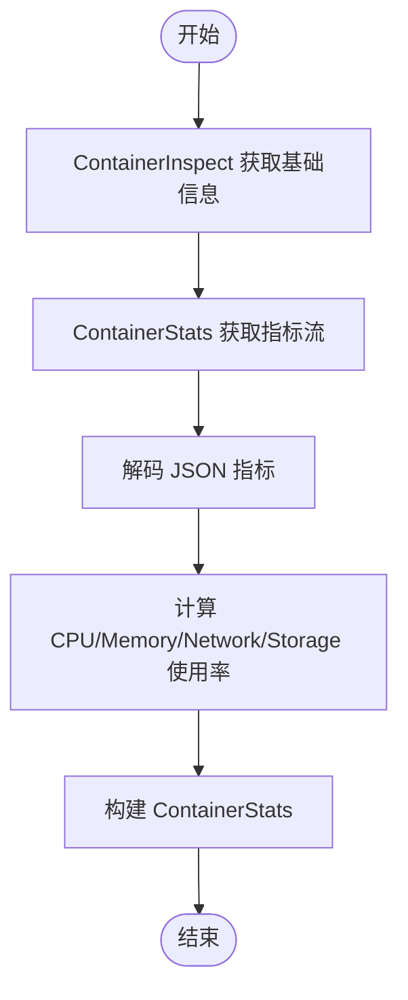
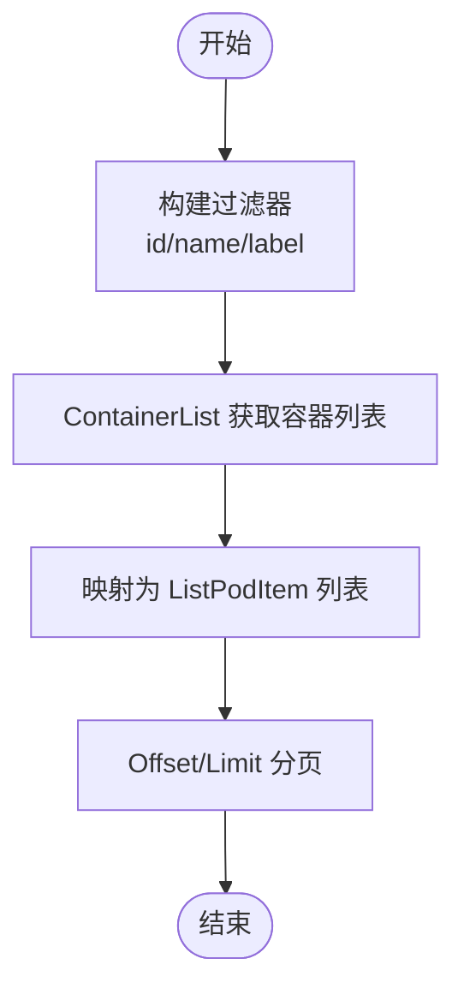
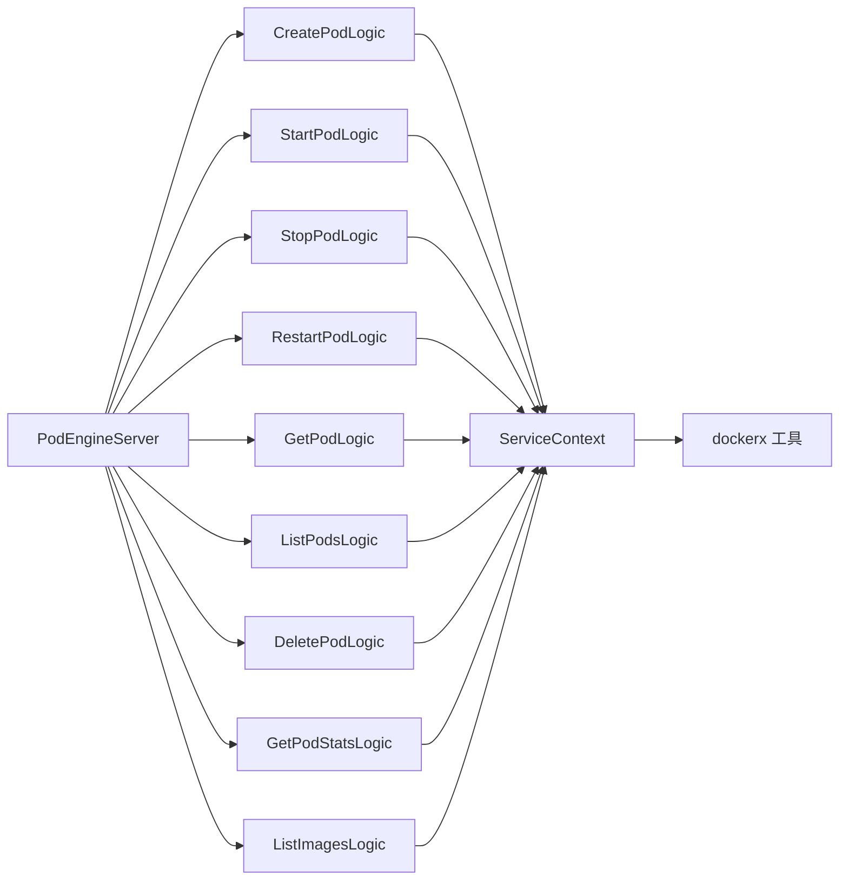

# PodEngine 服务

<cite>
**本文引用的文件**
- [podengine.proto](file://app/podengine/podengine.proto)
- [podengineserver.go](file://app/podengine/internal/server/podengineserver.go)
- [createpodlogic.go](file://app/podengine/internal/logic/createpodlogic.go)
- [startpodlogic.go](file://app/podengine/internal/logic/startpodlogic.go)
- [stoppodlogic.go](file://app/podengine/internal/logic/stoppodlogic.go)
- [restartpodlogic.go](file://app/podengine/internal/logic/restartpodlogic.go)
- [getpodlogic.go](file://app/podengine/internal/logic/getpodlogic.go)
- [listpodslogic.go](file://app/podengine/internal/logic/listpodslogic.go)
- [deletepodlogic.go](file://app/podengine/internal/logic/deletepodlogic.go)
- [getpodstatslogic.go](file://app/podengine/internal/logic/getpodstatslogic.go)
- [listimageslogic.go](file://app/podengine/internal/logic/listimageslogic.go)
- [podengine.yaml](file://app/podengine/etc/podengine.yaml)
- [config.go](file://app/podengine/internal/config/config.go)
- [servicecontext.go](file://app/podengine/internal/svc/servicecontext.go)
- [dockerx.go](file://common/dockerx/dockerx.go)
- [podengine.go](file://app/podengine/podengine.go)
</cite>

## 目录
1. [简介](#简介)
2. [项目结构](#项目结构)
3. [核心组件](#核心组件)
4. [架构总览](#架构总览)
5. [详细组件分析](#详细组件分析)
6. [依赖分析](#依赖分析)
7. [性能考虑](#性能考虑)
8. [故障排查指南](#故障排查指南)
9. [结论](#结论)
10. [附录](#附录)

## 简介
本文件为 PodEngine 服务的 gRPC API 文档与实现解析，覆盖容器与 Pod 生命周期管理、镜像管理、资源监控、网络与存储挂载等能力。服务通过抽象的 Pod/Container 模型，兼容 Docker 与 Kubernetes 等运行时，提供统一的 gRPC 接口，便于在不同环境中进行容器化部署与运维。

## 项目结构
PodEngine 服务位于 app/podengine 目录，采用标准的 go-zero 微服务分层：
- proto 定义：服务接口与消息模型
- server 层：gRPC 服务端实现，路由到各逻辑层
- logic 层：具体业务逻辑，调用 Docker 客户端执行容器操作
- svc 层：服务上下文，管理 Docker 客户端与配置
- etc 配置：监听地址、日志、Nacos 注册、Docker 连接配置
- 根目录入口：启动 RPC 服务并注册服务端

图表来源
- [podengineserver.go:26-69](file://app/podengine/internal/server/podengineserver.go#L26-L69)
- [servicecontext.go:11-50](file://app/podengine/internal/svc/servicecontext.go#L11-L50)

章节来源
- [podengine.go:27-68](file://app/podengine/podengine.go#L27-L68)
- [podengine.yaml:1-20](file://app/podengine/etc/podengine.yaml#L1-L20)
- [config.go:5-17](file://app/podengine/internal/config/config.go#L5-L17)

## 核心组件
- gRPC 服务：PodEngine，提供 CreatePod、StartPod、StopPod、RestartPod、GetPod、ListPods、DeletePod、GetPodStats、ListImages 等方法
- 数据模型：Pod、Container、ContainerSpec、PodSpec、ContainerState、PodCondition、ContainerStats、Image 等
- 服务端实现：PodEngineServer 将每个 RPC 映射到对应逻辑层
- 逻辑层：封装 Docker 客户端调用，构建响应模型
- 服务上下文：集中管理 Docker 客户端（本地与远端），支持多节点
- 配置：监听地址、日志级别、Nacos 注册开关、Docker 连接配置

章节来源
- [podengine.proto:16-338](file://app/podengine/podengine.proto#L16-L338)
- [podengineserver.go:15-70](file://app/podengine/internal/server/podengineserver.go#L15-L70)
- [servicecontext.go:11-50](file://app/podengine/internal/svc/servicecontext.go#L11-L50)

## 架构总览
PodEngine 以 gRPC 为核心，服务端接收请求后委派给逻辑层；逻辑层通过 ServiceContext 获取 Docker 客户端，调用 Docker API 完成容器生命周期管理、镜像查询与资源统计；最终将结果映射为统一的 Pod/Container 模型返回。

图表来源
- [podengineserver.go:26-69](file://app/podengine/internal/server/podengineserver.go#L26-L69)
- [servicecontext.go:42-50](file://app/podengine/internal/svc/servicecontext.go#L42-L50)

## 详细组件分析

### PodEngine 服务接口规范
- 服务名：PodEngine
- 方法清单：
  - CreatePod(CreatePodReq) -> CreatePodRes
  - StartPod(StartPodReq) -> StartPodRes
  - StopPod(StopPodReq) -> StopPodRes
  - RestartPod(RestartPodReq) -> RestartPodRes
  - GetPod(GetPodReq) -> GetPodRes
  - ListPods(ListPodsReq) -> ListPodsRes
  - DeletePod(DeletePodReq) -> DeletePodRes
  - GetPodStats(GetPodStatsReq) -> GetPodStatsRes
  - ListImages(ListImagesReq) -> ListImagesRes

章节来源
- [podengine.proto:16-26](file://app/podengine/podengine.proto#L16-L26)

### Pod 与容器状态模型
- PodPhase：UNKNOWN、PENDING、RUNNING、SUCCEEDED、FAILED、STOPPED
- PodConditionType：POD_SCHEDULED、CONTAINERS_READY、INITIALIZED、READY
- ContainerState：running、terminated、waiting、reason、message、startedTime、finishedTime、exitCode
- Pod：包含 id、name、phase、conditions、containers、labels、annotations、networkMode、creationTime、startTime、deletedTime
- Container：name、image、state、ports、env、args、resources、volumeMounts

章节来源
- [podengine.proto:33-178](file://app/podengine/podengine.proto#L33-L178)

### 请求与响应消息
- CreatePodReq：node、name、spec（包含容器列表、labels、annotations、restartPolicy、terminationGracePeriodSeconds、networkMode、networkName、networkConfig）
- StartPodReq：node、id
- StopPodReq：node、id、force
- RestartPodReq：node、id
- GetPodReq：node、id
- ListPodsReq：node、limit、offset、names、ids、labels
- DeletePodReq：node、id、force、removeVolumes
- GetPodStatsReq：node、id
- ListImagesReq：node、limit、offset、references、includeDigests

章节来源
- [podengine.proto:185-338](file://app/podengine/podengine.proto#L185-L338)

### 服务端实现与路由
- PodEngineServer 将每个 RPC 方法映射到对应的逻辑层构造函数与调用
- 支持开发模式下启用 gRPC 反射，便于调试

章节来源
- [podengineserver.go:26-69](file://app/podengine/internal/server/podengineserver.go#L26-L69)
- [podengine.go:37-43](file://app/podengine/podengine.go#L37-L43)

### 逻辑层与 Docker 集成
- CreatePodLogic：解析 PodSpec 与 ContainerSpec，构建 container.Config/HostConfig/NetworkingConfig，调用 ContainerCreate 并返回 Pod 模型
- StartPodLogic：调用 ContainerStart，随后 ContainerInspect 构建 Pod 响应
- StopPodLogic：调用 ContainerStop，再做一次 ContainerInspect
- RestartPodLogic：调用 ContainerRestart，随后 ContainerInspect 构建响应
- GetPodLogic：ContainerInspect，构建 Pod 响应
- ListPodsLogic：使用过滤器列出容器，转换为 ListPodItem 列表
- DeletePodLogic：ContainerRemove，支持 force 与 removeVolumes
- GetPodStatsLogic：ContainerStats 获取实时指标，计算 CPU/Memory/Network/Storage 使用量
- ListImagesLogic：ImageList 与可选 ImageInspect 获取镜像标签与摘要

章节来源
- [createpodlogic.go:34-152](file://app/podengine/internal/logic/createpodlogic.go#L34-L152)
- [startpodlogic.go:29-87](file://app/podengine/internal/logic/startpodlogic.go#L29-L87)
- [stoppodlogic.go:28-48](file://app/podengine/internal/logic/stoppodlogic.go#L28-L48)
- [restartpodlogic.go:30-83](file://app/podengine/internal/logic/restartpodlogic.go#L30-L83)
- [getpodlogic.go:31-77](file://app/podengine/internal/logic/getpodlogic.go#L31-L77)
- [listpodslogic.go:31-124](file://app/podengine/internal/logic/listpodslogic.go#L31-L124)
- [deletepodlogic.go:28-49](file://app/podengine/internal/logic/deletepodlogic.go#L28-L49)
- [getpodstatslogic.go:32-133](file://app/podengine/internal/logic/getpodstatslogic.go#L32-L133)
- [listimageslogic.go:30-110](file://app/podengine/internal/logic/listimageslogic.go#L30-L110)

### Docker 客户端与多节点支持
- ServiceContext 维护 DockerClients 映射，支持 local 与自定义命名节点
- 通过 MustNewClient 与 WithAPIVersionNegotiation 进行客户端初始化
- 支持 OpenTelemetry Tracing Provider 注入

章节来源
- [servicecontext.go:11-50](file://app/podengine/internal/svc/servicecontext.go#L11-L50)
- [dockerx.go:11-18](file://common/dockerx/dockerx.go#L11-L18)

### 配置与部署
- 监听地址、日志路径与级别、Nacos 注册开关与服务名、Docker 连接主机映射
- 启动时加载配置，创建 ServiceContext，注册服务端并可选注册 Nacos
- 开发/测试模式下启用 gRPC 反射

章节来源
- [podengine.yaml:1-20](file://app/podengine/etc/podengine.yaml#L1-L20)
- [config.go:5-17](file://app/podengine/internal/config/config.go#L5-L17)
- [podengine.go:30-68](file://app/podengine/podengine.go#L30-L68)

### 关键流程图

#### CreatePod 流程

图表来源
- [createpodlogic.go:34-152](file://app/podengine/internal/logic/createpodlogic.go#L34-L152)

#### GetPodStats 流程

图表来源
- [getpodstatslogic.go:32-133](file://app/podengine/internal/logic/getpodstatslogic.go#L32-L133)

#### ListPods 过滤与分页

图表来源
- [listpodslogic.go:31-124](file://app/podengine/internal/logic/listpodslogic.go#L31-L124)

## 依赖分析
- 服务端到逻辑层：一对一映射，职责清晰
- 逻辑层到服务上下文：只读访问 Docker 客户端集合
- 服务上下文到 Docker：通过 dockerx 工具创建客户端并注入追踪
- 配置到服务上下文：按配置动态注册 Docker 客户端

图表来源
- [podengineserver.go:26-69](file://app/podengine/internal/server/podengineserver.go#L26-L69)
- [servicecontext.go:11-50](file://app/podengine/internal/svc/servicecontext.go#L11-L50)
- [dockerx.go:11-18](file://common/dockerx/dockerx.go#L11-L18)

章节来源
- [podengineserver.go:15-70](file://app/podengine/internal/server/podengineserver.go#L15-L70)
- [servicecontext.go:11-50](file://app/podengine/internal/svc/servicecontext.go#L11-L50)

## 性能考虑
- 指标采集：GetPodStats 使用非流式 ContainerStats，避免长连接开销；建议在高并发场景下对指标采集频率进行限流与缓存
- 列表与过滤：ListPods/ListImages 使用 Docker 过滤器与分页，注意 limit/offset 的边界处理
- 资源限制解析：CPU/Memory 解析与单位换算在逻辑层完成，确保数值准确性
- 多节点 Docker：ServiceContext 支持多节点，需关注连接数与超时设置

## 故障排查指南
- 参数校验失败：所有 RPC 入参均执行 Validate，检查必填字段与枚举值范围
- 节点不存在：当 node 不在 ServiceContext 中时返回错误，确认配置与节点名称
- Docker 操作失败：ContainerCreate/Start/Stop/Restart/Delete/Stats/ImageList 等均可能返回错误，结合日志定位
- 日志与追踪：服务启动时打印 Go 版本，日志路径与级别可在配置中调整；Docker 客户端已注入 OpenTelemetry Tracing Provider

章节来源
- [createpodlogic.go:34-45](file://app/podengine/internal/logic/createpodlogic.go#L34-L45)
- [startpodlogic.go:34-44](file://app/podengine/internal/logic/startpodlogic.go#L34-L44)
- [stoppodlogic.go:33-41](file://app/podengine/internal/logic/stoppodlogic.go#L33-L41)
- [restartpodlogic.go:35-43](file://app/podengine/internal/logic/restartpodlogic.go#L35-L43)
- [getpodlogic.go:36-43](file://app/podengine/internal/logic/getpodlogic.go#L36-L43)
- [listpodslogic.go:36-68](file://app/podengine/internal/logic/listpodslogic.go#L36-L68)
- [deletepodlogic.go:33-46](file://app/podengine/internal/logic/deletepodlogic.go#L33-L46)
- [getpodstatslogic.go:37-52](file://app/podengine/internal/logic/getpodstatslogic.go#L37-L52)
- [listimageslogic.go:35-55](file://app/podengine/internal/logic/listimageslogic.go#L35-L55)
- [podengine.go:35-36](file://app/podengine/podengine.go#L35-L36)

## 结论
PodEngine 服务通过统一的 gRPC 接口抽象了容器与 Pod 的生命周期管理，并以 Docker 作为默认运行时实现。其设计具备良好的扩展性：可通过 ServiceContext 支持多 Docker 节点，逻辑层与服务端分离便于维护与测试。建议在生产环境中结合 Nacos 注册、日志与指标监控完善运维体系。

## 附录

### API 一览与要点
- CreatePod：创建 Pod（容器），支持资源限制、端口映射、卷挂载、网络模式与优雅停止时间
- StartPod：启动容器，返回运行态 Pod
- StopPod：停止容器，支持强制停止
- RestartPod：重启容器，返回运行态 Pod
- GetPod：查询单个 Pod 详情
- ListPods：按 id/name/labels 过滤，支持分页
- DeletePod：删除容器，支持强制与移除卷
- GetPodStats：获取 CPU、内存、网络、存储使用指标
- ListImages：列出镜像，支持按引用过滤与可选摘要

章节来源
- [podengine.proto:16-338](file://app/podengine/podengine.proto#L16-L338)