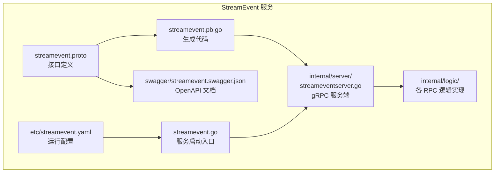
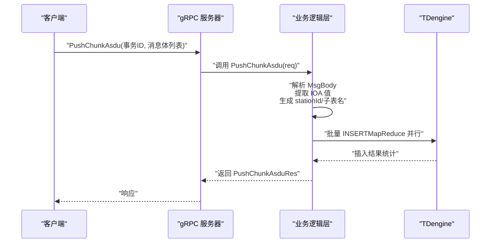
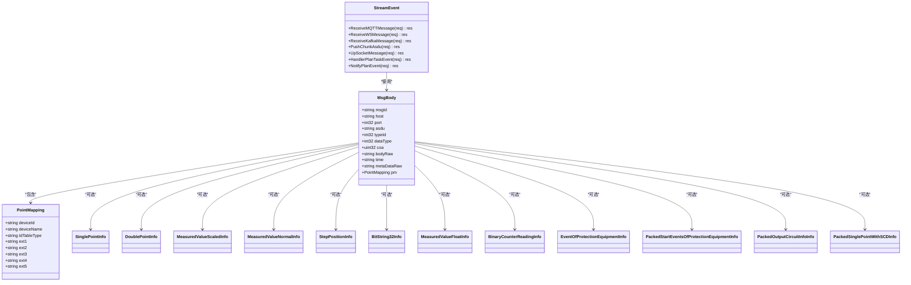
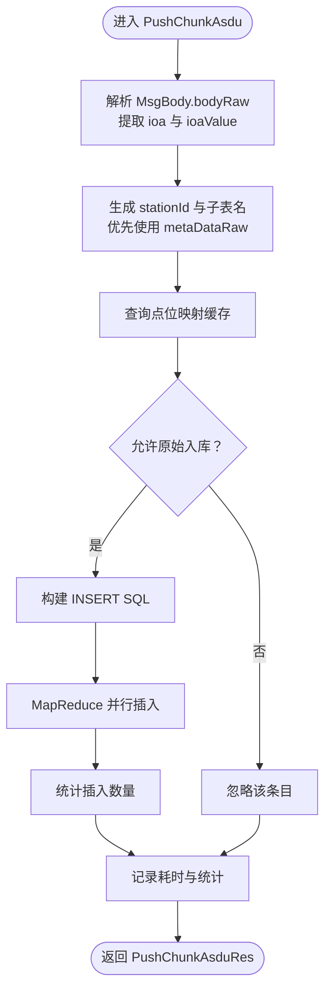
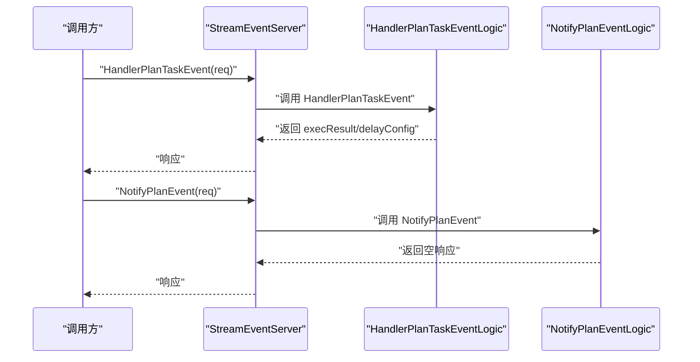
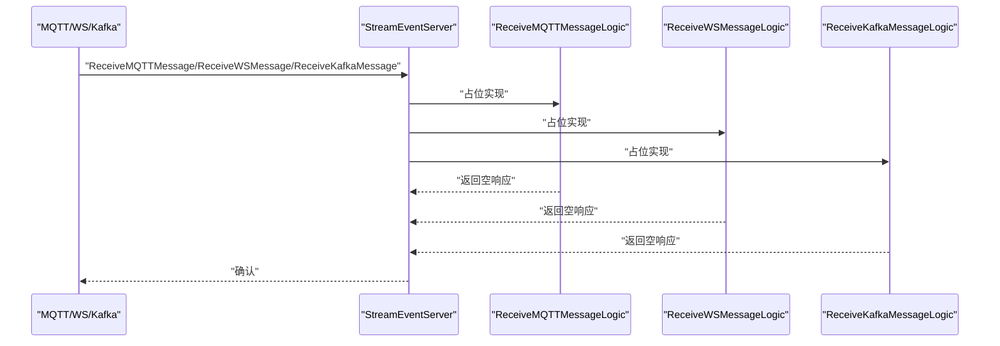
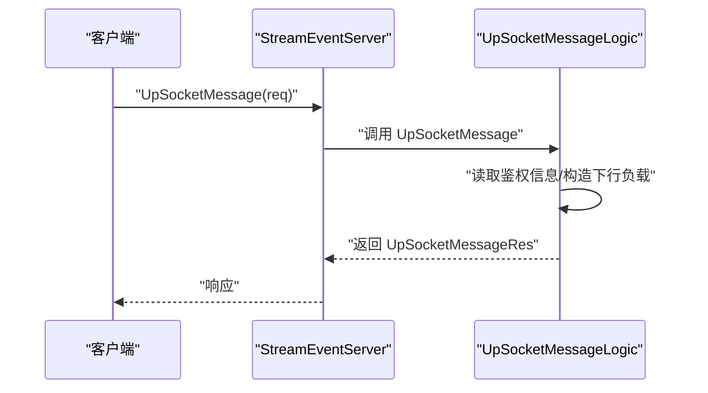
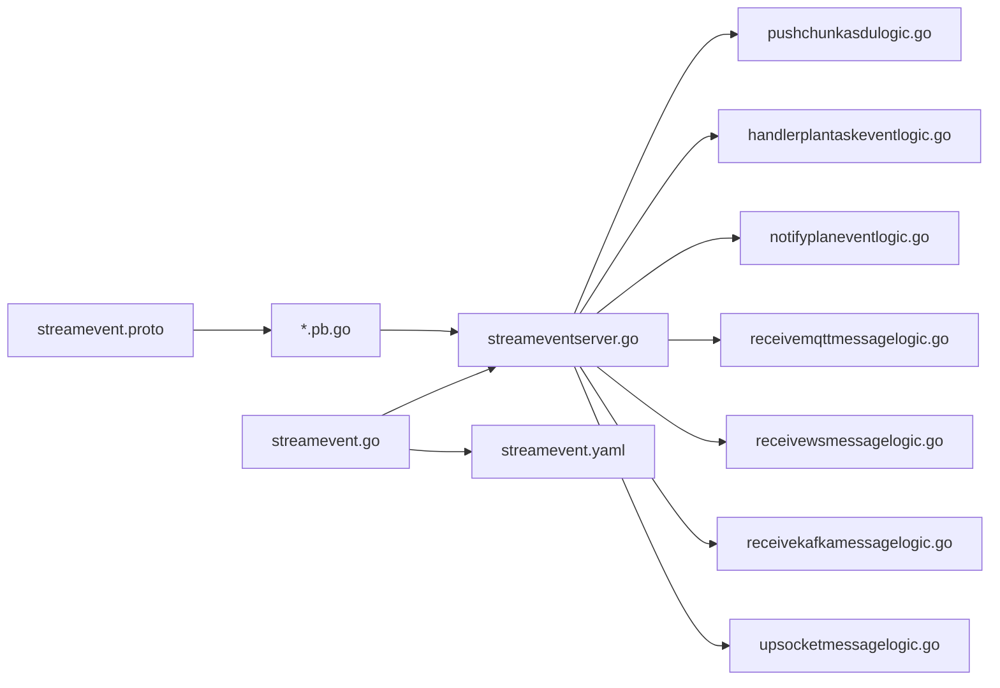

# StreamEvent 服务

<cite>
**本文引用的文件**
- [facade/streamevent/streamevent.proto](file://facade/streamevent/streamevent.proto)
- [facade/streamevent/streamevent/streamevent.pb.go](file://facade/streamevent/streamevent/streamevent.pb.go)
- [facade/streamevent/internal/logic/pushchunkasdulogic.go](file://facade/streamevent/internal/logic/pushchunkasdulogic.go)
- [facade/streamevent/internal/logic/receivemqttmessagelogic.go](file://facade/streamevent/internal/logic/receivemqttmessagelogic.go)
- [facade/streamevent/internal/logic/receivewsmessagelogic.go](file://facade/streamevent/internal/logic/receivewsmessagelogic.go)
- [facade/streamevent/internal/logic/receivekafkamessagelogic.go](file://facade/streamevent/internal/logic/receivekafkamessagelogic.go)
- [facade/streamevent/internal/logic/upsocketmessagelogic.go](file://facade/streamevent/internal/logic/upsocketmessagelogic.go)
- [facade/streamevent/internal/logic/notifyplaneventlogic.go](file://facade/streamevent/internal/logic/notifyplaneventlogic.go)
- [facade/streamevent/internal/logic/handlerplantaskeventlogic.go](file://facade/streamevent/internal/logic/handlerplantaskeventlogic.go)
- [facade/streamevent/internal/server/streameventserver.go](file://facade/streamevent/internal/server/streameventserver.go)
- [facade/streamevent/etc/streamevent.yaml](file://facade/streamevent/etc/streamevent.yaml)
- [facade/streamevent/streamevent.go](file://facade/streamevent/streamevent.go)
- [common/iec104/types/types.go](file://common/iec104/types/types.go)
- [swagger/streamevent.swagger.json](file://swagger/streamevent.swagger.json)
</cite>

## 目录
1. [简介](#简介)
2. [项目结构](#项目结构)
3. [核心组件](#核心组件)
4. [架构总览](#架构总览)
5. [详细组件分析](#详细组件分析)
6. [依赖关系分析](#依赖关系分析)
7. [性能考量](#性能考量)
8. [故障排查指南](#故障排查指南)
9. [结论](#结论)
10. [附录](#附录)

## 简介
StreamEvent 服务是一个基于 gRPC 的实时事件推送与数据流处理服务，主要面向电力系统 IEC 60870-5-104 协议的 ASDU（应用服务数据单元）事件接收与入库，并提供多来源数据接入（MQTT、WebSocket、Kafka）、计划任务事件处理与通知、以及上行 Socket 事件通道能力。服务通过统一的 gRPC 接口对外暴露，支持批量推送、事件过滤与订阅管理的扩展能力，并提供对 TDengine 的高效写入路径。

## 项目结构
StreamEvent 服务位于 facade/streamevent 目录，采用典型的 go-zero 微服务分层结构：
- 接口定义：facade/streamevent/streamevent.proto
- 生成代码：facade/streamevent/streamevent/*.pb.go
- 逻辑实现：internal/logic/*.go
- 服务端入口：internal/server/streameventserver.go
- 启动入口：streamevent.go
- 配置：etc/streamevent.yaml
- Swagger 文档：swagger/streamevent.swagger.json

**图表来源**
- [facade/streamevent/streamevent.proto](file://facade/streamevent/streamevent.proto)
- [facade/streamevent/streamevent/streamevent.pb.go](file://facade/streamevent/streamevent/streamevent.pb.go)
- [facade/streamevent/internal/server/streameventserver.go](file://facade/streamevent/internal/server/streameventserver.go)
- [facade/streamevent/streamevent.go](file://facade/streamevent/streamevent.go)
- [facade/streamevent/etc/streamevent.yaml](file://facade/streamevent/etc/streamevent.yaml)
- [swagger/streamevent.swagger.json](file://swagger/streamevent.swagger.json)

**章节来源**
- [facade/streamevent/streamevent.proto](file://facade/streamevent/streamevent.proto)
- [facade/streamevent/etc/streamevent.yaml](file://facade/streamevent/etc/streamevent.yaml)

## 核心组件
- gRPC 服务接口：StreamEvent
  - ReceiveMQTTMessage：接收 MQTT 消息（支持批量聚合）
  - ReceiveWSMessage：接收 WebSocket 消息
  - ReceiveKafkaMessage：接收 Kafka 消息（支持批量聚合）
  - PushChunkAsdu：推送 IEC 104 协议的 ASDU 事件块
  - UpSocketMessage：上行 Socket 标准消息（连接、断开、加入房间、自定义 up 事件）
  - HandlerPlanTaskEvent：计划任务事件处理（回调语义，支持延迟配置）
  - NotifyPlanEvent：计划任务事件通知（批次完成/计划完成）

- 数据模型与事件类型
  - MqttMessage、KafkaMessage：外部消息载体
  - MsgBody：IEC 104 ASDU 事件主体，包含设备地址、ASDU 类型、信息体、时间戳、元数据与点位映射
  - PointMapping：设备与 TDengine 表映射
  - 单点/双点/标度化/规一化/步位置/比特串/短浮点/累计量/保护事件等 ASDU 信息体类型
  - PlanEventType：计划事件类型枚举（批次完成、计划完成）
  - HandlerPlanTaskEventReq/Res：计划任务事件请求/响应，支持延迟配置

- 服务端与启动
  - StreamEventServer：gRPC 服务端实现，路由到各逻辑层
  - streamevent.go：加载配置、注册服务、可选 Nacos 注册与反射调试

**章节来源**
- [facade/streamevent/streamevent.proto](file://facade/streamevent/streamevent.proto)
- [facade/streamevent/internal/server/streameventserver.go](file://facade/streamevent/internal/server/streameventserver.go)
- [facade/streamevent/streamevent.go](file://facade/streamevent/streamevent.go)

## 架构总览
StreamEvent 服务采用“接口定义 -> 生成代码 -> 服务端路由 -> 业务逻辑 -> 外部系统”的清晰链路。核心数据流围绕 PushChunkAsdu 展开：IEC 104 ASDU 事件经解析后，根据点位映射与元数据生成子表名并写入 TDengine；同时提供计划任务事件处理与通知能力，支撑事件溯源与历史回放的扩展。

**图表来源**
- [facade/streamevent/streamevent.proto](file://facade/streamevent/streamevent.proto)
- [facade/streamevent/internal/logic/pushchunkasdulogic.go](file://facade/streamevent/internal/logic/pushchunkasdulogic.go)

## 详细组件分析

### gRPC 接口与数据模型
- 服务定义与方法
  - StreamEvent：包含上述 7 个 RPC 方法
- 请求/响应消息
  - ReceiveMQTTMessageReq/Res、ReceiveWSMessageReq/Res、ReceiveKafkaMessageReq/Res：分别承载外部消息与空响应
  - PushChunkAsduReq/Res：事务 ID + 消息体数组
  - MsgBody：包含 msgId、host、port、asdu、typeId、dataType、coa、bodyRaw、time、metaDataRaw、pm
  - PointMapping：设备与 TDengine 表映射
  - ASDU 信息体类型：SinglePointInfo、DoublePointInfo、MeasuredValueScaledInfo、MeasuredValueNormalInfo、StepPositionInfo、BitString32Info、MeasuredValueFloatInfo、BinaryCounterReadingInfo、EventOfProtectionEquipmentInfo、PackedStartEventsOfProtectionEquipmentInfo、PackedOutputCircuitInfoInfo、PackedSinglePointWithSCDInfo
  - UpSocketMessageReq/Res：连接/断开/加入房间/自定义 up 事件
  - HandlerPlanTaskEventReq/Res：计划任务事件处理，支持 execResult、message、reason、PbDelayConfig
  - NotifyPlanEventReq/Res：计划事件通知，含事件类型与属性
  - PlanEventType：批次完成、计划完成

**图表来源**
- [facade/streamevent/streamevent.proto](file://facade/streamevent/streamevent.proto)

**章节来源**
- [facade/streamevent/streamevent.proto](file://facade/streamevent/streamevent.proto)

### PushChunkAsdu 事件处理流程
- 输入：事务 ID + 消息体数组
- 处理：
  - 解析 bodyRaw 为结构化数据，提取 ioa 与 ioaValue
  - 生成 stationId 与子表名，优先使用 metaDataRaw 中的 stationId
  - 查询点位映射缓存，若允许原始入库，则构造 INSERT SQL
  - 使用 MapReduce 并行执行插入，统计成功/忽略/失败
- 输出：空响应，日志记录耗时与统计

**图表来源**
- [facade/streamevent/internal/logic/pushchunkasdulogic.go](file://facade/streamevent/internal/logic/pushchunkasdulogic.go)

**章节来源**
- [facade/streamevent/internal/logic/pushchunkasdulogic.go](file://facade/streamevent/internal/logic/pushchunkasdulogic.go)

### 计划任务事件处理与通知
- HandlerPlanTaskEvent：处理计划任务事件，返回执行结果与延迟配置
- NotifyPlanEvent：通知计划事件（批次完成/计划完成），携带扩展属性

**图表来源**
- [facade/streamevent/internal/server/streameventserver.go](file://facade/streamevent/internal/server/streameventserver.go)
- [facade/streamevent/internal/logic/handlerplantaskeventlogic.go](file://facade/streamevent/internal/logic/handlerplantaskeventlogic.go)
- [facade/streamevent/internal/logic/notifyplaneventlogic.go](file://facade/streamevent/internal/logic/notifyplaneventlogic.go)

**章节来源**
- [facade/streamevent/internal/server/streameventserver.go](file://facade/streamevent/internal/server/streameventserver.go)
- [facade/streamevent/internal/logic/handlerplantaskeventlogic.go](file://facade/streamevent/internal/logic/handlerplantaskeventlogic.go)
- [facade/streamevent/internal/logic/notifyplaneventlogic.go](file://facade/streamevent/internal/logic/notifyplaneventlogic.go)

### 外部数据接入（MQTT/WS/Kafka）
- ReceiveMQTTMessage：接收 MQTT 消息（批量聚合）
- ReceiveWSMessage：接收 WebSocket 消息
- ReceiveKafkaMessage：接收 Kafka 消息（批量聚合）
- 当前逻辑占位，后续可接入消息队列/网关进行事件分发与订阅管理

**图表来源**
- [facade/streamevent/internal/server/streameventserver.go](file://facade/streamevent/internal/server/streameventserver.go)
- [facade/streamevent/internal/logic/receivemqttmessagelogic.go](file://facade/streamevent/internal/logic/receivemqttmessagelogic.go)
- [facade/streamevent/internal/logic/receivewsmessagelogic.go](file://facade/streamevent/internal/logic/receivewsmessagelogic.go)
- [facade/streamevent/internal/logic/receivekafkamessagelogic.go](file://facade/streamevent/internal/logic/receivekafkamessagelogic.go)

**章节来源**
- [facade/streamevent/internal/server/streameventserver.go](file://facade/streamevent/internal/server/streameventserver.go)
- [facade/streamevent/internal/logic/receivemqttmessagelogic.go](file://facade/streamevent/internal/logic/receivemqttmessagelogic.go)
- [facade/streamevent/internal/logic/receivewsmessagelogic.go](file://facade/streamevent/internal/logic/receivewsmessagelogic.go)
- [facade/streamevent/internal/logic/receivekafkamessagelogic.go](file://facade/streamevent/internal/logic/receivekafkamessagelogic.go)

### 上行 Socket 消息
- UpSocketMessage：支持连接/断开/加入房间/自定义 up 事件，返回标准化下行负载示例

**图表来源**
- [facade/streamevent/internal/server/streameventserver.go](file://facade/streamevent/internal/server/streameventserver.go)
- [facade/streamevent/internal/logic/upsocketmessagelogic.go](file://facade/streamevent/internal/logic/upsocketmessagelogic.go)

**章节来源**
- [facade/streamevent/internal/server/streameventserver.go](file://facade/streamevent/internal/server/streameventserver.go)
- [facade/streamevent/internal/logic/upsocketmessagelogic.go](file://facade/streamevent/internal/logic/upsocketmessagelogic.go)

## 依赖关系分析
- 接口与生成代码
  - streamevent.proto 定义服务与消息，生成 *.pb.go 供服务端/客户端使用
- 服务端路由
  - streameventserver.go 将 gRPC 方法路由到对应逻辑层
- 业务逻辑
  - pushchunkasdulogic.go：核心事件入库逻辑，依赖 TDengine 连接与点位映射模型
  - handlerplantaskeventlogic.go/notifyplaneventlogic.go：计划任务事件处理与通知
  - receivemqttmessagelogic.go/receivewsmessagelogic.go/receivekafkamessagelogic.go：外部数据接入占位
  - upsocketmessagelogic.go：Socket 上行消息处理
- 启动与配置
  - streamevent.go：加载配置、注册服务、可选 Nacos 注册与反射
  - streamevent.yaml：监听端口、日志级别、中间件统计、Nacos 注册开关、TDengine 连接参数、数据库连接参数

**图表来源**
- [facade/streamevent/streamevent.proto](file://facade/streamevent/streamevent.proto)
- [facade/streamevent/streamevent/streamevent.pb.go](file://facade/streamevent/streamevent/streamevent.pb.go)
- [facade/streamevent/internal/server/streameventserver.go](file://facade/streamevent/internal/server/streameventserver.go)
- [facade/streamevent/streamevent.go](file://facade/streamevent/streamevent.go)
- [facade/streamevent/etc/streamevent.yaml](file://facade/streamevent/etc/streamevent.yaml)

**章节来源**
- [facade/streamevent/streamevent.proto](file://facade/streamevent/streamevent.proto)
- [facade/streamevent/streamevent/streamevent.pb.go](file://facade/streamevent/streamevent/streamevent.pb.go)
- [facade/streamevent/internal/server/streameventserver.go](file://facade/streamevent/internal/server/streameventserver.go)
- [facade/streamevent/streamevent.go](file://facade/streamevent/streamevent.go)
- [facade/streamevent/etc/streamevent.yaml](file://facade/streamevent/etc/streamevent.yaml)

## 性能考量
- 批量推送与并行写入
  - PushChunkAsdu 支持批量消息体，内部使用 MapReduce 并行执行插入，提升吞吐
- 日志与中间件统计
  - 配置中对 PushChunkAsdu 方法设置了忽略统计的白名单，避免高频写入影响指标
- 连接与资源
  - TDengine 连接初始化检查，失败时记录错误并跳过写入
- 建议
  - 对于高并发场景，建议结合外部消息队列（如 Kafka）进行削峰填谷
  - 合理设置 MapReduce 并行度与批大小，平衡延迟与吞吐
  - 对点位映射缓存命中率进行监控，减少查询开销

**章节来源**
- [facade/streamevent/etc/streamevent.yaml](file://facade/streamevent/etc/streamevent.yaml)
- [facade/streamevent/internal/logic/pushchunkasdulogic.go](file://facade/streamevent/internal/logic/pushchunkasdulogic.go)

## 故障排查指南
- PushChunkAsdu 写入异常
  - 检查 TDengine 连接是否初始化成功
  - 查看 bodyRaw 解析与 ioa 提取是否正确
  - 核对点位映射缓存 enableRawInsert 标志
  - 关注 MapReduce 插入失败统计与日志耗时
- 计划任务事件
  - HandlerPlanTaskEvent 返回 execResult 与 PbDelayConfig，关注延迟原因与下次触发时间
  - NotifyPlanEvent 用于事件通知，确保事件类型与属性正确
- 外部数据接入
  - ReceiveMQTTMessage/ReceiveWSMessage/ReceiveKafkaMessage 当前为占位实现，需按需接入消息源
- Socket 上行
  - UpSocketMessage 返回标准化下行负载，注意鉴权信息读取与 JSON 序列化

**章节来源**
- [facade/streamevent/internal/logic/pushchunkasdulogic.go](file://facade/streamevent/internal/logic/pushchunkasdulogic.go)
- [facade/streamevent/internal/logic/handlerplantaskeventlogic.go](file://facade/streamevent/internal/logic/handlerplantaskeventlogic.go)
- [facade/streamevent/internal/logic/notifyplaneventlogic.go](file://facade/streamevent/internal/logic/notifyplaneventlogic.go)
- [facade/streamevent/internal/logic/receivemqttmessagelogic.go](file://facade/streamevent/internal/logic/receivemqttmessagelogic.go)
- [facade/streamevent/internal/logic/receivewsmessagelogic.go](file://facade/streamevent/internal/logic/receivewsmessagelogic.go)
- [facade/streamevent/internal/logic/receivekafkamessagelogic.go](file://facade/streamevent/internal/logic/receivekafkamessagelogic.go)
- [facade/streamevent/internal/logic/upsocketmessagelogic.go](file://facade/streamevent/internal/logic/upsocketmessagelogic.go)

## 结论
StreamEvent 服务提供了统一的 gRPC 接口，覆盖 IEC 104 协议事件的接收与入库、多来源数据接入、计划任务事件处理与通知、以及 Socket 上行消息通道。通过 MapReduce 并行写入与配置化的中间件统计，服务具备良好的性能与可观测性。建议在生产环境中结合消息队列与缓存策略，进一步提升稳定性与吞吐能力。

## 附录
- 运行配置要点
  - 监听端口、日志级别、中间件统计白名单、Nacos 注册开关、TDengine 连接参数、数据库连接参数
- OpenAPI 文档
  - swagger 文件包含基础定义与 RPC 状态结构，便于集成与测试

**章节来源**
- [facade/streamevent/etc/streamevent.yaml](file://facade/streamevent/etc/streamevent.yaml)
- [swagger/streamevent.swagger.json](file://swagger/streamevent.swagger.json)