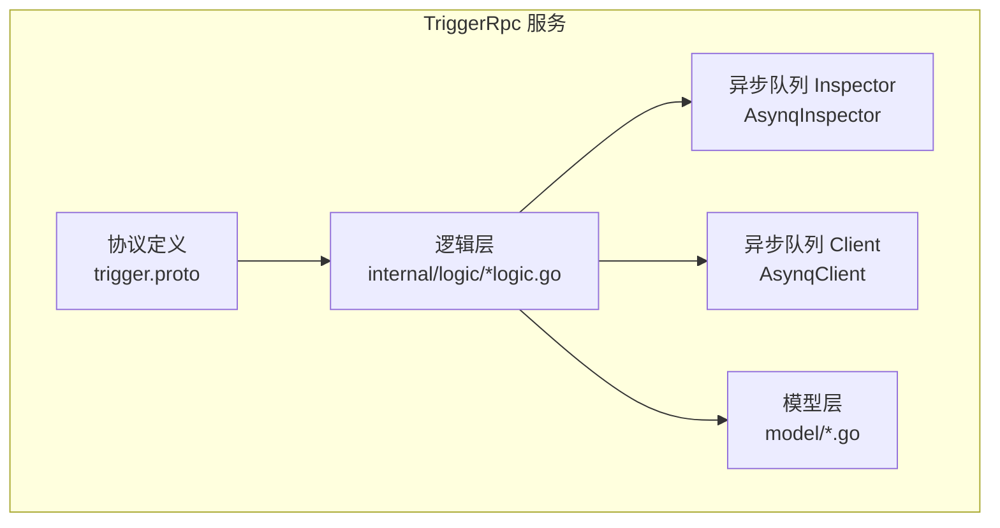
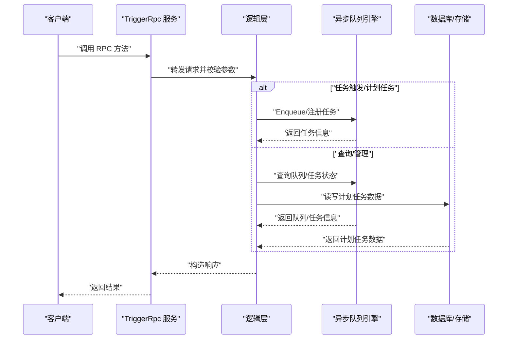
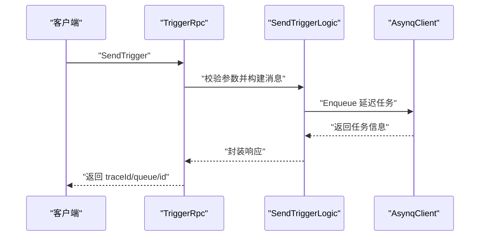
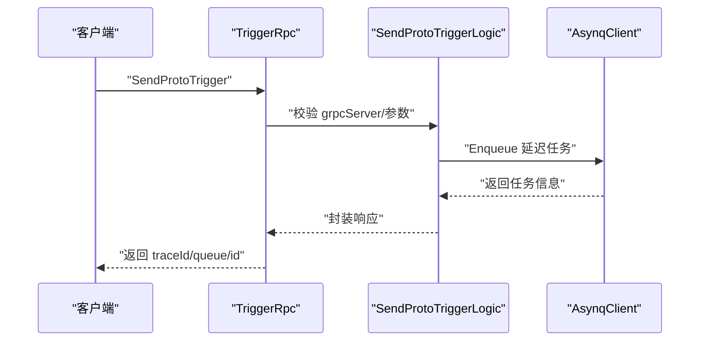
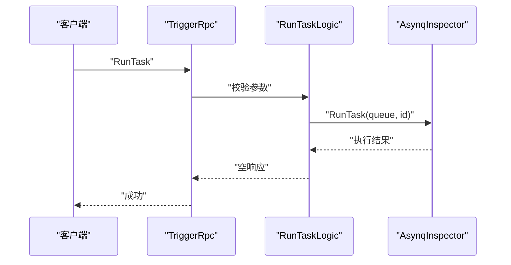
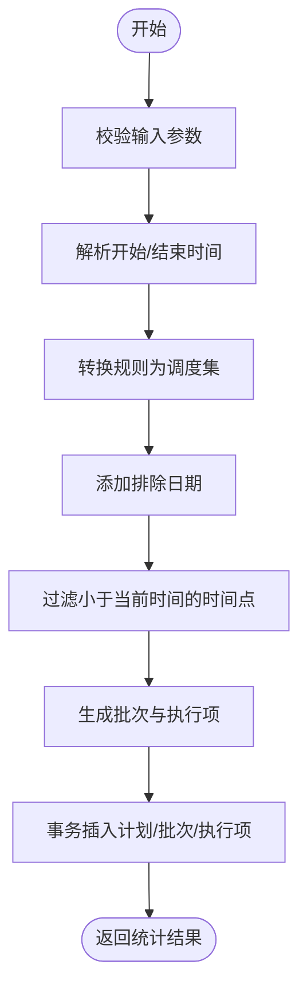
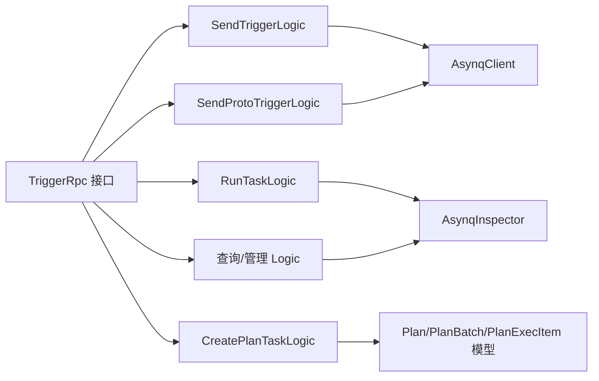

# TriggerRpc 服务

<cite>
**本文引用的文件**
- [trigger.proto](file://app/trigger/trigger.proto)
- [sendtriggerlogic.go](file://app/trigger/internal/logic/sendtriggerlogic.go)
- [sendprototriggerlogic.go](file://app/trigger/internal/logic/sendprototriggerlogic.go)
- [runtasklogic.go](file://app/trigger/internal/logic/runtasklogic.go)
- [createplantasklogic.go](file://app/trigger/internal/logic/createplantasklogic.go)
- [getqueueinfologic.go](file://app/trigger/internal/logic/getqueueinfologic.go)
- [listactivetaskslogic.go](file://app/trigger/internal/logic/listactivetaskslogic.go)
- [listpendingtaskslogic.go](file://app/trigger/internal/logic/listpendingtaskslogic.go)
- [listaggregatingtaskslogic.go](file://app/trigger/internal/logic/listaggregatingtaskslogic.go)
- [listscheduledtaskslogic.go](file://app/trigger/internal/logic/listscheduledtaskslogic.go)
- [listretrytaskslogic.go](file://app/trigger/internal/logic/listretrytaskslogic.go)
- [listarchivedtaskslogic.go](file://app/trigger/internal/logic/listarchivedtaskslogic.go)
- [listcompletedtaskslogic.go](file://app/trigger/internal/logic/listcompletedtaskslogic.go)
- [gettaskinfologic.go](file://app/trigger/internal/logic/gettaskinfologic.go)
- [archiveTasklogic.go](file://app/trigger/internal/logic/archiveTasklogic.go)
</cite>

## 目录
1. [简介](#简介)
2. [项目结构](#项目结构)
3. [核心组件](#核心组件)
4. [架构总览](#架构总览)
5. [详细组件分析](#详细组件分析)
6. [依赖关系分析](#依赖关系分析)
7. [性能与可靠性](#性能与可靠性)
8. [故障排查指南](#故障排查指南)
9. [结论](#结论)
10. [附录](#附录)

## 简介
TriggerRpc 服务提供统一的任务调度与计划任务管理能力，覆盖以下关键能力：
- 任务触发：支持 HTTP JSON 回调与 gRPC Proto 字节码回调两种方式，支持延迟触发、重试策略与超时控制。
- 队列与任务管理：提供队列信息查询、任务状态列表查询、任务详情查询、归档与删除等运维能力。
- 计划任务：基于规则生成计划任务，支持批量生成执行项、批次编号、间隔调度与状态控制。
- 执行控制：支持运行任务、暂停/恢复/终止计划与执行项，以及回调确认。

该服务以 gRPC 作为对外接口协议，内部通过异步队列引擎进行任务编排与执行，并提供可观测性与可扩展的配置化能力。

## 项目结构
TriggerRpc 服务位于应用目录 app/trigger 下，包含协议定义、服务端实现、逻辑层与模型层：
- 协议定义：trigger.proto 定义了服务接口、消息体与枚举。
- 逻辑层：internal/logic 下包含各 RPC 方法对应的业务逻辑实现。
- 服务端与上下文：server、svc 等文件负责服务启动与依赖注入。
- 模型层：model 目录提供计划任务相关实体的持久化模型。

**图表来源**
- [trigger.proto](file://app/trigger/trigger.proto)
- [sendtriggerlogic.go](file://app/trigger/internal/logic/sendtriggerlogic.go)
- [sendprototriggerlogic.go](file://app/trigger/internal/logic/sendprototriggerlogic.go)
- [createplantasklogic.go](file://app/trigger/internal/logic/createplantasklogic.go)

**章节来源**
- [trigger.proto](file://app/trigger/trigger.proto)

## 核心组件
- 服务接口：TriggerRpc 服务包含任务触发、队列与任务查询、计划任务管理、执行控制等接口。
- 数据模型：PbTaskInfo、PbQueueInfo、PbPlanRule、PbPlan 等消息体描述任务、队列与计划任务的数据结构。
- 执行状态：PbExecItemStatus 枚举定义了执行项的状态流转。
- 重试与超时：请求参数中包含最大重试次数、请求超时时间、处理延迟等控制字段。

**章节来源**
- [trigger.proto](file://app/trigger/trigger.proto)

## 架构总览
TriggerRpc 的调用链路如下：
- 客户端通过 gRPC 调用服务端方法。
- 服务端逻辑层接收请求，进行参数校验与业务处理。
- 对于任务触发类接口，逻辑层将任务入队至异步队列引擎；对于查询与管理类接口，直接查询队列或数据库。
- 异步队列引擎负责任务调度、重试与超时处理。

**图表来源**
- [sendtriggerlogic.go](file://app/trigger/internal/logic/sendtriggerlogic.go)
- [sendprototriggerlogic.go](file://app/trigger/internal/logic/sendprototriggerlogic.go)
- [createplantasklogic.go](file://app/trigger/internal/logic/createplantasklogic.go)
- [getqueueinfologic.go](file://app/trigger/internal/logic/getqueueinfologic.go)
- [gettaskinfologic.go](file://app/trigger/internal/logic/gettaskinfologic.go)

## 详细组件分析

### 任务触发接口

#### SendTrigger
- 功能：发送 HTTP POST JSON 回调触发任务，支持延迟触发与重试。
- 请求参数
  - processIn：相对延迟秒数（与 triggerTime 二选一，存在时优先使用）。
  - triggerTime：绝对触发时间字符串。
  - url：HTTP 回调地址。
  - maxRetry：最大重试次数（默认值见协议注释）。
  - msgId：消息唯一标识，为空时自动生成。
  - body：回调请求体。
- 响应字段
  - traceId：链路追踪 ID。
  - queue：任务所在队列名。
  - id：任务 ID。
- 错误码
  - 参数校验失败、触发时间无效、入队失败等。
- 使用场景
  - 业务系统需要在指定时间或稍后时间向外部服务发起回调。
- 实现要点
  - 支持基于绝对时间或相对时间的延迟触发。
  - 重试策略遵循指数退避，上限封顶为固定时长。
  - 任务入队时设置队列与保留周期。

**图表来源**
- [sendtriggerlogic.go](file://app/trigger/internal/logic/sendtriggerlogic.go)
- [trigger.proto](file://app/trigger/trigger.proto)

**章节来源**
- [trigger.proto](file://app/trigger/trigger.proto)
- [sendtriggerlogic.go](file://app/trigger/internal/logic/sendtriggerlogic.go)

#### SendProtoTrigger
- 功能：发送 gRPC Proto 字节码回调触发任务，支持延迟触发、重试与请求超时。
- 请求参数
  - processIn/triggerTime：与 SendTrigger 类似。
  - maxRetry：最大重试次数（默认值见协议注释）。
  - msgId：消息唯一标识，为空时自动生成。
  - grpcServer：gRPC 服务地址，支持直连与服务发现格式。
  - method：目标方法名。
  - payload：序列化后的 Proto 字节数据。
  - requestTimeout：请求超时毫秒数。
- 响应字段
  - traceId、queue、id。
- 错误码
  - grpcServer 格式非法、参数校验失败、入队失败等。
- 使用场景
  - 同步或异步回调到 gRPC 服务，适合强类型参数传递。
- 实现要点
  - grpcServer 地址使用正则校验，确保格式合法。
  - 重试策略与超时控制同 SendTrigger。

**图表来源**
- [sendprototriggerlogic.go](file://app/trigger/internal/logic/sendprototriggerlogic.go)
- [trigger.proto](file://app/trigger/trigger.proto)

**章节来源**
- [trigger.proto](file://app/trigger/trigger.proto)
- [sendprototriggerlogic.go](file://app/trigger/internal/logic/sendprototriggerlogic.go)

### 任务执行与控制

#### RunTask
- 功能：强制运行指定队列中的任务。
- 请求参数
  - queue：队列名。
  - id：任务 ID。
- 响应：空。
- 错误码：参数校验失败、任务不存在或无法运行。
- 使用场景：运维干预或测试验证。

**图表来源**
- [runtasklogic.go](file://app/trigger/internal/logic/runtasklogic.go)
- [trigger.proto](file://app/trigger/trigger.proto)

**章节来源**
- [trigger.proto](file://app/trigger/trigger.proto)
- [runtasklogic.go](file://app/trigger/internal/logic/runtasklogic.go)

### 队列与任务查询

#### Queues / GetQueueInfo
- 功能：获取队列列表与队列信息快照。
- 请求参数：QueuesReq 为空；GetQueueInfoReq 包含 queue。
- 响应：QueuesRes（队列名数组）、GetQueueInfoRes（PbQueueInfo）。
- 使用场景：监控与运维面板展示。

**章节来源**
- [trigger.proto](file://app/trigger/trigger.proto)
- [getqueueinfologic.go](file://app/trigger/internal/logic/getqueueinfologic.go)

#### ListActiveTasks / ListPendingTasks / ListAggregatingTasks / ListScheduledTasks / ListRetryTasks / ListArchivedTasks / ListCompletedTasks
- 功能：分页列出不同状态的任务集合，并附带队列信息。
- 请求参数：pageSize/pageNum/queue/group（部分接口）。
- 响应：ListXxxTasksRes（队列信息 + 任务列表）。
- 使用场景：任务监控、告警与报表。

**章节来源**
- [trigger.proto](file://app/trigger/trigger.proto)
- [listactivetaskslogic.go](file://app/trigger/internal/logic/listactivetaskslogic.go)
- [listpendingtaskslogic.go](file://app/trigger/internal/logic/listpendingtaskslogic.go)
- [listaggregatingtaskslogic.go](file://app/trigger/internal/logic/listaggregatingtaskslogic.go)
- [listscheduledtaskslogic.go](file://app/trigger/internal/logic/listscheduledtaskslogic.go)
- [listretrytaskslogic.go](file://app/trigger/internal/logic/listretrytaskslogic.go)
- [listarchivedtaskslogic.go](file://app/trigger/internal/logic/listarchivedtaskslogic.go)
- [listcompletedtaskslogic.go](file://app/trigger/internal/logic/listcompletedtaskslogic.go)

#### GetTaskInfo
- 功能：获取单个任务的详细信息。
- 请求参数：queue/id。
- 响应：GetTaskInfoRes（PbTaskInfo）。
- 使用场景：调试与问题定位。

**章节来源**
- [trigger.proto](file://app/trigger/trigger.proto)
- [gettaskinfologic.go](file://app/trigger/internal/logic/gettaskinfologic.go)

#### ArchiveTask / DeleteTask / DeleteAllCompletedTasks / DeleteAllArchivedTasks
- 功能：归档与删除任务，支持批量清理已完成/已归档任务。
- 请求参数：queue/id 或 queue。
- 响应：ArchiveTaskRes/DeleteTaskRes/删除计数。
- 使用场景：运维清理与容量管理。

**章节来源**
- [trigger.proto](file://app/trigger/trigger.proto)
- [archiveTasklogic.go](file://app/trigger/internal/logic/archiveTasklogic.go)

### 计划任务管理

#### CreatePlanTask
- 功能：创建计划任务，基于规则生成批次与执行项，支持间隔调度与跳过时间过滤。
- 请求参数
  - planId/planName/type/groupId/description：计划元信息。
  - startTime/endTime：计划生效时间范围。
  - rule：PbPlanRule（频率、月/日/周/小时/分钟、排除日期）。
  - excludeDates：排除日期列表。
  - intervalTime/intervalType：间隔类型与毫秒数。
  - execItems：执行项列表（itemId/itemType/itemName/pointId/payload/requestTimeout/扩展字段）。
  - batchNumPrefix/skipTimeFilter：批次编号前缀与是否跳过时间过滤。
  - deptCode/currentUser：组织与用户信息。
- 响应字段：id/planId/batchCnt/execCnt。
- 错误码
  - 时间范围非法、规则转换失败、排除日期格式错误、调度项过多、记录已存在等。
- 使用场景：周期性任务编排与批量执行。
- 实现要点
  - 将规则转换为调度时间集合并过滤过期时间。
  - 事务内插入计划、批次与执行项，支持间隔类型与不稳定过期时间。
  - 支持跳过时间过滤用于立即执行场景。

**图表来源**
- [createplantasklogic.go](file://app/trigger/internal/logic/createplantasklogic.go)
- [trigger.proto](file://app/trigger/trigger.proto)

**章节来源**
- [trigger.proto](file://app/trigger/trigger.proto)
- [createplantasklogic.go](file://app/trigger/internal/logic/createplantasklogic.go)

#### 计划任务状态控制与查询
- GetPlan / ListPlans / GetPlanBatch / ListPlanBatches / GetPlanExecItem / ListPlanExecItems / GetPlanExecLog / ListPlanExecLogs / GetExecItemDashboard / CallbackPlanExecItem / Pause/Resume/Terminate Plan/Batch/ExecItem / RunPlanExecItem / CalcPlanTaskDate / NextId
- 功能：计划任务的查询、状态控制、执行日志与仪表盘统计、立即执行与回调确认等。
- 使用场景：计划任务生命周期管理与可观测性。

**章节来源**
- [trigger.proto](file://app/trigger/trigger.proto)

## 依赖关系分析
- 协议到逻辑：各 RPC 方法由逻辑层实现，逻辑层依赖服务上下文中的异步队列客户端/检查器与数据库模型。
- 逻辑到引擎：任务触发类逻辑通过异步队列引擎入队；查询类逻辑通过 Inspector 查询队列状态；计划任务通过事务写入数据库。
- 数据模型：计划任务相关实体（计划、批次、执行项）由模型层提供持久化能力。

**图表来源**
- [sendtriggerlogic.go](file://app/trigger/internal/logic/sendtriggerlogic.go)
- [sendprototriggerlogic.go](file://app/trigger/internal/logic/sendprototriggerlogic.go)
- [runtasklogic.go](file://app/trigger/internal/logic/runtasklogic.go)
- [createplantasklogic.go](file://app/trigger/internal/logic/createplantasklogic.go)

**章节来源**
- [sendtriggerlogic.go](file://app/trigger/internal/logic/sendtriggerlogic.go)
- [sendprototriggerlogic.go](file://app/trigger/internal/logic/sendprototriggerlogic.go)
- [runtasklogic.go](file://app/trigger/internal/logic/runtasklogic.go)
- [createplantasklogic.go](file://app/trigger/internal/logic/createplantasklogic.go)

## 性能与可靠性
- 重试机制
  - 指数退避策略：首次约 1 秒，随后逐次翻倍，最高封顶为固定时长。
  - 最大重试次数可配置，默认值见协议注释。
- 超时处理
  - SendProtoTrigger 支持请求超时参数，用于限制单次回调耗时。
  - 任务处理超时可通过任务自身 timeout 控制。
- 队列与保留
  - 任务入队时设置队列与保留周期，避免长期占用资源。
- 批量与并发
  - 计划任务支持批量生成执行项，注意总量阈值控制，防止过度调度。
- 可观测性
  - traceId 用于跨服务追踪，便于定位问题。

[本节为通用建议，无需特定文件引用]

## 故障排查指南
- 参数校验失败
  - 检查必填字段、格式与范围约束（如队列名、页码、重试次数等）。
- 触发时间无效
  - 确认 triggerTime 解析正确且不早于当前时间。
- grpcServer 格式非法
  - 确保地址符合直连或服务发现格式要求。
- 任务无法运行
  - 检查队列状态、任务是否存在、Inspector 是否可用。
- 计划任务无触发时间
  - 检查规则与排除日期，确认未跨越时间范围或被全部过滤。
- 调度项过多
  - 控制计划任务的时间跨度与执行项数量，避免超过阈值。

**章节来源**
- [sendtriggerlogic.go](file://app/trigger/internal/logic/sendtriggerlogic.go)
- [sendprototriggerlogic.go](file://app/trigger/internal/logic/sendprototriggerlogic.go)
- [createplantasklogic.go](file://app/trigger/internal/logic/createplantasklogic.go)
- [runtasklogic.go](file://app/trigger/internal/logic/runtasklogic.go)

## 结论
TriggerRpc 服务提供了完善的任务调度与计划任务管理能力，涵盖触发、执行控制、队列与任务查询、计划任务全生命周期管理。通过异步队列引擎与严格的参数校验、重试与超时控制，保障了系统的可靠性与可观测性。建议在生产环境中结合监控与告警体系，合理配置重试与保留策略，并对计划任务的批量规模进行容量评估。

[本节为总结性内容，无需特定文件引用]

## 附录

### API 一览与最佳实践
- SendTrigger / SendProtoTrigger
  - 选择合适的延迟策略（相对/绝对）。
  - 合理设置重试次数与超时，避免资源浪费。
  - 对外回调建议携带 msgId 以便幂等与追踪。
- RunTask
  - 仅在必要时使用，避免破坏自动调度。
- 队列与任务查询
  - 使用分页参数控制查询规模，避免一次性拉取过多数据。
- 计划任务
  - 明确规则与排除日期，避免生成过多调度项。
  - 使用批次编号前缀便于识别与管理。
  - 对关键执行项配置合理的请求超时与重试策略。

[本节为通用建议，无需特定文件引用]