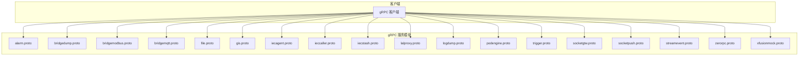
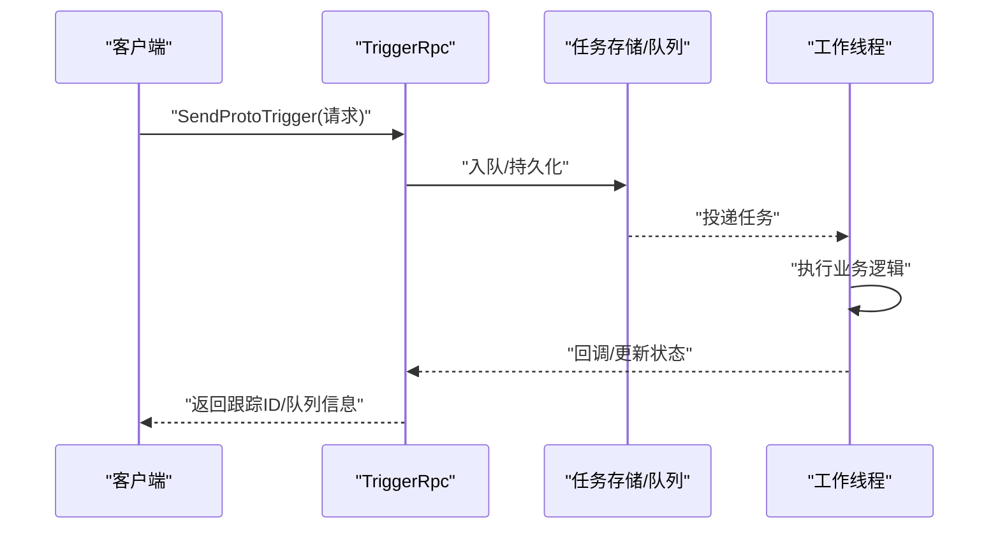
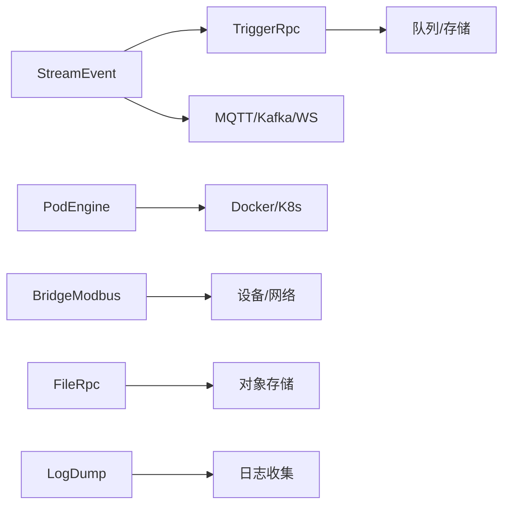

# gRPC API 接口

<cite>
**本文引用的文件**
- [app/alarm/alarm.proto](file://app/alarm/alarm.proto)
- [app/bridgedump/bridgedump.proto](file://app/bridgedump/bridgedump.proto)
- [app/bridgemodbus/bridgemodbus.proto](file://app/bridgemodbus/bridgemodbus.proto)
- [app/bridgemqtt/bridgemqtt.proto](file://app/bridgemqtt/bridgemqtt.proto)
- [app/file/file.proto](file://app/file/file.proto)
- [app/gis/gis.proto](file://app/gis/gis.proto)
- [app/iecagent/iecagent.proto](file://app/iecagent/iecagent.proto)
- [app/ieccaller/ieccaller.proto](file://app/ieccaller/ieccaller.proto)
- [app/iecstash/iecstash.proto](file://app/iecstash/iecstash.proto)
- [app/lalproxy/lalproxy.proto](file://app/lalproxy/lalproxy.proto)
- [app/logdump/logdump.proto](file://app/logdump/logdump.proto)
- [app/podengine/podengine.proto](file://app/podengine/podengine.proto)
- [app/trigger/trigger.proto](file://app/trigger/trigger.proto)
- [app/xfusionmock/xfusionmock.proto](file://app/xfusionmock/xfusionmock.proto)
- [facade/streamevent/streamevent.proto](file://facade/streamevent/streamevent.proto)
- [socketapp/socketgtw/socketgtw.proto](file://socketapp/socketgtw/socketgtw.proto)
- [socketapp/socketpush/socketpush.proto](file://socketapp/socketpush/socketpush.proto)
- [zerorpc/zerorpc.proto](file://zerorpc/zerorpc.proto)
</cite>

## 目录
1. [简介](#简介)
2. [项目结构](#项目结构)
3. [核心组件](#核心组件)
4. [架构总览](#架构总览)
5. [详细组件分析](#详细组件分析)
6. [依赖关系分析](#依赖关系分析)
7. [性能考量](#性能考量)
8. [故障排查指南](#故障排查指南)
9. [结论](#结论)
10. [附录](#附录)

## 简介
本文件面向 zero-service 的 gRPC API 接口，系统性梳理各模块的 RPC 服务、消息格式与调用方法，覆盖以下方面：
- 服务定义与 RPC 方法清单
- 请求/响应消息结构与字段说明
- 错误码与状态语义
- 服务发现、负载均衡与连接管理配置要点
- 客户端实现思路与最佳实践（连接、调用、元数据、认证、安全）
- 性能优化、超时与重试策略
- 调试工具与常见问题解决

## 项目结构
zero-service 采用多模块 gRPC 架构，每个业务模块在独立目录下维护 proto 定义、生成的 pb.go 以及服务实现。主要模块如下：
- 告警与日志：alarm、logdump
- 文件与对象存储：file
- 地理信息服务：gis
- IEC104 通信：iecagent、ieccaller、iecstash
- Modbus 协议桥接：bridgemodbus
- MQTT 消息桥接：bridgemqtt
- 流媒体代理：lalproxy
- 任务与计划调度：trigger
- Pod 引擎：podengine
- Socket 网关与推送：socketgtw、socketpush
- 统一 RPC：zerorpc
- 事件聚合门面：streamevent
- 千寻 mock：xfusionmock

图表来源
- [app/alarm/alarm.proto:1-34](file://app/alarm/alarm.proto#L1-L34)
- [app/bridgedump/bridgedump.proto:1-124](file://app/bridgedump/bridgedump.proto#L1-L124)
- [app/bridgemodbus/bridgemodbus.proto:1-355](file://app/bridgemodbus/bridgemodbus.proto#L1-L355)
- [app/bridgemqtt/bridgemqtt.proto:1-49](file://app/bridgemqtt/bridgemqtt.proto#L1-L49)
- [app/file/file.proto:1-287](file://app/file/file.proto#L1-L287)
- [app/gis/gis.proto:1-219](file://app/gis/gis.proto#L1-L219)
- [app/iecagent/iecagent.proto:1-16](file://app/iecagent/iecagent.proto#L1-L16)
- [app/ieccaller/ieccaller.proto:1-151](file://app/ieccaller/ieccaller.proto#L1-L151)
- [app/iecstash/iecstash.proto:1-15](file://app/iecstash/iecstash.proto#L1-L15)
- [app/lalproxy/lalproxy.proto:1-308](file://app/lalproxy/lalproxy.proto#L1-L308)
- [app/logdump/logdump.proto:1-44](file://app/logdump/logdump.proto#L1-L44)
- [app/podengine/podengine.proto:1-338](file://app/podengine/podengine.proto#L1-L338)
- [app/trigger/trigger.proto:1-1181](file://app/trigger/trigger.proto#L1-L1181)
- [socketapp/socketgtw/socketgtw.proto:1-149](file://socketapp/socketgtw/socketgtw.proto#L1-L149)
- [socketapp/socketpush/socketpush.proto:1-177](file://socketapp/socketpush/socketpush.proto#L1-L177)
- [facade/streamevent/streamevent.proto:1-581](file://facade/streamevent/streamevent.proto#L1-L581)
- [zerorpc/zerorpc.proto:1-167](file://zerorpc/zerorpc.proto#L1-L167)
- [app/xfusionmock/xfusionmock.proto:1-303](file://app/xfusionmock/xfusionmock.proto#L1-L303)

章节来源
- [app/alarm/alarm.proto:1-34](file://app/alarm/alarm.proto#L1-L34)
- [app/bridgedump/bridgedump.proto:1-124](file://app/bridgedump/bridgedump.proto#L1-L124)
- [app/bridgemodbus/bridgemodbus.proto:1-355](file://app/bridgemodbus/bridgemodbus.proto#L1-L355)
- [app/bridgemqtt/bridgemqtt.proto:1-49](file://app/bridgemqtt/bridgemqtt.proto#L1-L49)
- [app/file/file.proto:1-287](file://app/file/file.proto#L1-L287)
- [app/gis/gis.proto:1-219](file://app/gis/gis.proto#L1-L219)
- [app/iecagent/iecagent.proto:1-16](file://app/iecagent/iecagent.proto#L1-L16)
- [app/ieccaller/ieccaller.proto:1-151](file://app/ieccaller/ieccaller.proto#L1-L151)
- [app/iecstash/iecstash.proto:1-15](file://app/iecstash/iecstash.proto#L1-L15)
- [app/lalproxy/lalproxy.proto:1-308](file://app/lalproxy/lalproxy.proto#L1-L308)
- [app/logdump/logdump.proto:1-44](file://app/logdump/logdump.proto#L1-L44)
- [app/podengine/podengine.proto:1-338](file://app/podengine/podengine.proto#L1-L338)
- [app/trigger/trigger.proto:1-1181](file://app/trigger/trigger.proto#L1-L1181)
- [socketapp/socketgtw/socketgtw.proto:1-149](file://socketapp/socketgtw/socketgtw.proto#L1-L149)
- [socketapp/socketpush/socketpush.proto:1-177](file://socketapp/socketpush/socketpush.proto#L1-L177)
- [facade/streamevent/streamevent.proto:1-581](file://facade/streamevent/streamevent.proto#L1-L581)
- [zerorpc/zerorpc.proto:1-167](file://zerorpc/zerorpc.proto#L1-L167)
- [app/xfusionmock/xfusionmock.proto:1-303](file://app/xfusionmock/xfusionmock.proto#L1-L303)

## 核心组件
本节概述各模块提供的 gRPC 服务与典型 RPC 方法，便于快速检索与对照。

- 告警服务（alarm）
  - 服务：Alarm
  - 方法：Ping、Alarm
  - 用途：健康检查与告警推送

- 电缆数据桥接（bridgedump）
  - 服务：BridgeDumpRpc
  - 方法：Ping、CableWorkList、CableFault、CableFaultWave
  - 用途：接入电缆运行、故障与波形数据

- Modbus 协议桥接（bridgemodbus）
  - 服务：BridgeModbus
  - 方法：SaveConfig、DeleteConfig、PageListConfig、GetConfigByCode、BatchGetConfigByCode
  - 方法：ReadCoils、ReadDiscreteInputs、WriteSingleCoil、WriteMultipleCoils
  - 方法：ReadInputRegisters、ReadHoldingRegisters、WriteSingleRegister、WriteSingleRegisterWithDecimal
  - 方法：WriteMultipleRegisters、WriteMultipleRegistersWithDecimal、ReadWriteMultipleRegisters、MaskWriteRegister、ReadFIFOQueue
  - 方法：ReadDeviceIdentification、ReadDeviceIdentificationSpecificObject
  - 方法：BatchConvertDecimalToRegister
  - 用途：统一 Modbus 读写与设备识别

- MQTT 消息桥接（bridgemqtt）
  - 服务：BridgeMqtt
  - 方法：Ping、Publish、PublishWithTrace
  - 用途：发布消息与链路追踪

- 文件与对象存储（file）
  - 服务：FileRpc
  - 方法：Ping、OssDetail、OssList、CreateOss、UpdateOss、DeleteOss、MakeBucket、RemoveBucket、StatFile、SignUrl、PutFile、PutChunkFile（流式）、PutStreamFile（流式）、RemoveFile、RemoveFiles、CaptureVideoStream
  - 用途：对象存储资源与文件操作

- 地理信息服务（gis）
  - 服务：Gis
  - 方法：Ping、EncodeGeoHash、DecodeGeoHash、EncodeH3、DecodeH3、GenerateFenceCells、GenerateFenceH3Cells、PointsWithinRadius、PointInFence、PointInFences、Distance、BatchDistance、NearbyFences、TransformCoord、BatchTransformCoord、RoutePoints
  - 用途：地理编码/解码、围栏、距离与路径规划

- IEC104 通信（iecagent、ieccaller、iecstash）
  - 服务：IecAgent、IecCaller、IecStash
  - 方法：Ping（iecagent、iecstash）
  - 方法：SendTestCmd、SendReadCmd、SendInterrogationCmd、SendCounterInterrogationCmd、SendCommand（ieccaller）
  - 方法：QueryPointMappingById、QueryPointMappingByKey、PageListPointMapping、ClearPointMappingCache（ieccaller）
  - 用途：IEC104 命令下发与点位映射管理

- 流媒体代理（lalproxy）
  - 服务：lalProxy
  - 方法：GetGroupInfo、GetAllGroups、GetLalInfo、StartRelayPull、StopRelayPull、KickSession、StartRtpPub、StopRtpPub、AddIpBlacklist
  - 用途：直播/录播代理控制与查询

- 日志推送（logdump）
  - 服务：LogDump
  - 方法：Ping、PushLog
  - 用途：集中式日志推送

- Pod 引擎（podengine）
  - 服务：PodEngine
  - 方法：CreatePod、StartPod、StopPod、RestartPod、GetPod、ListPods、DeletePod、GetPodStats、ListImages
  - 用途：容器/Pod 生命周期与资源统计

- 任务与计划调度（trigger）
  - 服务：TriggerRpc
  - 方法：SendTrigger、SendProtoTrigger、Queues、GetQueueInfo、ArchiveTask、DeleteTask、GetTaskInfo、DeleteAllCompletedTasks、DeleteAllArchivedTasks、HistoricalStats、ListActiveTasks、ListPendingTasks、ListAggregatingTasks、ListScheduledTasks、ListRetryTasks、ListArchivedTasks、ListCompletedTasks、RunTask、CalcPlanTaskDate、CreatePlanTask、PausePlan、TerminatePlan、ResumePlan、PausePlanBatch、TerminatePlanBatch、ResumePlanBatch、PausePlanExecItem、TerminatePlanExecItem、RunPlanExecItem、ResumePlanExecItem、GetPlan、ListPlans、GetPlanBatch、ListPlanBatches、GetPlanExecItem、ListPlanExecItems、GetPlanExecLog、ListPlanExecLogs、GetExecItemDashboard、CallbackPlanExecItem、NextId
  - 用途：任务队列、计划任务与执行项管理

- Socket 网关与推送（socketgtw、socketpush）
  - 服务：SocketGtw、SocketPush
  - 方法：JoinRoom、LeaveRoom、BroadcastRoom、BroadcastGlobal、KickSession、KickMetaSession、SendToSession、SendToSessions、SendToMetaSession、SendToMetaSessions、SocketGtwStat（socketgtw）
  - 方法：GenToken、VerifyToken、JoinRoom、LeaveRoom、BroadcastRoom、BroadcastGlobal、KickSession、KickMetaSession、SendToSession、SendToSessions、SendToMetaSession、SendToMetaSessions、SocketGtwStat（socketpush）
  - 用途：房间管理、消息广播与会话管理

- 事件聚合门面（streamevent）
  - 服务：StreamEvent
  - 方法：ReceiveMQTTMessage、ReceiveWSMessage、ReceiveKafkaMessage、PushChunkAsdu、UpSocketMessage、HandlerPlanTaskEvent、NotifyPlanEvent
  - 用途：多通道事件汇聚与计划任务事件处理

- 统一 RPC（zerorpc）
  - 服务：Zerorpc
  - 方法：Ping、SendDelayTask、ForwardTask、SendSMSVerifyCode、GetRegionList、GenerateToken、Login、MiniProgramLogin、GetUserInfo、EditUserInfo、WxPayJsApi
  - 用途：用户、支付、区域与任务转发

- 千寻 mock（xfusionmock）
  - 服务：XFusionMockRpc
  - 方法：Ping、PushTest、PushPoint、PushAlarm、PushEvent、PushTerminalBind
  - 用途：模拟数据推送

章节来源
- [app/alarm/alarm.proto:30-33](file://app/alarm/alarm.proto#L30-L33)
- [app/bridgedump/bridgedump.proto:115-124](file://app/bridgedump/bridgedump.proto#L115-L124)
- [app/bridgemodbus/bridgemodbus.proto:10-83](file://app/bridgemodbus/bridgemodbus.proto#L10-L83)
- [app/bridgemqtt/bridgemqtt.proto:10-16](file://app/bridgemqtt/bridgemqtt.proto#L10-L16)
- [app/file/file.proto:270-287](file://app/file/file.proto#L270-L287)
- [app/gis/gis.proto:18-50](file://app/gis/gis.proto#L18-L50)
- [app/iecagent/iecagent.proto:14-16](file://app/iecagent/iecagent.proto#L14-L16)
- [app/ieccaller/ieccaller.proto:9-30](file://app/ieccaller/ieccaller.proto#L9-L30)
- [app/iecstash/iecstash.proto:13-15](file://app/iecstash/iecstash.proto#L13-L15)
- [app/lalproxy/lalproxy.proto:289-308](file://app/lalproxy/lalproxy.proto#L289-L308)
- [app/logdump/logdump.proto:9-14](file://app/logdump/logdump.proto#L9-L14)
- [app/podengine/podengine.proto:16-26](file://app/podengine/podengine.proto#L16-L26)
- [app/trigger/trigger.proto:13-106](file://app/trigger/trigger.proto#L13-L106)
- [socketapp/socketgtw/socketgtw.proto:9-32](file://socketapp/socketgtw/socketgtw.proto#L9-L32)
- [socketapp/socketpush/socketpush.proto:9-36](file://socketapp/socketpush/socketpush.proto#L9-L36)
- [facade/streamevent/streamevent.proto:10-25](file://facade/streamevent/streamevent.proto#L10-L25)
- [zerorpc/zerorpc.proto:140-167](file://zerorpc/zerorpc.proto#L140-L167)
- [app/xfusionmock/xfusionmock.proto:274-303](file://app/xfusionmock/xfusionmock.proto#L274-L303)

## 架构总览
下图展示客户端与各 gRPC 服务的交互关系，以及典型调用链路（以 trigger 为例）：

图表来源
- [app/trigger/trigger.proto:242-286](file://app/trigger/trigger.proto#L242-L286)

章节来源
- [app/trigger/trigger.proto:13-106](file://app/trigger/trigger.proto#L13-L106)

## 详细组件分析

### 告警服务（Alarm）
- 服务：Alarm
- 方法
  - Ping(Req) -> Res：健康检查
  - Alarm(AlarmReq) -> AlarmRes：告警推送
- 请求/响应字段
  - Req：ping
  - Res：pong
  - AlarmReq：chatName、description、title、project、dateTime、alarmId、content、error、userId[]、ip
  - AlarmRes：空
- 错误码
  - 未在 proto 中定义，遵循服务内约定或 HTTP 状态映射

章节来源
- [app/alarm/alarm.proto:6-28](file://app/alarm/alarm.proto#L6-L28)

### 电缆数据桥接（BridgeDumpRpc）
- 服务：BridgeDumpRpc
- 方法
  - Ping(Req) -> Res
  - CableWorkList(CableWorkListReq) -> CableWorkListRes
  - CableFault(CableFaultReq) -> CableFaultRes
  - CableFaultWave(CableFaultWaveReq) -> CableFaultWaveRes
- 请求/响应字段
  - Req：ping
  - Res：pong
  - CableWorkListReq：DeviceRunData[]
  - CableWorkListRes：code、msg
  - CableFaultReq：FaultData[]
  - CableFaultRes：code、msg
  - CableFaultWaveReq：FaultWaveData[]
  - CableFaultWaveRes：code、msg
- 数据模型
  - DeviceRunData：dtuId、loadCur、loadVoltage、sltype、operateTime、amTemperature、gps、workTime
  - FaultData：acciId、downTime、mlName、fixedType、diaElepo1、diaElepo2、diaElepo、errDistance、fsltype、notice、warnProcessed、warnCategory、acciTime、shortType
  - FaultWaveData：acciId、waveBatchId、dtuId、waveType、aheadTime、waveData、samprate

章节来源
- [app/bridgedump/bridgedump.proto:6-85](file://app/bridgedump/bridgedump.proto#L6-L85)
- [app/bridgedump/bridgedump.proto:115-124](file://app/bridgedump/bridgedump.proto#L115-L124)

### Modbus 协议桥接（BridgeModbus）
- 服务：BridgeModbus
- 方法（配置管理）
  - SaveConfig、DeleteConfig、PageListConfig、GetConfigByCode、BatchGetConfigByCode
- 方法（Bit Access）
  - ReadCoils、ReadDiscreteInputs、WriteSingleCoil、WriteMultipleCoils
- 方法（16-bit Register Access）
  - ReadInputRegisters、ReadHoldingRegisters、WriteSingleRegister、WriteSingleRegisterWithDecimal、WriteMultipleRegisters、WriteMultipleRegistersWithDecimal、ReadWriteMultipleRegisters、MaskWriteRegister、ReadFIFOQueue
- 方法（设备识别）
  - ReadDeviceIdentification、ReadDeviceIdentificationSpecificObject
- 方法（工具）
  - BatchConvertDecimalToRegister
- 请求/响应字段
  - PbModbusConfig：id、createTime、updateTime、modbusCode、slaveAddress、slave、timeout、idleTimeout、linkRecoveryTimeout、protocolRecoveryTimeout、connectDelay、enableTls、tlsCertFile、tlsKeyFile、tlsCaFile、status、remark
  - SaveConfigReq/Res、DeleteConfigReq/Res、PageListConfigReq/Res、GetConfigByCodeReq/Res、BatchGetConfigByCodeReq/Res
  - ReadCoilsReq/Res、ReadDiscreteInputsReq/Res、WriteSingleCoilReq/Res、WriteMultipleCoilsReq/Res
  - ReadInputRegistersReq/Res、ReadHoldingRegistersReq/Res、WriteSingleRegisterReq/Res、WriteSingleRegisterWithDecimalReq/Res、WriteMultipleRegistersReq/Res、WriteMultipleRegistersWithDecimalReq/Res、ReadWriteMultipleRegistersReq/Res、MaskWriteRegisterReq/Res、ReadFIFOQueueReq/Res
  - ReadDeviceIdentificationReq/Res、ReadDeviceIdentificationSpecificObjectReq/Res
  - BatchConvertDecimalToRegisterReq/Res

章节来源
- [app/bridgemodbus/bridgemodbus.proto:10-83](file://app/bridgemodbus/bridgemodbus.proto#L10-L83)
- [app/bridgemodbus/bridgemodbus.proto:85-148](file://app/bridgemodbus/bridgemodbus.proto#L85-L148)

### MQTT 消息桥接（BridgeMqtt）
- 服务：BridgeMqtt
- 方法
  - Ping(Req) -> Res
  - Publish(PublishReq) -> PublishRes
  - PublishWithTrace(PublishWithTraceReq) -> PublishWithTraceRes
- 请求/响应字段
  - Req：ping
  - Res：pong
  - PublishReq：topic、payload(bytes)
  - PublishRes：空
  - PublishWithTraceReq：topic、payload(bytes)
  - PublishWithTraceRes：traceId

章节来源
- [app/bridgemqtt/bridgemqtt.proto:10-49](file://app/bridgemqtt/bridgemqtt.proto#L10-L49)

### 文件与对象存储（FileRpc）
- 服务：FileRpc
- 方法
  - Ping、OssDetail、OssList、CreateOss、UpdateOss、DeleteOss、MakeBucket、RemoveBucket、StatFile、SignUrl、PutFile、PutChunkFile（流式）、PutStreamFile（流式）、RemoveFile、RemoveFiles、CaptureVideoStream
- 请求/响应字段
  - Oss：id、tenantId、category、ossCode、endpoint、accessKey、secretKey、bucketName、appId、region、remark、status、createTime、updateTime
  - File：link、domain、name、size、formatSize、originalName、attachId、md5、meta(ImageMeta)、thumbLink、ThumbName
  - ImageMeta：longitude、latitude、time、imgHeight、imgWidth、altitude、cameraModel
  - OssDetailReq/Res、OssListReq/Res、CreateOssReq/Res、UpdateOssReq/Res、DeleteOssReq/Res、MakeBucketReq/Res、RemoveBucketReq/Res、StatFileReq/Res、SignUrlReq/Res、PutFileReq/Res、PutChunkFileReq/Res、PutStreamFileReq/Res、RemoveFileReq/Res、RemoveFilesReq/Res、CaptureVideoStreamReq/Res

章节来源
- [app/file/file.proto:17-132](file://app/file/file.proto#L17-L132)
- [app/file/file.proto:270-287](file://app/file/file.proto#L270-L287)

### 地理信息服务（Gis）
- 服务：Gis
- 方法
  - Ping、EncodeGeoHash、DecodeGeoHash、EncodeH3、DecodeH3、GenerateFenceCells、GenerateFenceH3Cells、PointsWithinRadius、PointInFence、PointInFences、Distance、BatchDistance、NearbyFences、TransformCoord、BatchTransformCoord、RoutePoints
- 请求/响应字段
  - CoordType：WGS84、GCJ02、BD09
  - Fence：id、points[]
  - Point：lat、lon
  - PointPair：a(Point)、b(Point)
  - EncodeGeoHashReq/Res、DecodeGeoHashReq/Res、EncodeH3Req/Res、DecodeH3Req/Res、GenFenceCellsReq/Res、GenFenceH3CellsReq/Res、PointsWithinRadiusReq/Res、PointInFenceReq/Res、PointInFencesReq/Res、DistanceReq/Res、BatchDistanceReq/Res、NearbyFencesReq/Res、TransformCoordReq/Res、BatchTransformCoordReq/Res、RoutePointsReq/Res

章节来源
- [app/gis/gis.proto:18-50](file://app/gis/gis.proto#L18-L50)
- [app/gis/gis.proto:54-219](file://app/gis/gis.proto#L54-L219)

### IEC104 通信（IecAgent、IecCaller、IecStash）
- 服务：IecAgent、IecCaller、IecStash
- 方法
  - Ping（iecagent、iecstash）
  - SendTestCmd、SendReadCmd、SendInterrogationCmd、SendCounterInterrogationCmd、SendCommand（ieccaller）
  - QueryPointMappingById、QueryPointMappingByKey、PageListPointMapping、ClearPointMappingCache（ieccaller）
- 请求/响应字段
  - PbDevicePointMapping：id、createTime、updateTime、tagStation、coa、ioa、deviceId、deviceName、tdTableType、enablePush、ext1..ext5
  - QueryPointMappingByIdReq/Res、QueryPointMappingByKeyReq/Res、PageListPointMappingReq/Res、ClearPointMappingCacheReq/Res、ClearPointMappingCacheRes

章节来源
- [app/iecagent/iecagent.proto:14-16](file://app/iecagent/iecagent.proto#L14-L16)
- [app/ieccaller/ieccaller.proto:9-30](file://app/ieccaller/ieccaller.proto#L9-L30)
- [app/ieccaller/ieccaller.proto:89-151](file://app/ieccaller/ieccaller.proto#L89-L151)
- [app/iecstash/iecstash.proto:13-15](file://app/iecstash/iecstash.proto#L13-L15)

### 流媒体代理（lalProxy）
- 服务：lalProxy
- 方法
  - GetGroupInfo、GetAllGroups、GetLalInfo、StartRelayPull、StopRelayPull、KickSession、StartRtpPub、StopRtpPub、AddIpBlacklist
- 请求/响应字段
  - FrameData、PubSessionInfo、SubSessionInfo、PullSessionInfo、PushSessionInfo、GroupData、LalServerData
  - GetGroupInfoReq/Res、GetAllGroupsReq/Res、GetLalInfoReq/Res、StartRelayPullReq/Res、StopRelayPullReq/Res、KickSessionReq/Res、StartRtpPubReq/Res、StopRtpPubReq/Res、AddIpBlacklistReq/Res

章节来源
- [app/lalproxy/lalproxy.proto:289-308](file://app/lalproxy/lalproxy.proto#L289-L308)

### 日志推送（LogDump）
- 服务：LogDump
- 方法
  - Ping(PingReq) -> PingRes
  - PushLog(PushLogReq) -> PushLogRes
- 请求/响应字段
  - LogLevel：INFO、ERROR
  - LogEntry：service、level(LogLevel)、seq、message、extra(map)
  - PingReq/Res、PushLogReq/Res

章节来源
- [app/logdump/logdump.proto:9-44](file://app/logdump/logdump.proto#L9-L44)

### Pod 引擎（PodEngine）
- 服务：PodEngine
- 方法
  - CreatePod、StartPod、StopPod、RestartPod、GetPod、ListPods、DeletePod、GetPodStats、ListImages
- 请求/响应字段
  - PodPhase、PodConditionType、PodCondition、ContainerState、Container、ContainerSpec、PodSpec、Pod
  - CreatePodReq/Res、StartPodReq/Res、StopPodReq/Res、RestartPodReq/Res、GetPodReq/Res、ListPodsReq/Res、DeletePodReq/Res、GetPodStatsReq/Res、ListImagesReq/Res

章节来源
- [app/podengine/podengine.proto:16-26](file://app/podengine/podengine.proto#L16-L26)
- [app/podengine/podengine.proto:185-338](file://app/podengine/podengine.proto#L185-L338)

### 任务与计划调度（TriggerRpc）
- 服务：TriggerRpc
- 方法
  - SendTrigger、SendProtoTrigger、Queues、GetQueueInfo、ArchiveTask、DeleteTask、GetTaskInfo、DeleteAllCompletedTasks、DeleteAllArchivedTasks、HistoricalStats、ListActiveTasks、ListPendingTasks、ListAggregatingTasks、ListScheduledTasks、ListRetryTasks、ListArchivedTasks、ListCompletedTasks、RunTask、CalcPlanTaskDate、CreatePlanTask、PausePlan、TerminatePlan、ResumePlan、PausePlanBatch、TerminatePlanBatch、ResumePlanBatch、PausePlanExecItem、TerminatePlanExecItem、RunPlanExecItem、ResumePlanExecItem、GetPlan、ListPlans、GetPlanBatch、ListPlanBatches、GetPlanExecItem、ListPlanExecItems、GetPlanExecLog、ListPlanExecLogs、GetExecItemDashboard、CallbackPlanExecItem、NextId
- 请求/响应字段
  - PbTaskInfo、PbDailyStats、PbQueueInfo、SendTriggerReq/Res、SendProtoTriggerReq/Res、QueuesReq/Res、GetQueueInfoReq/Res、ArchiveTaskReq/Res、DeleteTaskReq/Res、GetTaskInfoReq/Res、DeleteAllCompletedTasksReq/Res、DeleteAllArchivedTasksReq/Res、HistoricalStatsReq/Res、ListActiveTasksReq/Res、ListPendingTasksReq/Res、ListAggregatingTasksReq/Res、ListScheduledTasksReq/Res、ListRetryTasksReq/Res、ListArchivedTasksReq/Res、ListCompletedTasksReq/Res、RunTaskReq/Res、CalcPlanTaskDateReq/Res、CreatePlanTaskReq/Res、PausePlanReq/Res、TerminatePlanReq/Res、ResumePlanReq/Res、PausePlanBatchReq/Res、TerminatePlanBatchReq/Res、ResumePlanBatchReq/Res、PausePlanExecItemReq/Res、TerminatePlanExecItemReq/Res、RunPlanExecItemReq/Res、ResumePlanExecItemReq/Res、GetPlanReq/Res、ListPlansReq/Res、GetPlanBatchReq/Res、ListPlanBatchesReq/Res、GetPlanExecItemReq/Res、ListPlanExecItemsReq/Res、GetPlanExecLogReq/Res、ListPlanExecLogsReq/Res、GetExecItemDashboardReq/Res、CallbackPlanExecItemReq/Res、NextIdReq/Res

章节来源
- [app/trigger/trigger.proto:13-106](file://app/trigger/trigger.proto#L13-L106)
- [app/trigger/trigger.proto:216-286](file://app/trigger/trigger.proto#L216-L286)

### Socket 网关与推送（SocketGtw、SocketPush）
- 服务：SocketGtw、SocketPush
- 方法
  - JoinRoom、LeaveRoom、BroadcastRoom、BroadcastGlobal、KickSession、KickMetaSession、SendToSession、SendToSessions、SendToMetaSession、SendToMetaSessions、SocketGtwStat（socketgtw）
  - GenToken、VerifyToken、JoinRoom、LeaveRoom、BroadcastRoom、BroadcastGlobal、KickSession、KickMetaSession、SendToSession、SendToSessions、SendToMetaSession、SendToMetaSessions、SocketGtwStat（socketpush）
- 请求/响应字段
  - PbMetaSession：key、value
  - PbSocketGtwStat：node、sessions
  - GenTokenReq/Res、VerifyTokenReq/Res、JoinRoomReq/Res、LeaveRoomReq/Res、BroadcastRoomReq/Res、BroadcastGlobalReq/Res、KickSessionReq/Res、KickMetaSessionReq/Res、SendToSessionReq/Res、SendToSessionsReq/Res、SendToMetaSessionReq/Res、SendToMetaSessionsReq/Res、SocketGtwStatReq/Res

章节来源
- [socketapp/socketgtw/socketgtw.proto:9-32](file://socketapp/socketgtw/socketgtw.proto#L9-L32)
- [socketapp/socketpush/socketpush.proto:9-36](file://socketapp/socketpush/socketpush.proto#L9-L36)
- [socketapp/socketgtw/socketgtw.proto:144-149](file://socketapp/socketgtw/socketgtw.proto#L144-L149)
- [socketapp/socketpush/socketpush.proto:172-177](file://socketapp/socketpush/socketpush.proto#L172-L177)

### 事件聚合门面（StreamEvent）
- 服务：StreamEvent
- 方法
  - ReceiveMQTTMessage、ReceiveWSMessage、ReceiveKafkaMessage、PushChunkAsdu、UpSocketMessage、HandlerPlanTaskEvent、NotifyPlanEvent
- 请求/响应字段
  - MqttMessage、KafkaMessage、MsgBody、PointMapping、SinglePointInfo、DoublePointInfo、MeasuredValueScaledInfo、MeasuredValueNormalInfo、StepPositionInfo、StepPosition、BitString32Info、MeasuredValueFloatInfo、BinaryCounterReadingInfo、BinaryCounterReading、EventOfProtectionEquipmentInfo、PackedStartEventsOfProtectionEquipmentInfo、PackedOutputCircuitInfo、PackedSinglePointWithSCDInfo、UpSocketMessageReq/Res、HandlerPlanTaskEventReq/Res、NotifyPlanEventReq/Res

章节来源
- [facade/streamevent/streamevent.proto:10-25](file://facade/streamevent/streamevent.proto#L10-L25)
- [facade/streamevent/streamevent.proto:27-80](file://facade/streamevent/streamevent.proto#L27-L80)
- [facade/streamevent/streamevent.proto:82-420](file://facade/streamevent/streamevent.proto#L82-L420)
- [facade/streamevent/streamevent.proto:450-581](file://facade/streamevent/streamevent.proto#L450-L581)

### 统一 RPC（Zerorpc）
- 服务：Zerorpc
- 方法
  - Ping、SendDelayTask、ForwardTask、SendSMSVerifyCode、GetRegionList、GenerateToken、Login、MiniProgramLogin、GetUserInfo、EditUserInfo、WxPayJsApi
- 请求/响应字段
  - Region、GenerateTokenReq/Res、LoginReq/Res、MiniProgramLoginReq/Res、GetUserInfoReq/Res、EditUserInfoReq/Res、WxPayJsApiReq/Res、SendDelayTaskReq/Res、ForwardTaskReq/Res、SendSMSVerifyCodeReq/Res、GetRegionListReq/Res

章节来源
- [zerorpc/zerorpc.proto:140-167](file://zerorpc/zerorpc.proto#L140-L167)

### 千寻 mock（XFusionMockRpc）
- 服务：XFusionMockRpc
- 方法
  - Ping、PushTest、PushPoint、PushAlarm、PushEvent、PushTerminalBind
- 请求/响应字段
  - TerminalBind、EventData、TerminalData、AlarmData、FenceInfo、LocationPosition、TerminalInfo、Location、Position、BuildingInfo、Status、ReqPushTest/Res、ReqPushPoint/Res、ReqPushAlarm/Res、ReqPushEvent/Res、ReqPushTerminalBind/Res

章节来源
- [app/xfusionmock/xfusionmock.proto:274-303](file://app/xfusionmock/xfusionmock.proto#L274-L303)

## 依赖关系分析
- 模块内聚：各模块 proto 独立定义，服务边界清晰，便于独立演进与部署
- 跨模块依赖：trigger 与队列/存储耦合较强；streamevent 作为门面聚合多源事件
- 外部依赖：lalproxy 依赖外部流媒体服务；bridgemodbus 依赖底层设备/网络；zerorpc 依赖第三方支付与短信服务

图表来源
- [app/trigger/trigger.proto:13-106](file://app/trigger/trigger.proto#L13-L106)
- [facade/streamevent/streamevent.proto:10-25](file://facade/streamevent/streamevent.proto#L10-L25)
- [app/podengine/podengine.proto:16-26](file://app/podengine/podengine.proto#L16-L26)
- [app/bridgemodbus/bridgemodbus.proto:10-83](file://app/bridgemodbus/bridgemodbus.proto#L10-L83)
- [app/file/file.proto:270-287](file://app/file/file.proto#L270-L287)
- [app/logdump/logdump.proto:9-14](file://app/logdump/logdump.proto#L9-L14)

章节来源
- [app/trigger/trigger.proto:13-106](file://app/trigger/trigger.proto#L13-L106)
- [facade/streamevent/streamevent.proto:10-25](file://facade/streamevent/streamevent.proto#L10-L25)
- [app/podengine/podengine.proto:16-26](file://app/podengine/podengine.proto#L16-L26)
- [app/bridgemodbus/bridgemodbus.proto:10-83](file://app/bridgemodbus/bridgemodbus.proto#L10-L83)
- [app/file/file.proto:270-287](file://app/file/file.proto#L270-L287)
- [app/logdump/logdump.proto:9-14](file://app/logdump/logdump.proto#L9-L14)

## 性能考量
- 连接池与复用
  - 使用连接池减少握手开销；启用 HTTP/2 多路复用
- 超时与重试
  - 为关键 RPC 设置合理超时（如 5–30s），对幂等操作采用指数退避重试
- 流式传输
  - 大文件上传/下载使用流式 RPC（如 PutChunkFile、PutStreamFile），提升吞吐与内存效率
- 负载均衡
  - 服务端：基于一致性哈希或轮询；客户端：使用 gRPC 负载均衡插件
- 压缩与序列化
  - 启用 gzip 压缩；优先使用二进制序列化（proto3）
- 监控与可观测性
  - 开启 gRPC 指标（qps、延迟、错误率）与链路追踪（traceId）

## 故障排查指南
- 常见错误码
  - lalproxy：errorCode（0 成功，1001/1002/1003/2001 等）
  - file：PutChunkFile/PutStreamFile 返回 isEnd、size
  - trigger：SendProtoTrigger 返回 traceId、queue、id
- 健康检查
  - 所有服务均提供 Ping/Pong 方法，用于快速探测
- 日志与追踪
  - 使用 LogDump 推送日志；结合 traceId 进行端到端追踪
- 调试工具
  - 使用 grpcurl/evans 等工具进行接口测试与联调
  - 结合 Prometheus/Grafana 监控指标

章节来源
- [app/lalproxy/lalproxy.proto:146-152](file://app/lalproxy/lalproxy.proto#L146-L152)
- [app/file/file.proto:203-207](file://app/file/file.proto#L203-L207)
- [app/trigger/trigger.proto:279-286](file://app/trigger/trigger.proto#L279-L286)
- [app/logdump/logdump.proto:31-37](file://app/logdump/logdump.proto#L31-L37)

## 结论
zero-service 的 gRPC API 体系覆盖了从设备协议桥接、文件存储、地理信息、任务调度到事件聚合与 Socket 网关的完整链路。通过清晰的服务边界、完善的请求/响应模型与可观测性设计，能够支撑高并发、低延迟的生产环境。建议在生产中结合服务发现与负载均衡策略，完善超时与重试机制，并持续监控关键指标以保障稳定性。

## 附录
- 客户端实现要点（概念性指导）
  - 连接建立：使用 gRPC 客户端，配置 TLS、超时、拦截器与重试策略
  - 方法调用：按服务方法构造请求消息，处理响应与错误码
  - 元数据传递：通过上下文传递 traceId、租户信息等
  - 认证与安全：启用 mTLS/TLS，结合令牌校验与权限控制
  - 性能优化：连接池、压缩、流式传输、指标监控