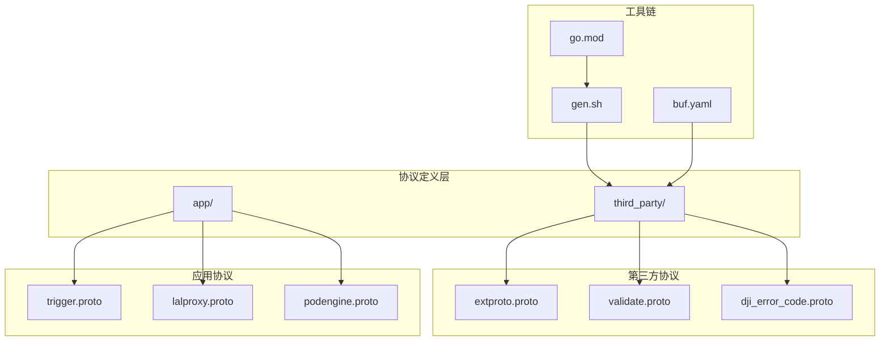
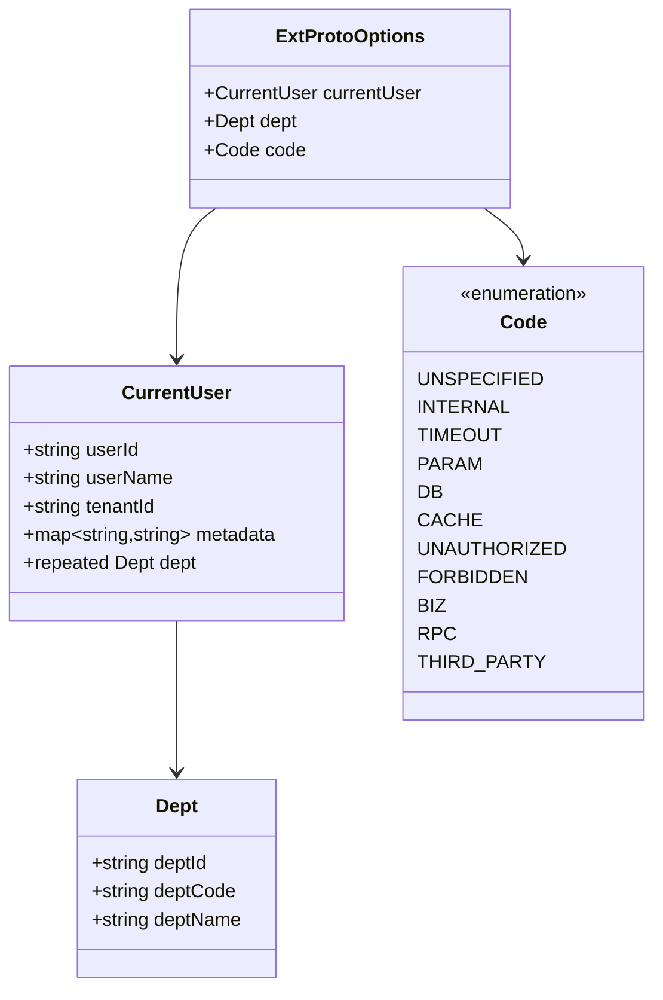
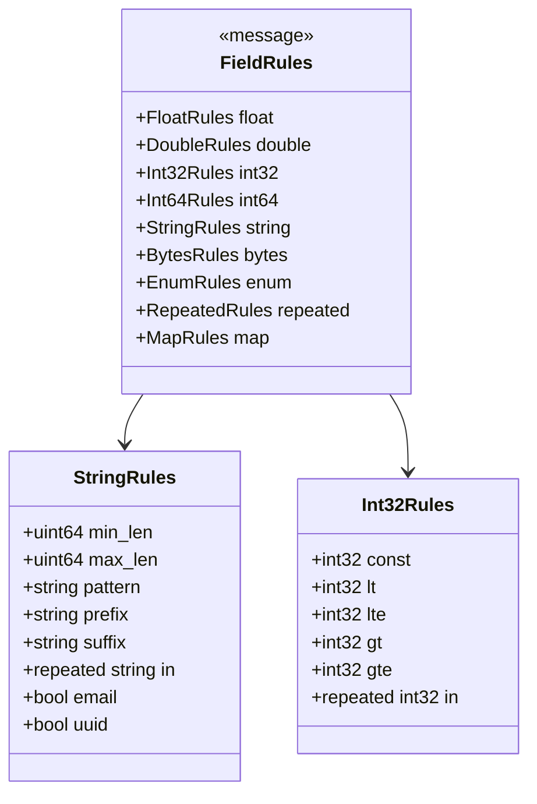
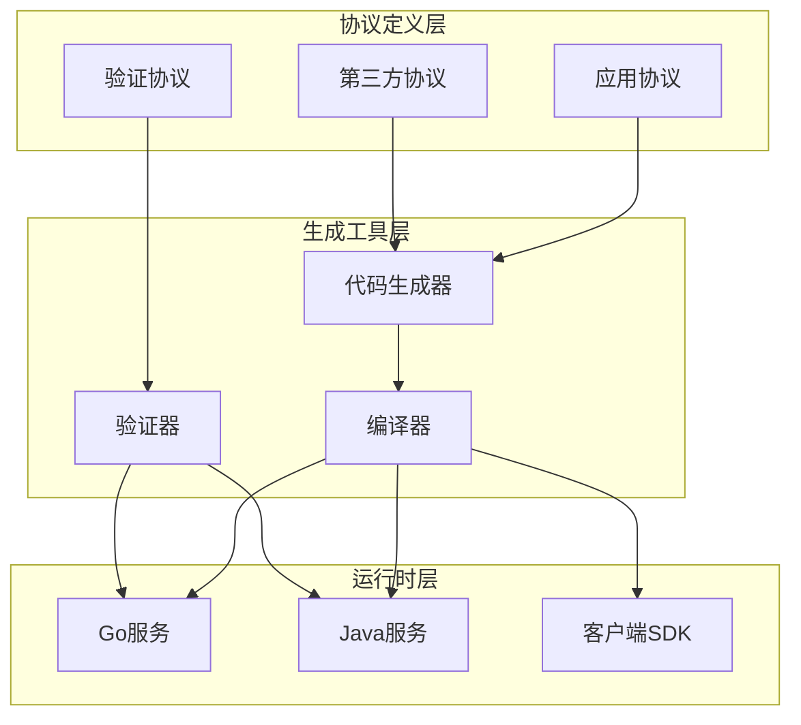
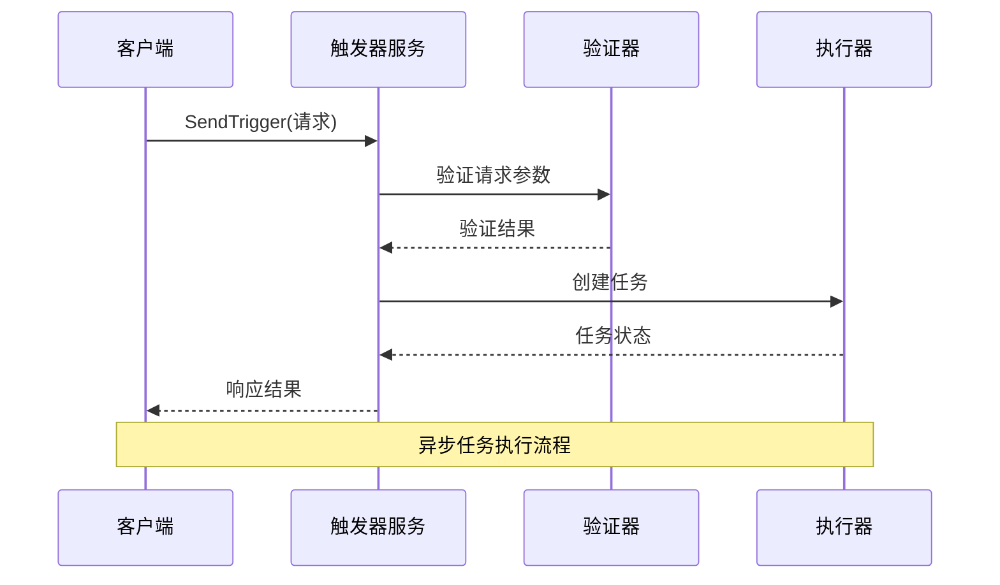
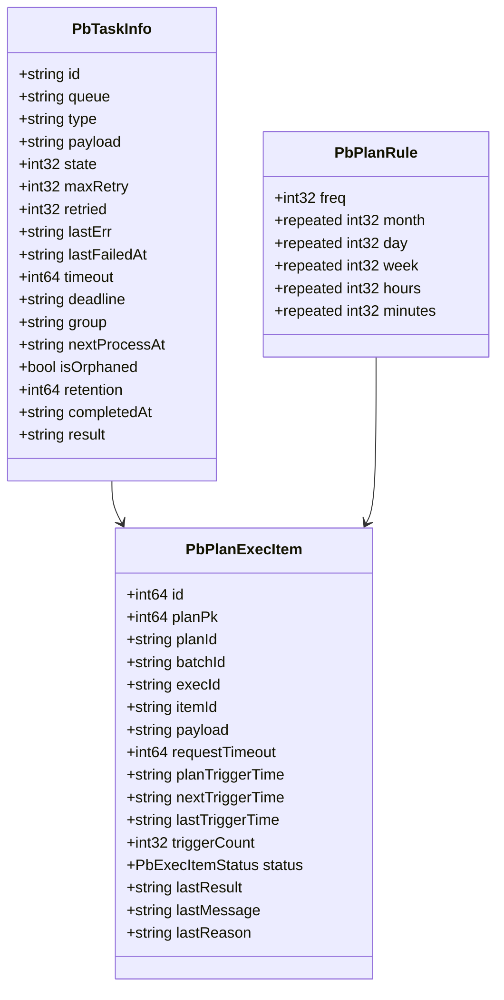
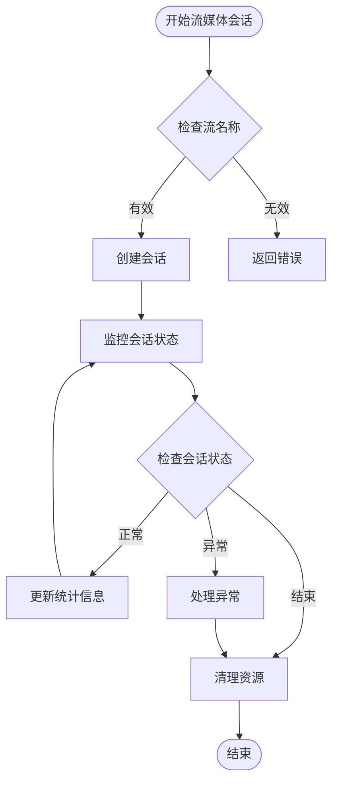
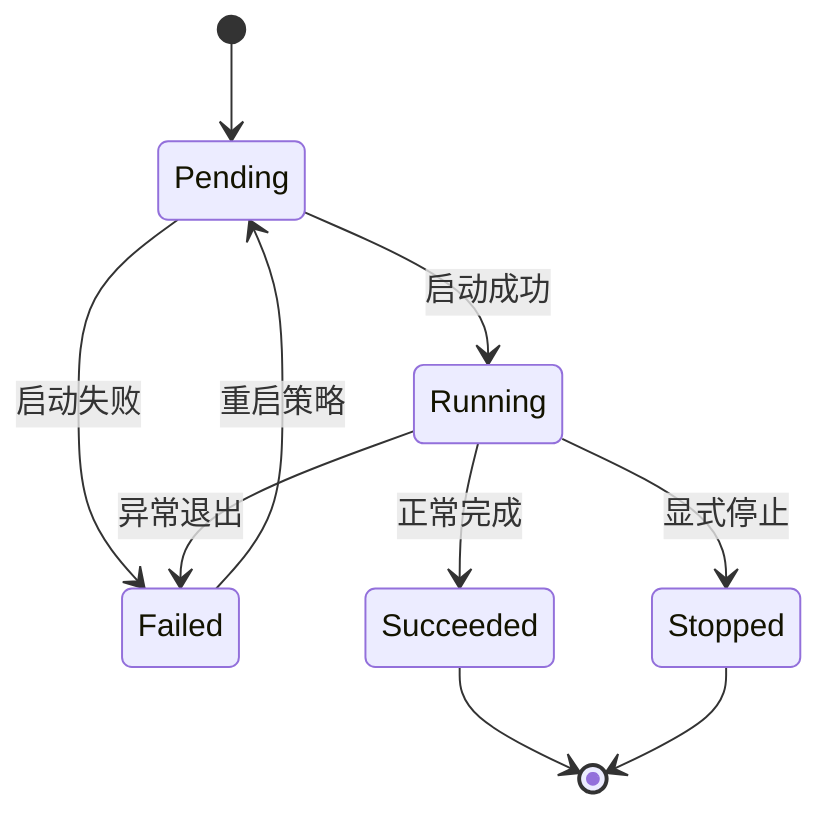
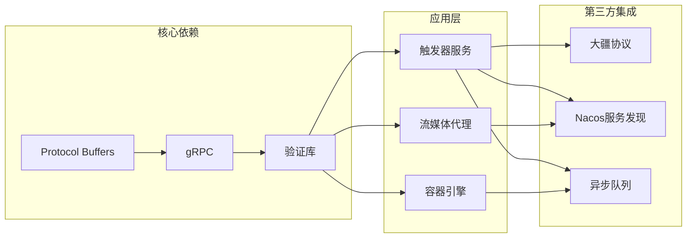
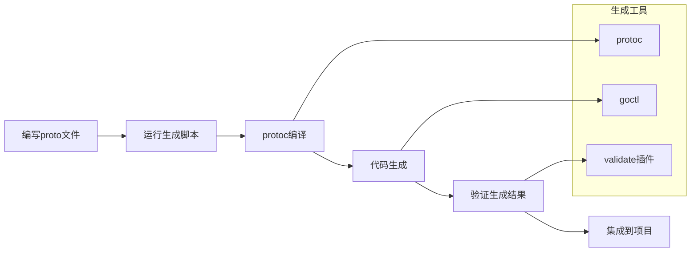

# 协议定义规范

<cite>
**本文档引用的文件**
- [extproto.proto](file://third_party/extproto.proto)
- [dji_error_code.proto](file://third_party/dji_error_code.proto)
- [validate.proto](file://third_party/validate/validate.proto)
- [buf.yaml](file://third_party/buf.yaml)
- [gen.sh](file://third_party/gen.sh)
- [trigger.proto](file://app/trigger/trigger.proto)
- [lalproxy.proto](file://app/lalproxy/lalproxy.proto)
- [podengine.proto](file://app/podengine/podengine.proto)
- [go.mod](file://go.mod)
- [trigger.gen.sh](file://app/trigger/gen.sh)
</cite>

## 目录
1. [简介](#简介)
2. [项目结构](#项目结构)
3. [核心组件](#核心组件)
4. [架构概览](#架构概览)
5. [详细组件分析](#详细组件分析)
6. [依赖关系分析](#依赖关系分析)
7. [性能考虑](#性能考虑)
8. [故障排除指南](#故障排除指南)
9. [结论](#结论)
10. [附录](#附录)

## 简介

zero-service 项目是一个基于 Protocol Buffers 的微服务架构系统，专注于构建统一的协议定义和消息规范。该项目提供了完整的协议定义规范，包括自定义选项、验证规则、注释规范以及生成和集成流程。

本项目的核心价值在于：
- **统一的协议标准**：通过 Protocol Buffers 定义跨语言、跨平台的服务接口
- **强大的验证机制**：集成多种验证规则和自定义约束
- **完善的生成工具链**：自动化代码生成和协议编译流程
- **向后兼容性保障**：严格的版本管理和演进策略

## 项目结构

项目采用模块化的组织方式，主要分为以下几个层次：

**图表来源**
- [extproto.proto:1-75](file://third_party/extproto.proto#L1-L75)
- [trigger.proto:1-106](file://app/trigger/trigger.proto#L1-L106)
- [gen.sh:1-37](file://third_party/gen.sh#L1-L37)

**章节来源**
- [extproto.proto:1-75](file://third_party/extproto.proto#L1-L75)
- [trigger.proto:1-106](file://app/trigger/trigger.proto#L1-L106)
- [gen.sh:1-37](file://third_party/gen.sh#L1-L37)

## 核心组件

### 自定义选项系统

项目实现了丰富的自定义选项系统，主要用于增强 Protocol Buffers 的功能：

#### 扩展选项定义

**图表来源**
- [extproto.proto:11-28](file://third_party/extproto.proto#L11-L28)
- [extproto.proto:38-75](file://third_party/extproto.proto#L38-L75)

#### 错误码管理系统

项目定义了完整的错误码管理体系，采用六位数字格式（ABCDEF）：

- **A**：错误来源（统一为1，表示平台/服务端）
- **BC**：功能模块
- **DEF**：模块内自定义错误

**章节来源**
- [extproto.proto:30-75](file://third_party/extproto.proto#L30-L75)

### 验证规则系统

项目集成了强大的验证规则系统，支持多种数据类型的约束验证：

#### 验证规则类型

**图表来源**
- [validate.proto:36-66](file://third_party/validate/validate.proto#L36-L66)
- [validate.proto:506-621](file://third_party/validate/validate.proto#L506-L621)
- [validate.proto:140-210](file://third_party/validate/validate.proto#L140-L210)

**章节来源**
- [validate.proto:1-800](file://third_party/validate/validate.proto#L1-L800)

### 第三方协议集成

#### 大疆错误码协议

项目集成了大疆上云平台的错误码协议，支持完整的错误码体系：

- **版本管理**：支持版本号跟踪（如 v1.15）
- **模块化设计**：按功能模块划分错误码范围
- **国际化支持**：提供中英文错误描述

**章节来源**
- [dji_error_code.proto:1-513](file://third_party/dji_error_code.proto#L1-L513)

## 架构概览

项目采用分层架构设计，确保协议定义的可维护性和扩展性：

**图表来源**
- [trigger.gen.sh:4-18](file://app/trigger/gen.sh#L4-L18)
- [gen.sh:12-17](file://third_party/gen.sh#L12-L17)

## 详细组件分析

### 触发器服务协议

触发器服务是项目的核心组件之一，提供了完整的任务调度和执行管理功能。

#### 服务接口设计

**图表来源**
- [trigger.proto:13-106](file://app/trigger/trigger.proto#L13-L106)

#### 数据模型设计

触发器服务定义了丰富的数据模型来支持复杂的任务管理需求：

**图表来源**
- [trigger.proto:124-159](file://app/trigger/trigger.proto#L124-L159)
- [trigger.proto:551-586](file://app/trigger/trigger.proto#L551-L586)
- [trigger.proto:857-927](file://app/trigger/trigger.proto#L857-L927)

**章节来源**
- [trigger.proto:1-1181](file://app/trigger/trigger.proto#L1-L1181)

### 流媒体代理协议

流媒体代理协议提供了完整的流媒体处理和监控功能：

#### 会话管理

**图表来源**
- [lalproxy.proto:138-178](file://app/lalproxy/lalproxy.proto#L138-L178)

#### 数据模型设计

流媒体代理协议定义了完整的数据模型来描述各种会话类型：

**章节来源**
- [lalproxy.proto:1-308](file://app/lalproxy/lalproxy.proto#L1-L308)

### 容器引擎协议

容器引擎协议提供了抽象的容器管理接口，支持多种运行时环境：

#### Pod 生命周期管理

**图表来源**
- [podengine.proto:34-41](file://app/podengine/podengine.proto#L34-L41)

#### 容器规格定义

容器引擎协议定义了灵活的容器规格模型：

**章节来源**
- [podengine.proto:1-338](file://app/podengine/podengine.proto#L1-L338)

## 依赖关系分析

项目采用了模块化的依赖管理策略，确保各组件之间的松耦合和高内聚。

**图表来源**
- [go.mod:5-62](file://go.mod#L5-L62)
- [trigger.gen.sh:4-18](file://app/trigger/gen.sh#L4-L18)

**章节来源**
- [go.mod:1-245](file://go.mod#L1-L245)

## 性能考虑

项目在设计时充分考虑了性能优化和资源管理：

### 生成优化策略

1. **增量生成**：只重新生成变更的文件
2. **并行编译**：利用多核处理器加速编译过程
3. **缓存机制**：避免重复的编译和验证步骤

### 运行时优化

1. **内存管理**：合理使用 Protocol Buffers 的内存池
2. **连接复用**：gRPC 连接的持久化和复用
3. **批量处理**：支持批量操作以提高效率

## 故障排除指南

### 常见问题及解决方案

#### 协议生成问题

**问题**：protoc 编译失败
**解决方案**：
1. 检查 proto_path 配置
2. 确认依赖文件存在
3. 验证语法正确性

**章节来源**
- [gen.sh:12-17](file://third_party/gen.sh#L12-L17)

#### 验证规则冲突

**问题**：验证规则相互冲突
**解决方案**：
1. 检查字段约束的合理性
2. 确保验证规则的一致性
3. 参考验证库的文档

#### 版本兼容性问题

**问题**：新版本破坏向后兼容性
**解决方案**：
1. 使用版本控制策略
2. 实施渐进式迁移
3. 提供兼容性检查工具

## 结论

zero-service 项目的协议定义规范体现了现代微服务架构的最佳实践。通过标准化的 Protocol Buffers 定义、完善的验证机制、灵活的生成工具链以及严格的版本管理策略，该项目为构建可靠的分布式系统奠定了坚实的基础。

### 主要优势

1. **标准化程度高**：统一的协议定义和消息规范
2. **可维护性强**：模块化的架构设计和清晰的依赖关系
3. **扩展性良好**：支持多种验证规则和自定义选项
4. **工具链完善**：自动化生成和集成流程

### 未来发展方向

1. **协议演进**：持续优化协议设计和版本管理策略
2. **性能优化**：进一步提升协议处理效率
3. **生态建设**：扩展更多的第三方协议集成
4. **文档完善**：提供更详细的开发和使用指南

## 附录

### 协议生成流程

**图表来源**
- [trigger.gen.sh:4-18](file://app/trigger/gen.sh#L4-L18)
- [gen.sh:12-17](file://third_party/gen.sh#L12-L17)

### 版本管理策略

项目采用语义化版本控制（SemVer）策略：

- **主版本**：重大变更和破坏性修改
- **次版本**：向后兼容的功能新增
- **修订版本**：向后兼容的问题修复

**章节来源**
- [buf.yaml:1-12](file://third_party/buf.yaml#L1-L12)