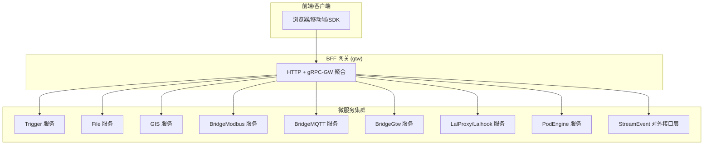
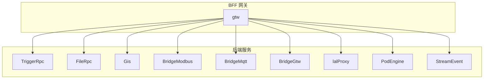
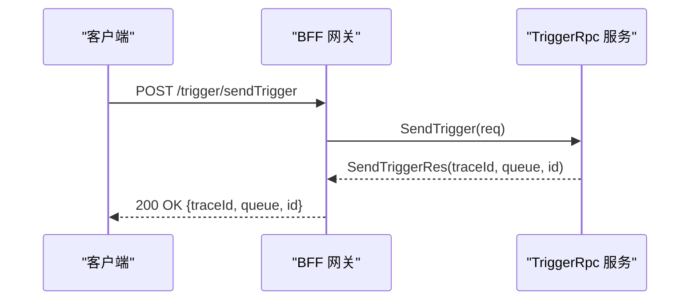
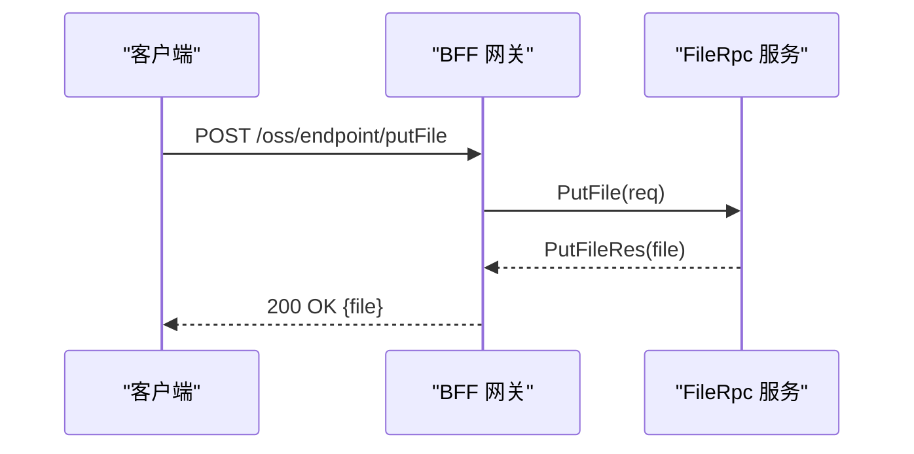
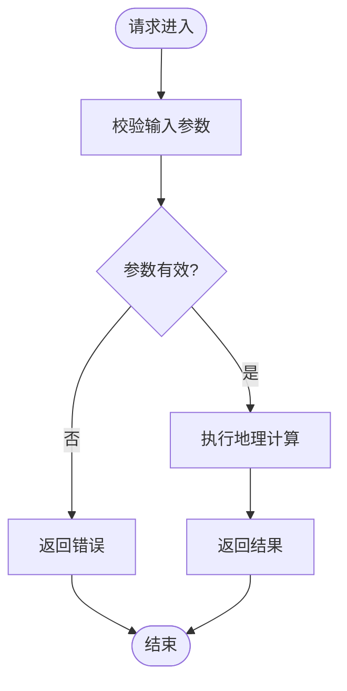
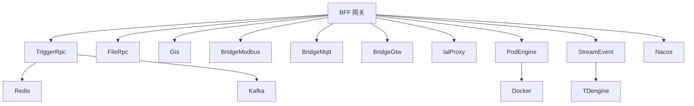

# API参考文档

<cite>
**本文档引用的文件**
- [README.md](file://README.md)
- [gtw.api](file://gtw/gtw.api)
- [trigger.proto](file://app/trigger/trigger.proto)
- [file.proto](file://app/file/file.proto)
- [gis.proto](file://app/gis/gis.proto)
- [bridgemodbus.proto](file://app/bridgemodbus/bridgemodbus.proto)
- [bridgemqtt.proto](file://app/bridgemqtt/bridgemqtt.proto)
- [bridgegtw.api](file://app/bridgegtw/bridgegtw.api)
- [lalproxy.proto](file://app/lalproxy/lalproxy.proto)
- [podengine.proto](file://app/podengine/podengine.proto)
- [trigger.swagger.json](file://swagger/trigger.swagger.json)
- [podengine.swagger.json](file://swagger/podengine.swagger.json)
- [streamevent.swagger.json](file://swagger/streamevent.swagger.json)
- [dji_error_code.proto](file://third_party/dji_error_code.proto)
</cite>

## 目录
1. [简介](#简介)
2. [项目结构](#项目结构)
3. [核心组件](#核心组件)
4. [架构总览](#架构总览)
5. [详细组件分析](#详细组件分析)
6. [依赖分析](#依赖分析)
7. [性能考量](#性能考量)
8. [故障排查指南](#故障排查指南)
9. [结论](#结论)
10. [附录](#附录)

## 简介
本项目基于 go-zero 构建的工业级微服务脚手架，覆盖物联网数采、异步任务调度、实时通信等场景，提供多协议接入（IEC 60870-5-104、Modbus TCP/RTU、MQTT、gRPC、HTTP）与高性能数据处理能力。系统通过 BFF 网关统一入口聚合 gRPC 服务，并提供 grpc-gateway HTTP 访问；对外接口层提供跨语言流数据事件协议。

## 项目结构
- 核心微服务位于 app/ 目录，包含 trigger（异步任务调度）、file（文件服务）、gis（地理信息）、bridgemodbus（Modbus桥接）、bridgemqtt（MQTT桥接）、bridgegtw（HTTP代理网关）、lalhook/lalproxy（流媒体）、logdump（日志导出）、podengine（容器管理）、streamevent（流事件协议）等。
- gtw 为统一 BFF 网关，提供 HTTP/gRPC 聚合、用户认证、文件上传下载、CORS 支持。
- facade/streamevent 提供跨语言流数据事件协议，支持 IEC 104、MQTT、WebSocket、Kafka 等消息接收与推送。
- swagger/ 目录包含部分服务的 Swagger 文档定义。
- third_party/ 包含第三方 proto 定义，如错误码规范等。

图表来源
- [README.md:15-51](file://README.md#L15-L51)
- [gtw.api:16-123](file://gtw/gtw.api#L16-L123)

章节来源
- [README.md:59-108](file://README.md#L59-L108)

## 核心组件
- BFF 网关 (gtw)
  - 提供 HTTP 与 gRPC 聚合入口，支持用户认证、微信支付回调、短信验证码、文件上传/下载、CORS。
  - 关键端点：/ping、/forward、/getCurrentUser、/editCurrentUser、/login、/miniProgramLogin、/sendSMSVerifyCode、/getRegionList、/uploadFile、/downloadFile、/oss/endpoint/* 系列。
- 异步任务调度 (trigger)
  - 基于 asynq 的分布式任务队列，支持 HTTP POST JSON 与 gRPC 两种回调方式，提供队列管理、任务生命周期管理、历史统计、计划任务管理等。
- 文件服务 (file)
  - 提供 OSS 集成（MinIO/阿里OSS/腾讯COS）、分片流上传、视频流捕获、文件信息查询与签名 URL 生成。
- 地理信息 (gis)
  - 提供 H3/GeoHash 编解码、电子围栏生成与检测、坐标系转换、距离计算、路径规划等。
- 协议桥接 (bridgemodbus、bridgemqtt、bridgegtw)
  - Modbus TCP/RTU 读写、设备标识、批量转换；MQTT 发布/带追踪发布；HTTP 代理网关。
- 流媒体 (lalproxy/lalhook)
  - LAL 代理与回调，支持统计查询、拉流控制、会话管理、踢人、RTP 接收端口管理等。
- 容器管理 (podengine)
  - 提供 Pod 生命周期管理（创建/启动/停止/重启/删除/列举）、Pod 统计、镜像列表等。
- 对外接口层 (facade/streamevent)
  - 统一流数据事件协议，支持 IEC 104、MQTT、WebSocket、Kafka 等消息接收与推送。

章节来源
- [README.md:189-206](file://README.md#L189-L206)
- [gtw.api:20-123](file://gtw/gtw.api#L20-L123)

## 架构总览
系统采用“BFF 网关 + 多微服务”的分层架构，BFF 网关负责统一入口与协议转换，后端微服务通过 gRPC 通信，部分服务通过 grpc-gateway 提供 HTTP 访问。对外接口层提供跨语言流数据事件协议，便于多语言系统集成。

图表来源
- [README.md:15-51](file://README.md#L15-L51)
- [trigger.proto:13-106](file://app/trigger/trigger.proto#L13-L106)
- [file.proto:270-287](file://app/file/file.proto#L270-L287)
- [gis.proto:18-50](file://app/gis/gis.proto#L18-L50)
- [bridgemodbus.proto:10-83](file://app/bridgemodbus/bridgemodbus.proto#L10-L83)
- [bridgemqtt.proto:10-16](file://app/bridgemqtt/bridgemqtt.proto#L10-L16)
- [lalproxy.proto:289-308](file://app/lalproxy/lalproxy.proto#L289-L308)
- [podengine.proto:16-26](file://app/podengine/podengine.proto#L16-L26)

## 详细组件分析

### BFF 网关 (gtw) API
- HTTP 端点
  - GET /ping：健康检查
  - POST /forward：请求转发
  - GET /mfs/downloadFile：文件下载
  - POST /login：用户登录
  - POST /miniProgramLogin：小程序登录
  - POST /sendSMSVerifyCode：发送短信验证码
  - GET /getCurrentUser：获取当前用户信息
  - POST /editCurrentUser：编辑当前用户信息
  - POST /getRegionList：获取区域列表
  - POST /mfs/uploadFile：上传文件
  - POST /oss/endpoint/putFile：上传文件
  - POST /oss/endpoint/putChunkFile：上传块文件（双向流）
  - POST /oss/endpoint/putStreamFile：上传流文件（单向流）
  - POST /oss/endpoint/signUrl：生成文件签名URL
  - POST /oss/endpoint/statFile：获取文件信息
  - POST /wechat/paidNotify：微信支付通知
  - POST /wechat/refundedNotify：微信退款通知
- gRPC 端点
  - gtw 服务：上述 HTTP 端点对应的 gRPC 方法（由 grpc-gateway 自动生成）
- 认证与授权
  - JWT 认证：/getCurrentUser、/editCurrentUser 等受保护端点
  - 微信支付回调：/wechat/paidNotify、/wechat/refundedNotify
- 超时与并发
  - 文件服务端点设置了较长超时（如 7200s）

章节来源
- [gtw.api:20-123](file://gtw/gtw.api#L20-L123)

### 异步任务调度 (TriggerRpc) API
- 任务管理
  - SendTrigger：发送 HTTP POST JSON 回调任务
  - SendProtoTrigger：发送 gRPC 协议字节码回调任务
  - GetTaskInfo、RunTask、ArchiveTask、DeleteTask、DeleteAllCompletedTasks、DeleteAllArchivedTasks
  - ListActiveTasks、ListPendingTasks、ListAggregatingTasks、ListScheduledTasks、ListRetryTasks、ListArchivedTasks、ListCompletedTasks
- 队列管理
  - Queues、GetQueueInfo、HistoricalStats
- 计划任务管理
  - CalcPlanTaskDate、CreatePlanTask、PausePlan、TerminatePlan、ResumePlan
  - PausePlanBatch、TerminatePlanBatch、ResumePlanBatch
  - PausePlanExecItem、TerminatePlanExecItem、ResumePlanExecItem、RunPlanExecItem
  - GetPlan、ListPlans、GetPlanBatch、ListPlanBatches、GetPlanExecItem、ListPlanExecItems、GetPlanExecLog、ListPlanExecLogs、GetExecItemDashboard、CallbackPlanExecItem
- 错误处理
  - 使用 google.rpc.Code 错误码标准，HTTP 与 gRPC 错误码映射关系参见错误码规范

图表来源
- [trigger.proto:13-106](file://app/trigger/trigger.proto#L13-L106)
- [trigger.swagger.json:1-50](file://swagger/trigger.swagger.json#L1-L50)

章节来源
- [trigger.proto:13-1181](file://app/trigger/trigger.proto#L13-L1181)
- [trigger.swagger.json:1-50](file://swagger/trigger.swagger.json#L1-L50)

### 文件服务 (FileRpc) API
- 文件上传
  - PutFile：普通文件上传
  - PutChunkFile：分片文件上传（双向流）
  - PutStreamFile：流式文件上传（单向流）
- 文件信息与签名
  - StatFile：获取文件信息
  - SignUrl：生成签名 URL
- 存储管理
  - OssDetail、OssList、CreateOss、UpdateOss、DeleteOss
  - MakeBucket、RemoveBucket
- 文件操作
  - RemoveFile、RemoveFiles
  - CaptureVideoStream：截取视频流图片

图表来源
- [file.proto:270-287](file://app/file/file.proto#L270-L287)
- [gtw.api:101-121](file://gtw/gtw.api#L101-L121)

章节来源
- [file.proto:17-287](file://app/file/file.proto#L17-L287)
- [gtw.api:96-121](file://gtw/gtw.api#L96-L121)

### 地理信息 (Gis) API
- 编解码
  - EncodeGeoHash、DecodeGeoHash
  - EncodeH3、DecodeH3
- 围栏与距离
  - GenerateFenceCells、GenerateFenceH3Cells
  - PointsWithinRadius、PointInFence、PointInFences
  - Distance、BatchDistance、NearbyFences
- 坐标转换与路径规划
  - TransformCoord、BatchTransformCoord
  - RoutePoints

图表来源
- [gis.proto:18-219](file://app/gis/gis.proto#L18-L219)

章节来源
- [gis.proto:9-219](file://app/gis/gis.proto#L9-L219)

### 协议桥接 (BridgeModbus) API
- 配置管理
  - SaveConfig、DeleteConfig、PageListConfig、GetConfigByCode、BatchGetConfigByCode
- 线圈与寄存器读写
  - ReadCoils、ReadDiscreteInputs、WriteSingleCoil、WriteMultipleCoils
  - ReadInputRegisters、ReadHoldingRegisters、WriteSingleRegister、WriteMultipleRegisters
  - WriteSingleRegisterWithDecimal、WriteMultipleRegistersWithDecimal、ReadWriteMultipleRegisters、MaskWriteRegister
  - ReadFIFOQueue
- 设备标识
  - ReadDeviceIdentification、ReadDeviceIdentificationSpecificObject
- 批量十进制转寄存器
  - BatchConvertDecimalToRegister

章节来源
- [bridgemodbus.proto:10-355](file://app/bridgemodbus/bridgemodbus.proto#L10-L355)

### 协议桥接 (BridgeMqtt) API
- Publish：发布消息
- PublishWithTrace：带 traceId 的发布消息（内部服务链路追踪）

章节来源
- [bridgemqtt.proto:10-49](file://app/bridgemqtt/bridgemqtt.proto#L10-L49)

### HTTP 代理网关 (BridgeGtw) API
- /ping：健康检查

章节来源
- [bridgegtw.api:17-21](file://app/bridgegtw/bridgegtw.api#L17-L21)

### 流媒体 (lalProxy) API
- 统计查询
  - GetGroupInfo、GetAllGroups、GetLalInfo
- 控制操作
  - StartRelayPull、StopRelayPull、KickSession
  - StartRtpPub、StopRtpPub、AddIpBlacklist

章节来源
- [lalproxy.proto:138-308](file://app/lalproxy/lalproxy.proto#L138-L308)

### 容器管理 (PodEngine) API
- Pod 生命周期
  - CreatePod、StartPod、StopPod、RestartPod、GetPod、ListPods、DeletePod
- Pod 统计
  - GetPodStats
- 镜像管理
  - ListImages

章节来源
- [podengine.proto:16-338](file://app/podengine/podengine.proto#L16-L338)
- [podengine.swagger.json:1-50](file://swagger/podengine.swagger.json#L1-L50)

### 对外接口层 (StreamEvent) API
- 统一流数据事件协议，支持 IEC 104、MQTT、WebSocket、Kafka 等消息接收与推送

章节来源
- [README.md:197-206](file://README.md#L197-L206)
- [streamevent.swagger.json:1-50](file://swagger/streamevent.swagger.json#L1-L50)

## 依赖分析
- 服务间通信
  - 后端服务之间通过 gRPC 直连；BFF 网关通过 grpc-gateway 提供 HTTP 访问。
- 外部依赖
  - Redis（任务队列与缓存）
  - Kafka（消息队列）
  - TDengine（时序数据库）
  - Docker（容器管理）
  - Nacos（服务注册与发现）
- 错误码规范
  - 项目遵循 google.rpc.Code 错误码标准，HTTP 与 gRPC 错误码映射关系参见错误码规范。

图表来源
- [README.md:211-224](file://README.md#L211-L224)

章节来源
- [README.md:296-299](file://README.md#L296-L299)

## 性能考量
- 任务队列与重试
  - Trigger 服务采用 asynq 分布式任务队列，支持指数退避重试（最高封顶 30 分钟），具备队列统计与历史统计能力。
- 文件上传
  - 提供分片与流式上传，适合大文件与网络不稳定场景；文件服务端点设置较长超时（如 7200s）。
- 流媒体
  - lalProxy 提供统计查询与控制接口，支持拉流控制、会话管理、踢人、RTP 接收端口管理等，便于实时监控与运维。
- 容器管理
  - PodEngine 提供 Pod 生命周期管理与统计，支持资源限制与网络模式配置。

[本节为通用性能讨论，不直接分析具体文件]

## 故障排查指南
- 错误码规范
  - 项目遵循 google.rpc.Code 错误码标准，HTTP 与 gRPC 错误码映射关系参见错误码规范。
- 第三方错误码
  - third_party/dji_error_code.proto 提供大疆上云平台错误码枚举，便于对接相关设备与平台。
- Swagger 文档
  - 部分服务提供 Swagger 文档（如 trigger、podengine、streamevent），可用于接口调试与契约验证。

章节来源
- [README.md:296-299](file://README.md#L296-L299)
- [dji_error_code.proto:1-513](file://third_party/dji_error_code.proto#L1-L513)
- [trigger.swagger.json:1-50](file://swagger/trigger.swagger.json#L1-L50)
- [podengine.swagger.json:1-50](file://swagger/podengine.swagger.json#L1-L50)
- [streamevent.swagger.json:1-50](file://swagger/streamevent.swagger.json#L1-L50)

## 结论
本项目提供了完善的微服务 API 体系，涵盖任务调度、文件服务、地理信息、协议桥接、流媒体、容器管理与对外接口层。通过 BFF 网关统一入口与 grpc-gateway HTTP 访问，结合丰富的 Swagger 文档与错误码规范，能够满足工业级物联网场景下的多协议接入与高性能数据处理需求。

[本节为总结性内容，不直接分析具体文件]

## 附录
- 版本管理与向后兼容
  - 项目未提供明确的 API 版本管理策略与向后兼容保证说明，建议在接口变更时通过语义化版本与文档更新同步推进。
- 安全考虑
  - JWT 认证用于受保护端点；文件签名 URL 支持过期时间控制；容器管理支持资源限制与网络模式配置。
- 速率限制与并发控制
  - 未在现有文档中找到明确的速率限制与并发控制策略，建议在生产环境中结合网关与服务端配置进行限流与熔断。
- 超时设置
  - 文件服务端点设置了较长超时（如 7200s），适用于大文件上传场景。
- 测试与调试
  - 建议使用 Swagger 文档进行接口测试；结合 curl 命令与 SDK 进行集成验证；利用日志与监控工具进行问题定位。

[本节为通用指导内容，不直接分析具体文件]