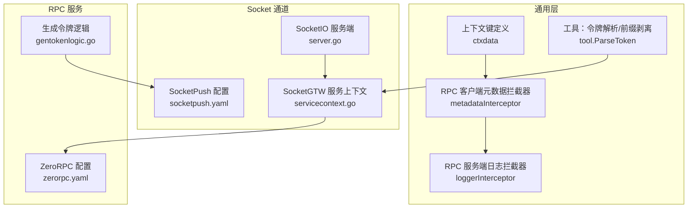
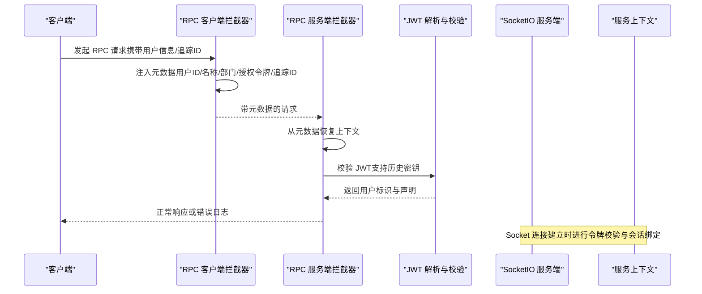
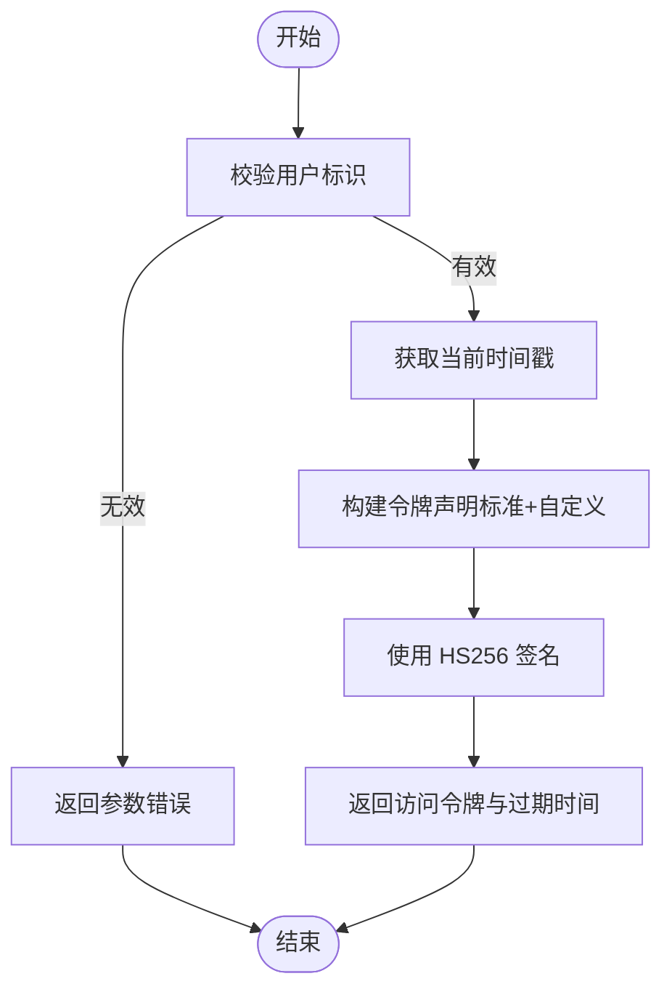
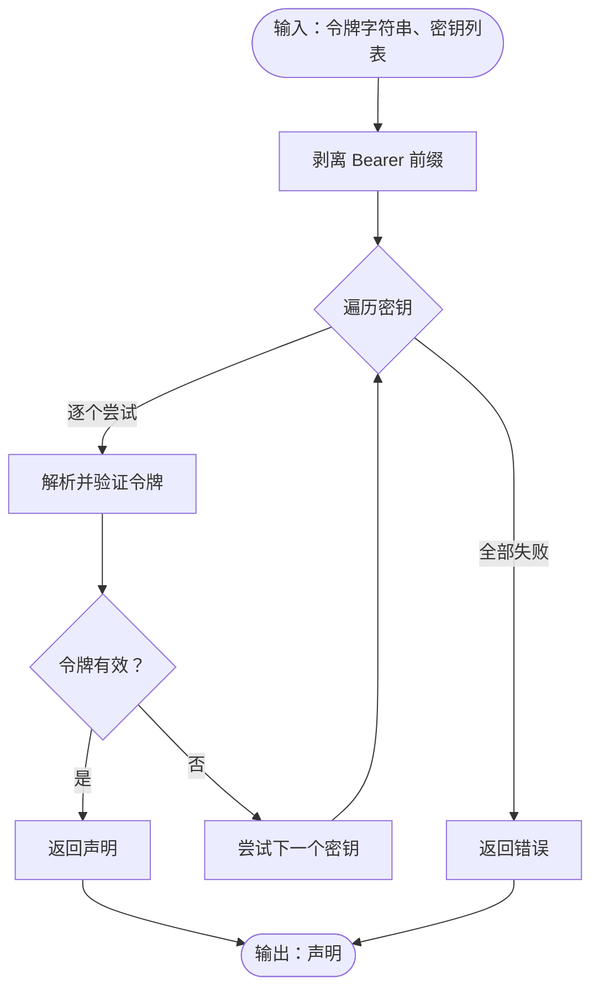
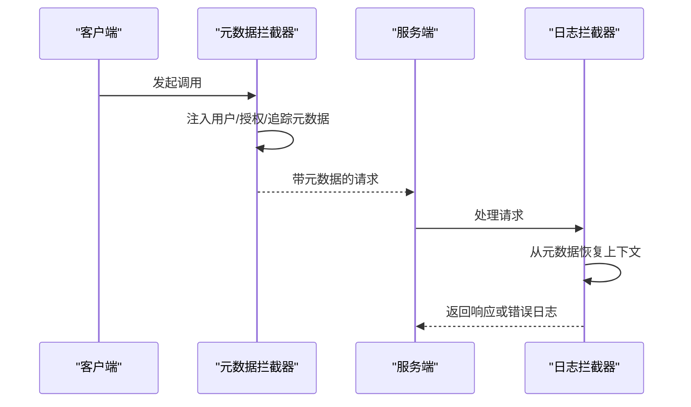
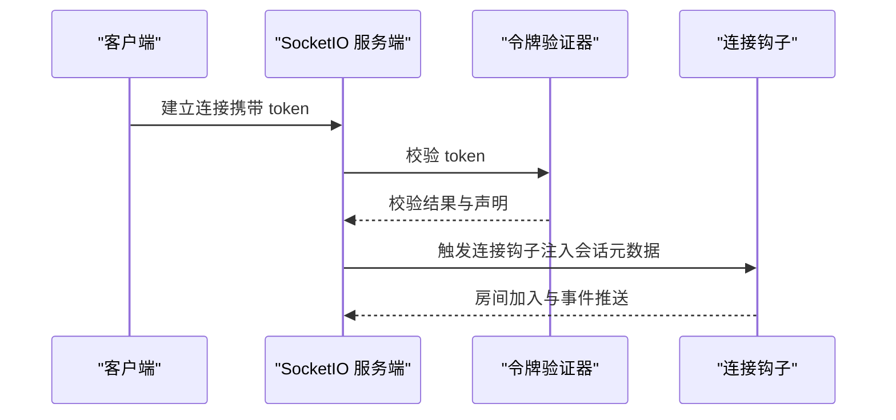
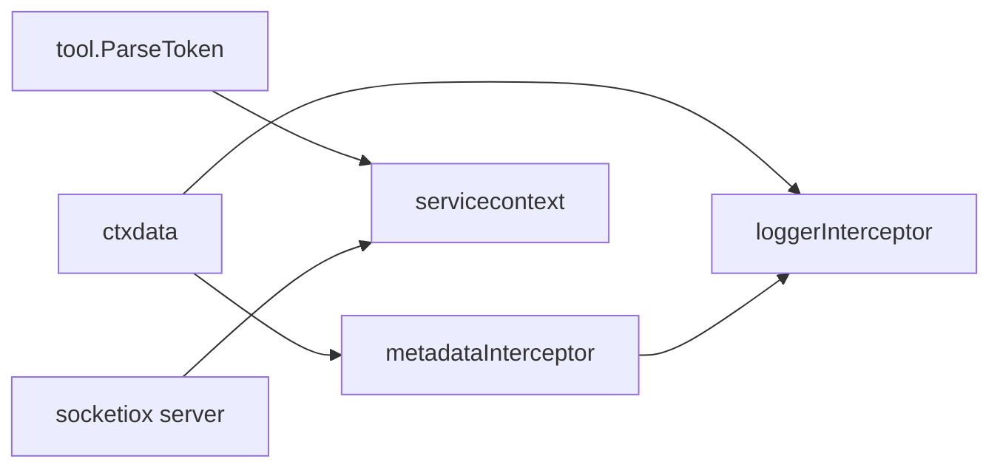

# API认证与授权

<cite>
**本文引用的文件**
- [socketpush 生成令牌逻辑](file://socketapp/socketpush/internal/logic/gentokenlogic.go)
- [通用上下文数据键定义](file://common/ctxdata/ctxData.go)
- [RPC 客户端元数据拦截器](file://common/Interceptor/rpcclient/metadataInterceptor.go)
- [RPC 服务端日志拦截器](file://common/Interceptor/rpcserver/loggerInterceptor.go)
- [SocketIO 服务端认证与会话绑定](file://common/socketiox/server.go)
- [SocketPush 配置（含JWT与Socket网关）](file://socketapp/socketpush/etc/socketpush.yaml)
- [ZeroRPC 配置（含JWT与缓存、数据库、告警）](file://zerorpc/etc/zerorpc.yaml)
- [通用工具：令牌解析与前缀剥离](file://common/tool/tool.go)
- [SocketPush 服务上下文](file://socketapp/socketpush/internal/svc/servicecontext.go)
- [SocketGTW 服务上下文（JWT鉴权与事件推送）](file://socketapp/socketgtw/internal/svc/servicecontext.go)
- [gRPC 拦截器模式参考](file://.trae/skills/zero-skills/references/rpc-patterns.md)
- [REST 中间件模式参考](file://.trae/skills/zero-skills/references/rest-api-patterns.md)
- [安全最佳实践（输入校验、密码处理）](file://.trae/skills/zero-skills/best-practices/overview.md)
- [WebSocket 客户端认证与重连](file://common/wsx/client.go)
</cite>

## 目录
1. [简介](#简介)
2. [项目结构](#项目结构)
3. [核心组件](#核心组件)
4. [架构总览](#架构总览)
5. [详细组件分析](#详细组件分析)
6. [依赖分析](#依赖分析)
7. [性能考虑](#性能考虑)
8. [故障排查指南](#故障排查指南)
9. [结论](#结论)
10. [附录](#附录)

## 简介
本文件系统性梳理 Zero-Service 的 API 认证与授权机制，覆盖以下关键主题：
- 身份认证流程与令牌管理（JWT 生成、验证、刷新）
- 中间件与拦截器的工作原理（请求预处理、日志记录、安全检查）
- 授权策略与访问控制（基于用户标识、租户信息、部门信息）
- API 密钥与签名验证、防重放攻击的实现思路
- 错误处理与安全审计日志

## 项目结构
围绕认证与授权的关键模块分布如下：
- 通用工具与上下文：通用上下文键、令牌解析、元数据拦截器
- Socket 通道与会话：SocketIO 服务端认证、会话绑定与事件推送
- RPC 服务：客户端与服务端拦截器，统一注入与透传用户信息
- 配置：各服务的 JWT 密钥、过期时间、Socket 网关地址等
- 示例与参考：gRPC/REST 模式参考、安全最佳实践

**图表来源**
- [通用上下文数据键定义:1-76](file://common/ctxdata/ctxData.go#L1-L76)
- [通用工具：令牌解析与前缀剥离:1-59](file://common/tool/tool.go#L1-L59)
- [RPC 客户端元数据拦截器:1-55](file://common/Interceptor/rpcclient/metadataInterceptor.go#L1-L55)
- [RPC 服务端日志拦截器:1-45](file://common/Interceptor/rpcserver/loggerInterceptor.go#L1-L45)
- [SocketIO 服务端认证与会话绑定:337-380](file://common/socketiox/server.go#L337-L380)
- [SocketGTW 服务上下文（JWT鉴权与事件推送）:59-102](file://socketapp/socketgtw/internal/svc/servicecontext.go#L59-L102)
- [SocketPush 配置（含JWT与Socket网关）:1-28](file://socketapp/socketpush/etc/socketpush.yaml#L1-L28)
- [ZeroRPC 配置（含JWT与缓存、数据库、告警）:1-39](file://zerorpc/etc/zerorpc.yaml#L1-L39)
- [socketpush 生成令牌逻辑:1-79](file://socketapp/socketpush/internal/logic/gentokenlogic.go#L1-L79)

**章节来源**
- [通用上下文数据键定义:1-76](file://common/ctxdata/ctxData.go#L1-L76)
- [通用工具：令牌解析与前缀剥离:1-59](file://common/tool/tool.go#L1-L59)
- [RPC 客户端元数据拦截器:1-55](file://common/Interceptor/rpcclient/metadataInterceptor.go#L1-L55)
- [RPC 服务端日志拦截器:1-45](file://common/Interceptor/rpcserver/loggerInterceptor.go#L1-L45)
- [SocketIO 服务端认证与会话绑定:337-380](file://common/socketiox/server.go#L337-L380)
- [SocketGTW 服务上下文（JWT鉴权与事件推送）:59-102](file://socketapp/socketgtw/internal/svc/servicecontext.go#L59-L102)
- [SocketPush 配置（含JWT与Socket网关）:1-28](file://socketapp/socketpush/etc/socketpush.yaml#L1-L28)
- [ZeroRPC 配置（含JWT与缓存、数据库、告警）:1-39](file://zerorpc/etc/zerorpc.yaml#L1-L39)
- [socketpush 生成令牌逻辑:1-79](file://socketapp/socketpush/internal/logic/gentokenlogic.go#L1-L79)

## 核心组件
- JWT 令牌生成与刷新
  - 生成逻辑：在 SocketPush 服务中，根据配置的密钥与过期时间生成访问令牌，并返回过期时间与刷新阈值。
  - 刷新策略：当访问令牌接近过期（例如过半时）触发刷新，避免频繁刷新影响性能。
- 令牌解析与多密钥校验
  - 支持当前密钥与历史密钥（PrevAccessSecret）并行校验，实现密钥轮换期间的平滑过渡。
- 元数据拦截器
  - 客户端拦截器：将用户标识、用户名、部门编码、授权令牌、追踪 ID 等注入到 gRPC 元数据中，随请求透传。
  - 服务端拦截器：从元数据恢复到上下文，便于后续逻辑使用；同时统一错误日志输出。
- SocketIO 会话与认证
  - 在 SocketIO 连接建立阶段进行令牌校验，校验通过后将令牌中的声明映射到会话元数据，用于房间加入与事件分发。
- 配置驱动
  - 各服务通过 YAML 配置加载 JWT 密钥、过期时间、Socket 网关地址等，便于环境隔离与动态调整。

**章节来源**
- [socketpush 生成令牌逻辑:29-45](file://socketapp/socketpush/internal/logic/gentokenlogic.go#L29-L45)
- [SocketGTW 服务上下文（JWT鉴权与事件推送）:59-74](file://socketapp/socketgtw/internal/svc/servicecontext.go#L59-L74)
- [RPC 客户端元数据拦截器:11-31](file://common/Interceptor/rpcclient/metadataInterceptor.go#L11-L31)
- [RPC 服务端日志拦截器:12-44](file://common/Interceptor/rpcserver/loggerInterceptor.go#L12-L44)
- [SocketIO 服务端认证与会话绑定:337-380](file://common/socketiox/server.go#L337-L380)
- [SocketPush 配置（含JWT与Socket网关）:10-27](file://socketapp/socketpush/etc/socketpush.yaml#L10-L27)
- [ZeroRPC 配置（含JWT与缓存、数据库、告警）:33-35](file://zerorpc/etc/zerorpc.yaml#L33-L35)

## 架构总览
下图展示从客户端发起请求到服务端完成鉴权与授权的整体流程，涵盖 gRPC 元数据透传、JWT 校验、Socket 会话绑定与事件推送。

**图表来源**
- [RPC 客户端元数据拦截器:11-31](file://common/Interceptor/rpcclient/metadataInterceptor.go#L11-L31)
- [RPC 服务端日志拦截器:12-44](file://common/Interceptor/rpcserver/loggerInterceptor.go#L12-L44)
- [SocketGTW 服务上下文（JWT鉴权与事件推送）:59-74](file://socketapp/socketgtw/internal/svc/servicecontext.go#L59-L74)
- [SocketIO 服务端认证与会话绑定:337-380](file://common/socketiox/server.go#L337-L380)

## 详细组件分析

### 组件一：JWT 令牌生成与刷新
- 生成流程
  - 输入：用户标识、负载（自定义字段）、密钥、过期时间
  - 输出：访问令牌、过期时间、刷新阈值（通常为过半时）
- 令牌结构
  - 包含标准声明（签发时间、过期时间、用户标识）与自定义负载
  - 自定义字段过滤：忽略标准 JWT 字段名，仅保留业务所需字段
- 刷新策略
  - 当访问令牌接近过期（例如 RefreshAfter）时触发刷新，减少频繁刷新带来的开销

**图表来源**
- [socketpush 生成令牌逻辑:29-45](file://socketapp/socketpush/internal/logic/gentokenlogic.go#L29-L45)
- [socketpush 生成令牌逻辑:57-78](file://socketapp/socketpush/internal/logic/gentokenlogic.go#L57-L78)

**章节来源**
- [socketpush 生成令牌逻辑:29-45](file://socketapp/socketpush/internal/logic/gentokenlogic.go#L29-L45)
- [socketpush 生成令牌逻辑:57-78](file://socketapp/socketpush/internal/logic/gentokenlogic.go#L57-L78)

### 组件二：令牌解析与多密钥校验
- 支持多密钥校验：当前密钥与历史密钥（PrevAccessSecret）并行尝试
- 前缀剥离：自动识别并剥离 Bearer 前缀，兼容多种调用方式
- 返回内容：令牌声明（MapClaims），供后续授权使用

**图表来源**
- [通用工具：令牌解析与前缀剥离:27-59](file://common/tool/tool.go#L27-L59)
- [SocketGTW 服务上下文（JWT鉴权与事件推送）:59-74](file://socketapp/socketgtw/internal/svc/servicecontext.go#L59-L74)

**章节来源**
- [通用工具：令牌解析与前缀剥离:27-59](file://common/tool/tool.go#L27-L59)
- [SocketGTW 服务上下文（JWT鉴权与事件推送）:59-74](file://socketapp/socketgtw/internal/svc/servicecontext.go#L59-L74)

### 组件三：gRPC 元数据拦截器（客户端与服务端）
- 客户端拦截器
  - 将用户标识、用户名、部门编码、授权令牌、追踪 ID 注入到出站元数据
  - 保证跨服务调用时上下文一致
- 服务端拦截器
  - 从入站元数据恢复到上下文，便于后续逻辑读取
  - 统一错误日志输出，便于问题定位

**图表来源**
- [RPC 客户端元数据拦截器:11-31](file://common/Interceptor/rpcclient/metadataInterceptor.go#L11-L31)
- [RPC 服务端日志拦截器:12-44](file://common/Interceptor/rpcserver/loggerInterceptor.go#L12-L44)

**章节来源**
- [RPC 客户端元数据拦截器:11-31](file://common/Interceptor/rpcclient/metadataInterceptor.go#L11-L31)
- [RPC 服务端日志拦截器:12-44](file://common/Interceptor/rpcserver/loggerInterceptor.go#L12-L44)

### 组件四：SocketIO 会话与认证
- 连接阶段认证
  - 从握手参数或回调中提取令牌，调用验证器进行校验
  - 校验通过后，将令牌声明映射到会话元数据，用于房间加入与事件分发
- 日志与审计
  - 记录连接与认证事件，便于审计与排障

**图表来源**
- [SocketIO 服务端认证与会话绑定:337-380](file://common/socketiox/server.go#L337-L380)

**章节来源**
- [SocketIO 服务端认证与会话绑定:337-380](file://common/socketiox/server.go#L337-L380)

### 组件五：授权策略与访问控制
- 授权依据
  - 用户标识（user-id）、用户名、部门编码、授权令牌、追踪 ID 等上下文信息
  - Socket 会话中的元数据可用于房间级权限控制
- 授权落地
  - 在服务端拦截器或业务逻辑中读取上下文，结合业务规则进行授权判断
  - 对于 Socket 事件，可基于会话元数据决定事件分发范围

**章节来源**
- [通用上下文数据键定义:9-24](file://common/ctxdata/ctxData.go#L9-L24)
- [RPC 服务端日志拦截器:12-28](file://common/Interceptor/rpcserver/loggerInterceptor.go#L12-L28)
- [SocketIO 服务端认证与会话绑定:359-372](file://common/socketiox/server.go#L359-L372)

### 组件六：API 密钥管理、签名验证与防重放
- 密钥管理
  - 使用配置文件集中管理密钥与过期时间，支持历史密钥并行校验以实现平滑轮换
- 签名验证
  - 建议在 REST 或 WebSocket 层引入签名机制（如 HMAC-SHA256），对请求体与时间戳进行签名，服务端复核签名与时间戳
- 防重放
  - 引入一次性随机数（nonce）与时间窗口（TTL），服务端维护近期 nonce 集合，拒绝重复请求

**章节来源**
- [SocketPush 配置（含JWT与Socket网关）:10-13](file://socketapp/socketpush/etc/socketpush.yaml#L10-L13)
- [ZeroRPC 配置（含JWT与缓存、数据库、告警）:33-35](file://zerorpc/etc/zerorpc.yaml#L33-L35)

### 组件七：认证失败的错误处理与安全审计
- gRPC 错误码映射
  - 使用标准 gRPC 状态码区分未认证、权限不足、资源耗尽等场景
- 客户端认证失败处理
  - WebSocket 客户端在认证失败时触发状态变更与连接关闭，并支持重连策略
- 安全审计
  - 服务端拦截器统一记录错误日志，包含请求路径、错误详情与追踪 ID，便于审计与溯源

**章节来源**
- [gRPC 拦截器模式参考:313-368](file://.trae/skills/zero-skills/references/rpc-patterns.md#L313-L368)
- [WebSocket 客户端认证与重连:538-596](file://common/wsx/client.go#L538-L596)
- [RPC 服务端日志拦截器:40-43](file://common/Interceptor/rpcserver/loggerInterceptor.go#L40-L43)

## 依赖分析
- 组件耦合
  - 通用上下文键与工具被拦截器与服务上下文广泛依赖，形成横切关注点
  - SocketIO 服务端与服务上下文存在直接交互，用于会话绑定与事件推送
- 外部依赖
  - JWT 解析库、gRPC 元数据、OpenTelemetry HeaderCarrier 等
- 潜在循环依赖
  - 当前结构以工具与拦截器为中心向外辐射，未见明显循环依赖

**图表来源**
- [通用上下文数据键定义:1-76](file://common/ctxdata/ctxData.go#L1-L76)
- [通用工具：令牌解析与前缀剥离:1-59](file://common/tool/tool.go#L1-L59)
- [RPC 客户端元数据拦截器:1-55](file://common/Interceptor/rpcclient/metadataInterceptor.go#L1-L55)
- [RPC 服务端日志拦截器:1-45](file://common/Interceptor/rpcserver/loggerInterceptor.go#L1-L45)
- [SocketIO 服务端认证与会话绑定:337-380](file://common/socketiox/server.go#L337-L380)
- [SocketGTW 服务上下文（JWT鉴权与事件推送）:59-102](file://socketapp/socketgtw/internal/svc/servicecontext.go#L59-L102)

**章节来源**
- [通用上下文数据键定义:1-76](file://common/ctxdata/ctxData.go#L1-L76)
- [通用工具：令牌解析与前缀剥离:1-59](file://common/tool/tool.go#L1-L59)
- [RPC 客户端元数据拦截器:1-55](file://common/Interceptor/rpcclient/metadataInterceptor.go#L1-L55)
- [RPC 服务端日志拦截器:1-45](file://common/Interceptor/rpcserver/loggerInterceptor.go#L1-L45)
- [SocketIO 服务端认证与会话绑定:337-380](file://common/socketiox/server.go#L337-L380)
- [SocketGTW 服务上下文（JWT鉴权与事件推送）:59-102](file://socketapp/socketgtw/internal/svc/servicecontext.go#L59-L102)

## 性能考虑
- 令牌生成
  - HS256 签名开销低，适合高并发场景；建议合理设置过期时间，避免频繁刷新
- 多密钥校验
  - 并行尝试历史密钥会增加一次解析成本，建议在密钥轮换窗口内启用历史密钥，结束后及时清理
- 元数据透传
  - 元数据大小应控制在合理范围内，避免影响网络传输与序列化性能
- Socket 会话
  - 会话元数据映射与房间加入应尽量轻量，避免阻塞连接建立流程

## 故障排查指南
- 令牌无效
  - 检查令牌是否包含 Bearer 前缀，确认密钥是否正确且未过期
  - 若处于密钥轮换期，确认历史密钥是否配置
- gRPC 未认证
  - 确认客户端拦截器是否成功注入用户标识与授权令牌
  - 检查服务端拦截器是否正确从元数据恢复上下文
- Socket 连接失败
  - 查看 SocketIO 服务端日志，确认令牌校验与会话绑定是否成功
- 安全审计
  - 关注服务端拦截器输出的错误日志，结合追踪 ID 进行问题定位

**章节来源**
- [通用工具：令牌解析与前缀剥离:27-59](file://common/tool/tool.go#L27-L59)
- [RPC 客户端元数据拦截器:11-31](file://common/Interceptor/rpcclient/metadataInterceptor.go#L11-L31)
- [RPC 服务端日志拦截器:40-43](file://common/Interceptor/rpcserver/loggerInterceptor.go#L40-L43)
- [SocketIO 服务端认证与会话绑定:337-380](file://common/socketiox/server.go#L337-L380)

## 结论
本方案通过“配置驱动的 JWT + 横切拦截器 + 会话绑定”的组合，实现了统一的身份认证与授权能力。配合多密钥校验与历史密钥支持，满足密钥轮换需求；通过元数据拦截器与上下文键，确保跨服务调用的一致性与可观测性；SocketIO 会话绑定进一步完善了实时通道的认证与授权闭环。建议在 REST/WebSocket 层补充签名与防重放机制，以进一步提升整体安全性。

## 附录
- 最佳实践参考
  - 输入校验与密码处理：参见安全最佳实践文档
- 模式参考
  - gRPC 拦截器与 REST 中间件模式：参见技能库参考文档

**章节来源**
- [安全最佳实践（输入校验、密码处理）:546-608](file://.trae/skills/zero-skills/best-practices/overview.md#L546-L608)
- [gRPC 拦截器模式参考:370-415](file://.trae/skills/zero-skills/references/rpc-patterns.md#L370-L415)
- [REST 中间件模式参考:197-262](file://.trae/skills/zero-skills/references/rest-api-patterns.md#L197-L262)