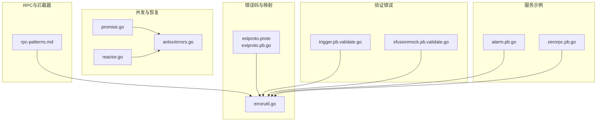
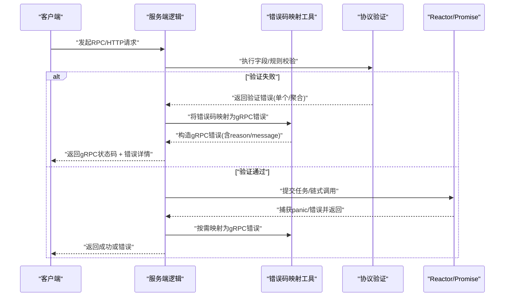
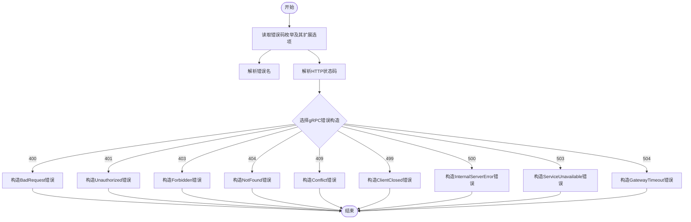
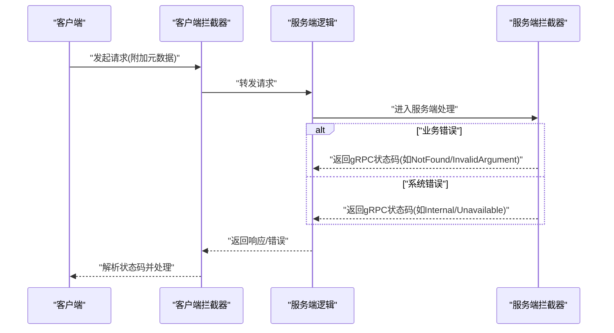
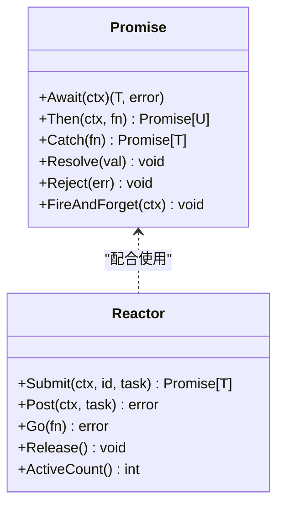
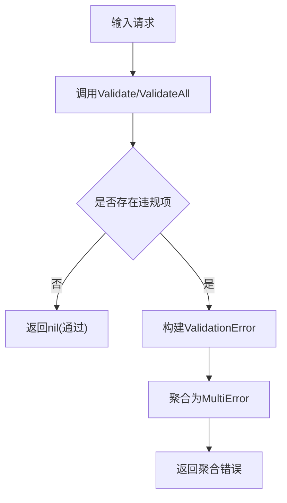
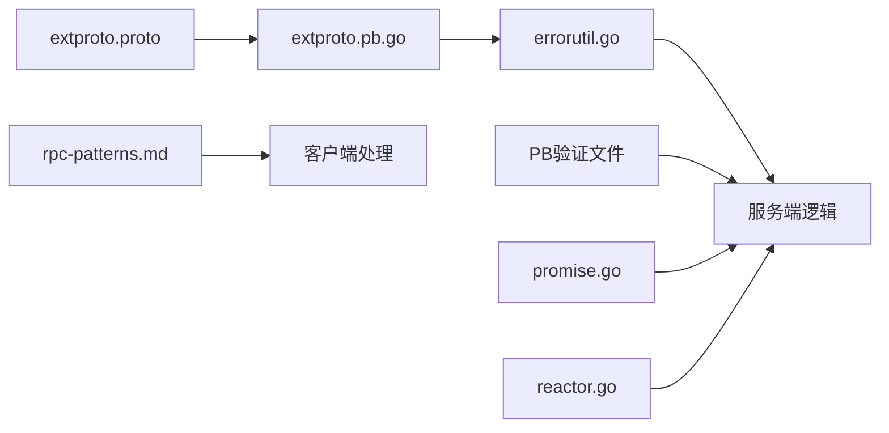

# API错误处理

<cite>
**本文引用的文件**
- [common/tool/errorutil.go](file://common/tool/errorutil.go)
- [third_party/extproto.proto](file://third_party/extproto.proto)
- [third_party/extproto/extproto.pb.go](file://third_party/extproto/extproto.pb.go)
- [.trae/skills/zero-skills/references/rpc-patterns.md](file://.trae/skills/zero-skills/references/rpc-patterns.md)
- [common/antsx/promise.go](file://common/antsx/promise.go)
- [common/antsx/reactor.go](file://common/antsx/reactor.go)
- [common/antsx/errors.go](file://common/antsx/errors.go)
- [common/iec104/client/errors.go](file://common/iec104/client/errors.go)
- [app/trigger/trigger/trigger.pb.validate.go](file://app/trigger/trigger/trigger.pb.validate.go)
- [app/xfusionmock/xfusionmock/xfusionmock.pb.validate.go](file://app/xfusionmock/xfusionmock/xfusionmock.pb.validate.go)
- [app/alarm/alarm/alarm.pb.go](file://app/alarm/alarm/alarm.pb.go)
- [zerorpc/zerorpc/zerorpc.pb.go](file://zerorpc/zerorpc/zerorpc.pb.go)
</cite>

## 目录
1. [简介](#简介)
2. [项目结构](#项目结构)
3. [核心组件](#核心组件)
4. [架构总览](#架构总览)
5. [详细组件分析](#详细组件分析)
6. [依赖分析](#依赖分析)
7. [性能考虑](#性能考虑)
8. [故障排查指南](#故障排查指南)
9. [结论](#结论)
10. [附录](#附录)

## 简介
本文件面向Zero-Service的API与RPC错误处理机制，提供系统化的参考文档。内容覆盖错误码定义、错误消息格式、gRPC与HTTP状态码映射、异常捕获与恢复策略、错误传播与拦截器实践、以及验证错误的聚合与诊断方法。目标是帮助开发者在不同服务中统一错误语义、快速定位问题并建立一致的可观测性与告警体系。

## 项目结构
围绕错误处理的关键模块与文件分布如下：
- 错误码与HTTP映射：third_party/extproto.* 定义统一错误码枚举及扩展选项；common/tool/errorutil.go 将错误码映射为gRPC/HTTP错误。
- gRPC错误模式与拦截器：.trae/skills/zero-skills/references/rpc-patterns.md 提供标准错误处理与拦截器实践。
- 响应式与并发错误恢复：common/antsx/* 提供Promise/Reactor模式下的错误捕获与恢复。
- 协议验证错误：app/*/...pb.validate.go 自动生成的验证错误类型与聚合错误。
- 服务侧错误示例：app/alarm/...、zerorpc/...等服务中的错误返回与处理。

图表来源
- [third_party/extproto.proto:47-75](file://third_party/extproto.proto#L47-L75)
- [third_party/extproto/extproto.pb.go:34-64](file://third_party/extproto/extproto.pb.go#L34-L64)
- [common/tool/errorutil.go:12-59](file://common/tool/errorutil.go#L12-L59)
- [.trae/skills/zero-skills/references/rpc-patterns.md:276-368](file://.trae/skills/zero-skills/references/rpc-patterns.md#L276-L368)
- [common/antsx/promise.go:66-92](file://common/antsx/promise.go#L66-L92)
- [common/antsx/reactor.go:32-61](file://common/antsx/reactor.go#L32-L61)
- [common/antsx/errors.go:5-9](file://common/antsx/errors.go#L5-L9)
- [app/trigger/trigger/trigger.pb.validate.go:2906-2942](file://app/trigger/trigger/trigger.pb.validate.go#L2906-L2942)
- [app/xfusionmock/xfusionmock/xfusionmock.pb.validate.go:177-215](file://app/xfusionmock/xfusionmock/xfusionmock.pb.validate.go#L177-L215)
- [app/alarm/alarm/alarm.pb.go:207-264](file://app/alarm/alarm/alarm.pb.go#L207-L264)
- [zerorpc/zerorpc/zerorpc.pb.go](file://zerorpc/zerorpc/zerorpc.pb.go)

章节来源
- [third_party/extproto.proto:47-75](file://third_party/extproto.proto#L47-L75)
- [third_party/extproto/extproto.pb.go:34-64](file://third_party/extproto/extproto.pb.go#L34-L64)
- [common/tool/errorutil.go:12-59](file://common/tool/errorutil.go#L12-L59)
- [.trae/skills/zero-skills/references/rpc-patterns.md:276-368](file://.trae/skills/zero-skills/references/rpc-patterns.md#L276-L368)

## 核心组件
- 统一错误码与HTTP映射
  - 错误码枚举由third_party/extproto.proto定义，通过扩展选项提供名称与HTTP状态码映射；生成的extproto.pb.go提供常量值。
  - 工具函数将错误码解析为错误名与HTTP状态码，并构造gRPC错误（如BadRequest、Unauthorized、Forbidden、NotFound、Conflict、ClientClosed、InternalServerError、ServiceUnavailable、GatewayTimeout），便于在RPC层统一返回。
- gRPC错误模式与客户端处理
  - 使用标准gRPC状态码表达业务与系统错误；客户端通过status.FromError提取状态码进行分支处理。
- 并发与异步错误恢复
  - Promise/Reactor在链式调用与任务执行中捕获panic并转换为错误，确保错误可传播且可恢复。
- 协议验证错误
  - 自动生成的Validate/ValidateAll返回单个或聚合验证错误，便于批量校验与错误收集。
- 服务侧错误示例
  - 各服务在逻辑层根据业务条件返回相应gRPC错误；部分服务在响应消息体中携带错误字符串字段用于补充说明。

章节来源
- [third_party/extproto.proto:47-75](file://third_party/extproto.proto#L47-L75)
- [third_party/extproto/extproto.pb.go:34-64](file://third_party/extproto/extproto.pb.go#L34-L64)
- [common/tool/errorutil.go:12-59](file://common/tool/errorutil.go#L12-L59)
- [.trae/skills/zero-skills/references/rpc-patterns.md:313-368](file://.trae/skills/zero-skills/references/rpc-patterns.md#L313-L368)
- [common/antsx/promise.go:66-92](file://common/antsx/promise.go#L66-L92)
- [common/antsx/reactor.go:32-61](file://common/antsx/reactor.go#L32-L61)
- [app/trigger/trigger/trigger.pb.validate.go:2906-2942](file://app/trigger/trigger/trigger.pb.validate.go#L2906-L2942)
- [app/xfusionmock/xfusionmock/xfusionmock.pb.validate.go:177-215](file://app/xfusionmock/xfusionmock/xfusionmock.pb.validate.go#L177-L215)
- [app/alarm/alarm/alarm.pb.go:207-264](file://app/alarm/alarm/alarm.pb.go#L207-L264)

## 架构总览
下图展示从“请求进入”到“错误返回”的端到端流程，涵盖错误码解析、gRPC状态码映射、客户端状态码分支处理、并发错误恢复与验证错误聚合。

图表来源
- [common/tool/errorutil.go:12-59](file://common/tool/errorutil.go#L12-L59)
- [app/trigger/trigger/trigger.pb.validate.go:2906-2942](file://app/trigger/trigger/trigger.pb.validate.go#L2906-L2942)
- [app/xfusionmock/xfusionmock/xfusionmock.pb.validate.go:177-215](file://app/xfusionmock/xfusionmock/xfusionmock.pb.validate.go#L177-L215)
- [common/antsx/promise.go:66-92](file://common/antsx/promise.go#L66-L92)
- [common/antsx/reactor.go:32-61](file://common/antsx/reactor.go#L32-L61)

## 详细组件分析

### 组件A：统一错误码与HTTP映射
- 错误码定义
  - 在extproto.proto中以枚举形式定义错误码分组（通用系统、参数/校验、数据/中间件、权限/认证、业务通用、外部依赖等），并通过扩展选项提供错误名与HTTP状态码。
  - 生成的extproto.pb.go提供各枚举常量值，供程序直接使用。
- 映射与构造
  - errorutil.go读取枚举的扩展选项，解析错误名与HTTP状态码；根据HTTP状态码选择对应的gRPC错误构造函数，同时设置reason与message。
  - 提供IsErrorByPbCode用于判断错误是否匹配特定错误码（基于reason）。
- 使用建议
  - 所有业务错误与系统错误均应映射到统一错误码，避免散落的字符串错误；客户端据此进行分支处理。

图表来源
- [third_party/extproto.proto:47-75](file://third_party/extproto.proto#L47-L75)
- [third_party/extproto/extproto.pb.go:34-64](file://third_party/extproto/extproto.pb.go#L34-L64)
- [common/tool/errorutil.go:12-59](file://common/tool/errorutil.go#L12-L59)

章节来源
- [third_party/extproto.proto:47-75](file://third_party/extproto.proto#L47-L75)
- [third_party/extproto/extproto.pb.go:34-64](file://third_party/extproto/extproto.pb.go#L34-L64)
- [common/tool/errorutil.go:12-59](file://common/tool/errorutil.go#L12-L59)

### 组件B：gRPC错误模式与客户端处理
- 服务端
  - 使用标准gRPC状态码表达错误（如InvalidArgument、NotFound、Internal、Unavailable等）；对业务错误与系统错误进行区分。
- 客户端
  - 通过status.FromError提取状态码，针对不同状态码进行分支处理（如NotFound、InvalidArgument、Unavailable等），并返回统一的业务错误或重试提示。
- 拦截器
  - 可在服务端/客户端添加拦截器，统一注入元数据、鉴权、日志与错误透传。

图表来源
- [.trae/skills/zero-skills/references/rpc-patterns.md:276-368](file://.trae/skills/zero-skills/references/rpc-patterns.md#L276-L368)
- [.trae/skills/zero-skills/references/rpc-patterns.md:370-445](file://.trae/skills/zero-skills/references/rpc-patterns.md#L370-L445)

章节来源
- [.trae/skills/zero-skills/references/rpc-patterns.md:276-368](file://.trae/skills/zero-skills/references/rpc-patterns.md#L276-L368)
- [.trae/skills/zero-skills/references/rpc-patterns.md:370-445](file://.trae/skills/zero-skills/references/rpc-patterns.md#L370-L445)

### 组件C：并发与异步错误恢复（Promise/Reactor）
- Promise
  - Then链式调用中捕获panic并转换为错误；Resolve/Reject保证只触发一次，Await支持上下文取消。
- Reactor
  - Submit任务时注册去重ID，防止重复提交；任务panic被捕获并转为错误；Post/FireAndForget提供无阻塞执行路径。
- 错误传播
  - Promise链路中的错误会冒泡至下游；Reactor释放时清理注册表，避免悬挂任务。

图表来源
- [common/antsx/promise.go:16-139](file://common/antsx/promise.go#L16-L139)
- [common/antsx/reactor.go:14-92](file://common/antsx/reactor.go#L14-L92)

章节来源
- [common/antsx/promise.go:66-92](file://common/antsx/promise.go#L66-L92)
- [common/antsx/reactor.go:32-61](file://common/antsx/reactor.go#L32-L61)
- [common/antsx/errors.go:5-9](file://common/antsx/errors.go#L5-L9)

### 组件D：协议验证错误与聚合
- 单个验证错误
  - 自动生成的ValidationError包含field、reason、cause、key等字段，ErrorName提供错误类型标识。
- 聚合验证错误
  - MultiError将多个ValidationError拼接为单一错误，AllErrors返回原始列表，便于批量上报。
- 使用建议
  - 在服务端对请求体执行Validate/ValidateAll，将聚合错误直接返回给客户端，提升调试效率。

图表来源
- [app/trigger/trigger/trigger.pb.validate.go:2906-2942](file://app/trigger/trigger/trigger.pb.validate.go#L2906-L2942)
- [app/trigger/trigger/trigger.pb.validate.go:177-191](file://app/trigger/trigger/trigger.pb.validate.go#L177-L191)
- [app/xfusionmock/xfusionmock/xfusionmock.pb.validate.go:177-215](file://app/xfusionmock/xfusionmock/xfusionmock.pb.validate.go#L177-L215)

章节来源
- [app/trigger/trigger/trigger.pb.validate.go:2906-2942](file://app/trigger/trigger/trigger.pb.validate.go#L2906-L2942)
- [app/xfusionmock/xfusionmock/xfusionmock.pb.validate.go:177-215](file://app/xfusionmock/xfusionmock/xfusionmock.pb.validate.go#L177-L215)

### 组件E：服务侧错误示例与响应结构
- 响应结构
  - 某些服务在响应消息体中提供错误字符串字段，用于承载额外的错误说明；其余服务主要通过gRPC状态码表达错误。
- 示例
  - alarm服务的请求消息包含错误字段；zerorpc服务的PB定义位于zerorpc.pb.go，可用于错误返回的约定。

章节来源
- [app/alarm/alarm/alarm.pb.go:207-264](file://app/alarm/alarm/alarm.pb.go#L207-L264)
- [zerorpc/zerorpc/zerorpc.pb.go](file://zerorpc/zerorpc/zerorpc.pb.go)

## 依赖分析
- 错误码到HTTP/gRPC映射
  - extproto.proto定义错误码与扩展选项；extproto.pb.go提供常量；errorutil.go读取并构造gRPC错误。
- 验证错误
  - 各服务的PB验证文件生成ValidationError/MultiError类型，被服务逻辑直接使用。
- 并发与恢复
  - antsx的Promise/Reactor与错误工具协同工作，确保异步任务的错误可捕获与传播。
- 客户端处理
  - rpc-patterns.md提供客户端状态码分支处理模板，指导如何根据状态码进行差异化处理。

图表来源
- [third_party/extproto.proto:47-75](file://third_party/extproto.proto#L47-L75)
- [third_party/extproto/extproto.pb.go:34-64](file://third_party/extproto/extproto.pb.go#L34-L64)
- [common/tool/errorutil.go:12-59](file://common/tool/errorutil.go#L12-L59)
- [common/antsx/promise.go:66-92](file://common/antsx/promise.go#L66-L92)
- [common/antsx/reactor.go:32-61](file://common/antsx/reactor.go#L32-L61)
- [.trae/skills/zero-skills/references/rpc-patterns.md:344-368](file://.trae/skills/zero-skills/references/rpc-patterns.md#L344-L368)

章节来源
- [third_party/extproto.proto:47-75](file://third_party/extproto.proto#L47-L75)
- [third_party/extproto/extproto.pb.go:34-64](file://third_party/extproto/extproto.pb.go#L34-L64)
- [common/tool/errorutil.go:12-59](file://common/tool/errorutil.go#L12-L59)
- [.trae/skills/zero-skills/references/rpc-patterns.md:344-368](file://.trae/skills/zero-skills/references/rpc-patterns.md#L344-L368)

## 性能考虑
- 错误码解析
  - 错误码解析仅在构造错误时发生，开销极低；建议在高频路径中复用错误常量，减少反射查找。
- gRPC错误构造
  - 选择合适的HTTP状态码映射，避免不必要的重试与退避；对临时性错误（如Unavailable）启用指数退避。
- 并发错误恢复
  - Promise/Reactor内部使用通道与互斥锁，注意避免过度并发导致上下文切换开销；合理设置Reactor容量。
- 验证错误
  - ValidateAll会聚合所有违规项，建议在边界处限制最大错误数量，避免超大错误字符串影响网络传输。

## 故障排查指南
- 常见错误场景
  - 参数错误：检查extproto中的参数类错误码（如缺少参数、参数非法）；确认客户端是否正确传递参数。
  - 记录不存在/已存在：检查数据一致性与幂等性；关注404/409映射。
  - 权限/认证错误：确认拦截器是否正确注入与校验令牌；关注401/403映射。
  - 系统错误：检查服务可用性、资源限制与超时设置；关注500/503/504映射。
  - 并发错误：排查panic来源，确认Promise/Reactor任务是否正确捕获与上报。
  - 验证错误：使用AllErrors获取完整列表，结合Field/Reason/Cause定位具体字段与原因。
- 诊断步骤
  - 客户端：解析gRPC状态码，打印reason与message；记录请求ID与时间戳。
  - 服务端：记录上下文信息、错误栈与耗时；对验证错误输出聚合详情。
  - 日志与监控：将错误码与HTTP状态码纳入指标采集，设置阈值告警。
- 参考实现
  - 客户端状态码分支处理模板与拦截器示例可作为排查与修复的依据。

章节来源
- [.trae/skills/zero-skills/references/rpc-patterns.md:313-368](file://.trae/skills/zero-skills/references/rpc-patterns.md#L313-L368)
- [common/tool/errorutil.go:83-90](file://common/tool/errorutil.go#L83-L90)
- [common/antsx/promise.go:66-92](file://common/antsx/promise.go#L66-L92)
- [common/antsx/reactor.go:32-61](file://common/antsx/reactor.go#L32-L61)
- [app/trigger/trigger/trigger.pb.validate.go:2906-2942](file://app/trigger/trigger/trigger.pb.validate.go#L2906-L2942)

## 结论
通过统一错误码与HTTP/gRPC映射、规范的gRPC错误模式、并发错误恢复机制与协议验证错误聚合，Zero-Service实现了跨服务的一致错误语义与可观测性。建议在新服务中遵循本文档的模式，确保错误处理的可维护性与可诊断性。

## 附录
- 错误码分组与含义
  - 通用系统错误（未知、内部错误、超时）
  - 参数/校验错误（参数错误、缺少参数、参数不合法）
  - 数据/中间件错误（数据库错误、记录不存在、记录已存在、数据冲突、缓存错误、缓存未命中、消息队列错误）
  - 权限/认证错误（未认证、无权限访问）
  - 业务通用错误（业务处理失败、业务状态不允许、重复操作）
  - 外部依赖错误（远程调用失败、第三方服务异常）

章节来源
- [third_party/extproto.proto:47-75](file://third_party/extproto.proto#L47-L75)
- [third_party/extproto/extproto.pb.go:34-64](file://third_party/extproto/extproto.pb.go#L34-L64)