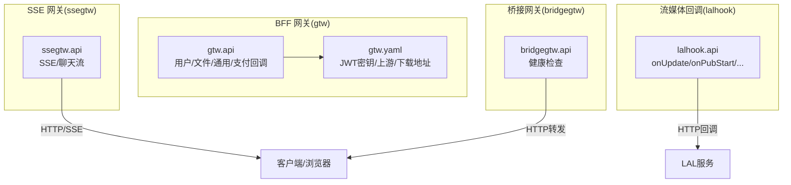
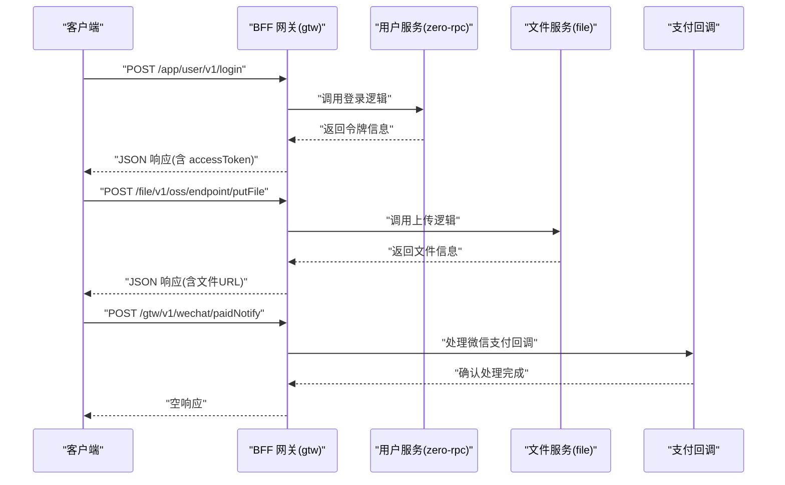
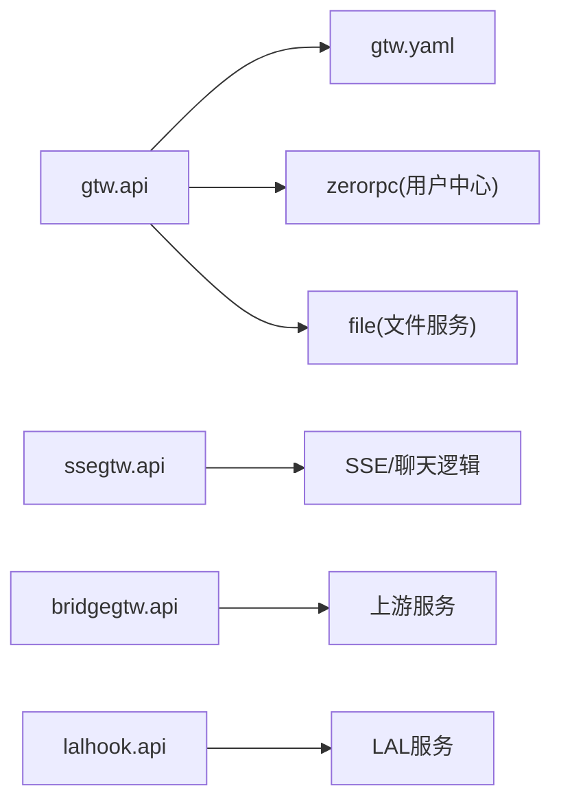

# HTTP API接口

<cite>
**本文引用的文件**
- [README.md](file://README.md)
- [gtw.api](file://gtw/gtw.api)
- [base.api](file://gtw/doc/base.api)
- [common.api](file://gtw/doc/common.api)
- [file.api](file://gtw/doc/file.api)
- [user.api](file://gtw/doc/user.api)
- [gtw.yaml](file://gtw/etc/gtw.yaml)
- [ssegtw.api](file://aiapp/ssegtw/ssegtw.api)
- [ssegtw.base.api](file://aiapp/ssegtw/doc/base.api)
- [bridgegtw.api](file://app/bridgegtw/bridgegtw.api)
- [lalhook.api](file://app/lalhook/lalhook.api)
</cite>

## 目录
1. [简介](#简介)
2. [项目结构](#项目结构)
3. [核心组件](#核心组件)
4. [架构总览](#架构总览)
5. [详细组件分析](#详细组件分析)
6. [依赖分析](#依赖分析)
7. [性能考虑](#性能考虑)
8. [故障排查指南](#故障排查指南)
9. [结论](#结论)
10. [附录](#附录)

## 简介
本文件为 Zero-Service 的 HTTP API 接口参考文档，聚焦 BFF 网关（gtw）与其他 HTTP 服务的 RESTful API，涵盖：
- HTTP 方法、URL 路径、请求头与响应格式
- 请求参数、查询字符串、请求体结构与响应数据结构
- 完整的 HTTP 请求示例（curl、浏览器测试、多语言客户端思路）
- 认证方式、权限控制与安全措施
- 错误码体系、异常处理与状态码含义
- 限流策略、缓存机制与性能优化建议
- API 测试工具与调试技巧

## 项目结构
- BFF 网关（gtw）：统一 HTTP 入口，聚合 gRPC 后端并通过 grpc-gateway 提供 HTTP 访问；包含用户、文件、通用区域、支付回调等模块。
- SSE 网关（ssegtw）：提供 Server-Sent Events 与 AI 对话流能力。
- 桥接 HTTP 网关（bridgegtw）：轻量 HTTP 转发网关。
- 流媒体回调（lalhook）：LAL 流媒体服务的 HTTP 回调接口。

**图表来源**
- [gtw.api:1-123](file://gtw/gtw.api#L1-L123)
- [gtw.yaml:1-61](file://gtw/etc/gtw.yaml#L1-L61)
- [ssegtw.api:1-40](file://aiapp/ssegtw/ssegtw.api#L1-L40)
- [bridgegtw.api:1-23](file://app/bridgegtw/bridgegtw.api#L1-L23)
- [lalhook.api:1-280](file://app/lalhook/lalhook.api#L1-L280)

**章节来源**
- [README.md: 189-206:189-206](file://README.md#L189-L206)
- [gtw.api: 1-L123:1-123](file://gtw/gtw.api#L1-L123)
- [ssegtw.api: 1-L40:1-40](file://aiapp/ssegtw/ssegtw.api#L1-L40)
- [bridgegtw.api: 1-L23:1-23](file://app/bridgegtw/bridgegtw.api#L1-L23)
- [lalhook.api: 1-L280:1-280](file://app/lalhook/lalhook.api#L1-L280)

## 核心组件
- BFF 网关（gtw）
  - 用户模块：登录、小程序登录、发送短信验证码、获取当前用户信息、编辑当前用户信息
  - 文件模块：上传文件、分片上传、流式上传、签名 URL、文件状态查询
  - 通用模块：区域列表查询
  - 支付回调模块：微信支付成功/退款通知
  - 健康检查：ping
- SSE 网关（ssegtw）
  - 健康检查：ping
  - SSE 事件流：/sse/stream
  - AI 对话流：/sse/chat/stream
- 桥接 HTTP 网关（bridgegtw）
  - 健康检查：/ping
- 流媒体回调（lalhook）
  - /v1/hook/onUpdate、/onPubStart、/onPubStop、/onSubStart、/onSubStop、/onRelayPullStart、/onRelayPullStop、/onRtmpConnect、/onServerStart、/onHlsMakeTs
  - /v1/api/ts/list 查询 TS 分片文件列表

**章节来源**
- [gtw.api: 16-L123:16-123](file://gtw/gtw.api#L16-L123)
- [ssegtw.api: 13-L38:13-38](file://aiapp/ssegtw/ssegtw.api#L13-L38)
- [bridgegtw.api: 13-L21:13-21](file://app/bridgegtw/bridgegtw.api#L13-L21)
- [lalhook.api: 200-L280:200-280](file://app/lalhook/lalhook.api#L200-L280)

## 架构总览
BFF 网关作为统一入口，负责：
- HTTP REST API 定义与路由
- JWT 认证与权限控制
- 文件上传/下载与签名 URL 生成
- 微信支付回调处理
- 聚合 gRPC 后端服务（如用户中心、文件服务等）

**图表来源**
- [gtw.api: 48-L79:48-79](file://gtw/gtw.api#L48-L79)
- [gtw.api: 96-L121:96-121](file://gtw/gtw.api#L96-L121)
- [gtw.api: 34-L46:34-46](file://gtw/gtw.api#L34-L46)

## 详细组件分析

### BFF 网关（gtw）HTTP API

#### 认证与权限
- JWT 认证：用户相关接口（如获取当前用户信息、编辑当前用户信息）声明启用 JWT 认证。
- JWT 密钥：在配置文件中定义，用于签发与校验访问令牌。
- 权限控制：当前用户接口需要携带有效的 JWT 令牌。

**章节来源**
- [gtw.api: 69-L79:69-79](file://gtw/gtw.api#L69-L79)
- [gtw.yaml: 57-L59:57-59](file://gtw/etc/gtw.yaml#L57-L59)

#### 用户模块
- 登录
  - 方法与路径：POST /app/user/v1/login
  - 请求体：包含认证类型、认证键与密码
  - 响应体：包含 accessToken、accessExpire、refreshAfter
- 小程序登录
  - 方法与路径：POST /app/user/v1/miniProgramLogin
  - 请求体：包含 code
  - 响应体：包含 openId、unionId、sessionKey
- 发送短信验证码
  - 方法与路径：POST /app/user/v1/sendSMSVerifyCode
  - 请求体：包含 mobile
  - 响应体：包含 code
- 获取当前用户信息
  - 方法与路径：GET /app/user/v1/getCurrentUser
  - 请求体：无
  - 响应体：包含 user 对象（id、mobile、nickname、sex、avatar）
- 编辑当前用户信息
  - 方法与路径：POST /app/user/v1/editCurrentUser
  - 请求体：包含 nickname、sex、avatar
  - 响应体：空

**章节来源**
- [gtw.api: 48-L79:48-79](file://gtw/gtw.api#L48-L79)
- [user.api: 3-L45:3-45](file://gtw/doc/user.api#L3-L45)

#### 通用模块
- 获取区域列表
  - 方法与路径：POST /app/common/v1/getRegionList
  - 请求体：parentCode（父区划编号）
  - 响应体：region 数组（code、parentCode、name、省市区层级信息、层级 level）

**章节来源**
- [gtw.api: 81-L94:81-94](file://gtw/gtw.api#L81-L94)
- [common.api: 3-L22:3-22](file://gtw/doc/common.api#L3-L22)

#### 文件模块（MFS/OSS）
- 上传文件
  - 方法与路径：POST /file/v1/oss/endpoint/putFile
  - 查询参数：tenantId、code、bucketName、isThumb（可选）
  - 响应体：file 对象（link、domain、name、size、formatSize、originalName、attachId、md5、meta、thumbLink、thumbName）
- 上传块文件（grpc 双向流）
  - 方法与路径：POST /file/v1/oss/endpoint/putChunkFile
  - 查询参数：同上
  - 响应体：同上
- 上传快文件（grpc 单向流）
  - 方法与路径：POST /file/v1/oss/endpoint/putStreamFile
  - 查询参数：同上
  - 响应体：同上
- 生成文件 URL
  - 方法与路径：POST /file/v1/oss/endpoint/signUrl
  - 请求体：tenantId、code、bucketName、filename、expires（默认一小时，单位分钟）
  - 响应体：url 字符串
- 获取文件信息
  - 方法与路径：POST /file/v1/oss/endpoint/statFile
  - 请求体：tenantId、code、bucketName、filename、isSign、expires
  - 响应体：ossFile 对象（link、name、size、formatSize、putTime、contentType、signUrl）

**章节来源**
- [gtw.api: 96-L121:96-121](file://gtw/gtw.api#L96-L121)
- [file.api: 5-L58:5-58](file://gtw/doc/file.api#L5-L58)

#### 支付回调模块
- 微信支付成功通知
  - 方法与路径：POST /gtw/v1/wechat/paidNotify
  - 请求体：微信回调数据（具体字段以实际实现为准）
  - 响应体：空
- 微信退款通知
  - 方法与路径：POST /gtw/v1/wechat/refundedNotify
  - 请求体：微信回调数据（具体字段以实际实现为准）
  - 响应体：空

**章节来源**
- [gtw.api: 34-L46:34-46](file://gtw/gtw.api#L34-L46)

#### 健康检查
- gtw
  - 方法与路径：GET /gtw/v1/ping
  - 响应体：msg 字符串
- 用户服务（示例）
  - 方法与路径：GET /app/user/v1/ping
  - 响应体：msg 字符串
- 文件服务（示例）
  - 方法与路径：GET /file/v1/ping
  - 响应体：msg 字符串

**章节来源**
- [gtw.api: 16-L32:16-32](file://gtw/gtw.api#L16-L32)

#### 请求与响应数据结构
- PingReply：msg
- ForwardRequest：msgId、body
- UploadFileRequest：mfsType（选项1|2）、isThumb（可选）
- DownloadFileRequest：path
- UploadFileReply：name、path、size、contextType、url、meta（可选）、thumbPath、thumbUrl
- ImageMeta：longitude、latitude、time、imgHeight、imgWidth、altitude、cameraModel
- LoginRequest：authType、authKey、password（可选）
- LoginReply：accessToken、accessExpire、refreshAfter
- MiniProgramLoginRequest：code
- MiniProgramLoginReply：openId、unionId、sessionKey
- SendSMSVerifyCodeRequest：mobile
- SendSMSVerifyCodeReply：code
- GetCurrentUserRequest：空
- GetCurrentUserReply：user（id、mobile、nickname、sex、avatar）
- EditCurrentUserRequest：nickname、sex、avatar
- EditCurrentUserReply：空
- GetRegionListRequest：parentCode
- GetRegionListReply：region 数组（code、parentCode、name、省市区层级、level）
- PutFileRequest：tenantId、code、bucketName、isThumb（可选）
- GetFileReply：file（File）
- SignUrlRequest：tenantId、code、bucketName、filename、expires
- SignUrlReqly：url
- StatFileRequest：tenantId、code、bucketName、filename、isSign、expires
- StatFileReply：ossFile（OssFile）

**章节来源**
- [base.api: 3-L51:3-51](file://gtw/doc/base.api#L3-L51)
- [user.api: 3-L45:3-45](file://gtw/doc/user.api#L3-L45)
- [common.api: 3-L22:3-22](file://gtw/doc/common.api#L3-L22)
- [file.api: 5-L58:5-58](file://gtw/doc/file.api#L5-L58)

#### HTTP 请求示例（思路与要点）
- curl 示例思路
  - 登录：POST /app/user/v1/login，Content-Type: application/json，Body: {authType, authKey, password}
  - 获取当前用户：GET /app/user/v1/getCurrentUser，Authorization: Bearer <accessToken>
  - 上传文件：POST /file/v1/oss/endpoint/putFile?tenantId=...&code=...&bucketName=...，Body: multipart/form-data（根据后端实现）
  - 生成签名URL：POST /file/v1/oss/endpoint/signUrl，Body: {tenantId, code, bucketName, filename, expires}
  - 微信支付回调：POST /gtw/v1/wechat/paidNotify，Body: 微信回调XML/JSON（以实际实现为准）
- 浏览器测试
  - GET /gtw/v1/ping 可直接在浏览器地址栏访问
  - POST 接口建议使用 Postman/Insomnia 等工具，设置 Content-Type 与 Authorization
- 多语言客户端
  - Python/Java/C++/Go：使用 HTTP 客户端库发起请求，注意设置正确的 Content-Type 与 Authorization
  - SSE/聊天流：使用 EventSource 或相应语言的 SSE 客户端库

**章节来源**
- [gtw.api: 16-L123:16-123](file://gtw/gtw.api#L16-L123)
- [file.api: 28-L58:28-58](file://gtw/doc/file.api#L28-L58)
- [user.api: 3-L45:3-45](file://gtw/doc/user.api#L3-L45)

### SSE 网关（ssegtw）HTTP API
- 健康检查
  - GET /ssegtw/v1/ping，响应：msg
- SSE 事件流
  - POST /ssegtw/v1/sse/stream，请求体：channel（可选），响应：持续推送事件流
- AI 对话流
  - POST /ssegtw/v1/sse/chat/stream，请求体：channel（可选）、prompt（可选），响应：持续推送事件流

**章节来源**
- [ssegtw.api: 13-L38:13-38](file://aiapp/ssegtw/ssegtw.api#L13-L38)
- [ssegtw.base.api: 3-L16:3-16](file://aiapp/ssegtw/doc/base.api#L3-L16)

### 桥接 HTTP 网关（bridgegtw）HTTP API
- 健康检查
  - GET /bridge/v1/ping，响应：msg

**章节来源**
- [bridgegtw.api: 13-L21:13-21](file://app/bridgegtw/bridgegtw.api#L13-L21)

### 流媒体回调（lalhook）HTTP API
- /v1/hook/onUpdate：定时汇报所有 group/session 的信息
- /v1/hook/onPubStart：推流开始
- /v1/hook/onPubStop：推流结束
- /v1/hook/onSubStart：拉流开始
- /v1/hook/onSubStop：拉流结束
- /v1/hook/onRelayPullStart：回源拉流开始
- /v1/hook/onRelayPullStop：回源拉流结束
- /v1/hook/onRtmpConnect：收到 RTMP connect 信令
- /v1/hook/onServerStart：服务启动
- /v1/hook/onHlsMakeTs：HLS 生成每个 ts 分片文件时
- /v1/api/ts/list：查询 TS 文件列表（按时间区间）

**章节来源**
- [lalhook.api: 200-L280:200-280](file://app/lalhook/lalhook.api#L200-L280)

## 依赖分析
- BFF 网关依赖
  - 配置：JWT 密钥、文件服务端点、下载 URL 前缀、Swagger 路径
  - 服务：用户中心（zerorpc）、文件服务（file）
- SSE 网关依赖
  - 事件流与聊天流处理逻辑
- 桥接网关依赖
  - 转发目标（由上游配置决定）
- 流媒体回调依赖
  - LAL 服务回调触发

**图表来源**
- [gtw.api: 16-L123:16-123](file://gtw/gtw.api#L16-L123)
- [gtw.yaml: 47-L61:47-61](file://gtw/etc/gtw.yaml#L47-L61)
- [ssegtw.api: 13-L38:13-38](file://aiapp/ssegtw/ssegtw.api#L13-L38)
- [bridgegtw.api: 13-L21:13-21](file://app/bridgegtw/bridgegtw.api#L13-L21)
- [lalhook.api: 200-L280:200-280](file://app/lalhook/lalhook.api#L200-L280)

**章节来源**
- [gtw.yaml: 47-L61:47-61](file://gtw/etc/gtw.yaml#L47-L61)
- [gtw.api: 16-L123:16-123](file://gtw/gtw.api#L16-L123)

## 性能考虑
- 上传超时：文件服务接口配置了较长超时（7200s），适合大文件分片/流式上传
- 下载 URL：建议结合签名 URL 与 CDN 加速，减少直传压力
- JWT：短令牌 + 刷新令牌策略，降低频繁鉴权成本
- SSE：长连接需注意连接池与心跳保活，避免资源泄漏
- 回调接口：幂等设计，避免重复处理

**章节来源**
- [gtw.api: 96-L121:96-121](file://gtw/gtw.api#L96-L121)
- [gtw.yaml: 60-L61:60-61](file://gtw/etc/gtw.yaml#L60-L61)

## 故障排查指南
- 认证失败
  - 确认 Authorization: Bearer <accessToken> 是否正确传递
  - 检查 JWT 密钥是否与配置一致
- 上传失败
  - 检查查询参数 tenantId、code、bucketName 是否正确
  - 确认文件大小限制与存储桶配置
- 回调未达
  - 检查 LAL 服务回调地址配置
  - 查看回调接口日志与重试机制

**章节来源**
- [gtw.yaml: 57-L59:57-59](file://gtw/etc/gtw.yaml#L57-L59)
- [lalhook.api: 200-L280:200-280](file://app/lalhook/lalhook.api#L200-L280)

## 结论
本文档梳理了 BFF 网关与其他 HTTP 服务的 RESTful API，明确了认证、权限、请求/响应结构、示例与故障排查方法。建议在生产环境中结合 JWT、签名 URL、SSE 连接池与回调幂等策略，确保接口稳定与高效。

## 附录

### 错误码与状态码
- 项目遵循 google.rpc.Code 错误码标准，HTTP 与 gRPC 错误码映射关系参见项目错误码规范文档。

**章节来源**
- [README.md: 296-L299:296-299](file://README.md#L296-L299)

### 配置要点
- gtw.yaml
  - JwtAuth.AccessSecret：JWT 密钥
  - ZeroRpcConf/FileRpcConf：后端服务端点与超时
  - DownloadUrl：文件下载 URL 前缀
  - SwaggerPath：Swagger 文档路径

**章节来源**
- [gtw.yaml: 47-L61:47-61](file://gtw/etc/gtw.yaml#L47-L61)