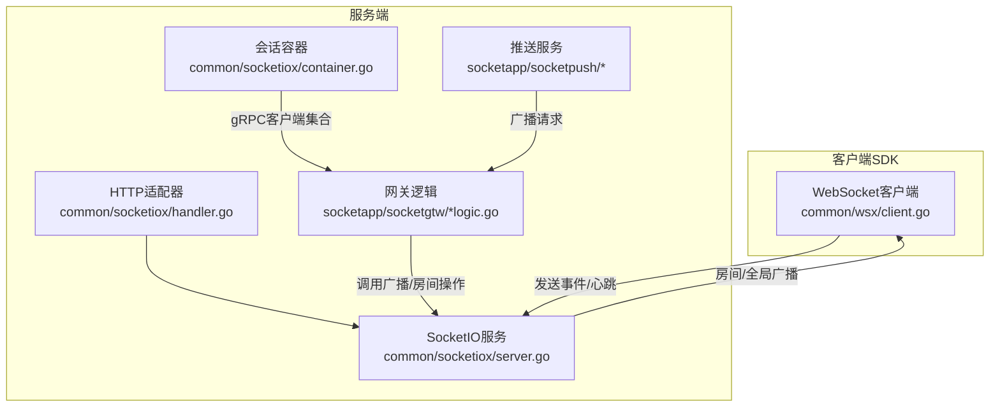
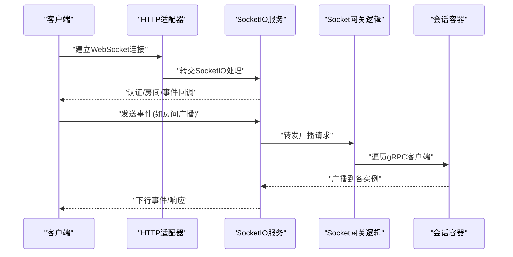
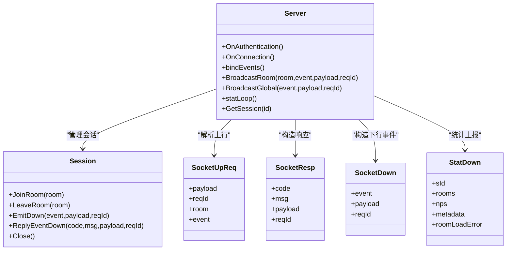
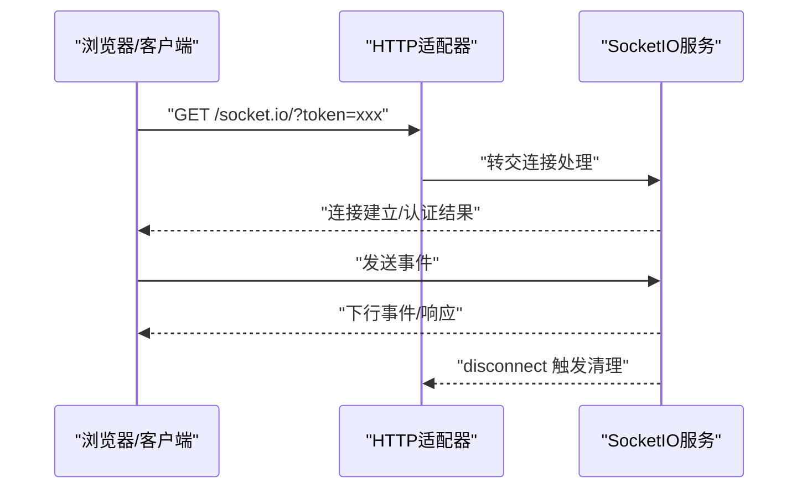
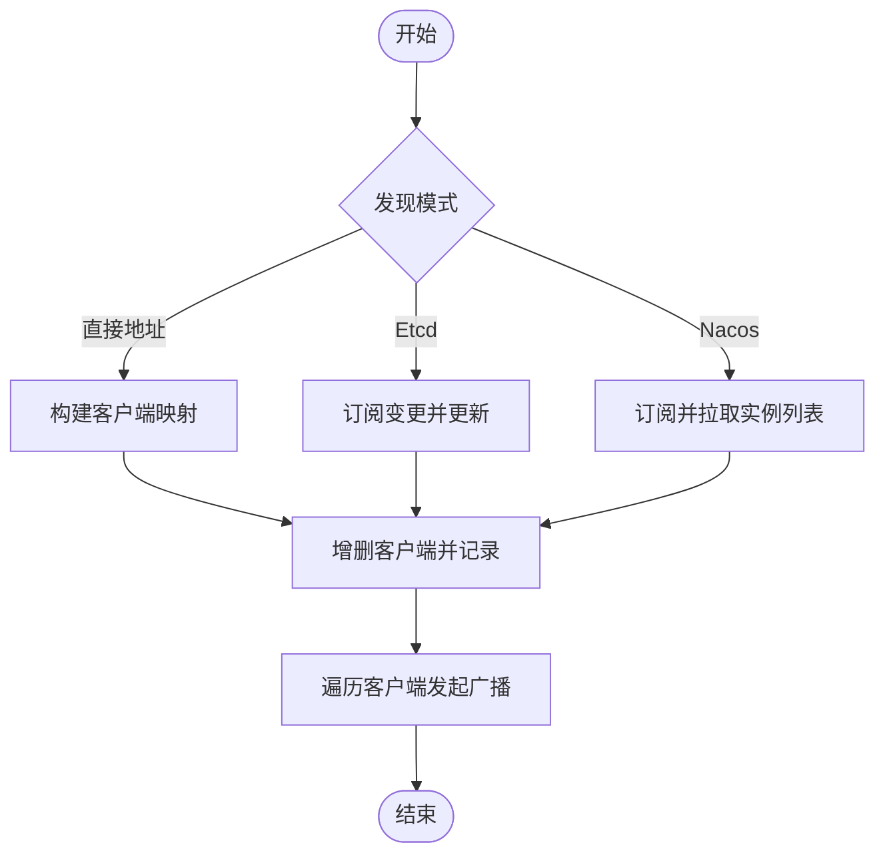
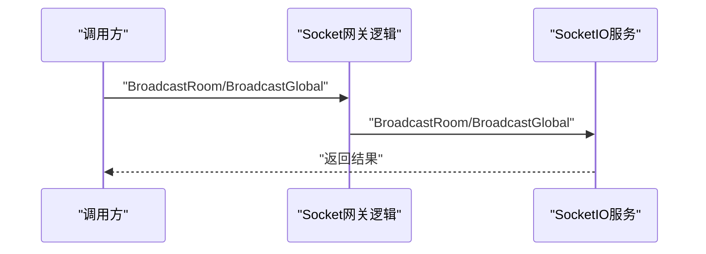
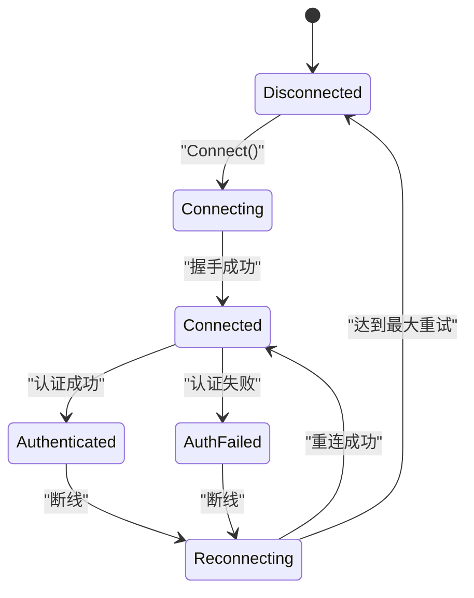
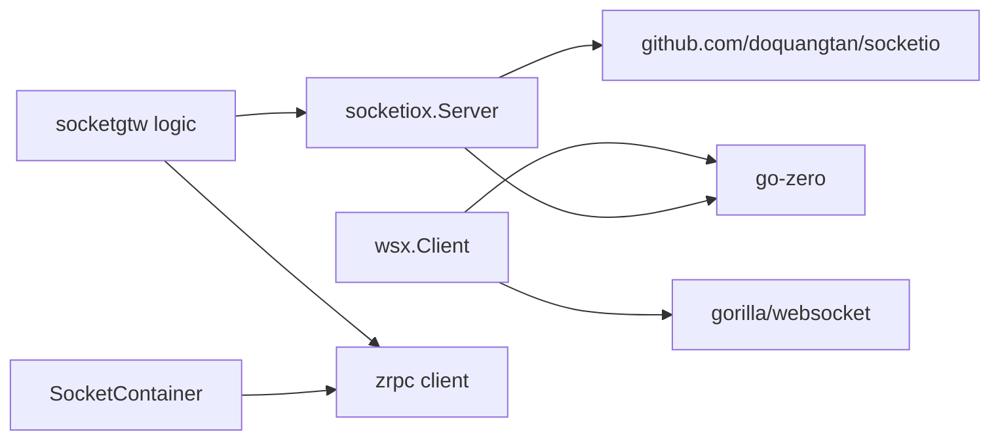

# WebSocket API接口

<cite>
**本文引用的文件**
- [common/socketiox/server.go](file://common/socketiox/server.go)
- [common/socketiox/handler.go](file://common/socketiox/handler.go)
- [common/socketiox/container.go](file://common/socketiox/container.go)
- [common/wsx/client.go](file://common/wsx/client.go)
- [socketapp/socketgtw/internal/logic/broadcastroomlogic.go](file://socketapp/socketgtw/internal/logic/broadcastroomlogic.go)
- [socketapp/socketgtw/internal/logic/broadcastgloballogic.go](file://socketapp/socketgtw/internal/logic/broadcastgloballogic.go)
- [socketapp/socketgtw/internal/logic/joinroomlogic.go](file://socketapp/socketgtw/internal/logic/joinroomlogic.go)
- [socketapp/socketgtw/internal/logic/leaveroomlogic.go](file://socketapp/socketgtw/internal/logic/leaveroomlogic.go)
- [socketapp/socketgtw/internal/logic/kicksessionlogic.go](file://socketapp/socketgtw/internal/logic/kicksessionlogic.go)
- [socketapp/socketpush/socketpush/socketpush_grpc.pb.go](file://socketapp/socketpush/socketpush/socketpush_grpc.pb.go)
</cite>

## 目录
1. [简介](#简介)
2. [项目结构](#项目结构)
3. [核心组件](#核心组件)
4. [架构总览](#架构总览)
5. [详细组件分析](#详细组件分析)
6. [依赖分析](#依赖分析)
7. [性能考虑](#性能考虑)
8. [故障排查指南](#故障排查指南)
9. [结论](#结论)
10. [附录](#附录)

## 简介
本文件为 Zero-Service 的 WebSocket API 接口参考文档，覆盖实时通信相关的 WebSocket 接口与实现，包括：
- 连接建立与握手流程
- 认证机制与会话管理
- 消息格式与事件类型
- 房间管理与广播机制
- 客户端 SDK 与服务端集成
- 心跳检测、断线重连与性能优化
- 调试与监控方法

## 项目结构
WebSocket 相关能力由以下模块协同实现：
- 服务端框架与事件处理：common/socketiox
- HTTP 适配器：common/socketiox/handler.go
- 客户端 SDK：common/wsx
- 网关与广播逻辑：socketapp/socketgtw
- 广播推送服务：socketapp/socketpush
- 会话容器与多实例发现：common/socketiox/container.go

**图表来源**
- [common/socketiox/server.go:337-676](file://common/socketiox/server.go#L337-L676)
- [common/socketiox/handler.go:19-40](file://common/socketiox/handler.go#L19-L40)
- [common/socketiox/container.go:30-77](file://common/socketiox/container.go#L30-L77)
- [socketapp/socketgtw/internal/logic/broadcastroomlogic.go:28-46](file://socketapp/socketgtw/internal/logic/broadcastroomlogic.go#L28-L46)
- [socketapp/socketpush/socketpush/socketpush_grpc.pb.go:240-267](file://socketapp/socketpush/socketpush/socketpush_grpc.pb.go#L240-L267)

**章节来源**
- [common/socketiox/server.go:1-814](file://common/socketiox/server.go#L1-L814)
- [common/socketiox/handler.go:1-41](file://common/socketiox/handler.go#L1-L41)
- [common/socketiox/container.go:1-426](file://common/socketiox/container.go#L1-L426)
- [common/wsx/client.go:1-894](file://common/wsx/client.go#L1-L894)
- [socketapp/socketgtw/internal/logic/broadcastroomlogic.go:1-47](file://socketapp/socketgtw/internal/logic/broadcastroomlogic.go#L1-L47)
- [socketapp/socketgtw/internal/logic/broadcastgloballogic.go:1-47](file://socketapp/socketgtw/internal/logic/broadcastgloballogic.go#L1-L47)
- [socketapp/socketgtw/internal/logic/joinroomlogic.go:1-38](file://socketapp/socketgtw/internal/logic/joinroomlogic.go#L1-L38)
- [socketapp/socketgtw/internal/logic/leaveroomlogic.go:1-38](file://socketapp/socketgtw/internal/logic/leaveroomlogic.go#L1-L38)
- [socketapp/socketgtw/internal/logic/kicksessionlogic.go:1-37](file://socketapp/socketgtw/internal/logic/kicksessionlogic.go#L1-L37)
- [socketapp/socketpush/socketpush/socketpush_grpc.pb.go:240-267](file://socketapp/socketpush/socketpush/socketpush_grpc.pb.go#L240-L267)

## 核心组件
- SocketIO 服务端：负责连接接入、认证、事件分发、房间管理、广播与统计上报。
- HTTP 适配器：将 SocketIO 协议暴露为 HTTP 接口，便于反向代理与浏览器直连。
- 会话容器：维护 gRPC 客户端集合，支持直接地址、Etcd 与 Nacos 三种发现方式。
- 网关逻辑：提供房间加入/离开、房间/全局广播、剔除会话等 RPC 能力。
- 客户端 SDK：提供心跳、重连、认证状态管理、发送/接收消息的完整客户端。

**章节来源**
- [common/socketiox/server.go:200-335](file://common/socketiox/server.go#L200-L335)
- [common/socketiox/handler.go:19-40](file://common/socketiox/handler.go#L19-L40)
- [common/socketiox/container.go:30-77](file://common/socketiox/container.go#L30-L77)
- [socketapp/socketgtw/internal/logic/broadcastroomlogic.go:28-46](file://socketapp/socketgtw/internal/logic/broadcastroomlogic.go#L28-L46)
- [common/wsx/client.go:65-81](file://common/wsx/client.go#L65-L81)

## 架构总览
WebSocket 服务采用“HTTP 适配 + SocketIO 服务 + 网关广播”的分层设计。客户端通过 HTTP/SocketIO 连接服务端；服务端在收到广播请求后，通过网关逻辑调用 SocketIO 服务进行房间或全局广播；会话容器负责管理多个 gRPC 客户端以实现跨实例广播。

**图表来源**
- [common/socketiox/handler.go:33-35](file://common/socketiox/handler.go#L33-L35)
- [common/socketiox/server.go:532-575](file://common/socketiox/server.go#L532-L575)
- [socketapp/socketgtw/internal/logic/broadcastroomlogic.go:28-46](file://socketapp/socketgtw/internal/logic/broadcastroomlogic.go#L28-L46)
- [common/socketiox/container.go:63-77](file://common/socketiox/container.go#L63-L77)

## 详细组件分析

### SocketIO 服务端与事件模型
- 事件类型
  - 连接/断开：__connection__, __disconnect__
  - 上行事件：__up__（通用上行）、__join_room_up__、__leave_room_up__
  - 广播事件：__room_broadcast_up__、__global_broadcast_up__
  - 下行事件：__down__（统一响应）、__stat_down__（统计）
- 消息格式
  - 上行请求：SocketUpReq（payload, reqId, room, event）
  - 下行响应：SocketResp（code, msg, payload, reqId）
  - 下行事件：SocketDown（event, payload, reqId）
  - 统计下行：StatDown（sId, rooms, nps, metadata, roomLoadError）
- 认证与上下文
  - 通过握手参数 token 进行验证，可选带声明（claims），并将关键字段注入会话元数据。
- 房间管理
  - 支持加入/离开房间，断开连接时清理无效会话。
- 广播机制
  - 房间广播：To(room).Emit(event, payload)
  - 全局广播：Emit(event, payload)
- 统计与可观测性
  - 定时向每个会话发送统计事件，包含房间列表、网络指标与元数据。

**图表来源**
- [common/socketiox/server.go:200-335](file://common/socketiox/server.go#L200-L335)
- [common/socketiox/server.go:41-72](file://common/socketiox/server.go#L41-L72)
- [common/socketiox/server.go:678-700](file://common/socketiox/server.go#L678-L700)

**章节来源**
- [common/socketiox/server.go:20-72](file://common/socketiox/server.go#L20-L72)
- [common/socketiox/server.go:337-676](file://common/socketiox/server.go#L337-L676)
- [common/socketiox/server.go:678-740](file://common/socketiox/server.go#L678-L740)

### HTTP 适配器与握手流程
- 将 SocketIO 协议暴露为 HTTP 接口，供浏览器或反向代理直接访问。
- 握手阶段从握手参数中读取 token，用于后续认证与会话元数据注入。
- 断开连接时触发 disconnect 钩子并清理会话。

**图表来源**
- [common/socketiox/handler.go:33-35](file://common/socketiox/handler.go#L33-L35)
- [common/socketiox/server.go:337-349](file://common/socketiox/server.go#L337-L349)
- [common/socketiox/server.go:620-641](file://common/socketiox/server.go#L620-L641)

**章节来源**
- [common/socketiox/handler.go:19-40](file://common/socketiox/handler.go#L19-L40)
- [common/socketiox/server.go:337-349](file://common/socketiox/server.go#L337-L349)

### 会话容器与多实例广播
- 支持三种服务发现方式：直接地址、Etcd、Nacos。
- 维护 gRPC 客户端映射，按需增删，限制订阅集合大小以控制广播范围。
- 广播时遍历客户端并发起广播请求，实现跨实例广播。

**图表来源**
- [common/socketiox/container.go:83-130](file://common/socketiox/container.go#L83-L130)
- [common/socketiox/container.go:156-242](file://common/socketiox/container.go#L156-L242)
- [common/socketiox/container.go:267-316](file://common/socketiox/container.go#L267-L316)
- [common/socketiox/container.go:63-77](file://common/socketiox/container.go#L63-L77)

**章节来源**
- [common/socketiox/container.go:30-77](file://common/socketiox/container.go#L30-L77)
- [common/socketiox/container.go:83-130](file://common/socketiox/container.go#L83-L130)
- [common/socketiox/container.go:156-242](file://common/socketiox/container.go#L156-L242)

### 网关逻辑与广播实现
- 房间广播：接收请求后解析 payload 类型，调用 SocketServer 广播至指定房间。
- 全局广播：同上，但广播至所有在线会话。
- 房间管理：提供加入/离开房间的 RPC 接口。
- 会话管理：提供根据 SId 获取会话并关闭的能力。

**图表来源**
- [socketapp/socketgtw/internal/logic/broadcastroomlogic.go:28-46](file://socketapp/socketgtw/internal/logic/broadcastroomlogic.go#L28-L46)
- [socketapp/socketgtw/internal/logic/broadcastgloballogic.go:28-46](file://socketapp/socketgtw/internal/logic/broadcastgloballogic.go#L28-L46)
- [socketapp/socketgtw/internal/logic/joinroomlogic.go:25-37](file://socketapp/socketgtw/internal/logic/joinroomlogic.go#L25-L37)
- [socketapp/socketgtw/internal/logic/leaveroomlogic.go:25-37](file://socketapp/socketgtw/internal/logic/leaveroomlogic.go#L25-L37)
- [socketapp/socketgtw/internal/logic/kicksessionlogic.go:26-36](file://socketapp/socketgtw/internal/logic/kicksessionlogic.go#L26-L36)

**章节来源**
- [socketapp/socketgtw/internal/logic/broadcastroomlogic.go:1-47](file://socketapp/socketgtw/internal/logic/broadcastroomlogic.go#L1-L47)
- [socketapp/socketgtw/internal/logic/broadcastgloballogic.go:1-47](file://socketapp/socketgtw/internal/logic/broadcastgloballogic.go#L1-L47)
- [socketapp/socketgtw/internal/logic/joinroomlogic.go:1-38](file://socketapp/socketgtw/internal/logic/joinroomlogic.go#L1-L38)
- [socketapp/socketgtw/internal/logic/leaveroomlogic.go:1-38](file://socketapp/socketgtw/internal/logic/leaveroomlogic.go#L1-L38)
- [socketapp/socketgtw/internal/logic/kicksessionlogic.go:1-37](file://socketapp/socketgtw/internal/logic/kicksessionlogic.go#L1-L37)

### 客户端 SDK（心跳、重连、状态）
- 心跳：支持自定义心跳或默认 Ping，周期性发送并刷新读截止时间。
- 重连：指数退避可选，最大重连间隔可控，支持上下文取消。
- 认证：连接后进入已连接状态，认证成功后进入已认证状态。
- 状态管理：Disconnected/Connecting/Connected(Unauthed)/Authenticated/AuthFailed/Reconnecting。

**图表来源**
- [common/wsx/client.go:45-63](file://common/wsx/client.go#L45-L63)
- [common/wsx/client.go:302-325](file://common/wsx/client.go#L302-L325)
- [common/wsx/client.go:641-668](file://common/wsx/client.go#L641-L668)
- [common/wsx/client.go:598-633](file://common/wsx/client.go#L598-L633)

**章节来源**
- [common/wsx/client.go:65-81](file://common/wsx/client.go#L65-L81)
- [common/wsx/client.go:45-63](file://common/wsx/client.go#L45-L63)
- [common/wsx/client.go:302-325](file://common/wsx/client.go#L302-L325)
- [common/wsx/client.go:641-668](file://common/wsx/client.go#L641-L668)
- [common/wsx/client.go:598-633](file://common/wsx/client.go#L598-L633)

## 依赖分析
- 服务端依赖
  - SocketIO 协议库：处理连接、事件与房间管理。
  - go-zero 日志与并发工具：日志、并发安全、JSON 解析。
- 客户端依赖
  - gorilla/websocket：标准 WebSocket 实现。
  - go-zero 并发与日志：线程安全与日志。
- 网关与推送
  - gRPC 客户端：与 socketgtw 交互。
  - 会话容器：动态维护 gRPC 客户端集合。

**图表来源**
- [common/wsx/client.go:14-17](file://common/wsx/client.go#L14-L17)
- [common/socketiox/server.go:12-18](file://common/socketiox/server.go#L12-L18)
- [common/socketiox/container.go:17-27](file://common/socketiox/container.go#L17-L27)

**章节来源**
- [common/wsx/client.go:14-17](file://common/wsx/client.go#L14-L17)
- [common/socketiox/server.go:12-18](file://common/socketiox/server.go#L12-L18)
- [common/socketiox/container.go:17-27](file://common/socketiox/container.go#L17-L27)

## 性能考虑
- 心跳与保活
  - 使用 PongHandler 刷新读截止时间，避免长时间无响应导致连接被中间设备断开。
  - 自定义心跳可减少协议开销，建议在高吞吐场景下启用。
- 重连策略
  - 指数退避可降低雪崩风险，配合最大重连间隔防止无限延长。
  - 支持上下文取消，确保优雅退出。
- 广播性能
  - 会话容器对订阅集合做大小限制，避免广播风暴。
  - gRPC 调整最大消息尺寸，满足大包广播需求。
- 统计与可观测性
  - 定时统计事件包含房间列表与网络指标，便于定位异常。

**章节来源**
- [common/wsx/client.go:498-502](file://common/wsx/client.go#L498-L502)
- [common/wsx/client.go:641-668](file://common/wsx/client.go#L641-L668)
- [common/wsx/client.go:598-633](file://common/wsx/client.go#L598-L633)
- [common/socketiox/container.go:113-118](file://common/socketiox/container.go#L113-L118)
- [common/socketiox/server.go:702-740](file://common/socketiox/server.go#L702-L740)

## 故障排查指南
- 连接失败
  - 检查握手参数 token 是否正确，确认 OnAuthentication 回调是否放行。
  - 查看连接状态变化与错误日志，定位认证失败原因。
- 认证失败
  - 核对 TokenValidator 或 TokenValidatorWithClaims 返回值。
  - 若使用 claims 注入，确认上下文键是否存在且非空。
- 广播无效
  - 确认房间名与事件名不为空，且未使用保留事件名。
  - 检查会话是否已加入目标房间。
- 重连异常
  - 观察指数退避是否生效，确认最大重连间隔设置合理。
  - 检查上下文取消信号是否提前触发。
- 断线与清理
  - 断开连接时触发 disconnect 钩子并清理会话，确保内存不泄露。

**章节来源**
- [common/socketiox/server.go:337-349](file://common/socketiox/server.go#L337-L349)
- [common/socketiox/server.go:620-641](file://common/socketiox/server.go#L620-L641)
- [common/socketiox/server.go:678-700](file://common/socketiox/server.go#L678-L700)
- [common/wsx/client.go:635-638](file://common/wsx/client.go#L635-L638)
- [common/wsx/client.go:598-633](file://common/wsx/client.go#L598-L633)

## 结论
本 WebSocket API 通过清晰的事件模型、完善的房间与广播机制、健壮的心跳与重连策略，以及可观测的统计上报，为实时通信提供了稳定可靠的基础设施。结合客户端 SDK 与多实例发现能力，可在分布式环境下高效扩展。

## 附录

### WebSocket 客户端连接示例（路径）
- JavaScript（浏览器/Node.js）
  - 参考路径：[common/wsx/client.go](file://common/wsx/client.go)
  - 连接步骤：初始化客户端 -> 设置心跳/重连参数 -> Connect() -> 认证 -> 发送/接收事件
- Python
  - 参考路径：[common/wsx/client.go](file://common/wsx/client.go)
  - 连接步骤：初始化客户端 -> 设置 token 头 -> Connect() -> 发送/接收事件
- 移动端（Android/iOS）
  - 参考路径：[common/wsx/client.go](file://common/wsx/client.go)
  - 连接步骤：初始化客户端 -> 配置心跳/重连 -> Connect() -> 认证 -> 广播/房间管理

### 消息格式与事件类型
- 上行请求
  - 字段：payload, reqId, room(可选), event(可选)
  - 示例路径：[common/socketiox/server.go:41-46](file://common/socketiox/server.go#L41-L46)
- 下行响应
  - 字段：code, msg, payload(可选), reqId(可选)
  - 示例路径：[common/socketiox/server.go:53-58](file://common/socketiox/server.go#L53-L58)
- 下行事件
  - 字段：event, payload(可选), reqId(可选)
  - 示例路径：[common/socketiox/server.go:60-64](file://common/socketiox/server.go#L60-L64)
- 统计事件
  - 字段：sId, rooms, nps, metadata, roomLoadError
  - 示例路径：[common/socketiox/server.go:66-72](file://common/socketiox/server.go#L66-L72)

### 房间管理与广播
- 房间广播
  - 事件：__room_broadcast_up__
  - 参数：reqId, event, payload, room
  - 示例路径：[common/socketiox/server.go:532-575](file://common/socketiox/server.go#L532-L575)
- 全局广播
  - 事件：__global_broadcast_up__
  - 参数：reqId, event, payload
  - 示例路径：[common/socketiox/server.go:576-618](file://common/socketiox/server.go#L576-L618)
- 房间加入/离开
  - 事件：__join_room_up__/__leave_room_up__
  - 参数：reqId, room
  - 示例路径：[common/socketiox/server.go:392-468](file://common/socketiox/server.go#L392-L468)

### 认证与会话管理
- 认证入口
  - OnAuthentication 回调校验 token
  - 示例路径：[common/socketiox/server.go:337-349](file://common/socketiox/server.go#L337-L349)
- 会话元数据
  - 可从 claims 注入键值，用于用户/设备标识
  - 示例路径：[common/socketiox/server.go:359-372](file://common/socketiox/server.go#L359-L372)
- 断开清理
  - disconnect 钩子与会话清理
  - 示例路径：[common/socketiox/server.go:620-641](file://common/socketiox/server.go#L620-L641)

### 推送服务与RPC接口
- 广播相关 RPC 方法
  - GenToken/VerifyToken/JoinRoom/LeaveRoom/BroadcastRoom/BroadcastGlobal/KickSession
  - 示例路径：[socketapp/socketpush/socketpush/socketpush_grpc.pb.go:240-267](file://socketapp/socketpush/socketpush/socketpush_grpc.pb.go#L240-L267)