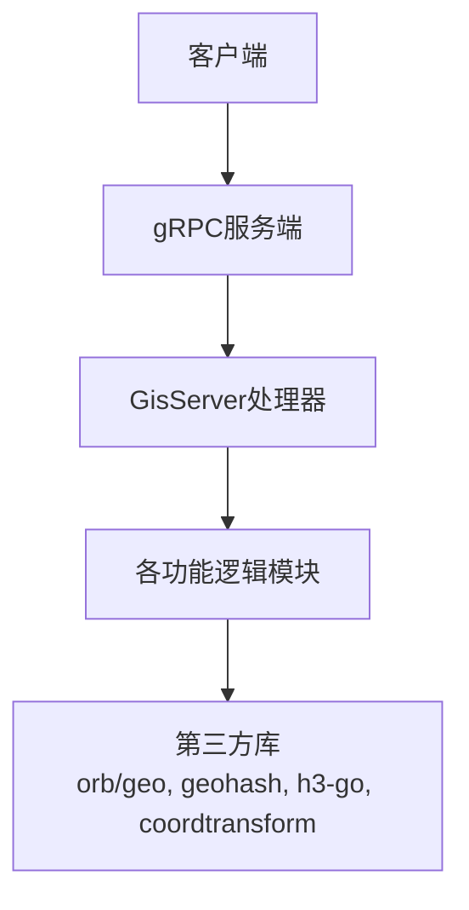
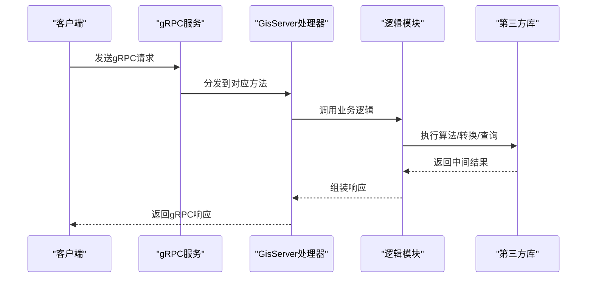
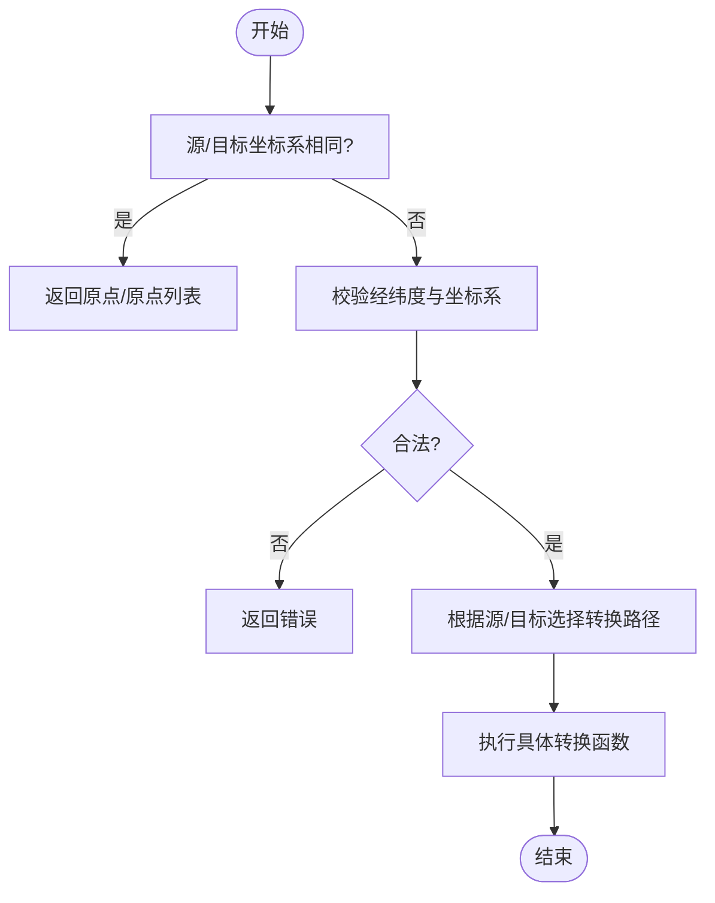
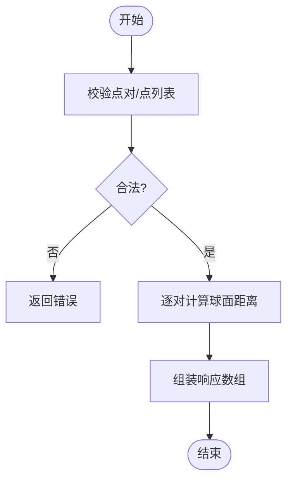
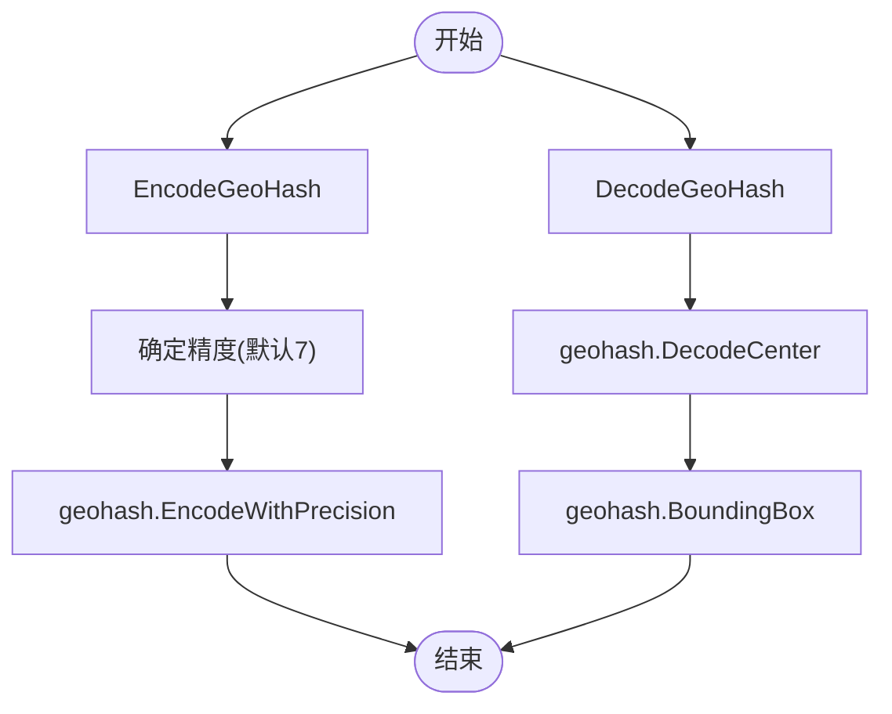
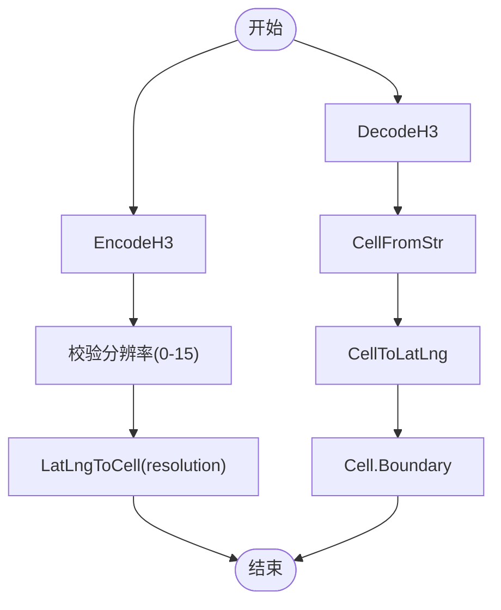
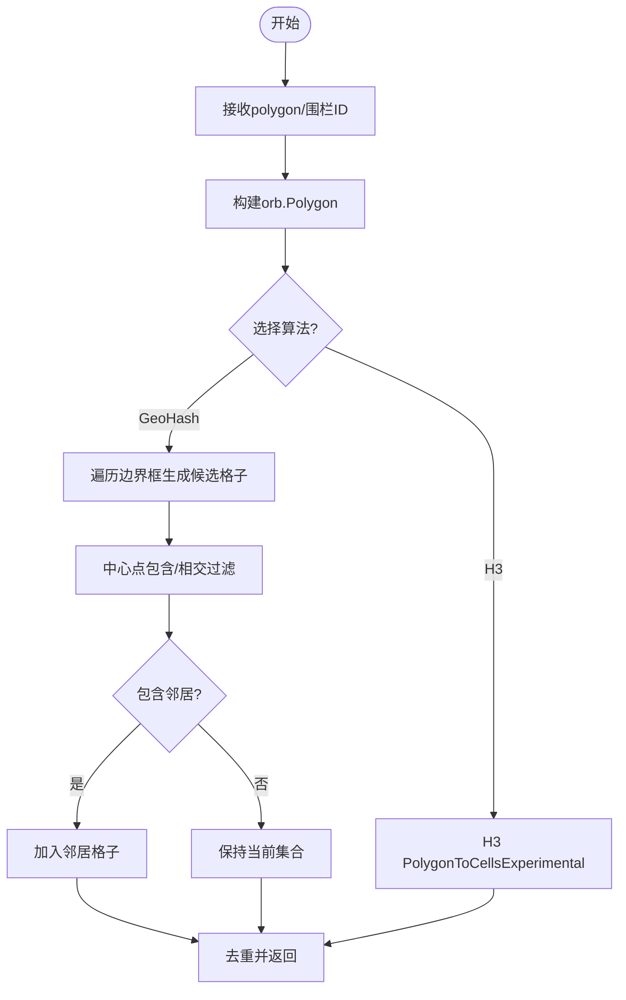
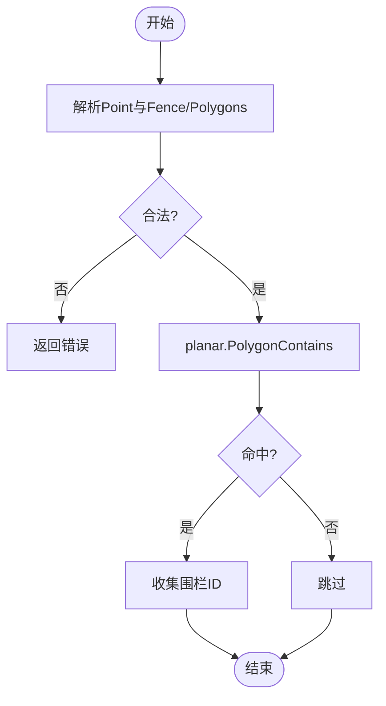
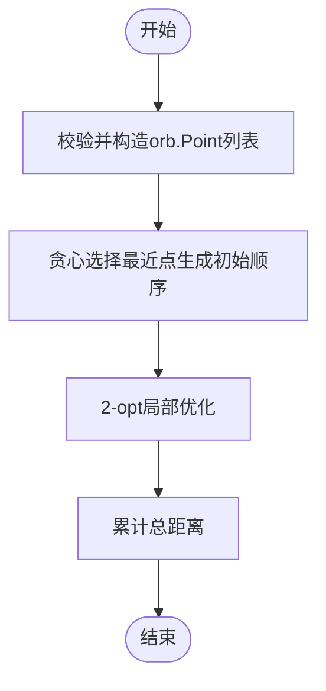
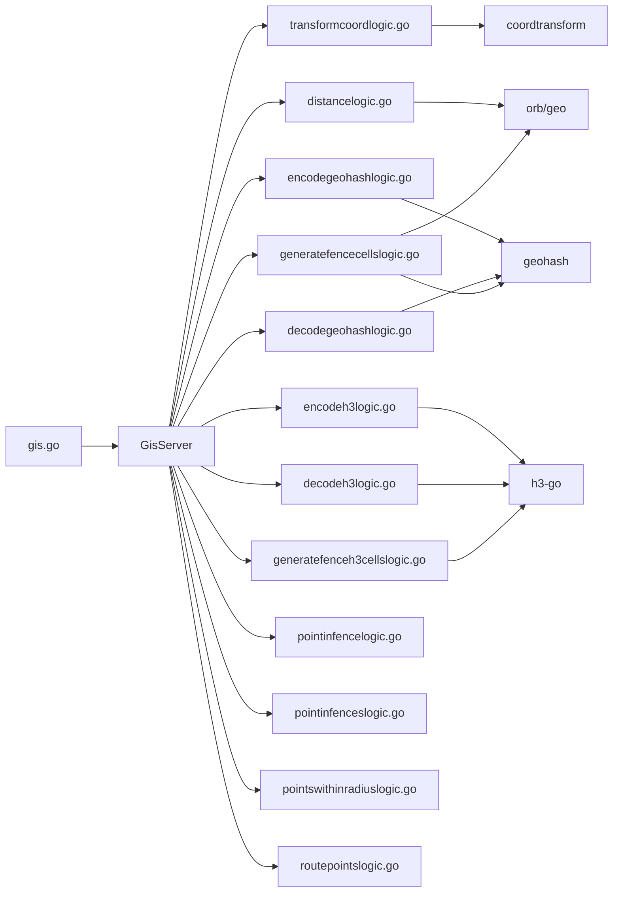

# GIS服务API

<cite>
**本文引用的文件**
- [gis.proto](file://app/gis/gis.proto)
- [gis.pb.go](file://app/gis/gis/gis.pb.go)
- [gis.go](file://app/gis/gis.go)
- [transformcoordlogic.go](file://app/gis/internal/logic/transformcoordlogic.go)
- [batchtransformcoordlogic.go](file://app/gis/internal/logic/batchtransformcoordlogic.go)
- [distancelogic.go](file://app/gis/internal/logic/distancelogic.go)
- [batchdistancelogic.go](file://app/gis/internal/logic/batchdistancelogic.go)
- [encodegeohashlogic.go](file://app/gis/internal/logic/encodegeohashlogic.go)
- [decodegeohashlogic.go](file://app/gis/internal/logic/decodegeohashlogic.go)
- [encodeh3logic.go](file://app/gis/internal/logic/encodeh3logic.go)
- [decodeh3logic.go](file://app/gis/internal/logic/decodeh3logic.go)
- [generatefencecellslogic.go](file://app/gis/internal/logic/generatefencecellslogic.go)
- [generatefenceh3cellslogic.go](file://app/gis/internal/logic/generatefenceh3cellslogic.go)
- [pointinfencelogic.go](file://app/gis/internal/logic/pointinfencelogic.go)
- [pointinfenceslogic.go](file://app/gis/internal/logic/pointinfenceslogic.go)
- [pointswithinradiuslogic.go](file://app/gis/internal/logic/pointswithinradiuslogic.go)
- [routepointslogic.go](file://app/gis/internal/logic/routepointslogic.go)
- [nearbyfenceslogic.go](file://app/gis/internal/logic/nearbyfenceslogic.go)
</cite>

## 目录
1. [简介](#简介)
2. [项目结构](#项目结构)
3. [核心组件](#核心组件)
4. [架构总览](#架构总览)
5. [详细组件分析](#详细组件分析)
6. [依赖关系分析](#依赖关系分析)
7. [性能考量](#性能考量)
8. [故障排查指南](#故障排查指南)
9. [结论](#结论)
10. [附录](#附录)

## 简介
本文件系统性地梳理了GIS服务的gRPC API，覆盖坐标转换、距离计算、地理围栏、空间索引（GeoHash/H3）等能力，并给出参数结构、算法要点、调用流程与边界处理建议。内容面向开发者与运维人员，既提供代码级映射，也提供概念性图示帮助理解。

## 项目结构
- 接口定义：位于 app/gis/gis.proto，描述服务方法、消息体与枚举。
- 服务实现入口：app/gis/gis.go 启动gRPC服务并注册GisServer。
- 业务逻辑：位于 app/gis/internal/logic/*，按功能拆分，如坐标转换、距离计算、围栏与索引等。
- 生成代码：app/gis/gis/gis.pb.go 由proto生成，包含消息体与枚举定义。

**图表来源**
- [gis.go:38-43](file://app/gis/gis.go#L38-L43)
- [gis.proto:18-50](file://app/gis/gis.proto#L18-L50)

**章节来源**
- [gis.proto:1-219](file://app/gis/gis.proto#L1-L219)
- [gis.go:27-70](file://app/gis/gis.go#L27-L70)

## 核心组件
- 服务接口：Gis 服务，提供坐标转换、批量转换、距离计算、批量距离、围栏生成（GeoHash/H3）、点在围栏内、半径内点查询、附近围栏、路径规划等。
- 数据模型：
  - Point：经纬度
  - PointPair：点对
  - Fence：围栏（多边形）
  - CoordType：坐标系枚举（WGS84、GCJ02、BD09）
- 关键请求/响应：见各接口定义与对应逻辑实现。

**章节来源**
- [gis.proto:18-50](file://app/gis/gis.proto#L18-L50)
- [gis.proto:54-219](file://app/gis/gis.proto#L54-L219)

## 架构总览
- gRPC服务通过zrpc启动，注册GisServer。
- 请求进入后由具体逻辑模块处理，调用第三方库完成计算或转换。
- 对外返回统一的消息体，便于客户端消费。

**图表来源**
- [gis.go:38-43](file://app/gis/gis.go#L38-L43)
- [transformcoordlogic.go:29-50](file://app/gis/internal/logic/transformcoordlogic.go#L29-L50)
- [distancelogic.go:31-41](file://app/gis/internal/logic/distancelogic.go#L31-L41)

## 详细组件分析

### 坐标转换（CoordinateTransform）
- 方法：TransformCoord、BatchTransformCoord
- 输入：
  - 单点：Point + 源/目标坐标系枚举
  - 批量：Point列表 + 源/目标坐标系枚举
- 算法与实现要点：
  - 支持 WGS84 ↔ GCJ02 ↔ BD09 三者互转；支持中转路径。
  - 若源/目标坐标系相同，直接返回原点（或原点副本）。
  - 对经纬度范围进行校验，避免非法值。
  - 批量转换通过循环调用单点转换逻辑实现。
- 边界与精度：
  - 经度[-180,180]，纬度[-90,90]。
  - 坐标系枚举值限定为1~3。
- 错误处理：
  - 参数为空、坐标越界、坐标系非法均返回错误。

**图表来源**
- [transformcoordlogic.go:33-50](file://app/gis/internal/logic/transformcoordlogic.go#L33-L50)
- [batchtransformcoordlogic.go:34-46](file://app/gis/internal/logic/batchtransformcoordlogic.go#L34-L46)

**章节来源**
- [gis.proto:191-209](file://app/gis/gis.proto#L191-L209)
- [transformcoordlogic.go:28-101](file://app/gis/internal/logic/transformcoordlogic.go#L28-L101)
- [batchtransformcoordlogic.go:28-65](file://app/gis/internal/logic/batchtransformcoordlogic.go#L28-L65)

### 距离计算（Distance）
- 方法：Distance、BatchDistance
- 输入：
  - 单次：Point对(A,B)
  - 批量：PointPair列表
- 算法与实现要点：
  - 使用orb/geo库计算球面距离（米）。
  - 对输入点进行合法性校验（空、越界）。
  - 批量模式逐对计算并返回对应距离数组。
- 边界与精度：
  - 点对数量为0时返回错误。
  - 经度[-180,180]，纬度[-90,90]。
- 错误处理：
  - 参数为空或越界返回错误。

**图表来源**
- [distancelogic.go:31-41](file://app/gis/internal/logic/distancelogic.go#L31-L41)
- [batchdistancelogic.go:31-49](file://app/gis/internal/logic/batchdistancelogic.go#L31-L49)

**章节来源**
- [gis.proto:165-180](file://app/gis/gis.proto#L165-L180)
- [distancelogic.go:30-66](file://app/gis/internal/logic/distancelogic.go#L30-L66)
- [batchdistancelogic.go:30-49](file://app/gis/internal/logic/batchdistancelogic.go#L30-L49)

### GeoHash 编码/解码
- 方法：EncodeGeoHash、DecodeGeoHash
- 输入：
  - EncodeGeoHash：Point + 精度（默认7，最大12）
  - DecodeGeoHash：geohash字符串
- 算法与实现要点：
  - 编码：使用geohash库按精度编码。
  - 解码：返回中心点与包围盒（最小/最大经纬度）。
- 边界与精度：
  - 精度默认7，若<=0则按默认值处理。
  - geohash非空校验。
- 错误处理：
  - 参数为空或无效返回错误。

**图表来源**
- [encodegeohashlogic.go:29-44](file://app/gis/internal/logic/encodegeohashlogic.go#L29-L44)
- [decodegeohashlogic.go:29-47](file://app/gis/internal/logic/decodegeohashlogic.go#L29-L47)

**章节来源**
- [gis.proto:77-96](file://app/gis/gis.proto#L77-L96)
- [encodegeohashlogic.go:28-44](file://app/gis/internal/logic/encodegeohashlogic.go#L28-L44)
- [decodegeohashlogic.go:28-47](file://app/gis/internal/logic/decodegeohashlogic.go#L28-L47)

### H3 索引编码/解码
- 方法：EncodeH3、DecodeH3
- 输入：
  - EncodeH3：Point + 分辨率（0-15，默认9）
  - DecodeH3：h3Index字符串
- 算法与实现要点：
  - 编码：h3.LatLngToCell，返回字符串索引。
  - 解码：h3.CellToLatLng获取中心点，cell.Boundary获取顶点。
- 边界与精度：
  - 分辨率范围校验。
  - h3Index非空校验。
- 错误处理：
  - 超出范围或解析失败返回错误。

**图表来源**
- [encodeh3logic.go:29-45](file://app/gis/internal/logic/encodeh3logic.go#L29-L45)
- [decodeh3logic.go:29-56](file://app/gis/internal/logic/decodeh3logic.go#L29-L56)

**章节来源**
- [gis.proto:98-114](file://app/gis/gis.proto#L98-L114)
- [encodeh3logic.go:28-45](file://app/gis/internal/logic/encodeh3logic.go#L28-L45)
- [decodeh3logic.go:28-56](file://app/gis/internal/logic/decodeh3logic.go#L28-L56)

### 围栏计算（GenerateFenceCells / GenerateFenceH3Cells）
- 方法：GenerateFenceCells（GeoHash）、GenerateFenceH3Cells（H3）
- 输入：
  - 两种方式均支持：polygon顶点列表 或 已有围栏ID（当前示例未实现加载逻辑）。
  - GeoHash：精度（默认9），是否包含邻居格子。
  - H3：分辨率（默认9）。
- 算法与实现要点：
  - GeoHash：基于polygon边界框，按格子尺寸遍历，使用格子中心点与多边形相交/包含关系筛选，可选扩展邻居。
  - H3：将orb.Polygon转换为H3 GeoPolygon，调用PolygonToCellsExperimental生成cell集合。
- 边界与精度：
  - GeoHash精度与邻居扩展需谨慎，避免过多冗余。
  - H3分辨率越高，cell越细密，计算量越大。
- 错误处理：
  - 必须提供Points或有效FenceId；FenceId加载逻辑为占位。
  - H3分辨率范围校验。

**图表来源**
- [generatefencecellslogic.go:33-126](file://app/gis/internal/logic/generatefencecellslogic.go#L33-L126)
- [generatefenceh3cellslogic.go:29-77](file://app/gis/internal/logic/generatefenceh3cellslogic.go#L29-L77)

**章节来源**
- [gis.proto:116-135](file://app/gis/gis.proto#L116-L135)
- [generatefencecellslogic.go:32-294](file://app/gis/internal/logic/generatefencecellslogic.go#L32-L294)
- [generatefenceh3cellslogic.go:29-78](file://app/gis/internal/logic/generatefenceh3cellslogic.go#L29-L78)

### 围栏命中检测（PointInFence / PointInFences）
- 方法：PointInFence、PointInFences
- 输入：
  - PointInFence：Point + Fence（polygon或围栏ID）
  - PointInFences：Point + Fence列表
- 算法与实现要点：
  - 使用orb/planar判断点是否在polygon内部。
  - 支持单围栏与多围栏检测，返回命中的围栏ID列表。
- 边界与精度：
  - 点与polygon均需合法。
- 错误处理：
  - 必须提供Points或有效FenceId；FenceId加载逻辑为占位。

**图表来源**
- [pointinfencelogic.go:30-58](file://app/gis/internal/logic/pointinfencelogic.go#L30-L58)
- [pointinfenceslogic.go:29-66](file://app/gis/internal/logic/pointinfenceslogic.go#L29-L66)

**章节来源**
- [gis.proto:147-163](file://app/gis/gis.proto#L147-L163)
- [pointinfencelogic.go:29-59](file://app/gis/internal/logic/pointinfencelogic.go#L29-L59)
- [pointinfenceslogic.go:28-67](file://app/gis/internal/logic/pointinfenceslogic.go#L28-L67)

### 半径内点查询（PointsWithinRadius）
- 方法：PointsWithinRadius
- 输入：中心点、待检测点列表、半径（米）
- 算法与实现要点：
  - 逐点计算球面距离，小于等于半径则命中。
- 边界与精度：
  - 中心点与点列表均需合法。
- 错误处理：
  - 参数为空或越界返回错误。

**章节来源**
- [gis.proto:137-145](file://app/gis/gis.proto#L137-L145)
- [pointswithinradiuslogic.go:28-75](file://app/gis/internal/logic/pointswithinradiuslogic.go#L28-L75)

### 附近围栏（NearbyFences）
- 方法：NearbyFences
- 输入：Point、半径（公里）
- 实现状态：占位，尚未实现（预留接口）。
- 建议：可结合GeoHash/H3粗过滤候选围栏ID，再做精确判定。

**章节来源**
- [gis.proto:182-189](file://app/gis/gis.proto#L182-L189)
- [nearbyfenceslogic.go:26-31](file://app/gis/internal/logic/nearbyfenceslogic.go#L26-L31)

### 路径规划（RoutePoints）
- 方法：RoutePoints
- 输入：起点 + 待巡检点列表
- 算法与实现要点：
  - 贪心策略生成初始顺序（每次选择最近点）。
  - 使用2-opt局部优化提升路径质量。
  - 计算总距离（米）。
- 边界与精度：
  - 起点与点列表均需合法。
- 错误处理：
  - 参数为空或越界返回错误。

**图表来源**
- [routepointslogic.go:30-112](file://app/gis/internal/logic/routepointslogic.go#L30-L112)

**章节来源**
- [gis.proto:211-219](file://app/gis/gis.proto#L211-L219)
- [routepointslogic.go:29-113](file://app/gis/internal/logic/routepointslogic.go#L29-L113)

## 依赖关系分析
- 服务注册：gRPC服务在入口处注册GisServer。
- 逻辑模块：各功能逻辑模块独立，复用点校验工具函数。
- 第三方库：
  - orb/geo：球面距离计算
  - geohash：GeoHash编码/解码
  - h3-go：H3索引编码/解码与polygon转cells
  - coordtransform：坐标系转换

**图表来源**
- [gis.go:38-43](file://app/gis/gis.go#L38-L43)
- [transformcoordlogic.go:10](file://app/gis/internal/logic/transformcoordlogic.go#L10)
- [distancelogic.go:11-12](file://app/gis/internal/logic/distancelogic.go#L11-L12)
- [encodegeohashlogic.go:10](file://app/gis/internal/logic/encodegeohashlogic.go#L10)
- [decodegeohashlogic.go:10](file://app/gis/internal/logic/decodegeohashlogic.go#L10)
- [encodeh3logic.go:10](file://app/gis/internal/logic/encodeh3logic.go#L10)
- [decodeh3logic.go:10](file://app/gis/internal/logic/decodeh3logic.go#L10)
- [generatefencecellslogic.go:11-14](file://app/gis/internal/logic/generatefencecellslogic.go#L11-L14)
- [generatefenceh3cellslogic.go:11](file://app/gis/internal/logic/generatefenceh3cellslogic.go#L11)

**章节来源**
- [gis.go:38-43](file://app/gis/gis.go#L38-L43)
- [transformcoordlogic.go:10](file://app/gis/internal/logic/transformcoordlogic.go#L10)
- [distancelogic.go:11-12](file://app/gis/internal/logic/distancelogic.go#L11-L12)
- [encodegeohashlogic.go:10](file://app/gis/internal/logic/encodegeohashlogic.go#L10)
- [decodegeohashlogic.go:10](file://app/gis/internal/logic/decodegeohashlogic.go#L10)
- [encodeh3logic.go:10](file://app/gis/internal/logic/encodeh3logic.go#L10)
- [decodeh3logic.go:10](file://app/gis/internal/logic/decodeh3logic.go#L10)
- [generatefencecellslogic.go:11-14](file://app/gis/internal/logic/generatefencecellslogic.go#L11-L14)
- [generatefenceh3cellslogic.go:11](file://app/gis/internal/logic/generatefenceh3cellslogic.go#L11)

## 性能考量
- GeoHash/H3分辨率/精度：
  - GeoHash精度越高，格子越细，计算量越大；建议根据业务需求选择合适精度。
  - H3分辨率越高，cell越多，内存与CPU开销增加；默认9适合大多数场景。
- 算法复杂度：
  - GeoHash围栏生成：遍历边界框，时间复杂度近似O(N×M)，N/M为经纬度步数；可通过步长减半降低遗漏风险。
  - H3围栏生成：PolygonToCellsExperimental复杂度取决于polygon复杂度与分辨率。
  - 路径规划：贪心初始+2-opt优化，整体复杂度较高，建议限制点数量或采用分批策略。
- I/O与缓存：
  - 围栏ID加载逻辑为占位，建议实现缓存与懒加载，避免重复计算polygon。
- 并发与批处理：
  - 批量接口（批量距离、批量坐标转换）可减少网络往返，提高吞吐。

## 故障排查指南
- 常见错误类型与定位：
  - 参数为空/越界：检查Point、PointPair、polygon顶点范围。
  - 坐标系非法：确认CoordType枚举值在1~3范围内。
  - GeoHash/H3参数异常：检查精度/分辨率范围与geohash字符串/h3Index格式。
  - 围栏ID未实现：当前逻辑为占位，需补充加载polygon实现。
- 日志与监控：
  - 逻辑模块普遍记录调试/错误日志，便于定位问题。
  - 建议在入口处开启gRPC反射（开发/测试环境）以便调试。

**章节来源**
- [transformcoordlogic.go:52-76](file://app/gis/internal/logic/transformcoordlogic.go#L52-L76)
- [distancelogic.go:44-66](file://app/gis/internal/logic/distancelogic.go#L44-L66)
- [encodegeohashlogic.go:30-37](file://app/gis/internal/logic/encodegeohashlogic.go#L30-L37)
- [encodeh3logic.go:33-35](file://app/gis/internal/logic/encodeh3logic.go#L33-L35)
- [generatefencecellslogic.go:54-57](file://app/gis/internal/logic/generatefencecellslogic.go#L54-L57)
- [generatefenceh3cellslogic.go:53-55](file://app/gis/internal/logic/generatefenceh3cellslogic.go#L53-L55)

## 结论
本GIS服务API围绕坐标转换、距离计算、围栏与空间索引提供了完整的能力集，配合第三方库实现了高精度与高性能的地理计算。建议在生产环境中合理设置精度/分辨率、实现围栏ID缓存与懒加载、并利用批量接口提升吞吐。对于尚未实现的功能（如围栏ID加载、附近围栏），可按现有框架快速扩展。

## 附录

### gRPC接口一览与参数要点
- 坐标转换
  - TransformCoord：Point + 源/目标坐标系
  - BatchTransformCoord：Point列表 + 源/目标坐标系
- 距离计算
  - Distance：Point对
  - BatchDistance：PointPair列表
- GeoHash
  - EncodeGeoHash：Point + 精度
  - DecodeGeoHash：geohash
- H3
  - EncodeH3：Point + 分辨率
  - DecodeH3：h3Index
- 围栏
  - GenerateFenceCells：polygon/围栏ID + 精度 + 是否包含邻居
  - GenerateFenceH3Cells：polygon/围栏ID + 分辨率
  - PointInFence：Point + Fence
  - PointInFences：Point + Fence列表
- 查询与规划
  - PointsWithinRadius：中心点 + 点列表 + 半径
  - NearbyFences：Point + 半径(km)
  - RoutePoints：起点 + 待巡检点列表

**章节来源**
- [gis.proto:18-50](file://app/gis/gis.proto#L18-L50)