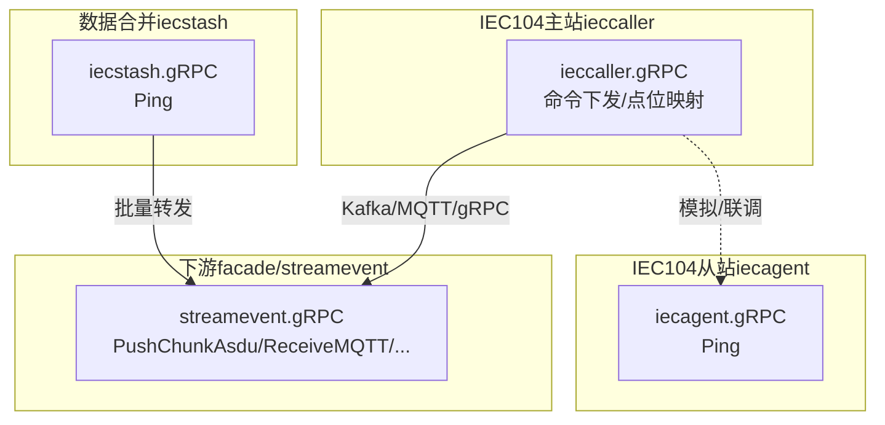
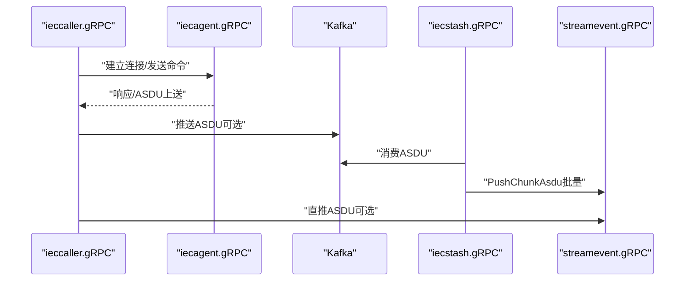
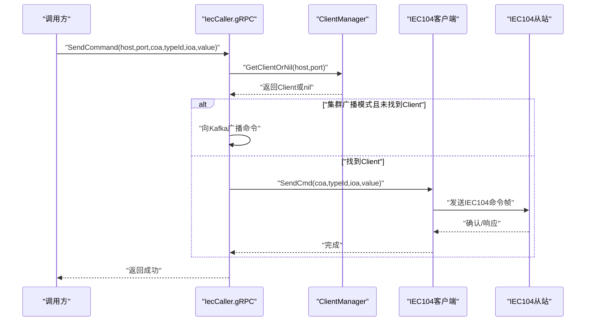
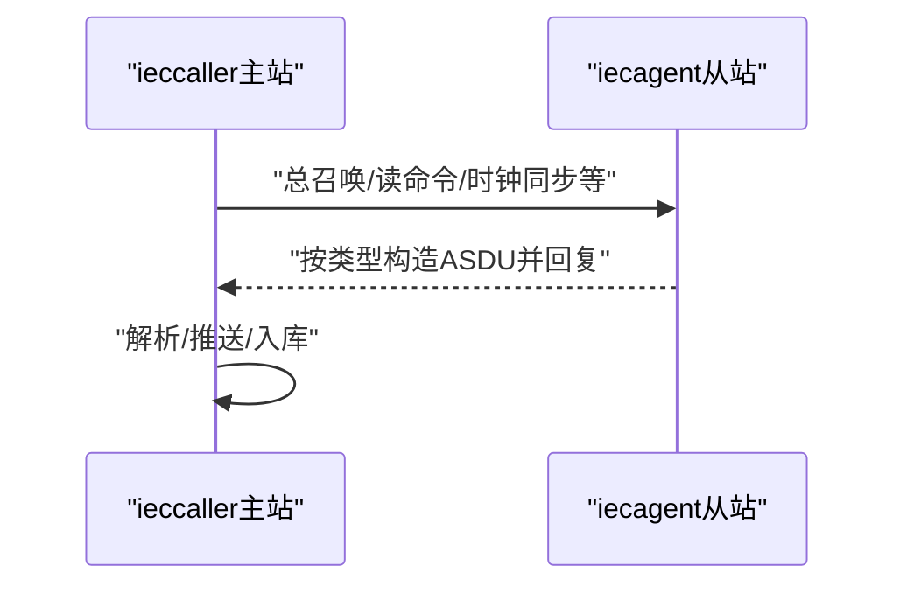
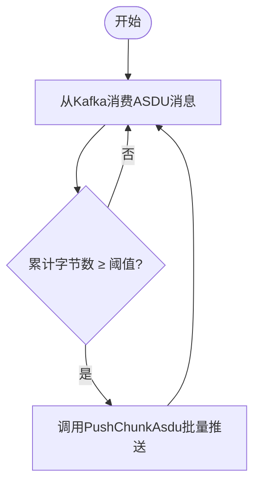
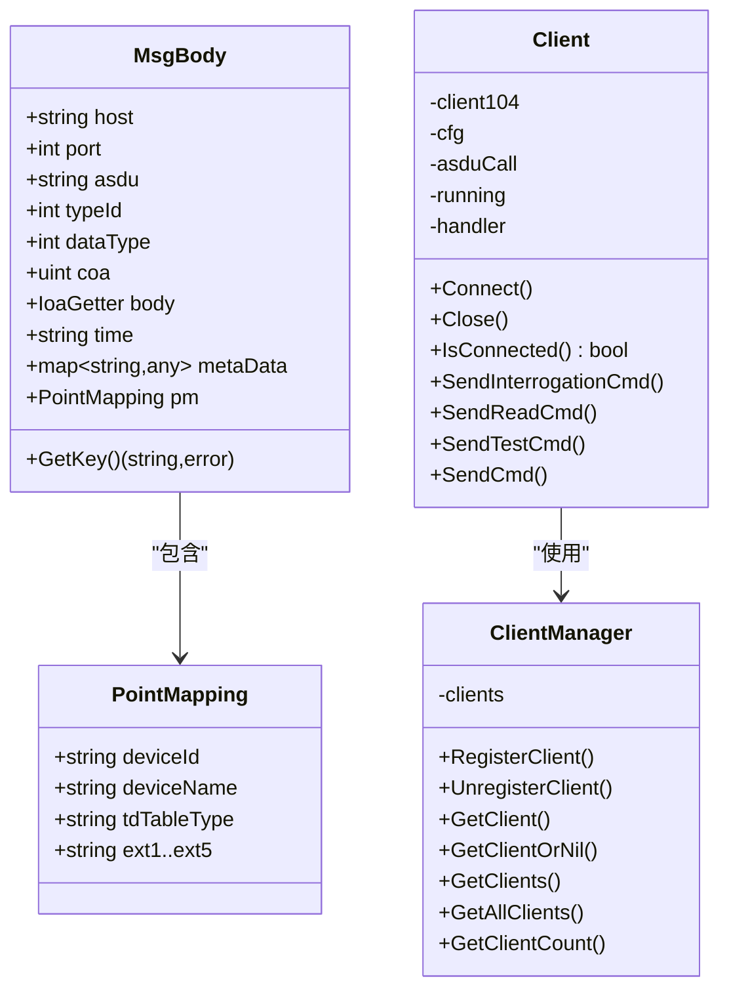
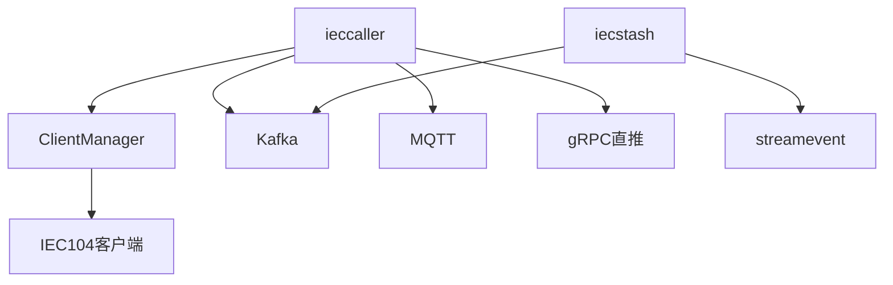

# IEC104服务群API

<cite>
**本文引用的文件**   
- [app/ieccaller/ieccaller.proto](file://app/ieccaller/ieccaller.proto)
- [app/iecagent/iecagent.proto](file://app/iecagent/iecagent.proto)
- [app/iecstash/iecstash.proto](file://app/iecstash/iecstash.proto)
- [common/iec104/types/types.go](file://common/iec104/types/types.go)
- [common/iec104/client/core.go](file://common/iec104/client/core.go)
- [common/iec104/client/clientmanager.go](file://common/iec104/client/clientmanager.go)
- [app/ieccaller/internal/logic/sendcommandlogic.go](file://app/ieccaller/internal/logic/sendcommandlogic.go)
- [app/ieccaller/internal/logic/sendinterrogationcmdlogic.go](file://app/ieccaller/internal/logic/sendinterrogationcmdlogic.go)
- [app/ieccaller/internal/logic/sendreadcmdlogic.go](file://app/ieccaller/internal/logic/sendreadcmdlogic.go)
- [app/ieccaller/internal/logic/sendtestcmdlogic.go](file://app/ieccaller/internal/logic/sendtestcmdlogic.go)
- [app/iecagent/internal/iec/iechandler.go](file://app/iecagent/internal/iec/iechandler.go)
- [app/ieccaller/etc/ieccaller.yaml](file://app/ieccaller/etc/ieccaller.yaml)
- [app/iecagent/etc/iecagent.yaml](file://app/iecagent/etc/iecagent.yaml)
- [docs/iec104.md](file://docs/iec104.md)
</cite>

## 目录
1. [简介](#简介)
2. [项目结构](#项目结构)
3. [核心组件](#核心组件)
4. [架构总览](#架构总览)
5. [详细组件分析](#详细组件分析)
6. [依赖分析](#依赖分析)
7. [性能考虑](#性能考虑)
8. [故障排查指南](#故障排查指南)
9. [结论](#结论)
10. [附录](#附录)

## 简介
本文件面向IEC60870-5-104（IEC104）服务群的gRPC API，系统性梳理主站服务（ieccaller）、代理/从站服务（iecagent）、数据合并服务（iecstash）以及与之配套的IEC104类型模型与客户端实现。文档覆盖以下要点：
- 主站服务的gRPC接口定义与参数结构，包括SendCommand、SendReadCmd、SendInterrogationCmd等，以及ASDU类型支持范围
- 代理服务的模拟从站能力与协议处理流程
- 数据合并服务的缓冲聚合、批量处理与一致性保障
- 完整的IEC104客户端示例（链接建立、参数设置、ASDU解析）
- IEC104规约标准、帧格式与错误处理的技术实现
- 设备映射、遥测数据处理与告警上报的接口说明

## 项目结构
IEC104服务群由四个主要模块组成：
- ieccaller：IEC104主站，负责与从站通信、命令下发、数据推送（Kafka/MQTT/gRPC）
- iecagent：IEC104从站模拟器，用于开发调试
- iecstash：Kafka消费者，按字节阈值聚合ASDU后批量推送到streamevent
- streamevent：统一流事件接口（facade层），此处作为下游接收方参与整体链路

图表来源
- [docs/iec104.md:14-20](file://docs/iec104.md#L14-L20)
- [app/ieccaller/etc/ieccaller.yaml:35-79](file://app/ieccaller/etc/ieccaller.yaml#L35-L79)
- [app/iecagent/etc/iecagent.yaml:1-14](file://app/iecagent/etc/iecagent.yaml#L1-L14)

章节来源
- [docs/iec104.md:14-328](file://docs/iec104.md#L14-L328)
- [app/ieccaller/etc/ieccaller.yaml:1-79](file://app/ieccaller/etc/ieccaller.yaml#L1-L79)
- [app/iecagent/etc/iecagent.yaml:1-14](file://app/iecagent/etc/iecagent.yaml#L1-L14)

## 核心组件
- 主站服务（ieccaller）：提供IEC104主站能力，支持总召唤、累计量召唤、读命令、测试命令、通用命令下发，以及点位映射查询与缓存清理；同时具备Kafka/MQTT/gRPC三通道数据推送能力。
- 代理服务（iecagent）：提供从站模拟能力，支持总召唤、累计量、读命令、时钟同步、命令接收等典型处理流程。
- 数据合并服务（iecstash）：消费Kafka中的ASDU消息，按字节阈值聚合后批量推送到下游（streamevent）。
- IEC104类型模型与客户端：定义IEC104消息体结构、点位映射模型与客户端封装，提供命令发送、连接管理、事件回调等。

章节来源
- [app/ieccaller/ieccaller.proto:9-30](file://app/ieccaller/ieccaller.proto#L9-L30)
- [app/iecagent/iecagent.proto:14-16](file://app/iecagent/iecagent.proto#L14-L16)
- [app/iecstash/iecstash.proto:13-15](file://app/iecstash/iecstash.proto#L13-L15)
- [common/iec104/types/types.go:17-323](file://common/iec104/types/types.go#L17-L323)
- [common/iec104/client/core.go:48-283](file://common/iec104/client/core.go#L48-L283)

## 架构总览
IEC104服务群的整体数据流如下：
- 从站侧（iecagent）模拟IEC104从站，ieccaller作为主站与其建立TCP连接并交互
- ieccaller接收ASDU后，依据点位映射与推送策略，将数据推送到Kafka/MQTT/gRPC
- iecstash消费Kafka消息，按配置阈值聚合后批量推送到streamevent
- streamevent接收后进行落库或进一步处理

图表来源
- [docs/iec104.md:14-20](file://docs/iec104.md#L14-L20)
- [app/ieccaller/etc/ieccaller.yaml:35-79](file://app/ieccaller/etc/ieccaller.yaml#L35-L79)

章节来源
- [docs/iec104.md:14-328](file://docs/iec104.md#L14-L328)

## 详细组件分析

### 主站服务（ieccaller）gRPC接口
- 服务定义与方法
  - IecCaller服务：提供命令下发、点位映射查询与缓存管理等接口
  - 关键方法：SendTestCmd、SendReadCmd、SendInterrogationCmd、SendCounterInterrogationCmd、SendCommand，以及QueryPointMappingById、QueryPointMappingByKey、PageListPointMapping、ClearPointMappingCache
- 参数结构与约束
  - SendTestCmdReq/SendReadCmdReq/SendInterrogationCmdReq/SendCounterInterrogationCmdReq：包含host、port、coa等基础参数
  - SendCommandReq：包含host、port、coa、typeId（命令类型）、ioa、value（通用值字符串）
  - 点位映射结构PbDevicePointMapping：包含tagStation、coa、ioa、deviceId、deviceName、tdTableType、enablePush及扩展字段等
- 业务流程
  - 命令下发：ieccaller通过ClientManager获取对应客户端，调用底层客户端执行具体命令
  - 点位映射：支持按ID、按key（tagStation+coa+ioa）查询，支持分页与批量缓存清理
- 配置要点
  - IecServerConfig：从站列表、定时总召唤/累计量召唤的COA列表、并发度、元数据透传
  - Kafka/MQTT/gRPC推送：可独立开启，MQTT支持模板化Topic
  - PushAsduChunkBytes：批量推送字节数阈值，默认1MB

图表来源
- [app/ieccaller/ieccaller.proto:9-30](file://app/ieccaller/ieccaller.proto#L9-L30)
- [app/ieccaller/internal/logic/sendcommandlogic.go:27-44](file://app/ieccaller/internal/logic/sendcommandlogic.go#L27-L44)
- [common/iec104/client/clientmanager.go:57-76](file://common/iec104/client/clientmanager.go#L57-L76)
- [common/iec104/client/core.go:212-231](file://common/iec104/client/core.go#L212-L231)

章节来源
- [app/ieccaller/ieccaller.proto:9-151](file://app/ieccaller/ieccaller.proto#L9-L151)
- [app/ieccaller/etc/ieccaller.yaml:22-79](file://app/ieccaller/etc/ieccaller.yaml#L22-L79)
- [app/ieccaller/internal/logic/sendcommandlogic.go:27-44](file://app/ieccaller/internal/logic/sendcommandlogic.go#L27-L44)
- [app/ieccaller/internal/logic/sendinterrogationcmdlogic.go:25-42](file://app/ieccaller/internal/logic/sendinterrogationcmdlogic.go#L25-L42)
- [app/ieccaller/internal/logic/sendreadcmdlogic.go:25-43](file://app/ieccaller/internal/logic/sendreadcmdlogic.go#L25-L43)
- [app/ieccaller/internal/logic/sendtestcmdlogic.go:25-41](file://app/ieccaller/internal/logic/sendtestcmdlogic.go#L25-L41)

### 代理服务（iecagent）gRPC接口
- 服务定义与方法
  - IecAgent服务：提供Ping接口，便于健康检查与连通性验证
- 从站模拟处理
  - OnInterrogation：响应总召唤，构造单点信息等
  - OnCounterInterrogation：响应累计量召唤
  - OnRead：响应读命令，示例中使用规一化值
  - OnClockSync：响应时钟同步，回发当前时间
  - OnResetProcess/OnDelayAcquisition/OnASDU：预留处理路径
- 配置要点
  - IecSetting：监听地址、端口、日志开关

图表来源
- [app/iecagent/iecagent.proto:14-16](file://app/iecagent/iecagent.proto#L14-L16)
- [app/iecagent/internal/iec/iechandler.go:25-123](file://app/iecagent/internal/iec/iechandler.go#L25-L123)
- [app/iecagent/etc/iecagent.yaml:10-14](file://app/iecagent/etc/iecagent.yaml#L10-L14)

章节来源
- [app/iecagent/iecagent.proto:14-16](file://app/iecagent/iecagent.proto#L14-L16)
- [app/iecagent/internal/iec/iechandler.go:25-123](file://app/iecagent/internal/iec/iechandler.go#L25-L123)
- [app/iecagent/etc/iecagent.yaml:10-14](file://app/iecagent/etc/iecagent.yaml#L10-L14)

### 数据合并服务（iecstash）gRPC接口
- 服务定义与方法
  - IecStash服务：提供Ping接口，便于健康检查
- 处理流程
  - 从Kafka订阅asdu主题，按字节阈值聚合（默认1MB），调用streamevent.PushChunkAsdu批量推送
- 配置要点
  - KafkaASDUConfig：Brokers、Group、Topic
  - StreamEventConf：下游端点
  - PushAsduChunkBytes：聚合阈值

图表来源
- [docs/iec104.md:130-155](file://docs/iec104.md#L130-L155)
- [app/iecstash/iecstash.proto:13-15](file://app/iecstash/iecstash.proto#L13-L15)

章节来源
- [docs/iec104.md:130-155](file://docs/iec104.md#L130-L155)
- [app/iecstash/iecstash.proto:13-15](file://app/iecstash/iecstash.proto#L13-L15)

### IEC104类型模型与客户端
- 类型模型（types.go）
  - MsgBody：ASDU消息体，包含host/port/asdu/typeId/dataType/coa/body/time/metaData/pm等
  - PointMapping：点位映射，包含deviceId/deviceName/tdTableType/ext1-ext5等
  - 多种信息体类型：单点、双点、规一化值、标度化值、短浮点、步位置、位串、累计量、继电保护事件等
  - IoaGetter接口：统一获取信息对象地址
- 客户端（client/core.go）
  - ClientConfig：host/port/autoConnect/reconnectInterval/logEnable/metaData
  - Client：封装cs104客户端，提供连接、断开、命令发送、事件回调等
  - 命令发送：SendInterrogationCmd、SendCounterInterrogationCmd、SendClockSynchronizationCmd、SendReadCmd、SendResetProcessCmd、SendTestCmd、SendCmd等
  - 连接事件：Connected/Disconnected/ServerActive
- 客户端管理（clientmanager.go）
  - ClientManager：注册/注销/查找客户端，统计连接状态

图表来源
- [common/iec104/types/types.go:17-323](file://common/iec104/types/types.go#L17-L323)
- [common/iec104/client/core.go:48-283](file://common/iec104/client/core.go#L48-L283)
- [common/iec104/client/clientmanager.go:11-145](file://common/iec104/client/clientmanager.go#L11-L145)

章节来源
- [common/iec104/types/types.go:17-323](file://common/iec104/types/types.go#L17-L323)
- [common/iec104/client/core.go:48-446](file://common/iec104/client/core.go#L48-L446)
- [common/iec104/client/clientmanager.go:11-145](file://common/iec104/client/clientmanager.go#L11-L145)

## 依赖分析
- ieccaller依赖
  - IEC104客户端封装：通过ClientManager管理多个CS104客户端，按host:port路由命令
  - 配置驱动：IecServerConfig决定从站列表、定时任务、元数据透传
  - 推送通道：Kafka/MQTT/gRPC三通道可独立启用
- iecagent依赖
  - IEC104从站处理：实现多种命令回调，构造ASDU响应
- iecstash依赖
  - Kafka消费与批量聚合：基于ChunkMessagesPusher按字节阈值聚合
  - 下游依赖：调用streamevent.PushChunkAsdu

图表来源
- [common/iec104/client/clientmanager.go:11-145](file://common/iec104/client/clientmanager.go#L11-L145)
- [common/iec104/client/core.go:48-283](file://common/iec104/client/core.go#L48-L283)
- [docs/iec104.md:14-20](file://docs/iec104.md#L14-L20)

章节来源
- [common/iec104/client/clientmanager.go:11-145](file://common/iec104/client/clientmanager.go#L11-L145)
- [common/iec104/client/core.go:48-283](file://common/iec104/client/core.go#L48-L283)
- [docs/iec104.md:14-328](file://docs/iec104.md#L14-L328)

## 性能考虑
- 批量聚合：iecstash按字节阈值（默认1MB）聚合，降低下游压力
- 并发度：ieccaller支持TaskConcurrency配置，提升多从站并发处理能力
- 自动重连：客户端支持自动重连与重连间隔配置，增强稳定性
- 推送策略：弱校验模式下仅在明确禁用推送时才不推送，确保数据可达性

章节来源
- [docs/iec104.md:130-155](file://docs/iec104.md#L130-L155)
- [app/ieccaller/etc/ieccaller.yaml:34-34](file://app/ieccaller/etc/ieccaller.yaml#L34-L34)
- [common/iec104/client/core.go:270-283](file://common/iec104/client/core.go#L270-L283)

## 故障排查指南
- 连接问题
  - 检查ieccaller配置中的IecServerConfig，确认host/port正确
  - 查看ClientManager统计日志，核对已注册客户端数量与连接状态
- 命令下发失败
  - 确认目标从站是否存在对应Client；若不存在且处于集群广播模式，检查Kafka广播主题与消费组
  - 校验SendCommand的typeId与value格式是否符合客户端doSend的类型转换要求
- 推送异常
  - Kafka/MQTT/gRPC通道分别检查对应配置与目标端点
  - 若启用iecstash，确认Kafka主题与消费组配置一致
- 日志定位
  - ieccaller与iecagent均提供日志配置，建议在调试阶段提高日志级别

章节来源
- [common/iec104/client/clientmanager.go:126-144](file://common/iec104/client/clientmanager.go#L126-L144)
- [common/iec104/client/core.go:304-436](file://common/iec104/client/core.go#L304-L436)
- [app/ieccaller/etc/ieccaller.yaml:7-13](file://app/ieccaller/etc/ieccaller.yaml#L7-L13)
- [app/iecagent/etc/iecagent.yaml:4-8](file://app/iecagent/etc/iecagent.yaml#L4-L8)

## 结论
IEC104服务群以ieccaller为核心，结合iecagent、iecstash与facade层，形成从“主站通信—数据聚合—下游落库”的完整链路。通过gRPC接口与配置化能力，平台实现了高并发、可扩展、可运维的IEC104数据采集与转发体系。建议在生产环境中合理配置批量阈值、并发度与推送通道，并结合日志与监控持续优化。

## 附录

### IEC104主站接口参数与ASDU类型支持
- SendCommand
  - 参数：host、port、coa、typeId（命令类型）、ioa、value（通用字符串）
  - 支持命令类型：单点、双点、步位置、设定值（规一化/标度化/短浮点）、位串等
- SendReadCmd
  - 参数：host、port、coa、ioa
- SendInterrogationCmd
  - 参数：host、port、coa
- SendCounterInterrogationCmd
  - 参数：host、port、coa
- 点位映射
  - 查询：按ID、按key（tagStation+coa+ioa）
  - 列表：分页查询
  - 缓存：支持批量清理

章节来源
- [app/ieccaller/ieccaller.proto:40-87](file://app/ieccaller/ieccaller.proto#L40-L87)
- [app/ieccaller/ieccaller.proto:107-151](file://app/ieccaller/ieccaller.proto#L107-L151)
- [common/iec104/types/types.go:60-323](file://common/iec104/types/types.go#L60-L323)

### IEC104客户端示例（链接建立、参数设置、ASDU解析）
- 链接建立
  - 使用ClientConfig配置host/port/自动重连/日志等
  - 通过ClientManager注册客户端，等待连接事件回调
- 参数设置
  - 在IecServerConfig中配置从站列表、定时任务COA、元数据透传
  - 在Kafka/MQTT/gRPC配置中启用所需通道
- ASDU解析
  - 通过MsgBody与各类信息体结构解析ASDU内容
  - 使用PointMapping进行设备映射与扩展字段提取

章节来源
- [common/iec104/client/core.go:19-37](file://common/iec104/client/core.go#L19-L37)
- [common/iec104/client/core.go:119-147](file://common/iec104/client/core.go#L119-L147)
- [common/iec104/types/types.go:17-40](file://common/iec104/types/types.go#L17-L40)
- [app/ieccaller/etc/ieccaller.yaml:22-79](file://app/ieccaller/etc/ieccaller.yaml#L22-L79)

### IEC104规约标准、帧格式与错误处理
- 规约标准
  - 支持监视方向12种ASDU类型（含无时标/带时标/CP56Time2a变体）与6种命令类型
- 帧格式
  - 包含公共地址（COA）、信息对象地址（IOA）、品质描述符（QDS/QDP等）、时标（CP56/CP24）等
- 错误处理
  - 客户端未连接时返回特定错误
  - doSend对不同typeId进行类型转换与参数校验，失败时返回错误

章节来源
- [docs/iec104.md:243-247](file://docs/iec104.md#L243-L247)
- [common/iec104/client/core.go:304-436](file://common/iec104/client/core.go#L304-L436)

### 设备映射、遥测数据处理与告警上报
- 设备映射
  - PbDevicePointMapping包含deviceId/deviceName/tdTableType/enablePush/ext1-ext5等
- 遥测数据处理
  - 支持规一化值、标度化值、短浮点等多种遥测类型
- 告警上报
  - 通过ext1等扩展字段进行主题拆分与路由，配合MQTT模板Topic实现灵活上报

章节来源
- [app/ieccaller/ieccaller.proto:89-105](file://app/ieccaller/ieccaller.proto#L89-L105)
- [common/iec104/types/types.go:98-206](file://common/iec104/types/types.go#L98-L206)
- [docs/iec104.md:291-316](file://docs/iec104.md#L291-L316)