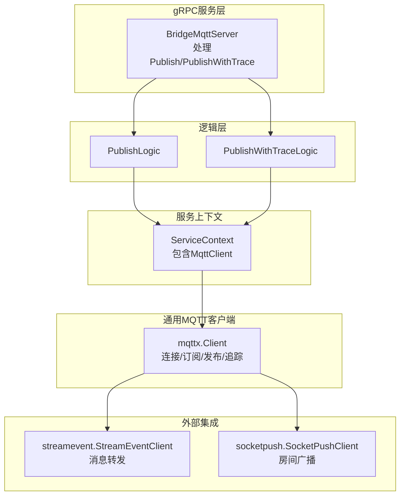
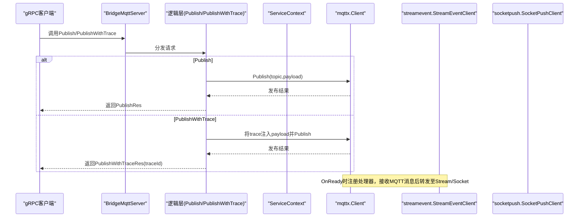
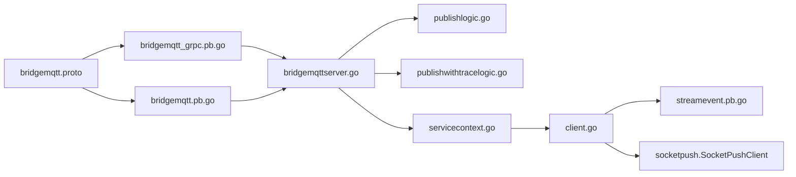

# MQTT桥接服务API

<cite>
**本文档引用的文件**
- [bridgemqtt.proto](file://app/bridgemqtt/bridgemqtt.proto)
- [bridgemqtt_grpc.pb.go](file://app/bridgemqtt/bridgemqtt/bridgemqtt_grpc.pb.go)
- [bridgemqtt.pb.go](file://app/bridgemqtt/bridgemqtt/bridgemqtt.pb.go)
- [bridgemqttserver.go](file://app/bridgemqtt/internal/server/bridgemqttserver.go)
- [publishlogic.go](file://app/bridgemqtt/internal/logic/publishlogic.go)
- [publishwithtracelogic.go](file://app/bridgemqtt/internal/logic/publishwithtracelogic.go)
- [servicecontext.go](file://app/bridgemqtt/internal/svc/servicecontext.go)
- [config.go](file://app/bridgemqtt/internal/config/config.go)
- [bridgemqtt.yaml](file://app/bridgemqtt/etc/bridgemqtt.yaml)
- [client.go](file://common/mqttx/client.go)
- [config.go](file://common/mqttx/config.go)
- [message.go](file://common/mqttx/message.go)
- [trace.go](file://common/mqttx/trace.go)
- [mqttstreamhandler.go](file://app/bridgemqtt/internal/handler/mqttstreamhandler.go)
- [streamevent.pb.go](file://facade/streamevent/streamevent/streamevent.pb.go)
</cite>

## 更新摘要
**所做更改**
- 删除了Ping健康检查接口的相关内容
- 更新了协议定义，仅保留Publish和PublishWithTrace两个核心接口
- 移除了Ping相关的gRPC处理逻辑和业务实现
- 简化了服务架构图和API定义说明
- 更新了配置文件和客户端示例

## 目录
1. [简介](#简介)
2. [项目结构](#项目结构)
3. [核心组件](#核心组件)
4. [架构总览](#架构总览)
5. [详细组件分析](#详细组件分析)
6. [依赖关系分析](#依赖关系分析)
7. [性能考量](#性能考量)
8. [故障排查指南](#故障排查指南)
9. [结论](#结论)
10. [附录](#附录)

## 简介
本文件系统化梳理MQTT桥接服务的gRPC API，覆盖消息发布、带追踪发布与订阅管理能力。文档重点说明：
- Publish/PublishWithTrace接口的参数结构与QoS行为
- 订阅管理与主题过滤机制
- 完整MQTT客户端示例（连接配置、SSL/TLS、重连机制）
- 消息路由、主题映射与协议转换实现
- MQTT版本兼容性、性能调优与安全配置

**重要更新**：服务协议已简化，移除了Ping健康检查接口，专注于核心消息发布功能。

## 项目结构
MQTT桥接服务采用go-zero框架，基于proto定义gRPC接口，通过逻辑层调用通用MQTT客户端库完成消息发布与订阅。

**图表来源**
- [bridgemqttserver.go:15-37](file://app/bridgemqtt/internal/server/bridgemqttserver.go#L15-L37)
- [servicecontext.go:16-61](file://app/bridgemqtt/internal/svc/servicecontext.go#L16-L61)
- [client.go:34-46](file://common/mqttx/client.go#L34-L46)

**章节来源**
- [bridgemqtt.proto:10-15](file://app/bridgemqtt/bridgemqtt.proto#L10-L15)
- [bridgemqttserver.go:15-37](file://app/bridgemqtt/internal/server/bridgemqttserver.go#L15-L37)
- [servicecontext.go:16-61](file://app/bridgemqtt/internal/svc/servicecontext.go#L16-L61)

## 核心组件
- gRPC服务：BridgeMqtt，提供Publish、PublishWithTrace两个接口
- 逻辑层：分别封装Publish、PublishWithTrace的业务逻辑
- 服务上下文：持有MQTT客户端实例，并在OnReady时注册消息处理器
- 通用MQTT客户端：封装连接、订阅、发布、追踪与指标统计
- 外部集成：将MQTT消息转发至流事件服务与Socket推送服务

**章节来源**
- [bridgemqtt.proto:10-15](file://app/bridgemqtt/bridgemqtt.proto#L10-L15)
- [bridgemqtt_grpc.pb.go:40-76](file://app/bridgemqtt/bridgemqtt/bridgemqtt_grpc.pb.go#L40-L76)
- [publishlogic.go:26-34](file://app/bridgemqtt/internal/logic/publishlogic.go#L26-L34)
- [publishwithtracelogic.go:30-48](file://app/bridgemqtt/internal/logic/publishwithtracelogic.go#L30-L48)
- [servicecontext.go:47-61](file://app/bridgemqtt/internal/svc/servicecontext.go#L47-L61)
- [client.go:34-46](file://common/mqttx/client.go#L34-L46)

## 架构总览
MQTT桥接服务的调用链路如下：

**图表来源**
- [bridgemqttserver.go:26-37](file://app/bridgemqtt/internal/server/bridgemqttserver.go#L26-L37)
- [publishlogic.go:26-34](file://app/bridgemqtt/internal/logic/publishlogic.go#L26-L34)
- [publishwithtracelogic.go:30-48](file://app/bridgemqtt/internal/logic/publishwithtracelogic.go#L30-L48)
- [servicecontext.go:47-61](file://app/bridgemqtt/internal/svc/servicecontext.go#L47-L61)
- [mqttstreamhandler.go:109-188](file://app/bridgemqtt/internal/handler/mqttstreamhandler.go#L109-L188)

## 详细组件分析

### gRPC接口定义与数据模型
- 服务：BridgeMqtt
  - Publish(PublishReq) -> PublishRes
  - PublishWithTrace(PublishWithTraceReq) -> PublishWithTraceRes

- 请求/响应模型
  - PublishReq/PublishRes：发布消息，包含topic与payload
  - PublishWithTraceReq/PublishWithTraceRes：带traceId的发布，返回traceId

**章节来源**
- [bridgemqtt.proto:10-15](file://app/bridgemqtt/bridgemqtt.proto#L10-L15)
- [bridgemqtt.proto:18-25](file://app/bridgemqtt/bridgemqtt.proto#L18-L25)
- [bridgemqtt.proto:26-33](file://app/bridgemqtt/bridgemqtt.proto#L26-L33)

### Publish接口（消息发布）
- 参数结构
  - topic：目标主题
  - payload：消息体（字节）
- 行为说明
  - 使用通用MQTT客户端进行发布
  - 发布QoS由客户端配置决定，默认值在客户端初始化时校验与修正
- 错误处理
  - 连接断开或超时会返回错误

**章节来源**
- [publishlogic.go:26-34](file://app/bridgemqtt/internal/logic/publishlogic.go#L26-L34)
- [client.go:326-339](file://common/mqttx/client.go#L326-L339)

### PublishWithTrace接口（带追踪发布）
- 参数结构
  - topic：目标主题
  - payload：消息体（字节）
- 行为说明
  - 从上下文提取traceID，封装为MQTT消息载体，注入到payload中
  - 通过JSON序列化后发布，便于下游消费端提取链路信息
- 返回
  - 返回当前请求的traceId，便于调用方关联

**章节来源**
- [publishwithtracelogic.go:30-48](file://app/bridgemqtt/internal/logic/publishwithtracelogic.go#L30-L48)
- [message.go:14-21](file://common/mqttx/message.go#L14-L21)
- [trace.go:19-37](file://common/mqttx/trace.go#L19-L37)

### 订阅管理与主题过滤
- 配置驱动
  - 在配置文件中声明初始订阅主题列表
  - 可选的主题到事件映射，用于消息转发时选择事件名
- 运行时行为
  - OnReady回调中，按订阅主题注册处理器
  - 支持手动订阅与自动订阅策略
  - 重连后自动恢复订阅

**章节来源**
- [bridgemqtt.yaml:26-30](file://app/bridgemqtt/etc/bridgemqtt.yaml#L26-L30)
- [bridgemqtt.yaml:31-35](file://app/bridgemqtt/etc/bridgemqtt.yaml#L31-L35)
- [servicecontext.go:47-61](file://app/bridgemqtt/internal/svc/servicecontext.go#L47-L61)
- [client.go:177-194](file://common/mqttx/client.go#L177-L194)
- [client.go:201-231](file://common/mqttx/client.go#L201-L231)
- [client.go:239-252](file://common/mqttx/client.go#L239-L252)

### 客户端状态监控与心跳检测
- 心跳与超时
  - 客户端配置包含KeepAlive与Timeout字段，用于心跳间隔与操作超时
  - 连接建立时设置自动重连与心跳
- 状态回调
  - OnConnect：连接成功后触发，用于恢复订阅
  - OnConnectionLost：连接丢失时触发，清空已订阅集合以待重连后重建
- **更新**：移除了Ping接口，简化了健康检查机制

**章节来源**
- [config.go:9-23](file://app/bridgemqtt/internal/config/config.go#L9-L23)
- [client.go:115-144](file://common/mqttx/client.go#L115-L144)
- [client.go:146-170](file://common/mqttx/client.go#L146-L170)

### 消息路由、主题映射与协议转换
- 消息路由
  - 按主题模板匹配处理器，支持通配符主题（如#）
  - 未匹配处理器时使用默认处理器记录日志
- 主题映射
  - 配置中可将特定主题映射为事件名，用于Socket推送
- 协议转换
  - MQTT消息体可被包装为统一消息格式（含payload与headers），便于跨服务传递
  - 支持OpenTelemetry上下文传播，实现跨服务链路追踪

**章节来源**
- [mqttstreamhandler.go:121-128](file://app/bridgemqtt/internal/handler/mqttstreamhandler.go#L121-L128)
- [mqttstreamhandler.go:130-188](file://app/bridgemqtt/internal/handler/mqttstreamhandler.go#L130-L188)
- [message.go:14-21](file://common/mqttx/message.go#L14-L21)
- [trace.go:19-37](file://common/mqttx/trace.go#L19-L37)

### 完整MQTT客户端示例（连接配置、SSL/TLS、重连机制）
- 连接配置
  - Broker：MQTT代理地址列表
  - ClientID：客户端标识，未指定则自动生成
  - Username/Password：认证凭据
  - Qos：发布QoS（0/1/2），非法值会被修正
  - Timeout/KeepAlive：超时与心跳
  - AutoSubscribe/SubscribeTopics：自动订阅与初始订阅主题
  - EventMapping/DefaultEvent：主题到事件映射
- SSL/TLS
  - 客户端选项中可配置TLS参数（例如证书、主机名校验等），具体取决于底层MQTT库支持
- 重连机制
  - 启用自动重连；连接丢失时清空订阅集合，重连成功后恢复订阅

**章节来源**
- [bridgemqtt.yaml:19-48](file://app/bridgemqtt/etc/bridgemqtt.yaml#L19-L48)
- [client.go:59-100](file://common/mqttx/client.go#L59-L100)
- [client.go:146-170](file://common/mqttx/client.go#L146-L170)
- [client.go:239-252](file://common/mqttx/client.go#L239-L252)

### QoS级别设置与语义
- 客户端初始化时对QoS进行合法性校验，非法值会被修正
- 发布时使用客户端配置的QoS；订阅时使用客户端配置的QoS
- 不同QoS级别的可靠性与性能差异：
  - 0：最多一次，低开销
  - 1：至少一次，可能重复
  - 2：恰好一次，最高可靠但开销最大

**章节来源**
- [client.go:102-113](file://common/mqttx/client.go#L102-L113)
- [client.go:209-231](file://common/mqttx/client.go#L209-L231)
- [client.go:326-339](file://common/mqttx/client.go#L326-L339)

### OpenTelemetry链路追踪
- 发布追踪
  - 为发布操作创建Producer类型的span，携带客户端ID、主题、QoS等属性
- 消费追踪
  - 为消息消费创建Consumer类型的span，携带消息ID、主题、QoS等属性
- 上下文传播
  - 通过TextMapCarrier将trace上下文注入MQTT消息头，实现跨服务链路透传

**章节来源**
- [publishwithtracelogic.go:30-48](file://app/bridgemqtt/internal/logic/publishwithtracelogic.go#L30-L48)
- [trace.go:19-37](file://common/mqttx/trace.go#L19-L37)
- [client.go:311-324](file://common/mqttx/client.go#L311-L324)

## 依赖关系分析
- 服务端依赖
  - gRPC生成代码：bridgemqtt_grpc.pb.go、bridgemqtt.pb.go
  - 逻辑层：publishlogic.go、publishwithtracelogic.go
  - 服务上下文：servicecontext.go
  - 通用MQTT客户端：client.go
  - 外部服务：streamevent.pb.go（消息转发）、socket推送（房间广播）
- 配置依赖
  - bridgemqtt.yaml：服务监听、日志、Nacos、MQTT配置、下游RPC客户端配置

**图表来源**
- [bridgemqtt.proto:10-15](file://app/bridgemqtt/bridgemqtt.proto#L10-L15)
- [bridgemqtt_grpc.pb.go:40-76](file://app/bridgemqtt/bridgemqtt/bridgemqtt_grpc.pb.go#L40-L76)
- [bridgemqtt.pb.go:214-300](file://app/bridgemqtt/bridgemqtt/bridgemqtt.pb.go#L214-L300)
- [bridgemqttserver.go:26-37](file://app/bridgemqtt/internal/server/bridgemqttserver.go#L26-L37)
- [servicecontext.go:47-61](file://app/bridgemqtt/internal/svc/servicecontext.go#L47-L61)
- [client.go:34-46](file://common/mqttx/client.go#L34-L46)
- [streamevent.pb.go:174-244](file://facade/streamevent/streamevent/streamevent.pb.go#L174-L244)

**章节来源**
- [bridgemqtt_grpc.pb.go:40-76](file://app/bridgemqtt/bridgemqtt/bridgemqtt_grpc.pb.go#L40-L76)
- [bridgemqtt.pb.go:214-300](file://app/bridgemqtt/bridgemqtt/bridgemqtt.pb.go#L214-L300)
- [bridgemqttserver.go:26-37](file://app/bridgemqtt/internal/server/bridgemqttserver.go#L26-L37)
- [servicecontext.go:47-61](file://app/bridgemqtt/internal/svc/servicecontext.go#L47-L61)

## 性能考量
- 最大消息大小
  - gRPC客户端默认CallOptions中限制发送最大消息大小（示例为50MB），避免过大消息导致内存压力
- 并发与异步
  - 消息消费侧使用任务运行器并发调度，提升吞吐
- 指标与日志
  - 客户端内置指标统计与日志管理，支持按主题粒度控制日志频率与负载
- QoS权衡
  - 根据可靠性需求选择合适QoS，平衡延迟与重复率

**章节来源**
- [servicecontext.go:29-33](file://app/bridgemqtt/internal/svc/servicecontext.go#L29-L33)
- [servicecontext.go:42-44](file://app/bridgemqtt/internal/svc/servicecontext.go#L42-L44)
- [mqttstreamhandler.go:114-118](file://app/bridgemqtt/internal/handler/mqttstreamhandler.go#L114-L118)
- [client.go:102-113](file://common/mqttx/client.go#L102-L113)

## 故障排查指南
- 连接失败
  - 检查Broker地址、认证信息、超时设置
  - 查看OnConnect/OnConnectionLost回调日志
- 发布超时
  - 检查Timeout配置与网络状况
  - 确认QoS与Broker支持情况
- 订阅异常
  - 确认SubscribeTopics配置与主题通配符
  - OnReady后是否正确恢复订阅
- 追踪无效
  - 确认上下文传播是否正确注入到消息头
  - 检查下游服务是否启用链路追踪

**章节来源**
- [client.go:146-170](file://common/mqttx/client.go#L146-L170)
- [client.go:170-175](file://common/mqttx/client.go#L170-L175)
- [client.go:222-225](file://common/mqttx/client.go#L222-L225)
- [publishwithtracelogic.go:32-39](file://app/bridgemqtt/internal/logic/publishwithtracelogic.go#L32-L39)

## 结论
MQTT桥接服务通过简化的gRPC接口与通用MQTT客户端实现消息发布、订阅与链路追踪能力。其配置化设计支持灵活的主题映射与事件转发，结合OpenTelemetry实现跨服务可观测性。通过合理的QoS与性能参数调优，可在可靠性与性能之间取得平衡。

## 附录

### API定义一览
- Publish
  - 请求：PublishReq.topic, PublishReq.payload
  - 响应：PublishRes
- PublishWithTrace
  - 请求：PublishWithTraceReq.topic, PublishWithTraceReq.payload
  - 响应：PublishWithTraceRes.traceId

**章节来源**
- [bridgemqtt.proto:10-15](file://app/bridgemqtt/bridgemqtt.proto#L10-L15)
- [bridgemqtt.proto:18-33](file://app/bridgemqtt/bridgemqtt.proto#L18-L33)

### 配置项说明（关键）
- 服务监听与日志
  - Name、ListenOn、Timeout、Log.Encoding/Path/Level/KeepDays
- Nacos配置
  - IsRegister、Host、Port、Username、PassWord、NamespaceId、ServiceName
- MQTT配置
  - Broker、ClientID、Username、Password、Qos、Timeout、KeepAlive、AutoSubscribe、SubscribeTopics、EventMapping、DefaultEvent
- 下游RPC客户端
  - StreamEventConf/SocketPushConf：Endpoints、NonBlock、Timeout

**章节来源**
- [bridgemqtt.yaml:1-48](file://app/bridgemqtt/etc/bridgemqtt.yaml#L1-L48)
- [config.go:9-23](file://app/bridgemqtt/internal/config/config.go#L9-L23)