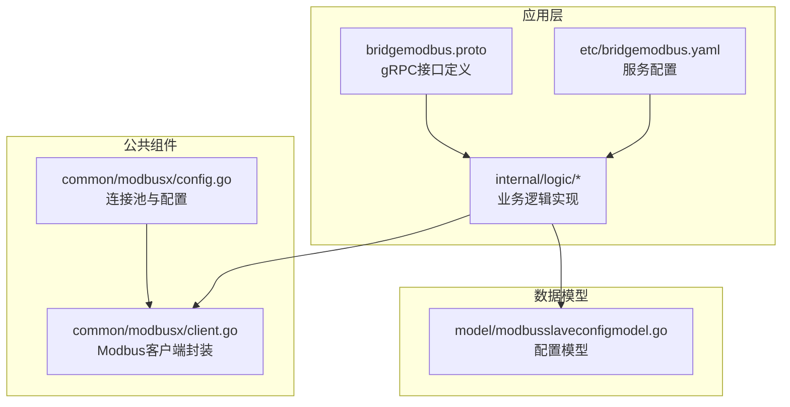
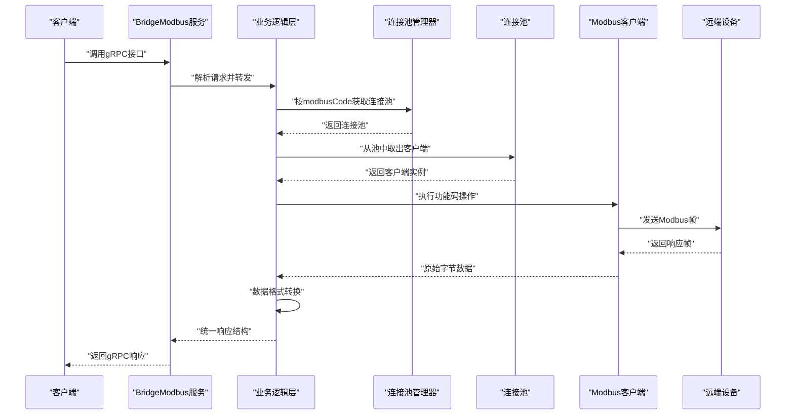
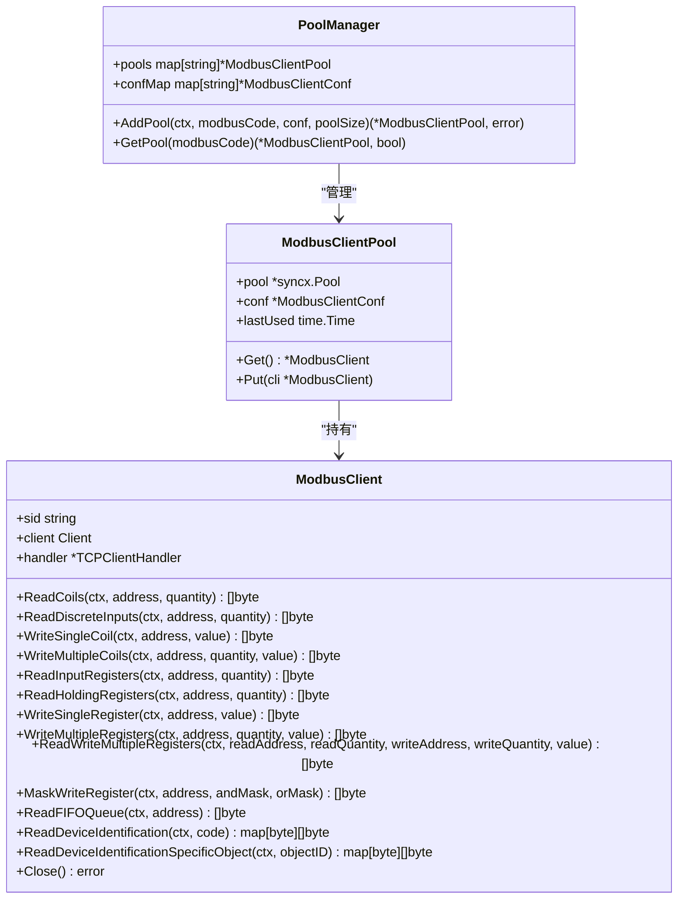
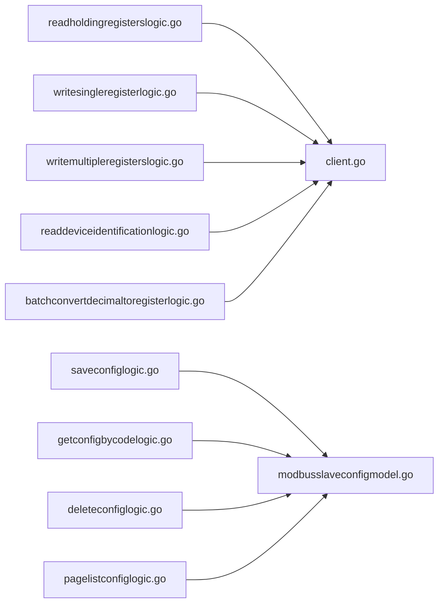

# Modbus桥接服务API

<cite>
**本文引用的文件**
- [bridgemodbus.proto](file://app/bridgemodbus/bridgemodbus.proto)
- [client.go](file://common/modbusx/client.go)
- [config.go](file://common/modbusx/config.go)
- [readholdingregisterslogic.go](file://app/bridgemodbus/internal/logic/readholdingregisterslogic.go)
- [writesingleregisterlogic.go](file://app/bridgemodbus/internal/logic/writesingleregisterlogic.go)
- [saveconfiglogic.go](file://app/bridgemodbus/internal/logic/saveconfiglogic.go)
- [getconfigbycodelogic.go](file://app/bridgemodbus/internal/logic/getconfigbycodelogic.go)
- [deleteconfiglogic.go](file://app/bridgemodbus/internal/logic/deleteconfiglogic.go)
- [pagelistconfiglogic.go](file://app/bridgemodbus/internal/logic/pagelistconfiglogic.go)
- [readdeviceidentificationlogic.go](file://app/bridgemodbus/internal/logic/readdeviceidentificationlogic.go)
- [batchconvertdecimaltoregisterlogic.go](file://app/bridgemodbus/internal/logic/batchconvertdecimaltoregisterlogic.go)
- [readcoilslogic.go](file://app/bridgemodbus/internal/logic/readcoilslogic.go)
- [writemultipleregisterslogic.go](file://app/bridgemodbus/internal/logic/writemultipleregisterslogic.go)
- [bridgemodbus.yaml](file://app/bridgemodbus/etc/bridgemodbus.yaml)
- [modbusslaveconfigmodel.go](file://model/modbusslaveconfigmodel.go)
</cite>

## 目录
1. [简介](#简介)
2. [项目结构](#项目结构)
3. [核心组件](#核心组件)
4. [架构总览](#架构总览)
5. [详细组件分析](#详细组件分析)
6. [依赖关系分析](#依赖关系分析)
7. [性能考量](#性能考量)
8. [故障排查指南](#故障排查指南)
9. [结论](#结论)
10. [附录](#附录)

## 简介
本文件面向Modbus桥接服务的gRPC API，系统性梳理设备配置、寄存器读写、批量操作、设备识别与数据格式转换等能力。文档覆盖以下关键主题：
- gRPC接口清单与参数结构
- Modbus功能码映射与数据格式转换
- 设备配置管理（新增/更新/删除/分页/按编码查询）
- 批量数据处理与性能优化建议
- 完整的Modbus客户端示例（TCP/TLS、数据类型转换、错误处理）
- 地址映射、协议适配与连接管理

## 项目结构
Modbus桥接服务位于应用层的“bridgemodbus”模块，采用Go Zero框架，通过Protocol Buffers定义gRPC接口，并在internal/logic中实现各接口的业务逻辑。公共组件位于common/modbusx，负责Modbus客户端封装、连接池与TLS配置。

图表来源
- [bridgemodbus.proto](file://app/bridgemodbus/bridgemodbus.proto)
- [client.go](file://common/modbusx/client.go)
- [config.go](file://common/modbusx/config.go)
- [bridgemodbus.yaml](file://app/bridgemodbus/etc/bridgemodbus.yaml)
- [modbusslaveconfigmodel.go](file://model/modbusslaveconfigmodel.go)

章节来源
- [bridgemodbus.proto](file://app/bridgemodbus/bridgemodbus.proto)
- [client.go](file://common/modbusx/client.go)
- [config.go](file://common/modbusx/config.go)
- [bridgemodbus.yaml](file://app/bridgemodbus/etc/bridgemodbus.yaml)
- [modbusslaveconfigmodel.go](file://model/modbusslaveconfigmodel.go)

## 核心组件
- gRPC服务定义：集中于bridgemodbus.proto，包含配置管理、Bit访问、16位寄存器访问、设备识别与批量转换等接口。
- Modbus客户端封装：封装底层modbus库，提供TCP/TLS连接、超时控制、日志与连接池管理。
- 业务逻辑层：每个接口对应一个logic文件，负责参数校验、调用Modbus客户端、数据格式转换与返回结果。
- 数据模型：Modbus从站配置模型，支撑配置的持久化与查询。

章节来源
- [bridgemodbus.proto](file://app/bridgemodbus/bridgemodbus.proto)
- [client.go](file://common/modbusx/client.go)
- [config.go](file://common/modbusx/config.go)
- [modbusslaveconfigmodel.go](file://model/modbusslaveconfigmodel.go)

## 架构总览
Modbus桥接服务的调用链路如下：
- 客户端发起gRPC请求
- 业务逻辑层根据modbusCode获取连接池，获取客户端实例
- 调用底层Modbus客户端执行具体功能码操作
- 将原始字节数据转换为多格式输出（无符号/有符号整数、十六进制、二进制、字节数组）
- 返回统一的gRPC响应

图表来源
- [client.go](file://common/modbusx/client.go)
- [config.go](file://common/modbusx/config.go)
- [readholdingregisterslogic.go](file://app/bridgemodbus/internal/logic/readholdingregisterslogic.go)
- [writesingleregisterlogic.go](file://app/bridgemodbus/internal/logic/writesingleregisterlogic.go)

## 详细组件分析

### 配置管理接口
- SaveConfig
  - 作用：新增或更新Modbus链路配置
  - 参数：modbusCode、slaveAddress、slave
  - 行为：若存在则更新，否则插入新记录
  - 返回：配置主键ID
- DeleteConfig
  - 作用：按ID批量删除配置
  - 参数：ids[]
  - 返回：空
- PageListConfig
  - 作用：分页查询配置列表
  - 参数：page、pageSize、keyword（模糊匹配modbusCode）、status（可选过滤）
  - 返回：total、cfg[]
- GetConfigByCode
  - 作用：按编码查询配置详情
  - 参数：modbusCode
  - 返回：cfg
- BatchGetConfigByCode
  - 作用：按编码数组批量查询配置
  - 参数：modbusCode[]
  - 返回：cfg[]

章节来源
- [bridgemodbus.proto](file://app/bridgemodbus/bridgemodbus.proto)
- [saveconfiglogic.go](file://app/bridgemodbus/internal/logic/saveconfiglogic.go)
- [deleteconfiglogic.go](file://app/bridgemodbus/internal/logic/deleteconfiglogic.go)
- [pagelistconfiglogic.go](file://app/bridgemodbus/internal/logic/pagelistconfiglogic.go)
- [getconfigbycodelogic.go](file://app/bridgemodbus/internal/logic/getconfigbycodelogic.go)

### Bit访问接口
- ReadCoils
  - 功能码：0x01
  - 参数：modbusCode、address、quantity（1–2000）
  - 返回：results（按位）、values（布尔数组）
- ReadDiscreteInputs
  - 功能码：0x02
  - 参数：modbusCode、address、quantity（1–2000）
  - 返回：results（按位）、values（布尔数组）
- WriteSingleCoil
  - 功能码：0x05
  - 参数：modbusCode、address、value（true/false）
  - 返回：results（回显）
- WriteMultipleCoils
  - 功能码：0x0F
  - 参数：modbusCode、address、quantity、values[]
  - 返回：results（回显）

章节来源
- [bridgemodbus.proto](file://app/bridgemodbus/bridgemodbus.proto)
- [readcoilslogic.go](file://app/bridgemodbus/internal/logic/readcoilslogic.go)

### 16位寄存器访问接口
- ReadInputRegisters
  - 功能码：0x04
  - 参数：modbusCode、address、quantity（1–125）
  - 返回：results（字节流）、uintValues、intValues、hexValues、binaryValues
- ReadHoldingRegisters
  - 功能码：0x03
  - 参数：modbusCode、address、quantity（1–125）
  - 返回：results（字节流）、uintValues、intValues、hexValues、binaryValues
- WriteSingleRegister
  - 功能码：0x06
  - 参数：modbusCode、address、value（0–65535）
  - 返回：results（回显）
- WriteSingleRegisterWithDecimal
  - 参数：modbusCode、address、value（-32768–32767 或 0–65535，取决于unsigned）
  - 返回：results（回显）
- WriteMultipleRegisters
  - 功能码：0x10
  - 参数：modbusCode、address、quantity、values[]（每个值0–65535）
  - 返回：results（回显）
- WriteMultipleRegistersWithDecimal
  - 参数：modbusCode、address、quantity、values[]（十进制）、unsigned
  - 返回：results（回显）
- ReadWriteMultipleRegisters
  - 功能码：0x17
  - 参数：readAddress、readQuantity、writeAddress、writeQuantity、values[]
  - 返回：results、uintValues、intValues、hexValues、binaryValues
- MaskWriteRegister
  - 功能码：0x16
  - 参数：modbusCode、address、andMask、orMask
  - 返回：results（回显）
- ReadFIFOQueue
  - 功能码：0x18
  - 参数：modbusCode、address
  - 返回：results（队列内容）

章节来源
- [bridgemodbus.proto](file://app/bridgemodbus/bridgemodbus.proto)
- [readholdingregisterslogic.go](file://app/bridgemodbus/internal/logic/readholdingregisterslogic.go)
- [writesingleregisterlogic.go](file://app/bridgemodbus/internal/logic/writesingleregisterlogic.go)
- [writemultipleregisterslogic.go](file://app/bridgemodbus/internal/logic/writemultipleregisterslogic.go)

### 设备识别接口
- ReadDeviceIdentification
  - 功能码：0x2B/0x0E
  - 参数：modbusCode、readDeviceIdCode（0x01/0x02/0x03）
  - 返回：results（十进制对象ID映射）、hexResults（十六进制对象ID映射）、semanticResults（语义化映射）
- ReadDeviceIdentificationSpecificObject
  - 参数：modbusCode、objectId（常见0x00–0x06）
  - 返回：同上三类映射

章节来源
- [bridgemodbus.proto](file://app/bridgemodbus/bridgemodbus.proto)
- [readdeviceidentificationlogic.go](file://app/bridgemodbus/internal/logic/readdeviceidentificationlogic.go)

### 批量转换接口
- BatchConvertDecimalToRegister
  - 参数：values[]（支持正负）、unsigned（true为无符号，false为有符号）
  - 返回：uint16Values、int16Values、hexValues、binaryValues、bytes（大端序）

章节来源
- [bridgemodbus.proto](file://app/bridgemodbus/bridgemodbus.proto)
- [batchconvertdecimaltoregisterlogic.go](file://app/bridgemodbus/internal/logic/batchconvertdecimaltoregisterlogic.go)

### 数据格式转换与地址映射
- 字节到多格式转换
  - 由业务逻辑层调用通用工具进行转换，输出无符号/有符号整数、十六进制、二进制与字节数组
- 地址映射
  - 读写接口均以寄存器地址与数量作为参数，底层按功能码组织请求帧
- 十进制/十六进制/语义化映射
  - 设备识别接口返回三种维度的结果，便于协议调试与业务使用

章节来源
- [readholdingregisterslogic.go](file://app/bridgemodbus/internal/logic/readholdingregisterslogic.go)
- [writesingleregisterlogic.go](file://app/bridgemodbus/internal/logic/writesingleregisterlogic.go)
- [readdeviceidentificationlogic.go](file://app/bridgemodbus/internal/logic/readdeviceidentificationlogic.go)

### 类图：Modbus客户端与连接池

图表来源
- [client.go](file://common/modbusx/client.go)
- [config.go](file://common/modbusx/config.go)

## 依赖关系分析
- 业务逻辑依赖连接池管理器按modbusCode获取对应连接池，确保不同设备/链路隔离
- 业务逻辑依赖通用工具进行数据格式转换
- 配置管理依赖数据库模型进行持久化

图表来源
- [readholdingregisterslogic.go](file://app/bridgemodbus/internal/logic/readholdingregisterslogic.go)
- [writesingleregisterlogic.go](file://app/bridgemodbus/internal/logic/writesingleregisterlogic.go)
- [writemultipleregisterslogic.go](file://app/bridgemodbus/internal/logic/writemultipleregisterslogic.go)
- [readdeviceidentificationlogic.go](file://app/bridgemodbus/internal/logic/readdeviceidentificationlogic.go)
- [batchconvertdecimaltoregisterlogic.go](file://app/bridgemodbus/internal/logic/batchconvertdecimaltoregisterlogic.go)
- [saveconfiglogic.go](file://app/bridgemodbus/internal/logic/saveconfiglogic.go)
- [getconfigbycodelogic.go](file://app/bridgemodbus/internal/logic/getconfigbycodelogic.go)
- [deleteconfiglogic.go](file://app/bridgemodbus/internal/logic/deleteconfiglogic.go)
- [pagelistconfiglogic.go](file://app/bridgemodbus/internal/logic/pagelistconfiglogic.go)
- [modbusslaveconfigmodel.go](file://model/modbusslaveconfigmodel.go)

## 性能考量
- 连接池复用：通过PoolManager与ModbusClientPool实现连接复用，降低频繁建连开销
- 批量写入：WriteMultipleRegisters与WriteMultipleRegistersWithDecimal支持批量写入，减少往返次数
- 数据格式转换：在内存中完成多格式转换，避免重复解析
- 超时与重连：配置项支持超时、空闲超时、链路恢复与协议恢复，提升稳定性
- 日志与追踪：ModbusLogger携带会话ID与地址摘要，便于定位问题

章节来源
- [client.go](file://common/modbusx/client.go)
- [config.go](file://common/modbusx/config.go)
- [bridgemodbus.yaml](file://app/bridgemodbus/etc/bridgemodbus.yaml)

## 故障排查指南
- 参数校验失败
  - 十进制写入越界：检查unsigned与数值范围（无符号0–65535，有符号-32768–32767）
  - 批量写入数量不一致：确认quantity与values长度一致
- 连接失败
  - 检查modbusCode对应的连接池是否存在与配置正确
  - 核对地址、端口、Slave ID、TLS证书与超时设置
- 设备识别异常
  - 确认设备支持的读取类型（基本/常规/扩展）
  - 检查对象ID是否在支持范围内
- 日志定位
  - 使用ModbusLogger输出的session与addressMd5字段快速定位会话与目标设备

章节来源
- [writesingleregisterlogic.go](file://app/bridgemodbus/internal/logic/writesingleregisterlogic.go)
- [writemultipleregisterslogic.go](file://app/bridgemodbus/internal/logic/writemultipleregisterslogic.go)
- [batchconvertdecimaltoregisterlogic.go](file://app/bridgemodbus/internal/logic/batchconvertdecimaltoregisterlogic.go)
- [client.go](file://common/modbusx/client.go)

## 结论
Modbus桥接服务通过清晰的gRPC接口与完善的业务逻辑，实现了从站配置管理、寄存器读写、批量操作与设备识别等核心能力。结合连接池、TLS与多格式数据转换，既保证了性能也提升了可用性。建议在生产环境中合理设置连接池大小与超时参数，并充分利用设备识别与批量接口提升吞吐。

## 附录

### gRPC接口一览与功能码映射
- 配置管理
  - SaveConfig、DeleteConfig、PageListConfig、GetConfigByCode、BatchGetConfigByCode
- Bit访问
  - ReadCoils（0x01）、ReadDiscreteInputs（0x02）、WriteSingleCoil（0x05）、WriteMultipleCoils（0x0F）
- 16位寄存器访问
  - ReadInputRegisters（0x04）、ReadHoldingRegisters（0x03）、WriteSingleRegister（0x06）、WriteSingleRegisterWithDecimal（0x06）、WriteMultipleRegisters（0x10）、WriteMultipleRegistersWithDecimal（0x10）、ReadWriteMultipleRegisters（0x17）、MaskWriteRegister（0x16）、ReadFIFOQueue（0x18）
- 设备识别
  - ReadDeviceIdentification（0x2B/0x0E）、ReadDeviceIdentificationSpecificObject（0x2B/0x0E）
- 批量转换
  - BatchConvertDecimalToRegister

章节来源
- [bridgemodbus.proto](file://app/bridgemodbus/bridgemodbus.proto)

### Modbus客户端示例（TCP/TLS、数据类型转换、错误处理）
- TCP连接
  - 配置：address（IP:Port）、slave（从站地址）、timeout/idleTimeout/linkRecoveryTimeout/protocolRecoveryTimeout/connectDelay
  - 示例流程：创建ModbusClientConf → NewModbusClient → 通过PoolManager.AddPool注册 → 业务逻辑中按modbusCode获取池并执行操作
- TLS连接
  - 在ModbusClientConf中启用TLS并提供证书/密钥/CA文件路径
- 数据类型转换
  - 使用通用工具将字节流转换为uint16/int16、十六进制、二进制与字节数组
- 错误处理
  - 参数校验失败返回业务错误码
  - 连接/协议异常返回底层错误并由上层处理

章节来源
- [client.go](file://common/modbusx/client.go)
- [config.go](file://common/modbusx/config.go)
- [bridgemodbus.yaml](file://app/bridgemodbus/etc/bridgemodbus.yaml)