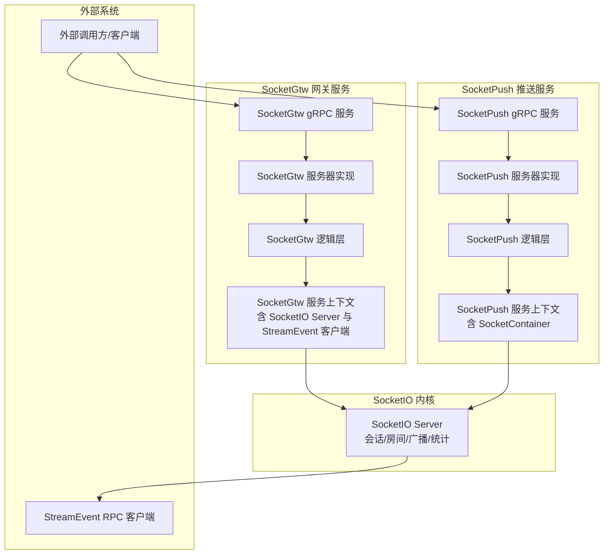
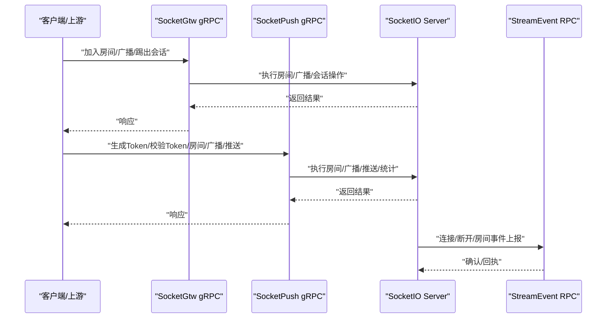
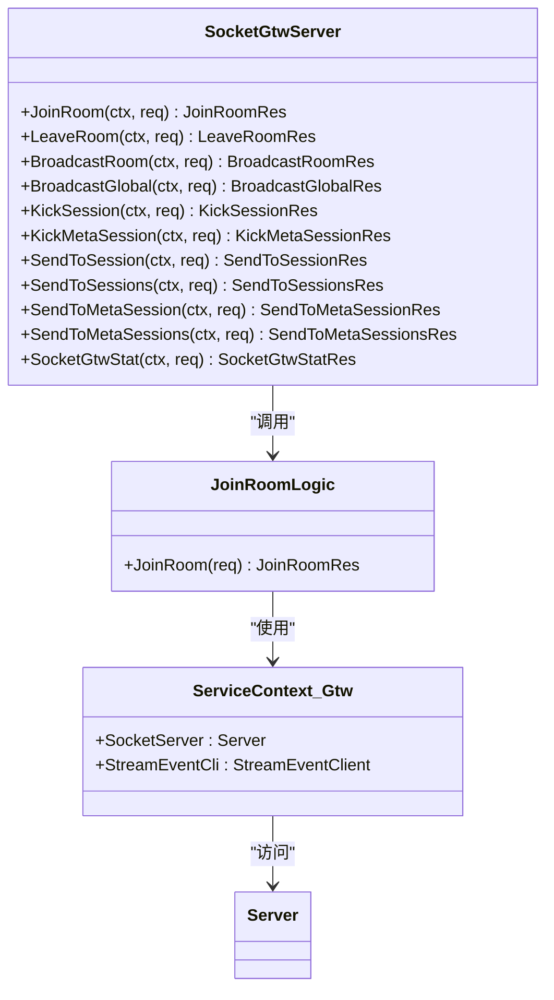
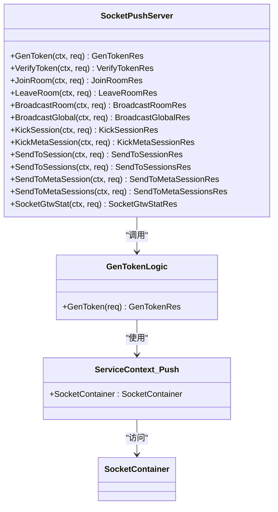
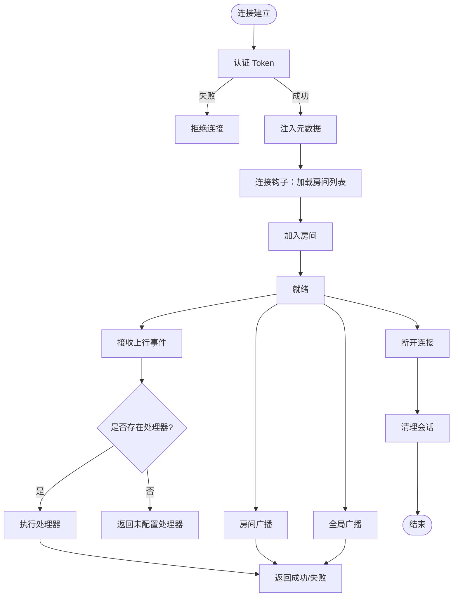
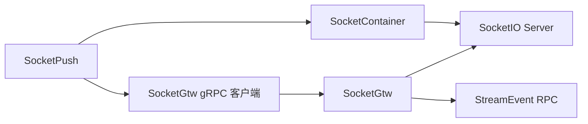

# SocketIO服务API

<cite>
**本文引用的文件**
- [socketgtw.proto](file://socketapp/socketgtw/socketgtw.proto)
- [socketpush.proto](file://socketapp/socketpush/socketpush.proto)
- [socketgtw.go](file://socketapp/socketgtw/socketgtw.go)
- [socketpush.go](file://socketapp/socketpush/socketpush.go)
- [server.go](file://common/socketiox/server.go)
- [socketgtwserver.go](file://socketapp/socketgtw/internal/server/socketgtwserver.go)
- [socketpushserver.go](file://socketapp/socketpush/internal/server/socketpushserver.go)
- [socketgtw.yaml](file://socketapp/socketgtw/etc/socketgtw.yaml)
- [socketpush.yaml](file://socketapp/socketpush/etc/socketpush.yaml)
- [servicecontext.go（SocketGtw）](file://socketapp/socketgtw/internal/svc/servicecontext.go)
- [servicecontext.go（SocketPush）](file://socketapp/socketpush/internal/svc/servicecontext.go)
- [config.go（SocketGtw）](file://socketapp/socketgtw/internal/config/config.go)
- [config.go（SocketPush）](file://socketapp/socketpush/internal/config/config.go)
- [joinroomlogic.go](file://socketapp/socketgtw/internal/logic/joinroomlogic.go)
- [gentokenlogic.go](file://socketapp/socketpush/internal/logic/gentokenlogic.go)
- [test-socketio.html](file://common/socketiox/test-socketio.html)
</cite>

## 目录
1. [简介](#简介)
2. [项目结构](#项目结构)
3. [核心组件](#核心组件)
4. [架构总览](#架构总览)
5. [详细组件分析](#详细组件分析)
6. [依赖关系分析](#依赖关系分析)
7. [性能与可靠性](#性能与可靠性)
8. [故障排查指南](#故障排查指南)
9. [结论](#结论)
10. [附录：SocketIO客户端示例与最佳实践](#附录socketio客户端示例与最佳实践)

## 简介
本文件系统性梳理了基于 gRPC 的 SocketIO 实时通信服务接口，覆盖以下能力：
- 网关服务（SocketGtw）：连接管理、消息路由、房间管理、全局/房间广播、会话踢出与按元数据筛选推送
- 推送服务（SocketPush）：Token 生成与校验、房间管理、广播与推送、统计查询
- SocketIO 内核：事件绑定、会话生命周期、房间加入/离开、广播、心跳统计与元数据透传
- WebSocket 协议、心跳检测与断线重连、消息队列集成与可靠性保障、性能优化建议

## 项目结构
SocketIO 服务由两个独立的 gRPC 服务组成：
- SocketGtw：面向内部业务的网关服务，负责与 SocketIO 内核交互，并通过 StreamEvent RPC 将连接/断开/房间事件上送到流事件系统
- SocketPush：面向外部或上游系统的推送服务，提供 Token 签发、房间管理、广播与推送、统计查询等能力

图表来源
- [socketgtwserver.go:15-91](file://socketapp/socketgtw/internal/server/socketgtwserver.go#L15-L91)
- [socketpushserver.go:15-103](file://socketapp/socketpush/internal/server/socketpushserver.go#L15-L103)
- [servicecontext.go（SocketGtw）:18-134](file://socketapp/socketgtw/internal/svc/servicecontext.go#L18-L134)
- [servicecontext.go（SocketPush）:8-18](file://socketapp/socketpush/internal/svc/servicecontext.go#L8-L18)
- [server.go:299-335](file://common/socketiox/server.go#L299-L335)

章节来源
- [socketgtw.go:30-90](file://socketapp/socketgtw/socketgtw.go#L30-L90)
- [socketpush.go:27-70](file://socketapp/socketpush/socketpush.go#L27-L70)
- [socketgtw.yaml:1-37](file://socketapp/socketgtw/etc/socketgtw.yaml#L1-L37)
- [socketpush.yaml:1-28](file://socketapp/socketpush/etc/socketpush.yaml#L1-L28)

## 核心组件
- SocketGtw gRPC 服务
  - 房间管理：加入房间、离开房间
  - 广播：房间广播、全局广播
  - 会话管理：按会话/批量会话/按元数据会话推送、剔除会话、按元数据剔除会话
  - 统计：查询当前节点会话数
- SocketPush gRPC 服务
  - 认证：生成 Token、校验 Token
  - 房间管理：加入房间、离开房间
  - 广播与推送：房间广播、全局广播、按会话/批量会话/按元数据会话推送、剔除会话、按元数据剔除会话
  - 统计：查询各节点会话统计
- SocketIO 内核
  - 连接认证与元数据注入、连接/断开钩子、房间加入/离开、广播、心跳统计、会话查询与元数据检索

章节来源
- [socketgtw.proto:9-32](file://socketapp/socketgtw/socketgtw.proto#L9-L32)
- [socketpush.proto:9-36](file://socketapp/socketpush/socketpush.proto#L9-L36)
- [server.go:299-335](file://common/socketiox/server.go#L299-L335)

## 架构总览
SocketGtw 与 SocketPush 均以 gRPC 服务形式对外提供能力，内部通过 SocketIO Server 管理会话与房间；SocketGtw 还通过 StreamEvent RPC 将连接/断开/房间事件上报到流事件系统，用于业务联动。

图表来源
- [socketgtwserver.go:26-90](file://socketapp/socketgtw/internal/server/socketgtwserver.go#L26-L90)
- [socketpushserver.go:26-102](file://socketapp/socketpush/internal/server/socketpushserver.go#L26-L102)
- [servicecontext.go（SocketGtw）:38-131](file://socketapp/socketgtw/internal/svc/servicecontext.go#L38-L131)
- [server.go:337-676](file://common/socketiox/server.go#L337-L676)

## 详细组件分析

### SocketGtw 网关服务
- 服务职责
  - 对外提供房间管理、广播、会话管理与统计接口
  - 通过 SocketIO Server 执行底层操作
  - 通过 StreamEvent RPC 上报连接/断开/房间事件
- 关键接口
  - 房间管理：JoinRoom、LeaveRoom
  - 广播：BroadcastRoom、BroadcastGlobal
  - 会话管理：SendToSession、SendToSessions、SendToMetaSession、SendToMetaSessions、KickSession、KickMetaSession
  - 统计：SocketGtwStat
- 服务器实现
  - 将 gRPC 请求转发至对应逻辑层
- 逻辑层
  - 通过 ServiceContext 中的 SocketServer 获取会话并执行房间/广播/会话操作
- 配置要点
  - JwtAuth：可选的 JWT 认证
  - SocketMetaData：从 JWT 中提取并注入到会话元数据的关键字列表
  - StreamEventConf：流事件 RPC 客户端配置
  - NacosConfig：服务注册配置（可选）

图表来源
- [socketgtwserver.go:15-91](file://socketapp/socketgtw/internal/server/socketgtwserver.go#L15-L91)
- [joinroomlogic.go:11-38](file://socketapp/socketgtw/internal/logic/joinroomlogic.go#L11-L38)
- [servicecontext.go（SocketGtw）:18-134](file://socketapp/socketgtw/internal/svc/servicecontext.go#L18-L134)

章节来源
- [socketgtw.proto:9-32](file://socketapp/socketgtw/socketgtw.proto#L9-L32)
- [socketgtwserver.go:26-90](file://socketapp/socketgtw/internal/server/socketgtwserver.go#L26-L90)
- [joinroomlogic.go:25-37](file://socketapp/socketgtw/internal/logic/joinroomlogic.go#L25-L37)
- [servicecontext.go（SocketGtw）:38-131](file://socketapp/socketgtw/internal/svc/servicecontext.go#L38-L131)
- [socketgtw.yaml:1-37](file://socketapp/socketgtw/etc/socketgtw.yaml#L1-L37)

### SocketPush 推送服务
- 服务职责
  - 提供 Token 生成与校验能力
  - 对外提供房间管理、广播、会话管理与统计接口
  - 通过 SocketContainer（SocketIO 容器）执行底层操作
- 关键接口
  - 认证：GenToken、VerifyToken
  - 房间管理：JoinRoom、LeaveRoom
  - 广播与推送：BroadcastRoom、BroadcastGlobal、SendToSession、SendToSessions、SendToMetaSession、SendToMetaSessions、KickSession、KickMetaSession
  - 统计：SocketGtwStat
- 服务器实现
  - 将 gRPC 请求转发至对应逻辑层
- 逻辑层
  - 通过 ServiceContext 中的 SocketContainer 获取 SocketIO 会话并执行房间/广播/推送/统计
- 配置要点
  - JwtAuth：Token 签发与校验密钥、过期时间
  - SocketGtwConf：SocketGtw gRPC 客户端配置（用于统计等场景）
  - NacosConfig：服务注册配置（可选）

图表来源
- [socketpushserver.go:15-103](file://socketapp/socketpush/internal/server/socketpushserver.go#L15-L103)
- [gentokenlogic.go:15-79](file://socketapp/socketpush/internal/logic/gentokenlogic.go#L15-L79)
- [servicecontext.go（SocketPush）:8-18](file://socketapp/socketpush/internal/svc/servicecontext.go#L8-L18)

章节来源
- [socketpush.proto:9-36](file://socketapp/socketpush/socketpush.proto#L9-L36)
- [socketpushserver.go:26-102](file://socketapp/socketpush/internal/server/socketpushserver.go#L26-L102)
- [gentokenlogic.go:29-79](file://socketapp/socketpush/internal/logic/gentokenlogic.go#L29-L79)
- [servicecontext.go（SocketPush）:13-18](file://socketapp/socketpush/internal/svc/servicecontext.go#L13-L18)
- [socketpush.yaml:1-28](file://socketapp/socketpush/etc/socketpush.yaml#L1-L28)

### SocketIO 内核与事件处理
- 事件绑定
  - 认证：支持 Token 校验与带声明的 Token 校验
  - 连接：建立会话，注入元数据（来自 JWT 声明），触发连接钩子
  - 断开：清理无效会话，触发断开钩子
  - 房间：加入/离开房间
  - 广播：房间广播、全局广播
  - 自定义事件：通过事件处理器处理自定义事件
- 会话与房间
  - 会话对象维护元数据、房间集合、Socket 引用
  - 支持按元数据关键字检索会话
- 统计与心跳
  - 定时统计会话数量、房间列表、每秒消息数、元数据与加载错误
  - 通过特定下行事件向客户端推送统计信息

图表来源
- [server.go:337-676](file://common/socketiox/server.go#L337-L676)
- [server.go:702-740](file://common/socketiox/server.go#L702-L740)

章节来源
- [server.go:299-335](file://common/socketiox/server.go#L299-L335)
- [server.go:337-676](file://common/socketiox/server.go#L337-L676)
- [server.go:702-740](file://common/socketiox/server.go#L702-L740)

## 依赖关系分析
- SocketGtw
  - 依赖 SocketIO Server 执行房间/广播/会话操作
  - 依赖 StreamEvent RPC 客户端上报连接/断开/房间事件
- SocketPush
  - 依赖 SocketContainer（SocketIO 容器）执行房间/广播/推送/统计
  - 依赖 SocketGtw gRPC 客户端进行统计等跨节点查询
- 共享
  - 两者均支持通过配置启用 JWT 认证
  - 两者均支持通过 Nacos 注册服务

图表来源
- [servicecontext.go（SocketGtw）:24-37](file://socketapp/socketgtw/internal/svc/servicecontext.go#L24-L37)
- [servicecontext.go（SocketGtw）:38-131](file://socketapp/socketgtw/internal/svc/servicecontext.go#L38-L131)
- [servicecontext.go（SocketPush）:13-18](file://socketapp/socketpush/internal/svc/servicecontext.go#L13-L18)
- [socketpush.yaml:22-27](file://socketapp/socketpush/etc/socketpush.yaml#L22-L27)

章节来源
- [socketgtw.yaml:30-36](file://socketapp/socketgtw/etc/socketgtw.yaml#L30-L36)
- [socketpush.yaml:22-27](file://socketapp/socketpush/etc/socketpush.yaml#L22-L27)

## 性能与可靠性
- 性能
  - gRPC 默认调用超时与日志级别已在配置中设置
  - SocketGtw 在创建 StreamEvent 客户端时设置了较大的最大消息大小，便于传输大负载数据
- 可靠性
  - SocketGtw 通过 StreamEvent RPC 将关键事件上送，便于业务侧进行审计与补偿
  - SocketPush 通过 SocketContainer 与 SocketGtw 协作，支持跨节点统计与推送
- 优化建议
  - 合理设置 SocketMetaData 列表，避免注入过多无关元数据
  - 使用批量接口（如 SendToSessions、SendToMetaSessions）减少网络往返
  - 对于高并发广播，优先使用房间广播而非全局广播

章节来源
- [socketgtw.yaml:1-37](file://socketapp/socketgtw/etc/socketgtw.yaml#L1-L37)
- [socketpush.yaml:1-28](file://socketapp/socketpush/etc/socketpush.yaml#L1-L28)
- [servicecontext.go（SocketGtw）:24-37](file://socketapp/socketgtw/internal/svc/servicecontext.go#L24-L37)

## 故障排查指南
- 连接失败
  - 检查 JWT 密钥配置是否正确，Token 是否过期
  - 确认 SocketGtw/SocketPush 的 Nacos 注册与发现配置
- 房间操作异常
  - 确认请求参数（reqId、room、event、payload）是否完整
  - 查看 SocketIO 服务器日志中的“缺少必填项”或“参数解析失败”提示
- 广播/推送无响应
  - 检查目标会话是否存在，房间是否正确
  - 确认 SocketIO 服务器统计循环是否正常运行
- 事件未上报
  - 检查 StreamEvent RPC 客户端配置与网络连通性

章节来源
- [server.go:392-575](file://common/socketiox/server.go#L392-L575)
- [server.go:702-740](file://common/socketiox/server.go#L702-L740)
- [socketgtw.yaml:1-37](file://socketapp/socketgtw/etc/socketgtw.yaml#L1-L37)
- [socketpush.yaml:1-28](file://socketapp/socketpush/etc/socketpush.yaml#L1-L28)

## 结论
本 SocketIO 服务通过清晰的 gRPC 分层设计，将认证、房间管理、广播与推送能力解耦，既满足内部网关（SocketGtw）的事件上报需求，又为外部推送（SocketPush）提供统一入口。结合 SocketIO 内核的事件驱动模型与心跳统计，可在保证可靠性的同时实现高性能的实时通信。

## 附录：SocketIO客户端示例与最佳实践
- 客户端示例
  - 提供了基于浏览器的 SocketIO 测试页面，可用于连接、加入房间、发送消息与查看日志
  - 页面包含连接状态指示、消息收发日志、清空日志等功能
- 最佳实践
  - 使用 Token 进行连接认证，确保元数据正确注入
  - 合理使用房间广播与全局广播，避免不必要的全量推送
  - 使用批量接口进行多会话推送，降低延迟
  - 监控统计事件，及时发现异常会话与房间加载错误

章节来源
- [test-socketio.html:1-800](file://common/socketiox/test-socketio.html#L1-L800)