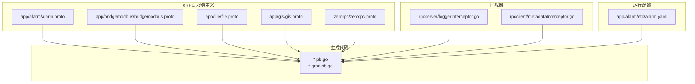
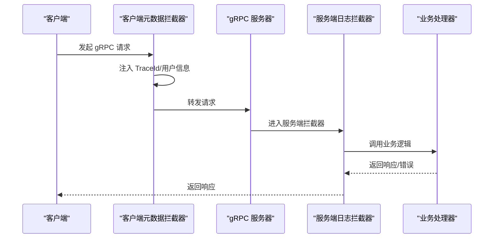
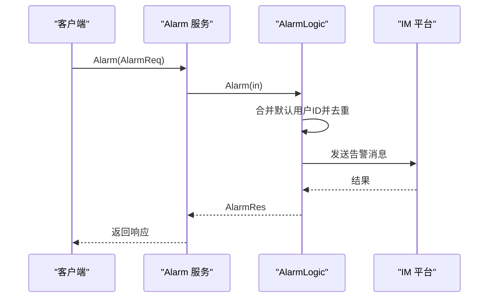
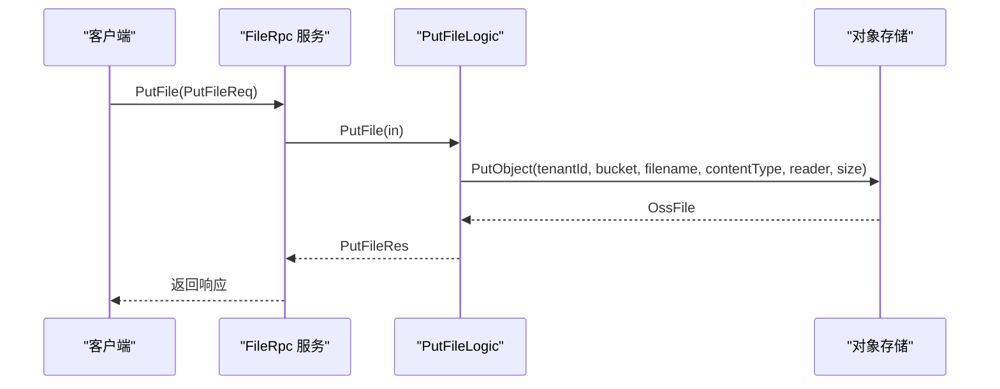
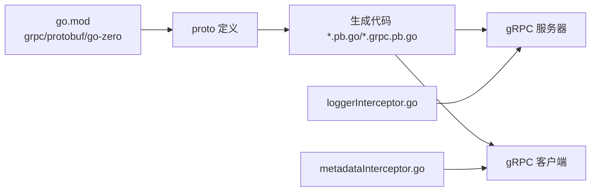

# gRPC API接口

<cite>
**本文引用的文件**
- [go.mod](file://go.mod)
- [rpc-patterns.md](file://.trae/skills/zero-skills/references/rpc-patterns.md)
- [loggerInterceptor.go](file://common/Interceptor/rpcserver/loggerInterceptor.go)
- [metadataInterceptor.go](file://common/Interceptor/rpcclient/metadataInterceptor.go)
- [alarm.proto](file://app/alarm/alarm.proto)
- [bridgemodbus.proto](file://app/bridgemodbus/bridgemodbus.proto)
- [file.proto](file://app/file/file.proto)
- [gis.proto](file://app/gis/gis.proto)
- [zerorpc.proto](file://zerorpc/zerorpc.proto)
- [alarm.yaml](file://app/alarm/etc/alarm.yaml)
- [zerorpc_grpc.pb.go](file://zerorpc/zerorpc/zerorpc_grpc.pb.go)
- [alarmlogic.go](file://app/alarm/internal/logic/alarmlogic.go)
- [putfilelogic.go](file://app/file/internal/logic/putfilelogic.go)
</cite>

## 目录
1. [简介](#简介)
2. [项目结构](#项目结构)
3. [核心组件](#核心组件)
4. [架构总览](#架构总览)
5. [详细组件分析](#详细组件分析)
6. [依赖关系分析](#依赖关系分析)
7. [性能考虑](#性能考虑)
8. [故障排查指南](#故障排查指南)
9. [结论](#结论)
10. [附录](#附录)

## 简介
本文件为 Zero-Service 项目的 gRPC API 接口参考文档，覆盖所有基于 Protobuf 定义的服务接口，包括服务方法、消息类型、字段说明与调用约定。文档同时提供：
- 参数结构与返回值格式说明
- 错误处理机制与状态码映射
- 客户端调用示例（Go 语言）、Protobuf 定义解析与连接管理要点
- 认证机制、负载均衡与故障重试配置建议
- 版本管理、向后兼容性与迁移策略
- 性能优化建议、监控指标与调试方法

## 项目结构
Zero-Service 使用 go-zero 框架与 gRPC 生态，gRPC 服务以 .proto 文件定义，通过代码生成工具生成服务桩代码与客户端存根。拦截器负责日志与元数据透传，配置文件定义服务监听与外部集成。

**图表来源**
- [alarm.proto](file://app/alarm/alarm.proto)
- [bridgemodbus.proto](file://app/bridgemodbus/bridgemodbus.proto)
- [file.proto](file://app/file/file.proto)
- [gis.proto](file://app/gis/gis.proto)
- [zerorpc.proto](file://zerorpc/zerorpc.proto)
- [loggerInterceptor.go](file://common/Interceptor/rpcserver/loggerInterceptor.go)
- [metadataInterceptor.go](file://common/Interceptor/rpcclient/metadataInterceptor.go)
- [alarm.yaml](file://app/alarm/etc/alarm.yaml)

**章节来源**
- [go.mod](file://go.mod)
- [alarm.proto](file://app/alarm/alarm.proto)
- [bridgemodbus.proto](file://app/bridgemodbus/bridgemodbus.proto)
- [file.proto](file://app/file/file.proto)
- [gis.proto](file://app/gis/gis.proto)
- [zerorpc.proto](file://zerorpc/zerorpc.proto)
- [loggerInterceptor.go](file://common/Interceptor/rpcserver/loggerInterceptor.go)
- [metadataInterceptor.go](file://common/Interceptor/rpcclient/metadataInterceptor.go)
- [alarm.yaml](file://app/alarm/etc/alarm.yaml)

## 核心组件
- gRPC 服务定义：各模块在 app/*/ 或根目录下定义 .proto，声明 service 与 message 类型。
- 生成代码：通过 protoc 与 go-grpc 插件生成 *.pb.go 与 *.grpc.pb.go。
- 拦截器：服务端日志拦截器与客户端元数据拦截器，统一注入 TraceId、用户信息等上下文。
- 配置：服务监听地址、外部系统集成（如 Redis、告警平台）等。

**章节来源**
- [go.mod](file://go.mod)
- [loggerInterceptor.go](file://common/Interceptor/rpcserver/loggerInterceptor.go)
- [metadataInterceptor.go](file://common/Interceptor/rpcclient/metadataInterceptor.go)

## 架构总览
gRPC 服务通过 go-zero 提供的 RPC 服务器启动，拦截器在请求进入与返回时进行日志与上下文透传。客户端通过 gRPC 连接各服务，元数据拦截器自动附加 TraceId、用户信息等。

**图表来源**
- [metadataInterceptor.go](file://common/Interceptor/rpcclient/metadataInterceptor.go)
- [loggerInterceptor.go](file://common/Interceptor/rpcserver/loggerInterceptor.go)
- [zerorpc_grpc.pb.go](file://zerorpc/zerorpc/zerorpc_grpc.pb.go)

## 详细组件分析

### Alarm 服务
- 服务定位：告警通知服务，提供 Ping 与 Alarm 方法。
- 方法说明：
  - Ping(Req) -> Res：健康检查。
  - Alarm(AlarmReq) -> AlarmRes：发送告警消息至 IM 平台。
- 消息类型：
  - Req/Res：基础心跳消息。
  - AlarmReq：包含聊天群名称、描述、标题、项目、时间、报警ID、内容、错误信息、用户ID列表、IP 等字段。
  - AlarmRes：空响应。
- 调用约定：
  - 服务端拦截器会从 Metadata 中提取用户与鉴权信息并注入上下文。
  - 告警逻辑会合并配置中的默认用户ID并去重，随后调用告警平台接口发送消息。
- 错误处理：
  - 业务错误通过返回错误；拦截器在出错时记录错误日志。

**图表来源**
- [alarm.proto](file://app/alarm/alarm.proto)
- [alarmlogic.go](file://app/alarm/internal/logic/alarmlogic.go)

**章节来源**
- [alarm.proto](file://app/alarm/alarm.proto)
- [alarmlogic.go](file://app/alarm/internal/logic/alarmlogic.go)
- [alarm.yaml](file://app/alarm/etc/alarm.yaml)

### BridgeModbus 服务
- 服务定位：Modbus 协议桥接服务，提供配置管理与多种功能码读写操作。
- 方法分类：
  - 配置管理：SaveConfig、DeleteConfig、PageListConfig、GetConfigByCode、BatchGetConfigByCode。
  - Bit 访问：ReadCoils、ReadDiscreteInputs、WriteSingleCoil、WriteMultipleCoils。
  - 16 位寄存器访问：ReadInputRegisters、ReadHoldingRegisters、WriteSingleRegister、WriteSingleRegisterWithDecimal、WriteMultipleRegisters、WriteMultipleRegistersWithDecimal、ReadWriteMultipleRegisters、MaskWriteRegister、ReadFIFOQueue。
  - 设备识别：ReadDeviceIdentification、ReadDeviceIdentificationSpecificObject。
  - 批量转换：BatchConvertDecimalToRegister。
- 消息类型（节选）：
  - PbModbusConfig：包含主键、创建/更新时间、链路编码、从站地址、从站ID、超时配置、TLS 开关与证书路径、状态、备注等。
  - 各类请求/响应消息：如 ReadCoilsReq/Res、WriteMultipleRegistersReq/Res 等。
- 调用约定：
  - 方法命名遵循功能码语义，请求消息包含 modbusCode 以选择配置，address/quantity 等参数控制读写范围。
  - 响应消息常包含原始字节与多格式解析结果（如十六进制、二进制、有符号/无符号整数）。
- 错误处理：
  - 业务异常通过返回错误；建议结合 gRPC 状态码进行区分。

**章节来源**
- [bridgemodbus.proto](file://app/bridgemodbus/bridgemodbus.proto)

### FileRpc 服务
- 服务定位：文件与对象存储服务，提供 OSS 配置管理、桶操作、文件上传/下载/删除、签名 URL、视频截图等能力。
- 方法列表（节选）：
  - Ping、OssDetail、OssList、CreateOss、UpdateOss、DeleteOss、MakeBucket、RemoveBucket、StatFile、SignUrl、PutFile、PutChunkFile(stream)、PutStreamFile(stream)、RemoveFile、RemoveFiles、CaptureVideoStream。
- 消息类型（节选）：
  - Oss：租户ID、分类、资源编号、Endpoint、AK/SK、Bucket 名称、AppId/Region、备注、状态、时间戳。
  - File/OssFile：链接、域名、文件名、大小、格式化大小、原始名、MD5、图片元信息、缩略图等。
  - 各类请求/响应消息：如 PutFileReq/Res、PutChunkFileReq/Res、PutStreamFileReq/Res、StatFileReq/Res、SignUrlReq/Res、RemoveFileReq/Res、CaptureVideoStreamReq/Res。
- 调用约定：
  - PutChunkFile 与 PutStreamFile 采用双向流式传输，适合大文件分片/流式上传。
  - StatFile/SignUrl 支持签名 URL 生成与过期时间控制。
- 错误处理：
  - 业务错误通过返回错误；建议结合 gRPC 状态码进行区分。

**图表来源**
- [file.proto](file://app/file/file.proto)
- [putfilelogic.go](file://app/file/internal/logic/putfilelogic.go)

**章节来源**
- [file.proto](file://app/file/file.proto)
- [putfilelogic.go](file://app/file/internal/logic/putfilelogic.go)

### Gis 服务
- 服务定位：地理信息系统服务，提供坐标编码/解码、围栏生成、点集合距离计算、坐标转换、路径规划等功能。
- 方法列表（节选）：
  - Ping、EncodeGeoHash、DecodeGeoHash、EncodeH3、DecodeH3、GenerateFenceCells、GenerateFenceH3Cells、PointsWithinRadius、PointInFence、PointInFences、Distance、BatchDistance、NearbyFences、TransformCoord、BatchTransformCoord、RoutePoints。
- 消息类型（节选）：
  - Point/Fence/PointPair：经纬度、围栏点集、点对。
  - CoordType：坐标系枚举（WGS84、GCJ02、BD09）。
  - 各类请求/响应消息：如 EncodeGeoHashReq/Res、GenFenceCellsReq/Res、RoutePointsReq/Res。
- 调用约定：
  - 支持批量处理（如 BatchDistance、BatchTransformCoord），提升吞吐。
  - RoutePoints 返回访问顺序与总距离。
- 错误处理：
  - 业务错误通过返回错误；建议结合 gRPC 状态码进行区分。

**章节来源**
- [gis.proto](file://app/gis/gis.proto)

### Zerorpc 服务
- 服务定位：通用 RPC 服务，提供延迟任务、转发任务、短信验证码、区域列表、令牌生成、登录、用户信息、微信支付 JSAPI 等能力。
- 方法列表（节选）：
  - Ping、SendDelayTask、ForwardTask、SendSMSVerifyCode、GetRegionList、GenerateToken、Login、MiniProgramLogin、GetUserInfo、EditUserInfo、WxPayJsApi。
- 消息类型（节选）：
  - Region/User：行政区划与用户信息。
  - SendDelayTaskReq/Res、ForwardTaskReq/Res、SendSMSVerifyCodeReq/Res、GenerateTokenReq/Res、LoginReq/Res、MiniProgramLoginReq/Res、GetUserInfoReq/Res、EditUserInfoReq/Res、WxPayJsApiReq/Res。
- 调用约定：
  - 令牌生成与刷新策略由服务端维护；登录支持多种方式（小程序、手机、UnionId）。
  - 微信支付 JSAPI 返回预支付参数，客户端据此发起支付。
- 错误处理：
  - 业务错误通过返回错误；建议结合 gRPC 状态码进行区分。

**章节来源**
- [zerorpc.proto](file://zerorpc/zerorpc.proto)
- [zerorpc_grpc.pb.go](file://zerorpc/zerorpc/zerorpc_grpc.pb.go)

## 依赖关系分析
- gRPC 与 Protobuf：go.mod 中声明 google.golang.org/grpc 与 google.golang.org/protobuf。
- go-zero RPC：项目使用 go-zero 提供的 RPC 服务器与工具链。
- 拦截器：客户端与服务端分别提供元数据与日志拦截器，统一上下文传递。

**图表来源**
- [go.mod](file://go.mod)
- [metadataInterceptor.go](file://common/Interceptor/rpcclient/metadataInterceptor.go)
- [loggerInterceptor.go](file://common/Interceptor/rpcserver/loggerInterceptor.go)

**章节来源**
- [go.mod](file://go.mod)
- [metadataInterceptor.go](file://common/Interceptor/rpcclient/metadataInterceptor.go)
- [loggerInterceptor.go](file://common/Interceptor/rpcserver/loggerInterceptor.go)

## 性能考虑
- 流式传输：FileRpc 的 PutChunkFile 与 PutStreamFile 采用双向流，适合大文件分片/流式上传，降低内存峰值与网络阻塞风险。
- 批量处理：Gis 的 BatchDistance、BatchTransformCoord 等方法减少往返开销，提升吞吐。
- 超时与重试：建议在客户端设置合理的超时与指数退避重试策略，避免雪崩效应。
- 负载均衡：gRPC 支持多种负载均衡策略（轮询、最少连接等），结合服务注册与发现使用。
- 监控与追踪：通过拦截器注入 TraceId，结合链路追踪系统（如 Zipkin/Jaeger）与指标采集（Prometheus）进行性能观测。

## 故障排查指南
- 错误码映射与客户端处理：参考 RPC 模式文档中的状态码映射与客户端错误处理示例，按状态码分类处理 NotFound、InvalidArgument、Unavailable 等。
- 日志拦截器：服务端拦截器会在发生错误时记录错误日志，便于定位问题。
- 客户端元数据：确保客户端在上下文中正确设置 TraceId、用户信息等，以便服务端日志关联。

**章节来源**
- [rpc-patterns.md](file://.trae/skills/zero-skills/references/rpc-patterns.md)
- [loggerInterceptor.go](file://common/Interceptor/rpcserver/loggerInterceptor.go)
- [metadataInterceptor.go](file://common/Interceptor/rpcclient/metadataInterceptor.go)

## 结论
Zero-Service 的 gRPC API 以清晰的 Protobuf 定义与 go-zero 生态为基础，提供了告警、Modbus 桥接、文件存储、GIS、通用 RPC 等完整能力。通过拦截器实现统一的日志与上下文透传，结合流式传输与批量处理提升性能。建议在生产环境中完善负载均衡、重试与监控体系，并遵循错误码映射与版本管理策略，确保系统的稳定性与可演进性。

## 附录

### gRPC 客户端调用示例（Go 语言）
- 连接管理与元数据透传：
  - 使用元数据拦截器自动附加 TraceId、用户ID、部门编码、授权信息等。
  - 在上下文中设置这些值，拦截器会在每次调用时注入到 gRPC Metadata。
- Protobuf 定义解析：
  - 通过生成的 *.pb.go 与 *.grpc.pb.go 文件，直接构造请求消息并调用服务方法。
- 示例流程（以 FileRpc.PutFile 为例）：
  - 构造 PutFileReq（包含租户ID、资源编号、桶名、文件名、内容类型、本地路径等）。
  - 调用 PutFile，获取 PutFileRes 并处理返回的 File 信息。
  - 若为大文件，可改用 PutChunkFile/PutStreamFile 的流式上传。

**章节来源**
- [metadataInterceptor.go](file://common/Interceptor/rpcclient/metadataInterceptor.go)
- [file.proto](file://app/file/file.proto)
- [putfilelogic.go](file://app/file/internal/logic/putfilelogic.go)

### 认证机制
- 元数据透传：客户端拦截器将 TraceId、用户ID、授权信息等写入 Metadata；服务端拦截器读取并注入到上下文。
- 配置示例：Alarm 服务配置中包含告警平台的 AppId/AppSecret/EncryptKey/VerificationToken 等，用于与外部系统交互。

**章节来源**
- [metadataInterceptor.go](file://common/Interceptor/rpcclient/metadataInterceptor.go)
- [loggerInterceptor.go](file://common/Interceptor/rpcserver/loggerInterceptor.go)
- [alarm.yaml](file://app/alarm/etc/alarm.yaml)

### 负载均衡与故障重试
- 负载均衡：建议在 gRPC 客户端侧配置负载均衡策略（如 round_robin、least_request），并结合 Nacos/Consul 等注册中心。
- 故障重试：对幂等请求可采用指数退避重试，避免对下游造成压力；对非幂等请求需谨慎处理。

### 版本管理、向后兼容与迁移
- 版本管理：建议在 package 命名与服务版本号中体现版本信息，逐步引入新字段并保持旧字段可选。
- 向后兼容：新增字段使用 optional，避免破坏现有客户端；弃用字段保留但标记 deprecated。
- 迁移策略：先灰度发布新版本，逐步替换旧版本；通过网关或中间层进行协议转换与兼容适配。