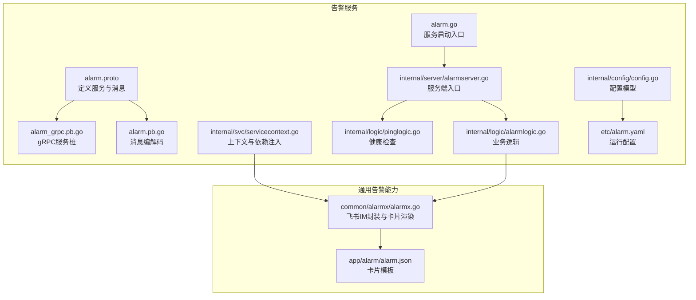
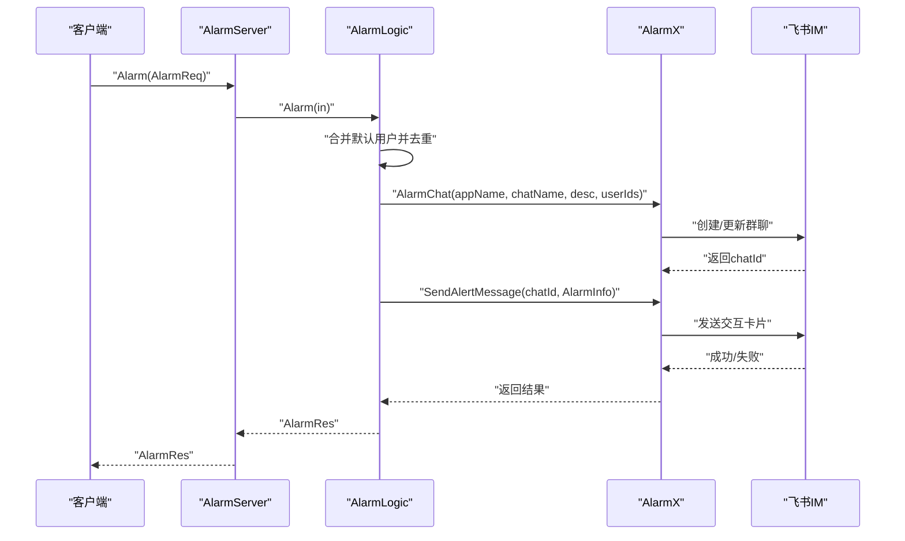
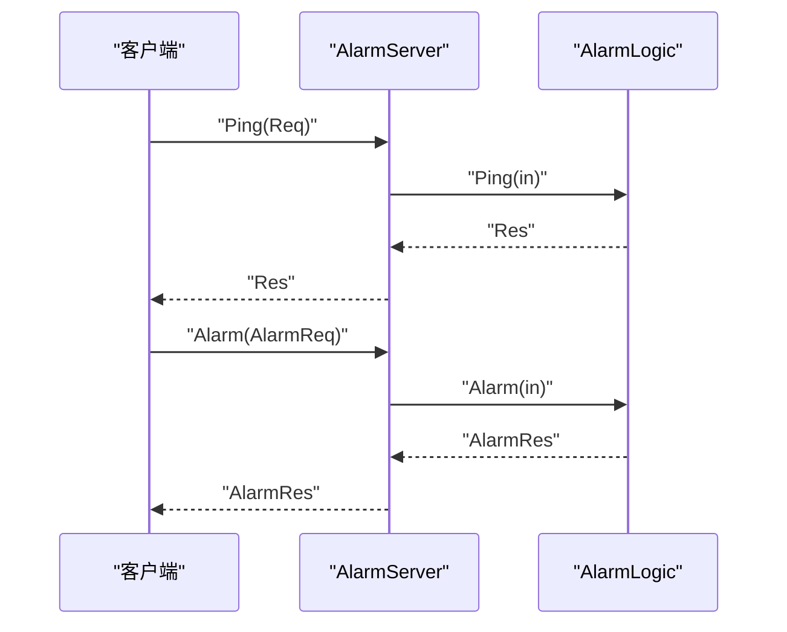
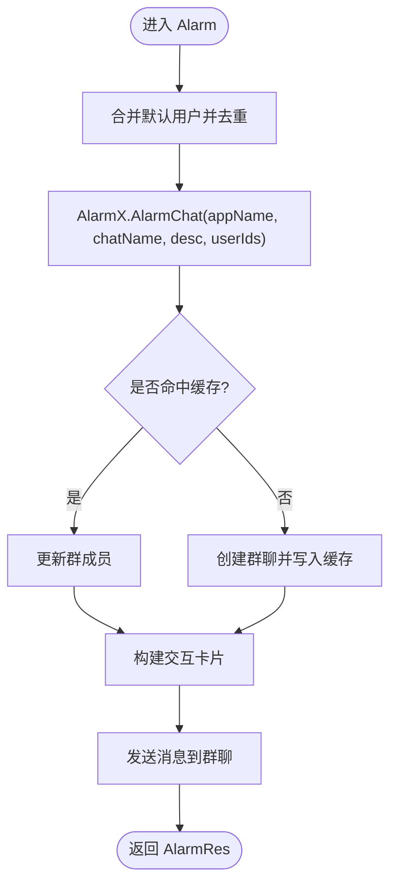
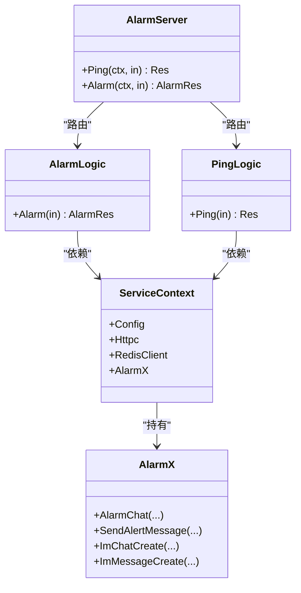

# 告警服务API

<cite>
**本文引用的文件**
- [alarm.proto](file://app/alarm/alarm.proto)
- [alarm_grpc.pb.go](file://app/alarm/alarm/alarm_grpc.pb.go)
- [alarm.pb.go](file://app/alarm/alarm/alarm.pb.go)
- [alarmserver.go](file://app/alarm/internal/server/alarmserver.go)
- [alarmlogic.go](file://app/alarm/internal/logic/alarmlogic.go)
- [pinglogic.go](file://app/alarm/internal/logic/pinglogic.go)
- [servicecontext.go](file://app/alarm/internal/svc/servicecontext.go)
- [config.go](file://app/alarm/internal/config/config.go)
- [alarm.yaml](file://app/alarm/etc/alarm.yaml)
- [alarm.go](file://app/alarm/alarm.go)
- [alarmx.go](file://common/alarmx/alarmx.go)
- [alarm.json](file://app/alarm/alarm.json)
- [kafkamodel.go](file://model/kafkamodel.go)
</cite>

## 目录
1. [简介](#简介)
2. [项目结构](#项目结构)
3. [核心组件](#核心组件)
4. [架构总览](#架构总览)
5. [详细组件分析](#详细组件分析)
6. [依赖关系分析](#依赖关系分析)
7. [性能与可靠性](#性能与可靠性)
8. [故障排查指南](#故障排查指南)
9. [结论](#结论)
10. [附录](#附录)

## 简介
本文件系统性梳理告警服务的 gRPC API，覆盖告警规则配置、告警事件处理与通知功能，并对告警状态管理、去重机制、升级策略、恢复处理、统计与历史查询等能力进行说明。文档同时提供客户端调用示例路径与最佳实践建议，帮助开发者快速集成与扩展。

## 项目结构
告警服务位于 app/alarm 目录，采用 goctl 生成的 gRPC 服务骨架，结合 common/alarmx 提供的飞书 IM 通知能力，完成“告警群创建/维护—消息卡片发送—交互按钮处理”的闭环。

**图表来源**
- [alarm.proto:1-34](file://app/alarm/alarm.proto#L1-L34)
- [alarm_grpc.pb.go:34-159](file://app/alarm/alarm/alarm_grpc.pb.go#L34-L159)
- [alarm.pb.go:1-346](file://app/alarm/alarm/alarm.pb.go#L1-L346)
- [alarmserver.go:1-35](file://app/alarm/internal/server/alarmserver.go#L1-L35)
- [alarmlogic.go:1-184](file://app/alarm/internal/logic/alarmlogic.go#L1-L184)
- [pinglogic.go:1-31](file://app/alarm/internal/logic/pinglogic.go#L1-L31)
- [servicecontext.go:1-33](file://app/alarm/internal/svc/servicecontext.go#L1-L33)
- [config.go:1-16](file://app/alarm/internal/config/config.go#L1-L16)
- [alarm.yaml:1-26](file://app/alarm/etc/alarm.yaml#L1-L26)
- [alarm.go:1-44](file://app/alarm/alarm.go#L1-L44)
- [alarmx.go:1-223](file://common/alarmx/alarmx.go#L1-L223)
- [alarm.json:1-75](file://app/alarm/alarm.json#L1-L75)

**章节来源**
- [alarm.proto:1-34](file://app/alarm/alarm.proto#L1-L34)
- [alarm_grpc.pb.go:34-159](file://app/alarm/alarm/alarm_grpc.pb.go#L34-L159)
- [alarm.pb.go:1-346](file://app/alarm/alarm/alarm.pb.go#L1-L346)
- [alarmserver.go:1-35](file://app/alarm/internal/server/alarmserver.go#L1-L35)
- [alarmlogic.go:1-184](file://app/alarm/internal/logic/alarmlogic.go#L1-L184)
- [pinglogic.go:1-31](file://app/alarm/internal/logic/pinglogic.go#L1-L31)
- [servicecontext.go:1-33](file://app/alarm/internal/svc/servicecontext.go#L1-L33)
- [config.go:1-16](file://app/alarm/internal/config/config.go#L1-L16)
- [alarm.yaml:1-26](file://app/alarm/etc/alarm.yaml#L1-L26)
- [alarm.go:1-44](file://app/alarm/alarm.go#L1-L44)
- [alarmx.go:1-223](file://common/alarmx/alarmx.go#L1-L223)
- [alarm.json:1-75](file://app/alarm/alarm.json#L1-L75)

## 核心组件
- gRPC 服务与消息
  - 服务：Alarm
  - 方法：
    - Ping(Req) -> Res：健康检查
    - Alarm(AlarmReq) -> AlarmRes：告警发送
  - 请求/响应消息：
    - Req/Res：轻量心跳
    - AlarmReq：告警输入参数
    - AlarmRes：空响应

- 业务逻辑
  - AlarmLogic：合并默认用户、去重、创建/更新告警群、发送交互卡片、注册回调（注释）
  - PingLogic：返回固定响应

- 通用告警能力
  - AlarmX：封装飞书 IM 客户端，支持群聊创建/成员更新、消息发送、卡片构建与转义
  - alarm.json：卡片模板，支持占位符替换

- 运行配置
  - alarm.yaml：监听地址、日志、Redis 缓存、飞书 App 凭据、默认用户、卡片模板路径

**章节来源**
- [alarm.proto:30-34](file://app/alarm/alarm.proto#L30-L34)
- [alarm_grpc.pb.go:34-159](file://app/alarm/alarm/alarm_grpc.pb.go#L34-L159)
- [alarm.pb.go:24-264](file://app/alarm/alarm/alarm.pb.go#L24-L264)
- [alarmlogic.go:31-63](file://app/alarm/internal/logic/alarmlogic.go#L31-L63)
- [pinglogic.go:26-30](file://app/alarm/internal/logic/pinglogic.go#L26-L30)
- [alarmx.go:18-51](file://common/alarmx/alarmx.go#L18-L51)
- [alarm.yaml:8-26](file://app/alarm/etc/alarm.yaml#L8-L26)

## 架构总览
告警服务通过 gRPC 接收外部请求，解析 AlarmReq 后调用 AlarmX 将告警信息以飞书交互卡片形式推送到指定群组，并自动维护群成员与名称。

**图表来源**
- [alarmserver.go:31-34](file://app/alarm/internal/server/alarmserver.go#L31-L34)
- [alarmlogic.go:31-63](file://app/alarm/internal/logic/alarmlogic.go#L31-L63)
- [alarmx.go:53-140](file://common/alarmx/alarmx.go#L53-L140)

**章节来源**
- [alarmserver.go:1-35](file://app/alarm/internal/server/alarmserver.go#L1-L35)
- [alarmlogic.go:1-184](file://app/alarm/internal/logic/alarmlogic.go#L1-L184)
- [alarmx.go:1-223](file://common/alarmx/alarmx.go#L1-L223)

## 详细组件分析

### gRPC 接口定义与调用流程
- 服务与方法
  - 服务名：alarm.Alarm
  - 方法：
    - Ping(Req) -> Res
    - Alarm(AlarmReq) -> AlarmRes

- 请求/响应字段
  - Req.ping：字符串
  - Res.pong：字符串
  - AlarmReq 字段详见下节
  - AlarmRes：空消息

- 调用序列
  - 客户端构造 AlarmReq
  - 通过 gRPC 调用 Alarm
  - 服务端路由到 AlarmLogic
  - 业务逻辑执行群聊与消息处理
  - 返回 AlarmRes

**图表来源**
- [alarm_grpc.pb.go:105-139](file://app/alarm/alarm/alarm_grpc.pb.go#L105-L139)
- [alarmserver.go:26-34](file://app/alarm/internal/server/alarmserver.go#L26-L34)

**章节来源**
- [alarm.proto:30-34](file://app/alarm/alarm.proto#L30-L34)
- [alarm_grpc.pb.go:34-159](file://app/alarm/alarm/alarm_grpc.pb.go#L34-L159)
- [alarm.pb.go:24-264](file://app/alarm/alarm/alarm.pb.go#L24-L264)
- [alarmserver.go:1-35](file://app/alarm/internal/server/alarmserver.go#L1-L35)

### 告警发送接口（Alarm）
- 参数结构（AlarmReq）
  - chatName：群名称前缀，最终会拼接模式后缀
  - description：群描述
  - title：告警标题
  - project：项目名称
  - dateTime：告警时间
  - alarmId：告警唯一标识
  - content：告警内容
  - error：错误信息
  - userId：告警接收者用户ID列表（可为空）
  - ip：告警来源IP

- 处理流程
  - 合并默认用户并去重
  - 通过 AlarmX.AlarmChat 创建或更新群聊，缓存 chatId
  - 构造交互卡片并发送至群聊
  - 可选：注册事件/卡片回调（当前代码为注释）

- 返回值
  - AlarmRes：空消息

- 交互卡片
  - 模板路径由配置中的 Path 指定
  - 支持占位符替换：title、project、dateTime、alarmId、content、error、ip、button_name

**图表来源**
- [alarmlogic.go:31-63](file://app/alarm/internal/logic/alarmlogic.go#L31-L63)
- [alarmx.go:53-140](file://common/alarmx/alarmx.go#L53-L140)
- [alarm.json:1-75](file://app/alarm/alarm.json#L1-L75)

**章节来源**
- [alarmlogic.go:31-63](file://app/alarm/internal/logic/alarmlogic.go#L31-L63)
- [alarmx.go:119-140](file://common/alarmx/alarmx.go#L119-L140)
- [alarm.json:1-75](file://app/alarm/alarm.json#L1-L75)

### 健康检查接口（Ping）
- 用途：服务可用性探测
- 请求：Req.ping
- 响应：Res.pong 固定为 "pong"

**章节来源**
- [pinglogic.go:26-30](file://app/alarm/internal/logic/pinglogic.go#L26-L30)
- [alarm_grpc.pb.go:42-50](file://app/alarm/alarm/alarm_grpc.pb.go#L42-L50)

### 配置与运行
- 配置项（alarm.yaml）
  - Name/ListenOn/Mode/Log：服务基础配置
  - Redis：缓存群聊ID映射
  - Alarmx：飞书 App 凭据、默认用户列表、卡片模板路径

- 启动流程
  - 解析配置
  - 构建 ServiceContext（初始化 AlarmX、Redis、HTTP 客户端）
  - 注册 Alarm 服务并启动 gRPC 服务器

**章节来源**
- [alarm.yaml:1-26](file://app/alarm/etc/alarm.yaml#L1-L26)
- [config.go:5-15](file://app/alarm/internal/config/config.go#L5-L15)
- [servicecontext.go:20-32](file://app/alarm/internal/svc/servicecontext.go#L20-L32)
- [alarm.go:21-43](file://app/alarm/alarm.go#L21-L43)

### 通用告警能力（AlarmX）
- 能力清单
  - 群聊生命周期：创建、成员更新、名称更新、获取
  - 消息发送：交互卡片消息
  - 卡片构建：读取模板、占位符替换、字符串转义

- 关键方法
  - AlarmChat(ctx, appName, chatName, description, userIds) -> chatId
  - SendAlertMessage(ctx, path, chatId, info)
  - CreateAlertChat/UpdateAlertChat/ImChatUpdate/ImChatGet/ImMessageCreate

- 占位符
  - ${title}/${project}/${dateTime}/${alarmId}/${content}/${error}/${ip}/${button_name}

**章节来源**
- [alarmx.go:53-160](file://common/alarmx/alarmx.go#L53-L160)
- [alarmx.go:163-185](file://common/alarmx/alarmx.go#L163-L185)
- [alarmx.go:187-222](file://common/alarmx/alarmx.go#L187-L222)

### 告警状态管理与交互
- 状态枚举与流转
  - 当前 Alarm 服务未暴露状态查询/变更接口；状态管理主要通过交互卡片按钮与消息回调实现
  - 示例：消息回调中将会话名称从“跟进中”或“已解决”进行切换，体现状态变化

- 升级策略
  - 代码中未实现显式“升级”逻辑；可通过在 AlarmReq 中增加字段（如 level）并在 AlarmX 中根据策略调整卡片样式或通知渠道实现

- 恢复处理
  - 通过消息回调将会话名标记为“已解决”，并可扩展为自动关闭工单或归档

**章节来源**
- [alarmlogic.go:89-127](file://app/alarm/internal/logic/alarmlogic.go#L89-L127)
- [alarmx.go:163-185](file://common/alarmx/alarmx.go#L163-L185)

### 告警规则配置与去重机制
- 规则配置
  - 告警规则本身不在 Alarm 服务中定义；可在上游系统生成 AlarmReq 时完成规则校验与组装
  - Alarm 服务侧仅负责“接收—去重—群聊—通知—交互”

- 去重机制
  - 在 AlarmLogic 中对 userId 执行去重，避免重复推送

**章节来源**
- [alarmlogic.go:32-33](file://app/alarm/internal/logic/alarmlogic.go#L32-L33)

### 通知渠道配置
- 渠道：飞书 IM 交互卡片
- 配置：AppId/AppSecret/EncryptKey/VerificationToken/UserId/Path
- 缓存：Redis 存储 appName:alarm:chatName -> chatId

**章节来源**
- [alarm.yaml:18-26](file://app/alarm/etc/alarm.yaml#L18-L26)
- [servicecontext.go:26-31](file://app/alarm/internal/svc/servicecontext.go#L26-L31)
- [alarmx.go:54-76](file://common/alarmx/alarmx.go#L54-L76)

### 查询与统计相关能力
- ListAlarms/GetAlarmInfo
  - 当前 Alarm 服务未提供上述接口
  - 若需查询历史告警，建议在上游系统维护独立存储（如数据库/Kafka），Alarm 服务仅负责实时告警通知

- 历史统计
  - 仓库中存在历史统计相关模型（AlarmData）与验证逻辑，可用于其他模块的历史统计场景
  - Alarm 服务不直接暴露统计接口

**章节来源**
- [kafkamodel.go:60-93](file://model/kafkamodel.go#L60-L93)

## 依赖关系分析
- 组件耦合
  - AlarmServer 仅做路由，逻辑集中在 AlarmLogic/PingLogic
  - AlarmLogic 依赖 ServiceContext，后者注入 AlarmX 与 Redis
  - AlarmX 依赖飞书 SDK 与 Redis

- 外部依赖
  - 飞书 IM API
  - Redis 缓存
  - go-zero RPC 框架

**图表来源**
- [alarmserver.go:15-34](file://app/alarm/internal/server/alarmserver.go#L15-L34)
- [alarmlogic.go:17-29](file://app/alarm/internal/logic/alarmlogic.go#L17-L29)
- [pinglogic.go:12-24](file://app/alarm/internal/logic/pinglogic.go#L12-L24)
- [servicecontext.go:13-18](file://app/alarm/internal/svc/servicecontext.go#L13-L18)
- [alarmx.go:29-32](file://common/alarmx/alarmx.go#L29-L32)

**章节来源**
- [alarmserver.go:1-35](file://app/alarm/internal/server/alarmserver.go#L1-L35)
- [servicecontext.go:1-33](file://app/alarm/internal/svc/servicecontext.go#L1-L33)
- [alarmx.go:1-51](file://common/alarmx/alarmx.go#L1-L51)

## 性能与可靠性
- 性能特性
  - Alarm 为轻量 gRPC 服务，单次调用开销低
  - 群聊缓存使用 Redis，减少重复创建/拉人成本
  - 交互卡片一次性发送，避免多次网络往返

- 可靠性建议
  - 对外暴露 Ping 接口便于健康检查
  - 建议在上游系统实现幂等与去重，避免重复告警
  - 建议对飞书 API 调用增加超时与重试策略

[本节为通用指导，无需特定文件引用]

## 故障排查指南
- 常见问题定位
  - 飞书认证失败：检查 AppId/AppSecret/EncryptKey/VerificationToken
  - 群聊创建失败：检查 description/chatName 是否合规
  - 卡片发送失败：检查模板路径与占位符是否匹配
  - 用户ID无效：确认 userId 列表格式与权限

- 日志与监控
  - 启用日志编码与级别
  - 开发/测试模式下可启用 gRPC reflection 方便调试

**章节来源**
- [alarm.yaml:4-17](file://app/alarm/etc/alarm.yaml#L4-L17)
- [alarmx.go:89-96](file://common/alarmx/alarmx.go#L89-L96)
- [alarmx.go:133-139](file://common/alarmx/alarmx.go#L133-L139)

## 结论
告警服务以最小职责实现“接收—去重—群聊—通知—交互”的核心闭环，具备良好的扩展性。若需更丰富的告警管理能力（规则、查询、统计、状态机），建议在上游系统完成规则与状态管理，并通过 Alarm 服务专注于高可靠的通知通道。

[本节为总结，无需特定文件引用]

## 附录

### 客户端调用示例（步骤说明）
- 步骤
  - 初始化 gRPC 连接
  - 构造 AlarmReq（必填字段：chatName/description/title/project/dateTime/alarmId/content/error/ip；userId 可选）
  - 调用 Alarm 方法发送告警
  - 如需健康检查，调用 Ping

- 注意事项
  - 确保 alarm.yaml 中的 Alarmx 配置正确
  - 确保 Redis 可用且键空间合理
  - 卡片模板路径需存在且占位符齐全

**章节来源**
- [alarm_grpc.pb.go:42-60](file://app/alarm/alarm/alarm_grpc.pb.go#L42-L60)
- [alarm.pb.go:158-226](file://app/alarm/alarm/alarm.pb.go#L158-L226)
- [alarm.yaml:18-26](file://app/alarm/etc/alarm.yaml#L18-L26)

### 告警级别与状态（扩展建议）
- 级别定义（建议在 AlarmReq 中新增字段）
  - level：1-紧急、2-严重、3-警告
  - 可结合 AlarmX 的样式/颜色策略实现差异化通知

- 状态定义（建议在上游系统维护）
  - ON-进行中、OFF-已结束
  - 可通过交互按钮或回调实现状态切换

**章节来源**
- [kafkamodel.go:71-93](file://model/kafkamodel.go#L71-L93)