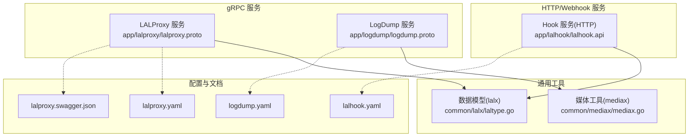
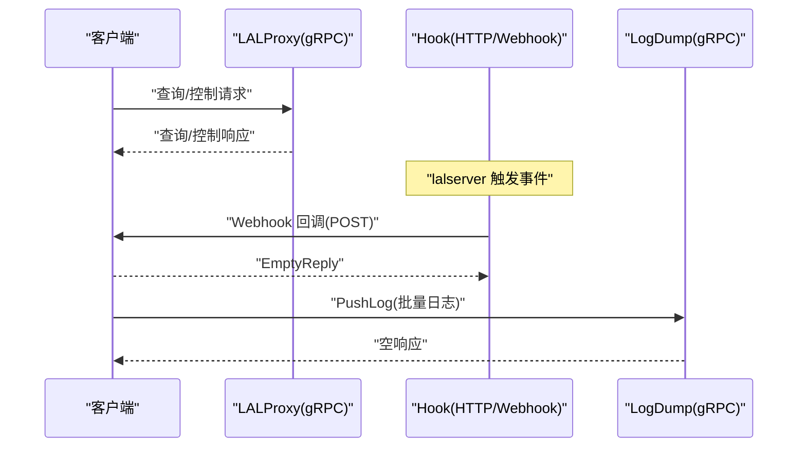
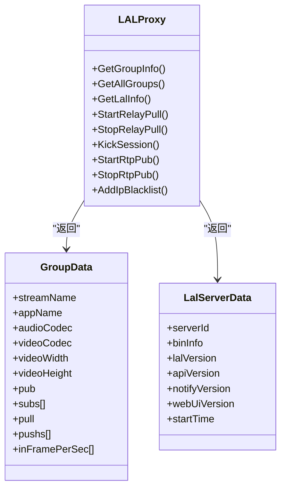
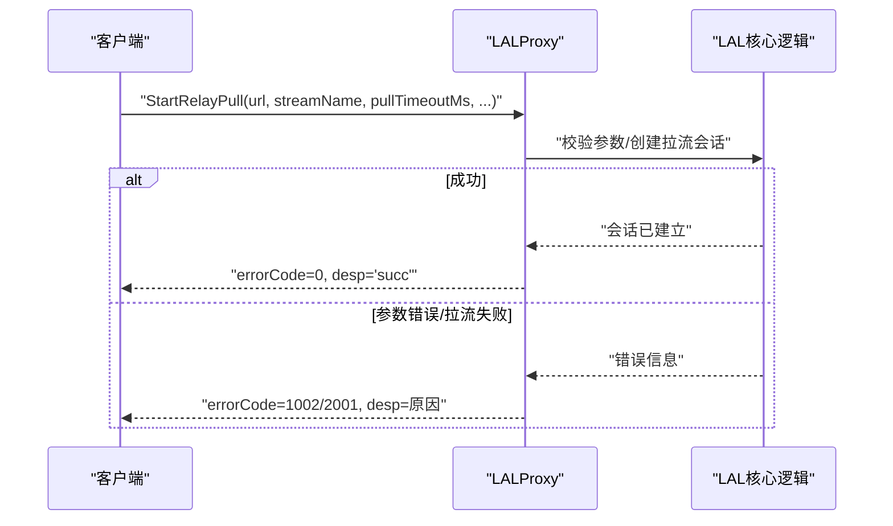
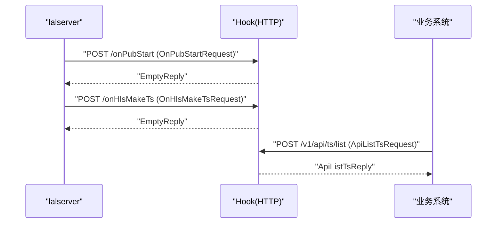
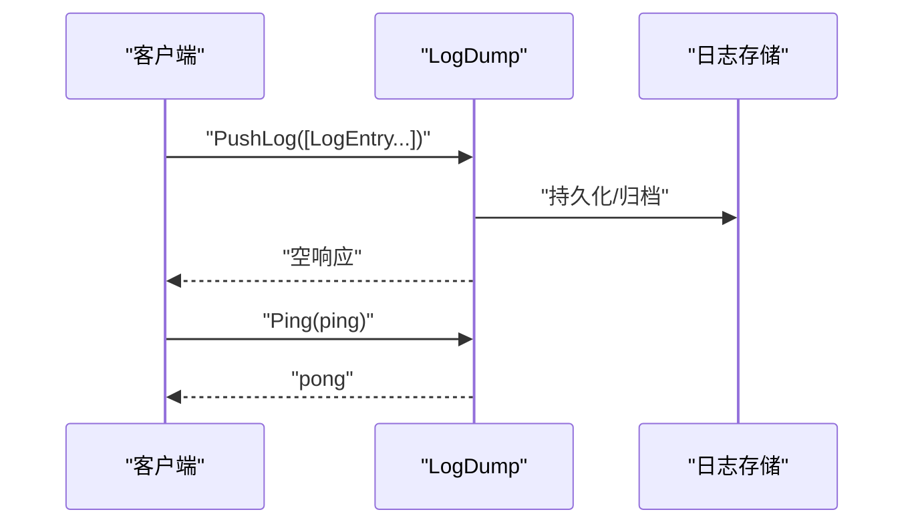
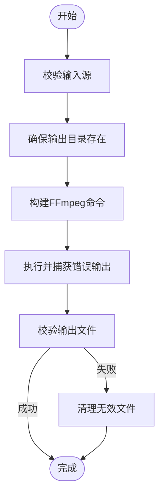
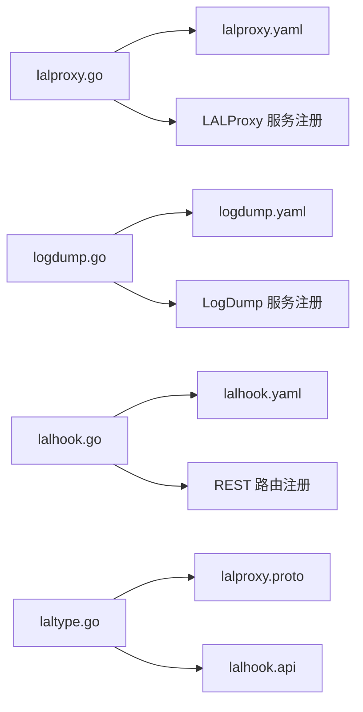

# 媒体服务API

<cite>
**本文引用的文件**
- [lalproxy.proto](file://app/lalproxy/lalproxy.proto)
- [lalhook.api](file://app/lalhook/lalhook.api)
- [logdump.proto](file://app/logdump/logdump.proto)
- [lalproxy.go](file://app/lalproxy/lalproxy.go)
- [logdump.go](file://app/logdump/logdump.go)
- [lalhook.go](file://app/lalhook/lalhook.go)
- [laltype.go](file://common/lalx/laltype.go)
- [mediax.go](file://common/mediax/mediax.go)
- [lalproxy.yaml](file://app/lalproxy/etc/lalproxy.yaml)
- [logdump.yaml](file://app/logdump/etc/logdump.yaml)
- [lalhook.yaml](file://app/lalhook/etc/lalhook.yaml)
- [lalproxy.swagger.json](file://swagger/lalproxy.swagger.json)
</cite>

## 目录
1. [简介](#简介)
2. [项目结构](#项目结构)
3. [核心组件](#核心组件)
4. [架构总览](#架构总览)
5. [详细组件分析](#详细组件分析)
6. [依赖分析](#依赖分析)
7. [性能考虑](#性能考虑)
8. [故障排查指南](#故障排查指南)
9. [结论](#结论)
10. [附录](#附录)

## 简介
本文件面向媒体服务的gRPC API，系统性梳理直播流处理相关的接口与能力，覆盖以下主题：
- LALProxy 服务：流媒体转发、协议转换与质量控制接口
- Hook 服务：Webhook 回调、事件通知与数据处理
- LogDump 服务：日志采集、格式化与传输接口
- 媒体编解码与转码策略：基于FFmpeg的截图与质量控制思路
- 带宽适配与错误恢复：通过会话统计与控制接口实现
- 客户端示例：RTMP 推流、HTTP-FLV 拉流、WebSocket 实时推送的对接要点

## 项目结构
媒体服务相关模块采用“多服务多协议”分层组织：
- gRPC 服务：lalproxy、logdump
- HTTP/Webhook 服务：lalhook
- 通用媒体工具：mediax（截图）、lalx（数据模型映射）
- Swagger 文档：lalproxy.swagger.json

图表来源
- [lalproxy.proto:288-308](file://app/lalproxy/lalproxy.proto#L288-L308)
- [logdump.proto:9-14](file://app/logdump/logdump.proto#L9-L14)
- [lalhook.api:200-245](file://app/lalhook/lalhook.api#L200-L245)
- [laltype.go:1-126](file://common/lalx/laltype.go#L1-L126)
- [mediax.go:1-194](file://common/mediax/mediax.go#L1-L194)
- [lalproxy.yaml:1-19](file://app/lalproxy/etc/lalproxy.yaml#L1-L19)
- [logdump.yaml:1-26](file://app/logdump/etc/logdump.yaml#L1-L26)
- [lalhook.yaml:1-10](file://app/lalhook/etc/lalhook.yaml#L1-L10)
- [lalproxy.swagger.json:1-50](file://swagger/lalproxy.swagger.json#L1-L50)

章节来源
- [lalproxy.go:27-70](file://app/lalproxy/lalproxy.go#L27-L70)
- [logdump.go:27-70](file://app/logdump/logdump.go#L27-L70)
- [lalhook.go:19-48](file://app/lalhook/lalhook.go#L19-L48)

## 核心组件
- LALProxy 服务：提供查询类与控制类接口，覆盖流状态查询、服务器信息查询、中继拉流、会话踢出、RTP 接收端口管理、IP 黑名单等能力。
- Hook 服务(HTTP)：提供 Webhook 回调接口，涵盖 onPubStart/onPubStop、onSubStart/onSubStop、onRelayPullStart/onRelayPullStop、onRtmpConnect、onServerStart、onUpdate、onHlsMakeTs 等事件。
- LogDump 服务：提供 Ping 与 PushLog 接口，用于日志上报与健康检查。

章节来源
- [lalproxy.proto:288-308](file://app/lalproxy/lalproxy.proto#L288-L308)
- [lalhook.api:200-245](file://app/lalhook/lalhook.api#L200-L245)
- [logdump.proto:9-14](file://app/logdump/logdump.proto#L9-L14)

## 架构总览
整体交互由客户端驱动，通过 gRPC 与 HTTP/Webhook 与服务交互，服务内部通过统一的拦截器与注册机制对外提供能力。

图表来源
- [lalproxy.proto:288-308](file://app/lalproxy/lalproxy.proto#L288-L308)
- [lalhook.api:200-245](file://app/lalhook/lalhook.api#L200-L245)
- [logdump.proto:9-14](file://app/logdump/logdump.proto#L9-L14)

## 详细组件分析

### LALProxy 服务（流媒体代理与控制）
- 查询接口
  - GetGroupInfo：按流名称查询分组信息，返回编码、分辨率、会话列表、帧率统计等。
  - GetAllGroups：查询所有活跃分组。
  - GetLalInfo：查询服务器基础信息。
- 控制接口
  - StartRelayPull：从远端拉流，支持 RTMP/RTSP，可配置超时、重试、无输出自动停止、RTSP 模式、调试包存储。
  - StopRelayPull：停止指定流的中继拉流。
  - KickSession：踢出指定会话（支持 PUB/SUB/PULL）。
  - StartRtpPub：打开 GB28181 RTP 接收端口，支持端口、超时、TCP/UDP、调试包存储。
  - StopRtpPub：当前未开放，建议使用 KickSession 替代。
  - AddIpBlacklist：将指定 IP 加入 HLS 黑名单（秒级时长）。

图表来源
- [lalproxy.proto:94-178](file://app/lalproxy/lalproxy.proto#L94-L178)

章节来源
- [lalproxy.proto:138-308](file://app/lalproxy/lalproxy.proto#L138-L308)
- [laltype.go:88-126](file://common/lalx/laltype.go#L88-L126)

#### 控制流程（以 StartRelayPull 为例）

图表来源
- [lalproxy.proto:180-204](file://app/lalproxy/lalproxy.proto#L180-L204)

### Hook 服务（Webhook 回调与事件通知）
- 事件类型
  - onUpdate：周期性上报所有分组与会话信息
  - onPubStart/onPubStop：推流开始/结束
  - onSubStart/onSubStop：拉流开始/结束
  - onRelayPullStart/onRelayPullStop：回源拉流开始/结束
  - onRtmpConnect：RTMP 连接信令
  - onServerStart：服务启动
  - onHlsMakeTs：HLS 生成 TS 分片事件
- API 分组
  - webhook 组：上述回调接口
  - api 组：提供 TS 文件列表查询接口（按时间区间）

图表来源
- [lalhook.api:200-245](file://app/lalhook/lalhook.api#L200-L245)
- [lalhook.api:269-278](file://app/lalhook/lalhook.api#L269-L278)

章节来源
- [lalhook.api:1-280](file://app/lalhook/lalhook.api#L1-L280)

### LogDump 服务（日志收集与传输）
- 接口
  - Ping：健康检查
  - PushLog：批量推送日志条目，支持服务名、级别、序列号、消息与附加字段
- 配置
  - 支持 Nacos 注册、日志级别与保留天数、中间件统计忽略项等

图表来源
- [logdump.proto:9-14](file://app/logdump/logdump.proto#L9-L14)
- [logdump.yaml:1-26](file://app/logdump/etc/logdump.yaml#L1-L26)

章节来源
- [logdump.proto:16-44](file://app/logdump/logdump.proto#L16-L44)
- [logdump.go:27-70](file://app/logdump/logdump.go#L27-L70)

### 媒体编解码与转码策略（截图与质量控制）
- 截图能力
  - 支持按时间点与帧索引截图，输出 JPEG，质量可控
  - 自动目录创建、文件校验、错误捕获与清理
- 转码策略
  - 基于 FFmpeg 的命令构建，支持覆盖输出、错误输出捕获
  - 建议结合 LALProxy 的码率统计与会话信息进行动态码率调整与带宽适配

图表来源
- [mediax.go:32-87](file://common/mediax/mediax.go#L32-L87)
- [mediax.go:89-143](file://common/mediax/mediax.go#L89-L143)

章节来源
- [mediax.go:1-194](file://common/mediax/mediax.go#L1-L194)

### 客户端对接示例（RTMP/HTTP-FLV/WebSocket）
- RTMP 推流
  - 使用推流客户端向 LALProxy 所在节点推流，触发 onPubStart/onPubStop 事件
  - 通过 GetGroupInfo/GetAllGroups 实时查看流状态与会话列表
- HTTP-FLV 拉流
  - 使用浏览器或播放器访问 HTTP-FLV 拉流地址，触发 onSubStart/onSubStop 事件
  - 结合 KickSession 可在异常时踢出特定会话
- WebSocket 实时推送
  - Hook 侧可将 Webhook 事件转发至 WebSocket 通道，实现前端实时展示

章节来源
- [lalhook.api:200-245](file://app/lalhook/lalhook.api#L200-L245)
- [lalproxy.proto:138-178](file://app/lalproxy/lalproxy.proto#L138-L178)

## 依赖分析
- 服务入口与注册
  - LALProxy：通过 zrpc 新建服务，注册 LALProxy 服务，开发/测试模式启用反射
  - LogDump：同上，注册 LogDump 服务
  - Hook：REST 服务，注册路由与跨域策略
- 配置与注册中心
  - LALProxy：可选 Nacos 注册，暴露 gRPC 端口元数据
  - LogDump：默认不注册
- 数据模型映射
  - lalx 提供与 proto/HTTP 返回一致的 Go 结构体字段命名（下划线风格），便于服务间数据一致性

图表来源
- [lalproxy.go:36-66](file://app/lalproxy/lalproxy.go#L36-L66)
- [logdump.go:36-66](file://app/logdump/logdump.go#L36-L66)
- [lalhook.go:28-44](file://app/lalhook/lalhook.go#L28-L44)
- [laltype.go:1-126](file://common/lalx/laltype.go#L1-L126)
- [lalproxy.yaml:1-19](file://app/lalproxy/etc/lalproxy.yaml#L1-L19)
- [logdump.yaml:1-26](file://app/logdump/etc/logdump.yaml#L1-L26)
- [lalhook.yaml:1-10](file://app/lalhook/etc/lalhook.yaml#L1-L10)

章节来源
- [lalproxy.go:27-70](file://app/lalproxy/lalproxy.go#L27-L70)
- [logdump.go:27-70](file://app/logdump/logdump.go#L27-L70)
- [lalhook.go:19-48](file://app/lalhook/lalhook.go#L19-L48)

## 性能考虑
- 会话统计与质量控制
  - 通过 GetGroupInfo 返回的 inFramePerSec、bitrateKbits 等指标，结合 StartRelayPull 的 pullTimeoutMs、pullRetryNum、autoStopPullAfterNoOutMs 实现自适应拉流策略
- 带宽适配
  - 建议依据最近5秒读/写码率与帧率变化趋势，动态调整拉流参数或触发 KickSession 降低压力
- 日志与可观测性
  - LogDump 的 PushLog 支持结构化日志上报，结合中间件统计忽略项减少高频接口对统计的影响
- 编解码与截图
  - 截图时选择合适质量与格式，避免频繁大体积操作影响主业务

## 故障排查指南
- 参数错误
  - StartRelayPull/StopRelayPull/KickSession/AddIpBlacklist 等接口若返回 1002/1001/1003，请检查必填参数与会话状态
- 拉流失败
  - StartRelayPull 返回 2001 时，检查 URL、协议、网络连通性与远端服务状态
- RTP 端口绑定失败
  - StartRtpPub 返回 2002 时，确认端口占用与权限
- 日志上报异常
  - 检查 PushLog 请求体结构与服务端日志级别、保留策略

章节来源
- [lalproxy.proto:198-218](file://app/lalproxy/lalproxy.proto#L198-L218)
- [lalproxy.proto:250-270](file://app/lalproxy/lalproxy.proto#L250-L270)
- [logdump.proto:39-44](file://app/logdump/logdump.proto#L39-L44)

## 结论
本方案通过 gRPC 与 HTTP/Webhook 的组合，实现了对直播流的全生命周期管理：从状态查询、协议转换、质量控制到事件通知与日志采集。配合 FFmpeg 的截图与质量控制能力，可在保证性能的同时满足多样化的业务需求。建议在生产环境中结合会话统计与控制接口，实现自动化的带宽适配与错误恢复。

## 附录
- Swagger 文档
  - LALProxy 服务的 Swagger 定义位于 swagger/lalproxy.swagger.json，可用于接口可视化与联调

章节来源
- [lalproxy.swagger.json:1-50](file://swagger/lalproxy.swagger.json#L1-L50)